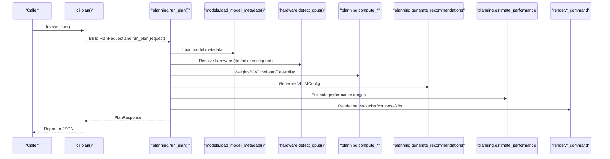
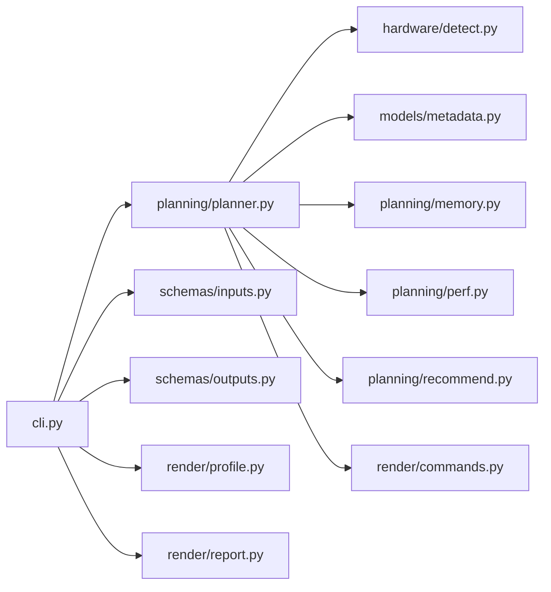
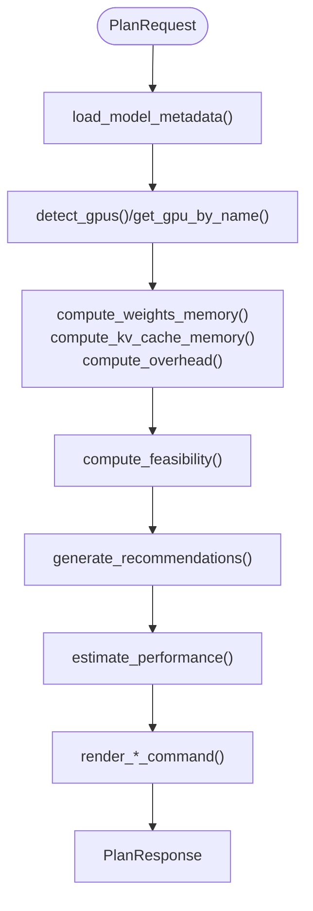

# API Reference

<cite>
**Referenced Files in This Document**
- [__init__.py](file://src/vllm_wizard/__init__.py)
- [cli.py](file://src/vllm_wizard/cli.py)
- [schemas/inputs.py](file://src/vllm_wizard/schemas/inputs.py)
- [schemas/outputs.py](file://src/vllm_wizard/schemas/outputs.py)
- [schemas/profile.py](file://src/vllm_wizard/schemas/profile.py)
- [planning/__init__.py](file://src/vllm_wizard/planning/__init__.py)
- [planning/planner.py](file://src/vllm_wizard/planning/planner.py)
- [planning/memory.py](file://src/vllm_wizard/planning/memory.py)
- [planning/perf.py](file://src/vllm_wizard/planning/perf.py)
- [planning/recommend.py](file://src/vllm_wizard/planning/recommend.py)
- [hardware/__init__.py](file://src/vllm_wizard/hardware/__init__.py)
- [hardware/detect.py](file://src/vllm_wizard/hardware/detect.py)
- [models/metadata.py](file://src/vllm_wizard/models/metadata.py)
- [render/__init__.py](file://src/vllm_wizard/render/__init__.py)
- [render/commands.py](file://src/vllm_wizard/render/commands.py)
- [render/profile.py](file://src/vllm_wizard/render/profile.py)
- [render/report.py](file://src/vllm_wizard/render/report.py)
</cite>

## Table of Contents
1. [Introduction](#introduction)
2. [Project Structure](#project-structure)
3. [Core Components](#core-components)
4. [Architecture Overview](#architecture-overview)
5. [Detailed Component Analysis](#detailed-component-analysis)
6. [Dependency Analysis](#dependency-analysis)
7. [Performance Considerations](#performance-considerations)
8. [Troubleshooting Guide](#troubleshooting-guide)
9. [Conclusion](#conclusion)
10. [Appendices](#appendices)

## Introduction
This API reference documents the internal Python API of the vLLM Wizard project. It covers the planning engine, hardware detection, model metadata extraction, and rendering system. It also defines input and output schemas, enumerations, and public functions exposed by the package’s modules. Guidance is included for programmatic usage, integration patterns, error handling, validation, type annotations, and extension points.

## Project Structure
The project is organized into cohesive modules:
- CLI entrypoints and commands
- Planning engine (memory feasibility, performance estimation, recommendations)
- Hardware detection and tensor-parallel recommendation
- Model metadata extraction from local or Hugging Face repositories
- Rendering of commands, profiles, and reports
- Pydantic-based input/output schemas

```mermaid
graph TB
subgraph "CLI"
CLI["cli.py"]
end
subgraph "Planning"
PLAN_PKG["planning/__init__.py"]
PLAN_RUN["planning/planner.py"]
MEM["planning/memory.py"]
PERF["planning/perf.py"]
REC["planning/recommend.py"]
end
subgraph "Hardware"
HW_PKG["hardware/__init__.py"]
DETECT["hardware/detect.py"]
end
subgraph "Models"
META["models/metadata.py"]
end
subgraph "Render"
REND_PKG["render/__init__.py"]
CMDS["render/commands.py"]
PROF_R["render/profile.py"]
REP["render/report.py"]
end
subgraph "Schemas"
INP["schemas/inputs.py"]
OUT["schemas/outputs.py"]
PROF_S["schemas/profile.py"]
end
CLI --> PLAN_RUN
PLAN_RUN --> DETECT
PLAN_RUN --> META
PLAN_RUN --> MEM
PLAN_RUN --> PERF
PLAN_RUN --> REC
PLAN_RUN --> CMDS
CLI --> INP
CLI --> OUT
CLI --> PROF_R
CLI --> REP
PLAN_PKG --> MEM
PLAN_PKG --> PERF
PLAN_PKG --> REC
PLAN_PKG --> PLAN_RUN
HW_PKG --> DETECT
REND_PKG --> CMDS
REND_PKG --> PROF_R
REND_PKG --> REP
```

**Diagram sources**
- [cli.py](file://src/vllm_wizard/cli.py#L1-L385)
- [planning/__init__.py](file://src/vllm_wizard/planning/__init__.py#L1-L32)
- [planning/planner.py](file://src/vllm_wizard/planning/planner.py#L1-L172)
- [planning/memory.py](file://src/vllm_wizard/planning/memory.py#L1-L367)
- [planning/perf.py](file://src/vllm_wizard/planning/perf.py#L1-L220)
- [planning/recommend.py](file://src/vllm_wizard/planning/recommend.py#L1-L333)
- [hardware/__init__.py](file://src/vllm_wizard/hardware/__init__.py#L1-L9)
- [hardware/detect.py](file://src/vllm_wizard/hardware/detect.py#L1-L229)
- [models/metadata.py](file://src/vllm_wizard/models/metadata.py#L1-L255)
- [render/__init__.py](file://src/vllm_wizard/render/__init__.py#L1-L20)
- [render/commands.py](file://src/vllm_wizard/render/commands.py#L1-L196)
- [render/profile.py](file://src/vllm_wizard/render/profile.py)
- [render/report.py](file://src/vllm_wizard/render/report.py)
- [schemas/inputs.py](file://src/vllm_wizard/schemas/inputs.py#L1-L110)
- [schemas/outputs.py](file://src/vllm_wizard/schemas/outputs.py#L1-L118)
- [schemas/profile.py](file://src/vllm_wizard/schemas/profile.py#L1-L75)

**Section sources**
- [cli.py](file://src/vllm_wizard/cli.py#L1-L385)
- [planning/__init__.py](file://src/vllm_wizard/planning/__init__.py#L1-L32)
- [hardware/__init__.py](file://src/vllm_wizard/hardware/__init__.py#L1-L9)
- [render/__init__.py](file://src/vllm_wizard/render/__init__.py#L1-L20)
- [schemas/inputs.py](file://src/vllm_wizard/schemas/inputs.py#L1-L110)
- [schemas/outputs.py](file://src/vllm_wizard/schemas/outputs.py#L1-L118)
- [schemas/profile.py](file://src/vllm_wizard/schemas/profile.py#L1-L75)

## Core Components
This section summarizes the primary public APIs grouped by module.

- CLI Commands
  - detect: Lists detected GPUs or prints as JSON
  - plan: Builds a PlanRequest, runs planning, and renders a console report or JSON
  - generate: Builds a PlanRequest, runs planning, and writes artifacts to disk

- Planning Engine
  - run_plan: Orchestrates metadata loading, hardware resolution, memory feasibility, recommendations, performance estimation, and artifact generation
  - compute_* helpers: Memory computations and feasibility checks
  - estimate_performance: Heuristic performance estimation
  - generate_recommendations: Produces a VLLMConfig with tuned parameters

- Hardware Detection
  - detect_gpus: Queries nvidia-smi and enriches GPUInfo
  - recommend_tensor_parallel: Recommends TP size
  - get_gpu_by_name: Approximates VRAM for known GPU names

- Model Metadata
  - load_model_metadata: Loads and parses config.json from local or HF Hub
  - ModelMetadata: Dataclass with architecture fields and derived properties

- Rendering
  - render_serve_command, render_docker_command, render_docker_compose, render_k8s_values: Generate runnable commands and deployment manifests
  - load_profile, save_profile, profile_to_request, request_to_profile: Profile serialization and conversion
  - render_console_report, render_json: Human-readable and JSON reporting

- Schemas
  - Inputs: DType, Quantization, KVCacheDType, Interconnect, BatchingMode, ModelInput, HardwareInput, WorkloadInput, PolicyInput, PlanRequest
  - Outputs: GPUInfo, FeasibilityReport, VLLMConfig, PerfEstimate, Artifacts, PlanResponse
  - Profile: ProfileModel, ProfileHardware, ProfileWorkload, ProfilePolicy, ProfileOutputs, Profile

**Section sources**
- [cli.py](file://src/vllm_wizard/cli.py#L62-L381)
- [planning/planner.py](file://src/vllm_wizard/planning/planner.py#L21-L135)
- [planning/memory.py](file://src/vllm_wizard/planning/memory.py#L31-L367)
- [planning/perf.py](file://src/vllm_wizard/planning/perf.py#L136-L220)
- [planning/recommend.py](file://src/vllm_wizard/planning/recommend.py#L167-L333)
- [hardware/detect.py](file://src/vllm_wizard/hardware/detect.py#L10-L229)
- [models/metadata.py](file://src/vllm_wizard/models/metadata.py#L209-L255)
- [render/commands.py](file://src/vllm_wizard/render/commands.py#L6-L196)
- [schemas/inputs.py](file://src/vllm_wizard/schemas/inputs.py#L54-L110)
- [schemas/outputs.py](file://src/vllm_wizard/schemas/outputs.py#L17-L118)
- [schemas/profile.py](file://src/vllm_wizard/schemas/profile.py#L16-L75)

## Architecture Overview
The planning pipeline integrates hardware detection, model metadata extraction, memory feasibility computation, recommendation engine, performance estimation, and artifact rendering.



**Diagram sources**
- [cli.py](file://src/vllm_wizard/cli.py#L82-L213)
- [planning/planner.py](file://src/vllm_wizard/planning/planner.py#L21-L135)
- [models/metadata.py](file://src/vllm_wizard/models/metadata.py#L209-L255)
- [hardware/detect.py](file://src/vllm_wizard/hardware/detect.py#L10-L72)
- [planning/memory.py](file://src/vllm_wizard/planning/memory.py#L31-L271)
- [planning/recommend.py](file://src/vllm_wizard/planning/recommend.py#L167-L333)
- [planning/perf.py](file://src/vllm_wizard/planning/perf.py#L136-L220)
- [render/commands.py](file://src/vllm_wizard/render/commands.py#L6-L196)

## Detailed Component Analysis

### CLI API
Public entrypoints and their responsibilities:
- detect: Detects GPUs and prints a formatted list or JSON
- plan: Builds PlanRequest from CLI options or profile, runs planning, prints report or JSON
- generate: Builds PlanRequest, runs planning, writes artifacts to output directory

Key behaviors:
- Input parsing and validation via Typer options
- Error handling with colored console output and exit codes
- JSON vs human-readable output toggles

Programmatic usage patterns:
- Construct PlanRequest programmatically and call run_plan
- Use load_profile/save_profile for persistent configuration snapshots

**Section sources**
- [cli.py](file://src/vllm_wizard/cli.py#L62-L381)

### Planning Engine API
- run_plan(request: PlanRequest) -> PlanResponse
  - Orchestrates metadata loading, hardware resolution, memory feasibility, recommendations, performance estimation, and artifact rendering
  - Raises ValueError if no GPUs are detected or specified
- compute_weights_memory(params_b, dtype, quantization) -> bytes
- compute_kv_cache_memory(metadata, context_len, concurrency, kv_dtype, dtype, fragmentation_factor) -> bytes
- compute_overhead(vram_total_bytes, tp_size, fixed_overhead_gb) -> bytes
- compute_feasibility(...) -> FeasibilityReport
- compute_max_concurrency_at_context(...)
- compute_max_context_at_concurrency(...)
- estimate_performance(gpu_name, params_b, tp_size, context_len, prompt_tokens, quantization, interconnect, num_gpus) -> PerfEstimate
- generate_recommendations(request, metadata, gpus, vram_total_bytes) -> VLLMConfig

Integration patterns:
- Call run_plan with a populated PlanRequest
- Use compute_* functions independently for custom logic
- Combine estimate_performance with feasibility results for richer reports

**Section sources**
- [planning/planner.py](file://src/vllm_wizard/planning/planner.py#L21-L172)
- [planning/memory.py](file://src/vllm_wizard/planning/memory.py#L31-L367)
- [planning/perf.py](file://src/vllm_wizard/planning/perf.py#L136-L220)
- [planning/recommend.py](file://src/vllm_wizard/planning/recommend.py#L167-L333)

### Hardware Detection API
- detect_gpus() -> list[GPUInfo]
  - Executes nvidia-smi and enriches with driver/CUDA versions and compute capability
  - Returns empty list on failure
- recommend_tensor_parallel(gpus: list[GPUInfo]) -> int
  - Largest power-of-two tensor-parallel size ≤ number of GPUs
- get_gpu_by_name(name: str) -> Optional[GPUInfo]
  - Approximates VRAM for known GPU names

Usage:
- Call detect_gpus() when hardware.gpu == "auto"
- Use recommend_tensor_parallel to auto-size TP
- Fallback to get_gpu_by_name for manual VRAM estimation

**Section sources**
- [hardware/detect.py](file://src/vllm_wizard/hardware/detect.py#L10-L229)

### Model Metadata API
- load_model_metadata(model_id_or_path, revision, trust_remote_code, params_b) -> ModelMetadata
  - Loads config.json from local path or HF Hub
  - Parses architecture fields and derives head_dim
  - Estimates or sets num_params
- ModelMetadata fields and properties
  - num_hidden_layers, hidden_size, num_attention_heads, num_key_value_heads, vocab_size, max_position_embeddings, model_type, intermediate_size, num_params
  - head_dim property
  - params_billions property

Validation and errors:
- Raises FileNotFoundError if local config not found
- Raises ValueError for missing required fields or invalid config structure

**Section sources**
- [models/metadata.py](file://src/vllm_wizard/models/metadata.py#L209-L255)

### Rendering API
- render_serve_command(config: VLLMConfig) -> str
- render_docker_command(config: VLLMConfig) -> str
- render_docker_compose(config: VLLMConfig) -> str
- render_k8s_values(config: VLLMConfig) -> str
- load_profile(path: Path) -> Profile
- save_profile(profile: Profile, path: Path) -> None
- profile_to_request(profile: Profile) -> PlanRequest
- request_to_profile(request: PlanRequest, emit: list[str]) -> Profile
- render_console_report(response: PlanResponse, console) -> None
- render_json(response: PlanResponse) -> str

Integration patterns:
- Use render_* functions to produce runnable commands and deployment manifests
- Serialize/deserialize configurations via profile functions

**Section sources**
- [render/commands.py](file://src/vllm_wizard/render/commands.py#L6-L196)
- [render/profile.py](file://src/vllm_wizard/render/profile.py)
- [render/report.py](file://src/vllm_wizard/render/report.py)

### Schemas and Data Models
Input schemas (BaseModel subclasses):
- DType: AUTO, FP16, BF16, FP32
- Quantization: NONE, AWQ, GPTQ, INT8, FP8
- KVCacheDType: AUTO, FP16, BF16, FP8_E4M3FN, FP8_E5M2
- Interconnect: PCIE, NVLINK, UNKNOWN
- BatchingMode: THROUGHPUT, LATENCY, BALANCED
- ModelInput: model, revision, trust_remote_code, dtype, quantization, kv_cache_dtype, max_model_len, tokenizer, params_b
- HardwareInput: gpu, gpus, vram_gb, interconnect, tensor_parallel_size
- WorkloadInput: prompt_tokens, gen_tokens, concurrency, target_latency_ms, streaming, batching_mode
- PolicyInput: gpu_memory_utilization, overhead_gb, fragmentation_factor, headroom_gb
- PlanRequest: model, hardware, workload, policy, explain

Output schemas:
- GPUInfo: name, vram_mib, compute_capability, driver_version, cuda_version (+ vram_gb, vram_gib properties)
- FeasibilityReport: fits, oom_risk, vram_total_gb, vram_target_alloc_gb, weights_gb, kv_cache_gb, overhead_gb, headroom_gb, max_concurrency_at_context, max_context_at_concurrency, warnings
- VLLMConfig: model, tensor_parallel_size, dtype, gpu_memory_utilization, max_model_len, kv_cache_dtype, quantization, swap_space, enforce_eager, max_num_seqs, max_num_batched_tokens, trust_remote_code, explanations
- PerfEstimate: decode_toks_per_s_range, prefill_toks_per_s_range, ttft_ms_range, assumptions
- Artifacts: serve_command, docker_command, docker_compose, k8s_values
- PlanResponse: feasibility, config, performance, artifacts (+ model_dump_json_pretty, to_dict helpers)

Profile schema:
- ProfileModel, ProfileHardware, ProfileWorkload, ProfilePolicy, ProfileOutputs
- Profile: profile_version, model, hardware, workload, policy, outputs

Validation:
- Pydantic field constraints (gt/ge/le ranges, enums, required fields)
- Runtime exceptions raised on invalid inputs

**Section sources**
- [schemas/inputs.py](file://src/vllm_wizard/schemas/inputs.py#L9-L110)
- [schemas/outputs.py](file://src/vllm_wizard/schemas/outputs.py#L17-L118)
- [schemas/profile.py](file://src/vllm_wizard/schemas/profile.py#L16-L75)

### Extension Points and Plugin Interfaces
- Hardware detection extensibility:
  - Implement alternative detection backends by returning GPUInfo-compatible structures
  - Replace recommend_tensor_parallel with custom logic
- Model metadata extensibility:
  - Extend load_model_metadata to support additional model sources or caching layers
- Rendering extensibility:
  - Add new render_* functions for additional platforms or formats
  - Extend ProfileOutputs to include custom runtime arguments
- Planning extensibility:
  - Provide custom compute_* functions or integrate external memory calculators
  - Swap estimate_performance with ML-based estimators

[No sources needed since this section provides general guidance]

## Dependency Analysis
Module-level dependencies and coupling:
- CLI depends on planning, hardware, render, and schemas modules
- Planning orchestrator depends on hardware, models, memory, perf, recommend, and render
- Hardware detection depends on subprocess and schemas
- Rendering depends on schemas outputs
- Schemas are shared across modules and define contracts



**Diagram sources**
- [cli.py](file://src/vllm_wizard/cli.py#L1-L385)
- [planning/planner.py](file://src/vllm_wizard/planning/planner.py#L1-L172)
- [hardware/detect.py](file://src/vllm_wizard/hardware/detect.py#L1-L229)
- [models/metadata.py](file://src/vllm_wizard/models/metadata.py#L1-L255)
- [planning/memory.py](file://src/vllm_wizard/planning/memory.py#L1-L367)
- [planning/perf.py](file://src/vllm_wizard/planning/perf.py#L1-L220)
- [planning/recommend.py](file://src/vllm_wizard/planning/recommend.py#L1-L333)
- [render/commands.py](file://src/vllm_wizard/render/commands.py#L1-L196)
- [schemas/inputs.py](file://src/vllm_wizard/schemas/inputs.py#L1-L110)
- [schemas/outputs.py](file://src/vllm_wizard/schemas/outputs.py#L1-L118)
- [render/profile.py](file://src/vllm_wizard/render/profile.py)
- [render/report.py](file://src/vllm_wizard/render/report.py)

**Section sources**
- [cli.py](file://src/vllm_wizard/cli.py#L1-L385)
- [planning/planner.py](file://src/vllm_wizard/planning/planner.py#L1-L172)
- [hardware/detect.py](file://src/vllm_wizard/hardware/detect.py#L1-L229)
- [models/metadata.py](file://src/vllm_wizard/models/metadata.py#L1-L255)
- [planning/memory.py](file://src/vllm_wizard/planning/memory.py#L1-L367)
- [planning/perf.py](file://src/vllm_wizard/planning/perf.py#L1-L220)
- [planning/recommend.py](file://src/vllm_wizard/planning/recommend.py#L1-L333)
- [render/commands.py](file://src/vllm_wizard/render/commands.py#L1-L196)
- [schemas/inputs.py](file://src/vllm_wizard/schemas/inputs.py#L1-L110)
- [schemas/outputs.py](file://src/vllm_wizard/schemas/outputs.py#L1-L118)
- [render/profile.py](file://src/vllm_wizard/render/profile.py)
- [render/report.py](file://src/vllm_wizard/render/report.py)

## Performance Considerations
- Memory calculations use conservative fragmentation factors and utilization targets; adjust PolicyInput fragmentation_factor and gpu_memory_utilization to tune aggressiveness
- Performance estimates are heuristic and include ranges; actual performance depends on vLLM version, drivers, and runtime conditions
- Tensor-parallel scaling efficiency depends on interconnect type; NVLINK yields better scaling than PCIe
- KV cache pressure thresholds guide KV cache dtype recommendations; consider FP8 KV cache on supported GPUs when pressure is high

[No sources needed since this section provides general guidance]

## Troubleshooting Guide
Common exceptions and handling:
- ValueError: Raised for invalid inputs, missing model metadata, or insufficient VRAM configuration
- FileNotFoundError: Raised when local config.json is not found
- subprocess.TimeoutExpired and generic Exception: Swallowed by hardware detection to return empty lists
- CLI catches ValueError, FileNotFoundError, and generic exceptions, printing colored error messages and exiting with non-zero status

Operational tips:
- Ensure nvidia-smi is installed and accessible when relying on auto-detection
- Provide explicit --gpu and --vram-gb when auto-detection fails
- Use --explain to include recommendation rationales in VLLMConfig.explanations
- Validate inputs against Pydantic constraints (e.g., positive integers, enum values)

**Section sources**
- [cli.py](file://src/vllm_wizard/cli.py#L204-L212)
- [cli.py](file://src/vllm_wizard/cli.py#L372-L380)
- [hardware/detect.py](file://src/vllm_wizard/hardware/detect.py#L65-L71)
- [planning/planner.py](file://src/vllm_wizard/planning/planner.py#L42-L45)

## Conclusion
The vLLM Wizard exposes a cohesive internal API centered around a planning pipeline that integrates hardware detection, model metadata extraction, memory feasibility, recommendations, and artifact rendering. Its schema-driven design ensures strong validation and clear contracts. The CLI provides convenient entrypoints, while the underlying modules enable programmatic integration and customization.

[No sources needed since this section summarizes without analyzing specific files]

## Appendices

### API Index
- CLI
  - detect(json_output: bool) -> None
  - plan(...options...) -> None
  - generate(...options...) -> None
- Planning
  - run_plan(request: PlanRequest) -> PlanResponse
  - compute_weights_memory(params_b, dtype, quantization) -> int
  - compute_kv_cache_memory(metadata, context_len, concurrency, kv_dtype, dtype, fragmentation_factor) -> int
  - compute_overhead(vram_total_bytes, tp_size, fixed_overhead_gb) -> int
  - compute_feasibility(...)-> FeasibilityReport
  - compute_max_concurrency_at_context(...)
  - compute_max_context_at_concurrency(...)
  - estimate_performance(gpu_name, params_b, tp_size, context_len, prompt_tokens, quantization, interconnect, num_gpus) -> PerfEstimate
  - generate_recommendations(request, metadata, gpus, vram_total_bytes) -> VLLMConfig
- Hardware
  - detect_gpus() -> list[GPUInfo]
  - recommend_tensor_parallel(gpus: list[GPUInfo]) -> int
  - get_gpu_by_name(name: str) -> Optional[GPUInfo]
- Models
  - load_model_metadata(model_id_or_path, revision, trust_remote_code, params_b) -> ModelMetadata
- Rendering
  - render_serve_command(config: VLLMConfig) -> str
  - render_docker_command(config: VLLMConfig) -> str
  - render_docker_compose(config: VLLMConfig) -> str
  - render_k8s_values(config: VLLMConfig) -> str
  - load_profile(path: Path) -> Profile
  - save_profile(profile: Profile, path: Path) -> None
  - profile_to_request(profile: Profile) -> PlanRequest
  - request_to_profile(request: PlanRequest, emit: list[str]) -> Profile
  - render_console_report(response: PlanResponse, console) -> None
  - render_json(response: PlanResponse) -> str

**Section sources**
- [cli.py](file://src/vllm_wizard/cli.py#L62-L381)
- [planning/planner.py](file://src/vllm_wizard/planning/planner.py#L21-L172)
- [planning/memory.py](file://src/vllm_wizard/planning/memory.py#L31-L367)
- [planning/perf.py](file://src/vllm_wizard/planning/perf.py#L136-L220)
- [planning/recommend.py](file://src/vllm_wizard/planning/recommend.py#L167-L333)
- [hardware/detect.py](file://src/vllm_wizard/hardware/detect.py#L10-L229)
- [models/metadata.py](file://src/vllm_wizard/models/metadata.py#L209-L255)
- [render/commands.py](file://src/vllm_wizard/render/commands.py#L6-L196)
- [render/profile.py](file://src/vllm_wizard/render/profile.py)
- [render/report.py](file://src/vllm_wizard/render/report.py)

### Programmatic Usage Examples
- Build a PlanRequest programmatically and run planning:
  - Populate ModelInput, HardwareInput, WorkloadInput, PolicyInput
  - Call run_plan(request) to obtain PlanResponse
  - Access feasibility, config, performance, and artifacts
- Generate artifacts to disk:
  - Call generate with --output-dir and desired --emit options
  - Save and load profiles via save_profile/load_profile and profile_to_request/request_to_profile
- Integrate hardware detection:
  - Call detect_gpus() and use recommend_tensor_parallel for TP sizing
  - Fallback to get_gpu_by_name for manual VRAM estimation

**Section sources**
- [cli.py](file://src/vllm_wizard/cli.py#L155-L203)
- [cli.py](file://src/vllm_wizard/cli.py#L275-L380)
- [planning/planner.py](file://src/vllm_wizard/planning/planner.py#L21-L135)
- [render/profile.py](file://src/vllm_wizard/render/profile.py)

### Error Handling and Validation Mechanisms
- Pydantic validation enforces field constraints and types
- CLI wraps planning in try/catch blocks and prints user-friendly messages
- Hardware detection handles missing binaries and timeouts gracefully
- Planning raises ValueError when hardware cannot be resolved

**Section sources**
- [cli.py](file://src/vllm_wizard/cli.py#L204-L212)
- [cli.py](file://src/vllm_wizard/cli.py#L372-L380)
- [hardware/detect.py](file://src/vllm_wizard/hardware/detect.py#L65-L71)
- [planning/planner.py](file://src/vllm_wizard/planning/planner.py#L42-L45)

### Type Annotations and Data Flow Diagrams
- All public functions include type hints and return types
- Data flows from CLI through planning to rendering and schemas



**Diagram sources**
- [planning/planner.py](file://src/vllm_wizard/planning/planner.py#L21-L135)
- [models/metadata.py](file://src/vllm_wizard/models/metadata.py#L209-L255)
- [hardware/detect.py](file://src/vllm_wizard/hardware/detect.py#L10-L229)
- [planning/memory.py](file://src/vllm_wizard/planning/memory.py#L31-L271)
- [planning/recommend.py](file://src/vllm_wizard/planning/recommend.py#L167-L333)
- [planning/perf.py](file://src/vllm_wizard/planning/perf.py#L136-L220)
- [render/commands.py](file://src/vllm_wizard/render/commands.py#L6-L196)
- [schemas/outputs.py](file://src/vllm_wizard/schemas/outputs.py#L103-L118)

### Extension Points and Plugin Interfaces
- Implement custom hardware backends by returning GPUInfo-compatible structures
- Add new renderers by implementing render_* functions
- Extend model metadata loaders for additional sources
- Customize recommendation logic by replacing generate_recommendations

[No sources needed since this section provides general guidance]

### API Versioning and Compatibility
- Package version is defined in __init__.py
- Profile schema includes profile_version for future migrations
- Schemas use Pydantic BaseModel for backward-compatible field additions where possible

**Section sources**
- [__init__.py](file://src/vllm_wizard/__version__)
- [schemas/profile.py](file://src/vllm_wizard/schemas/profile.py#L69-L74)

### Migration Guides and Deprecation Notices
- No explicit deprecations are present in the current codebase
- When extending or modifying schemas, increment profile_version and maintain backward compatibility where feasible
- Prefer using request_to_profile and profile_to_request for serialization to minimize breaking changes

[No sources needed since this section provides general guidance]