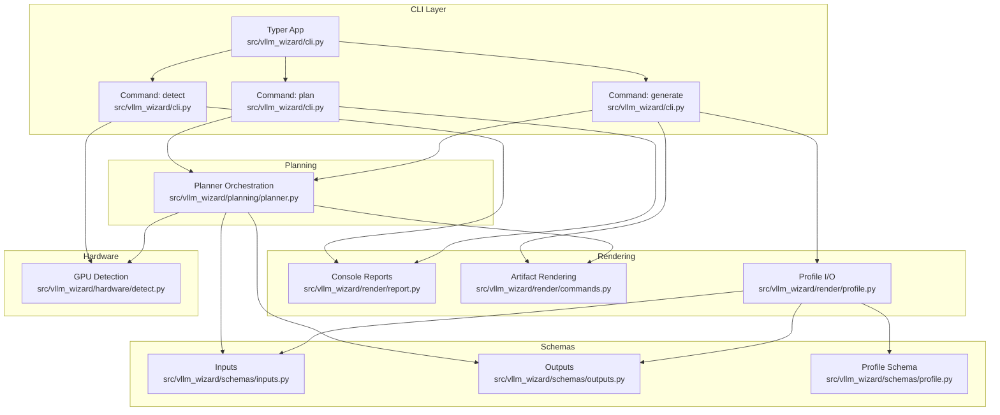
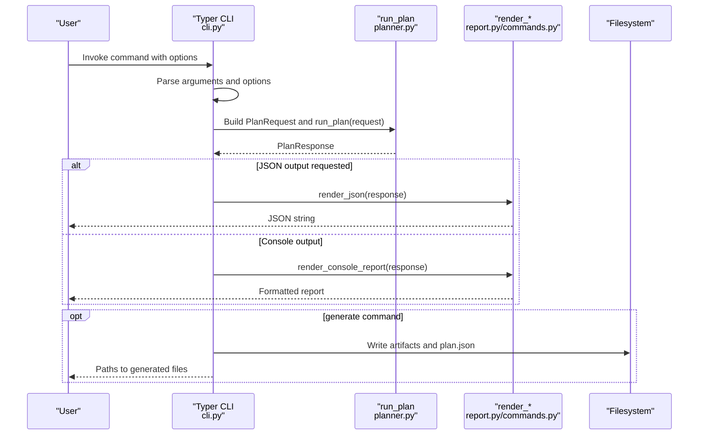
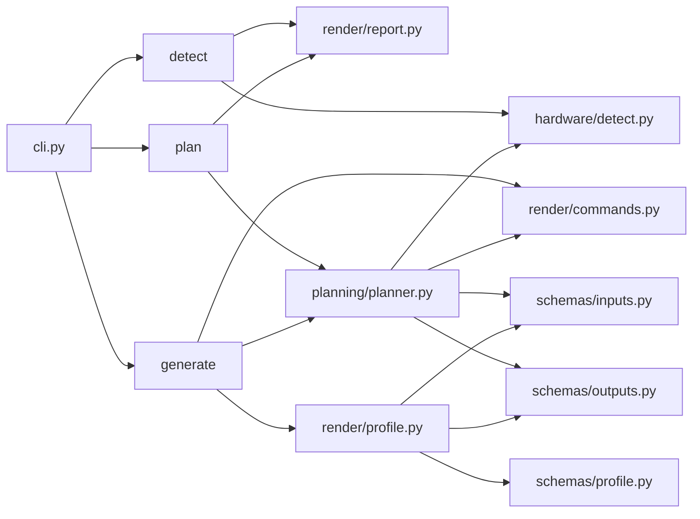

# CLI Integration API

<cite>
**Referenced Files in This Document**
- [cli.py](file://src/vllm_wizard/cli.py)
- [__init__.py](file://src/vllm_wizard/__init__.py)
- [planner.py](file://src/vllm_wizard/planning/planner.py)
- [commands.py](file://src/vllm_wizard/render/commands.py)
- [report.py](file://src/vllm_wizard/render/report.py)
- [profile.py](file://src/vllm_wizard/render/profile.py)
- [detect.py](file://src/vllm_wizard/hardware/detect.py)
- [inputs.py](file://src/vllm_wizard/schemas/inputs.py)
- [outputs.py](file://src/vllm_wizard/schemas/outputs.py)
- [profile_schema.py](file://src/vllm_wizard/schemas/profile.py)
- [pyproject.toml](file://pyproject.toml)
- [README.md](file://README.md)
- [sample.yaml](file://examples/profiles/sample.yaml)
- [test_cli.py](file://tests/test_cli.py)
</cite>

## Table of Contents
1. [Introduction](#introduction)
2. [Project Structure](#project-structure)
3. [Core Components](#core-components)
4. [Architecture Overview](#architecture-overview)
5. [Detailed Component Analysis](#detailed-component-analysis)
6. [Dependency Analysis](#dependency-analysis)
7. [Performance Considerations](#performance-considerations)
8. [Troubleshooting Guide](#troubleshooting-guide)
9. [Conclusion](#conclusion)
10. [Appendices](#appendices)

## Introduction
This document describes the CLI integration layer that exposes the internal Python API through Typer-based command-line interfaces. It documents the command definitions, argument parsing, callback functions, programmatic entry points, and the internal API calls behind each CLI command. It also covers JSON output formats, scripting integration patterns, and guidance for extending the CLI with new commands and customizing existing ones.

## Project Structure
The CLI integration is centered around a single Typer application that orchestrates three primary commands:
- detect: Lists available NVIDIA GPUs and optionally outputs JSON
- plan: Computes VRAM feasibility, recommendations, and performance estimates
- generate: Generates configuration artifacts to disk and JSON

**Diagram sources**
- [cli.py](file://src/vllm_wizard/cli.py#L35-L385)
- [planner.py](file://src/vllm_wizard/planning/planner.py#L21-L172)
- [commands.py](file://src/vllm_wizard/render/commands.py#L6-L196)
- [report.py](file://src/vllm_wizard/render/report.py#L14-L272)
- [profile.py](file://src/vllm_wizard/render/profile.py#L46-L173)
- [detect.py](file://src/vllm_wizard/hardware/detect.py#L10-L229)
- [inputs.py](file://src/vllm_wizard/schemas/inputs.py#L54-L110)
- [outputs.py](file://src/vllm_wizard/schemas/outputs.py#L103-L118)
- [profile_schema.py](file://src/vllm_wizard/schemas/profile.py#L66-L75)

**Section sources**
- [cli.py](file://src/vllm_wizard/cli.py#L35-L385)
- [pyproject.toml](file://pyproject.toml#L49-L50)

## Core Components
- Typer Application: Defines the CLI app, global callback, and commands.
- Commands:
  - detect: Parses options, detects GPUs, prints console or JSON output.
  - plan: Builds PlanRequest, runs planner, renders console report or JSON.
  - generate: Builds PlanRequest, runs planner, writes artifacts and JSON.
- Programmatic Entry Points:
  - app: Typer application instance exported for console script entry point.
  - run_plan: Internal planner orchestration invoked by plan and generate.
  - render_*: Functions to produce console reports and artifacts.
  - load_profile/request_to_profile/save_profile: Profile I/O helpers.
  - detect_gpus: Hardware detection via nvidia-smi.

**Section sources**
- [cli.py](file://src/vllm_wizard/cli.py#L35-L385)
- [planner.py](file://src/vllm_wizard/planning/planner.py#L21-L172)
- [report.py](file://src/vllm_wizard/render/report.py#L14-L272)
- [commands.py](file://src/vllm_wizard/render/commands.py#L6-L196)
- [profile.py](file://src/vllm_wizard/render/profile.py#L46-L173)
- [detect.py](file://src/vllm_wizard/hardware/detect.py#L10-L229)
- [pyproject.toml](file://pyproject.toml#L49-L50)

## Architecture Overview
The CLI integrates with internal APIs through a clear separation of concerns:
- CLI layer parses arguments and orchestrates I/O
- Planner composes model metadata, hardware resolution, memory computation, feasibility, recommendations, and performance
- Renderers produce human-readable console reports and machine-readable artifacts
- Profiles enable round-trip persistence and regeneration

**Diagram sources**
- [cli.py](file://src/vllm_wizard/cli.py#L62-L381)
- [planner.py](file://src/vllm_wizard/planning/planner.py#L21-L135)
- [report.py](file://src/vllm_wizard/render/report.py#L14-L238)
- [commands.py](file://src/vllm_wizard/render/commands.py#L6-L196)

## Detailed Component Analysis

### Typer Application and Callback
- Application definition: Creates a Typer app with name and help text, sets no_args_is_help behavior.
- Global callback: Handles --version option via a callback that prints version and exits.

Key behaviors:
- Version callback triggers eagerly and exits after printing.
- No global state is maintained; commands are stateless functions.

**Section sources**
- [cli.py](file://src/vllm_wizard/cli.py#L35-L59)
- [__init__.py](file://src/vllm_wizard/__init__.py#L1-L4)

### Command: detect
Purpose: Detect and list available NVIDIA GPUs, optionally as JSON.

Arguments and options:
- --json: Boolean flag to output JSON instead of a formatted table.

Processing logic:
- Calls detect_gpus to query nvidia-smi and enrich GPU info with driver/CUDA/compute capability.
- Prints a Rich-formatted table if JSON is not requested.
- Prints a JSON array of GPUInfo objects if --json is set.

Error handling:
- Gracefully handles missing nvidia-smi or detection failures by printing a user-friendly message.

JSON output format:
- Array of GPUInfo objects with fields: name, vram_mib, compute_capability, driver_version, cuda_version.

**Section sources**
- [cli.py](file://src/vllm_wizard/cli.py#L62-L80)
- [detect.py](file://src/vllm_wizard/hardware/detect.py#L10-L72)
- [report.py](file://src/vllm_wizard/render/report.py#L241-L272)
- [outputs.py](file://src/vllm_wizard/schemas/outputs.py#L17-L35)

### Command: plan
Purpose: Compute VRAM feasibility, recommendations, performance estimates, and optionally output JSON.

Argument categories:
- Model options: model id/path, revision, trust_remote_code, dtype, quantization, kv_cache_dtype, max_model_len, params_b.
- Hardware options: gpu (auto or name), gpus, vram_gb, interconnect, tensor_parallel_size.
- Workload options: prompt_tokens, gen_tokens, concurrency, batching_mode.
- Policy options: gpu_memory_utilization, overhead_gb, fragmentation_factor, headroom_gb.
- Output options: --profile (YAML), --json (JSON), --explain (include parameter explanations).

Processing logic:
- If --profile is provided, loads YAML and converts to PlanRequest.
- Otherwise, constructs PlanRequest from parsed options.
- Invokes run_plan(request) to compute feasibility, config, performance, and artifacts.
- Renders either a Rich console report or JSON depending on --json.

Error handling:
- Catches ValueError/FileNotFoundError and raises typer.Exit(1) with red-colored error messages.

JSON output format:
- Top-level keys: feasibility, config, performance, artifacts.
- feasibility: includes fits, oom_risk, vram totals, component sizes, headroom, warnings.
- config: recommended vLLM serve parameters including model, tensor_parallel_size, dtype, gpu_memory_utilization, max_model_len, optional extras, and explanations.
- performance: estimated decode/prefill tokens/s and TTFT ranges with assumptions.
- artifacts: serve_command, docker_command, docker_compose, k8s_values.

Scripting integration patterns:
- Use --json to pipe output into jq or other processors.
- Combine with --explain to include parameter explanations for downstream consumers.

**Section sources**
- [cli.py](file://src/vllm_wizard/cli.py#L82-L213)
- [planner.py](file://src/vllm_wizard/planning/planner.py#L21-L135)
- [report.py](file://src/vllm_wizard/render/report.py#L14-L238)
- [outputs.py](file://src/vllm_wizard/schemas/outputs.py#L103-L118)
- [inputs.py](file://src/vllm_wizard/schemas/inputs.py#L102-L110)

### Command: generate
Purpose: Generate artifacts to disk and JSON for a given configuration.

Required arguments:
- --output-dir: Directory where artifacts are written.

Options mirror plan’s options (model, hardware, workload, policy) plus:
- --emit: Comma-separated list of artifacts to emit (command, profile, compose, k8s).
- --profile: Load settings from a YAML profile.

Processing logic:
- Loads profile or builds PlanRequest from options.
- Runs run_plan(request) to compute recommendation and artifacts.
- Ensures output directory exists.
- Writes:
  - serve_command.sh (if included)
  - profile.yaml (if included)
  - docker-compose.yaml (if included)
  - k8s-values.yaml (if included)
  - plan.json (always written)
- Prints a summary of generated files and guidance.

Error handling:
- Same pattern as plan: catches specific errors and exits with non-zero status.

**Section sources**
- [cli.py](file://src/vllm_wizard/cli.py#L215-L381)
- [planner.py](file://src/vllm_wizard/planning/planner.py#L21-L135)
- [commands.py](file://src/vllm_wizard/render/commands.py#L75-L155)
- [profile.py](file://src/vllm_wizard/render/profile.py#L118-L173)

### Programmatic Entry Points
- Typer app export: The console script "vllm-wizard" maps to vllm_wizard.cli:app, enabling direct invocation.
- Internal planner: run_plan(request) is the core orchestration function called by both plan and generate.
- Rendering: render_console_report(response) and render_json(response) provide programmatic access to report formatting.
- Artifact rendering: render_serve_command(config), render_docker_compose(config), render_k8s_values(config) expose artifact generation.
- Profile I/O: load_profile(path), request_to_profile(request, emit), save_profile(profile, path) enable round-trip configuration management.

Integration examples:
- Import vllm_wizard.cli.app and invoke programmatically via Typer’s testing utilities.
- Call run_plan(request) directly to compute recommendations without CLI formatting.
- Use render_json(response) to serialize PlanResponse for custom reporting or CI pipelines.

**Section sources**
- [pyproject.toml](file://pyproject.toml#L49-L50)
- [cli.py](file://src/vllm_wizard/cli.py#L383-L385)
- [planner.py](file://src/vllm_wizard/planning/planner.py#L21-L135)
- [report.py](file://src/vllm_wizard/render/report.py#L228-L238)
- [commands.py](file://src/vllm_wizard/render/commands.py#L6-L196)
- [profile.py](file://src/vllm_wizard/render/profile.py#L30-L44)

### JSON Output Format
Structure:
- feasibility: fits, oom_risk, vram_total_gb, vram_target_alloc_gb, weights_gb, kv_cache_gb, overhead_gb, headroom_gb, max_concurrency_at_context, max_context_at_concurrency, warnings
- config: model, tensor_parallel_size, dtype, gpu_memory_utilization, max_model_len, kv_cache_dtype, quantization, swap_space, enforce_eager, max_num_seqs, max_num_batched_tokens, trust_remote_code, explanations
- performance: decode_toks_per_s_range, prefill_toks_per_s_range, ttft_ms_range, assumptions
- artifacts: serve_command, docker_command, docker_compose, k8s_values

Usage tips:
- Use --json on plan or generate for machine-readable output suitable for scripts and dashboards.
- Use --explain with plan to include parameter explanations in config.explanations.

**Section sources**
- [outputs.py](file://src/vllm_wizard/schemas/outputs.py#L37-L118)
- [report.py](file://src/vllm_wizard/render/report.py#L228-L238)

### Scripting Integration Patterns
- CI/CD pipelines: Use plan --json to validate configurations and gate deployments based on feasibility.fits and warnings.
- Automation: Use generate --emit with a profile to regenerate artifacts consistently across environments.
- Monitoring: Parse plan.json to track recommended tensor_parallel_size, dtype, and headroom over time.

**Section sources**
- [test_cli.py](file://tests/test_cli.py#L55-L133)
- [README.md](file://README.md#L57-L78)

### Extending the CLI
To add a new command:
- Define a new Typer command under the app with appropriate options and callbacks.
- Implement the internal logic or reuse existing planner/render functions.
- Add programmatic entry points as needed (e.g., new render_* or profile helpers).
- Register the command in the Typer app and ensure it integrates with existing error handling and output modes.

To customize existing commands:
- Modify argument parsing in the command function to add new options.
- Extend PlanRequest construction to incorporate new inputs.
- Update planner logic to consume new fields and adjust feasibility/performance computations.
- Keep backward compatibility by making new options optional with sensible defaults.

**Section sources**
- [cli.py](file://src/vllm_wizard/cli.py#L35-L385)
- [inputs.py](file://src/vllm_wizard/schemas/inputs.py#L54-L110)
- [planner.py](file://src/vllm_wizard/planning/planner.py#L21-L135)

## Dependency Analysis
High-level dependencies among CLI commands and internal modules:

**Diagram sources**
- [cli.py](file://src/vllm_wizard/cli.py#L35-L385)
- [planner.py](file://src/vllm_wizard/planning/planner.py#L21-L172)
- [commands.py](file://src/vllm_wizard/render/commands.py#L6-L196)
- [report.py](file://src/vllm_wizard/render/report.py#L14-L272)
- [profile.py](file://src/vllm_wizard/render/profile.py#L46-L173)
- [detect.py](file://src/vllm_wizard/hardware/detect.py#L10-L229)
- [inputs.py](file://src/vllm_wizard/schemas/inputs.py#L54-L110)
- [outputs.py](file://src/vllm_wizard/schemas/outputs.py#L103-L118)
- [profile_schema.py](file://src/vllm_wizard/schemas/profile.py#L66-L75)

**Section sources**
- [cli.py](file://src/vllm_wizard/cli.py#L35-L385)
- [planner.py](file://src/vllm_wizard/planning/planner.py#L21-L172)
- [commands.py](file://src/vllm_wizard/render/commands.py#L6-L196)
- [report.py](file://src/vllm_wizard/render/report.py#L14-L272)
- [profile.py](file://src/vllm_wizard/render/profile.py#L46-L173)
- [detect.py](file://src/vllm_wizard/hardware/detect.py#L10-L229)
- [inputs.py](file://src/vllm_wizard/schemas/inputs.py#L54-L110)
- [outputs.py](file://src/vllm_wizard/schemas/outputs.py#L103-L118)
- [profile_schema.py](file://src/vllm_wizard/schemas/profile.py#L66-L75)

## Performance Considerations
- GPU detection relies on nvidia-smi; ensure it is installed and accessible for accurate hardware detection.
- JSON output is ideal for high-throughput automation scenarios where parsing speed matters.
- Artifact generation writes multiple files; ensure sufficient disk I/O bandwidth and permissions for the output directory.
- The planner performs multiple memory and performance estimations; keep input parameters realistic to avoid unnecessary computation.

## Troubleshooting Guide
Common issues and resolutions:
- No GPUs detected:
  - Ensure nvidia-smi is installed and functional.
  - Verify GPU drivers and CUDA versions.
  - Use explicit --gpu and --vram-gb flags if auto-detection fails.
- JSON parsing errors:
  - Validate JSON output with --json and parse with jq or Python json module.
  - Confirm that plan/generate succeeded (exit code 0) before consuming JSON.
- Profile-related errors:
  - Ensure profile YAML is well-formed and matches the expected schema.
  - Use sample.yaml as a reference for correct field names and types.

**Section sources**
- [cli.py](file://src/vllm_wizard/cli.py#L204-L212)
- [cli.py](file://src/vllm_wizard/cli.py#L372-L380)
- [detect.py](file://src/vllm_wizard/hardware/detect.py#L65-L71)
- [sample.yaml](file://examples/profiles/sample.yaml#L1-L40)

## Conclusion
The CLI integration layer cleanly separates user-facing command definitions from internal planning and rendering logic. Typer-based commands provide robust argument parsing, while JSON and console outputs enable both human-readable insights and machine-readable automation. The modular design supports easy extension and customization, and the profile system enables reproducible configurations across environments.

## Appendices

### Command Reference Summary
- detect
  - Purpose: List GPUs or output JSON
  - Options: --json
- plan
  - Purpose: Compute feasibility, recommendations, performance
  - Options: Model/Hardware/Workload/Policy plus --profile, --json, --explain
- generate
  - Purpose: Generate artifacts and JSON
  - Options: Same as plan plus --output-dir, --emit

**Section sources**
- [README.md](file://README.md#L90-L159)
- [cli.py](file://src/vllm_wizard/cli.py#L62-L381)

### Example Integrations
- Integrating vLLM Wizard into custom applications:
  - Import vllm_wizard.cli.app and invoke commands programmatically using Typer’s CliRunner.
  - Call run_plan(request) directly to compute recommendations without formatting.
  - Use render_json(response) to serialize results for custom dashboards or CI pipelines.

**Section sources**
- [test_cli.py](file://tests/test_cli.py#L16-L192)
- [planner.py](file://src/vllm_wizard/planning/planner.py#L21-L135)
- [report.py](file://src/vllm_wizard/render/report.py#L228-L238)