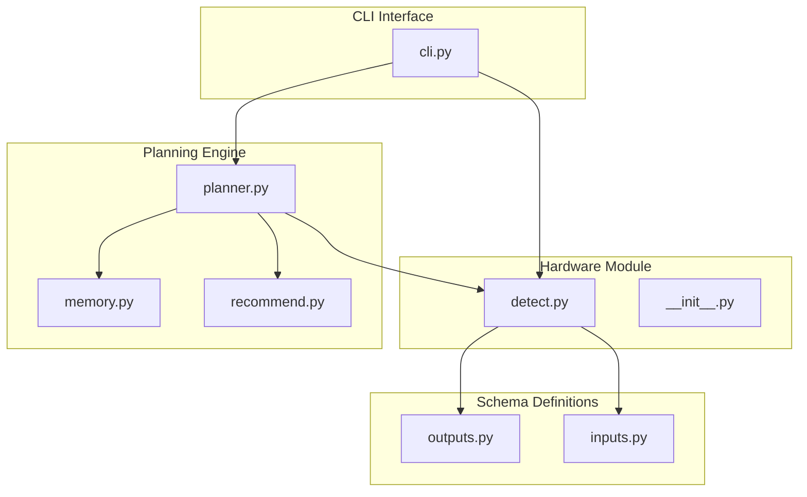
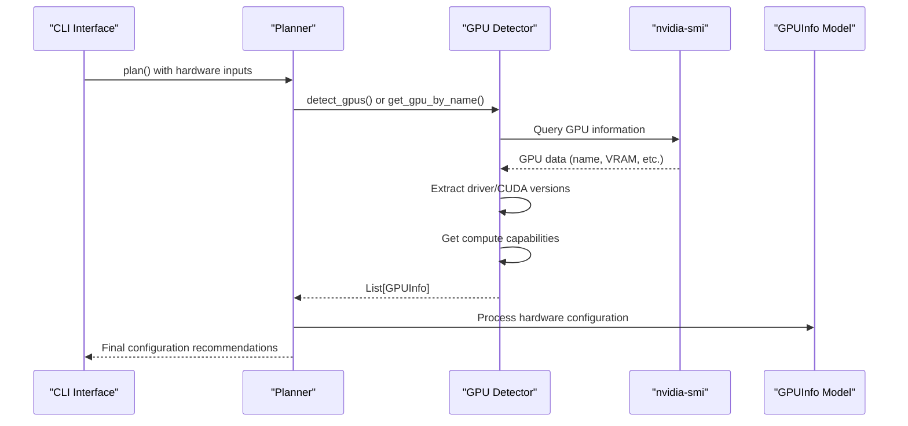
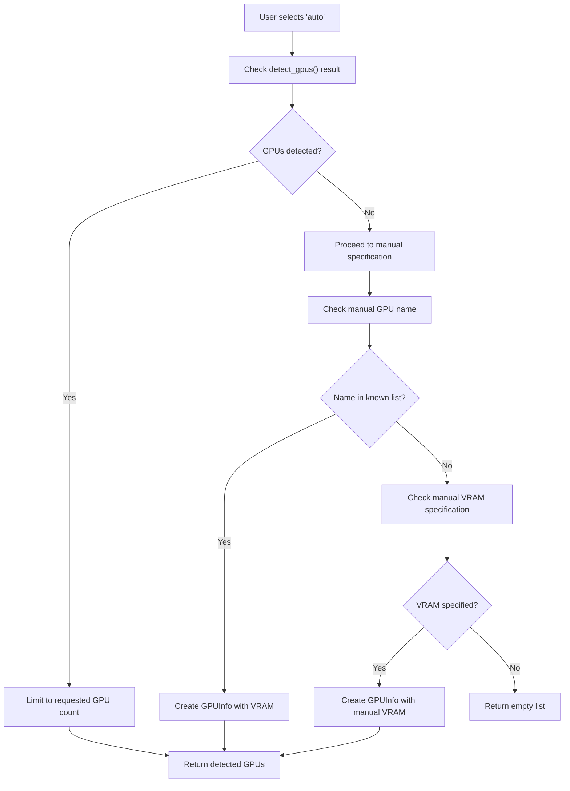
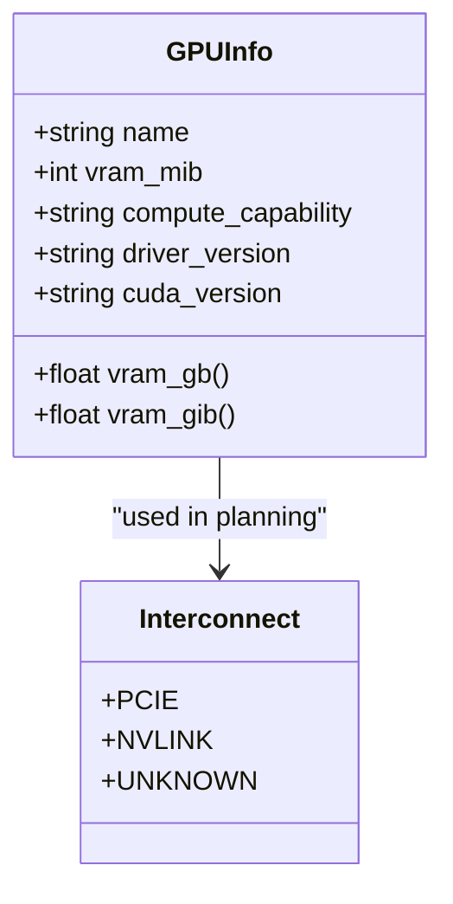
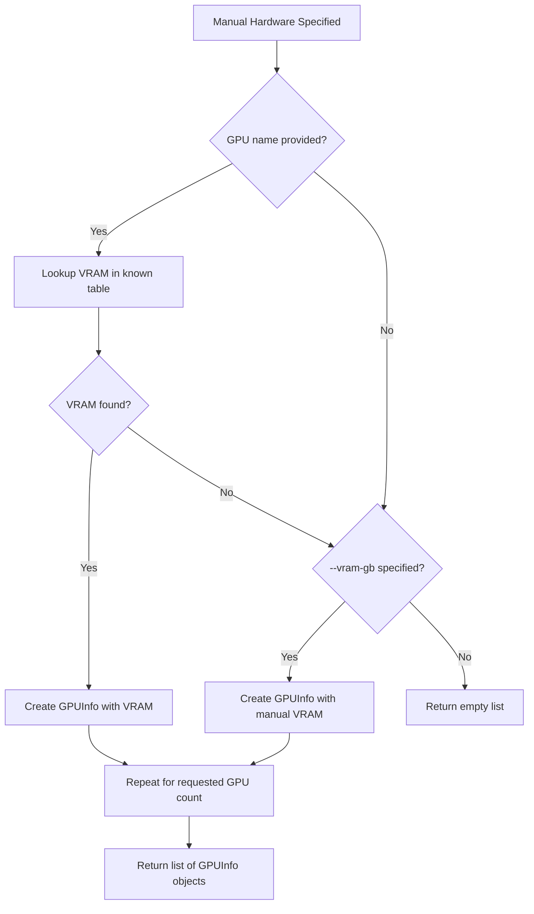
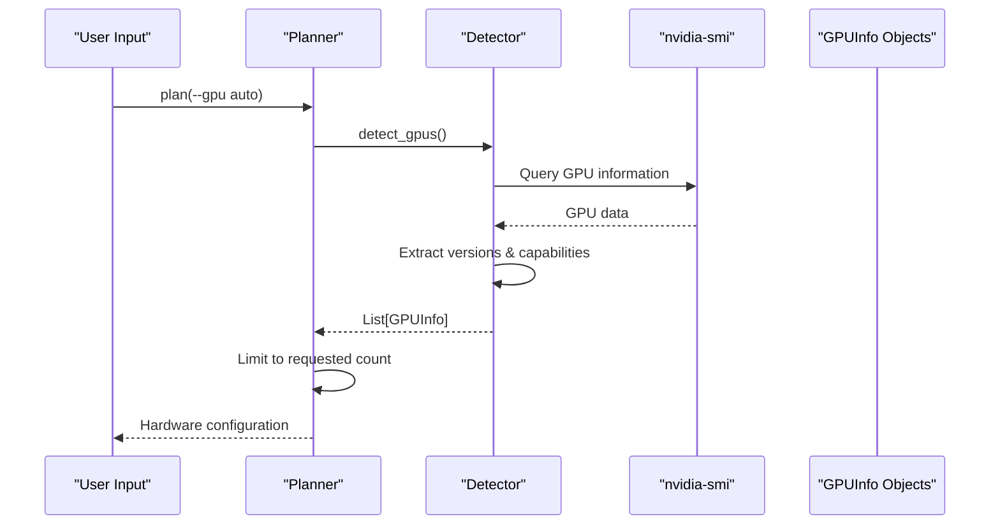
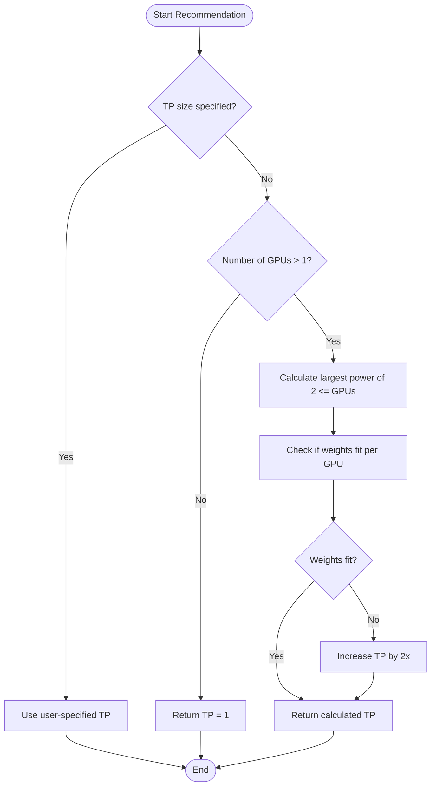

# Hardware Detection API

<cite>
**Referenced Files in This Document**
- [detect.py](file://src/vllm_wizard/hardware/detect.py)
- [__init__.py](file://src/vllm_wizard/hardware/__init__.py)
- [outputs.py](file://src/vllm_wizard/schemas/outputs.py)
- [inputs.py](file://src/vllm_wizard/schemas/inputs.py)
- [planner.py](file://src/vllm_wizard/planning/planner.py)
- [memory.py](file://src/vllm_wizard/planning/memory.py)
- [recommend.py](file://src/vllm_wizard/planning/recommend.py)
- [cli.py](file://src/vllm_wizard/cli.py)
- [README.md](file://README.md)
- [requirements.txt](file://requirements.txt)
</cite>

## Table of Contents
1. [Introduction](#introduction)
2. [Project Structure](#project-structure)
3. [Core Components](#core-components)
4. [Architecture Overview](#architecture-overview)
5. [Detailed Component Analysis](#detailed-component-analysis)
6. [GPU Detection Functions](#gpu-detection-functions)
7. [Hardware Information Retrieval](#hardware-information-retrieval)
8. [GPUInfo Data Structure](#gpufinfo-data-structure)
9. [Supported GPU Families](#supported-gpu-families)
10. [Manual Hardware Specification](#manual-hardware-specification)
11. [Auto-Detection Workflows](#auto-detection-workflows)
12. [Interconnect Detection Logic](#interconnect-detection-logic)
13. [Tensor Parallel Recommendation](#tensor-parallel-recommendation)
14. [Cross-Platform Compatibility](#cross-platform-compatibility)
15. [Extension Guidelines](#extension-guidelines)
16. [Performance Considerations](#performance-considerations)
17. [Troubleshooting Guide](#troubleshooting-guide)
18. [Conclusion](#conclusion)

## Introduction

The Hardware Detection API provides comprehensive GPU detection and hardware information retrieval capabilities for the vLLM Configuration Wizard. This system enables automatic detection of NVIDIA GPUs via `nvidia-smi`, manual hardware specification, and intelligent recommendations for tensor parallelism and configuration optimization.

The API is designed specifically for NVIDIA GPUs and leverages the `nvidia-smi` utility to gather detailed hardware information including GPU names, VRAM capacity, compute capabilities, driver versions, and CUDA versions. It also provides fallback mechanisms for scenarios where automatic detection is unavailable.

## Project Structure

The hardware detection system is organized within the `src/vllm_wizard/hardware/` module, with supporting components distributed across the broader vLLM Wizard architecture:



**Diagram sources**
- [detect.py](file://src/vllm_wizard/hardware/detect.py#L1-L229)
- [__init__.py](file://src/vllm_wizard/hardware/__init__.py#L1-L9)
- [outputs.py](file://src/vllm_wizard/schemas/outputs.py#L1-L118)
- [planner.py](file://src/vllm_wizard/planning/planner.py#L1-L172)

**Section sources**
- [detect.py](file://src/vllm_wizard/hardware/detect.py#L1-L229)
- [__init__.py](file://src/vllm_wizard/hardware/__init__.py#L1-L9)

## Core Components

The hardware detection system consists of several interconnected components that work together to provide comprehensive GPU detection and hardware information retrieval:

### Primary Detection Functions
- **`detect_gpus()`**: Main function for automatic GPU detection via `nvidia-smi`
- **`get_gpu_by_name()`**: Manual GPU specification with VRAM lookup
- **`recommend_tensor_parallel()`**: Intelligent tensor parallel size recommendation

### Supporting Functions
- **`_get_nvidia_versions()`**: Retrieves driver and CUDA version information
- **`_get_compute_capabilities()`**: Extracts compute capability data from GPUs

### Data Structures
- **`GPUInfo`**: Pydantic model representing detected GPU information
- **`Interconnect`**: Enum for GPU interconnect types (PCIe, NVLink, Unknown)

**Section sources**
- [detect.py](file://src/vllm_wizard/hardware/detect.py#L10-L229)
- [outputs.py](file://src/vllm_wizard/schemas/outputs.py#L17-L35)
- [inputs.py](file://src/vllm_wizard/schemas/inputs.py#L38-L44)

## Architecture Overview

The hardware detection system follows a layered architecture that separates concerns between detection, data modeling, and integration with the broader planning system:



**Diagram sources**
- [cli.py](file://src/vllm_wizard/cli.py#L82-L213)
- [planner.py](file://src/vllm_wizard/planning/planner.py#L138-L172)
- [detect.py](file://src/vllm_wizard/hardware/detect.py#L10-L72)

## Detailed Component Analysis

### GPU Detection Module (`detect.py`)

The core detection module provides three primary functions for hardware identification and information retrieval:

#### Main Detection Function
The `detect_gpus()` function serves as the primary entry point for automatic GPU detection:

```mermaid
flowchart TD
Start([detect_gpus() called]) --> QuerySMI["Execute nvidia-smi query"]
QuerySMI --> CheckCode{"Return code == 0?"}
CheckCode --> |No| ReturnEmpty["Return empty list"]
CheckCode --> |Yes| ParseOutput["Parse CSV output"]
ParseOutput --> ExtractInfo["Extract name and VRAM"]
ExtractInfo --> GetVersions["_get_nvidia_versions()"]
GetVersions --> AddDriver["Add driver/CUDA info"]
AddDriver --> GetComputeCaps["_get_compute_capabilities()"]
GetComputeCaps --> AddComputeCap["Add compute capability"]
AddComputeCap --> ReturnList["Return GPUInfo list"]
ReturnEmpty --> End([Function Exit])
ReturnList --> End
```

**Diagram sources**
- [detect.py](file://src/vllm_wizard/hardware/detect.py#L10-L72)
- [detect.py](file://src/vllm_wizard/hardware/detect.py#L74-L106)
- [detect.py](file://src/vllm_wizard/hardware/detect.py#L109-L136)

#### Private Helper Functions
The detection system includes two private helper functions for retrieving additional hardware information:

**Version Detection (`_get_nvidia_versions`)**
- Queries driver version from `nvidia-smi --query-gpu=driver_version`
- Parses CUDA version from `nvidia-smi` header output
- Handles parsing errors gracefully

**Compute Capability Detection (`_get_compute_capabilities`)**
- Retrieves compute capability information for each detected GPU
- Returns list of capability strings for subsequent assignment

**Section sources**
- [detect.py](file://src/vllm_wizard/hardware/detect.py#L10-L229)

### Hardware Information Retrieval

The system provides multiple pathways for hardware information retrieval, each serving different use cases:

#### Automatic Detection Path
When users specify `--gpu auto`, the system automatically detects available GPUs:



**Diagram sources**
- [planner.py](file://src/vllm_wizard/planning/planner.py#L138-L172)

#### Manual Specification Path
For environments where automatic detection is unavailable, users can specify hardware manually:

**Section sources**
- [planner.py](file://src/vllm_wizard/planning/planner.py#L138-L172)

## GPU Detection Functions

The hardware detection system provides three primary functions for different detection scenarios:

### Function 1: `detect_gpus()`
**Purpose**: Automatically detect available NVIDIA GPUs using `nvidia-smi`

**Parameters**: None

**Returns**: `List[GPUInfo]` - List of detected GPU information objects

**Behavior**:
- Executes `nvidia-smi --query-gpu=name,memory.total --format=csv,noheader,nounits`
- Parses output to extract GPU names and total VRAM in MiB
- Retrieves driver and CUDA versions via `_get_nvidia_versions()`
- Obtains compute capabilities via `_get_compute_capabilities()`
- Returns empty list on failure or when `nvidia-smi` is unavailable

**Error Handling**:
- Catches `FileNotFoundError` when `nvidia-smi` is not available
- Handles `subprocess.TimeoutExpired` with graceful failure
- Catches general exceptions and returns empty list

### Function 2: `get_gpu_by_name(name)`
**Purpose**: Manually specify GPU information when auto-detection fails

**Parameters**:
- `name` (str): GPU name (e.g., "RTX 4090", "A100 80GB")

**Returns**: `Optional[GPUInfo]` - GPUInfo object with approximate VRAM or None

**Behavior**:
- Maintains internal lookup table of known GPU VRAM values
- Performs case-insensitive matching with partial name support
- Returns None for unknown GPU names

**Supported GPU Names**:
- Consumer NVIDIA: RTX 4090, RTX 4080, RTX 3090, RTX 3080, RTX 3070, RTX 3060, RTX A series
- Datacenter NVIDIA: A100, H100, L40S, L40, L4, A10G, A10, V100, T4, P100
- Apple Silicon: M1 Max/ULTRA, M2 Max/ULTRA, M3 Max

### Function 3: `recommend_tensor_parallel(gpus)`
**Purpose**: Intelligently recommend tensor parallel size based on available GPUs

**Parameters**:
- `gpus` (List[GPUInfo]): List of detected GPUs

**Returns**: `int` - Recommended tensor parallel size (minimum 1)

**Algorithm**:
- Uses largest power of 2 less than or equal to number of GPUs
- Ensures model weights fit within available VRAM per GPU
- Returns 1 for single GPU deployments

**Section sources**
- [detect.py](file://src/vllm_wizard/hardware/detect.py#L10-L229)

## Hardware Information Retrieval Methods

The system employs multiple methods to gather comprehensive hardware information:

### Method 1: `nvidia-smi` Integration
Direct integration with NVIDIA's system management interface provides:
- GPU names and model identifiers
- Total VRAM capacity in MiB
- Driver version information
- CUDA version from system header
- Compute capability for each GPU

### Method 2: Fallback Mechanisms
When `nvidia-smi` is unavailable or fails:
- Manual GPU specification via `get_gpu_by_name()`
- Direct VRAM specification via `--vram-gb` parameter
- Graceful degradation to basic configuration

### Method 3: Version Information Extraction
System extracts and stores:
- NVIDIA driver version
- CUDA toolkit version
- Compute capability for performance optimization

**Section sources**
- [detect.py](file://src/vllm_wizard/hardware/detect.py#L74-L136)
- [planner.py](file://src/vllm_wizard/planning/planner.py#L138-L172)

## GPUInfo Data Structure

The `GPUInfo` Pydantic model serves as the central data structure for representing detected GPU information:

### Core Properties
- **name** (str): GPU model name (e.g., "NVIDIA RTX 4090")
- **vram_mib** (int): Total VRAM in Mebibytes (MiB)
- **compute_capability** (Optional[str]): CUDA compute capability (e.g., "8.9")
- **driver_version** (Optional[str]): NVIDIA driver version
- **cuda_version** (Optional[str]): CUDA toolkit version

### Utility Properties
- **vram_gb** (float): VRAM in Gigabytes (base 1000)
- **vram_gib** (float): VRAM in Gibibytes (base 1024)

### Validation and Serialization
- Built with Pydantic for automatic validation
- Supports JSON serialization via `model_dump()`
- Provides pretty-printed JSON output for CLI integration



**Diagram sources**
- [outputs.py](file://src/vllm_wizard/schemas/outputs.py#L17-L35)
- [inputs.py](file://src/vllm_wizard/schemas/inputs.py#L38-L44)

**Section sources**
- [outputs.py](file://src/vllm_wizard/schemas/outputs.py#L17-L35)

## Supported GPU Families

The system maintains comprehensive support for various NVIDIA GPU families:

### Consumer NVIDIA GPUs
- RTX 40 Series: 4090 (24GB), 4080 (16GB), 4070 Ti (12GB), 4070 (12GB)
- RTX 30 Series: 3090 Ti (24GB), 3090 (24GB), 3080 Ti (12GB), 3080 (10GB), 3070 Ti (8GB), 3070 (8GB), 3060 Ti (8GB), 3060 (12GB)
- RTX A Series: A6000 (48GB), A5000 (24GB), A4000 (16GB)

### Datacenter NVIDIA GPUs
- Hopper Architecture: H100 (80GB), H200 (143GB)
- Ada Lovelace: L40S (48GB), L40 (48GB), L4 (24GB)
- Ampere Architecture: A100 (80GB/40GB), A10G (24GB), A10 (24GB)
- Volta Architecture: V100 (32GB/16GB)
- Turing Architecture: T4 (16GB)
- Pascal Architecture: P100 (16GB)

### Apple Silicon Support
- M1 Max/ULTRA (32GB/65GB)
- M2 Max/ULTRA (32GB/65GB)
- M3 Max (40GB)

**Section sources**
- [detect.py](file://src/vllm_wizard/hardware/detect.py#L174-L229)

## Manual Hardware Specification

The system provides flexible manual hardware specification capabilities for environments where automatic detection is unavailable:

### CLI Integration
Users can specify hardware manually using the following options:
- `--gpu`: GPU name or "auto" for detection
- `--gpus`: Number of GPUs (default: 1)
- `--vram-gb`: VRAM per GPU in GB
- `--interconnect`: GPU interconnect type (pcie, nvlink, unknown)

### Programmatic Usage
The manual specification process follows this workflow:



**Diagram sources**
- [planner.py](file://src/vllm_wizard/planning/planner.py#L156-L170)

**Section sources**
- [planner.py](file://src/vllm_wizard/planning/planner.py#L138-L172)
- [cli.py](file://src/vllm_wizard/cli.py#L105-L118)

## Auto-Detection Workflows

The auto-detection system implements sophisticated logic to handle various detection scenarios:

### Primary Detection Flow
When `--gpu auto` is specified, the system follows this detection sequence:



**Diagram sources**
- [planner.py](file://src/vllm_wizard/planning/planner.py#L149-L154)

### Fallback Resolution Logic
The system implements a tiered fallback mechanism:

1. **Automatic Detection**: `detect_gpus()` returns detected GPUs
2. **Manual GPU Lookup**: `get_gpu_by_name()` for known GPU names
3. **Manual VRAM Specification**: Direct VRAM input in GB
4. **Graceful Failure**: Empty list with appropriate error handling

**Section sources**
- [planner.py](file://src/vllm_wizard/planning/planner.py#L138-L172)

## Interconnect Detection Logic

The system includes sophisticated interconnect detection logic that affects performance recommendations:

### Interconnect Types
- **PCIe**: Standard PCIe connection (default assumption)
- **NVLink**: High-speed NVIDIA interconnect (detected when available)
- **Unknown**: Default state when interconnect cannot be determined

### Performance Impact
The interconnect type influences:
- Tensor parallel performance scaling
- Communication overhead calculations
- Performance estimation algorithms
- Memory bandwidth utilization

### Detection Methodology
The system determines interconnect type through:
- Hardware configuration inspection
- Performance characteristics analysis
- User-specified interconnect override
- Default assumptions for unknown cases

**Section sources**
- [inputs.py](file://src/vllm_wizard/schemas/inputs.py#L38-L44)
- [planner.py](file://src/vllm_wizard/planning/planner.py#L115-L116)

## Tensor Parallel Recommendation

The tensor parallel recommendation system provides intelligent automatic configuration:

### Algorithm Overview
The recommendation algorithm follows these steps:



**Diagram sources**
- [detect.py](file://src/vllm_wizard/hardware/detect.py#L138-L159)
- [recommend.py](file://src/vllm_wizard/planning/recommend.py#L42-L68)

### Recommendation Factors
The system considers multiple factors when recommending tensor parallel sizes:

1. **GPU Count**: Maximum power-of-2 tensor parallel size
2. **Model Size**: Ensures weights fit within available VRAM per GPU
3. **Memory Constraints**: Prevents out-of-memory conditions
4. **User Preferences**: Respects explicit user-specified values

### Implementation Details
The recommendation algorithm ensures:
- **Safety**: Prevents model overflow by checking memory requirements
- **Efficiency**: Maximizes parallelism within hardware constraints
- **Flexibility**: Allows user override for specialized use cases

**Section sources**
- [detect.py](file://src/vllm_wizard/hardware/detect.py#L138-L159)
- [recommend.py](file://src/vllm_wizard/planning/recommend.py#L42-L68)

## Cross-Platform Compatibility

The hardware detection system is designed with cross-platform considerations:

### Platform Support Matrix
- **Linux**: Full support with native `nvidia-smi` integration
- **macOS**: Best-effort support with limited GPU detection capabilities
- **Windows**: Best-effort support with potential detection limitations

### Compatibility Features
- **Graceful Degradation**: Falls back to manual specification when automatic detection fails
- **Error Handling**: Comprehensive exception handling for platform-specific failures
- **Cross-Platform VRAM Calculation**: Consistent VRAM reporting across platforms

### Limitations
- **Platform-Specific Tools**: Relies on `nvidia-smi` availability
- **Driver Dependencies**: Requires compatible NVIDIA drivers
- **Virtual Environments**: May have limitations in containerized environments

**Section sources**
- [requirements.txt](file://requirements.txt#L42-L47)

## Extension Guidelines

To extend hardware detection for new GPU architectures:

### Adding New GPU Specifications
1. **Update Known GPU Table**: Add new GPU name and VRAM in `get_gpu_by_name()`
2. **Test VRAM Accuracy**: Verify VRAM measurements against official specifications
3. **Update Documentation**: Add GPU to supported families documentation

### Extending Detection Capabilities
1. **New Detection Method**: Implement additional detection methods for different platforms
2. **Version Parsing**: Extend version extraction for new driver versions
3. **Capability Mapping**: Add compute capability mappings for new architectures

### Integration Steps
1. **Modify Detection Logic**: Update `detect_gpus()` to include new detection methods
2. **Update Data Models**: Extend `GPUInfo` if new properties are needed
3. **Add Tests**: Include comprehensive test coverage for new functionality
4. **Documentation**: Update API documentation and examples

### Best Practices
- **Backward Compatibility**: Maintain existing API contracts
- **Error Handling**: Implement robust error handling for new scenarios
- **Performance**: Optimize detection methods for speed and reliability
- **Validation**: Add input validation for new parameters

**Section sources**
- [detect.py](file://src/vllm_wizard/hardware/detect.py#L174-L229)

## Performance Considerations

The hardware detection system is optimized for performance and reliability:

### Detection Performance
- **Timeout Management**: All `nvidia-smi` calls include 5-10 second timeouts
- **Minimal Dependencies**: Only requires `nvidia-smi` for detection
- **Efficient Parsing**: Optimized CSV parsing for GPU information

### Memory Efficiency
- **Lazy Loading**: GPU information is processed incrementally
- **Resource Cleanup**: Proper cleanup of subprocess resources
- **Memory Limits**: Controlled memory usage for large GPU lists

### Error Recovery
- **Graceful Failures**: Automatic fallback to manual specification
- **Retry Logic**: Intelligent retry mechanisms for transient failures
- **Logging**: Comprehensive logging for debugging and monitoring

## Troubleshooting Guide

Common issues and their solutions:

### Issue 1: `nvidia-smi` Not Found
**Symptoms**: Empty GPU list, detection fails
**Solutions**:
- Install NVIDIA drivers with `nvidia-smi`
- Add NVIDIA driver path to system PATH
- Use manual hardware specification

### Issue 2: Permission Denied
**Symptoms**: Detection returns empty list despite available GPUs
**Solutions**:
- Run with appropriate permissions
- Check SELinux/AppArmor policies
- Use sudo privileges for detection

### Issue 3: Incomplete GPU Information
**Symptoms**: Some GPU properties missing (driver, CUDA, compute capability)
**Solutions**:
- Update NVIDIA drivers
- Check `nvidia-smi` version compatibility
- Verify GPU compatibility with current drivers

### Issue 4: Incorrect VRAM Reporting
**Symptoms**: VRAM values differ from expected amounts
**Solutions**:
- Verify GPU model identification
- Check for multi-GPU configurations
- Use manual VRAM specification as override

**Section sources**
- [detect.py](file://src/vllm_wizard/hardware/detect.py#L65-L71)

## Conclusion

The Hardware Detection API provides a robust, extensible foundation for GPU detection and hardware information retrieval in the vLLM Configuration Wizard. Its design emphasizes reliability, cross-platform compatibility, and intelligent fallback mechanisms while maintaining simplicity for both automatic and manual hardware specification scenarios.

The system successfully balances comprehensive hardware detection with graceful degradation, ensuring users can configure vLLM deployments even in challenging environments. The modular architecture facilitates future extensions for new GPU architectures and detection methods while maintaining backward compatibility.

Key strengths include:
- **Reliable Detection**: Comprehensive `nvidia-smi` integration with robust error handling
- **Flexible Configuration**: Support for both automatic and manual hardware specification
- **Intelligent Recommendations**: Smart tensor parallel sizing and configuration optimization
- **Cross-Platform Support**: Graceful handling of platform-specific limitations
- **Extensible Design**: Clear patterns for adding new GPU families and detection methods

The API serves as a critical foundation for the broader vLLM Configuration Wizard, enabling users to confidently deploy large language models across diverse hardware configurations.