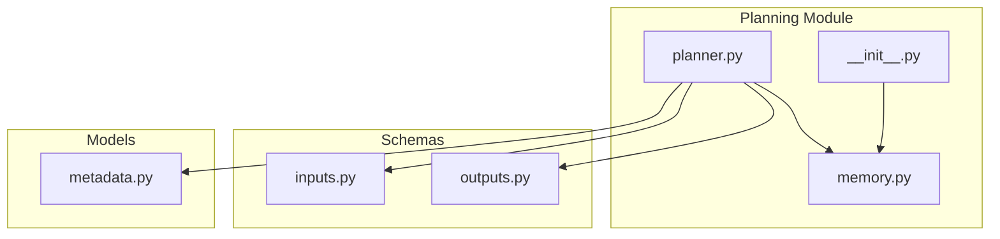
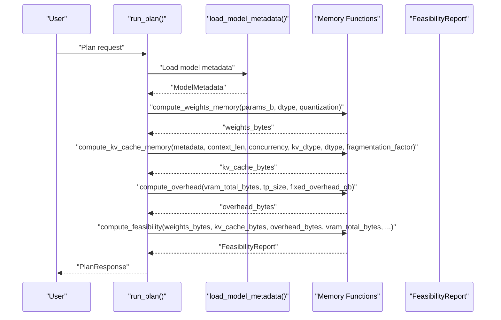
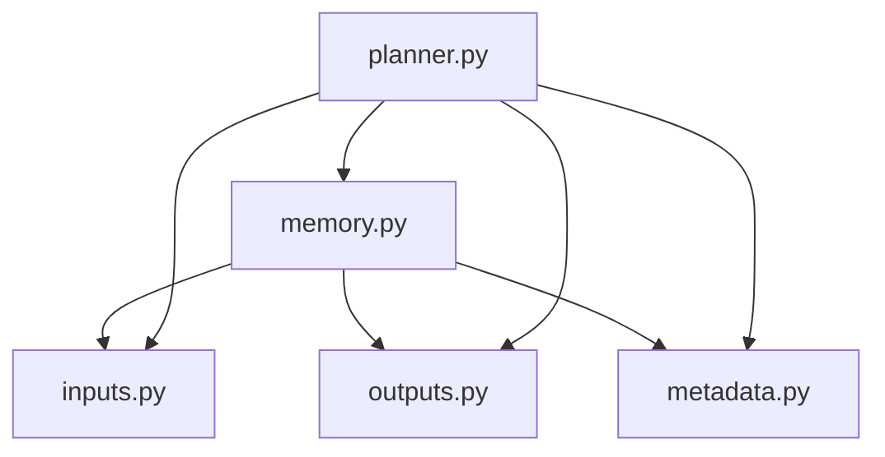

# Memory Calculation API

<cite>
**Referenced Files in This Document**
- [memory.py](file://src/vllm_wizard/planning/memory.py)
- [__init__.py](file://src/vllm_wizard/planning/__init__.py)
- [inputs.py](file://src/vllm_wizard/schemas/inputs.py)
- [outputs.py](file://src/vllm_wizard/schemas/outputs.py)
- [metadata.py](file://src/vllm_wizard/models/metadata.py)
- [planner.py](file://src/vllm_wizard/planning/planner.py)
- [test_memory.py](file://tests/test_memory.py)
- [README.md](file://README.md)
</cite>

## Table of Contents
1. [Introduction](#introduction)
2. [Project Structure](#project-structure)
3. [Core Components](#core-components)
4. [Architecture Overview](#architecture-overview)
5. [Detailed Component Analysis](#detailed-component-analysis)
6. [Dependency Analysis](#dependency-analysis)
7. [Performance Considerations](#performance-considerations)
8. [Troubleshooting Guide](#troubleshooting-guide)
9. [Conclusion](#conclusion)
10. [Appendices](#appendices)

## Introduction
This document provides comprehensive API documentation for the memory calculation functions used in VRAM sizing for vLLM deployments. It covers the four primary functions: compute_weights_memory, compute_kv_cache_memory, compute_overhead, and compute_feasibility. The documentation explains method signatures, parameter specifications, return value descriptions, mathematical formulas, algorithms, unit conversions, precision considerations, edge cases, and practical examples for different model sizes and deployment scenarios. It also details how feasibility calculations integrate with hardware constraints.

## Project Structure
The memory calculation APIs are part of the planning module and integrate with model metadata, input schemas, and output reports. The planner orchestrates the end-to-end process, invoking these memory functions to produce feasibility reports and recommendations.

**Diagram sources**
- [planner.py](file://src/vllm_wizard/planning/planner.py#L1-L172)
- [memory.py](file://src/vllm_wizard/planning/memory.py#L1-L367)
- [__init__.py](file://src/vllm_wizard/planning/__init__.py#L1-L32)
- [inputs.py](file://src/vllm_wizard/schemas/inputs.py#L1-L110)
- [outputs.py](file://src/vllm_wizard/schemas/outputs.py#L1-L118)
- [metadata.py](file://src/vllm_wizard/models/metadata.py#L1-L255)

**Section sources**
- [planner.py](file://src/vllm_wizard/planning/planner.py#L1-L172)
- [memory.py](file://src/vllm_wizard/planning/memory.py#L1-L367)
- [__init__.py](file://src/vllm_wizard/planning/__init__.py#L1-L32)

## Core Components
This section documents the four core memory calculation functions and their supporting constants and enums.

- compute_weights_memory(params_b, dtype=DType.AUTO, quantization=Quantization.NONE) -> int
- compute_kv_cache_memory(metadata, context_len, concurrency, kv_dtype=KVCacheDType.AUTO, dtype=DType.AUTO, fragmentation_factor=1.15) -> int
- compute_overhead(vram_total_bytes, tp_size=1, fixed_overhead_gb=None) -> int
- compute_feasibility(weights_bytes, kv_cache_bytes, overhead_bytes, vram_total_bytes, gpu_memory_utilization=0.90, headroom_gb=1.0, context_len=4096, concurrency=1, metadata=None, kv_dtype=KVCacheDType.AUTO, dtype=DType.AUTO, fragmentation_factor=1.15) -> FeasibilityReport

Key constants and data types:
- DTYPE_BYTES: mapping of weight data types to bytes per parameter
- QUANT_BYTES: mapping of quantization methods to bytes per parameter (including overhead)
- BYTES_TO_GIB: conversion factor from bytes to GiB
- Enums: DType, Quantization, KVCacheDType, OOMRisk

**Section sources**
- [memory.py](file://src/vllm_wizard/planning/memory.py#L9-L28)
- [memory.py](file://src/vllm_wizard/planning/memory.py#L31-L367)
- [inputs.py](file://src/vllm_wizard/schemas/inputs.py#L9-L36)
- [outputs.py](file://src/vllm_wizard/schemas/outputs.py#L9-L15)

## Architecture Overview
The memory calculation functions are orchestrated by the planner, which loads model metadata, resolves hardware configuration, computes memory breakdown components, and produces a feasibility report.

**Diagram sources**
- [planner.py](file://src/vllm_wizard/planning/planner.py#L21-L135)
- [memory.py](file://src/vllm_wizard/planning/memory.py#L31-L367)
- [metadata.py](file://src/vllm_wizard/models/metadata.py#L209-L254)

## Detailed Component Analysis

### compute_weights_memory
Computes the memory footprint of model weights based on parameter count and data type/quantization.

- Method signature: compute_weights_memory(params_b, dtype=DType.AUTO, quantization=Quantization.NONE) -> int
- Parameters:
  - params_b: float, model parameters in billions
  - dtype: DType, weight data type (AUTO maps to BF16)
  - quantization: Quantization, quantization method (NONE, AWQ, GPTQ, INT8, FP8)
- Returns: int, memory in bytes
- Algorithm:
  - Convert params_b to integer parameter count (1e9)
  - If quantization is not NONE, use QUANT_BYTES mapping; otherwise use DTYPE_BYTES mapping
  - Multiply parameter count by bytes per parameter and cast to int
- Precision and units:
  - Returns bytes; convert to GiB by dividing by BYTES_TO_GIB
- Edge cases:
  - AUTO dtype defaults to BF16 (2.0 bytes/param)
  - Quantization NONE falls back to dtype mapping
- Examples:
  - 7B parameters at FP16: 7.0 × 2.0 = 14 GiB
  - 7B parameters with AWQ/GPTQ: 7.0 × 0.55 ≈ 3.85 GiB
  - 7B parameters at INT8: 7.0 × 1.0 = 7 GiB

**Section sources**
- [memory.py](file://src/vllm_wizard/planning/memory.py#L31-L56)
- [memory.py](file://src/vllm_wizard/planning/memory.py#L9-L28)
- [inputs.py](file://src/vllm_wizard/schemas/inputs.py#L9-L26)
- [test_memory.py](file://tests/test_memory.py#L19-L56)

### compute_kv_cache_memory
Computes KV cache memory footprint considering model architecture, context length, concurrency, and KV cache data type.

- Method signature: compute_kv_cache_memory(metadata, context_len, concurrency, kv_dtype=KVCacheDType.AUTO, dtype=DType.AUTO, fragmentation_factor=1.15) -> int
- Parameters:
  - metadata: ModelMetadata, model architecture (head_dim, num_key_value_heads, num_hidden_layers)
  - context_len: int, maximum context length (tokens)
  - concurrency: int, number of concurrent sequences
  - kv_dtype: KVCacheDType, KV cache data type (AUTO maps to model dtype)
  - dtype: DType, model weight dtype (used when kv_dtype is AUTO)
  - fragmentation_factor: float, safety factor for fragmentation
- Returns: int, memory in bytes
- Algorithm:
  - Compute elements per token per layer: 2 × num_kv_heads × head_dim
  - Determine bytes per element based on kv_dtype:
    - FP8 variants: 1.0
    - FP16/BF16: 2.0
    - FP32: 4.0
    - Other/default: 2.0
  - Total KV cache bytes: elements_per_token_per_layer × num_layers × context_len × concurrency × bytes_per_element
  - Apply fragmentation_factor multiplier
- Precision and units:
  - Returns bytes; convert to GiB by dividing by BYTES_TO_GIB
- Edge cases:
  - KV cache scales linearly with context_len and concurrency
  - KV cache reduces with fewer KV heads (GQA)
  - FP8 KV cache is approximately half the size of FP16 KV cache
- Examples:
  - LLaMA-like model: 2 × kv_heads × head_dim × dtype_bytes × layers × tokens × concurrency
  - With fragmentation_factor=1.15, multiply result by 1.15

**Section sources**
- [memory.py](file://src/vllm_wizard/planning/memory.py#L59-L121)
- [metadata.py](file://src/vllm_wizard/models/metadata.py#L12-L36)
- [inputs.py](file://src/vllm_wizard/schemas/inputs.py#L28-L36)
- [test_memory.py](file://tests/test_memory.py#L58-L152)

### compute_overhead
Estimates framework overhead and communication buffers for multi-GPU setups.

- Method signature: compute_overhead(vram_total_bytes, tp_size=1, fixed_overhead_gb=None) -> int
- Parameters:
  - vram_total_bytes: int, total VRAM in bytes
  - tp_size: int, tensor parallel size
  - fixed_overhead_gb: Optional[float], fixed overhead in GB (overrides calculation)
- Returns: int, overhead in bytes
- Algorithm:
  - If fixed_overhead_gb is provided, convert to bytes
  - Otherwise:
    - Convert VRAM to GiB
    - Base overhead: max(1.0 GiB, 0.02 × VRAM GiB)
    - Communication overhead: 0.25 × (tp_size - 1) if tp_size > 1
    - Sum base and communication overhead, convert to bytes
- Precision and units:
  - Returns bytes; convert to GiB by dividing by BYTES_TO_GIB
- Edge cases:
  - tp_size=1 omits communication overhead
  - fixed_overhead_gb takes precedence over calculated overhead
- Examples:
  - 24 GiB VRAM, tp_size=1: max(1.0, 0.02×24) = 1.0 GiB
  - 80 GiB VRAM, tp_size=1: max(1.0, 0.02×80) = 1.6 GiB
  - tp_size=2: base + 0.25×(2−1) = base + 0.25 GiB

**Section sources**
- [memory.py](file://src/vllm_wizard/planning/memory.py#L124-L152)
- [test_memory.py](file://tests/test_memory.py#L154-L179)

### compute_feasibility
Performs VRAM feasibility analysis and generates recommendations.

- Method signature: compute_feasibility(weights_bytes, kv_cache_bytes, overhead_bytes, vram_total_bytes, gpu_memory_utilization=0.90, headroom_gb=1.0, context_len=4096, concurrency=1, metadata=None, kv_dtype=KVCacheDType.AUTO, dtype=DType.AUTO, fragmentation_factor=1.15) -> FeasibilityReport
- Parameters:
  - weights_bytes, kv_cache_bytes, overhead_bytes: int, memory in bytes
  - vram_total_bytes: int, total VRAM in bytes
  - gpu_memory_utilization: float, target GPU memory utilization (0.5–0.98)
  - headroom_gb: float, minimum headroom in GB
  - context_len, concurrency: int, used for max concurrency/context calculations
  - metadata: Optional[ModelMetadata], for max calculations
  - kv_dtype, dtype: data types for KV cache and weights
  - fragmentation_factor: float, KV cache fragmentation factor
- Returns: FeasibilityReport with:
  - fits: bool
  - oom_risk: OOMRisk (LOW/MEDIUM/HIGH)
  - vram_total_gb, vram_target_alloc_gb, weights_gb, kv_cache_gb, overhead_gb, headroom_gb
  - max_concurrency_at_context, max_context_at_concurrency
  - warnings: list[str]
- Algorithm:
  - Compute allocatable VRAM: vram_total_bytes × gpu_memory_utilization
  - Required: weights + kv_cache + overhead
  - Headroom: allocatable − required
  - OOM risk classification based on headroom:
    - ≥2 GiB: LOW
    - ≥0 GiB: MEDIUM
    - <0 GiB: HIGH
  - If metadata provided, compute max concurrency at target context and max context at target concurrency
  - Generate warnings for fit status, OOM risk, and high KV cache ratio (>50%)
- Precision and units:
  - All memory values are converted to GiB for reporting
- Edge cases:
  - Negative headroom implies configuration does not fit
  - KV cache ratio threshold triggers warnings
- Examples:
  - 24 GiB VRAM, 14 GiB weights, 2 GiB KV, 1 GiB overhead at 90% utilization:
    - Allocatable: 21.6 GiB
    - Required: 17 GiB
    - Headroom: 4.6 GiB → LOW risk
  - Insufficient VRAM leads to HIGH risk and warnings

**Section sources**
- [memory.py](file://src/vllm_wizard/planning/memory.py#L155-L270)
- [outputs.py](file://src/vllm_wizard/schemas/outputs.py#L37-L54)
- [test_memory.py](file://tests/test_memory.py#L181-L231)

### Supporting Functions for Max Calculations
- compute_max_concurrency_at_context(allocatable_bytes, weights_bytes, overhead_bytes, metadata, context_len, kv_dtype=KVCacheDType.AUTO, dtype=DType.AUTO, fragmentation_factor=1.15) -> int
  - Computes maximum concurrency for a given context length
  - Available KV space: allocatable − weights − overhead
  - KV per sequence computed via compute_kv_cache_memory with concurrency=1
  - Returns available_for_kv // kv_per_seq
- compute_max_context_at_concurrency(allocatable_bytes, weights_bytes, overhead_bytes, metadata, concurrency, kv_dtype=KVCacheDType.AUTO, dtype=DType.AUTO, fragmentation_factor=1.15) -> int
  - Computes maximum context length for a given concurrency
  - KV per token per sequence computed via compute_kv_cache_memory with context_len=1
  - Returns (available_for_kv // kv_per_token_per_seq) // concurrency

**Section sources**
- [memory.py](file://src/vllm_wizard/planning/memory.py#L273-L367)
- [test_memory.py](file://tests/test_memory.py#L233-L265)

## Dependency Analysis
The memory functions depend on model metadata, input enums, and output report structures. The planner integrates these components to produce feasibility reports.

**Diagram sources**
- [memory.py](file://src/vllm_wizard/planning/memory.py#L1-L367)
- [inputs.py](file://src/vllm_wizard/schemas/inputs.py#L1-L110)
- [outputs.py](file://src/vllm_wizard/schemas/outputs.py#L1-L118)
- [metadata.py](file://src/vllm_wizard/models/metadata.py#L1-L255)
- [planner.py](file://src/vllm_wizard/planning/planner.py#L1-L172)

**Section sources**
- [memory.py](file://src/vllm_wizard/planning/memory.py#L1-L367)
- [planner.py](file://src/vllm_wizard/planning/planner.py#L1-L172)

## Performance Considerations
- Quantization significantly reduces weights memory:
  - AWQ/GPTQ: ~0.55 bytes/param (includes overhead)
  - INT8: 1.0 bytes/param
  - FP16/BF16: 2.0 bytes/param
  - FP32: 4.0 bytes/param
- KV cache scales linearly with context length and concurrency; FP8 KV cache halves KV memory compared to FP16
- Fragmentation factor increases KV cache estimates to account for memory fragmentation
- Overhead grows with VRAM size and adds communication buffers for tensor parallelism
- Feasibility checks enable quick determination of whether a configuration fits within target GPU utilization and headroom requirements

[No sources needed since this section provides general guidance]

## Troubleshooting Guide
Common issues and resolutions:
- Configuration does not fit:
  - Reduce context length or concurrency
  - Use quantization (AWQ/GPTQ/INT8) for weights
  - Switch to FP8 KV cache
  - Increase VRAM or use tensor parallelism
- High OOM risk:
  - LOW risk: configuration is safe
  - MEDIUM risk: monitor memory usage during inference
  - HIGH risk: reduce context length or use quantization
- KV cache dominates VRAM:
  - Consider FP8 KV cache or shorter context
  - Verify fragmentation_factor is reasonable (default 1.15)
- Multi-GPU communication overhead:
  - Ensure adequate VRAM for tp_size > 1
  - Use NVLink interconnect when possible

**Section sources**
- [memory.py](file://src/vllm_wizard/planning/memory.py#L198-L270)
- [test_memory.py](file://tests/test_memory.py#L181-L231)

## Conclusion
The memory calculation APIs provide a robust foundation for VRAM sizing in vLLM deployments. They support precise modeling of weights, KV cache, and overhead while enabling feasibility analysis with actionable warnings and recommendations. By leveraging quantization, KV cache data types, and fragmentation factors, users can optimize memory usage for diverse model sizes and deployment scenarios.

[No sources needed since this section summarizes without analyzing specific files]

## Appendices

### Mathematical Formulas and Algorithms
- Weights memory:
  - weights_bytes = parameters × bytes_per_param
  - bytes_per_param from DTYPE_BYTES or QUANT_BYTES
- KV cache memory:
  - kv_per_token_per_layer = 2 × num_kv_heads × head_dim
  - kv_cache = kv_per_token_per_layer × num_layers × context_len × concurrency × dtype_bytes × fragmentation_factor
- Overhead:
  - base_overhead = max(1.0 GiB, 0.02 × VRAM GiB)
  - comm_overhead = 0.25 × (tp_size − 1) if tp_size > 1
  - total_overhead = base_overhead + comm_overhead
- Feasibility:
  - allocatable = vram_total × gpu_memory_utilization
  - required = weights + kv_cache + overhead
  - headroom = allocatable − required
  - oom_risk based on headroom thresholds

**Section sources**
- [memory.py](file://src/vllm_wizard/planning/memory.py#L31-L152)
- [memory.py](file://src/vllm_wizard/planning/memory.py#L155-L270)

### Unit Conversions and Precision Notes
- BYTES_TO_GIB = 1024³
- All functions return bytes; convert to GiB by dividing by BYTES_TO_GIB
- Integer truncation occurs in memory computations; results are rounded down
- Fragmentation factor is a multiplier applied to KV cache estimates

**Section sources**
- [memory.py](file://src/vllm_wizard/planning/memory.py#L27-L28)
- [memory.py](file://src/vllm_wizard/planning/memory.py#L118-L119)

### Example Scenarios
- Small model (7B parameters, FP16):
  - Weights: 7.0 × 2.0 = 14 GiB
  - KV cache (context=4096, concurrency=1): depends on model architecture
  - Overhead (24 GiB VRAM, tp_size=1): 1.0 GiB
- Large model (70B parameters, AWQ):
  - Weights: 70.0 × 0.55 ≈ 38.5 GiB
  - KV cache (context=4096, concurrency=4): scales with tokens and sequences
  - Overhead (80 GiB VRAM, tp_size=2): 1.0 + 0.25 = 1.25 GiB
- Multi-GPU with tensor parallelism:
  - Effective VRAM adjusts for tp_size
  - Overhead includes communication buffers

**Section sources**
- [test_memory.py](file://tests/test_memory.py#L19-L56)
- [test_memory.py](file://tests/test_memory.py#L154-L179)
- [planner.py](file://src/vllm_wizard/planning/planner.py#L47-L53)