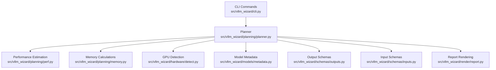
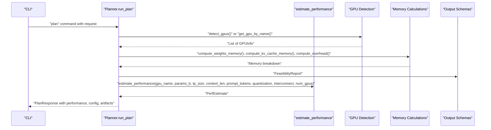
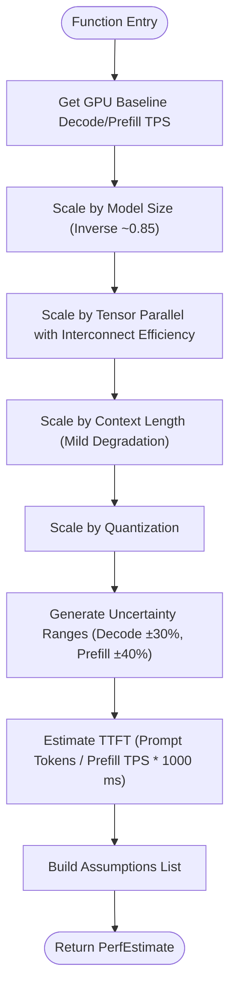
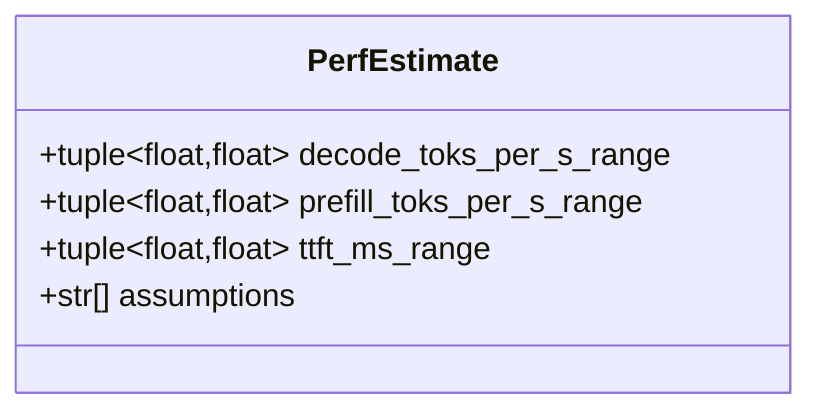
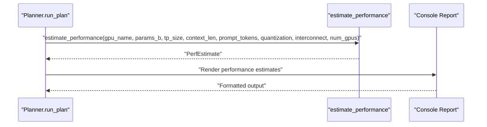
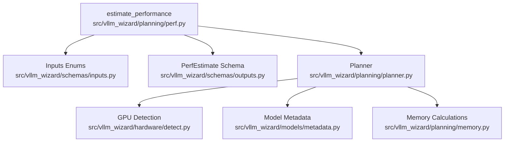

# Performance Estimation API

<cite>
**Referenced Files in This Document**
- [perf.py](file://src/vllm_wizard/planning/perf.py)
- [memory.py](file://src/vllm_wizard/planning/memory.py)
- [detect.py](file://src/vllm_wizard/hardware/detect.py)
- [metadata.py](file://src/vllm_wizard/models/metadata.py)
- [outputs.py](file://src/vllm_wizard/schemas/outputs.py)
- [inputs.py](file://src/vllm_wizard/schemas/inputs.py)
- [planner.py](file://src/vllm_wizard/planning/planner.py)
- [recommend.py](file://src/vllm_wizard/planning/recommend.py)
- [report.py](file://src/vllm_wizard/render/report.py)
- [cli.py](file://src/vllm_wizard/cli.py)
</cite>

## Table of Contents
1. [Introduction](#introduction)
2. [Project Structure](#project-structure)
3. [Core Components](#core-components)
4. [Architecture Overview](#architecture-overview)
5. [Detailed Component Analysis](#detailed-component-analysis)
6. [Dependency Analysis](#dependency-analysis)
7. [Performance Considerations](#performance-considerations)
8. [Troubleshooting Guide](#troubleshooting-guide)
9. [Conclusion](#conclusion)

## Introduction
This document provides comprehensive API documentation for the performance estimation functions in the vLLM Wizard system. It focuses on the `estimate_performance` function, detailing its method signature, parameter specifications, return value structure, and the heuristic-based performance modeling approach. The documentation explains how model parameters, tensor parallel size, context length, and hardware characteristics influence performance estimates, including throughput prediction, latency estimation, and GPU family scaling factors. It also covers uncertainty ranges, confidence intervals, integration with GPU detection, and workload parameters.

## Project Structure
The performance estimation functionality is part of a modular planning system that orchestrates GPU detection, model metadata loading, memory feasibility analysis, configuration recommendations, and performance estimation. The key modules involved are:

- Performance estimation: `src/vllm_wizard/planning/perf.py`
- Hardware detection: `src/vllm_wizard/hardware/detect.py`
- Model metadata: `src/vllm_wizard/models/metadata.py`
- Memory calculations: `src/vllm_wizard/planning/memory.py`
- Planning orchestration: `src/vllm_wizard/planning/planner.py`
- CLI integration: `src/vllm_wizard/cli.py`
- Output schemas: `src/vllm_wizard/schemas/outputs.py`
- Input schemas: `src/vllm_wizard/schemas/inputs.py`

**Diagram sources**
- [cli.py](file://src/vllm_wizard/cli.py#L1-L385)
- [planner.py](file://src/vllm_wizard/planning/planner.py#L1-L172)
- [perf.py](file://src/vllm_wizard/planning/perf.py#L1-L220)
- [memory.py](file://src/vllm_wizard/planning/memory.py#L1-L367)
- [detect.py](file://src/vllm_wizard/hardware/detect.py#L1-L229)
- [metadata.py](file://src/vllm_wizard/models/metadata.py#L1-L255)
- [outputs.py](file://src/vllm_wizard/schemas/outputs.py#L1-L118)
- [inputs.py](file://src/vllm_wizard/schemas/inputs.py#L1-L110)
- [report.py](file://src/vllm_wizard/render/report.py#L1-L272)

**Section sources**
- [cli.py](file://src/vllm_wizard/cli.py#L1-L385)
- [planner.py](file://src/vllm_wizard/planning/planner.py#L1-L172)

## Core Components
This section documents the primary performance estimation API and its supporting components.

### estimate_performance Function
The `estimate_performance` function computes heuristic-based performance estimates for vLLM inference, returning confidence intervals for throughput and latency metrics.

- Method signature: `estimate_performance(gpu_name: str, params_b: float, tp_size: int = 1, context_len: int = 4096, prompt_tokens: int = 512, quantization: Quantization = Quantization.NONE, interconnect: Interconnect = Interconnect.UNKNOWN, num_gpus: int = 1) -> PerfEstimate`
- Purpose: Estimate approximate performance metrics including decode throughput, prefill throughput, and time-to-first-token (TTFT) with uncertainty ranges.
- Parameters:
  - `gpu_name`: GPU model name used to select baseline performance from lookup tables.
  - `params_b`: Model parameters in billions, used to scale baseline performance.
  - `tp_size`: Tensor parallel size; affects throughput scaling with interconnect efficiency.
  - `context_len`: Maximum context length; impacts decode throughput scaling.
  - `prompt_tokens`: Typical prompt token count; used to estimate TTFT.
  - `quantization`: Quantization method affecting throughput scaling.
  - `interconnect`: GPU interconnect type influencing tensor parallel efficiency.
  - `num_gpus`: Number of GPUs used for assumptions and reporting.
- Return value: `PerfEstimate` containing:
  - `decode_toks_per_s_range`: Tuple of lower and upper bounds for decode throughput.
  - `prefill_toks_per_s_range`: Optional tuple for prefill throughput.
  - `ttft_ms_range`: Optional tuple for TTFT in milliseconds.
  - `assumptions`: List of assumptions and scaling factors used in estimation.

Key scaling factors and heuristics:
- GPU family scaling: Baseline decode and prefill tokens-per-second values are derived from GPU family tables and scaled by model size using inverse scaling with an exponent near 0.85.
- Tensor parallel scaling: Linear scaling with efficiency penalties based on interconnect type (NVLink, PCIe, or unknown).
- Context length scaling: Mild degradation modeled with square-root scaling for longer contexts.
- Quantization scaling: Speedup factors applied per quantization method.
- Uncertainty ranges: ±30% for decode throughput and ±40% for prefill throughput.

**Section sources**
- [perf.py](file://src/vllm_wizard/planning/perf.py#L136-L220)
- [outputs.py](file://src/vllm_wizard/schemas/outputs.py#L77-L92)
- [inputs.py](file://src/vllm_wizard/schemas/inputs.py#L18-L26)
- [inputs.py](file://src/vllm_wizard/schemas/inputs.py#L38-L44)

### Supporting Functions
The performance estimation relies on several internal helper functions:

- `_get_gpu_baseline`: Retrieves baseline TPS for a GPU from predefined tables or defaults.
- `_scale_by_model_size`: Applies inverse scaling with exponent ~0.85 relative to a reference 7B parameter model.
- `_scale_by_tensor_parallel`: Scales throughput by tensor parallel size with interconnect efficiency.
- `_scale_by_context`: Applies mild degradation for longer contexts using square-root scaling.
- `_scale_by_quantization`: Applies speedup factors based on quantization method.

These functions are composed within `estimate_performance` to produce final estimates and uncertainty ranges.

**Section sources**
- [perf.py](file://src/vllm_wizard/planning/perf.py#L56-L134)

### Heuristic-Based Performance Modeling
The system implements a layered heuristic model:

- Throughput prediction:
  - Decode throughput: Baseline scaled by model size, tensor parallel efficiency, context length, and quantization.
  - Prefill throughput: Similar scaling applied to baseline prefill rates.
- Latency estimation:
  - TTFT estimated as prompt_tokens divided by prefill throughput, converted to milliseconds.
- GPU family scaling factors:
  - Baseline decode and prefill rates are defined per GPU family (consumer, professional, datacenter).
  - Unknown GPUs fall back to default baselines.
- Model parameter effects:
  - Larger models generally yield lower throughput per parameter due to inverse scaling.
- Hardware characteristics:
  - Interconnect type influences tensor parallel efficiency.
  - Context length impacts decode throughput.
  - Quantization provides modest speedups depending on method.

**Section sources**
- [perf.py](file://src/vllm_wizard/planning/perf.py#L8-L53)
- [perf.py](file://src/vllm_wizard/planning/perf.py#L70-L134)

### Integration with GPU Detection and Workload Parameters
The performance estimation integrates with the broader planning pipeline:

- GPU detection: The planner resolves hardware configuration, either by detecting GPUs via `detect_gpus` or by name lookup via `get_gpu_by_name`. The detected GPU name is passed to `estimate_performance`.
- Workload parameters: The planner extracts workload parameters (prompt tokens, concurrency, batching mode) and passes prompt tokens to `estimate_performance` for TTFT estimation.
- Configuration recommendations: The planner generates a recommended vLLM configuration, including tensor parallel size and max model length, which are used as inputs to `estimate_performance`.

**Section sources**
- [planner.py](file://src/vllm_wizard/planning/planner.py#L108-L117)
- [detect.py](file://src/vllm_wizard/hardware/detect.py#L10-L72)
- [detect.py](file://src/vllm_wizard/hardware/detect.py#L162-L229)

## Architecture Overview
The performance estimation API is invoked within the planning pipeline to provide approximate performance metrics alongside memory feasibility and configuration recommendations.

**Diagram sources**
- [cli.py](file://src/vllm_wizard/cli.py#L82-L213)
- [planner.py](file://src/vllm_wizard/planning/planner.py#L21-L135)
- [perf.py](file://src/vllm_wizard/planning/perf.py#L136-L220)
- [detect.py](file://src/vllm_wizard/hardware/detect.py#L10-L72)
- [memory.py](file://src/vllm_wizard/planning/memory.py#L155-L271)
- [outputs.py](file://src/vllm_wizard/schemas/outputs.py#L77-L118)

## Detailed Component Analysis

### estimate_performance Implementation
The function performs the following steps:
1. Retrieve baseline decode and prefill TPS from GPU family tables or defaults.
2. Scale baselines by model size using inverse scaling with exponent ~0.85.
3. Apply tensor parallel scaling with interconnect efficiency.
4. Apply context length scaling with mild degradation.
5. Apply quantization speedup factors.
6. Generate uncertainty ranges (±30% for decode, ±40% for prefill).
7. Estimate TTFT using prompt tokens and prefill throughput.
8. Build assumptions list summarizing scaling factors and conditions.

**Diagram sources**
- [perf.py](file://src/vllm_wizard/planning/perf.py#L136-L220)

**Section sources**
- [perf.py](file://src/vllm_wizard/planning/perf.py#L136-L220)

### Data Structures and Return Values
The `PerfEstimate` schema defines the structure of performance estimates:

- `decode_toks_per_s_range`: Tuple of lower and upper bounds for decode throughput.
- `prefill_toks_per_s_range`: Optional tuple for prefill throughput.
- `ttft_ms_range`: Optional tuple for TTFT in milliseconds.
- `assumptions`: List of assumptions and scaling factors used.

**Diagram sources**
- [outputs.py](file://src/vllm_wizard/schemas/outputs.py#L77-L92)

**Section sources**
- [outputs.py](file://src/vllm_wizard/schemas/outputs.py#L77-L92)

### Integration with Planning Pipeline
The planner orchestrates performance estimation alongside memory feasibility and configuration recommendations:

- Resolves hardware configuration (detected or specified).
- Computes memory breakdown and feasibility.
- Generates recommended vLLM configuration.
- Invokes `estimate_performance` with resolved parameters.
- Renders performance estimates in console reports.

**Diagram sources**
- [planner.py](file://src/vllm_wizard/planning/planner.py#L108-L117)
- [report.py](file://src/vllm_wizard/render/report.py#L179-L205)

**Section sources**
- [planner.py](file://src/vllm_wizard/planning/planner.py#L108-L117)
- [report.py](file://src/vllm_wizard/render/report.py#L179-L205)

## Dependency Analysis
The performance estimation API depends on several modules:

- Input enums and schemas: `Quantization`, `Interconnect` from input schemas.
- Output schema: `PerfEstimate` for return value structure.
- Hardware detection: GPU name resolution and interconnect type.
- Model metadata: Parameter count and model characteristics.
- Memory calculations: Supporting VRAM computations used in the broader planning context.

**Diagram sources**
- [perf.py](file://src/vllm_wizard/planning/perf.py#L1-L220)
- [inputs.py](file://src/vllm_wizard/schemas/inputs.py#L1-L110)
- [outputs.py](file://src/vllm_wizard/schemas/outputs.py#L1-L118)
- [planner.py](file://src/vllm_wizard/planning/planner.py#L1-L172)
- [detect.py](file://src/vllm_wizard/hardware/detect.py#L1-L229)
- [metadata.py](file://src/vllm_wizard/models/metadata.py#L1-L255)
- [memory.py](file://src/vllm_wizard/planning/memory.py#L1-L367)

**Section sources**
- [perf.py](file://src/vllm_wizard/planning/perf.py#L1-L220)
- [inputs.py](file://src/vllm_wizard/schemas/inputs.py#L1-L110)
- [outputs.py](file://src/vllm_wizard/schemas/outputs.py#L1-L118)
- [planner.py](file://src/vllm_wizard/planning/planner.py#L1-L172)

## Performance Considerations
- Heuristic nature: Estimates are approximate and depend on model family, hardware characteristics, and workload parameters. Actual performance can vary significantly with batch size, prompt/generation ratios, and memory pressure.
- Scaling factors: Inverse scaling with exponent ~0.85 for model size, mild degradation for long contexts, and quantization-dependent speedups.
- Interconnect efficiency: NVLink provides better tensor parallel scaling compared to PCIe.
- Confidence intervals: ±30% for decode throughput and ±40% for prefill throughput reflect estimation uncertainty.
- Practical guidance: Use estimates to inform initial sizing and tuning; validate with real workloads.

[No sources needed since this section provides general guidance]

## Troubleshooting Guide
Common issues and resolutions:

- Unknown GPU name: If the GPU is not found in baseline tables, the function falls back to default baselines. Verify GPU name spelling or use manual VRAM specification.
- No GPUs detected: Ensure `nvidia-smi` is installed and accessible. Alternatively, specify GPU name and VRAM manually.
- Insufficient VRAM: Even if performance estimates appear favorable, memory feasibility must be checked. Reduce context length, concurrency, or enable quantization.
- Interconnect misclassification: Provide explicit interconnect type for accurate tensor parallel scaling.
- Quantization mismatch: Confirm quantization method availability and compatibility with the model and hardware.

**Section sources**
- [detect.py](file://src/vllm_wizard/hardware/detect.py#L10-L72)
- [detect.py](file://src/vllm_wizard/hardware/detect.py#L162-L229)
- [perf.py](file://src/vllm_wizard/planning/perf.py#L52-L53)

## Conclusion
The performance estimation API provides heuristic-based throughput and latency predictions tailored to vLLM inference. By leveraging GPU family baselines, model size scaling, tensor parallel efficiency, context length effects, and quantization speedups, it offers practical guidance for initial sizing and configuration. The integration with GPU detection, workload parameters, and memory feasibility ensures a cohesive planning experience. Users should treat estimates as approximate and validate with real-world workloads, adjusting parameters to meet performance and reliability targets.