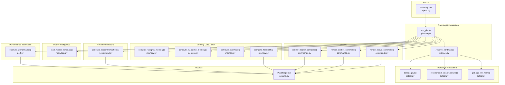
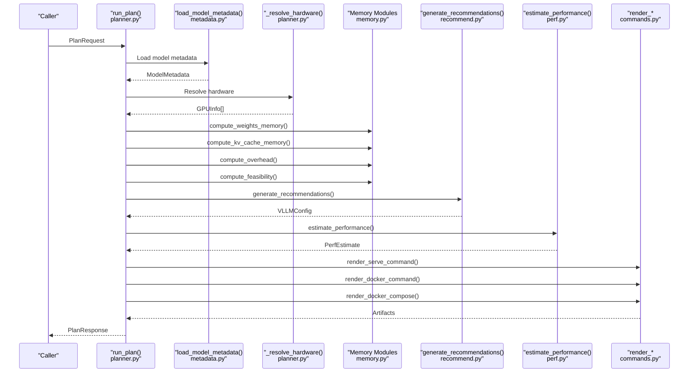
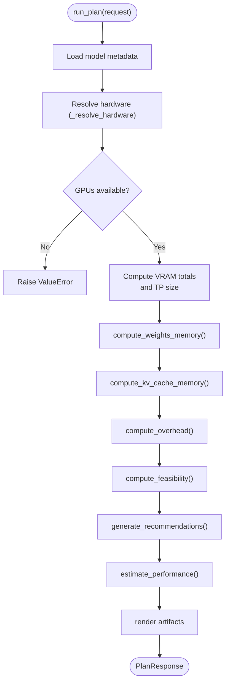
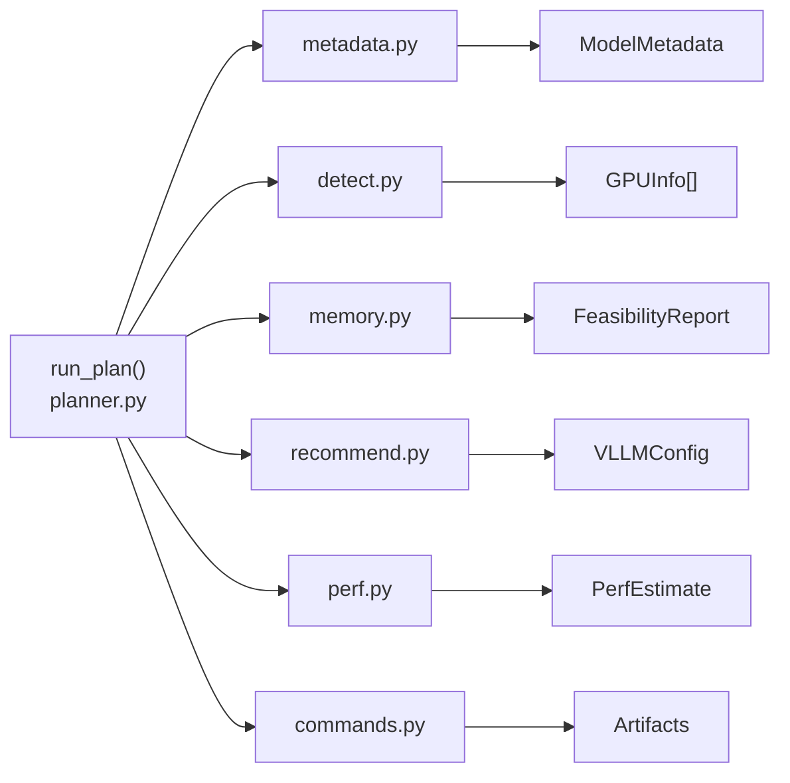

# Planner Core

<cite>
**Referenced Files in This Document**
- [planner.py](file://src/vllm_wizard/planning/planner.py)
- [metadata.py](file://src/vllm_wizard/models/metadata.py)
- [detect.py](file://src/vllm_wizard/hardware/detect.py)
- [memory.py](file://src/vllm_wizard/planning/memory.py)
- [perf.py](file://src/vllm_wizard/planning/perf.py)
- [recommend.py](file://src/vllm_wizard/planning/recommend.py)
- [commands.py](file://src/vllm_wizard/render/commands.py)
- [inputs.py](file://src/vllm_wizard/schemas/inputs.py)
- [outputs.py](file://src/vllm_wizard/schemas/outputs.py)
- [cli.py](file://src/vllm_wizard/cli.py)
- [README.md](file://README.md)
</cite>

## Table of Contents
1. [Introduction](#introduction)
2. [Project Structure](#project-structure)
3. [Core Components](#core-components)
4. [Architecture Overview](#architecture-overview)
5. [Detailed Component Analysis](#detailed-component-analysis)
6. [Dependency Analysis](#dependency-analysis)
7. [Performance Considerations](#performance-considerations)
8. [Troubleshooting Guide](#troubleshooting-guide)
9. [Conclusion](#conclusion)
10. [Appendices](#appendices)

## Introduction
This document provides comprehensive API documentation for the main Planner orchestrator and the run_plan function. It explains how the planning pipeline coordinates model metadata loading, hardware resolution, memory calculation, and artifact generation. It documents the run_plan method signature, parameters, return value structure, and the internal workflow from request processing to final PlanResponse generation. It also covers programmatic usage, error handling patterns, and integration points with hardware detection, model intelligence, memory calculation, and performance estimation modules.

## Project Structure
The planner orchestrates several modules:
- Input schemas define the request structure (PlanRequest).
- Model metadata extraction loads model architecture details from local or remote sources.
- Hardware detection resolves GPU configuration from system detection, explicit names, or manual VRAM specs.
- Memory calculation computes weights, KV cache, overhead, and feasibility.
- Recommendation engine derives vLLM configuration parameters.
- Performance estimation predicts approximate throughput and latency.
- Artifact rendering produces runnable commands and deployment manifests.

**Diagram sources**
- [planner.py](file://src/vllm_wizard/planning/planner.py#L21-L135)
- [metadata.py](file://src/vllm_wizard/models/metadata.py#L209-L254)
- [detect.py](file://src/vllm_wizard/hardware/detect.py#L10-L171)
- [memory.py](file://src/vllm_wizard/planning/memory.py#L31-L270)
- [recommend.py](file://src/vllm_wizard/planning/recommend.py#L167-L332)
- [perf.py](file://src/vllm_wizard/planning/perf.py#L136-L219)
- [commands.py](file://src/vllm_wizard/render/commands.py#L6-L113)
- [outputs.py](file://src/vllm_wizard/schemas/outputs.py#L103-L118)

**Section sources**
- [planner.py](file://src/vllm_wizard/planning/planner.py#L1-L172)
- [inputs.py](file://src/vllm_wizard/schemas/inputs.py#L102-L110)
- [outputs.py](file://src/vllm_wizard/schemas/outputs.py#L103-L118)

## Core Components
- run_plan(request: PlanRequest) -> PlanResponse: Orchestrates the entire planning pipeline.
- _resolve_hardware(request: PlanRequest) -> list[GPUInfo]: Resolves GPU configuration from request or detection.
- load_model_metadata(...): Loads model metadata from local path or HuggingFace Hub.
- compute_* functions: Memory breakdown computation and feasibility analysis.
- generate_recommendations(...): Derives vLLM configuration parameters.
- estimate_performance(...): Heuristic performance prediction.
- render_* functions: Generates runnable commands and deployment artifacts.

Key return types:
- PlanResponse: Aggregates feasibility, config, performance, and artifacts.

**Section sources**
- [planner.py](file://src/vllm_wizard/planning/planner.py#L21-L135)
- [outputs.py](file://src/vllm_wizard/schemas/outputs.py#L103-L118)

## Architecture Overview
The run_plan function is the central orchestrator. It:
1. Loads model metadata.
2. Resolves hardware (auto-detect, by name, or manual VRAM).
3. Computes VRAM totals and tensor-parallel size.
4. Calculates memory breakdown (weights, KV cache, overhead).
5. Determines feasibility and generates recommendations.
6. Estimates performance.
7. Renders artifacts (serve command, docker command/compose).
8. Returns PlanResponse.

**Diagram sources**
- [planner.py](file://src/vllm_wizard/planning/planner.py#L21-L135)
- [metadata.py](file://src/vllm_wizard/models/metadata.py#L209-L254)
- [memory.py](file://src/vllm_wizard/planning/memory.py#L31-L270)
- [recommend.py](file://src/vllm_wizard/planning/recommend.py#L167-L332)
- [perf.py](file://src/vllm_wizard/planning/perf.py#L136-L219)
- [commands.py](file://src/vllm_wizard/render/commands.py#L6-L113)

## Detailed Component Analysis

### run_plan Method
- Purpose: Execute the complete planning pipeline and produce a PlanResponse.
- Signature: run_plan(request: PlanRequest) -> PlanResponse
- Parameters:
  - request: PlanRequest containing model, hardware, workload, and policy inputs.
- Returns:
  - PlanResponse with feasibility, config, performance, and artifacts.
- Workflow highlights:
  - Model metadata loading via load_model_metadata.
  - Hardware resolution via _resolve_hardware.
  - VRAM computation and tensor-parallel size determination.
  - Memory breakdown and feasibility analysis.
  - Recommendations generation.
  - Performance estimation.
  - Artifact rendering (serve, docker, compose).
- Exceptions:
  - Raises ValueError if no GPUs are detected or specified and auto-detection fails.

**Diagram sources**
- [planner.py](file://src/vllm_wizard/planning/planner.py#L21-L135)
- [memory.py](file://src/vllm_wizard/planning/memory.py#L31-L270)
- [recommend.py](file://src/vllm_wizard/planning/recommend.py#L167-L332)
- [perf.py](file://src/vllm_wizard/planning/perf.py#L136-L219)
- [commands.py](file://src/vllm_wizard/render/commands.py#L6-L113)

**Section sources**
- [planner.py](file://src/vllm_wizard/planning/planner.py#L21-L135)

### _resolve_hardware Function
- Purpose: Resolve GPU configuration from PlanRequest or system detection.
- Behavior:
  - If gpu is "auto", auto-detect GPUs via detect_gpus and limit to requested count.
  - If gpu is a known name, resolve via get_gpu_by_name and replicate for requested gpus.
  - If vram_gb is provided, construct GPUInfo with manual VRAM and replicate.
  - Otherwise return empty list.
- Returns: list[GPUInfo] representing the selected hardware.

**Section sources**
- [planner.py](file://src/vllm_wizard/planning/planner.py#L138-L171)
- [detect.py](file://src/vllm_wizard/hardware/detect.py#L10-L71)
- [detect.py](file://src/vllm_wizard/hardware/detect.py#L162-L228)

### Model Metadata Loading
- load_model_metadata(model_id_or_path, revision, trust_remote_code, params_b) -> ModelMetadata
- Behavior:
  - If path exists locally, load config.json from disk.
  - Else download config.json from HuggingFace Hub.
  - Parse into ModelMetadata with fallbacks for architecture parameters.
  - Set num_params from override, known lookup table, or estimation.
- Exceptions:
  - Raises FileNotFoundError for missing local config.
  - Raises ValueError for missing required fields or invalid repositories.

**Section sources**
- [metadata.py](file://src/vllm_wizard/models/metadata.py#L209-L254)
- [metadata.py](file://src/vllm_wizard/models/metadata.py#L77-L100)
- [metadata.py](file://src/vllm_wizard/models/metadata.py#L102-L158)

### Memory Calculation Coordination
- compute_weights_memory(params_b, dtype, quantization) -> bytes
- compute_kv_cache_memory(metadata, context_len, concurrency, kv_dtype, dtype, fragmentation_factor) -> bytes
- compute_overhead(vram_total_bytes, tp_size, fixed_overhead_gb) -> bytes
- compute_feasibility(...) -> FeasibilityReport
- compute_max_concurrency_at_context(...) and compute_max_context_at_concurrency(...)
- Complexity:
  - Memory computations are O(1) with respect to model size; KV cache scales linearly with context_len and concurrency.
- Notes:
  - KV cache fragmentation_factor accounts for memory fragmentation.
  - Feasibility checks headroom and warns on high OOM risk and excessive KV cache usage.

**Section sources**
- [memory.py](file://src/vllm_wizard/planning/memory.py#L31-L56)
- [memory.py](file://src/vllm_wizard/planning/memory.py#L59-L121)
- [memory.py](file://src/vllm_wizard/planning/memory.py#L124-L152)
- [memory.py](file://src/vllm_wizard/planning/memory.py#L155-L270)
- [memory.py](file://src/vllm_wizard/planning/memory.py#L273-L366)

### Recommendation Engine
- generate_recommendations(request, metadata, gpus, vram_total_bytes) -> VLLMConfig
- Behavior:
  - Recommends tensor_parallel_size (power-of-two, adjusted for weights fit).
  - Adjusts gpu_memory_utilization for consumer GPUs.
  - Recommends quantization if configuration does not fit without it.
  - Suggests KV cache dtype (e.g., FP8) for high KV pressure on supported GPUs.
  - Sets max_model_len to the smaller of model max and what fits.
  - Computes max_num_seqs and max_num_batched_tokens based on batching mode and VRAM.
  - Selects dtype (auto or user-specified).
- Explanations:
  - Returns parameter explanations when request.explain is True.

**Section sources**
- [recommend.py](file://src/vllm_wizard/planning/recommend.py#L167-L332)

### Performance Estimation
- estimate_performance(gpu_name, params_b, tp_size, context_len, prompt_tokens, quantization, interconnect, num_gpus) -> PerfEstimate
- Behavior:
  - Uses baseline tables for decode and prefill TPS by GPU family.
  - Scales by model size (inverse scaling with exponent ~0.85).
  - Applies tensor-parallel efficiency based on interconnect (NVLink > PCIe).
  - Adjusts for context length (mild degradation).
  - Applies quantization speedup factors.
  - Produces ranges with confidence intervals and assumptions.

**Section sources**
- [perf.py](file://src/vllm_wizard/planning/perf.py#L136-L219)

### Artifact Generation
- render_serve_command(VLLMConfig) -> str
- render_docker_command(VLLMConfig) -> str
- render_docker_compose(VLLMConfig) -> str
- render_k8s_values(VLLMConfig) -> str
- Behavior:
  - Builds CLI arguments from VLLMConfig.
  - Generates docker-compose with GPU reservations and environment variables.
  - Generates Kubernetes values with resource requests.

**Section sources**
- [commands.py](file://src/vllm_wizard/render/commands.py#L6-L113)
- [commands.py](file://src/vllm_wizard/render/commands.py#L116-L195)

### Programmatic Usage Examples
Below are examples of invoking the planner programmatically. Replace placeholders with your configuration.

- Example 1: Auto-detect GPUs and plan for a model with default settings.
  - Build PlanRequest with model, hardware set to auto, and workload defaults.
  - Call run_plan(request) and inspect PlanResponse.

- Example 2: Manual hardware specification.
  - Set hardware.gpu to a known GPU name, hardware.gpus to desired count, and hardware.vram_gb to VRAM per GPU.
  - Optionally set hardware.tensor_parallel_size.

- Example 3: Quantized model with reduced context.
  - Set model.quantization to a supported method (e.g., awq).
  - Reduce model.max_model_len to fit KV cache within headroom.

- Example 4: Multi-GPU with NVLink interconnect.
  - Set hardware.gpus > 1 and hardware.interconnect to NVLINK.
  - Allow tensor_parallel_size to be auto-recommended.

- Example 5: Include explanations.
  - Set request.explain to True to receive parameter explanations in VLLMConfig.explanations.

Notes:
- Use the CLI commands plan and generate for quick testing and artifact generation.
- For scripted automation, use plan with --json to parse PlanResponse.

**Section sources**
- [cli.py](file://src/vllm_wizard/cli.py#L82-L213)
- [cli.py](file://src/vllm_wizard/cli.py#L215-L381)
- [README.md](file://README.md#L26-L88)

## Dependency Analysis
The planner orchestrator integrates tightly with:
- Hardware detection for GPU discovery and VRAM estimation.
- Model metadata loader for architecture-aware memory computations.
- Memory calculation modules for weights, KV cache, overhead, and feasibility.
- Recommendation engine for derived vLLM configuration.
- Performance estimation for throughput/latency predictions.
- Artifact renderers for runnable commands and deployment manifests.

**Diagram sources**
- [planner.py](file://src/vllm_wizard/planning/planner.py#L5-L18)
- [detect.py](file://src/vllm_wizard/hardware/detect.py#L10-L171)
- [metadata.py](file://src/vllm_wizard/models/metadata.py#L209-L254)
- [memory.py](file://src/vllm_wizard/planning/memory.py#L31-L270)
- [recommend.py](file://src/vllm_wizard/planning/recommend.py#L167-L332)
- [perf.py](file://src/vllm_wizard/planning/perf.py#L136-L219)
- [commands.py](file://src/vllm_wizard/render/commands.py#L6-L113)

**Section sources**
- [planner.py](file://src/vllm_wizard/planning/planner.py#L5-L18)

## Performance Considerations
- Memory scaling:
  - KV cache scales linearly with context length and concurrency; consider FP8 KV cache or shorter context to reduce pressure.
  - Weights memory depends on parameter count and dtype/quantization; quantization reduces footprint.
- Throughput:
  - Tensor parallel scaling efficiency depends on interconnect (NVLink > PCIe).
  - Decode throughput degrades with longer contexts; prefill throughput is less sensitive.
- VRAM utilization:
  - Lower utilization increases headroom but reduces throughput; balance based on workload.
- Recommendations:
  - The recommendation engine adjusts parameters to maximize fit and performance within constraints.

[No sources needed since this section provides general guidance]

## Troubleshooting Guide
Common errors and resolutions:
- No GPUs detected or specified:
  - Ensure nvidia-smi is installed and accessible, or explicitly provide hardware.gpu and hardware.vram_gb.
  - The planner raises a ValueError when no GPUs are available and auto-detection fails.
- Missing local config.json:
  - Verify the model path points to a directory containing config.json or use a valid HuggingFace model ID.
- Invalid HuggingFace repository or missing config.json:
  - Confirm the model ID and revision; ensure the repository exists and contains config.json.
- Configuration does not fit in VRAM:
  - Reduce context length, enable quantization, increase VRAM, or decrease concurrency.
  - The feasibility report includes warnings and suggests mitigations.
- High OOM risk:
  - The feasibility report classifies risk; consider FP8 KV cache, shorter context, or quantization.

**Section sources**
- [planner.py](file://src/vllm_wizard/planning/planner.py#L41-L45)
- [metadata.py](file://src/vllm_wizard/models/metadata.py#L77-L100)
- [memory.py](file://src/vllm_wizard/planning/memory.py#L236-L256)

## Conclusion
The run_plan function orchestrates a robust planning pipeline that integrates model intelligence, hardware resolution, memory calculation, and performance estimation to deliver actionable recommendations and artifacts. Its structured workflow, clear error handling, and extensible modules make it suitable for both interactive CLI usage and programmatic integration.

[No sources needed since this section summarizes without analyzing specific files]

## Appendices

### API Reference: run_plan
- Signature: run_plan(request: PlanRequest) -> PlanResponse
- Inputs:
  - PlanRequest with model, hardware, workload, and policy.
- Outputs:
  - PlanResponse with feasibility, config, performance, and artifacts.
- Exceptions:
  - ValueError if no GPUs are detected or specified.
  - FileNotFoundError for missing local config.
  - ValueError for invalid HuggingFace repositories or missing fields.

**Section sources**
- [planner.py](file://src/vllm_wizard/planning/planner.py#L21-L135)
- [outputs.py](file://src/vllm_wizard/schemas/outputs.py#L103-L118)

### Schema Definitions
- PlanRequest: Combines ModelInput, HardwareInput, WorkloadInput, and PolicyInput.
- FeasibilityReport: Summarizes VRAM breakdown, headroom, and warnings.
- VLLMConfig: Recommended vLLM serve configuration with explanations.
- PerfEstimate: Heuristic throughput and latency ranges.
- Artifacts: Generated commands and deployment manifests.

**Section sources**
- [inputs.py](file://src/vllm_wizard/schemas/inputs.py#L102-L110)
- [outputs.py](file://src/vllm_wizard/schemas/outputs.py#L37-L118)