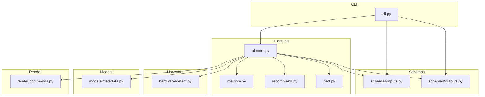
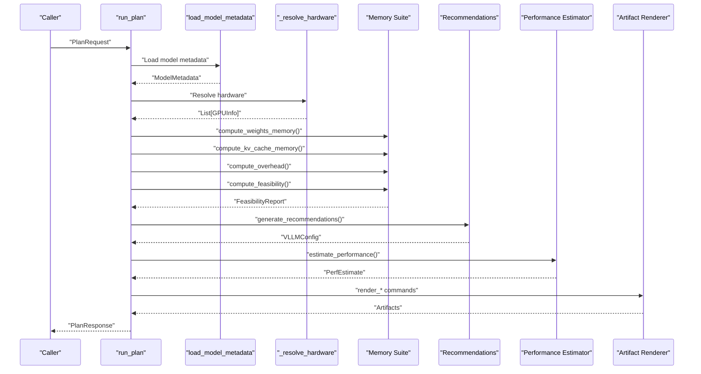
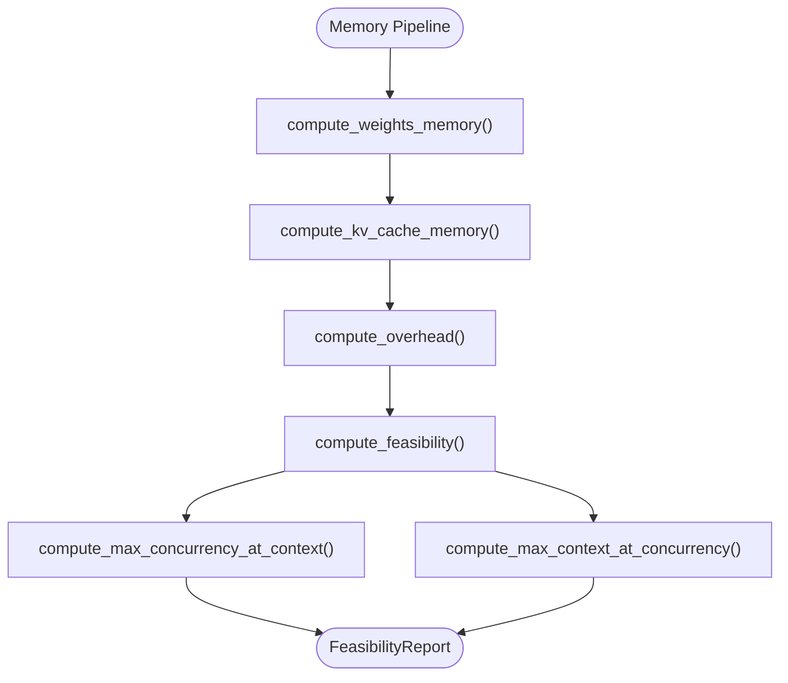
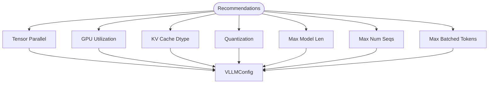
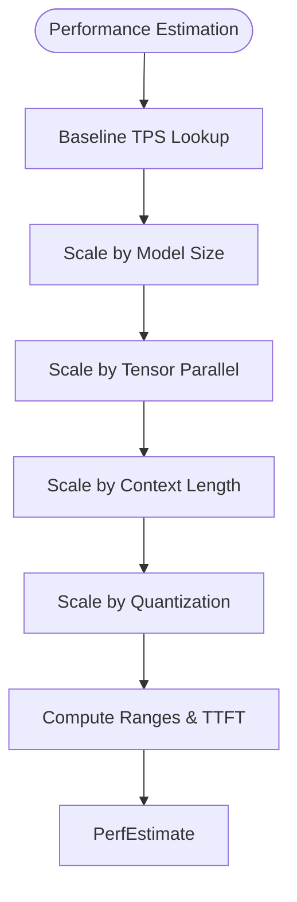
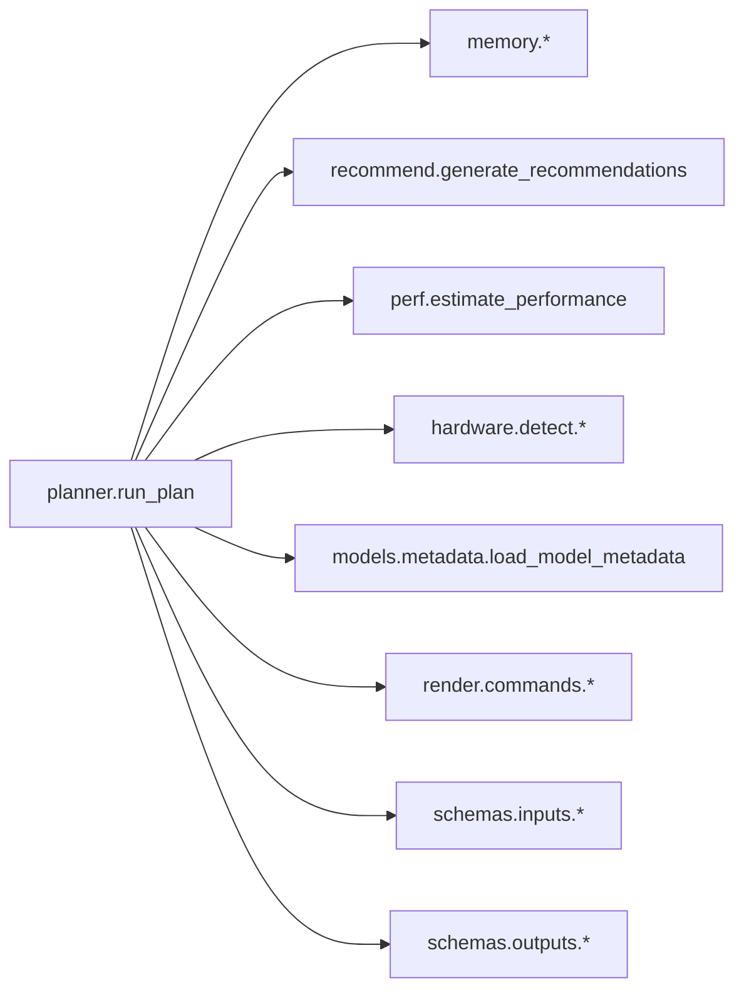

# Planning Engine API

<cite>
**Referenced Files in This Document**
- [planner.py](file://src/vllm_wizard/planning/planner.py)
- [memory.py](file://src/vllm_wizard/planning/memory.py)
- [perf.py](file://src/vllm_wizard/planning/perf.py)
- [recommend.py](file://src/vllm_wizard/planning/recommend.py)
- [inputs.py](file://src/vllm_wizard/schemas/inputs.py)
- [outputs.py](file://src/vllm_wizard/schemas/outputs.py)
- [detect.py](file://src/vllm_wizard/hardware/detect.py)
- [metadata.py](file://src/vllm_wizard/models/metadata.py)
- [commands.py](file://src/vllm_wizard/render/commands.py)
- [cli.py](file://src/vllm_wizard/cli.py)
</cite>

## Table of Contents
1. [Introduction](#introduction)
2. [Project Structure](#project-structure)
3. [Core Components](#core-components)
4. [Architecture Overview](#architecture-overview)
5. [Detailed Component Analysis](#detailed-component-analysis)
6. [Dependency Analysis](#dependency-analysis)
7. [Performance Considerations](#performance-considerations)
8. [Troubleshooting Guide](#troubleshooting-guide)
9. [Conclusion](#conclusion)
10. [Appendices](#appendices)

## Introduction
This document provides comprehensive API documentation for the planning engine components that orchestrate vLLM sizing and configuration. It focuses on the main Planner workflow, memory calculation functions, performance estimation algorithms, and recommendation systems. It includes method signatures, parameter specifications, return value descriptions, programmatic usage examples, internal data flow, error handling patterns, and integration points with hardware detection and model intelligence modules.

## Project Structure
The planning engine resides under the planning package and integrates with hardware detection, model metadata extraction, and artifact rendering.

**Diagram sources**
- [planner.py](file://src/vllm_wizard/planning/planner.py#L1-L172)
- [memory.py](file://src/vllm_wizard/planning/memory.py#L1-L367)
- [recommend.py](file://src/vllm_wizard/planning/recommend.py#L1-L333)
- [perf.py](file://src/vllm_wizard/planning/perf.py#L1-L220)
- [inputs.py](file://src/vllm_wizard/schemas/inputs.py#L1-L110)
- [outputs.py](file://src/vllm_wizard/schemas/outputs.py#L1-L118)
- [detect.py](file://src/vllm_wizard/hardware/detect.py#L1-L229)
- [metadata.py](file://src/vllm_wizard/models/metadata.py#L1-L255)
- [commands.py](file://src/vllm_wizard/render/commands.py#L1-L196)
- [cli.py](file://src/vllm_wizard/cli.py#L1-L385)

**Section sources**
- [planner.py](file://src/vllm_wizard/planning/planner.py#L1-L172)
- [cli.py](file://src/vllm_wizard/cli.py#L1-L385)

## Core Components
- Planner orchestrator: [run_plan](file://src/vllm_wizard/planning/planner.py#L21-L135) coordinates model metadata loading, hardware resolution, memory computation, feasibility analysis, recommendations, performance estimation, and artifact generation.
- Memory calculation suite: [compute_weights_memory](file://src/vllm_wizard/planning/memory.py#L31-L56), [compute_kv_cache_memory](file://src/vllm_wizard/planning/memory.py#L59-L121), [compute_overhead](file://src/vllm_wizard/planning/memory.py#L124-L152), [compute_feasibility](file://src/vllm_wizard/planning/memory.py#L155-L270), plus helpers [compute_max_concurrency_at_context](file://src/vllm_wizard/planning/memory.py#L273-L316) and [compute_max_context_at_concurrency](file://src/vllm_wizard/planning/memory.py#L319-L366).
- Recommendation engine: [generate_recommendations](file://src/vllm_wizard/planning/recommend.py#L167-L332) and supporting functions for TP, utilization, KV cache dtype, quantization, batching parameters.
- Performance estimation: [estimate_performance](file://src/vllm_wizard/planning/perf.py#L136-L219) with scaling helpers.
- Input/Output schemas: [inputs.py](file://src/vllm_wizard/schemas/inputs.py#L9-L110), [outputs.py](file://src/vllm_wizard/schemas/outputs.py#L9-L118).
- Hardware detection: [detect_gpus](file://src/vllm_wizard/hardware/detect.py#L10-L72), [recommend_tensor_parallel](file://src/vllm_wizard/hardware/detect.py#L138-L159), [get_gpu_by_name](file://src/vllm_wizard/hardware/detect.py#L162-L228).
- Model metadata: [load_model_metadata](file://src/vllm_wizard/models/metadata.py#L209-L254), [ModelMetadata](file://src/vllm_wizard/models/metadata.py#L12-L37).
- Artifact rendering: [render_serve_command](file://src/vllm_wizard/render/commands.py#L6-L45), [render_docker_command](file://src/vllm_wizard/render/commands.py#L48-L72), [render_docker_compose](file://src/vllm_wizard/render/commands.py#L75-L113), [render_k8s_values](file://src/vllm_wizard/render/commands.py#L116-L155).

**Section sources**
- [planner.py](file://src/vllm_wizard/planning/planner.py#L21-L135)
- [memory.py](file://src/vllm_wizard/planning/memory.py#L31-L270)
- [recommend.py](file://src/vllm_wizard/planning/recommend.py#L167-L332)
- [perf.py](file://src/vllm_wizard/planning/perf.py#L136-L219)
- [inputs.py](file://src/vllm_wizard/schemas/inputs.py#L9-L110)
- [outputs.py](file://src/vllm_wizard/schemas/outputs.py#L9-L118)
- [detect.py](file://src/vllm_wizard/hardware/detect.py#L10-L228)
- [metadata.py](file://src/vllm_wizard/models/metadata.py#L12-L254)
- [commands.py](file://src/vllm_wizard/render/commands.py#L6-L155)

## Architecture Overview
The planner orchestrates a pipeline that ingests user inputs, resolves hardware, computes memory footprints, validates feasibility, generates recommendations, estimates performance, and renders artifacts.

**Diagram sources**
- [planner.py](file://src/vllm_wizard/planning/planner.py#L21-L135)
- [memory.py](file://src/vllm_wizard/planning/memory.py#L31-L270)
- [recommend.py](file://src/vllm_wizard/planning/recommend.py#L167-L332)
- [perf.py](file://src/vllm_wizard/planning/perf.py#L136-L219)
- [detect.py](file://src/vllm_wizard/hardware/detect.py#L138-L159)
- [metadata.py](file://src/vllm_wizard/models/metadata.py#L209-L254)
- [commands.py](file://src/vllm_wizard/render/commands.py#L6-L155)

## Detailed Component Analysis

### Planner Orchestrator
- Method: [run_plan](file://src/vllm_wizard/planning/planner.py#L21-L135)
  - Purpose: Execute the full planning pipeline from request to response.
  - Parameters:
    - request: [PlanRequest](file://src/vllm_wizard/schemas/inputs.py#L102-L110)
  - Returns:
    - [PlanResponse](file://src/vllm_wizard/schemas/outputs.py#L103-L118): includes feasibility, config, performance, and artifacts.
  - Processing logic:
    - Loads model metadata via [load_model_metadata](file://src/vllm_wizard/models/metadata.py#L209-L254).
    - Resolves hardware via [_resolve_hardware](file://src/vllm_wizard/planning/planner.py#L138-L171), which delegates to [detect_gpus](file://src/vllm_wizard/hardware/detect.py#L10-L72) and [recommend_tensor_parallel](file://src/vllm_wizard/hardware/detect.py#L138-L159).
    - Computes VRAM totals and effective VRAM for tensor parallel groups.
    - Calculates memory components using [compute_weights_memory](file://src/vllm_wizard/planning/memory.py#L31-L56), [compute_kv_cache_memory](file://src/vllm_wizard/planning/memory.py#L59-L121), [compute_overhead](file://src/vllm_wizard/planning/memory.py#L124-L152).
    - Validates feasibility with [compute_feasibility](file://src/vllm_wizard/planning/memory.py#L155-L270).
    - Generates recommendations via [generate_recommendations](file://src/vllm_wizard/planning/recommend.py#L167-L332).
    - Estimates performance with [estimate_performance](file://src/vllm_wizard/planning/perf.py#L136-L219).
    - Renders artifacts using [render_serve_command](file://src/vllm_wizard/render/commands.py#L6-L45), [render_docker_command](file://src/vllm_wizard/render/commands.py#L48-L72), [render_docker_compose](file://src/vllm_wizard/render/commands.py#L75-L113).
  - Exceptions:
    - Raises ValueError if no GPUs are detected or specified and auto-detection fails.
  - Programmatic usage example:
    - Build a [PlanRequest](file://src/vllm_wizard/schemas/inputs.py#L102-L110) with model, hardware, workload, and policy inputs.
    - Call [run_plan](file://src/vllm_wizard/planning/planner.py#L21-L135) and handle [PlanResponse](file://src/vllm_wizard/schemas/outputs.py#L103-L118).

**Section sources**
- [planner.py](file://src/vllm_wizard/planning/planner.py#L21-L135)
- [detect.py](file://src/vllm_wizard/hardware/detect.py#L10-L72)
- [detect.py](file://src/vllm_wizard/hardware/detect.py#L138-L159)
- [memory.py](file://src/vllm_wizard/planning/memory.py#L31-L152)
- [recommend.py](file://src/vllm_wizard/planning/recommend.py#L167-L332)
- [perf.py](file://src/vllm_wizard/planning/perf.py#L136-L219)
- [commands.py](file://src/vllm_wizard/render/commands.py#L6-L113)
- [inputs.py](file://src/vllm_wizard/schemas/inputs.py#L102-L110)
- [outputs.py](file://src/vllm_wizard/schemas/outputs.py#L103-L118)

### Memory Calculation Suite
- Weights memory:
  - [compute_weights_memory](file://src/vllm_wizard/planning/memory.py#L31-L56)
  - Parameters:
    - params_b: float (billions of parameters)
    - dtype: [DType](file://src/vllm_wizard/schemas/inputs.py#L9-L16)
    - quantization: [Quantization](file://src/vllm_wizard/schemas/inputs.py#L18-L26)
  - Returns: int (bytes)
- KV cache memory:
  - [compute_kv_cache_memory](file://src/vllm_wizard/planning/memory.py#L59-L121)
  - Parameters:
    - metadata: [ModelMetadata](file://src/vllm_wizard/models/metadata.py#L12-L37)
    - context_len: int (tokens)
    - concurrency: int
    - kv_dtype: [KVCacheDType](file://src/vllm_wizard/schemas/inputs.py#L28-L36)
    - dtype: [DType](file://src/vllm_wizard/schemas/inputs.py#L9-L16)
    - fragmentation_factor: float
  - Returns: int (bytes)
- Overhead:
  - [compute_overhead](file://src/vllm_wizard/planning/memory.py#L124-L152)
  - Parameters:
    - vram_total_bytes: int
    - tp_size: int
    - fixed_overhead_gb: Optional[float]
  - Returns: int (bytes)
- Feasibility:
  - [compute_feasibility](file://src/vllm_wizard/planning/memory.py#L155-L270)
  - Parameters include weights, KV cache, overhead, VRAM, utilization, headroom, context, concurrency, metadata, dtypes, fragmentation.
  - Returns: [FeasibilityReport](file://src/vllm_wizard/schemas/outputs.py#L37-L55)
- Max concurrency at context:
  - [compute_max_concurrency_at_context](file://src/vllm_wizard/planning/memory.py#L273-L316)
- Max context at concurrency:
  - [compute_max_context_at_concurrency](file://src/vllm_wizard/planning/memory.py#L319-L366)

**Diagram sources**
- [memory.py](file://src/vllm_wizard/planning/memory.py#L31-L270)

**Section sources**
- [memory.py](file://src/vllm_wizard/planning/memory.py#L31-L366)
- [inputs.py](file://src/vllm_wizard/schemas/inputs.py#L9-L36)
- [outputs.py](file://src/vllm_wizard/schemas/outputs.py#L37-L55)
- [metadata.py](file://src/vllm_wizard/models/metadata.py#L12-L37)

### Recommendation Engine
- [generate_recommendations](file://src/vllm_wizard/planning/recommend.py#L167-L332)
  - Parameters:
    - request: [PlanRequest](file://src/vllm_wizard/schemas/inputs.py#L102-L110)
    - metadata: [ModelMetadata](file://src/vllm_wizard/models/metadata.py#L12-L37)
    - gpus: list[[GPUInfo](file://src/vllm_wizard/schemas/outputs.py#L17-L35)]
    - vram_total_bytes: int
  - Returns: [VLLMConfig](file://src/vllm_wizard/schemas/outputs.py#L57-L75)
  - Recommendations include:
    - Tensor parallel size via [_recommend_tensor_parallel](file://src/vllm_wizard/planning/recommend.py#L42-L68)
    - GPU memory utilization via [_recommend_gpu_memory_utilization](file://src/vllm_wizard/planning/recommend.py#L32-L40)
    - KV cache dtype via [_recommend_kv_cache_dtype](file://src/vllm_wizard/planning/recommend.py#L102-L122)
    - Quantization via [_recommend_quantization](file://src/vllm_wizard/planning/recommend.py#L88-L100)
    - Max model length via [_recommend_max_model_len](file://src/vllm_wizard/planning/recommend.py#L70-L86)
    - Max number of sequences via [_recommend_max_num_seqs](file://src/vllm_wizard/planning/recommend.py#L124-L137)
    - Max batched tokens via [_recommend_max_batched_tokens](file://src/vllm_wizard/planning/recommend.py#L139-L165)

**Diagram sources**
- [recommend.py](file://src/vllm_wizard/planning/recommend.py#L167-L332)

**Section sources**
- [recommend.py](file://src/vllm_wizard/planning/recommend.py#L167-L332)
- [inputs.py](file://src/vllm_wizard/schemas/inputs.py#L54-L109)
- [outputs.py](file://src/vllm_wizard/schemas/outputs.py#L57-L75)
- [metadata.py](file://src/vllm_wizard/models/metadata.py#L12-L37)

### Performance Estimation
- [estimate_performance](file://src/vllm_wizard/planning/perf.py#L136-L219)
  - Parameters:
    - gpu_name: str
    - params_b: float
    - tp_size: int
    - context_len: int
    - prompt_tokens: int
    - quantization: [Quantization](file://src/vllm_wizard/schemas/inputs.py#L18-L26)
    - interconnect: [Interconnect](file://src/vllm_wizard/schemas/inputs.py#L38-L44)
    - num_gpus: int
  - Returns: [PerfEstimate](file://src/vllm_wizard/schemas/outputs.py#L77-L91)
  - Scaling helpers:
    - [_get_gpu_baseline](file://src/vllm_wizard/planning/perf.py#L56-L67)
    - [_scale_by_model_size](file://src/vllm_wizard/planning/perf.py#L70-L80)
    - [_scale_by_tensor_parallel](file://src/vllm_wizard/planning/perf.py#L83-L104)
    - [_scale_by_context](file://src/vllm_wizard/planning/perf.py#L107-L118)
    - [_scale_by_quantization](file://src/vllm_wizard/planning/perf.py#L120-L134)

**Diagram sources**
- [perf.py](file://src/vllm_wizard/planning/perf.py#L136-L219)

**Section sources**
- [perf.py](file://src/vllm_wizard/planning/perf.py#L136-L219)
- [inputs.py](file://src/vllm_wizard/schemas/inputs.py#L18-L44)
- [outputs.py](file://src/vllm_wizard/schemas/outputs.py#L77-L91)

### Hardware Detection and Resolution
- [detect_gpus](file://src/vllm_wizard/hardware/detect.py#L10-L72) queries nvidia-smi and enriches with driver/CUDA/compute capability.
- [recommend_tensor_parallel](file://src/vllm_wizard/hardware/detect.py#L138-L159) chooses largest power-of-two TP size ≤ number of GPUs.
- [get_gpu_by_name](file://src/vllm_wizard/hardware/detect.py#L162-L228) provides approximate VRAM for known GPU names.
- [_resolve_hardware](file://src/vllm_wizard/planning/planner.py#L138-L171) selects GPUs based on request or detection.

**Section sources**
- [detect.py](file://src/vllm_wizard/hardware/detect.py#L10-L228)
- [planner.py](file://src/vllm_wizard/planning/planner.py#L138-L171)

### Model Metadata Extraction
- [load_model_metadata](file://src/vllm_wizard/models/metadata.py#L209-L254) loads config.json from local path or Hugging Face, parses into [ModelMetadata](file://src/vllm_wizard/models/metadata.py#L12-L37), and sets parameter count from override, lookup table, or estimation.
- [estimate_params_from_config](file://src/vllm_wizard/models/metadata.py#L161-L188) provides a rough parameter estimate.
- [lookup_known_model_size](file://src/vllm_wizard/models/metadata.py#L191-L206) maps model IDs to known sizes.

**Section sources**
- [metadata.py](file://src/vllm_wizard/models/metadata.py#L12-L254)

### Artifact Rendering
- [render_serve_command](file://src/vllm_wizard/render/commands.py#L6-L45)
- [render_docker_command](file://src/vllm_wizard/render/commands.py#L48-L72)
- [render_docker_compose](file://src/vllm_wizard/render/commands.py#L75-L113)
- [render_k8s_values](file://src/vllm_wizard/render/commands.py#L116-L155)

**Section sources**
- [commands.py](file://src/vllm_wizard/render/commands.py#L6-L155)

## Dependency Analysis
The planner depends on memory, recommendation, performance, hardware detection, model metadata, and rendering modules. Inputs and outputs define the contract between components.

**Diagram sources**
- [planner.py](file://src/vllm_wizard/planning/planner.py#L1-L172)
- [memory.py](file://src/vllm_wizard/planning/memory.py#L1-L367)
- [recommend.py](file://src/vllm_wizard/planning/recommend.py#L1-L333)
- [perf.py](file://src/vllm_wizard/planning/perf.py#L1-L220)
- [detect.py](file://src/vllm_wizard/hardware/detect.py#L1-L229)
- [metadata.py](file://src/vllm_wizard/models/metadata.py#L1-L255)
- [commands.py](file://src/vllm_wizard/render/commands.py#L1-L196)
- [inputs.py](file://src/vllm_wizard/schemas/inputs.py#L1-L110)
- [outputs.py](file://src/vllm_wizard/schemas/outputs.py#L1-L118)

**Section sources**
- [planner.py](file://src/vllm_wizard/planning/planner.py#L1-L172)
- [memory.py](file://src/vllm_wizard/planning/memory.py#L1-L367)
- [recommend.py](file://src/vllm_wizard/planning/recommend.py#L1-L333)
- [perf.py](file://src/vllm_wizard/planning/perf.py#L1-L220)
- [detect.py](file://src/vllm_wizard/hardware/detect.py#L1-L229)
- [metadata.py](file://src/vllm_wizard/models/metadata.py#L1-L255)
- [commands.py](file://src/vllm_wizard/render/commands.py#L1-L196)
- [inputs.py](file://src/vllm_wizard/schemas/inputs.py#L1-L110)
- [outputs.py](file://src/vllm_wizard/schemas/outputs.py#L1-L118)

## Performance Considerations
- Memory calculations:
  - KV cache scales with layers × heads × head_dim × context × concurrency × dtype bytes and a fragmentation factor.
  - Overhead includes base overhead and communication buffers for tensor parallel setups.
- Recommendations:
  - Tensor parallel size is chosen to balance model weights across GPUs while respecting VRAM constraints.
  - KV cache dtype can be suggested to reduce memory footprint on supported GPUs.
  - Quantization is recommended when configurations do not fit without it.
- Performance estimation:
  - Heuristic baselines are scaled by model size, tensor parallel efficiency, context length, and quantization.
  - Ranges are provided to reflect uncertainty in estimates.

[No sources needed since this section provides general guidance]

## Troubleshooting Guide
- Hardware detection failures:
  - If nvidia-smi is unavailable or times out, hardware resolution falls back to manual specification or raises errors when neither is provided.
  - Verify GPU availability and permissions; see [detect_gpus](file://src/vllm_wizard/hardware/detect.py#L10-L72).
- Model metadata errors:
  - Missing required fields in config.json cause ValueError; ensure model config is valid or supply params_b override.
  - See [load_model_metadata](file://src/vllm_wizard/models/metadata.py#L209-L254).
- VRAM feasibility warnings:
  - Examine [FeasibilityReport](file://src/vllm_wizard/schemas/outputs.py#L37-L55) warnings for high OOM risk, KV cache pressure, or insufficient headroom.
  - Adjust context length, concurrency, quantization, or dtype.
- Performance estimation caveats:
  - Estimates are heuristic and depend on GPU class, interconnect, and workload characteristics.
  - See [estimate_performance](file://src/vllm_wizard/planning/perf.py#L136-L219).

**Section sources**
- [detect.py](file://src/vllm_wizard/hardware/detect.py#L10-L72)
- [metadata.py](file://src/vllm_wizard/models/metadata.py#L209-L254)
- [memory.py](file://src/vllm_wizard/planning/memory.py#L155-L270)
- [perf.py](file://src/vllm_wizard/planning/perf.py#L136-L219)

## Conclusion
The planning engine provides a robust, modular pipeline for sizing and configuring vLLM deployments. It integrates hardware detection, model metadata extraction, memory modeling, feasibility analysis, intelligent recommendations, performance estimation, and artifact generation. The APIs are designed around Pydantic models that ensure type safety and clear contracts across components.

[No sources needed since this section summarizes without analyzing specific files]

## Appendices

### API Reference Index
- Planner
  - [run_plan](file://src/vllm_wizard/planning/planner.py#L21-L135)
  - [_resolve_hardware](file://src/vllm_wizard/planning/planner.py#L138-L171)
- Memory
  - [compute_weights_memory](file://src/vllm_wizard/planning/memory.py#L31-L56)
  - [compute_kv_cache_memory](file://src/vllm_wizard/planning/memory.py#L59-L121)
  - [compute_overhead](file://src/vllm_wizard/planning/memory.py#L124-L152)
  - [compute_feasibility](file://src/vllm_wizard/planning/memory.py#L155-L270)
  - [compute_max_concurrency_at_context](file://src/vllm_wizard/planning/memory.py#L273-L316)
  - [compute_max_context_at_concurrency](file://src/vllm_wizard/planning/memory.py#L319-L366)
- Recommendations
  - [generate_recommendations](file://src/vllm_wizard/planning/recommend.py#L167-L332)
  - [_recommend_tensor_parallel](file://src/vllm_wizard/planning/recommend.py#L42-L68)
  - [_recommend_gpu_memory_utilization](file://src/vllm_wizard/planning/recommend.py#L32-L40)
  - [_recommend_kv_cache_dtype](file://src/vllm_wizard/planning/recommend.py#L102-L122)
  - [_recommend_quantization](file://src/vllm_wizard/planning/recommend.py#L88-L100)
  - [_recommend_max_model_len](file://src/vllm_wizard/planning/recommend.py#L70-L86)
  - [_recommend_max_num_seqs](file://src/vllm_wizard/planning/recommend.py#L124-L137)
  - [_recommend_max_batched_tokens](file://src/vllm_wizard/planning/recommend.py#L139-L165)
- Performance
  - [estimate_performance](file://src/vllm_wizard/planning/perf.py#L136-L219)
  - [_get_gpu_baseline](file://src/vllm_wizard/planning/perf.py#L56-L67)
  - [_scale_by_model_size](file://src/vllm_wizard/planning/perf.py#L70-L80)
  - [_scale_by_tensor_parallel](file://src/vllm_wizard/planning/perf.py#L83-L104)
  - [_scale_by_context](file://src/vllm_wizard/planning/perf.py#L107-L118)
  - [_scale_by_quantization](file://src/vllm_wizard/planning/perf.py#L120-L134)
- Hardware
  - [detect_gpus](file://src/vllm_wizard/hardware/detect.py#L10-L72)
  - [recommend_tensor_parallel](file://src/vllm_wizard/hardware/detect.py#L138-L159)
  - [get_gpu_by_name](file://src/vllm_wizard/hardware/detect.py#L162-L228)
- Models
  - [load_model_metadata](file://src/vllm_wizard/models/metadata.py#L209-L254)
  - [estimate_params_from_config](file://src/vllm_wizard/models/metadata.py#L161-L188)
  - [lookup_known_model_size](file://src/vllm_wizard/models/metadata.py#L191-L206)
- Schemas
  - [inputs.py](file://src/vllm_wizard/schemas/inputs.py#L9-L110)
  - [outputs.py](file://src/vllm_wizard/schemas/outputs.py#L9-L118)
- Rendering
  - [render_serve_command](file://src/vllm_wizard/render/commands.py#L6-L45)
  - [render_docker_command](file://src/vllm_wizard/render/commands.py#L48-L72)
  - [render_docker_compose](file://src/vllm_wizard/render/commands.py#L75-L113)
  - [render_k8s_values](file://src/vllm_wizard/render/commands.py#L116-L155)
- CLI
  - [cli.py](file://src/vllm_wizard/cli.py#L82-L213)
  - [cli.py](file://src/vllm_wizard/cli.py#L215-L381)