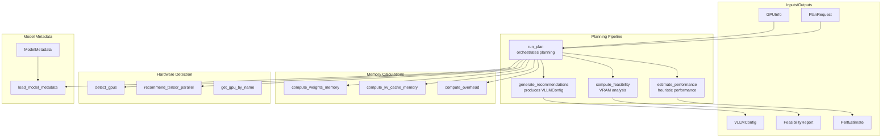
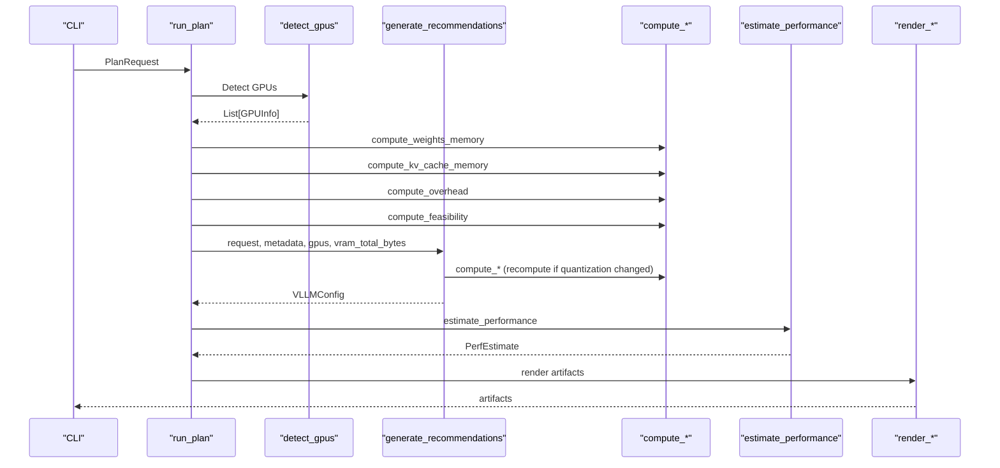
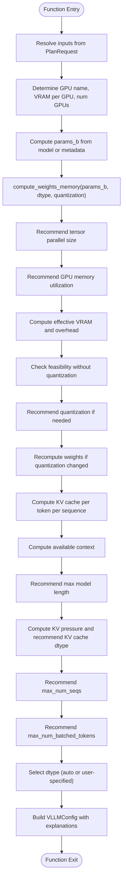
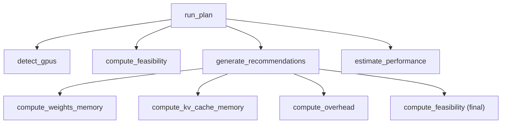

# Recommendation System API

<cite>
**Referenced Files in This Document**
- [recommend.py](file://src/vllm_wizard/planning/recommend.py)
- [planner.py](file://src/vllm_wizard/planning/planner.py)
- [memory.py](file://src/vllm_wizard/planning/memory.py)
- [detect.py](file://src/vllm_wizard/hardware/detect.py)
- [metadata.py](file://src/vllm_wizard/models/metadata.py)
- [inputs.py](file://src/vllm_wizard/schemas/inputs.py)
- [outputs.py](file://src/vllm_wizard/schemas/outputs.py)
- [perf.py](file://src/vllm_wizard/planning/perf.py)
- [commands.py](file://src/vllm_wizard/render/commands.py)
- [README.md](file://README.md)
</cite>

## Table of Contents
1. [Introduction](#introduction)
2. [Project Structure](#project-structure)
3. [Core Components](#core-components)
4. [Architecture Overview](#architecture-overview)
5. [Detailed Component Analysis](#detailed-component-analysis)
6. [Dependency Analysis](#dependency-analysis)
7. [Performance Considerations](#performance-considerations)
8. [Troubleshooting Guide](#troubleshooting-guide)
9. [Conclusion](#conclusion)
10. [Appendices](#appendices)

## Introduction
This document provides comprehensive API documentation for the recommendation generation system that powers vLLM configuration recommendations. It focuses on the generate_recommendations function, detailing its method signature, parameter specifications, and return value structure. It explains the recommendation algorithms for optimal tensor parallel sizes, GPU configurations, and vLLM parameters, and demonstrates how the system balances model requirements, hardware constraints, and deployment efficiency. The document also covers integration with feasibility analysis and hardware detection results, and provides examples for different model types and hardware scenarios.

## Project Structure
The recommendation system is part of a modular planning pipeline that orchestrates hardware detection, model metadata extraction, memory feasibility analysis, and performance estimation. The key modules involved in recommendation generation are:

- Planning orchestration: run_plan coordinates the end-to-end planning pipeline
- Recommendation engine: generate_recommendations produces the final vLLM configuration
- Memory calculations: compute_weights_memory, compute_kv_cache_memory, compute_overhead, compute_feasibility
- Hardware detection: detect_gpus, recommend_tensor_parallel, get_gpu_by_name
- Model metadata: load_model_metadata, ModelMetadata
- Inputs/outputs: PlanRequest, VLLMConfig, GPUInfo, FeasibilityReport
- Performance estimation: estimate_performance
- Artifact rendering: render_serve_command, render_docker_command, render_docker_compose

**Diagram sources**
- [planner.py](file://src/vllm_wizard/planning/planner.py#L21-L135)
- [recommend.py](file://src/vllm_wizard/planning/recommend.py#L167-L332)
- [memory.py](file://src/vllm_wizard/planning/memory.py#L155-L270)
- [detect.py](file://src/vllm_wizard/hardware/detect.py#L10-L159)
- [metadata.py](file://src/vllm_wizard/models/metadata.py#L209-L254)
- [inputs.py](file://src/vllm_wizard/schemas/inputs.py#L102-L110)
- [outputs.py](file://src/vllm_wizard/schemas/outputs.py#L57-L118)
- [perf.py](file://src/vllm_wizard/planning/perf.py#L136-L219)

**Section sources**
- [planner.py](file://src/vllm_wizard/planning/planner.py#L21-L135)
- [recommend.py](file://src/vllm_wizard/planning/recommend.py#L167-L332)
- [memory.py](file://src/vllm_wizard/planning/memory.py#L155-L270)
- [detect.py](file://src/vllm_wizard/hardware/detect.py#L10-L159)
- [metadata.py](file://src/vllm_wizard/models/metadata.py#L209-L254)
- [inputs.py](file://src/vllm_wizard/schemas/inputs.py#L102-L110)
- [outputs.py](file://src/vllm_wizard/schemas/outputs.py#L57-L118)
- [perf.py](file://src/vllm_wizard/planning/perf.py#L136-L219)

## Core Components
This section documents the generate_recommendations function and its surrounding ecosystem.

- generate_recommendations(request, metadata, gpus, vram_total_bytes) -> VLLMConfig
  - Purpose: Generate recommended vLLM configuration based on model, hardware, workload, and policy inputs.
  - Parameters:
    - request: PlanRequest containing model, hardware, workload, and policy inputs.
    - metadata: ModelMetadata extracted from model config or HF hub.
    - gpus: List of GPUInfo objects representing detected or configured GPUs.
    - vram_total_bytes: Total VRAM in bytes across all GPUs for tensor-parallel groups.
  - Returns: VLLMConfig with recommended settings and optional explanations.

Key recommendation algorithms implemented:
- Tensor parallel size recommendation: _recommend_tensor_parallel
- GPU memory utilization recommendation: _recommend_gpu_memory_utilization
- KV cache dtype recommendation: _recommend_kv_cache_dtype
- Quantization recommendation: _recommend_quantization
- Max model length recommendation: _recommend_max_model_len
- Max number of sequences recommendation: _recommend_max_num_seqs
- Max batched tokens recommendation: _recommend_max_batched_tokens

Integration points:
- Memory calculations: compute_weights_memory, compute_kv_cache_memory, compute_overhead
- Hardware detection: detect_gpus, recommend_tensor_parallel, get_gpu_by_name
- Performance estimation: estimate_performance
- Artifact rendering: render_serve_command, render_docker_command, render_docker_compose

**Section sources**
- [recommend.py](file://src/vllm_wizard/planning/recommend.py#L167-L332)
- [memory.py](file://src/vllm_wizard/planning/memory.py#L31-L152)
- [detect.py](file://src/vllm_wizard/hardware/detect.py#L138-L159)
- [perf.py](file://src/vllm_wizard/planning/perf.py#L136-L219)
- [commands.py](file://src/vllm_wizard/render/commands.py#L6-L45)

## Architecture Overview
The recommendation system follows a layered architecture:
- Input layer: PlanRequest aggregates model, hardware, workload, and policy inputs.
- Model layer: ModelMetadata provides model architecture details for memory calculations.
- Hardware layer: GPUInfo and hardware detection provide VRAM and device characteristics.
- Planning layer: generate_recommendations orchestrates memory feasibility checks and parameter recommendations.
- Output layer: VLLMConfig encapsulates the final configuration with optional explanations.

**Diagram sources**
- [planner.py](file://src/vllm_wizard/planning/planner.py#L21-L135)
- [recommend.py](file://src/vllm_wizard/planning/recommend.py#L167-L332)
- [memory.py](file://src/vllm_wizard/planning/memory.py#L155-L270)
- [detect.py](file://src/vllm_wizard/hardware/detect.py#L10-L159)
- [perf.py](file://src/vllm_wizard/planning/perf.py#L136-L219)
- [commands.py](file://src/vllm_wizard/render/commands.py#L6-L45)

## Detailed Component Analysis

### generate_recommendations API
- Method signature: generate_recommendations(request, metadata, gpus, vram_total_bytes) -> VLLMConfig
- Purpose: Central recommendation engine that computes optimal vLLM parameters based on model, hardware, workload, and policy inputs.
- Control flow:
  1. Resolve inputs from PlanRequest (model, hardware, workload, policy).
  2. Determine GPU characteristics (name, VRAM per GPU, total GPUs).
  3. Compute initial weights memory and tensor-parallel size.
  4. Adjust GPU memory utilization based on GPU type.
  5. Compute effective VRAM per tensor-parallel group and overhead.
  6. Check feasibility without quantization and recommend quantization if needed.
  7. Recalculate KV cache memory and available context.
  8. Recommend max model length, KV cache dtype, max sequences, and max batched tokens.
  9. Select dtype (auto or user-specified).
  10. Build and return VLLMConfig with optional explanations.

**Diagram sources**
- [recommend.py](file://src/vllm_wizard/planning/recommend.py#L167-L332)
- [memory.py](file://src/vllm_wizard/planning/memory.py#L31-L152)

**Section sources**
- [recommend.py](file://src/vllm_wizard/planning/recommend.py#L167-L332)

### Recommendation Algorithms

#### Tensor Parallel Size Recommendation
- Algorithm: _recommend_tensor_parallel
- Behavior:
  - If user specifies tensor_parallel_size, use it.
  - If single GPU, use 1.
  - Otherwise, select the largest power of 2 less than or equal to the number of GPUs.
  - If weights per GPU exceed 70% of VRAM per GPU, increase TP to fit weights.
- Complexity: O(log N) where N is number of GPUs.

#### GPU Memory Utilization Recommendation
- Algorithm: _recommend_gpu_memory_utilization
- Behavior:
  - Lower utilization for consumer GPUs (e.g., RTX/GeForce/Titan) to improve stability.
  - Standard utilization for datacenter GPUs.
- Rationale: Consumer GPUs often have lower thermal/headroom margins.

#### KV Cache Dtype Recommendation
- Algorithm: _recommend_kv_cache_dtype
- Behavior:
  - If user specifies KV cache dtype, use it.
  - If KV cache pressure > 40%, suggest FP8 KV cache for supported GPUs (Hopper/Ada+).
- Rationale: FP8 KV cache reduces memory footprint for long contexts.

#### Quantization Recommendation
- Algorithm: _recommend_quantization
- Behavior:
  - If user specifies quantization, use it.
  - If model does not fit without quantization, recommend AWQ 4-bit quantization.
  - Otherwise, no quantization.
- Rationale: Reduces memory footprint for large models.

#### Max Model Length Recommendation
- Algorithm: _recommend_max_model_len
- Behavior:
  - If user specifies max_model_len, clamp to model maximum and available context.
  - Otherwise, use the smaller of model maximum and available context.
- Rationale: Ensures context length fits in available VRAM.

#### Max Sequences Recommendation
- Algorithm: _recommend_max_num_seqs
- Behavior:
  - Throughput mode: base concurrency + buffer.
  - Latency mode: match target concurrency.
  - Balanced mode: small buffer above target concurrency.
- Rationale: Balances throughput vs. latency requirements.

#### Max Batched Tokens Recommendation
- Algorithm: _recommend_max_batched_tokens
- Behavior:
  - Base on (prompt + gen) × concurrency × mode multiplier.
  - Cap by VRAM-based heuristic thresholds.
  - Minimum cap enforced.
- Rationale: Controls memory usage and prevents OOM under load.

**Section sources**
- [recommend.py](file://src/vllm_wizard/planning/recommend.py#L42-L164)

### Integration with Feasibility Analysis and Hardware Detection
- Feasibility analysis: compute_feasibility determines if configuration fits VRAM, calculates headroom, and provides OOM risk assessment.
- Hardware detection: detect_gpus auto-detects GPUs via nvidia-smi; recommend_tensor_parallel selects TP based on detected GPUs; get_gpu_by_name provides approximate specs for known GPUs.
- The planner integrates these components to produce a complete recommendation pipeline.

**Diagram sources**
- [planner.py](file://src/vllm_wizard/planning/planner.py#L21-L135)
- [memory.py](file://src/vllm_wizard/planning/memory.py#L155-L270)
- [recommend.py](file://src/vllm_wizard/planning/recommend.py#L167-L332)
- [detect.py](file://src/vllm_wizard/hardware/detect.py#L10-L159)

**Section sources**
- [planner.py](file://src/vllm_wizard/planning/planner.py#L21-L135)
- [memory.py](file://src/vllm_wizard/planning/memory.py#L155-L270)
- [detect.py](file://src/vllm_wizard/hardware/detect.py#L10-L159)

### Return Value Structure: VLLMConfig
VLLMConfig encapsulates the recommended vLLM serve configuration with the following fields:
- model: Model path or Hugging Face ID
- tensor_parallel_size: Tensor parallel size
- dtype: Weight dtype (auto or specific)
- gpu_memory_utilization: GPU memory utilization target
- max_model_len: Maximum model length
- kv_cache_dtype: KV cache dtype (optional)
- quantization: Quantization method (optional)
- swap_space: Swap space in GB (optional)
- enforce_eager: Enforce eager mode (optional)
- max_num_seqs: Max concurrent sequences (optional)
- max_num_batched_tokens: Max batched tokens (optional)
- trust_remote_code: Trust remote code flag (optional)
- explanations: Parameter explanations (optional)

**Section sources**
- [outputs.py](file://src/vllm_wizard/schemas/outputs.py#L57-L74)

## Dependency Analysis
The recommendation system exhibits strong cohesion within the planning module and clear separation of concerns across memory calculations, hardware detection, and performance estimation.

```mermaid
graph TB
subgraph "Recommendation Engine"
RE["generate_recommendations"]
TP["_recommend_tensor_parallel"]
U["_recommend_gpu_memory_utilization"]
Q["_recommend_quantization"]
KV["_recommend_kv_cache_dtype"]
ML["_recommend_max_model_len"]
MS["_recommend_max_num_seqs"]
BT["_recommend_max_batched_tokens"]
end
subgraph "Memory Calculations"
WM["compute_weights_memory"]
KM["compute_kv_cache_memory"]
OH["compute_overhead"]
CF["compute_feasibility"]
end
subgraph "Hardware Detection"
DG["detect_gpus"]
RT["recommend_tensor_parallel"]
GG["get_gpu_by_name"]
end
RE --> TP
RE --> U
RE --> Q
RE --> KV
RE --> ML
RE --> MS
RE --> BT
RE --> WM
RE --> KM
RE --> OH
RE --> CF
RE --> DG
RE --> RT
RE --> GG
```

**Diagram sources**
- [recommend.py](file://src/vllm_wizard/planning/recommend.py#L167-L332)
- [memory.py](file://src/vllm_wizard/planning/memory.py#L31-L366)
- [detect.py](file://src/vllm_wizard/hardware/detect.py#L10-L229)

**Section sources**
- [recommend.py](file://src/vllm_wizard/planning/recommend.py#L167-L332)
- [memory.py](file://src/vllm_wizard/planning/memory.py#L31-L366)
- [detect.py](file://src/vllm_wizard/hardware/detect.py#L10-L229)

## Performance Considerations
- Memory pressure modeling: KV cache scales with context length and concurrency; fragmentation factor accounts for allocation overhead.
- Quantization trade-offs: Reduces memory footprint but may slightly impact accuracy; speedup factors vary by method.
- Tensor parallel scaling: Improves throughput with interconnect-dependent efficiency; NVLink generally yields better scaling than PCIe.
- Context length impact: Longer contexts reduce decode throughput due to attention overhead.
- Consumer vs. datacenter GPUs: Different utilization targets and KV cache dtype support affect recommendations.

[No sources needed since this section provides general guidance]

## Troubleshooting Guide
Common issues and resolutions:
- No GPUs detected: Ensure nvidia-smi is installed and GPUs are available; use manual hardware specification if auto-detection fails.
- Configuration does not fit VRAM: Reduce context length, enable quantization, or use FP8 KV cache; consider smaller models or fewer GPUs.
- High OOM risk: Increase headroom, reduce concurrency, or switch to lower precision dtypes.
- Unexpected performance: Remember estimates are heuristic; benchmark with realistic workloads.

**Section sources**
- [detect.py](file://src/vllm_wizard/hardware/detect.py#L10-L71)
- [memory.py](file://src/vllm_wizard/planning/memory.py#L155-L270)
- [README.md](file://README.md#L177-L190)

## Conclusion
The recommendation system provides a robust, automated approach to generating vLLM configurations that balance model requirements, hardware constraints, and deployment efficiency. By integrating memory feasibility analysis, hardware detection, and performance estimation, it enables users to quickly derive optimal configurations for diverse model types and hardware scenarios.

[No sources needed since this section summarizes without analyzing specific files]

## Appendices

### Example Scenarios and Recommendations
- Single GPU, consumer GPU (e.g., RTX 4090):
  - Lower GPU memory utilization target for stability.
  - Consider quantization for large models.
  - KV cache dtype recommendation depends on context length and KV pressure.
- Multi-GPU, datacenter GPUs (e.g., A100/H100):
  - Larger tensor parallel sizes with NVLink interconnect.
  - FP8 KV cache may be recommended for long contexts.
- Mixed workloads:
  - Throughput mode increases max_num_seqs and max_num_batched_tokens.
  - Latency mode maintains concurrency close to target.

[No sources needed since this section provides general guidance]

### API Reference: generate_recommendations
- Signature: generate_recommendations(request, metadata, gpus, vram_total_bytes) -> VLLMConfig
- Parameters:
  - request: PlanRequest with model, hardware, workload, policy inputs.
  - metadata: ModelMetadata with model architecture details.
  - gpus: List of GPUInfo objects.
  - vram_total_bytes: Total VRAM in bytes.
- Returns: VLLMConfig with recommended vLLM parameters and optional explanations.

**Section sources**
- [recommend.py](file://src/vllm_wizard/planning/recommend.py#L167-L332)
- [inputs.py](file://src/vllm_wizard/schemas/inputs.py#L102-L110)
- [outputs.py](file://src/vllm_wizard/schemas/outputs.py#L57-L74)