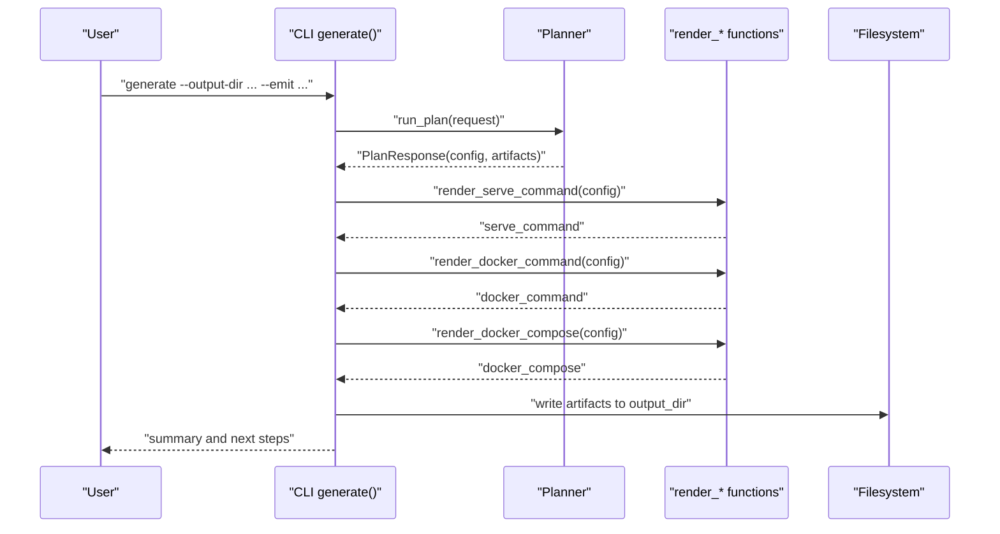
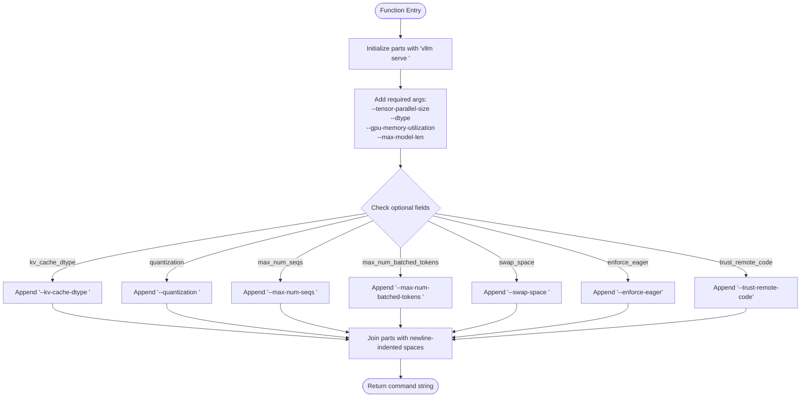
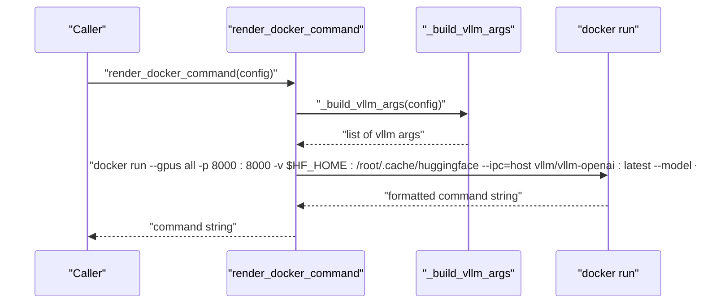
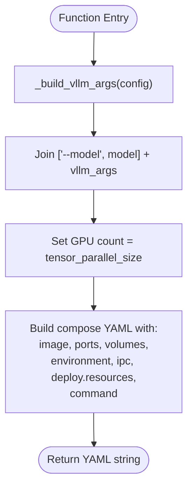
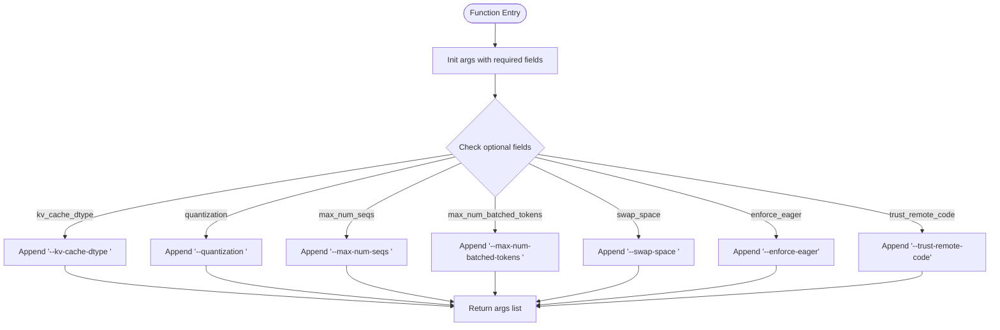
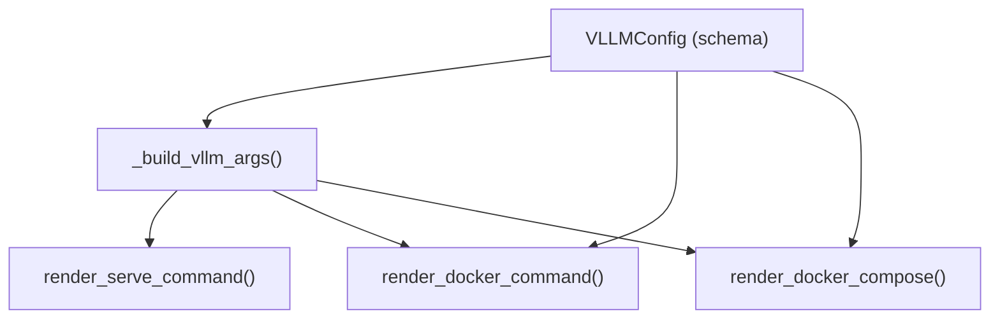

# Command Generation API

<cite>
**Referenced Files in This Document**
- [commands.py](file://src/vllm_wizard/render/commands.py)
- [__init__.py](file://src/vllm_wizard/render/__init__.py)
- [outputs.py](file://src/vllm_wizard/schemas/outputs.py)
- [inputs.py](file://src/vllm_wizard/schemas/inputs.py)
- [cli.py](file://src/vllm_wizard/cli.py)
- [README.md](file://README.md)
</cite>

## Table of Contents
1. [Introduction](#introduction)
2. [Project Structure](#project-structure)
3. [Core Components](#core-components)
4. [Architecture Overview](#architecture-overview)
5. [Detailed Component Analysis](#detailed-component-analysis)
6. [Dependency Analysis](#dependency-analysis)
7. [Performance Considerations](#performance-considerations)
8. [Troubleshooting Guide](#troubleshooting-guide)
9. [Conclusion](#conclusion)
10. [Appendices](#appendices)

## Introduction
This document provides detailed API documentation for the command generation functions in the rendering system. It focuses on:
- render_serve_command(): Generates a vLLM serve command from a configuration object.
- render_docker_command(): Generates a docker run command for vLLM.
- render_docker_compose(): Generates a docker-compose.yaml configuration for vLLM.

It explains function signatures, parameter requirements, output formats, optional parameter handling, argument formatting logic, and how configuration objects map to command-line arguments. Guidance is included for customizing command generation and extending the system with new command types.

## Project Structure
The command generation logic resides in the render module and integrates with the planning pipeline and CLI. The primary files involved are:
- Render functions: src/vllm_wizard/render/commands.py
- Public exports: src/vllm_wizard/render/__init__.py
- Configuration schemas: src/vllm_wizard/schemas/outputs.py, src/vllm_wizard/schemas/inputs.py
- CLI integration: src/vllm_wizard/cli.py
- Project overview: README.md

```mermaid
graph TB
subgraph "Render Module"
RC["commands.py<br/>render_serve_command()<br/>render_docker_command()<br/>render_docker_compose()"]
RI["__init__.py<br/>exports"]
end
subgraph "Schemas"
SO["outputs.py<br/>VLLMConfig"]
SI["inputs.py<br/>Enums and Inputs"]
end
subgraph "CLI"
CLI["cli.py<br/>generate command<br/>uses render_* functions"]
end
RC --> SO
RC --> SI
RI --> RC
CLI --> RC
```

**Diagram sources**
- [commands.py](file://src/vllm_wizard/render/commands.py#L1-L196)
- [__init__.py](file://src/vllm_wizard/render/__init__.py#L1-L20)
- [outputs.py](file://src/vllm_wizard/schemas/outputs.py#L57-L75)
- [inputs.py](file://src/vllm_wizard/schemas/inputs.py#L9-L36)
- [cli.py](file://src/vllm_wizard/cli.py#L215-L381)

**Section sources**
- [commands.py](file://src/vllm_wizard/render/commands.py#L1-L196)
- [__init__.py](file://src/vllm_wizard/render/__init__.py#L1-L20)
- [outputs.py](file://src/vllm_wizard/schemas/outputs.py#L57-L75)
- [inputs.py](file://src/vllm_wizard/schemas/inputs.py#L9-L36)
- [cli.py](file://src/vllm_wizard/cli.py#L215-L381)
- [README.md](file://README.md#L1-L308)

## Core Components
This section documents the three primary command generation functions and their roles.

- render_serve_command(config: VLLMConfig) -> str
  - Purpose: Builds a complete vLLM serve command string from a VLLMConfig object.
  - Required parameters: model, tensor_parallel_size, dtype, gpu_memory_utilization, max_model_len.
  - Optional parameters: kv_cache_dtype, quantization, max_num_seqs, max_num_batched_tokens, swap_space, enforce_eager, trust_remote_code.
  - Output: A formatted command string suitable for shell execution.

- render_docker_command(config: VLLMConfig) -> str
  - Purpose: Builds a docker run command for vLLM with GPU and volume mounts.
  - Required parameters: model, tensor_parallel_size, dtype, gpu_memory_utilization, max_model_len.
  - Optional parameters: kv_cache_dtype, quantization, max_num_seqs, max_num_batched_tokens, swap_space, enforce_eager, trust_remote_code.
  - Output: A formatted docker run command string.

- render_docker_compose(config: VLLMConfig) -> str
  - Purpose: Generates a docker-compose.yaml content for running vLLM with GPU reservations.
  - Required parameters: model, tensor_parallel_size, dtype, gpu_memory_utilization, max_model_len.
  - Optional parameters: kv_cache_dtype, quantization, max_num_seqs, max_num_batched_tokens, swap_space, enforce_eager, trust_remote_code.
  - Output: A YAML string representing the compose configuration.

Key shared behavior:
- All functions delegate to an internal helper that builds the list of vLLM CLI arguments from the configuration object.
- Optional parameters are included only when present in the configuration.

**Section sources**
- [commands.py](file://src/vllm_wizard/render/commands.py#L6-L46)
- [commands.py](file://src/vllm_wizard/render/commands.py#L48-L73)
- [commands.py](file://src/vllm_wizard/render/commands.py#L75-L114)
- [commands.py](file://src/vllm_wizard/render/commands.py#L158-L196)

## Architecture Overview
The command generation functions are part of the render module and depend on the VLLMConfig schema. They are consumed by the CLI’s generate command to produce artifacts.



**Diagram sources**
- [cli.py](file://src/vllm_wizard/cli.py#L215-L381)
- [commands.py](file://src/vllm_wizard/render/commands.py#L6-L114)

## Detailed Component Analysis

### render_serve_command(config: VLLMConfig) -> str
- Purpose: Generate a vLLM serve command string.
- Function signature: render_serve_command(config: VLLMConfig) -> str
- Parameters:
  - config: VLLMConfig object containing model and serving parameters.
- Required arguments (always included):
  - model name
  - tensor-parallel-size
  - dtype
  - gpu-memory-utilization
  - max-model-len
- Optional arguments (included when present):
  - kv-cache-dtype
  - quantization
  - max-num-seqs
  - max-num-batched-tokens
  - swap-space
  - enforce-eager
  - trust-remote-code
- Output format:
  - A single string with arguments joined by newline-indented spaces for readability.
- Argument formatting logic:
  - Required arguments are always emitted.
  - Optional arguments are emitted only if their corresponding fields in config are set.
  - Boolean flags are emitted as bare flags without values.
- Example mapping:
  - VLLMConfig.model -> --model <value>
  - VLLMConfig.tensor_parallel_size -> --tensor-parallel-size <value>
  - VLLMConfig.dtype -> --dtype <value>
  - VLLMConfig.gpu_memory_utilization -> --gpu-memory-utilization <value>
  - VLLMConfig.max_model_len -> --max-model-len <value>
  - VLLMConfig.kv_cache_dtype -> --kv-cache-dtype <value>
  - VLLMConfig.quantization -> --quantization <value>
  - VLLMConfig.max_num_seqs -> --max-num-seqs <value>
  - VLLMConfig.max_num_batched_tokens -> --max-num-batched-tokens <value>
  - VLLMConfig.swap_space -> --swap-space <value>
  - VLLMConfig.enforce_eager -> --enforce-eager
  - VLLMConfig.trust_remote_code -> --trust-remote-code



**Diagram sources**
- [commands.py](file://src/vllm_wizard/render/commands.py#L6-L46)

**Section sources**
- [commands.py](file://src/vllm_wizard/render/commands.py#L6-L46)

### render_docker_command(config: VLLMConfig) -> str
- Purpose: Generate a docker run command for vLLM with GPU and volume mounts.
- Function signature: render_docker_command(config: VLLMConfig) -> str
- Parameters:
  - config: VLLMConfig object.
- Required arguments:
  - model name
  - All vLLM arguments built from config (via internal helper)
- Fixed docker flags:
  - --gpus all
  - -p 8000:8000
  - -v $HF_HOME:/root/.cache/huggingface
  - --ipc=host
  - Image: vllm/vllm-openai:latest
- Output format:
  - A single string with arguments joined by newline-indented spaces for readability.
- Argument formatting logic:
  - Uses the internal helper to build vLLM arguments from config.
  - Appends the model and the built vLLM arguments to the docker run command.
- Example mapping:
  - VLLMConfig.model -> appended as positional model argument
  - Other VLLMConfig fields -> mapped to vLLM CLI arguments via the internal helper



**Diagram sources**
- [commands.py](file://src/vllm_wizard/render/commands.py#L48-L73)
- [commands.py](file://src/vllm_wizard/render/commands.py#L158-L196)

**Section sources**
- [commands.py](file://src/vllm_wizard/render/commands.py#L48-L73)
- [commands.py](file://src/vllm_wizard/render/commands.py#L158-L196)

### render_docker_compose(config: VLLMConfig) -> str
- Purpose: Generate a docker-compose.yaml content for running vLLM with GPU reservations.
- Function signature: render_docker_compose(config: VLLMConfig) -> str
- Parameters:
  - config: VLLMConfig object.
- Required arguments:
  - model name
  - All vLLM arguments built from config (via internal helper)
- Compose configuration:
  - service: vllm
  - image: vllm/vllm-openai:latest
  - ports: 8000:8000
  - volumes: $HF_HOME:/root/.cache/huggingface (with fallback)
  - environment: HUGGING_FACE_HUB_TOKEN (optional)
  - ipc: host
  - deploy.resources.reservations.devices: NVIDIA GPU reservation equal to tensor_parallel_size
  - command: constructed from model and vLLM arguments
- Output format:
  - A YAML-formatted string representing the compose configuration.
- Argument formatting logic:
  - Uses the internal helper to build vLLM arguments from config.
  - Constructs the command line by joining model and vLLM arguments.
  - Sets GPU count equal to tensor_parallel_size for device reservations.



**Diagram sources**
- [commands.py](file://src/vllm_wizard/render/commands.py#L75-L114)
- [commands.py](file://src/vllm_wizard/render/commands.py#L158-L196)

**Section sources**
- [commands.py](file://src/vllm_wizard/render/commands.py#L75-L114)
- [commands.py](file://src/vllm_wizard/render/commands.py#L158-L196)

### Internal Helper: _build_vllm_args(config: VLLMConfig) -> list[str]
- Purpose: Build a list of vLLM CLI argument strings from a VLLMConfig object.
- Function signature: _build_vllm_args(config: VLLMConfig) -> list[str]
- Behavior:
  - Always includes required arguments.
  - Conditionally includes optional arguments when present in config.
  - Returns a list of argument strings suitable for joining into a command or YAML.



**Diagram sources**
- [commands.py](file://src/vllm_wizard/render/commands.py#L158-L196)

**Section sources**
- [commands.py](file://src/vllm_wizard/render/commands.py#L158-L196)

## Dependency Analysis
- render_serve_command() depends on:
  - VLLMConfig schema fields for required and optional arguments.
  - Internal helper to construct argument lists.
- render_docker_command() depends on:
  - VLLMConfig schema fields.
  - Internal helper to construct argument lists.
  - Fixed Docker runtime flags and image.
- render_docker_compose() depends on:
  - VLLMConfig schema fields.
  - Internal helper to construct argument lists.
  - Fixed compose service configuration and GPU reservation logic.



**Diagram sources**
- [outputs.py](file://src/vllm_wizard/schemas/outputs.py#L57-L75)
- [commands.py](file://src/vllm_wizard/render/commands.py#L6-L114)
- [commands.py](file://src/vllm_wizard/render/commands.py#L158-L196)

**Section sources**
- [outputs.py](file://src/vllm_wizard/schemas/outputs.py#L57-L75)
- [commands.py](file://src/vllm_wizard/render/commands.py#L6-L114)
- [commands.py](file://src/vllm_wizard/render/commands.py#L158-L196)

## Performance Considerations
- Argument construction is linear in the number of configured parameters.
- Optional parameter checks are constant-time lookups against optional fields.
- String joining uses newline-indented spaces for readability; this does not impact runtime performance but improves human readability of generated commands.

[No sources needed since this section provides general guidance]

## Troubleshooting Guide
Common issues and resolutions:
- Missing required fields in VLLMConfig:
  - Ensure model, tensor_parallel_size, dtype, gpu_memory_utilization, and max_model_len are set before calling the functions.
- Unexpected empty output:
  - Verify that optional fields are set appropriately; only present fields are included in the generated commands.
- Docker compose GPU reservation mismatch:
  - Confirm tensor_parallel_size equals the number of GPUs intended for reservation.
- Environment variables not applied:
  - For docker compose, ensure HUGGING_FACE_HUB_TOKEN is set in the environment if using private models.

**Section sources**
- [outputs.py](file://src/vllm_wizard/schemas/outputs.py#L57-L75)
- [commands.py](file://src/vllm_wizard/render/commands.py#L75-L114)

## Conclusion
The command generation API provides a clean, schema-driven way to produce vLLM serve commands, docker run commands, and docker-compose configurations. By centralizing argument formatting in an internal helper, the system ensures consistency and simplifies customization. Extending the system with new command types follows the established pattern: define a new render function, reuse the internal helper, and integrate with the CLI or higher-level orchestration.

[No sources needed since this section summarizes without analyzing specific files]

## Appendices

### Function Signatures and Parameter Requirements
- render_serve_command(config: VLLMConfig) -> str
  - Required: model, tensor_parallel_size, dtype, gpu_memory_utilization, max_model_len
  - Optional: kv_cache_dtype, quantization, max_num_seqs, max_num_batched_tokens, swap_space, enforce_eager, trust_remote_code
- render_docker_command(config: VLLMConfig) -> str
  - Required: model, tensor_parallel_size, dtype, gpu_memory_utilization, max_model_len
  - Optional: kv_cache_dtype, quantization, max_num_seqs, max_num_batched_tokens, swap_space, enforce_eager, trust_remote_code
- render_docker_compose(config: VLLMConfig) -> str
  - Required: model, tensor_parallel_size, dtype, gpu_memory_utilization, max_model_len
  - Optional: kv_cache_dtype, quantization, max_num_seqs, max_num_batched_tokens, swap_space, enforce_eager, trust_remote_code

**Section sources**
- [commands.py](file://src/vllm_wizard/render/commands.py#L6-L114)
- [outputs.py](file://src/vllm_wizard/schemas/outputs.py#L57-L75)

### How Configuration Objects Map to Arguments
- VLLMConfig.model -> --model <value>
- VLLMConfig.tensor_parallel_size -> --tensor-parallel-size <value>
- VLLMConfig.dtype -> --dtype <value>
- VLLMConfig.gpu_memory_utilization -> --gpu-memory-utilization <value>
- VLLMConfig.max_model_len -> --max-model-len <value>
- VLLMConfig.kv_cache_dtype -> --kv-cache-dtype <value>
- VLLMConfig.quantization -> --quantization <value>
- VLLMConfig.max_num_seqs -> --max-num-seqs <value>
- VLLMConfig.max_num_batched_tokens -> --max-num-batched-tokens <value>
- VLLMConfig.swap_space -> --swap-space <value>
- VLLMConfig.enforce_eager -> --enforce-eager
- VLLMConfig.trust_remote_code -> --trust-remote-code

**Section sources**
- [commands.py](file://src/vllm_wizard/render/commands.py#L158-L196)

### Examples of Generated Commands
- vLLM serve command:
  - Generated from VLLMConfig fields; includes required and optional arguments as applicable.
- Docker run command:
  - Includes fixed flags and mounts, plus vLLM arguments derived from VLLMConfig.
- Docker Compose:
  - Includes service definition, image, ports, volumes, environment, IPC, GPU reservations, and command constructed from VLLMConfig.

**Section sources**
- [commands.py](file://src/vllm_wizard/render/commands.py#L6-L114)

### Customization and Extension Guidelines
To add a new command type:
1. Define a new render function in the render module that accepts VLLMConfig and returns a formatted string or YAML content.
2. Reuse the internal helper to build vLLM arguments consistently.
3. Integrate the new render function into the CLI or higher-level orchestration as needed.
4. Update public exports if exposing the function externally.

**Section sources**
- [commands.py](file://src/vllm_wizard/render/commands.py#L6-L114)
- [__init__.py](file://src/vllm_wizard/render/__init__.py#L1-L20)