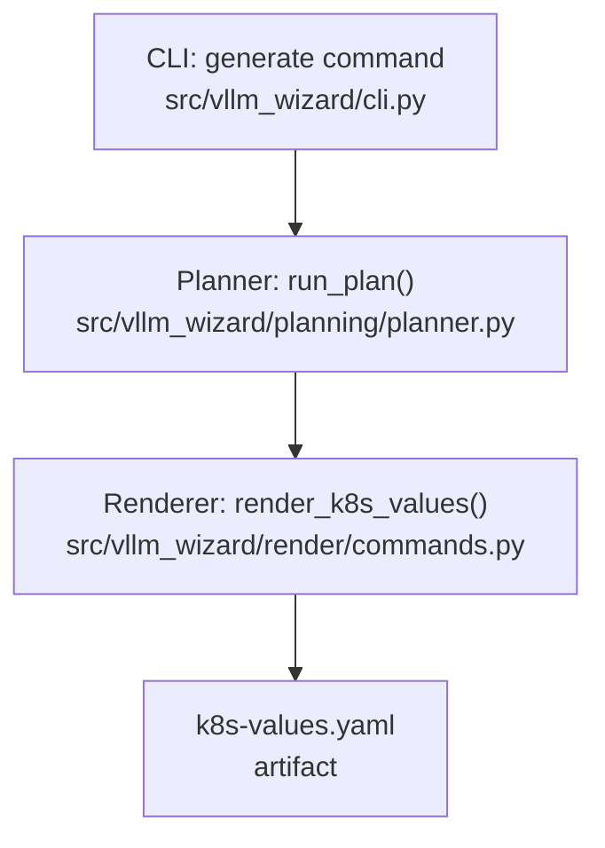
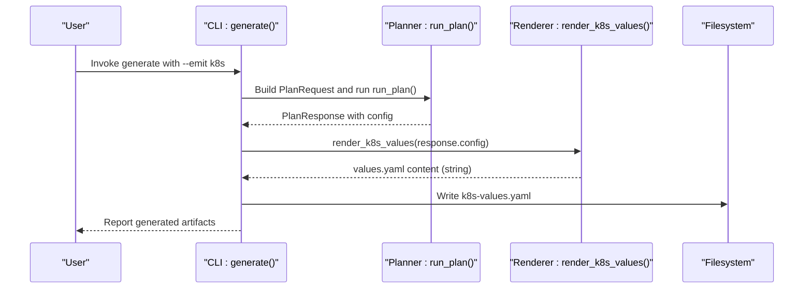
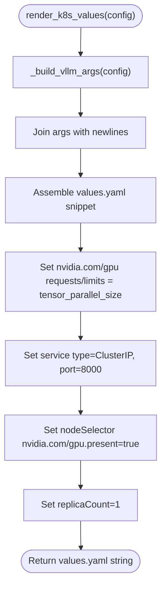
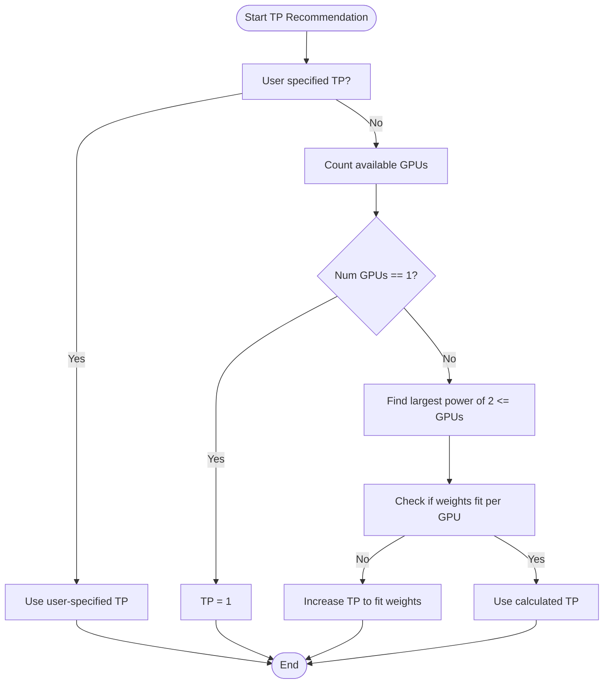
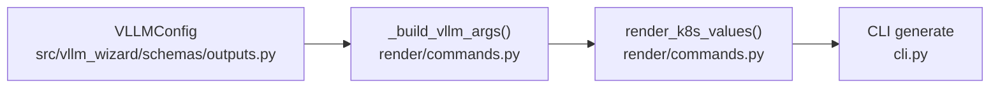

# Kubernetes Deployment API

<cite>
**Referenced Files in This Document**
- [README.md](file://README.md)
- [src/vllm_wizard/cli.py](file://src/vllm_wizard/cli.py)
- [src/vllm_wizard/render/commands.py](file://src/vllm_wizard/render/commands.py)
- [src/vllm_wizard/schemas/outputs.py](file://src/vllm_wizard/schemas/outputs.py)
- [src/vllm_wizard/planning/recommend.py](file://src/vllm_wizard/planning/recommend.py)
- [src/vllm_wizard/hardware/detect.py](file://src/vllm_wizard/hardware/detect.py)
- [examples/profiles/sample.yaml](file://examples/profiles/sample.yaml)
</cite>

## Table of Contents
1. [Introduction](#introduction)
2. [Project Structure](#project-structure)
3. [Core Components](#core-components)
4. [Architecture Overview](#architecture-overview)
5. [Detailed Component Analysis](#detailed-component-analysis)
6. [Dependency Analysis](#dependency-analysis)
7. [Performance Considerations](#performance-considerations)
8. [Troubleshooting Guide](#troubleshooting-guide)
9. [Conclusion](#conclusion)
10. [Appendices](#appendices)

## Introduction
This document provides comprehensive API documentation for Kubernetes deployment artifact generation, focusing on the render_k8s_values() function that produces Helm values.yaml configurations for vLLM deployments. It explains the function parameters, GPU resource allocation, service configuration, and deployment settings. It also covers how tensor parallel size maps to GPU resource requirements, best practices for production deployments, resource limits, and node selectors, along with guidance on customizing Kubernetes configurations and integrating with existing cluster infrastructure.

## Project Structure
The Kubernetes values generation is part of the artifact rendering pipeline invoked by the generate command. The CLI orchestrates planning, recommendation, and artifact emission, including Kubernetes values when requested.

**Diagram sources**
- [src/vllm_wizard/cli.py](file://src/vllm_wizard/cli.py#L215-L381)
- [src/vllm_wizard/render/commands.py](file://src/vllm_wizard/render/commands.py#L116-L156)

**Section sources**
- [src/vllm_wizard/cli.py](file://src/vllm_wizard/cli.py#L215-L381)
- [src/vllm_wizard/render/commands.py](file://src/vllm_wizard/render/commands.py#L116-L156)

## Core Components
- render_k8s_values(config: VLLMConfig) -> str
  - Purpose: Render a Kubernetes values.yaml snippet tailored for vLLM deployments.
  - Inputs:
    - config: VLLMConfig object containing model, tensor_parallel_size, dtype, gpu_memory_utilization, max_model_len, optional quantization/kv_cache_dtype, and other runtime flags.
  - Outputs:
    - String containing a values.yaml fragment suitable for Helm-based deployments.
  - Key behaviors:
    - Sets replicaCount to 1 by default.
    - Defines image repository, tag, and pull policy.
    - Builds args list from VLLMConfig using internal helper.
    - Allocates GPU resources via nvidia.com/gpu requests/limits equal to tensor_parallel_size.
    - Exposes service type ClusterIP on port 8000.
    - Applies nodeSelector requiring nvidia.com/gpu.present=true.

- Related helpers:
  - _build_vllm_args(config: VLLMConfig) -> list[str]: Constructs the vLLM CLI argument list from VLLMConfig, including optional flags.

- Data model:
  - VLLMConfig: Pydantic model capturing recommended vLLM serving parameters, including tensor_parallel_size and others used by render_k8s_values().

**Section sources**
- [src/vllm_wizard/render/commands.py](file://src/vllm_wizard/render/commands.py#L116-L156)
- [src/vllm_wizard/render/commands.py](file://src/vllm_wizard/render/commands.py#L158-L196)
- [src/vllm_wizard/schemas/outputs.py](file://src/vllm_wizard/schemas/outputs.py#L57-L75)

## Architecture Overview
The Kubernetes values generation integrates with the broader planning and artifact pipeline. The generate command triggers planning, then emits artifacts including k8s-values.yaml when requested.

**Diagram sources**
- [src/vllm_wizard/cli.py](file://src/vllm_wizard/cli.py#L215-L381)
- [src/vllm_wizard/render/commands.py](file://src/vllm_wizard/render/commands.py#L116-L156)

## Detailed Component Analysis

### render_k8s_values() Function
- Purpose: Produce a values.yaml fragment for Helm deployment of vLLM.
- Parameters:
  - config: VLLMConfig
    - tensor_parallel_size: Determines GPU resource allocation.
    - model: Used to set the initial argument.
    - dtype, gpu_memory_utilization, max_model_len, kv_cache_dtype, quantization, max_num_seqs, max_num_batched_tokens, swap_space, enforce_eager, trust_remote_code: Converted into vLLM CLI arguments.
- Resource Allocation:
  - nvidia.com/gpu requests and limits are both set to tensor_parallel_size, ensuring pod scheduling requires exactly that many GPUs.
- Service Configuration:
  - service.type: ClusterIP
  - service.port: 8000
- Node Selection:
  - nodeSelector: nvidia.com/gpu.present=true
- Deployment Settings:
  - replicaCount: 1
  - image.repository/tag/pullPolicy: defaults to vllm/vllm-openai:latest

**Diagram sources**
- [src/vllm_wizard/render/commands.py](file://src/vllm_wizard/render/commands.py#L116-L156)
- [src/vllm_wizard/render/commands.py](file://src/vllm_wizard/render/commands.py#L158-L196)

**Section sources**
- [src/vllm_wizard/render/commands.py](file://src/vllm_wizard/render/commands.py#L116-L156)
- [src/vllm_wizard/render/commands.py](file://src/vllm_wizard/render/commands.py#L158-L196)

### Tensor Parallel Size and GPU Resource Requirements
- tensor_parallel_size drives:
  - GPU resource requests/limits: nvidia.com/gpu requests and limits equal to tensor_parallel_size.
  - Docker compose GPU reservation mirrors this mapping.
- Recommendation logic:
  - If auto-selected, the system chooses the largest power of two up to the number of available GPUs.
  - The recommendation considers whether model weights fit per GPU given VRAM constraints.

**Diagram sources**
- [src/vllm_wizard/planning/recommend.py](file://src/vllm_wizard/planning/recommend.py#L42-L68)
- [src/vllm_wizard/hardware/detect.py](file://src/vllm_wizard/hardware/detect.py#L138-L159)

**Section sources**
- [src/vllm_wizard/planning/recommend.py](file://src/vllm_wizard/planning/recommend.py#L42-L68)
- [src/vllm_wizard/hardware/detect.py](file://src/vllm_wizard/hardware/detect.py#L138-L159)

### Service Configuration and Port Exposure
- Service type: ClusterIP
- Port: 8000
- This aligns with the vLLM OpenAI-compatible API default port.

**Section sources**
- [src/vllm_wizard/render/commands.py](file://src/vllm_wizard/render/commands.py#L147-L149)

### Node Selector and GPU Presence
- nodeSelector: nvidia.com/gpu.present=true
- Ensures pods schedule only on nodes equipped with NVIDIA GPUs.

**Section sources**
- [src/vllm_wizard/render/commands.py](file://src/vllm_wizard/render/commands.py#L151-L152)

### CLI Integration and Artifact Emission
- The generate command supports emitting Kubernetes values via --emit k8s.
- The CLI invokes render_k8s_values() and writes k8s-values.yaml to the output directory.

**Section sources**
- [src/vllm_wizard/cli.py](file://src/vllm_wizard/cli.py#L215-L381)

## Dependency Analysis
The render_k8s_values() function depends on:
- VLLMConfig for runtime parameters.
- _build_vllm_args() to translate VLLMConfig into CLI arguments.
- The CLI generate command to orchestrate emission.

**Diagram sources**
- [src/vllm_wizard/schemas/outputs.py](file://src/vllm_wizard/schemas/outputs.py#L57-L75)
- [src/vllm_wizard/render/commands.py](file://src/vllm_wizard/render/commands.py#L158-L196)
- [src/vllm_wizard/render/commands.py](file://src/vllm_wizard/render/commands.py#L116-L156)
- [src/vllm_wizard/cli.py](file://src/vllm_wizard/cli.py#L215-L381)

**Section sources**
- [src/vllm_wizard/render/commands.py](file://src/vllm_wizard/render/commands.py#L116-L156)
- [src/vllm_wizard/render/commands.py](file://src/vllm_wizard/render/commands.py#L158-L196)
- [src/vllm_wizard/schemas/outputs.py](file://src/vllm_wizard/schemas/outputs.py#L57-L75)
- [src/vllm_wizard/cli.py](file://src/vllm_wizard/cli.py#L215-L381)

## Performance Considerations
- GPU memory utilization: The recommendation adjusts gpu_memory_utilization based on GPU type to improve stability on consumer GPUs.
- KV cache pressure: The recommendation engine suggests FP8 KV cache dtype when appropriate and pressure is high, potentially reducing memory footprint.
- Throughput vs latency: The recommendation engine sets max_num_seqs and max_num_batched_tokens according to batching mode, affecting CPU and GPU resource consumption.

[No sources needed since this section provides general guidance]

## Troubleshooting Guide
- Pods stuck in Pending due to GPU resources:
  - Verify nvidia.com/gpu present on nodes and that tensor_parallel_size matches cluster GPU availability.
- Insufficient memory errors:
  - Lower gpu_memory_utilization or reduce max_model_len; consider quantization if recommended.
- Incorrect service exposure:
  - Confirm service.type is ClusterIP and service.port is 8000; adjust as needed in your Helm values overrides.

**Section sources**
- [src/vllm_wizard/render/commands.py](file://src/vllm_wizard/render/commands.py#L141-L152)

## Conclusion
The render_k8s_values() function provides a concise, production-ready values.yaml fragment for deploying vLLM with Helm. It automatically maps tensor parallel size to GPU resource requests/limits, exposes the vLLM API on port 8000, and targets nodes with NVIDIA GPUs. By leveraging the recommendation engine and CLI artifact emission, teams can generate consistent, validated configurations aligned with model and workload characteristics.

[No sources needed since this section summarizes without analyzing specific files]

## Appendices

### API Definition: render_k8s_values()
- Function signature: render_k8s_values(config: VLLMConfig) -> str
- Parameters:
  - config: VLLMConfig
    - model: string
    - tensor_parallel_size: int
    - dtype: string
    - gpu_memory_utilization: float
    - max_model_len: int
    - kv_cache_dtype: string | None
    - quantization: string | None
    - max_num_seqs: int | None
    - max_num_batched_tokens: int | None
    - swap_space: int | None
    - enforce_eager: bool | None
    - trust_remote_code: bool | None
- Returns:
  - String containing a values.yaml snippet with:
    - replicaCount: 1
    - image: repository, tag, pullPolicy
    - args: list of vLLM CLI arguments
    - resources.limits/requests.nvidia.com/gpu: tensor_parallel_size
    - service.type: ClusterIP
    - service.port: 8000
    - nodeSelector: nvidia.com/gpu.present=true

**Section sources**
- [src/vllm_wizard/render/commands.py](file://src/vllm_wizard/render/commands.py#L116-L156)
- [src/vllm_wizard/render/commands.py](file://src/vllm_wizard/render/commands.py#L158-L196)
- [src/vllm_wizard/schemas/outputs.py](file://src/vllm_wizard/schemas/outputs.py#L57-L75)

### Best Practices for Production Deployments
- Resource Limits and Requests:
  - Keep requests and limits equal to tensor_parallel_size to prevent overcommitment.
  - Add CPU/memory requests/limits appropriate for your workload.
- Node Affinity and Selectors:
  - Use nodeSelector nvidia.com/gpu.present=true to ensure scheduling on GPU nodes.
  - Optionally add tolerations for GPU maintenance or reserved nodes.
- Service Exposure:
  - Use ClusterIP with ingress or service mesh for controlled external access.
  - Consider headless services for stateful deployments if needed.
- Image Management:
  - Pin image.tag to a specific release for reproducibility.
  - Configure pull secrets if using private registries.
- Horizontal Scaling:
  - Increase replicaCount after validating resource profiles; ensure storage and networking can scale.
- Monitoring and Observability:
  - Add liveness/readiness probes pointing to the vLLM health endpoint.
  - Collect GPU metrics and logs for performance tuning.

[No sources needed since this section provides general guidance]

### Integrating with Existing Cluster Infrastructure
- GPU Operator and Device Plugins:
  - Ensure nvidia.com/gpu device plugin is installed and nodes expose nvidia.com/gpu capacity.
- RBAC and Namespaces:
  - Apply appropriate RBAC policies and deploy in dedicated namespaces.
- Storage:
  - Mount Hugging Face cache volumes if required; ensure persistent volumes for checkpoints if used.
- Networking:
  - Integrate with existing ingress controllers and certificate managers.
- CI/CD:
  - Emit k8s-values.yaml as part of automated artifact generation; apply via ArgoCD or Flux.

[No sources needed since this section provides general guidance]

### Example Manifest Generation Workflow
- Plan configuration with the CLI.
- Generate artifacts including k8s-values.yaml.
- Customize values.yaml for your environment (resource ranges, node selectors, image tags).
- Apply with Helm or kubectl.

**Section sources**
- [src/vllm_wizard/cli.py](file://src/vllm_wizard/cli.py#L215-L381)
- [README.md](file://README.md#L64-L78)