# Profile Serialization API

<cite>
**Referenced Files in This Document**
- [profile.py](file://src/vllm_wizard/render/profile.py)
- [profile_schema.py](file://src/vllm_wizard/schemas/profile.py)
- [inputs_schema.py](file://src/vllm_wizard/schemas/inputs.py)
- [outputs_schema.py](file://src/vllm_wizard/schemas/outputs.py)
- [cli.py](file://src/vllm_wizard/cli.py)
- [sample.yaml](file://examples/profiles/sample.yaml)
- [render_init.py](file://src/vllm_wizard/render/__init__.py)
- [schemas_init.py](file://src/vllm_wizard/schemas/__init__.py)
</cite>

## Table of Contents
1. [Introduction](#introduction)
2. [Project Structure](#project-structure)
3. [Core Components](#core-components)
4. [Architecture Overview](#architecture-overview)
5. [Detailed Component Analysis](#detailed-component-analysis)
6. [Dependency Analysis](#dependency-analysis)
7. [Performance Considerations](#performance-considerations)
8. [Troubleshooting Guide](#troubleshooting-guide)
9. [Conclusion](#conclusion)

## Introduction
This document provides comprehensive API documentation for the profile serialization system used in the vLLM Wizard project. The system enables persistent storage and retrieval of configuration profiles in YAML format, facilitating reproducible model serving configurations across environments. It covers the complete lifecycle of profile creation, validation, persistence, and conversion to/from planning requests.

## Project Structure
The profile serialization system spans several modules within the vLLM Wizard codebase:

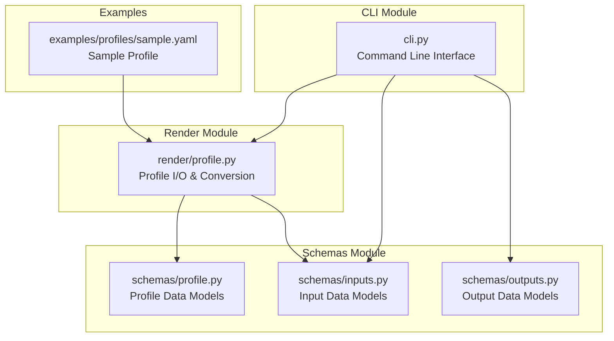

**Diagram sources**
- [profile.py](file://src/vllm_wizard/render/profile.py#L1-L173)
- [profile_schema.py](file://src/vllm_wizard/schemas/profile.py#L1-L75)
- [inputs_schema.py](file://src/vllm_wizard/schemas/inputs.py#L1-L110)
- [outputs_schema.py](file://src/vllm_wizard/schemas/outputs.py#L1-L118)
- [cli.py](file://src/vllm_wizard/cli.py#L1-L385)
- [sample.yaml](file://examples/profiles/sample.yaml#L1-L40)

**Section sources**
- [profile.py](file://src/vllm_wizard/render/profile.py#L1-L173)
- [profile_schema.py](file://src/vllm_wizard/schemas/profile.py#L1-L75)
- [inputs_schema.py](file://src/vllm_wizard/schemas/inputs.py#L1-L110)
- [outputs_schema.py](file://src/vllm_wizard/schemas/outputs.py#L1-L118)
- [cli.py](file://src/vllm_wizard/cli.py#L1-L385)
- [sample.yaml](file://examples/profiles/sample.yaml#L1-L40)

## Core Components
The profile serialization system consists of four primary components:

### Profile Data Models
The system defines a hierarchical set of Pydantic models that represent configuration profiles:

- **Profile**: Top-level container with versioning and all configuration sections
- **ProfileModel**: Model-specific configuration (id, dtype, quantization, etc.)
- **ProfileHardware**: Hardware configuration (GPU, VRAM, interconnect)
- **ProfileWorkload**: Workload characteristics (tokens, concurrency, mode)
- **ProfilePolicy**: Memory management policies (utilization, headroom, fragmentation)
- **ProfileOutputs**: Artifact emission preferences and vLLM arguments

### Profile I/O Functions
The system provides two primary functions for profile persistence:

- **save_profile()**: Serializes a Profile object to YAML format
- **load_profile()**: Deserializes YAML data back to a Profile object

### Conversion Functions
Bidirectional conversion between profiles and planning requests:

- **profile_to_request()**: Converts Profile to PlanRequest for planning
- **request_to_profile()**: Converts PlanRequest to Profile for persistence

**Section sources**
- [profile_schema.py](file://src/vllm_wizard/schemas/profile.py#L16-L75)
- [profile.py](file://src/vllm_wizard/render/profile.py#L30-L173)

## Architecture Overview
The profile serialization system follows a layered architecture with clear separation of concerns:

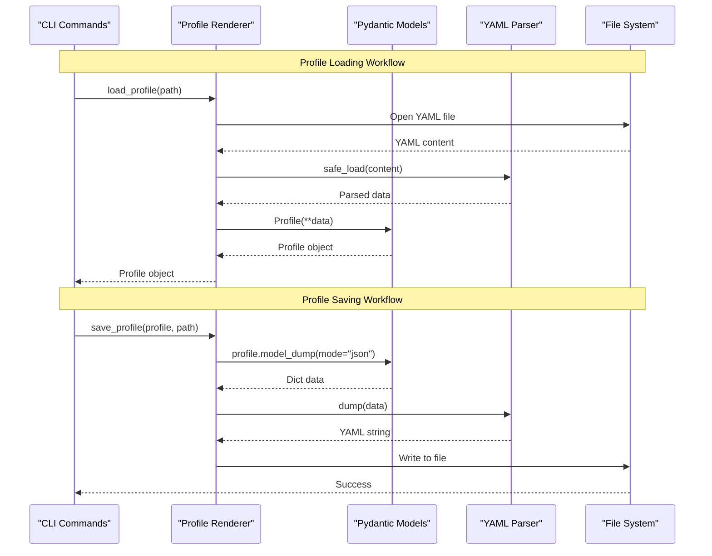

**Diagram sources**
- [profile.py](file://src/vllm_wizard/render/profile.py#L30-L65)
- [cli.py](file://src/vllm_wizard/cli.py#L155-L213)

The architecture ensures type safety through Pydantic validation while maintaining flexibility for YAML serialization and deserialization.

**Section sources**
- [profile.py](file://src/vllm_wizard/render/profile.py#L1-L173)
- [cli.py](file://src/vllm_wizard/cli.py#L155-L213)

## Detailed Component Analysis

### Profile Data Model Hierarchy
The profile system uses a hierarchical model structure with inheritance from Pydantic's BaseModel:

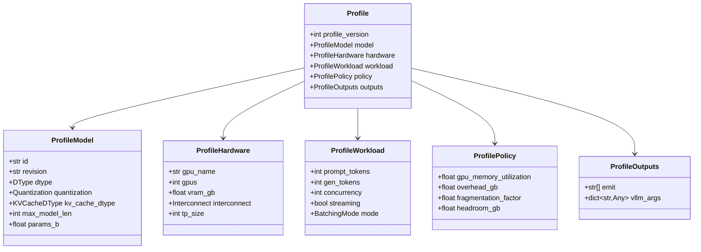

**Diagram sources**
- [profile_schema.py](file://src/vllm_wizard/schemas/profile.py#L16-L75)

### Serialization Format and Validation
The system employs Pydantic's built-in validation mechanisms combined with YAML serialization:

#### Validation Mechanisms
- **Type Validation**: Automatic type checking for all fields
- **Range Validation**: Numeric fields validated against configured bounds
- **Enum Validation**: String fields restricted to predefined enum values
- **Required Fields**: Mandatory fields enforced during construction

#### Serialization Process
The serialization process converts Pydantic models to dictionaries using JSON-compatible mode, ensuring proper enum handling:

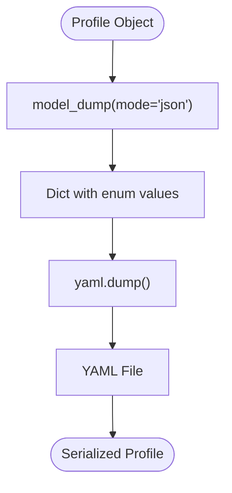

**Diagram sources**
- [profile.py](file://src/vllm_wizard/render/profile.py#L37-L43)

#### Deserialization Process
Deserialization reverses the process with automatic validation:

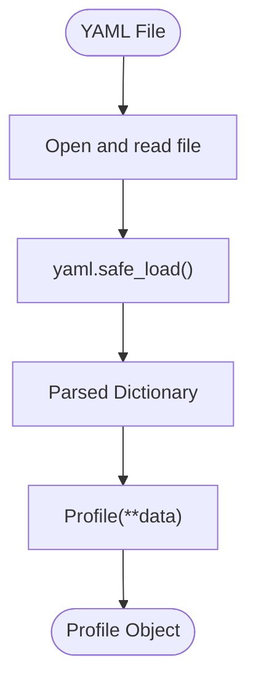

**Diagram sources**
- [profile.py](file://src/vllm_wizard/render/profile.py#L59-L65)

**Section sources**
- [profile_schema.py](file://src/vllm_wizard/schemas/profile.py#L16-L75)
- [profile.py](file://src/vllm_wizard/render/profile.py#L30-L65)

### Conversion Between Profiles and Requests
The system provides bidirectional conversion between profiles and planning requests:

#### Profile to Request Conversion
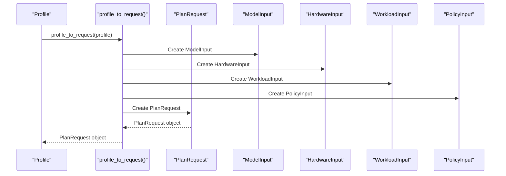

**Diagram sources**
- [profile.py](file://src/vllm_wizard/render/profile.py#L68-L115)

#### Request to Profile Conversion
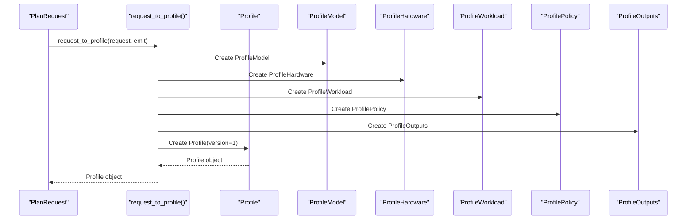

**Diagram sources**
- [profile.py](file://src/vllm_wizard/render/profile.py#L118-L172)

**Section sources**
- [profile.py](file://src/vllm_wizard/render/profile.py#L68-L172)

### CLI Integration and Usage Patterns
The CLI integrates profile functionality through dedicated commands:

#### Profile Loading in CLI
The CLI supports loading profiles via the `--profile` option, enabling reproducible configurations:

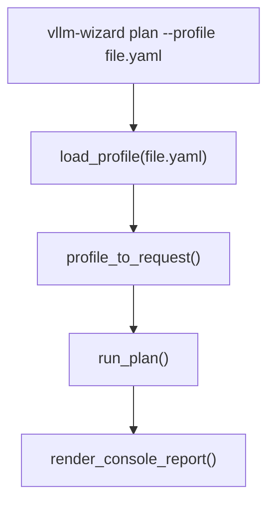

**Diagram sources**
- [cli.py](file://src/vllm_wizard/cli.py#L155-L213)

#### Profile Generation in CLI
The CLI can generate profiles alongside other artifacts:

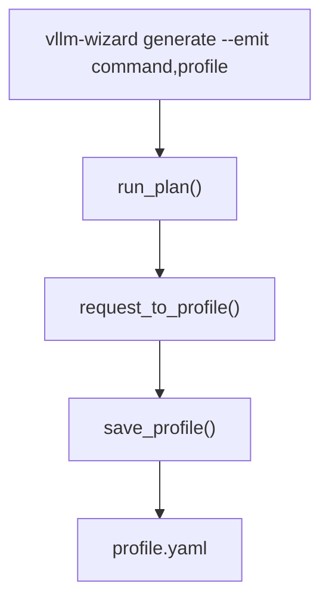

**Diagram sources**
- [cli.py](file://src/vllm_wizard/cli.py#L315-L350)

**Section sources**
- [cli.py](file://src/vllm_wizard/cli.py#L155-L213)
- [cli.py](file://src/vllm_wizard/cli.py#L315-L350)

## Dependency Analysis
The profile serialization system exhibits clear dependency relationships:

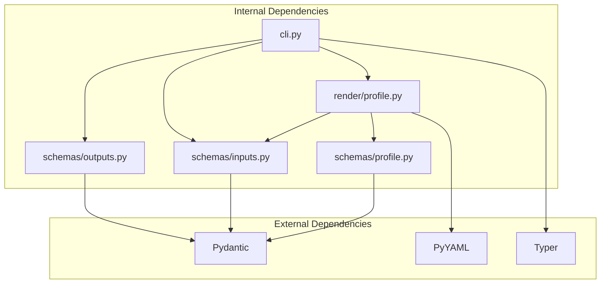

**Diagram sources**
- [profile.py](file://src/vllm_wizard/render/profile.py#L1-L27)
- [profile_schema.py](file://src/vllm_wizard/schemas/profile.py#L1-L13)
- [inputs_schema.py](file://src/vllm_wizard/schemas/inputs.py#L1-L6)
- [outputs_schema.py](file://src/vllm_wizard/schemas/outputs.py#L1-L6)
- [cli.py](file://src/vllm_wizard/cli.py#L1-L33)

The system maintains loose coupling between modules while ensuring strong type safety through Pydantic models.

**Section sources**
- [profile.py](file://src/vllm_wizard/render/profile.py#L1-L27)
- [profile_schema.py](file://src/vllm_wizard/schemas/profile.py#L1-L13)
- [inputs_schema.py](file://src/vllm_wizard/schemas/inputs.py#L1-L6)
- [outputs_schema.py](file://src/vllm_wizard/schemas/outputs.py#L1-L6)
- [cli.py](file://src/vllm_wizard/cli.py#L1-L33)

## Performance Considerations
The profile serialization system is designed for efficiency and reliability:

### Serialization Performance
- **JSON Mode Dumping**: Using `mode="json"` ensures efficient serialization of enum values
- **Minimal Memory Footprint**: Profiles are lightweight compared to model configurations
- **Lazy Loading**: Profiles are loaded only when needed via CLI commands

### Validation Performance
- **Compile-time Validation**: Pydantic validation occurs during object construction
- **Early Error Detection**: Invalid profiles are caught immediately during deserialization
- **Type Coercion**: Automatic type coercion reduces manual validation overhead

### File I/O Performance
- **Atomic Writes**: Profile writes occur atomically through file writing operations
- **Directory Creation**: Automatic directory creation prevents race conditions
- **Stream Processing**: YAML parsing uses streaming for large profiles

## Troubleshooting Guide

### Common Error Scenarios

#### File Not Found Errors
**Symptoms**: `FileNotFoundError` when loading profiles
**Causes**: Non-existent profile file paths
**Solutions**: Verify file existence and correct path specification

#### Validation Errors
**Symptoms**: `ValueError` during profile loading
**Causes**: Invalid field types, out-of-range values, or missing required fields
**Solutions**: 
- Check YAML syntax validity
- Validate field types match expected enums
- Ensure numeric fields meet validation constraints

#### Type Conversion Issues
**Symptoms**: Unexpected type errors during serialization
**Causes**: Mixed type usage in profile data
**Solutions**: 
- Use consistent enum values
- Ensure numeric fields are properly formatted
- Validate boolean values are correctly specified

### Error Handling Implementation
The system implements robust error handling:

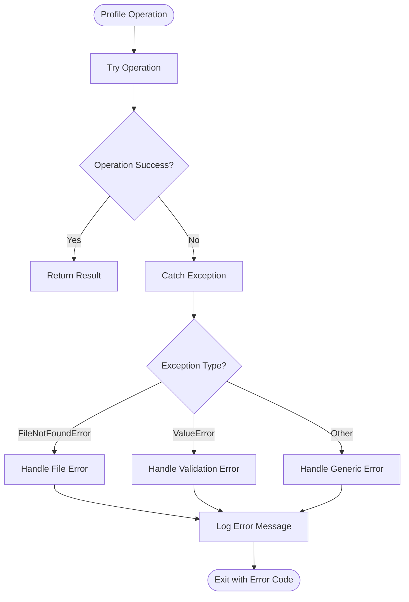

**Diagram sources**
- [profile.py](file://src/vllm_wizard/render/profile.py#L55-L65)
- [cli.py](file://src/vllm_wizard/cli.py#L204-L212)

**Section sources**
- [profile.py](file://src/vllm_wizard/render/profile.py#L46-L65)
- [cli.py](file://src/vllm_wizard/cli.py#L204-L212)

## Conclusion
The vLLM Wizard profile serialization system provides a robust, type-safe mechanism for persisting and sharing configuration profiles. Its architecture ensures:

- **Type Safety**: Comprehensive validation through Pydantic models
- **Flexibility**: Human-readable YAML format with programmatic access
- **Reproducibility**: Versioned profiles enable consistent deployments
- **Integration**: Seamless CLI integration for practical usage

The system's design supports both development workflows and production deployment scenarios, making it an essential component of the vLLM Wizard ecosystem.