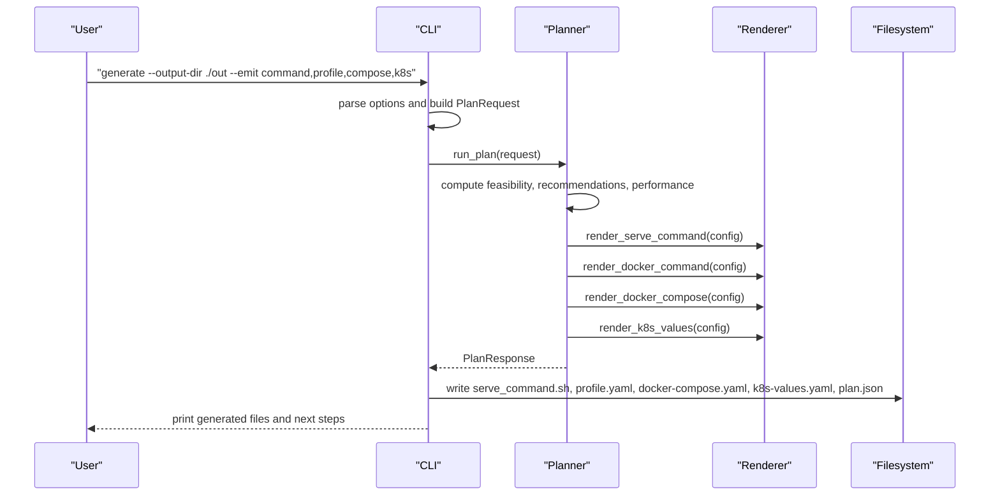
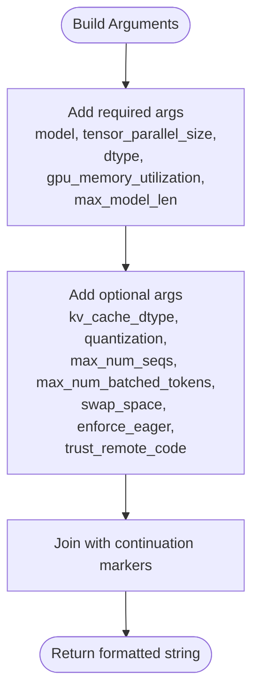
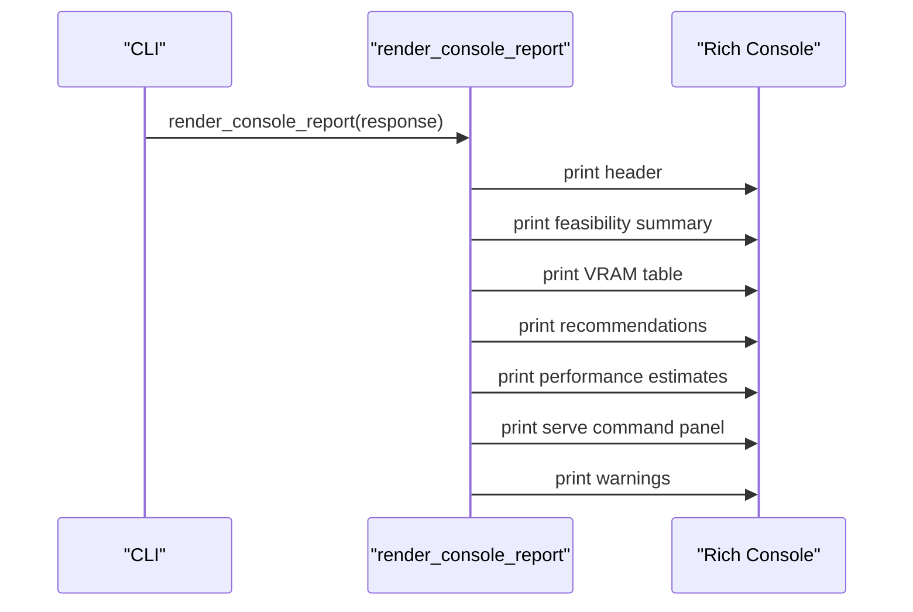
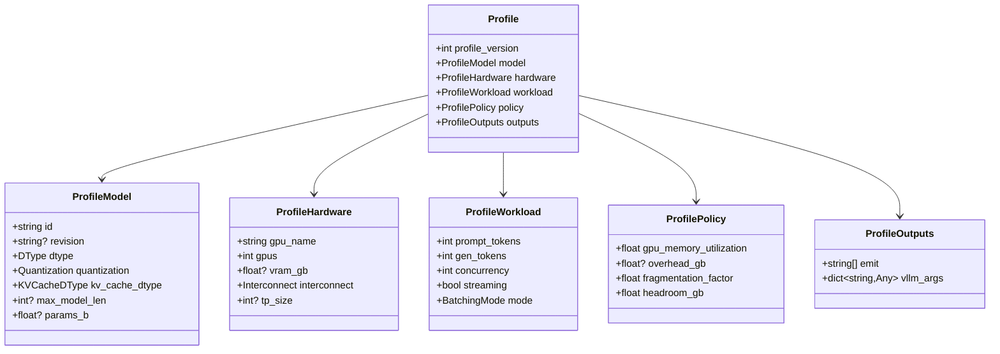
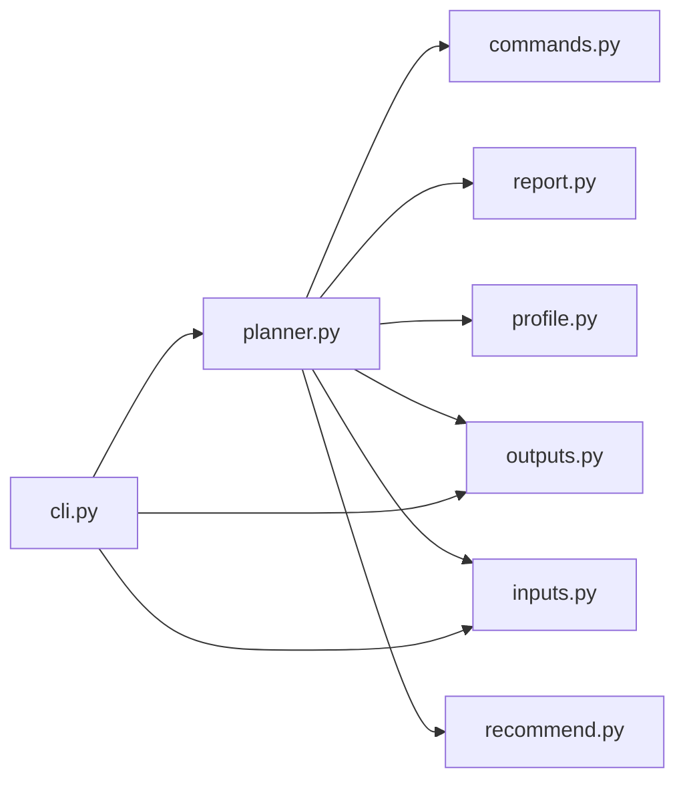

# Rendering System API

<cite>
**Referenced Files in This Document**
- [README.md](file://README.md)
- [cli.py](file://src/vllm_wizard/cli.py)
- [planner.py](file://src/vllm_wizard/planning/planner.py)
- [recommend.py](file://src/vllm_wizard/planning/recommend.py)
- [commands.py](file://src/vllm_wizard/render/commands.py)
- [profile.py](file://src/vllm_wizard/render/profile.py)
- [report.py](file://src/vllm_wizard/render/report.py)
- [inputs.py](file://src/vllm_wizard/schemas/inputs.py)
- [outputs.py](file://src/vllm_wizard/schemas/outputs.py)
- [profile_schema.py](file://src/vllm_wizard/schemas/profile.py)
- [sample.yaml](file://examples/profiles/sample.yaml)
</cite>

## Table of Contents
1. [Introduction](#introduction)
2. [Project Structure](#project-structure)
3. [Core Components](#core-components)
4. [Architecture Overview](#architecture-overview)
5. [Detailed Component Analysis](#detailed-component-analysis)
6. [Dependency Analysis](#dependency-analysis)
7. [Performance Considerations](#performance-considerations)
8. [Troubleshooting Guide](#troubleshooting-guide)
9. [Conclusion](#conclusion)
10. [Appendices](#appendices)

## Introduction
This document describes the artifact generation and rendering system for vLLM configuration. It covers:
- Command generation functions for vLLM serve, Docker, and Kubernetes artifacts
- Report generation capabilities and profile serialization methods
- Programmatic artifact creation and customization options
- Template system and output formatting mechanisms
- Guidance on extending the rendering system with new artifact types
- Output validation and error handling in artifact generation

The system integrates CLI commands, planning logic, and rendering utilities to produce human-readable reports and machine-ready artifacts.

## Project Structure
The rendering system resides under the render package and collaborates with schemas, planning, and CLI modules.

```mermaid
graph TB
subgraph "CLI"
CLI["cli.py"]
end
subgraph "Planning"
Planner["planner.py"]
Recommend["recommend.py"]
end
subgraph "Render"
Commands["commands.py"]
Report["report.py"]
Profile["profile.py"]
end
subgraph "Schemas"
Inputs["inputs.py"]
Outputs["outputs.py"]
ProfileSchema["profile.py"]
end
CLI --> Planner
Planner --> Commands
Planner --> Report
Planner --> Profile
Planner --> Outputs
Planner --> Inputs
Planner --> Recommend
CLI --> Report
CLI --> Profile
CLI --> Outputs
CLI --> Inputs
```

**Diagram sources**
- [cli.py](file://src/vllm_wizard/cli.py#L1-L385)
- [planner.py](file://src/vllm_wizard/planning/planner.py#L1-L172)
- [recommend.py](file://src/vllm_wizard/planning/recommend.py#L1-L333)
- [commands.py](file://src/vllm_wizard/render/commands.py#L1-L196)
- [report.py](file://src/vllm_wizard/render/report.py#L1-L272)
- [profile.py](file://src/vllm_wizard/render/profile.py#L1-L173)
- [inputs.py](file://src/vllm_wizard/schemas/inputs.py#L1-L110)
- [outputs.py](file://src/vllm_wizard/schemas/outputs.py#L1-L118)
- [profile_schema.py](file://src/vllm_wizard/schemas/profile.py#L1-L75)

**Section sources**
- [README.md](file://README.md#L1-L308)
- [cli.py](file://src/vllm_wizard/cli.py#L1-L385)

## Core Components
- Artifact generation functions:
  - vLLM serve command renderer
  - Docker run command renderer
  - docker-compose.yaml renderer
  - Kubernetes values.yaml renderer
- Report rendering:
  - Rich console report
  - JSON serialization
  - GPU list rendering
- Profile serialization:
  - Save/load YAML profiles
  - Convert between PlanRequest and Profile
  - Generate Profile from PlanResponse

Key APIs exposed by the render module:
- render_serve_command(config)
- render_docker_command(config)
- render_docker_compose(config)
- render_k8s_values(config)
- render_console_report(response, console)
- render_json(response, indent)
- render_gpu_list(gpus, console)
- save_profile(profile, path)
- load_profile(path)
- profile_to_request(profile)
- request_to_profile(request, emit)

**Section sources**
- [commands.py](file://src/vllm_wizard/render/commands.py#L1-L196)
- [report.py](file://src/vllm_wizard/render/report.py#L1-L272)
- [profile.py](file://src/vllm_wizard/render/profile.py#L1-L173)
- [__init__.py](file://src/vllm_wizard/render/__init__.py#L1-L20)

## Architecture Overview
The rendering system orchestrates artifact generation and reporting from planning results.



**Diagram sources**
- [cli.py](file://src/vllm_wizard/cli.py#L215-L381)
- [planner.py](file://src/vllm_wizard/planning/planner.py#L21-L135)
- [commands.py](file://src/vllm_wizard/render/commands.py#L6-L196)
- [report.py](file://src/vllm_wizard/render/report.py#L228-L238)
- [profile.py](file://src/vllm_wizard/render/profile.py#L30-L173)

## Detailed Component Analysis

### Command Generation Functions
The commands module renders platform-specific artifacts from VLLM configuration.

- render_serve_command(config: VLLMConfig) -> str
  - Builds a formatted vLLM serve command string from required and optional parameters.
  - Required: model, tensor_parallel_size, dtype, gpu_memory_utilization, max_model_len.
  - Optional: kv_cache_dtype, quantization, max_num_seqs, max_num_batched_tokens, swap_space, enforce_eager, trust_remote_code.
  - Output formatting joins arguments with continuation markers for readability.

- render_docker_command(config: VLLMConfig) -> str
  - Renders a docker run command with GPU access, port mapping, volume mounts, and vLLM args.
  - Uses the shared argument builder to construct vLLM CLI arguments.

- render_docker_compose(config: VLLMConfig) -> str
  - Generates a docker-compose.yaml with service definition, resource reservations, environment variables, and command arguments.
  - GPU reservation count equals tensor_parallel_size.

- render_k8s_values(config: VLLMConfig) -> str
  - Produces a Kubernetes values.yaml snippet for Helm charts.
  - Includes image repository/tag, args list, resource limits/requests, service configuration, and node selector.

- _build_vllm_args(config: VLLMConfig) -> list[str]
  - Private helper that constructs the list of vLLM CLI arguments from VLLMConfig.



**Diagram sources**
- [commands.py](file://src/vllm_wizard/render/commands.py#L158-L196)

**Section sources**
- [commands.py](file://src/vllm_wizard/render/commands.py#L6-L196)

### Report Generation Capabilities
The report module renders human-readable summaries and JSON output.

- render_console_report(response: PlanResponse, console: Optional[Console] = None) -> None
  - Prints a structured report including:
    - Header with feasibility status
    - Feasibility summary (OOM risk, headroom)
    - VRAM breakdown table (weights, KV cache, overhead, headroom)
    - Recommended configuration table
    - Performance estimates (decode/prefill tokens/s, TTFT)
    - Recommended serve command panel
    - Warning messages

- render_json(response: PlanResponse, indent: int = 2) -> str
  - Returns a pretty-printed JSON string of the PlanResponse using Pydantic’s model dump JSON.

- render_gpu_list(gpus: list[GPUInfo], console: Optional[Console] = None) -> None
  - Displays detected GPUs in a table with name, VRAM, driver, and CUDA versions.



**Diagram sources**
- [report.py](file://src/vllm_wizard/render/report.py#L14-L44)

**Section sources**
- [report.py](file://src/vllm_wizard/render/report.py#L14-L272)

### Profile Serialization Methods
The profile module handles YAML serialization and conversion between PlanRequest and Profile.

- save_profile(profile: Profile, path: Path) -> None
  - Converts Profile to JSON-compatible dict and writes YAML to the given path.
  - Ensures parent directories exist.

- load_profile(path: Path) -> Profile
  - Loads YAML and validates against Profile schema.
  - Raises FileNotFoundError if path does not exist.

- profile_to_request(profile: Profile) -> PlanRequest
  - Converts a saved Profile back to PlanRequest for re-planning.

- request_to_profile(request: PlanRequest, emit: Optional[list[str]] = None) -> Profile
  - Converts PlanRequest to Profile for persistence, including outputs.emit and vllm_args passthrough.



**Diagram sources**
- [profile_schema.py](file://src/vllm_wizard/schemas/profile.py#L16-L75)

**Section sources**
- [profile.py](file://src/vllm_wizard/render/profile.py#L30-L173)
- [profile_schema.py](file://src/vllm_wizard/schemas/profile.py#L1-L75)
- [sample.yaml](file://examples/profiles/sample.yaml#L1-L40)

### Programmatic Artifact Creation and Customization
Programmatic usage involves constructing a PlanRequest and invoking the planner, then rendering artifacts.

- Construct PlanRequest from inputs:
  - ModelInput, HardwareInput, WorkloadInput, PolicyInput
  - Combine into PlanRequest

- Run planning:
  - run_plan(request) returns PlanResponse with feasibility, config, performance, and artifacts

- Render artifacts:
  - Use render_serve_command, render_docker_command, render_docker_compose, render_k8s_values
  - Write to files or capture as strings

- Customize options:
  - Modify VLLMConfig fields (e.g., tensor_parallel_size, dtype, quantization, max_model_len)
  - Use request_to_profile to persist customizations to YAML

Example references:
- CLI generate command builds PlanRequest and emits artifacts
- CLI plan command prints console report or JSON

**Section sources**
- [cli.py](file://src/vllm_wizard/cli.py#L215-L381)
- [planner.py](file://src/vllm_wizard/planning/planner.py#L21-L135)
- [recommend.py](file://src/vllm_wizard/planning/recommend.py#L167-L333)

### Template System and Output Formatting
- Command templates:
  - render_serve_command and render_docker_command assemble argument lists and join with continuation markers.
  - render_docker_compose and render_k8s_values embed arguments into YAML structures.

- Report templates:
  - render_console_report composes panels, tables, and styled text using Rich.

- Output formatting:
  - render_json uses Pydantic’s model_dump_json with configurable indentation.
  - render_gpu_list prints tabular GPU information.

**Section sources**
- [commands.py](file://src/vllm_wizard/render/commands.py#L6-L196)
- [report.py](file://src/vllm_wizard/render/report.py#L14-L272)
- [outputs.py](file://src/vllm_wizard/schemas/outputs.py#L111-L118)

### Extending the Rendering System
To add a new artifact type:
1. Define a new renderer function in the commands module returning a string template.
2. Integrate the renderer in planner.py to produce artifacts in PlanResponse.artifacts.
3. Wire the renderer into CLI generate command to write the artifact to disk.
4. Add the new emit option to the CLI parser and file writing logic.
5. Optionally, add a new field to Artifacts schema and update PlanResponse accordingly.

Guidelines:
- Keep renderers pure: accept VLLMConfig and return formatted strings.
- Centralize argument building in _build_vllm_args to avoid duplication.
- Use consistent formatting and indentation for readability.
- Validate inputs and handle missing optional fields gracefully.

**Section sources**
- [commands.py](file://src/vllm_wizard/render/commands.py#L158-L196)
- [planner.py](file://src/vllm_wizard/planning/planner.py#L119-L135)
- [cli.py](file://src/vllm_wizard/cli.py#L273-L381)
- [outputs.py](file://src/vllm_wizard/schemas/outputs.py#L94-L101)

## Dependency Analysis
The rendering system has clear boundaries and minimal coupling.



**Diagram sources**
- [cli.py](file://src/vllm_wizard/cli.py#L14-L21)
- [planner.py](file://src/vllm_wizard/planning/planner.py#L16-L18)

Cohesion and coupling:
- render/commands.py encapsulates artifact templates and argument building.
- render/report.py encapsulates presentation logic.
- render/profile.py encapsulates serialization and conversion.
- CLI depends on planner and render modules, maintaining separation of concerns.
- planner.py depends on recommendation logic and renderers, keeping planning pure.

Potential circular dependencies:
- None observed among render, schemas, planning, and CLI modules.

External dependencies:
- Rich for console rendering
- Pydantic for schema validation and serialization
- YAML for profile I/O

**Section sources**
- [cli.py](file://src/vllm_wizard/cli.py#L1-L385)
- [planner.py](file://src/vllm_wizard/planning/planner.py#L1-L172)
- [commands.py](file://src/vllm_wizard/render/commands.py#L1-L196)
- [report.py](file://src/vllm_wizard/render/report.py#L1-L272)
- [profile.py](file://src/vllm_wizard/render/profile.py#L1-L173)

## Performance Considerations
- Rendering is lightweight and CPU-bound; performance primarily depends on CLI I/O and filesystem writes.
- JSON serialization uses Pydantic’s optimized model_dump_json.
- Rich rendering is efficient for terminal output; consider disabling for non-interactive environments.
- Argument building avoids repeated computations by centralizing vLLM CLI construction.

## Troubleshooting Guide
Common errors and handling:
- FileNotFoundError when loading a non-existent profile YAML
  - Occurs in load_profile when path does not exist.
  - Resolution: verify file path and permissions.

- ValueError raised during planning
  - Raised when no GPUs are detected or specified.
  - Resolution: provide --gpu and --vram-gb flags or ensure nvidia-smi availability.

- CLI error handling
  - CLI catches ValueError, FileNotFoundError, and generic exceptions, printing red error messages and exiting with non-zero status.

- Output validation
  - Pydantic schemas validate inputs and outputs; invalid profiles or requests will raise validation errors.
  - Profiles are written with proper enum handling and sorted keys for deterministic output.

**Section sources**
- [profile.py](file://src/vllm_wizard/render/profile.py#L59-L65)
- [planner.py](file://src/vllm_wizard/planning/planner.py#L42-L45)
- [cli.py](file://src/vllm_wizard/cli.py#L204-L212)
- [cli.py](file://src/vllm_wizard/cli.py#L372-L380)

## Conclusion
The rendering system provides a cohesive set of APIs for generating vLLM artifacts and reports. It cleanly separates concerns between planning, rendering, and serialization, enabling easy extension and robust error handling. Users can programmatically customize configurations and emit artifacts tailored to their deployment targets.

## Appendices

### API Reference Summary
- Command rendering
  - render_serve_command(config: VLLMConfig) -> str
  - render_docker_command(config: VLLMConfig) -> str
  - render_docker_compose(config: VLLMConfig) -> str
  - render_k8s_values(config: VLLMConfig) -> str

- Report rendering
  - render_console_report(response: PlanResponse, console: Optional[Console] = None) -> None
  - render_json(response: PlanResponse, indent: int = 2) -> str
  - render_gpu_list(gpus: list[GPUInfo], console: Optional[Console] = None) -> None

- Profile serialization
  - save_profile(profile: Profile, path: Path) -> None
  - load_profile(path: Path) -> Profile
  - profile_to_request(profile: Profile) -> PlanRequest
  - request_to_profile(request: PlanRequest, emit: Optional[list[str]] = None) -> Profile

**Section sources**
- [commands.py](file://src/vllm_wizard/render/commands.py#L6-L196)
- [report.py](file://src/vllm_wizard/render/report.py#L14-L272)
- [profile.py](file://src/vllm_wizard/render/profile.py#L30-L173)
- [outputs.py](file://src/vllm_wizard/schemas/outputs.py#L103-L118)
- [inputs.py](file://src/vllm_wizard/schemas/inputs.py#L102-L110)
- [profile_schema.py](file://src/vllm_wizard/schemas/profile.py#L66-L75)