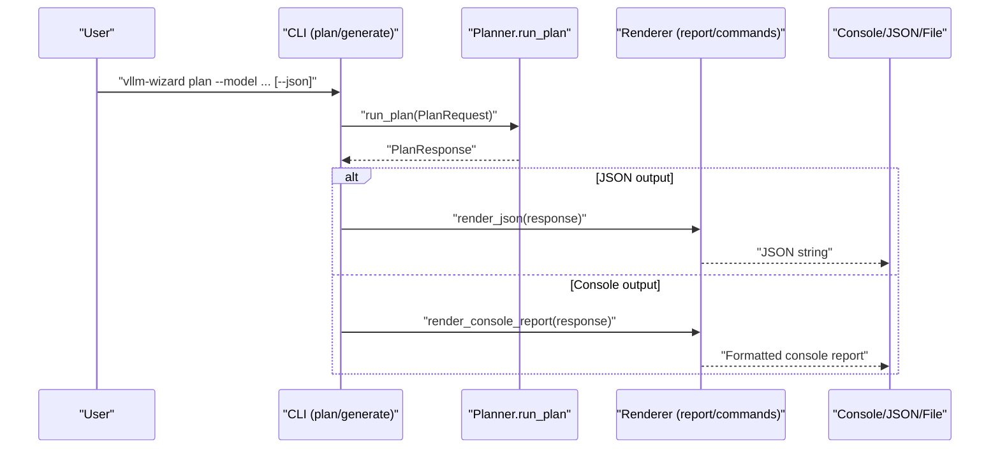
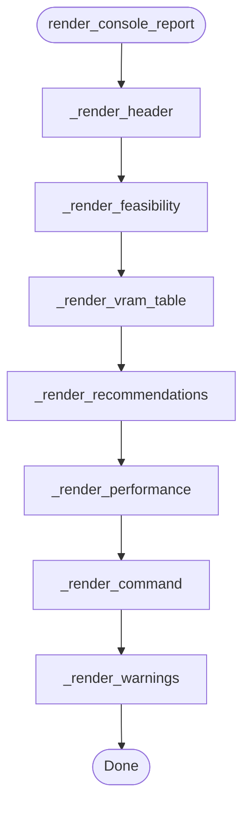
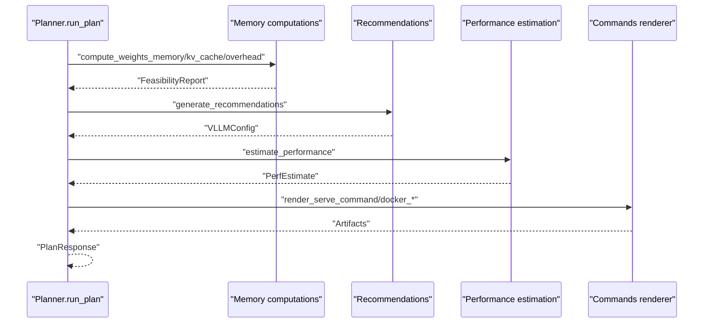
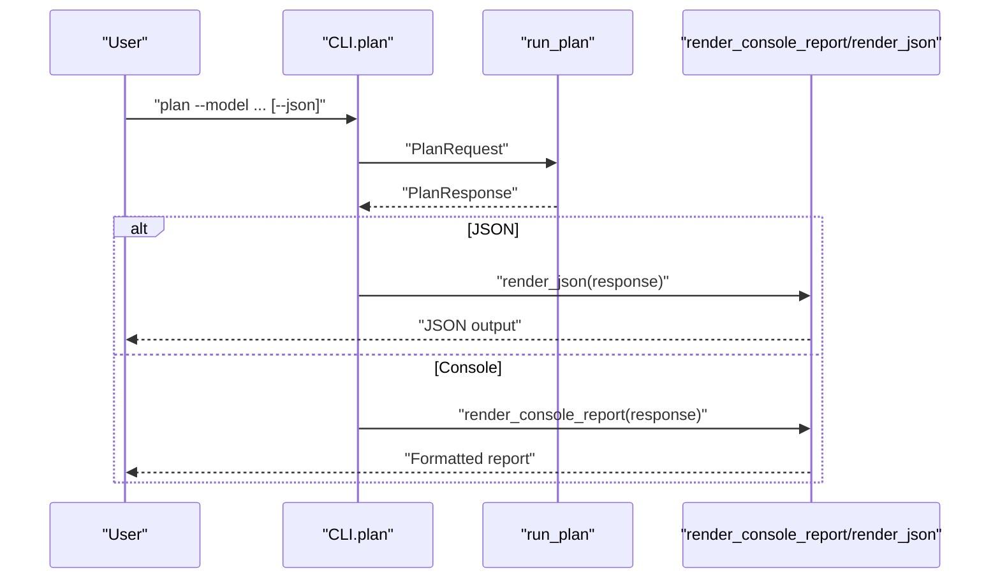
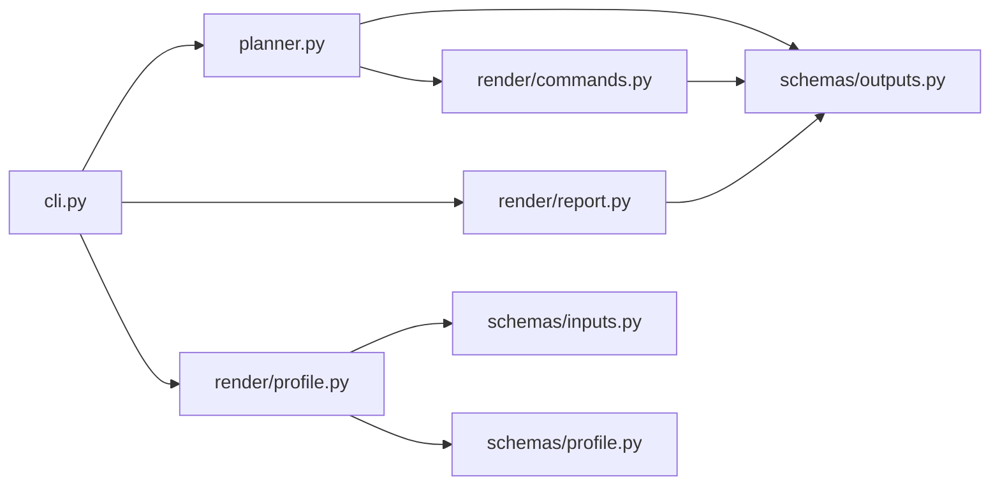

# Report Generation API

<cite>
**Referenced Files in This Document**
- [report.py](file://src/vllm_wizard/render/report.py)
- [__init__.py](file://src/vllm_wizard/render/__init__.py)
- [commands.py](file://src/vllm_wizard/render/commands.py)
- [profile.py](file://src/vllm_wizard/render/profile.py)
- [planner.py](file://src/vllm_wizard/planning/planner.py)
- [cli.py](file://src/vllm_wizard/cli.py)
- [outputs.py](file://src/vllm_wizard/schemas/outputs.py)
- [inputs.py](file://src/vllm_wizard/schemas/inputs.py)
- [profile_schema.py](file://src/vllm_wizard/schemas/profile.py)
- [README.md](file://README.md)
</cite>

## Table of Contents
1. [Introduction](#introduction)
2. [Project Structure](#project-structure)
3. [Core Components](#core-components)
4. [Architecture Overview](#architecture-overview)
5. [Detailed Component Analysis](#detailed-component-analysis)
6. [Dependency Analysis](#dependency-analysis)
7. [Performance Considerations](#performance-considerations)
8. [Troubleshooting Guide](#troubleshooting-guide)
9. [Conclusion](#conclusion)
10. [Appendices](#appendices)

## Introduction
This document provides comprehensive API documentation for the report generation system used by the vLLM Configuration Wizard. It focuses on how planning results are transformed into human-readable and machine-readable reports, including console output, JSON serialization, and GPU inventory displays. It also covers the integration with planning results, formatting options, and customization features for different audiences (technical vs. non-technical). Guidance is included on extending report formats and adding new report types.

## Project Structure
The report generation system spans several modules:
- Rendering: console reports, JSON serialization, and GPU lists
- Commands: artifact generation for serve/docker/compose/K8s
- Planning: orchestrates the planning pipeline and produces PlanResponse
- CLI: exposes commands to generate reports and artifacts
- Schemas: define the data models for planning results and configuration

```mermaid
graph TB
subgraph "CLI"
CLI["cli.py"]
end
subgraph "Planning"
PLAN["planner.py"]
end
subgraph "Rendering"
REP["render/report.py"]
CMD["render/commands.py"]
PROF["render/profile.py"]
end
subgraph "Schemas"
OUT["schemas/outputs.py"]
INP["schemas/inputs.py"]
PSCHEMA["schemas/profile.py"]
end
CLI --> PLAN
PLAN --> OUT
PLAN --> CMD
CLI --> REP
CLI --> PROF
REP --> OUT
CMD --> OUT
PROF --> INP
PROF --> PSCHEMA
```

**Diagram sources**
- [cli.py](file://src/vllm_wizard/cli.py#L1-L385)
- [planner.py](file://src/vllm_wizard/planning/planner.py#L1-L172)
- [report.py](file://src/vllm_wizard/render/report.py#L1-L272)
- [commands.py](file://src/vllm_wizard/render/commands.py#L1-L196)
- [profile.py](file://src/vllm_wizard/render/profile.py#L1-L173)
- [outputs.py](file://src/vllm_wizard/schemas/outputs.py#L1-L118)
- [inputs.py](file://src/vllm_wizard/schemas/inputs.py#L1-L110)
- [profile_schema.py](file://src/vllm_wizard/schemas/profile.py#L1-L75)

**Section sources**
- [cli.py](file://src/vllm_wizard/cli.py#L1-L385)
- [planner.py](file://src/vllm_wizard/planning/planner.py#L1-L172)
- [report.py](file://src/vllm_wizard/render/report.py#L1-L272)
- [commands.py](file://src/vllm_wizard/render/commands.py#L1-L196)
- [profile.py](file://src/vllm_wizard/render/profile.py#L1-L173)
- [outputs.py](file://src/vllm_wizard/schemas/outputs.py#L1-L118)
- [inputs.py](file://src/vllm_wizard/schemas/inputs.py#L1-L110)
- [profile_schema.py](file://src/vllm_wizard/schemas/profile.py#L1-L75)

## Core Components
- Console report renderer: renders a structured, color-coded, table-driven report from a PlanResponse
- JSON renderer: serializes PlanResponse to JSON for scripting and automation
- GPU list renderer: displays detected GPU inventory in a table
- Artifact generators: produce vllm serve, docker, docker-compose, and Kubernetes artifacts
- Planning pipeline: orchestrates model metadata loading, hardware resolution, memory feasibility, recommendations, performance estimation, and artifact generation
- CLI commands: expose plan and generate commands that drive report generation and artifact emission

Key APIs:
- Console report: render_console_report(response, console=None)
- JSON report: render_json(response, indent=2)
- GPU list: render_gpu_list(gpus, console=None)
- Artifact commands: render_serve_command(config), render_docker_command(config), render_docker_compose(config), render_k8s_values(config)
- Planning: run_plan(request) -> PlanResponse

**Section sources**
- [report.py](file://src/vllm_wizard/render/report.py#L14-L272)
- [commands.py](file://src/vllm_wizard/render/commands.py#L6-L196)
- [planner.py](file://src/vllm_wizard/planning/planner.py#L21-L135)
- [cli.py](file://src/vllm_wizard/cli.py#L82-L213)

## Architecture Overview
The report generation system integrates planning results into multiple output formats. The CLI invokes the planner, which computes feasibility, generates recommendations, estimates performance, and creates artifacts. Rendering functions then transform the PlanResponse into console-friendly reports, JSON, or GPU inventory displays.



**Diagram sources**
- [cli.py](file://src/vllm_wizard/cli.py#L82-L213)
- [planner.py](file://src/vllm_wizard/planning/planner.py#L21-L135)
- [report.py](file://src/vllm_wizard/render/report.py#L14-L44)

## Detailed Component Analysis

### Console Report Renderer
The console report renderer composes a multi-section report from a PlanResponse:
- Header indicating feasibility status
- Feasibility summary with OOM risk and headroom
- VRAM breakdown table with component sizes and percentages
- Recommended vLLM configuration table with parameter explanations
- Performance estimates with assumptions
- Recommended serve command panel
- Warning messages

Formatting options:
- Color-coded status and risk indicators
- Structured tables with titles and styles
- Panels for commands
- Optional console instance injection

Audience targeting:
- Technical: detailed tables, metrics, and explanations
- Non-technical: summarized feasibility, warnings, and actionable command



**Diagram sources**
- [report.py](file://src/vllm_wizard/render/report.py#L14-L44)
- [report.py](file://src/vllm_wizard/render/report.py#L46-L225)

**Section sources**
- [report.py](file://src/vllm_wizard/render/report.py#L14-L225)

### JSON Renderer
The JSON renderer serializes the PlanResponse to JSON. It supports configurable indentation and provides convenience methods for pretty printing and dictionary conversion.

Capabilities:
- Pretty-printed JSON output
- Dictionary conversion for downstream processing
- Consistent with Pydantic model serialization

Use cases:
- Automation scripts
- CI/CD pipelines
- Debugging and logging

**Section sources**
- [report.py](file://src/vllm_wizard/render/report.py#L228-L238)
- [outputs.py](file://src/vllm_wizard/schemas/outputs.py#L111-L118)

### GPU List Renderer
The GPU list renderer displays detected GPUs in a table with device attributes. It handles empty results gracefully with a user-friendly message.

Formatting options:
- Columnar layout with device index, name, VRAM, driver, and CUDA versions
- Optional console instance

Use cases:
- Pre-flight checks
- Environment diagnostics

**Section sources**
- [report.py](file://src/vllm_wizard/render/report.py#L241-L272)

### Artifact Generators
Artifact generators create runnable commands and configuration files from the recommended vLLM configuration:
- vllm serve command
- Docker run command
- docker-compose.yaml
- Kubernetes values.yaml

Customization features:
- Conditional inclusion of optional parameters
- Proper argument construction and formatting
- GPU count alignment with tensor-parallel size

Integration with planning:
- Generated artifacts are part of the PlanResponse artifacts field
- Used by CLI generate command to write files to disk

**Section sources**
- [commands.py](file://src/vllm_wizard/render/commands.py#L6-L196)
- [planner.py](file://src/vllm_wizard/planning/planner.py#L119-L129)

### Planning Pipeline Integration
The planning pipeline orchestrates the computation of feasibility, recommendations, performance, and artifacts, returning a PlanResponse that serves as the canonical input for all report types.

Processing logic:
- Model metadata loading
- Hardware resolution (auto-detection or manual)
- VRAM computation and feasibility assessment
- Recommendation generation
- Performance estimation
- Artifact creation



**Diagram sources**
- [planner.py](file://src/vllm_wizard/planning/planner.py#L21-L135)
- [commands.py](file://src/vllm_wizard/render/commands.py#L6-L46)

**Section sources**
- [planner.py](file://src/vllm_wizard/planning/planner.py#L21-L135)

### CLI Integration and Usage Patterns
The CLI exposes two primary commands that leverage the report generation system:
- plan: prints a console report or JSON depending on flags
- generate: writes artifacts to disk and prints a summary

Output customization:
- --json toggles JSON output
- --explain injects parameter explanations into recommendations
- --emit controls which artifacts to generate (command, profile, compose, k8s)



**Diagram sources**
- [cli.py](file://src/vllm_wizard/cli.py#L82-L213)
- [report.py](file://src/vllm_wizard/render/report.py#L14-L44)

**Section sources**
- [cli.py](file://src/vllm_wizard/cli.py#L82-L213)

## Dependency Analysis
The report generation system exhibits clear separation of concerns:
- Rendering depends on schemas for type-safe data structures
- CLI depends on planner and render modules
- Commands depend on VLLMConfig schema
- Planning depends on hardware detection and model metadata



**Diagram sources**
- [cli.py](file://src/vllm_wizard/cli.py#L1-L385)
- [planner.py](file://src/vllm_wizard/planning/planner.py#L1-L172)
- [report.py](file://src/vllm_wizard/render/report.py#L1-L272)
- [commands.py](file://src/vllm_wizard/render/commands.py#L1-L196)
- [profile.py](file://src/vllm_wizard/render/profile.py#L1-L173)
- [outputs.py](file://src/vllm_wizard/schemas/outputs.py#L1-L118)
- [inputs.py](file://src/vllm_wizard/schemas/inputs.py#L1-L110)
- [profile_schema.py](file://src/vllm_wizard/schemas/profile.py#L1-L75)

**Section sources**
- [cli.py](file://src/vllm_wizard/cli.py#L1-L385)
- [planner.py](file://src/vllm_wizard/planning/planner.py#L1-L172)
- [report.py](file://src/vllm_wizard/render/report.py#L1-L272)
- [commands.py](file://src/vllm_wizard/render/commands.py#L1-L196)
- [profile.py](file://src/vllm_wizard/render/profile.py#L1-L173)
- [outputs.py](file://src/vllm_wizard/schemas/outputs.py#L1-L118)
- [inputs.py](file://src/vllm_wizard/schemas/inputs.py#L1-L110)
- [profile_schema.py](file://src/vllm_wizard/schemas/profile.py#L1-L75)

## Performance Considerations
- Console rendering uses Rich tables and panels; performance is dominated by I/O rather than computation
- JSON serialization is efficient and suitable for large-scale automation
- GPU list rendering is lightweight and fast
- Artifact generation constructs strings from configuration; negligible overhead

Recommendations:
- Prefer JSON output for machine consumption to minimize parsing overhead
- Use explain mode judiciously as it increases recommendation table verbosity
- Cache model metadata and hardware detection results when invoking the planner repeatedly

## Troubleshooting Guide
Common issues and resolutions:
- No GPUs detected: Ensure nvidia-smi is installed and GPUs are available; use manual VRAM specification if auto-detection fails
- Configuration does not fit VRAM: Review feasibility summary, reduce context length, concurrency, or increase headroom; consider quantization
- JSON output missing: Verify --json flag is set for plan command
- Artifact generation errors: Confirm output directory permissions and emit options

Validation points:
- Feasibility status and OOM risk levels guide immediate actions
- Warning messages highlight potential pitfalls
- JSON output enables programmatic validation and debugging

**Section sources**
- [planner.py](file://src/vllm_wizard/planning/planner.py#L41-L46)
- [report.py](file://src/vllm_wizard/render/report.py#L215-L225)
- [cli.py](file://src/vllm_wizard/cli.py#L204-L212)

## Conclusion
The report generation system provides a robust, extensible foundation for transforming planning results into multiple output formats. It targets both technical and non-technical audiences through structured console reports, JSON serialization, and GPU inventory displays. The system integrates tightly with the planning pipeline and CLI, enabling seamless report generation and artifact emission. Extensions can be added by introducing new rendering functions and integrating them into the CLI and planner.

## Appendices

### Report Templates and Formatting Options
- Console report template sections:
  - Header with feasibility status
  - Feasibility summary with risk and headroom
  - VRAM breakdown table with component sizes and percentages
  - Recommended configuration table with explanations
  - Performance estimates with assumptions
  - Recommended command panel
  - Warning messages
- JSON template:
  - PlanResponse serialized as JSON with configurable indentation
- GPU list template:
  - Table of detected GPUs with device attributes

**Section sources**
- [report.py](file://src/vllm_wizard/render/report.py#L14-L272)
- [outputs.py](file://src/vllm_wizard/schemas/outputs.py#L103-L118)

### Extending Report Formats and Adding New Report Types
Guidance for extending the system:
- Define a new rendering function in the render module with a clear signature accepting PlanResponse and optional console
- Integrate the new renderer into CLI commands or planner outputs
- Add new fields to PlanResponse if needed, ensuring schema compatibility
- Provide backward-compatible defaults and optional toggles for new features
- Include tests validating the new report’s structure and content

Example extension points:
- PDF report renderer
- HTML dashboard renderer
- CSV export of VRAM breakdown
- Markdown documentation renderer

**Section sources**
- [report.py](file://src/vllm_wizard/render/report.py#L14-L44)
- [cli.py](file://src/vllm_wizard/cli.py#L82-L213)
- [planner.py](file://src/vllm_wizard/planning/planner.py#L21-L135)

### Integration with Planning Results
How reports are structured for different audiences:
- Technical audience: detailed feasibility, VRAM breakdown, performance estimates, and configuration explanations
- Non-technical audience: feasibility summary, warnings, and a single recommended command

Audience-specific features:
- Explain mode adds parameter explanations to recommendations
- JSON output provides machine-readable data for automation
- GPU list helps diagnose hardware compatibility

**Section sources**
- [report.py](file://src/vllm_wizard/render/report.py#L14-L225)
- [cli.py](file://src/vllm_wizard/cli.py#L146-L152)
- [README.md](file://README.md#L160-L191)