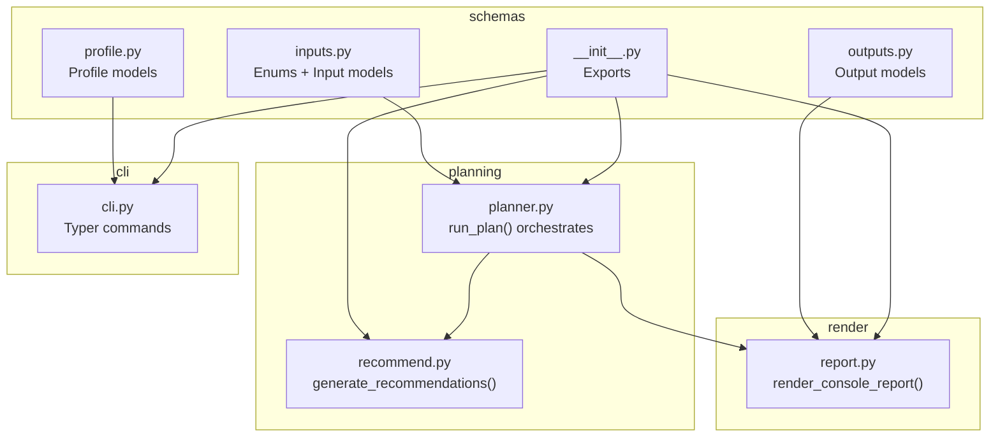
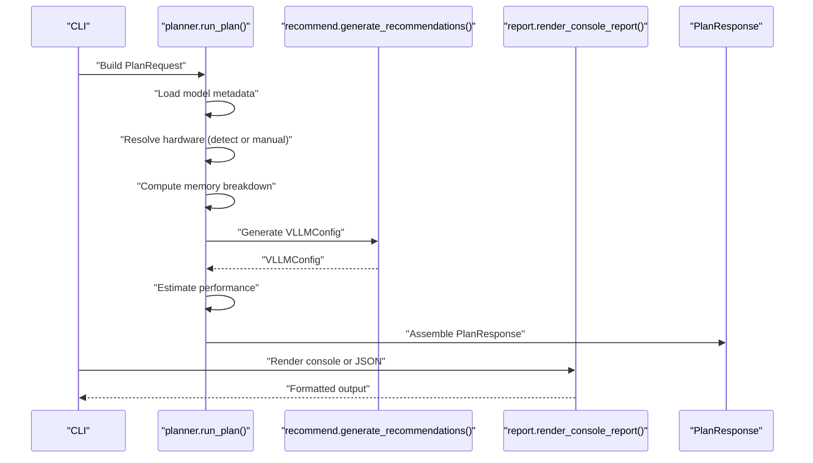
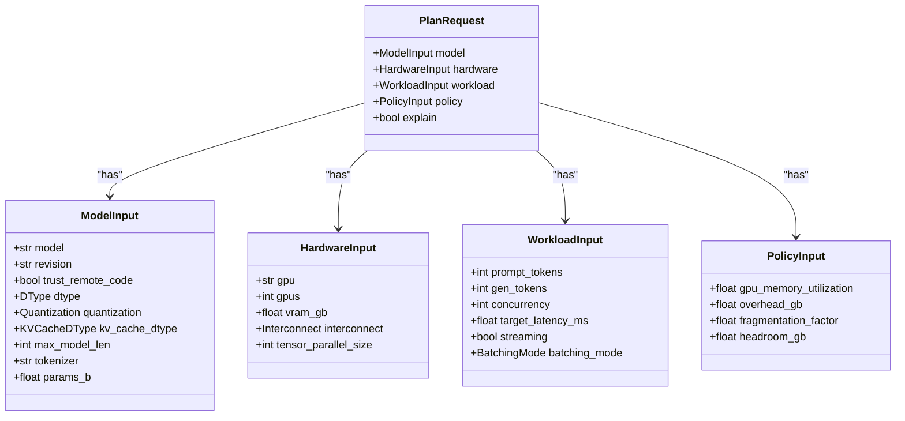
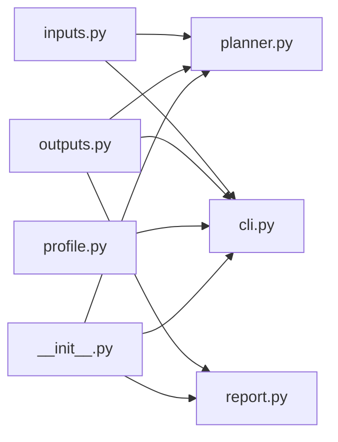

# Schema Models

<cite>
**Referenced Files in This Document**
- [inputs.py](file://src/vllm_wizard/schemas/inputs.py)
- [outputs.py](file://src/vllm_wizard/schemas/outputs.py)
- [profile.py](file://src/vllm_wizard/schemas/profile.py)
- [__init__.py](file://src/vllm_wizard/schemas/__init__.py)
- [planner.py](file://src/vllm_wizard/planning/planner.py)
- [recommend.py](file://src/vllm_wizard/planning/recommend.py)
- [report.py](file://src/vllm_wizard/render/report.py)
- [cli.py](file://src/vllm_wizard/cli.py)
- [requirements.txt](file://requirements.txt)
</cite>

## Table of Contents
1. [Introduction](#introduction)
2. [Project Structure](#project-structure)
3. [Core Components](#core-components)
4. [Architecture Overview](#architecture-overview)
5. [Detailed Component Analysis](#detailed-component-analysis)
6. [Dependency Analysis](#dependency-analysis)
7. [Performance Considerations](#performance-considerations)
8. [Troubleshooting Guide](#troubleshooting-guide)
9. [Conclusion](#conclusion)
10. [Appendices](#appendices)

## Introduction
This document describes the Pydantic schema models used by the vLLM Wizard API to define input and output data structures for planning GPU-accelerated inference deployments. It covers:
- Input models: ModelInput, HardwareInput, WorkloadInput, PolicyInput, and PlanRequest
- Output models: FeasibilityReport, VLLMConfig, PerfEstimate, Artifacts, and PlanResponse
- Enum types: DType, Quantization, KVCacheDType, Interconnect, BatchingMode
- Validation rules, constraints, defaults, and relationships
- Example instantiation and serialization patterns
- How schemas integrate into the planning pipeline and CLI
- Guidance for extending schemas and adding custom validation

## Project Structure
The schema models live under the schemas package and are consumed by the planning, rendering, and CLI modules.

**Diagram sources**
- [inputs.py](file://src/vllm_wizard/schemas/inputs.py#L1-L110)
- [outputs.py](file://src/vllm_wizard/schemas/outputs.py#L1-L118)
- [profile.py](file://src/vllm_wizard/schemas/profile.py#L1-L75)
- [__init__.py](file://src/vllm_wizard/schemas/__init__.py#L1-L50)
- [planner.py](file://src/vllm_wizard/planning/planner.py#L1-L172)
- [recommend.py](file://src/vllm_wizard/planning/recommend.py#L1-L333)
- [report.py](file://src/vllm_wizard/render/report.py#L1-L272)
- [cli.py](file://src/vllm_wizard/cli.py#L1-L385)

**Section sources**
- [__init__.py](file://src/vllm_wizard/schemas/__init__.py#L1-L50)

## Core Components
This section documents the primary input and output models and their enums.

- ModelInput: Defines model-level configuration including identifier, revision, trust flag, dtype, quantization, KV cache dtype, context length, tokenizer override, and parameter count.
- HardwareInput: Defines hardware configuration including GPU selection, GPU count, VRAM per GPU, interconnect type, and tensor parallel size.
- WorkloadInput: Defines workload characteristics including prompt and generation token counts, concurrency, optional latency target, streaming flag, and batching mode.
- PolicyInput: Defines safety and policy margins including GPU memory utilization target, optional fixed overhead, KV cache fragmentation factor, and minimum headroom.
- PlanRequest: Aggregates all inputs into a single request object with defaults for nested inputs.

- Output models:
  - FeasibilityReport: Reports VRAM feasibility, risk, totals, allocations, overhead, headroom, and max concurrency/context.
  - VLLMConfig: Recommended vLLM serving configuration with parameters like tensor parallel size, dtype, memory utilization, max model length, KV cache dtype, quantization, swap space, eager enforcement, and concurrency/batch limits.
  - PerfEstimate: Approximate performance ranges for decode, prefill, and TTFT with assumptions.
  - Artifacts: Generated artifacts such as serve command, Docker command, docker-compose content, and Kubernetes values.
  - PlanResponse: Complete response combining feasibility, config, performance, and artifacts, plus convenience helpers for JSON serialization.

- Enums:
  - DType: Model weight dtype choices.
  - Quantization: Quantization method choices.
  - KVCacheDType: KV cache dtype choices.
  - Interconnect: GPU interconnect type.
  - BatchingMode: Batch optimization mode.

**Section sources**
- [inputs.py](file://src/vllm_wizard/schemas/inputs.py#L54-L110)
- [outputs.py](file://src/vllm_wizard/schemas/outputs.py#L9-L118)
- [requirements.txt](file://requirements.txt#L118-L142)

## Architecture Overview
The planning pipeline consumes PlanRequest, resolves hardware, computes memory feasibility, generates recommendations, estimates performance, and produces PlanResponse with artifacts.

**Diagram sources**
- [planner.py](file://src/vllm_wizard/planning/planner.py#L21-L135)
- [recommend.py](file://src/vllm_wizard/planning/recommend.py#L167-L332)
- [report.py](file://src/vllm_wizard/render/report.py#L14-L43)
- [cli.py](file://src/vllm_wizard/cli.py#L153-L212)

## Detailed Component Analysis

### Input Models and Enums

#### Enums
- DType: Values include auto, fp16, bf16, fp32. Use cases: selecting model weight precision; auto allows runtime selection.
- Quantization: Values include none, awq, gptq, int8, fp8. Use cases: reducing memory footprint and enabling larger models.
- KVCacheDType: Values include auto, fp16, bf16, fp8_e4m3fn, fp8_e5m2. Use cases: optimizing KV cache memory usage; experimental FP8 variants on supported GPUs.
- Interconnect: Values include pcie, nvlink, unknown. Use cases: affects performance scaling heuristics.
- BatchingMode: Values include throughput, latency, balanced. Use cases: tuning batching strategy for performance goals.

Constraints and defaults:
- DType, Quantization, KVCacheDType, Interconnect, BatchingMode are validated against their enum sets.
- Defaults are set in PlanRequest and nested input models to enable quick-start usage.

Validation rules:
- Positive integer constraints: max_model_len, prompt_tokens, gen_tokens, concurrency, tensor_parallel_size, gpus.
- Numeric bounds: gpu_memory_utilization, fragmentation_factor, headroom_gb, target_latency_ms.
- Optional fields: revision, tokenizer, params_b, vram_gb, overhead_gb, target_latency_ms, tensor_parallel_size.

Example instantiation patterns:
- Construct PlanRequest by composing ModelInput, HardwareInput, WorkloadInput, PolicyInput.
- Use CLI flags to populate PlanRequest; the CLI builds PlanRequest and invokes run_plan().
- Serialization: Pydantic’s model_dump()/model_dump_json() produce structured output.

Relationships:
- PlanRequest aggregates nested inputs; Planner reads fields to compute feasibility and recommendations.
- Recommendation engine maps inputs to VLLMConfig with safety margins and heuristics.

**Section sources**
- [inputs.py](file://src/vllm_wizard/schemas/inputs.py#L9-L52)
- [inputs.py](file://src/vllm_wizard/schemas/inputs.py#L54-L110)
- [cli.py](file://src/vllm_wizard/cli.py#L162-L193)
- [planner.py](file://src/vllm_wizard/planning/planner.py#L30-L97)

#### ModelInput
- Fields: model, revision, trust_remote_code, dtype, quantization, kv_cache_dtype, max_model_len, tokenizer, params_b.
- Constraints: max_model_len and params_b must be greater than zero when provided.
- Defaults: dtype AUTO, quantization NONE, kv_cache_dtype AUTO, trust_remote_code False.

**Section sources**
- [inputs.py](file://src/vllm_wizard/schemas/inputs.py#L54-L66)

#### HardwareInput
- Fields: gpu, gpus, vram_gb, interconnect, tensor_parallel_size.
- Constraints: gpus and tensor_parallel_size must be at least 1; vram_gb must be positive when provided.
- Defaults: gpu "auto", gpus 1, interconnect UNKNOWN, tensor_parallel_size None.

**Section sources**
- [inputs.py](file://src/vllm_wizard/schemas/inputs.py#L68-L76)

#### WorkloadInput
- Fields: prompt_tokens, gen_tokens, concurrency, target_latency_ms, streaming, batching_mode.
- Constraints: prompt_tokens, gen_tokens, concurrency must be at least 1; target_latency_ms must be positive when provided.
- Defaults: prompt_tokens 512, gen_tokens 256, concurrency 1, streaming True, batching_mode BALANCED.

**Section sources**
- [inputs.py](file://src/vllm_wizard/schemas/inputs.py#L78-L87)

#### PolicyInput
- Fields: gpu_memory_utilization, overhead_gb, fragmentation_factor, headroom_gb.
- Constraints: gpu_memory_utilization between 0.5 and 0.98; fragmentation_factor between 1.0 and 2.0; headroom_gb and overhead_gb must be non-negative.
- Defaults: gpu_memory_utilization 0.90, fragmentation_factor 1.15, headroom_gb 1.0.

**Section sources**
- [inputs.py](file://src/vllm_wizard/schemas/inputs.py#L89-L100)

#### PlanRequest
- Fields: model (required), hardware (default_factory), workload (default_factory), policy (default_factory), explain (bool).
- Defaults: nested inputs use their own defaults; explain False.

**Section sources**
- [inputs.py](file://src/vllm_wizard/schemas/inputs.py#L102-L110)

### Output Models

#### FeasibilityReport
- Purpose: Summarize VRAM feasibility and risk.
- Key fields: fits (bool), oom_risk (OOMRisk), vram_total_gb, vram_target_alloc_gb, weights_gb, kv_cache_gb, overhead_gb, headroom_gb, max_concurrency_at_context, max_context_at_concurrency, warnings (list).

**Section sources**
- [outputs.py](file://src/vllm_wizard/schemas/outputs.py#L37-L55)

#### VLLMConfig
- Purpose: Recommended vLLM serving configuration.
- Key fields: model, tensor_parallel_size, dtype, gpu_memory_utilization, max_model_len, kv_cache_dtype, quantization, swap_space, enforce_eager, max_num_seqs, max_num_batched_tokens, trust_remote_code, explanations (dict).
- Defaults: sensible defaults for most fields; dtype defaults to "auto"; explanations empty unless explain is enabled.

**Section sources**
- [outputs.py](file://src/vllm_wizard/schemas/outputs.py#L57-L75)

#### PerfEstimate
- Purpose: Approximate performance ranges.
- Key fields: decode_toks_per_s_range (tuple), prefill_toks_per_s_range (optional tuple), ttft_ms_range (optional tuple), assumptions (list).

**Section sources**
- [outputs.py](file://src/vllm_wizard/schemas/outputs.py#L77-L92)

#### Artifacts
- Purpose: Generated deployment artifacts.
- Key fields: serve_command, docker_command, docker_compose, k8s_values.

**Section sources**
- [outputs.py](file://src/vllm_wizard/schemas/outputs.py#L94-L101)

#### PlanResponse
- Purpose: Complete planning result.
- Fields: feasibility (FeasibilityReport), config (VLLMConfig), performance (PerfEstimate), artifacts (Artifacts).
- Helpers: model_dump_json_pretty(), to_dict().

**Section sources**
- [outputs.py](file://src/vllm_wizard/schemas/outputs.py#L103-L118)

### Relationship Between Components
PlanRequest is the root input aggregating all configuration. The planner orchestrates:
- Model metadata loading
- Hardware resolution (auto-detection or manual)
- Memory computation (weights, KV cache, overhead)
- Feasibility assessment
- Recommendation generation
- Performance estimation
- Artifact generation

**Diagram sources**
- [inputs.py](file://src/vllm_wizard/schemas/inputs.py#L54-L110)

**Section sources**
- [planner.py](file://src/vllm_wizard/planning/planner.py#L21-L135)
- [recommend.py](file://src/vllm_wizard/planning/recommend.py#L167-L332)

### Example Instantiation and Serialization
- CLI-driven instantiation: The CLI constructs PlanRequest from flags and passes it to run_plan(). See [cli.py](file://src/vllm_wizard/cli.py#L162-L193).
- Programmatic instantiation: Build nested inputs and assemble PlanRequest similarly to the CLI.
- Serialization: Use model_dump() or model_dump_json() on any Pydantic model. PlanResponse provides convenience helpers for pretty JSON.

**Section sources**
- [cli.py](file://src/vllm_wizard/cli.py#L153-L212)
- [outputs.py](file://src/vllm_wizard/schemas/outputs.py#L111-L118)

### Extending Schemas and Adding Custom Validation
Guidance for extending the schema models:
- Add new fields to existing models with appropriate types and constraints (e.g., Field(..., ge=0, le=1)).
- Introduce new enums under the schemas package if needed; export them in __init__.py.
- Add new nested models for grouping related inputs/outputs.
- Keep defaults reasonable to preserve usability.
- Preserve backward compatibility by avoiding breaking changes to existing fields.
- When adding new validations, prefer Pydantic validators or custom validators to keep validation close to the model definition.

Integration points:
- Update planner.py to consume new fields during feasibility and recommendation computation.
- Update recommend.py if new fields influence recommendations.
- Update report.py to render new fields in console or JSON outputs.
- Update CLI commands to expose new options and map them to PlanRequest.

**Section sources**
- [__init__.py](file://src/vllm_wizard/schemas/__init__.py#L26-L49)
- [planner.py](file://src/vllm_wizard/planning/planner.py#L21-L135)
- [recommend.py](file://src/vllm_wizard/planning/recommend.py#L167-L332)
- [report.py](file://src/vllm_wizard/render/report.py#L14-L43)
- [cli.py](file://src/vllm_wizard/cli.py#L153-L212)

## Dependency Analysis
The schemas are consumed by planning, recommendation, rendering, and CLI modules. The exports in __init__.py centralize imports for downstream consumers.

**Diagram sources**
- [inputs.py](file://src/vllm_wizard/schemas/inputs.py#L1-L110)
- [outputs.py](file://src/vllm_wizard/schemas/outputs.py#L1-L118)
- [profile.py](file://src/vllm_wizard/schemas/profile.py#L1-L75)
- [__init__.py](file://src/vllm_wizard/schemas/__init__.py#L1-L50)
- [planner.py](file://src/vllm_wizard/planning/planner.py#L1-L172)
- [recommend.py](file://src/vllm_wizard/planning/recommend.py#L1-L333)
- [report.py](file://src/vllm_wizard/render/report.py#L1-L272)
- [cli.py](file://src/vllm_wizard/cli.py#L1-L385)

**Section sources**
- [__init__.py](file://src/vllm_wizard/schemas/__init__.py#L3-L24)

## Performance Considerations
- KV cache dtype selection can reduce memory pressure; KVCacheDType supports FP8 variants on modern GPUs.
- BatchingMode influences concurrency and batch sizes; throughput mode increases concurrency buffers, latency mode aligns with target concurrency, balanced adds modest headroom.
- Fragmentation factor and headroom control memory safety margins; higher fragmentation increases KV cache overhead.
- Interconnect type affects performance scaling; NVLink generally yields better multi-GPU performance than PCIe.

[No sources needed since this section provides general guidance]

## Troubleshooting Guide
Common issues and resolutions:
- Validation errors on constrained fields (e.g., negative integers or out-of-range floats) indicate invalid input values; adjust according to Field constraints.
- If GPU detection fails, provide VRAM and GPU count manually; the planner falls back to manual specification when auto-detection is unavailable.
- If model metadata cannot be derived, supply params_b or provide a local config.json; the planner requires sufficient metadata to compute memory usage.

**Section sources**
- [planner.py](file://src/vllm_wizard/planning/planner.py#L41-L45)
- [cli.py](file://src/vllm_wizard/cli.py#L204-L212)

## Conclusion
The vLLM Wizard schemas provide a robust, validated foundation for planning GPU deployments. They cleanly separate model, hardware, workload, and policy concerns into cohesive models, with clear defaults and constraints. The planner integrates these inputs to produce feasible recommendations, performance estimates, and deployable artifacts. Extending the schemas follows established patterns: add fields with constraints, update consumers, and preserve backward compatibility.

[No sources needed since this section summarizes without analyzing specific files]

## Appendices

### Appendix A: Enum Definitions and Use Cases
- DType: Select model weight precision; auto enables runtime selection.
- Quantization: Enable memory-efficient quantization methods; awq/gptq/int8/fp8 choices.
- KVCacheDType: Optimize KV cache memory; FP8 variants on supported GPUs.
- Interconnect: Choose pcie/nvlink/unknown; affects performance scaling.
- BatchingMode: Choose throughput/latency/balanced to tune batching behavior.

**Section sources**
- [inputs.py](file://src/vllm_wizard/schemas/inputs.py#L9-L52)

### Appendix B: Field Validation Rules Summary
- Positive integer constraints: max_model_len (>0), prompt_tokens (≥1), gen_tokens (≥1), concurrency (≥1), tensor_parallel_size (≥1), gpus (≥1).
- Numeric bounds: gpu_memory_utilization [0.5, 0.98], fragmentation_factor [1.0, 2.0], headroom_gb (≥0), target_latency_ms (>0), overhead_gb (≥0).
- Optional fields: revision, tokenizer, params_b, vram_gb, target_latency_ms, tensor_parallel_size.

**Section sources**
- [inputs.py](file://src/vllm_wizard/schemas/inputs.py#L63-L65)
- [inputs.py](file://src/vllm_wizard/schemas/inputs.py#L71-L75)
- [inputs.py](file://src/vllm_wizard/schemas/inputs.py#L81-L86)
- [inputs.py](file://src/vllm_wizard/schemas/inputs.py#L92-L99)

### Appendix C: CLI-to-Schema Mapping
- CLI flags map directly to PlanRequest fields; the CLI constructs PlanRequest and invokes run_plan().
- The CLI exposes all input enums and constraints via typed options.

**Section sources**
- [cli.py](file://src/vllm_wizard/cli.py#L82-L212)