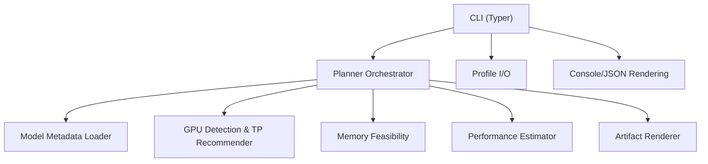
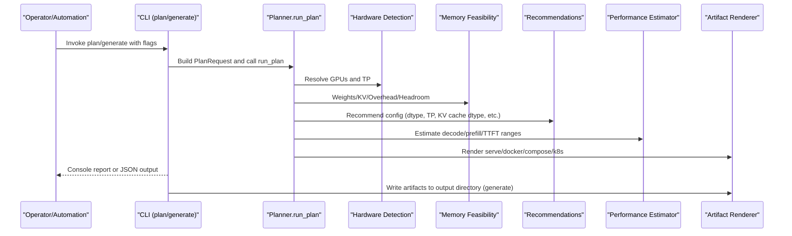
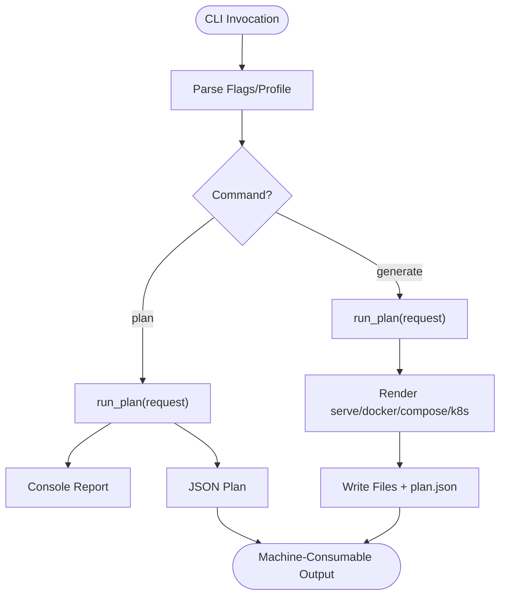
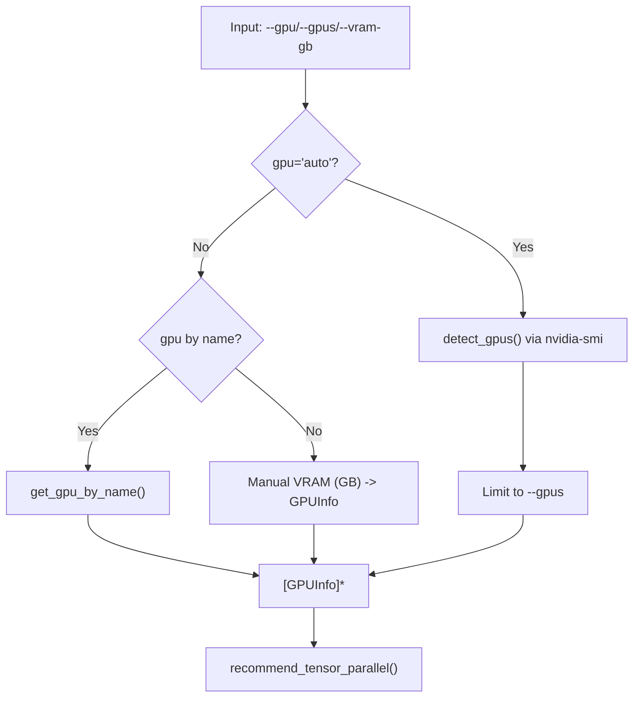
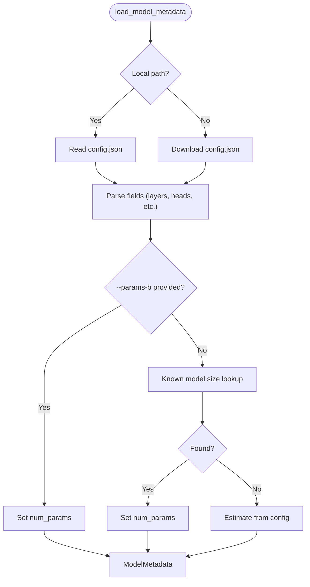
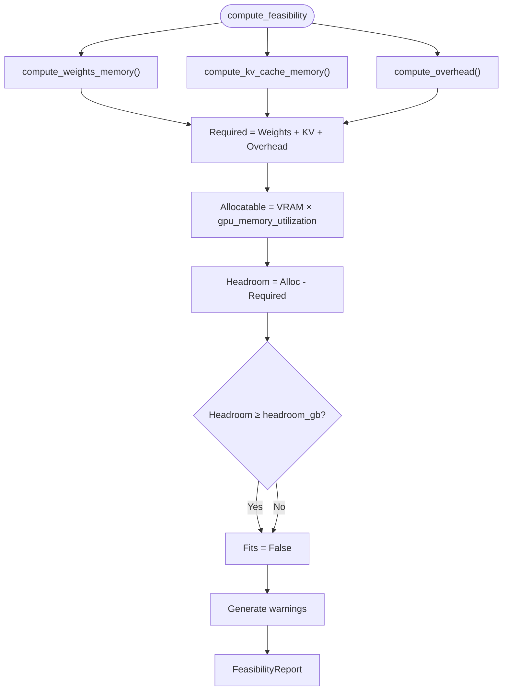
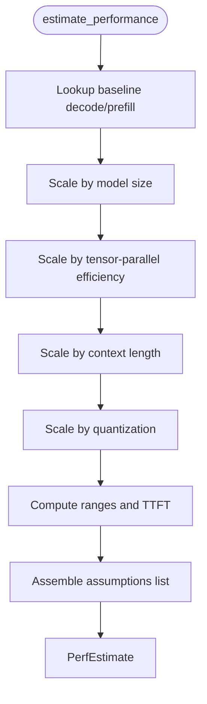
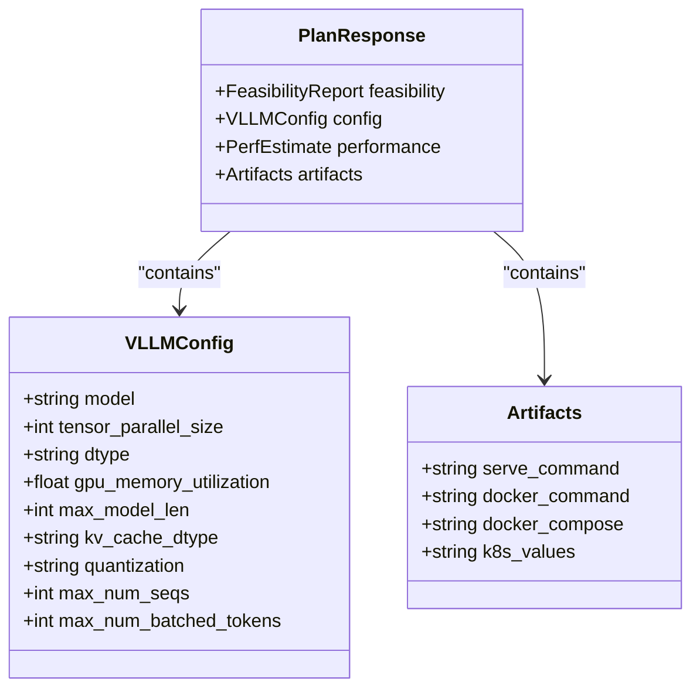
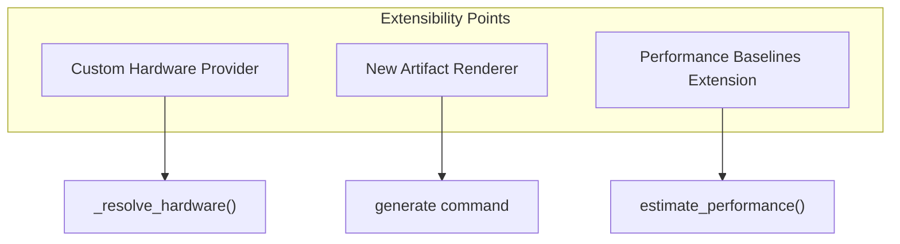
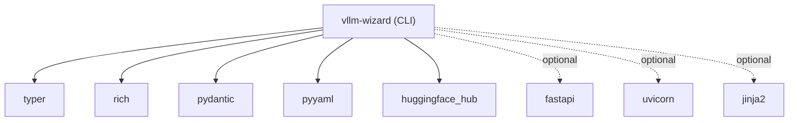

# Advanced Usage and Integration

<cite>
**Referenced Files in This Document**
- [README.md](file://README.md)
- [pyproject.toml](file://pyproject.toml)
- [requirements.txt](file://requirements.txt)
- [src/vllm_wizard/cli.py](file://src/vllm_wizard/cli.py)
- [src/vllm_wizard/__init__.py](file://src/vllm_wizard/__init__.py)
- [src/vllm_wizard/hardware/detect.py](file://src/vllm_wizard/hardware/detect.py)
- [src/vllm_wizard/models/metadata.py](file://src/vllm_wizard/models/metadata.py)
- [src/vllm_wizard/planning/planner.py](file://src/vllm_wizard/planning/planner.py)
- [src/vllm_wizard/planning/memory.py](file://src/vllm_wizard/planning/memory.py)
- [src/vllm_wizard/planning/perf.py](file://src/vllm_wizard/planning/perf.py)
- [src/vllm_wizard/planning/recommend.py](file://src/vllm_wizard/planning/recommend.py)
- [src/vllm_wizard/render/commands.py](file://src/vllm_wizard/render/commands.py)
- [src/vllm_wizard/render/profile.py](file://src/vllm_wizard/render/profile.py)
- [src/vllm_wizard/schemas/inputs.py](file://src/vllm_wizard/schemas/inputs.py)
- [src/vllm_wizard/schemas/outputs.py](file://src/vllm_wizard/schemas/outputs.py)
</cite>

## Table of Contents
1. [Introduction](#introduction)
2. [Project Structure](#project-structure)
3. [Core Components](#core-components)
4. [Architecture Overview](#architecture-overview)
5. [Detailed Component Analysis](#detailed-component-analysis)
6. [Dependency Analysis](#dependency-analysis)
7. [Performance Considerations](#performance-considerations)
8. [Troubleshooting Guide](#troubleshooting-guide)
9. [Conclusion](#conclusion)
10. [Appendices](#appendices)

## Introduction
This document provides advanced usage and integration guidance for power users and enterprise environments. It focuses on:
- Scripting and automation using JSON output for programmatic workflows
- Integration with deployment pipelines, infrastructure provisioning tools, and monitoring systems
- Extending functionality through custom plugins and integrations
- Advanced CLI usage patterns including command chaining and parameter optimization
- Complex multi-GPU configurations and specialized deployment scenarios
- Performance tuning techniques and advanced troubleshooting methods
- Scalability considerations and enterprise deployment patterns

## Project Structure
The project is organized around a modular CLI that orchestrates planning, recommendation, memory modeling, performance estimation, and artifact generation. Key modules:
- CLI entrypoint and commands
- Hardware detection and tensor-parallel recommendations
- Model metadata extraction and parameter estimation
- Memory feasibility and VRAM breakdown
- Performance heuristics and estimates
- Artifact rendering for serve, docker-compose, and Kubernetes
- Profile serialization and deserialization

**Diagram sources**
- [src/vllm_wizard/cli.py](file://src/vllm_wizard/cli.py#L62-L381)
- [src/vllm_wizard/planning/planner.py](file://src/vllm_wizard/planning/planner.py#L21-L136)
- [src/vllm_wizard/models/metadata.py](file://src/vllm_wizard/models/metadata.py#L209-L255)
- [src/vllm_wizard/hardware/detect.py](file://src/vllm_wizard/hardware/detect.py#L10-L229)
- [src/vllm_wizard/planning/memory.py](file://src/vllm_wizard/planning/memory.py#L155-L271)
- [src/vllm_wizard/planning/perf.py](file://src/vllm_wizard/planning/perf.py#L136-L220)
- [src/vllm_wizard/render/commands.py](file://src/vllm_wizard/render/commands.py#L6-L196)
- [src/vllm_wizard/render/profile.py](file://src/vllm_wizard/render/profile.py#L30-L173)

**Section sources**
- [README.md](file://README.md#L1-L308)
- [pyproject.toml](file://pyproject.toml#L1-L71)

## Core Components
- CLI commands:
  - detect: Lists GPUs and optionally outputs JSON for automation
  - plan: Computes feasibility, recommendations, and performance estimates; supports JSON output and explanations
  - generate: Emits artifacts to disk and JSON plan for downstream automation
- Planning pipeline:
  - Orchestrates metadata loading, hardware resolution, memory feasibility, recommendations, performance estimation, and artifact rendering
- Rendering:
  - Generates vLLM serve command, docker-compose, and Kubernetes values
  - Saves profiles and JSON plan for reproducibility and automation
- Schemas:
  - Strongly typed inputs and outputs using Pydantic for validation and JSON compatibility

**Section sources**
- [src/vllm_wizard/cli.py](file://src/vllm_wizard/cli.py#L62-L381)
- [src/vllm_wizard/planning/planner.py](file://src/vllm_wizard/planning/planner.py#L21-L136)
- [src/vllm_wizard/render/commands.py](file://src/vllm_wizard/render/commands.py#L6-L196)
- [src/vllm_wizard/render/profile.py](file://src/vllm_wizard/render/profile.py#L30-L173)
- [src/vllm_wizard/schemas/inputs.py](file://src/vllm_wizard/schemas/inputs.py#L54-L110)
- [src/vllm_wizard/schemas/outputs.py](file://src/vllm_wizard/schemas/outputs.py#L103-L118)

## Architecture Overview
The CLI delegates to a planner that coordinates multiple subsystems. The planner resolves hardware, computes VRAM feasibility, generates recommendations, estimates performance, and renders artifacts. Profiles encapsulate reproducible configurations.

**Diagram sources**
- [src/vllm_wizard/cli.py](file://src/vllm_wizard/cli.py#L82-L381)
- [src/vllm_wizard/planning/planner.py](file://src/vllm_wizard/planning/planner.py#L21-L136)
- [src/vllm_wizard/hardware/detect.py](file://src/vllm_wizard/hardware/detect.py#L10-L229)
- [src/vllm_wizard/planning/memory.py](file://src/vllm_wizard/planning/memory.py#L155-L271)
- [src/vllm_wizard/planning/perf.py](file://src/vllm_wizard/planning/perf.py#L136-L220)
- [src/vllm_wizard/render/commands.py](file://src/vllm_wizard/render/commands.py#L6-L196)

## Detailed Component Analysis

### CLI Orchestration and JSON Automation
- detect --json: Machine-readable GPU inventory for CI/CD and fleet orchestration
- plan --json: JSON plan for programmatic consumption (CI/CD, dashboards, or external schedulers)
- plan --explain: Adds human-readable explanations for each recommendation
- generate --emit: Produces artifacts and plan.json for reproducible deployments

**Diagram sources**
- [src/vllm_wizard/cli.py](file://src/vllm_wizard/cli.py#L82-L381)
- [src/vllm_wizard/planning/planner.py](file://src/vllm_wizard/planning/planner.py#L21-L136)
- [src/vllm_wizard/render/commands.py](file://src/vllm_wizard/render/commands.py#L324-L350)

**Section sources**
- [src/vllm_wizard/cli.py](file://src/vllm_wizard/cli.py#L62-L381)
- [README.md](file://README.md#L90-L159)

### Hardware Detection and Tensor-Parallel Recommendations
- Auto-detection via nvidia-smi with driver/CUDA versions and compute capability
- Fallback to known GPU VRAM database for common GPUs
- TP recommendation based on number of GPUs and model weights per GPU constraint

**Diagram sources**
- [src/vllm_wizard/hardware/detect.py](file://src/vllm_wizard/hardware/detect.py#L10-L229)
- [src/vllm_wizard/planning/planner.py](file://src/vllm_wizard/planning/planner.py#L138-L172)

**Section sources**
- [src/vllm_wizard/hardware/detect.py](file://src/vllm_wizard/hardware/detect.py#L10-L229)
- [src/vllm_wizard/planning/planner.py](file://src/vllm_wizard/planning/planner.py#L138-L172)

### Model Metadata Extraction and Parameter Estimation
- Loads config.json from local path or Hugging Face Hub
- Parses architecture fields with robust fallbacks
- Estimates parameters when not provided; supports known model size lookup table
- Supplies metadata for memory and performance computations

**Diagram sources**
- [src/vllm_wizard/models/metadata.py](file://src/vllm_wizard/models/metadata.py#L209-L255)

**Section sources**
- [src/vllm_wizard/models/metadata.py](file://src/vllm_wizard/models/metadata.py#L12-L255)

### Memory Feasibility and VRAM Breakdown
- Weights memory: dtype/quantization-aware
- KV cache memory: scales with context, concurrency, fragmentation
- Overhead: base + communication buffers for multi-GPU
- Headroom and OOM risk classification
- Max concurrency at context and max context at concurrency

**Diagram sources**
- [src/vllm_wizard/planning/memory.py](file://src/vllm_wizard/planning/memory.py#L155-L271)

**Section sources**
- [src/vllm_wizard/planning/memory.py](file://src/vllm_wizard/planning/memory.py#L31-L367)

### Performance Estimation Heuristics
- Baselines by GPU class (consumer/datacenter)
- Scales by model size (inverse power law), tensor-parallel efficiency (NVLink/PCIe), context length, and quantization
- Returns decode/prefill ranges and TTFT estimate with assumptions

**Diagram sources**
- [src/vllm_wizard/planning/perf.py](file://src/vllm_wizard/planning/perf.py#L136-L220)

**Section sources**
- [src/vllm_wizard/planning/perf.py](file://src/vllm_wizard/planning/perf.py#L1-L220)

### Artifact Rendering and Profiles
- vLLM serve command, docker run, docker-compose, and Kubernetes values
- Profiles saved as YAML with versioned schema for reproducibility
- JSON plan included alongside artifacts for automation

**Diagram sources**
- [src/vllm_wizard/schemas/outputs.py](file://src/vllm_wizard/schemas/outputs.py#L57-L118)
- [src/vllm_wizard/render/commands.py](file://src/vllm_wizard/render/commands.py#L6-L196)

**Section sources**
- [src/vllm_wizard/render/commands.py](file://src/vllm_wizard/render/commands.py#L6-L196)
- [src/vllm_wizard/render/profile.py](file://src/vllm_wizard/render/profile.py#L30-L173)
- [src/vllm_wizard/schemas/outputs.py](file://src/vllm_wizard/schemas/outputs.py#L94-L118)

### Advanced CLI Usage Patterns
- Command chaining:
  - plan --json | jq ... | generate --emit command,profile --output-dir ./out
  - detect --json | python3 -c "import sys, json; print(json.load(sys.stdin)[0]['name'])"
- Parameter optimization:
  - Use --fragmentation-factor to tune KV cache safety margin
  - Adjust --gpu-memory-utilization conservatively on consumer GPUs
  - Combine --quantization awq/gptq with --kv-cache-dtype fp8 when appropriate
- Multi-GPU configurations:
  - Set --gpus and allow --tensor-parallel-size auto; review recommendations
  - For NVLink interconnect, expect better TP scaling efficiency

**Section sources**
- [README.md](file://README.md#L90-L159)
- [src/vllm_wizard/cli.py](file://src/vllm_wizard/cli.py#L82-L381)

### Integration Scenarios
- Deployment pipelines:
  - CI jobs: plan --json → parse and gate deployments; generate --emit compose,k8s for preview
  - CD: generate artifacts and commit plan.json for auditability
- Infrastructure provisioning:
  - detect --json to discover nodes and select GPU families
  - Use known GPU VRAM fallback when nvidia-smi unavailable
- Monitoring systems:
  - Surface feasibility and performance ranges from plan.json
  - Track OOM risk and headroom to alert on configuration drift

**Section sources**
- [src/vllm_wizard/cli.py](file://src/vllm_wizard/cli.py#L62-L381)
- [src/vllm_wizard/hardware/detect.py](file://src/vllm_wizard/hardware/detect.py#L10-L229)

### Custom Hardware Backend Development and Plugin Architecture
- Extendable hardware detection:
  - Implement a new provider by returning a list of GPUInfo with name and vram_mib
  - Integrate into _resolve_hardware or supply a compatible interface
- Plugin hooks:
  - Add new artifact renderers by implementing a renderer function and wiring it in generate
  - Add new performance baselines by extending the performance estimator module
- Schema extensibility:
  - Extend Pydantic models for inputs/outputs to carry custom fields
  - Maintain backward-compatible profiles by versioning and default handling

**Diagram sources**
- [src/vllm_wizard/planning/planner.py](file://src/vllm_wizard/planning/planner.py#L138-L172)
- [src/vllm_wizard/render/commands.py](file://src/vllm_wizard/render/commands.py#L116-L196)
- [src/vllm_wizard/planning/perf.py](file://src/vllm_wizard/planning/perf.py#L136-L220)

**Section sources**
- [src/vllm_wizard/planning/planner.py](file://src/vllm_wizard/planning/planner.py#L138-L172)
- [src/vllm_wizard/render/commands.py](file://src/vllm_wizard/render/commands.py#L116-L196)
- [src/vllm_wizard/planning/perf.py](file://src/vllm_wizard/planning/perf.py#L136-L220)

### Complex Multi-GPU Configurations
- Example patterns:
  - 4x A100 80GB with NVLink and tensor-parallel TP=4 for 70B-scale models
  - Mixed interconnect scenarios: NVLink yields higher decode throughput than PCIe
  - Long-context workloads: consider FP8 KV cache dtype on supported GPUs and reduce context length if needed
- Validation:
  - Review feasibility report and warnings
  - Confirm KV cache ratio and OOM risk levels

**Section sources**
- [README.md](file://README.md#L242-L277)
- [src/vllm_wizard/planning/recommend.py](file://src/vllm_wizard/planning/recommend.py#L102-L122)
- [src/vllm_wizard/planning/memory.py](file://src/vllm_wizard/planning/memory.py#L155-L271)

### Specialized Deployment Scenarios
- Docker Compose:
  - Mount Hugging Face cache and expose 8000
  - Reserve GPUs via deploy.resources.reservations.devices
- Kubernetes:
  - Set resource requests/limits for nvidia.com/gpu
  - Pass vLLM args via container args
- Web UI (optional):
  - FastAPI endpoints for plan/generate and GPU discovery

**Section sources**
- [README.md](file://README.md#L64-L88)
- [src/vllm_wizard/render/commands.py](file://src/vllm_wizard/render/commands.py#L75-L155)
- [pyproject.toml](file://pyproject.toml#L37-L47)

## Dependency Analysis
External dependencies include Typer for CLI, Rich for console rendering, Pydantic for schemas, PyYAML for profiles, and Hugging Face Hub for metadata retrieval. Optional web stack is available.

**Diagram sources**
- [pyproject.toml](file://pyproject.toml#L29-L47)

**Section sources**
- [pyproject.toml](file://pyproject.toml#L29-L47)
- [requirements.txt](file://requirements.txt#L426-L463)

## Performance Considerations
- Choose appropriate dtype and quantization to fit model weights within VRAM
- Tune fragmentation factor and headroom to balance safety and utilization
- Prefer NVLink interconnect for multi-GPU setups to improve TP scaling
- Reduce context length or concurrency to mitigate KV cache pressure
- Validate performance ranges and assumptions; benchmark production workloads

[No sources needed since this section provides general guidance]

## Troubleshooting Guide
- No GPUs detected:
  - Ensure nvidia-smi is installed and accessible
  - Provide --gpu and --vram-gb manually
- Model metadata errors:
  - Supply --params-b or use a local config.json
  - Verify model ID/repository exists on Hugging Face
- Feasibility warnings:
  - Consider quantization (AWQ/GPTQ), FP8 KV cache (on supported GPUs), or reduce context/concurrency
- JSON output parsing:
  - Use jq or Python JSON libraries to extract fields for automation

**Section sources**
- [src/vllm_wizard/cli.py](file://src/vllm_wizard/cli.py#L204-L212)
- [src/vllm_wizard/models/metadata.py](file://src/vllm_wizard/models/metadata.py#L86-L100)
- [src/vllm_wizard/planning/memory.py](file://src/vllm_wizard/planning/memory.py#L236-L270)

## Conclusion
This guide outlined advanced CLI usage, automation with JSON output, integration patterns, and extension points. By leveraging the planner pipeline, profiles, and artifacts, teams can automate GPU sizing, validate VRAM feasibility, estimate performance, and deploy consistently across Docker and Kubernetes environments.

[No sources needed since this section summarizes without analyzing specific files]

## Appendices

### Appendix A: Command Reference Highlights
- detect --json: JSON GPU inventory
- plan --json --explain: JSON plan with explanations
- generate --emit command,profile,compose,k8s --output-dir ./out: Emit artifacts and plan.json

**Section sources**
- [README.md](file://README.md#L90-L159)
- [src/vllm_wizard/cli.py](file://src/vllm_wizard/cli.py#L62-L381)

### Appendix B: Profile Schema Fields
- model: id, revision, dtype, quantization, kv_cache_dtype, max_model_len, params_b
- hardware: gpu_name, gpus, vram_gb, interconnect, tp_size
- workload: prompt_tokens, gen_tokens, concurrency, streaming, mode
- policy: gpu_memory_utilization, overhead_gb, fragmentation_factor, headroom_gb
- outputs: emit, vllm_args

**Section sources**
- [README.md](file://README.md#L215-L240)
- [src/vllm_wizard/render/profile.py](file://src/vllm_wizard/render/profile.py#L118-L173)