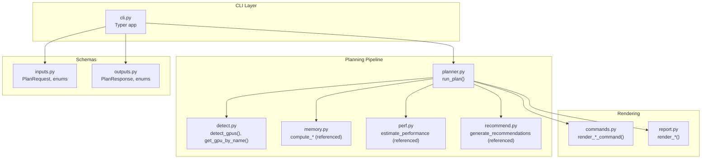
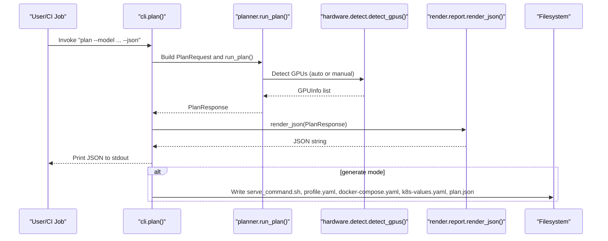
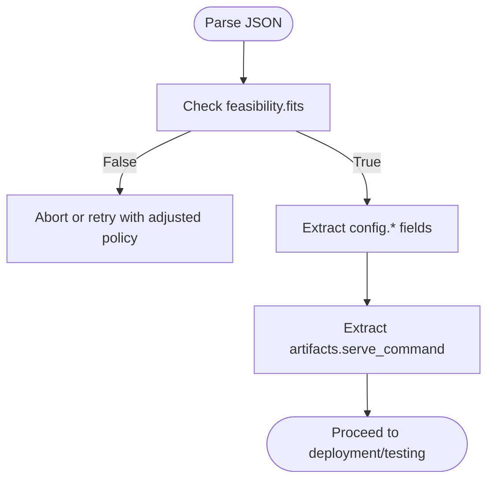
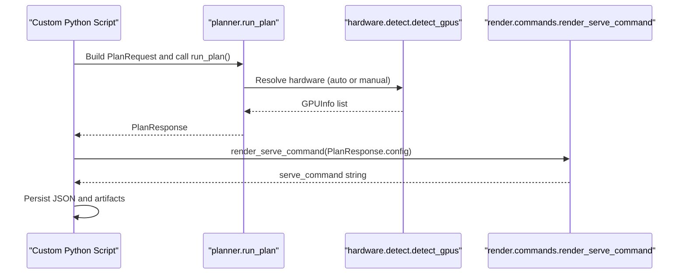
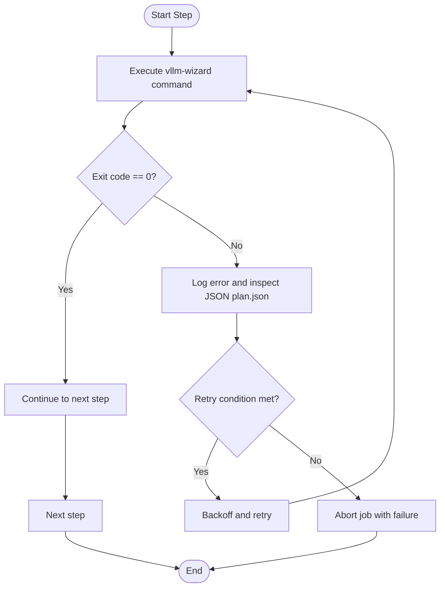
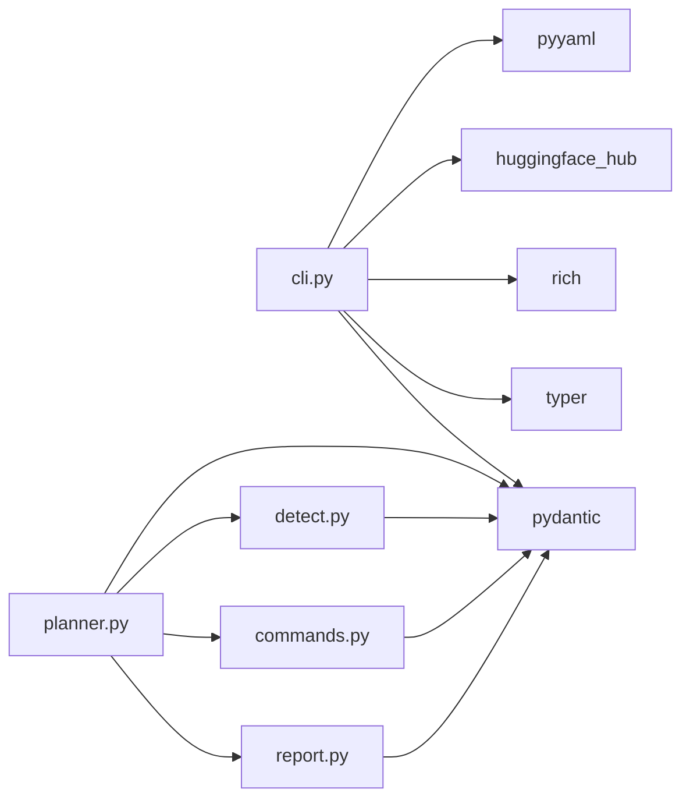

# Automation and Scripting

<cite>
**Referenced Files in This Document**
- [README.md](file://README.md)
- [cli.py](file://src/vllm_wizard/cli.py)
- [planner.py](file://src/vllm_wizard/planning/planner.py)
- [detect.py](file://src/vllm_wizard/hardware/detect.py)
- [report.py](file://src/vllm_wizard/render/report.py)
- [commands.py](file://src/vllm_wizard/render/commands.py)
- [inputs.py](file://src/vllm_wizard/schemas/inputs.py)
- [outputs.py](file://src/vllm_wizard/schemas/outputs.py)
- [pyproject.toml](file://pyproject.toml)
- [sample.yaml](file://examples/profiles/sample.yaml)
- [test_cli.py](file://tests/test_cli.py)
</cite>

## Table of Contents
1. [Introduction](#introduction)
2. [Project Structure](#project-structure)
3. [Core Components](#core-components)
4. [Architecture Overview](#architecture-overview)
5. [Detailed Component Analysis](#detailed-component-analysis)
6. [Dependency Analysis](#dependency-analysis)
7. [Performance Considerations](#performance-considerations)
8. [Troubleshooting Guide](#troubleshooting-guide)
9. [CI/CD Templates](#cicd-templates)
10. [Conclusion](#conclusion)

## Introduction
This document provides comprehensive automation and scripting guidance for integrating vLLM Wizard into CI/CD pipelines and automated workflows. It focuses on:
- JSON output usage patterns for programmatic workflows
- Parsing plan responses and extracting configuration parameters
- Command chaining techniques for batch processing multiple models and configurations
- Shell scripting examples for automated GPU detection, planning, and artifact generation
- Python integration patterns using the internal API for custom automation scripts
- Error handling strategies, retry mechanisms, and logging best practices for production environments
- Templates for Jenkins, GitHub Actions, and other CI/CD platforms

## Project Structure
The repository is organized around a CLI application with modular components for hardware detection, planning, rendering, and schema definitions. The CLI exposes three primary commands:
- detect: GPU discovery and optional JSON output
- plan: VRAM feasibility, recommendations, performance estimates, and optional JSON output
- generate: Artifact emission to disk (serve command, profile, docker-compose, k8s)



**Diagram sources**
- [cli.py](file://src/vllm_wizard/cli.py#L62-L381)
- [planner.py](file://src/vllm_wizard/planning/planner.py#L21-L172)
- [detect.py](file://src/vllm_wizard/hardware/detect.py#L10-L229)
- [commands.py](file://src/vllm_wizard/render/commands.py#L6-L196)
- [report.py](file://src/vllm_wizard/render/report.py#L14-L272)
- [inputs.py](file://src/vllm_wizard/schemas/inputs.py#L54-L110)
- [outputs.py](file://src/vllm_wizard/schemas/outputs.py#L17-L118)

**Section sources**
- [README.md](file://README.md#L1-L308)
- [cli.py](file://src/vllm_wizard/cli.py#L62-L381)
- [planner.py](file://src/vllm_wizard/planning/planner.py#L21-L172)
- [detect.py](file://src/vllm_wizard/hardware/detect.py#L10-L229)
- [commands.py](file://src/vllm_wizard/render/commands.py#L6-L196)
- [report.py](file://src/vllm_wizard/render/report.py#L14-L272)
- [inputs.py](file://src/vllm_wizard/schemas/inputs.py#L54-L110)
- [outputs.py](file://src/vllm_wizard/schemas/outputs.py#L17-L118)

## Core Components
- CLI entrypoints and routing:
  - detect: supports JSON output for automation
  - plan: supports JSON output and optional explanations
  - generate: emits artifacts to disk and also writes plan.json
- Planning pipeline:
  - run_plan orchestrates model metadata loading, hardware resolution, memory feasibility, recommendations, performance estimation, and artifact generation
- Rendering:
  - Console reports and JSON serialization for programmatic consumption
  - Command rendering for vLLM serve, docker run, docker-compose, and Kubernetes values
- Schemas:
  - Strongly typed inputs (PlanRequest) and outputs (PlanResponse) enabling robust parsing and validation

Key automation-relevant capabilities:
- JSON output for detect, plan, and generate
- Artifact emission to disk for scripted consumption
- GPU detection via nvidia-smi with fallbacks
- Programmatic configuration extraction from PlanResponse

**Section sources**
- [cli.py](file://src/vllm_wizard/cli.py#L62-L381)
- [planner.py](file://src/vllm_wizard/planning/planner.py#L21-L172)
- [report.py](file://src/vllm_wizard/render/report.py#L228-L238)
- [commands.py](file://src/vllm_wizard/render/commands.py#L6-L196)
- [inputs.py](file://src/vllm_wizard/schemas/inputs.py#L102-L110)
- [outputs.py](file://src/vllm_wizard/schemas/outputs.py#L103-L118)

## Architecture Overview
The automation-friendly architecture centers on:
- CLI commands that accept JSON output flags
- A central planning function returning a structured PlanResponse
- Renderers that produce human-readable reports and machine-readable JSON
- Artifact writers that persist plan.json alongside generated files



**Diagram sources**
- [cli.py](file://src/vllm_wizard/cli.py#L82-L213)
- [planner.py](file://src/vllm_wizard/planning/planner.py#L21-L136)
- [detect.py](file://src/vllm_wizard/hardware/detect.py#L10-L72)
- [report.py](file://src/vllm_wizard/render/report.py#L228-L238)

## Detailed Component Analysis

### JSON Output Usage Patterns
- detect --json: Outputs a JSON array of GPUInfo objects for programmatic parsing
- plan --json: Outputs a PlanResponse as JSON, suitable for downstream automation
- generate: Writes plan.json alongside other artifacts; also prints JSON when invoked with --json

Parsing guidance:
- From PlanResponse, extract:
  - feasibility.fits and feasibility.oom_risk for quick pass/fail decisions
  - config.tensor_parallel_size, config.gpu_memory_utilization, config.max_model_len, config.quantization, config.kv_cache_dtype for runtime configuration
  - artifacts.serve_command for direct execution
  - performance.decode_toks_per_s_range and performance.ttft_ms_range for performance baselines



**Diagram sources**
- [outputs.py](file://src/vllm_wizard/schemas/outputs.py#L37-L55)
- [outputs.py](file://src/vllm_wizard/schemas/outputs.py#L57-L75)
- [outputs.py](file://src/vllm_wizard/schemas/outputs.py#L94-L101)

**Section sources**
- [cli.py](file://src/vllm_wizard/cli.py#L62-L213)
- [cli.py](file://src/vllm_wizard/cli.py#L215-L381)
- [report.py](file://src/vllm_wizard/render/report.py#L228-L238)
- [outputs.py](file://src/vllm_wizard/schemas/outputs.py#L103-L118)

### Command Chaining for Batch Processing
Common chaining patterns:
- Detect GPUs once, then plan multiple models, saving plan.json for each
- Chain plan --json with generate --output-dir to produce artifacts for each configuration
- Use profiles to parameterize repeated runs

Example chaining steps:
- vllm-wizard detect --json > gpus.json
- vllm-wizard plan --model MODEL_A --json >> plans.json
- vllm-wizard plan --model MODEL_B --json >> plans.json
- vllm-wizard generate --output-dir out_a --model MODEL_A
- vllm-wizard generate --output-dir out_b --model MODEL_B

Best practices:
- Capture exit codes and handle errors per step
- Validate JSON before proceeding to generate
- Use separate output directories per model/configuration

**Section sources**
- [cli.py](file://src/vllm_wizard/cli.py#L62-L381)
- [README.md](file://README.md#L26-L88)

### Shell Scripting Examples
Automated GPU detection, planning, and artifact generation:
- GPU detection script:
  - Invoke vllm-wizard detect --json
  - Parse JSON to select appropriate hardware parameters
- Planning script:
  - Invoke vllm-wizard plan --model "$MODEL" --json
  - Validate feasibility.fits and oom_risk
- Artifact generation script:
  - Invoke vllm-wizard generate --output-dir "./out_${MODEL}" --model "$MODEL" --emit command,profile,compose

Integration tips:
- Use set -euxo pipefail for robust pipelines
- Redirect stderr appropriately for error capture
- Store plan.json for later verification and audit

**Section sources**
- [cli.py](file://src/vllm_wizard/cli.py#L62-L213)
- [cli.py](file://src/vllm_wizard/cli.py#L215-L381)
- [detect.py](file://src/vllm_wizard/hardware/detect.py#L10-L72)
- [README.md](file://README.md#L26-L88)

### Python Integration Patterns
Internal API usage:
- Import planner.run_plan and construct PlanRequest programmatically
- Use inputs.PlanRequest to define model, hardware, workload, and policy
- Parse outputs.PlanResponse to extract configuration parameters and artifacts

Recommended patterns:
- Wrap run_plan in try/except blocks to catch ValueError and other exceptions
- Serialize PlanResponse to JSON for persistence or inter-process communication
- Use render_serve_command to reconstruct commands from config



**Diagram sources**
- [planner.py](file://src/vllm_wizard/planning/planner.py#L21-L136)
- [detect.py](file://src/vllm_wizard/hardware/detect.py#L10-L72)
- [commands.py](file://src/vllm_wizard/render/commands.py#L6-L46)
- [inputs.py](file://src/vllm_wizard/schemas/inputs.py#L102-L110)
- [outputs.py](file://src/vllm_wizard/schemas/outputs.py#L103-L118)

**Section sources**
- [planner.py](file://src/vllm_wizard/planning/planner.py#L21-L136)
- [inputs.py](file://src/vllm_wizard/schemas/inputs.py#L102-L110)
- [outputs.py](file://src/vllm_wizard/schemas/outputs.py#L103-L118)
- [commands.py](file://src/vllm_wizard/render/commands.py#L6-L46)

### Error Handling Strategies, Retry Mechanisms, and Logging
- CLI error handling:
  - ValueError and FileNotFoundError are caught and printed with red color; process exits with code 1
  - Other exceptions are handled generically with a red error message and exit code 1
- Retry strategies:
  - On detect failures (no GPUs), suggest ensuring nvidia-smi availability and driver presence
  - On plan failures (no GPUs detected), recommend specifying --gpu and --vram-gb or fixing detection
- Logging best practices:
  - Log stdout for successful runs and stderr for failures
  - Capture plan.json for post-run auditing
  - Emit structured logs (JSON) when extending the Python API for observability



**Diagram sources**
- [cli.py](file://src/vllm_wizard/cli.py#L204-L212)
- [cli.py](file://src/vllm_wizard/cli.py#L372-L380)
- [detect.py](file://src/vllm_wizard/hardware/detect.py#L65-L71)

**Section sources**
- [cli.py](file://src/vllm_wizard/cli.py#L204-L212)
- [cli.py](file://src/vllm_wizard/cli.py#L372-L380)
- [detect.py](file://src/vllm_wizard/hardware/detect.py#L65-L71)

## Dependency Analysis
External dependencies and their roles:
- pydantic: Data validation and serialization for schemas
- typer: CLI framework for commands and options
- rich: Console rendering for reports
- huggingface_hub: Model metadata loading
- pyyaml: Profile serialization (when emitting profile.yaml)



**Diagram sources**
- [pyproject.toml](file://pyproject.toml#L29-L47)
- [cli.py](file://src/vllm_wizard/cli.py#L1-L34)
- [planner.py](file://src/vllm_wizard/planning/planner.py#L1-L18)
- [detect.py](file://src/vllm_wizard/hardware/detect.py#L1-L7)
- [commands.py](file://src/vllm_wizard/render/commands.py#L1-L3)
- [report.py](file://src/vllm_wizard/render/report.py#L1-L9)

**Section sources**
- [pyproject.toml](file://pyproject.toml#L29-L47)

## Performance Considerations
- Prefer JSON output for machine parsing to avoid terminal formatting overhead
- Cache plan.json locally for downstream steps to avoid recomputation
- Use --explain judiciously; it increases payload size and processing time
- For multi-GPU scenarios, ensure tensor-parallel-size aligns with actual GPU topology to avoid underutilization

## Troubleshooting Guide
Common issues and resolutions:
- No GPUs detected:
  - Ensure nvidia-smi is installed and functional
  - Verify NVIDIA drivers and CUDA versions
  - Provide explicit --gpu and --vram-gb if auto-detection fails
- VRAM feasibility fails:
  - Reduce concurrency or context length
  - Enable quantization or reduce dtype precision
  - Increase headroom or lower gpu-memory-utilization
- JSON parsing errors:
  - Validate JSON structure against PlanResponse schema
  - Inspect plan.json for detailed feasibility and warnings

**Section sources**
- [detect.py](file://src/vllm_wizard/hardware/detect.py#L10-L72)
- [cli.py](file://src/vllm_wizard/cli.py#L204-L212)
- [cli.py](file://src/vllm_wizard/cli.py#L372-L380)
- [outputs.py](file://src/vllm_wizard/schemas/outputs.py#L37-L55)

## CI/CD Templates

### GitHub Actions Template
```yaml
name: "vLLM Wizard CI"
on: [push, pull_request]

jobs:
  plan-and-artifacts:
    runs-on: ubuntu-latest
    container: nvidia/cuda:12.4.1-runtime-ubuntu22.04
    steps:
      - uses: actions/checkout@v4

      - name: Setup Python
        uses: actions/setup-python@v4
        with:
          python-version: "3.10"

      - name: Install vLLM Wizard
        run: pip install -e .

      - name: Detect GPUs
        run: vllm-wizard detect --json

      - name: Plan configuration
        run: |
          vllm-wizard plan \
            --model "$MODEL_ID" \
            --json \
            --emit command,profile,compose \
            > plan.json
        env:
          MODEL_ID: ${{ vars.MODEL_ID }}

      - name: Generate artifacts
        run: |
          vllm-wizard generate \
            --output-dir "./dist/${{ github.run_id }}_${{ github.run_number }}" \
            --model "$MODEL_ID" \
            --emit command,profile,compose
        env:
          MODEL_ID: ${{ vars.MODEL_ID }}

      - name: Upload artifacts
        uses: actions/upload-artifact@v3
        with:
          name: vllm-config-${{ github.run_id }}_${{ github.run_number }}
          path: "./dist/${{ github.run_id }}_${{ github.run_number }}/*"
```

### Jenkins Pipeline Template
```groovy
pipeline {
  agent {
    docker {
      image 'nvidia/cuda:12.4.1-runtime-ubuntu22.04'
      args '--gpus all'
    }
  }

  stages {
    stage('Install') {
      steps {
        sh 'pip install -e .'
      }
    }

    stage('Detect GPUs') {
      steps {
        sh 'vllm-wizard detect --json'
      }
    }

    stage('Plan') {
      steps {
        sh '''
          vllm-wizard plan \
            --model "${MODEL_ID}" \
            --json \
            --emit command,profile,compose \
            > plan.json
        '''
      }
      post {
        always {
          publishTestResults 'plan.json'
        }
      }
    }

    stage('Generate Artifacts') {
      steps {
        sh '''
          vllm-wizard generate \
            --output-dir "./dist/jenkins_${BUILD_NUMBER}" \
            --model "${MODEL_ID}" \
            --emit command,profile,compose
        '''
      }
    }
  }

  post {
    success {
      archiveArtifacts 'dist/**/*'
    }
  }
}
```

### GitLab CI Template
```yaml
stages:
  - detect
  - plan
  - generate

variables:
  MODEL_ID: "meta-llama/Llama-2-7b-hf"

vllm-detect:
  stage: detect
  image: nvidia/cuda:12.4.1-runtime-ubuntu22.04
  services:
    - docker:24-dind
  script:
    - pip install -e .
    - vllm-wizard detect --json

vllm-plan:
  stage: plan
  image: nvidia/cuda:12.4.1-runtime-ubuntu22.04
  services:
    - docker:24-dind
  script:
    - vllm-wizard plan \
        --model "$MODEL_ID" \
        --json \
        --emit command,profile,compose \
        > plan.json

vllm-generate:
  stage: generate
  image: nvidia/cuda:12.4.1-runtime-ubuntu22.04
  services:
    - docker:24-dind
  script:
    - vllm-wizard generate \
        --output-dir "./dist/gitlab_${CI_JOB_ID}" \
        --model "$MODEL_ID" \
        --emit command,profile,compose
  artifacts:
    paths:
      - "./dist/gitlab_${CI_JOB_ID}/*"
```

[No sources needed since this section provides platform-specific templates derived from the documented CLI behavior]

## Conclusion
vLLM Wizard offers a robust foundation for automation and scripting:
- JSON-first outputs enable seamless integration with external tools and CI/CD systems
- The planning pipeline and artifact generation support repeatable, auditable workflows
- Strong typing and schema validation simplify parsing and reduce integration errors
Adopt the patterns and templates above to build reliable, scalable automation around GPU detection, configuration planning, and artifact generation.