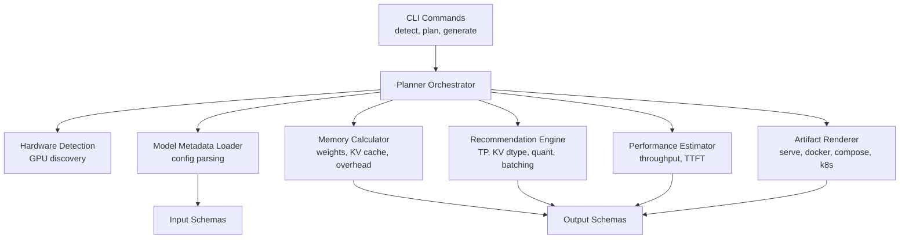
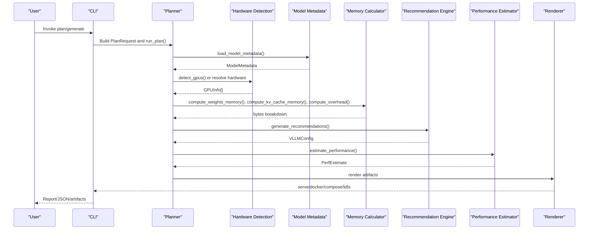
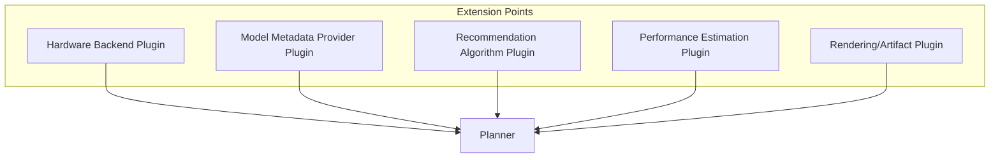
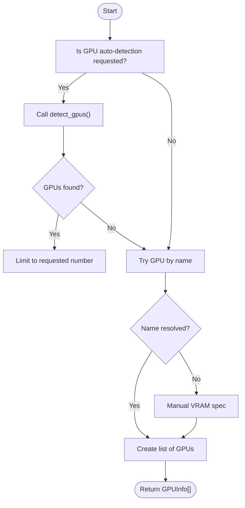
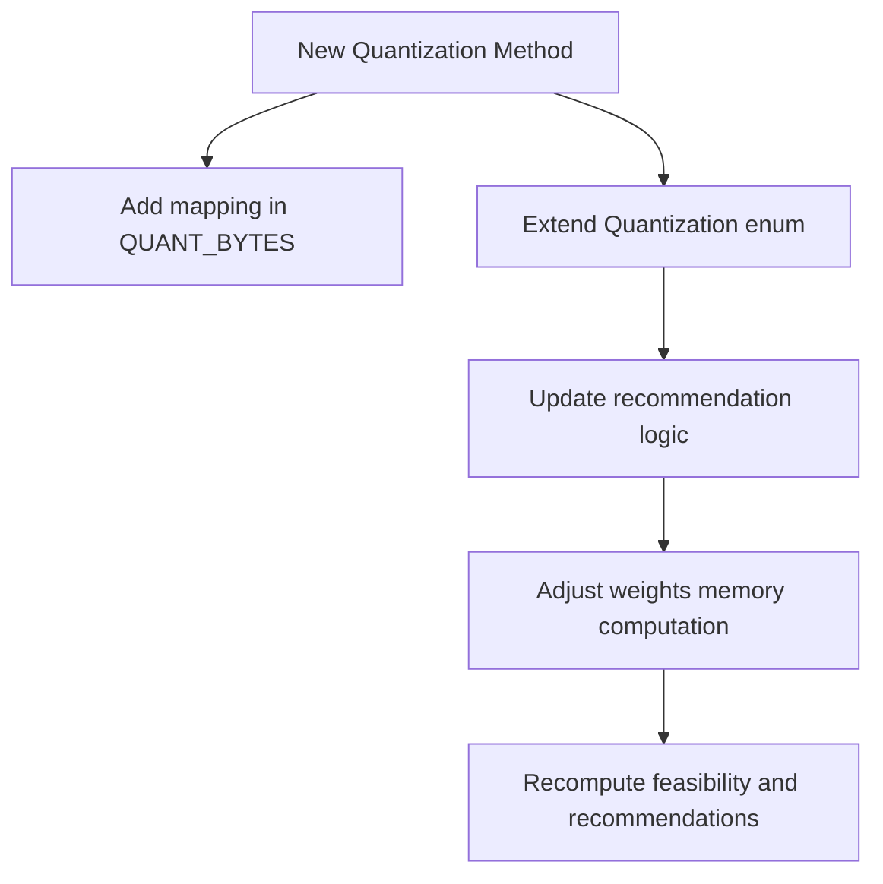
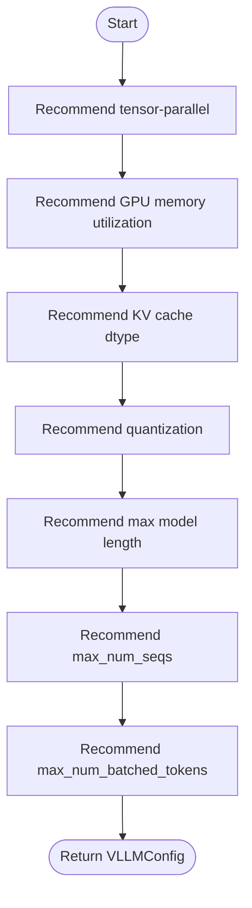
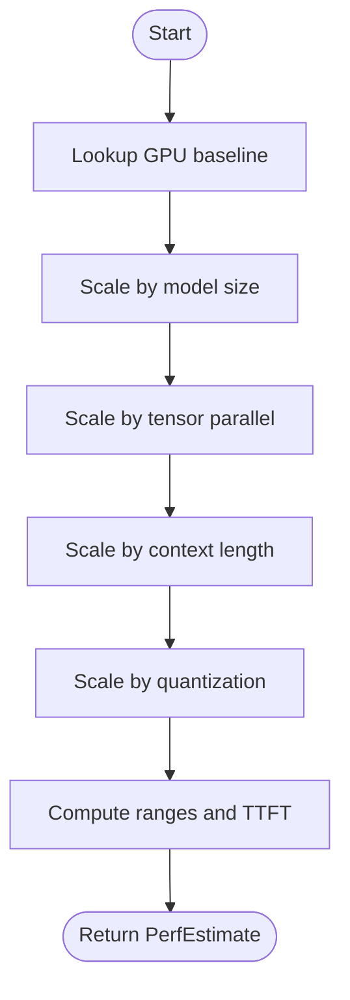
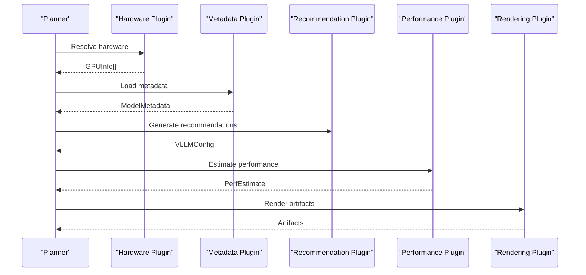
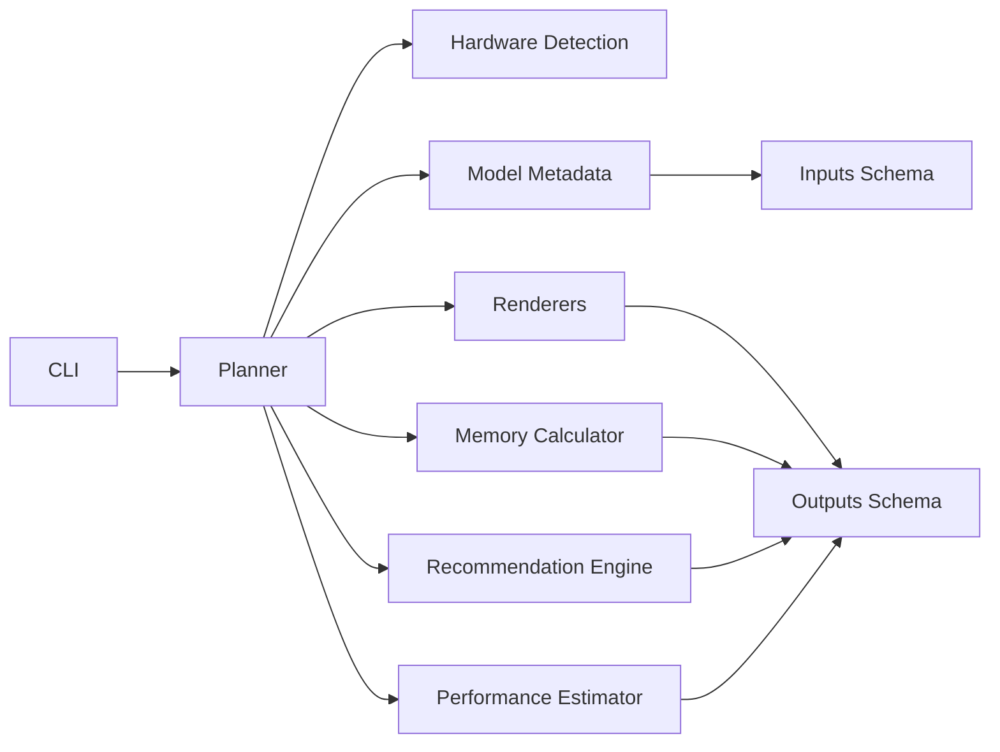

# Custom Plugins and Extensions

<cite>
**Referenced Files in This Document**
- [__init__.py](file://src/vllm_wizard/__init__.py)
- [cli.py](file://src/vllm_wizard/cli.py)
- [planner.py](file://src/vllm_wizard/planning/planner.py)
- [recommend.py](file://src/vllm_wizard/planning/recommend.py)
- [perf.py](file://src/vllm_wizard/planning/perf.py)
- [memory.py](file://src/vllm_wizard/planning/memory.py)
- [detect.py](file://src/vllm_wizard/hardware/detect.py)
- [metadata.py](file://src/vllm_wizard/models/metadata.py)
- [inputs.py](file://src/vllm_wizard/schemas/inputs.py)
- [outputs.py](file://src/vllm_wizard/schemas/outputs.py)
- [commands.py](file://src/vllm_wizard/render/commands.py)
- [report.py](file://src/vllm_wizard/render/report.py)
- [pyproject.toml](file://pyproject.toml)
- [README.md](file://README.md)
- [test_cli.py](file://tests/test_cli.py)
- [conftest.py](file://tests/conftest.py)
</cite>

## Table of Contents
1. [Introduction](#introduction)
2. [Project Structure](#project-structure)
3. [Core Components](#core-components)
4. [Architecture Overview](#architecture-overview)
5. [Detailed Component Analysis](#detailed-component-analysis)
6. [Dependency Analysis](#dependency-analysis)
7. [Performance Considerations](#performance-considerations)
8. [Troubleshooting Guide](#troubleshooting-guide)
9. [Conclusion](#conclusion)
10. [Appendices](#appendices)

## Introduction
This document explains how to develop custom plugins and extensions to extend the vLLM Wizard functionality. It focuses on the plugin architecture and extension points for:
- Custom hardware backends (GPU detection and topology)
- Model metadata providers (new model formats and quantization methods)
- Recommendation algorithms (tensor-parallel sizing, KV cache dtype, quantization, and batching)
- Performance estimation models (scaling heuristics and throughput prediction)
- Rendering and artifact generation

It also documents testing strategies, integration with the planning pipeline, and guidelines for maintaining compatibility with future versions.

## Project Structure
The project is organized around a CLI-driven planning pipeline:
- CLI entry points orchestrate planning, detection, and artifact generation
- Planning orchestrator coordinates model metadata loading, hardware resolution, memory feasibility, recommendations, and performance estimation
- Extension points exist at hardware detection, model metadata parsing, memory computation, recommendation logic, and performance estimation

**Diagram sources**
- [cli.py](file://src/vllm_wizard/cli.py#L62-L213)
- [planner.py](file://src/vllm_wizard/planning/planner.py#L21-L136)
- [detect.py](file://src/vllm_wizard/hardware/detect.py#L10-L72)
- [metadata.py](file://src/vllm_wizard/models/metadata.py#L209-L255)
- [memory.py](file://src/vllm_wizard/planning/memory.py#L31-L153)
- [recommend.py](file://src/vllm_wizard/planning/recommend.py#L167-L333)
- [perf.py](file://src/vllm_wizard/planning/perf.py#L136-L220)
- [commands.py](file://src/vllm_wizard/render/commands.py#L6-L196)
- [inputs.py](file://src/vllm_wizard/schemas/inputs.py#L54-L110)
- [outputs.py](file://src/vllm_wizard/schemas/outputs.py#L17-L118)

**Section sources**
- [cli.py](file://src/vllm_wizard/cli.py#L1-L385)
- [planner.py](file://src/vllm_wizard/planning/planner.py#L1-L172)
- [README.md](file://README.md#L1-L308)

## Core Components
- CLI: Provides commands to detect GPUs, plan configurations, and generate artifacts. It constructs PlanRequest objects and delegates to the planner.
- Planner: Central orchestrator that loads model metadata, resolves hardware, computes memory feasibility, generates recommendations, estimates performance, and renders artifacts.
- Hardware Detection: Detects GPUs via nvidia-smi and provides fallbacks by GPU name.
- Model Metadata: Loads and parses model configs, estimates parameters, and supports known model size lookups.
- Memory Calculator: Computes weights memory, KV cache memory, and overhead with configurable fragmentation and TP effects.
- Recommendation Engine: Determines tensor-parallel size, KV cache dtype, quantization, max model length, max sequences, and max batched tokens.
- Performance Estimator: Heuristic throughput and TTFT predictions based on GPU baselines, model size, TP, context, and quantization.
- Renderers: Produce vLLM serve commands, docker run/compose, and Kubernetes values.

**Section sources**
- [cli.py](file://src/vllm_wizard/cli.py#L62-L213)
- [planner.py](file://src/vllm_wizard/planning/planner.py#L21-L136)
- [detect.py](file://src/vllm_wizard/hardware/detect.py#L10-L72)
- [metadata.py](file://src/vllm_wizard/models/metadata.py#L209-L255)
- [memory.py](file://src/vllm_wizard/planning/memory.py#L31-L153)
- [recommend.py](file://src/vllm_wizard/planning/recommend.py#L167-L333)
- [perf.py](file://src/vllm_wizard/planning/perf.py#L136-L220)
- [commands.py](file://src/vllm_wizard/render/commands.py#L6-L196)

## Architecture Overview
The planning pipeline follows a clear separation of concerns:
- Input validation and construction via Pydantic models
- Hardware resolution (auto-detect or manual)
- Model metadata extraction
- Memory feasibility computation
- Recommendation generation
- Performance estimation
- Artifact rendering

**Diagram sources**
- [cli.py](file://src/vllm_wizard/cli.py#L82-L213)
- [planner.py](file://src/vllm_wizard/planning/planner.py#L21-L136)
- [detect.py](file://src/vllm_wizard/hardware/detect.py#L10-L72)
- [metadata.py](file://src/vllm_wizard/models/metadata.py#L209-L255)
- [memory.py](file://src/vllm_wizard/planning/memory.py#L31-L153)
- [recommend.py](file://src/vllm_wizard/planning/recommend.py#L167-L333)
- [perf.py](file://src/vllm_wizard/planning/perf.py#L136-L220)
- [commands.py](file://src/vllm_wizard/render/commands.py#L6-L196)

## Detailed Component Analysis

### Plugin Architecture and Extension Points
The current codebase exposes several extension points suitable for custom plugins:

- Hardware Backend Plugin Point
  - Purpose: Replace or augment GPU detection and topology resolution.
  - Current Implementation: NVIDIA-specific detection via nvidia-smi with fallback by GPU name.
  - Extension Mechanism: The planner resolves hardware via a dedicated function that can be overridden or extended to integrate new backends.

- Model Metadata Provider Plugin Point
  - Purpose: Add support for new model formats, quantization methods, or metadata sources.
  - Current Implementation: Loads config.json from local path or HuggingFace Hub; parses fields with fallbacks; supports known model size lookup and parameter estimation.
  - Extension Mechanism: The metadata loader can be extended to support additional sources or formats without changing the rest of the pipeline.

- Recommendation Algorithm Plugin Point
  - Purpose: Customize tensor-parallel sizing, KV cache dtype selection, quantization suggestions, and batching parameters.
  - Current Implementation: Rule-based recommendations with tunable thresholds and heuristics.
  - Extension Mechanism: The recommendation engine can be extended to incorporate custom policies or external tuning.

- Performance Estimation Plugin Point
  - Purpose: Integrate new performance baselines or scaling models.
  - Current Implementation: Heuristic tables and scaling functions for decode/prefill throughput and TTFT.
  - Extension Mechanism: The estimator can be extended to support new GPU families or quantization methods.

- Rendering and Artifact Generation Plugin Point
  - Purpose: Add new artifact types or customize existing ones.
  - Current Implementation: Generates vLLM serve command, docker run/compose, and Kubernetes values.
  - Extension Mechanism: Renderer functions can be extended or swapped to produce additional formats.

[No sources needed since this diagram shows conceptual extension points]

**Section sources**
- [planner.py](file://src/vllm_wizard/planning/planner.py#L138-L172)
- [detect.py](file://src/vllm_wizard/hardware/detect.py#L10-L72)
- [metadata.py](file://src/vllm_wizard/models/metadata.py#L209-L255)
- [recommend.py](file://src/vllm_wizard/planning/recommend.py#L167-L333)
- [perf.py](file://src/vllm_wizard/planning/perf.py#L136-L220)
- [commands.py](file://src/vllm_wizard/render/commands.py#L6-L196)

### Custom GPU Detection Strategies
To implement custom GPU detection for specialized or virtualized environments:
- Implement a replacement for the hardware resolution function used by the planner.
- Ensure the function returns a list of GPUInfo objects compatible with the existing schema.
- Optionally integrate with vendor SDKs or cloud APIs to discover GPUs and their attributes.

Key functions and types involved:
- Hardware resolution: [planner._resolve_hardware](file://src/vllm_wizard/planning/planner.py#L138-L172)
- GPUInfo schema: [schemas.outputs.GPUInfo](file://src/vllm_wizard/schemas/outputs.py#L17-L35)
- NVIDIA detection helpers: [hardware.detect.detect_gpus](file://src/vllm_wizard/hardware/detect.py#L10-L72), [hardware.detect.get_gpu_by_name](file://src/vllm_wizard/hardware/detect.py#L162-L229)

**Diagram sources**
- [planner.py](file://src/vllm_wizard/planning/planner.py#L138-L172)
- [detect.py](file://src/vllm_wizard/hardware/detect.py#L10-L72)
- [outputs.py](file://src/vllm_wizard/schemas/outputs.py#L17-L35)

**Section sources**
- [planner.py](file://src/vllm_wizard/planning/planner.py#L138-L172)
- [detect.py](file://src/vllm_wizard/hardware/detect.py#L10-L72)
- [outputs.py](file://src/vllm_wizard/schemas/outputs.py#L17-L35)

### Adding Support for New Model Formats and Quantization Methods
To add support for new model formats and quantization methods:
- Extend the metadata loader to recognize new fields or sources.
- Add quantization entries to the quantization byte mapping and recommendation logic.
- Update the recommendation engine to handle new quantization methods when deciding whether to recommend quantization.

Key locations:
- Model metadata loader: [models.metadata.load_model_metadata](file://src/vllm_wizard/models/metadata.py#L209-L255)
- Quantization byte mapping: [planning.memory.QUANT_BYTES](file://src/vllm_wizard/planning/memory.py#L18-L25)
- Quantization recommendation: [planning.recommend._recommend_quantization](file://src/vllm_wizard/planning/recommend.py#L88-L99)
- Quantization enum: [schemas.inputs.Quantization](file://src/vllm_wizard/schemas/inputs.py#L18-L26)

**Diagram sources**
- [memory.py](file://src/vllm_wizard/planning/memory.py#L18-L25)
- [recommend.py](file://src/vllm_wizard/planning/recommend.py#L88-L99)
- [inputs.py](file://src/vllm_wizard/schemas/inputs.py#L18-L26)
- [metadata.py](file://src/vllm_wizard/models/metadata.py#L209-L255)

**Section sources**
- [metadata.py](file://src/vllm_wizard/models/metadata.py#L209-L255)
- [memory.py](file://src/vllm_wizard/planning/memory.py#L18-L25)
- [recommend.py](file://src/vllm_wizard/planning/recommend.py#L88-L99)
- [inputs.py](file://src/vllm_wizard/schemas/inputs.py#L18-L26)

### Extending Recommendation Algorithms
To customize recommendation algorithms:
- Modify the recommendation engine to incorporate domain-specific rules or external tuning.
- Add new recommendation functions or modify existing ones to reflect new policies.
- Ensure the planner integrates the new recommendations seamlessly.

Key locations:
- Recommendation engine: [planning.recommend.generate_recommendations](file://src/vllm_wizard/planning/recommend.py#L167-L333)
- Individual recommendation helpers: [_recommend_tensor_parallel](file://src/vllm_wizard/planning/recommend.py#L42-L68), [_recommend_quantization](file://src/vllm_wizard/planning/recommend.py#L88-L99), [_recommend_kv_cache_dtype](file://src/vllm_wizard/planning/recommend.py#L102-L122), [_recommend_max_model_len](file://src/vllm_wizard/planning/recommend.py#L70-L86), [_recommend_max_num_seqs](file://src/vllm_wizard/planning/recommend.py#L124-L137), [_recommend_max_batched_tokens](file://src/vllm_wizard/planning/recommend.py#L139-L165)

**Diagram sources**
- [recommend.py](file://src/vllm_wizard/planning/recommend.py#L167-L333)

**Section sources**
- [recommend.py](file://src/vllm_wizard/planning/recommend.py#L167-L333)

### Extending Performance Estimation Models
To integrate new performance baselines or scaling models:
- Add or update GPU baseline tables for new GPUs.
- Extend scaling functions for model size, TP, context, and quantization.
- Ensure the estimator remains backward compatible and clearly marks estimates as heuristic.

Key locations:
- Performance estimator: [planning.perf.estimate_performance](file://src/vllm_wizard/planning/perf.py#L136-L220)
- Baseline tables: [GPU_BASELINE_DECODE_TPS](file://src/vllm_wizard/planning/perf.py#L10-L36), [GPU_BASELINE_PREFILL_TPS](file://src/vllm_wizard/planning/perf.py#L38-L49)
- Scaling helpers: [_scale_by_model_size](file://src/vllm_wizard/planning/perf.py#L70-L81), [_scale_by_tensor_parallel](file://src/vllm_wizard/planning/perf.py#L83-L105), [_scale_by_context](file://src/vllm_wizard/planning/perf.py#L107-L118), [_scale_by_quantization](file://src/vllm_wizard/planning/perf.py#L120-L134)

**Diagram sources**
- [perf.py](file://src/vllm_wizard/planning/perf.py#L136-L220)

**Section sources**
- [perf.py](file://src/vllm_wizard/planning/perf.py#L136-L220)

### Rendering and Artifact Generation Extensions
To add new artifact types or customize existing ones:
- Extend renderer functions to produce additional formats.
- Ensure the planner invokes the new renderers and includes outputs in the PlanResponse.

Key locations:
- Renderer functions: [render.commands.render_serve_command](file://src/vllm_wizard/render/commands.py#L6-L46), [render.commands.render_docker_command](file://src/vllm_wizard/render/commands.py#L48-L73), [render.commands.render_docker_compose](file://src/vllm_wizard/render/commands.py#L75-L114), [render.commands.render_k8s_values](file://src/vllm_wizard/render/commands.py#L116-L155)
- PlanResponse schema: [schemas.outputs.PlanResponse](file://src/vllm_wizard/schemas/outputs.py#L103-L118)

**Section sources**
- [commands.py](file://src/vllm_wizard/render/commands.py#L6-L196)
- [outputs.py](file://src/vllm_wizard/schemas/outputs.py#L103-L118)

### Integration with the Planning Pipeline
Plugins integrate at the planner level:
- Hardware plugins replace or augment the hardware resolution function.
- Metadata plugins extend the model metadata loader.
- Recommendation plugins modify the recommendation engine.
- Performance plugins update the performance estimator.
- Rendering plugins add or change artifact generation.

[No sources needed since this diagram shows conceptual integration]

**Section sources**
- [planner.py](file://src/vllm_wizard/planning/planner.py#L21-L136)

## Dependency Analysis
The system exhibits layered dependencies:
- CLI depends on planner and render modules
- Planner depends on hardware detection, metadata, memory calculator, recommendation engine, and performance estimator
- Renderers depend on output schemas
- Schemas define contracts for inputs and outputs

**Diagram sources**
- [cli.py](file://src/vllm_wizard/cli.py#L11-L22)
- [planner.py](file://src/vllm_wizard/planning/planner.py#L5-L18)
- [detect.py](file://src/vllm_wizard/hardware/detect.py#L7-L8)
- [metadata.py](file://src/vllm_wizard/models/metadata.py#L3-L9)
- [memory.py](file://src/vllm_wizard/planning/memory.py#L5-L7)
- [recommend.py](file://src/vllm_wizard/planning/recommend.py#L5-L23)
- [perf.py](file://src/vllm_wizard/planning/perf.py#L5-L6)
- [commands.py](file://src/vllm_wizard/render/commands.py#L3)
- [inputs.py](file://src/vllm_wizard/schemas/inputs.py#L6)
- [outputs.py](file://src/vllm_wizard/schemas/outputs.py#L6)

**Section sources**
- [cli.py](file://src/vllm_wizard/cli.py#L11-L22)
- [planner.py](file://src/vllm_wizard/planning/planner.py#L5-L18)

## Performance Considerations
- GPU detection relies on external tools; failures or timeouts return empty lists or defaults. Ensure robust fallbacks and error handling in custom hardware plugins.
- Memory computations use fixed byte-per-parameter mappings and fragmentation factors. Tune these for accuracy with new quantization methods.
- Recommendation thresholds (e.g., KV cache pressure, consumer vs. datacenter GPU utilization) should be validated against real-world usage.
- Performance estimations are heuristic and depend on baseline tables and scaling functions. Keep these tables updated with new GPU generations and quantization methods.

[No sources needed since this section provides general guidance]

## Troubleshooting Guide
Common issues and resolutions:
- No GPUs detected
  - Ensure nvidia-smi is installed and accessible.
  - Verify GPU drivers and CUDA versions.
  - Use manual hardware specification when auto-detection fails.
  - References: [hardware.detect.detect_gpus](file://src/vllm_wizard/hardware/detect.py#L10-L72), [planner._resolve_hardware](file://src/vllm_wizard/planning/planner.py#L138-L172)

- Model metadata errors
  - Missing required fields in config.json cause parsing errors.
  - Use known model size lookup or parameter override when appropriate.
  - References: [models.metadata.load_model_metadata](file://src/vllm_wizard/models/metadata.py#L209-L255)

- VRAM feasibility warnings
  - High OOM risk indicates insufficient headroom; consider quantization or reduced context.
  - References: [planning.memory.compute_feasibility](file://src/vllm_wizard/planning/memory.py#L155-L271)

- Performance estimation caveats
  - Estimates are heuristic; validate with benchmarks on target hardware.
  - References: [planning.perf.estimate_performance](file://src/vllm_wizard/planning/perf.py#L136-L220)

**Section sources**
- [detect.py](file://src/vllm_wizard/hardware/detect.py#L10-L72)
- [planner.py](file://src/vllm_wizard/planning/planner.py#L138-L172)
- [metadata.py](file://src/vllm_wizard/models/metadata.py#L209-L255)
- [memory.py](file://src/vllm_wizard/planning/memory.py#L155-L271)
- [perf.py](file://src/vllm_wizard/planning/perf.py#L136-L220)

## Conclusion
The vLLM Wizard provides a modular architecture suitable for extending hardware backends, model metadata providers, recommendation algorithms, performance estimation models, and artifact generation. By leveraging the existing extension points and maintaining compatibility with the schema contracts, developers can introduce custom plugins that integrate seamlessly into the planning pipeline while preserving reliability and testability.

[No sources needed since this section summarizes without analyzing specific files]

## Appendices

### Testing Strategies for Custom Plugins
- Unit tests for individual components
  - Mock external dependencies (e.g., nvidia-smi, HuggingFace Hub) to isolate logic.
  - Example patterns: [tests.test_cli](file://tests/test_cli.py#L16-L50), [tests.test_cli](file://tests/test_cli.py#L52-L133), [tests.test_cli](file://tests/test_cli.py#L135-L182)

- Integration tests for the planner
  - Validate end-to-end flows with mocked hardware and metadata.
  - Example patterns: [tests.test_cli](file://tests/test_cli.py#L55-L118), [tests.test_cli](file://tests/test_cli.py#L138-L182)

- Fixtures for model configs
  - Use fixtures to provide representative model configurations for testing.
  - Example fixtures: [tests.conftest](file://tests/conftest.py#L11-L126)

- CLI command tests
  - Verify JSON/console outputs and error handling.
  - Example patterns: [tests.test_cli](file://tests/test_cli.py#L184-L192)

**Section sources**
- [test_cli.py](file://tests/test_cli.py#L16-L192)
- [conftest.py](file://tests/conftest.py#L11-L126)

### Maintaining Compatibility and Contributing Back
- Keep schema contracts intact
  - Respect Pydantic models and enums for inputs and outputs.
  - References: [schemas.inputs](file://src/vllm_wizard/schemas/inputs.py#L9-L110), [schemas.outputs](file://src/vllm_wizard/schemas/outputs.py#L17-L118)

- Follow semantic versioning and release conventions
  - References: [pyproject.toml](file://pyproject.toml#L5-L27), [__init__.py](file://src/vllm_wizard/__init__.py#L1-L4)

- Document changes and rationale
  - Update README and inline comments to reflect new extension points and usage.
  - References: [README.md](file://README.md#L1-L308)

**Section sources**
- [inputs.py](file://src/vllm_wizard/schemas/inputs.py#L9-L110)
- [outputs.py](file://src/vllm_wizard/schemas/outputs.py#L17-L118)
- [pyproject.toml](file://pyproject.toml#L5-L27)
- [__init__.py](file://src/vllm_wizard/__init__.py#L1-L4)
- [README.md](file://README.md#L1-L308)