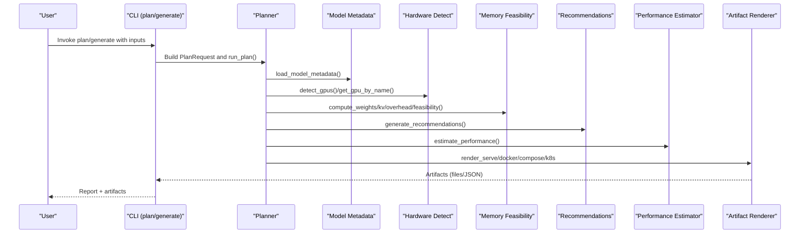
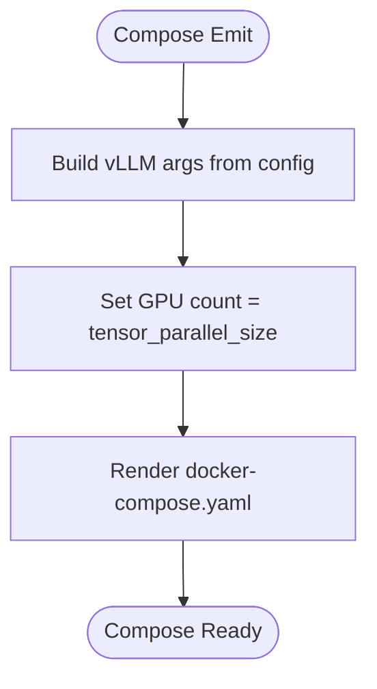
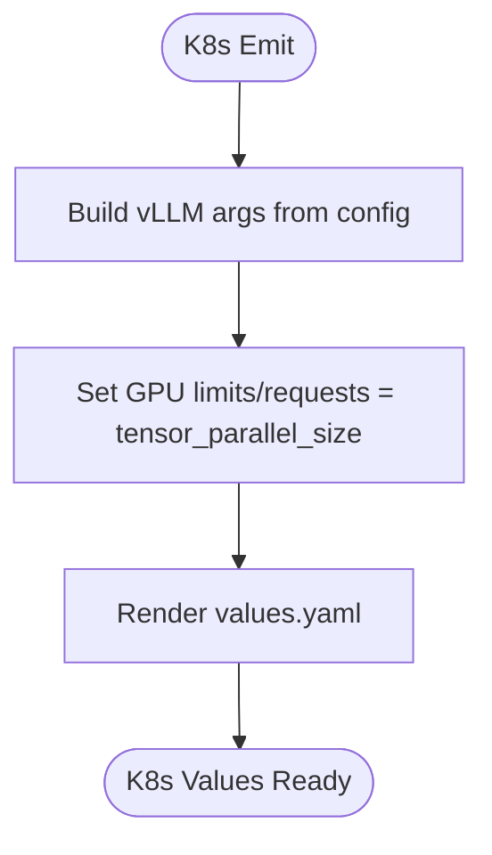
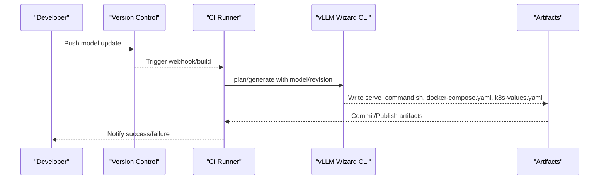
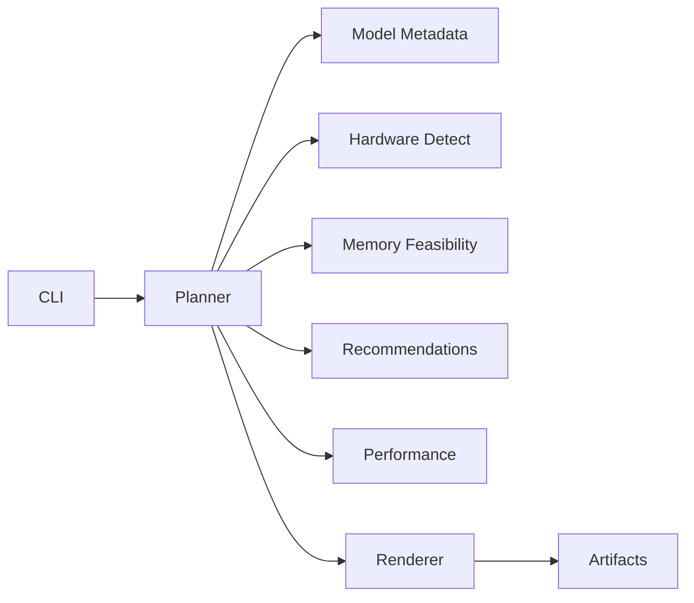

# Integration Patterns

<cite>
**Referenced Files in This Document**
- [README.md](file://README.md)
- [pyproject.toml](file://pyproject.toml)
- [requirements.txt](file://requirements.txt)
- [src/vllm_wizard/cli.py](file://src/vllm_wizard/cli.py)
- [src/vllm_wizard/planning/planner.py](file://src/vllm_wizard/planning/planner.py)
- [src/vllm_wizard/render/commands.py](file://src/vllm_wizard/render/commands.py)
- [src/vllm_wizard/render/profile.py](file://src/vllm_wizard/render/profile.py)
- [src/vllm_wizard/schemas/inputs.py](file://src/vllm_wizard/schemas/inputs.py)
- [src/vllm_wizard/schemas/outputs.py](file://src/vllm_wizard/schemas/outputs.py)
- [src/vllm_wizard/hardware/detect.py](file://src/vllm_wizard/hardware/detect.py)
- [src/vllm_wizard/models/metadata.py](file://src/vllm_wizard/models/metadata.py)
- [src/vllm_wizard/planning/memory.py](file://src/vllm_wizard/planning/memory.py)
- [src/vllm_wizard/planning/recommend.py](file://src/vllm_wizard/planning/recommend.py)
- [src/vllm_wizard/planning/perf.py](file://src/vllm_wizard/planning/perf.py)
- [examples/profiles/sample.yaml](file://examples/profiles/sample.yaml)
</cite>

## Table of Contents
1. [Introduction](#introduction)
2. [Project Structure](#project-structure)
3. [Core Components](#core-components)
4. [Architecture Overview](#architecture-overview)
5. [Detailed Component Analysis](#detailed-component-analysis)
6. [Dependency Analysis](#dependency-analysis)
7. [Performance Considerations](#performance-considerations)
8. [Troubleshooting Guide](#troubleshooting-guide)
9. [Conclusion](#conclusion)
10. [Appendices](#appendices)

## Introduction
This document describes integration patterns for connecting vLLM Wizard with deployment pipelines, infrastructure provisioning tools, and monitoring systems. It explains how to integrate with Docker Compose, Kubernetes, and cloud platforms, and how to automate GPU provisioning with infrastructure-as-code tools such as Terraform and Ansible. It also covers monitoring integration patterns with Prometheus, Grafana, and custom observability solutions, along with examples of integrating with model serving platforms, API gateways, and load balancers. Finally, it documents webhook patterns for triggering re-planning when model parameters change and provides integration templates for popular DevOps tools and platform-specific deployment scenarios.

## Project Structure
The repository is organized around a CLI-driven workflow that plans configurations, renders artifacts, and supports profiles for reproducible deployments. The CLI orchestrates the planning pipeline, which loads model metadata, detects hardware, computes VRAM feasibility, recommends optimal settings, estimates performance, and renders artifacts for Docker Compose, Kubernetes, and shell commands.

```mermaid
graph TB
subgraph "CLI"
CLI["src/vllm_wizard/cli.py"]
end
subgraph "Planning Pipeline"
PLAN["src/vllm_wizard/planning/planner.py"]
MEM["src/vllm_wizard/planning/memory.py"]
REC["src/vllm_wizard/planning/recommend.py"]
PERF["src/vllm_wizard/planning/perf.py"]
end
subgraph "Hardware"
DETECT["src/vllm_wizard/hardware/detect.py"]
end
subgraph "Models"
META["src/vllm_wizard/models/metadata.py"]
end
subgraph "Rendering"
CMDS["src/vllm_wizard/render/commands.py"]
PROF["src/vllm_wizard/render/profile.py"]
end
subgraph "Schemas"
INP["src/vllm_wizard/schemas/inputs.py"]
OUT["src/vllm_wizard/schemas/outputs.py"]
end
CLI --> PLAN
PLAN --> META
PLAN --> DETECT
PLAN --> MEM
PLAN --> REC
PLAN --> PERF
PLAN --> CMDS
PLAN --> PROF
CLI --> INP
CLI --> OUT
```

**Diagram sources**
- [src/vllm_wizard/cli.py](file://src/vllm_wizard/cli.py#L1-L385)
- [src/vllm_wizard/planning/planner.py](file://src/vllm_wizard/planning/planner.py#L1-L172)
- [src/vllm_wizard/planning/memory.py](file://src/vllm_wizard/planning/memory.py#L1-L367)
- [src/vllm_wizard/planning/recommend.py](file://src/vllm_wizard/planning/recommend.py#L1-L333)
- [src/vllm_wizard/planning/perf.py](file://src/vllm_wizard/planning/perf.py#L1-L220)
- [src/vllm_wizard/hardware/detect.py](file://src/vllm_wizard/hardware/detect.py#L1-L229)
- [src/vllm_wizard/models/metadata.py](file://src/vllm_wizard/models/metadata.py#L1-L255)
- [src/vllm_wizard/render/commands.py](file://src/vllm_wizard/render/commands.py#L1-L196)
- [src/vllm_wizard/render/profile.py](file://src/vllm_wizard/render/profile.py#L1-L173)
- [src/vllm_wizard/schemas/inputs.py](file://src/vllm_wizard/schemas/inputs.py#L1-L110)
- [src/vllm_wizard/schemas/outputs.py](file://src/vllm_wizard/schemas/outputs.py#L1-L118)

**Section sources**
- [README.md](file://README.md#L1-L308)
- [pyproject.toml](file://pyproject.toml#L1-L71)
- [requirements.txt](file://requirements.txt#L1-L505)

## Core Components
- CLI entrypoints for planning, generating artifacts, and detecting GPUs.
- Planning pipeline that computes VRAM feasibility, generates recommendations, and estimates performance.
- Rendering subsystem that produces vLLM serve commands, Docker Compose, Kubernetes values, and profiles.
- Hardware detection and metadata extraction for model sizing and performance heuristics.
- Schemas for typed inputs, outputs, and profiles.

Key integration touchpoints:
- Artifact generation for Docker Compose and Kubernetes.
- Profile-based reusability for CI/CD pipelines.
- JSON output for scripting and automation.

**Section sources**
- [src/vllm_wizard/cli.py](file://src/vllm_wizard/cli.py#L62-L381)
- [src/vllm_wizard/planning/planner.py](file://src/vllm_wizard/planning/planner.py#L21-L135)
- [src/vllm_wizard/render/commands.py](file://src/vllm_wizard/render/commands.py#L6-L155)
- [src/vllm_wizard/render/profile.py](file://src/vllm_wizard/render/profile.py#L30-L173)
- [src/vllm_wizard/schemas/inputs.py](file://src/vllm_wizard/schemas/inputs.py#L54-L110)
- [src/vllm_wizard/schemas/outputs.py](file://src/vllm_wizard/schemas/outputs.py#L57-L118)

## Architecture Overview
The CLI orchestrates the planning pipeline. The planner coordinates model metadata loading, hardware resolution, memory feasibility computation, recommendation generation, and performance estimation. Rendering converts the recommended configuration into artifacts for containerization and orchestration.



**Diagram sources**
- [src/vllm_wizard/cli.py](file://src/vllm_wizard/cli.py#L82-L381)
- [src/vllm_wizard/planning/planner.py](file://src/vllm_wizard/planning/planner.py#L21-L135)
- [src/vllm_wizard/models/metadata.py](file://src/vllm_wizard/models/metadata.py#L209-L255)
- [src/vllm_wizard/hardware/detect.py](file://src/vllm_wizard/hardware/detect.py#L10-L229)
- [src/vllm_wizard/planning/memory.py](file://src/vllm_wizard/planning/memory.py#L31-L271)
- [src/vllm_wizard/planning/recommend.py](file://src/vllm_wizard/planning/recommend.py#L167-L333)
- [src/vllm_wizard/planning/perf.py](file://src/vllm_wizard/planning/perf.py#L136-L220)
- [src/vllm_wizard/render/commands.py](file://src/vllm_wizard/render/commands.py#L6-L155)

## Detailed Component Analysis

### CLI Orchestration and Integration Hooks
- plan: Accepts model, hardware, workload, and policy inputs; outputs human-readable reports or JSON.
- generate: Emits artifacts to disk (serve command, profile, docker-compose, k8s values) and writes plan.json.
- detect: Lists GPUs via nvidia-smi for local or CI checks.

Integration patterns:
- Use --json for CI/CD scripts to parse outputs programmatically.
- Use --emit to select artifacts (e.g., compose, k8s) for containerized or orchestrated deployments.
- Use --profile to load/save reproducible configurations across environments.

**Section sources**
- [src/vllm_wizard/cli.py](file://src/vllm_wizard/cli.py#L62-L381)
- [README.md](file://README.md#L90-L159)

### Artifact Rendering for Containerization and Orchestration
- vLLM serve command: Renders a complete command string with recommended flags.
- Docker run command: Builds a docker run invocation suitable for local testing.
- docker-compose.yaml: Produces a service definition with GPU reservations, port mapping, and Hugging Face cache mounting.
- Kubernetes values.yaml: Generates a minimal values snippet for Helm charts, including resource requests/limits and node selectors.

Integration patterns:
- Use docker-compose for local development and staging.
- Use Kubernetes values for production deployments via Helm or Argo Rollouts.
- Mount HUGGING_FACE_HUB_TOKEN via environment variables for private models.

**Section sources**
- [src/vllm_wizard/render/commands.py](file://src/vllm_wizard/render/commands.py#L6-L155)
- [README.md](file://README.md#L64-L88)

### Profile-Based Reuse Across Pipelines
- Profiles encapsulate model, hardware, workload, and policy settings.
- Profiles can be loaded with --profile and regenerated into artifacts.
- The outputs section records emitted artifacts and optional passthrough vLLM args.

Integration patterns:
- Store profiles in version control alongside CI/CD manifests.
- Use profiles to enforce environment parity across dev/stage/prod.
- Combine profiles with templating tools (e.g., Jinja2) for environment-specific overrides.

**Section sources**
- [src/vllm_wizard/render/profile.py](file://src/vllm_wizard/render/profile.py#L30-L173)
- [examples/profiles/sample.yaml](file://examples/profiles/sample.yaml#L1-L40)
- [README.md](file://README.md#L215-L240)

### Hardware Detection and Cloud Provisioning Integration
- detect_gpus queries nvidia-smi to discover GPUs and versions.
- recommend_tensor_parallel selects TP size based on detected GPU count.
- get_gpu_by_name provides approximate VRAM for known GPU names when detection is unavailable.

Integration patterns:
- Use detect in CI to validate GPU availability before running generate.
- Use known GPU names to provision matching instances in cloud/IaC tools.
- Combine with Terraform/AWS EC2/GCP/Azure VMs that expose nvidia-smi-compatible drivers.

**Section sources**
- [src/vllm_wizard/hardware/detect.py](file://src/vllm_wizard/hardware/detect.py#L10-L229)
- [README.md](file://README.md#L28-L38)

### Monitoring Integration Patterns
- vLLM exposes OpenAI-compatible endpoints; integrate with Prometheus via exporters or sidecars.
- Use Grafana dashboards to visualize throughput, latency, and GPU memory utilization.
- For custom observability, export logs and metrics to centralized systems (e.g., Loki + Prom + Tempo).

Recommended integration points:
- Prometheus scrape targets for the vLLM service endpoint.
- Sidecar or init-container to collect nvidia-smi metrics for GPU utilization.
- Structured logging for request traces and error rates.

[No sources needed since this section provides general guidance]

### Infrastructure-as-Code Integration Templates

#### Docker Compose Template
- Service image: vllm/vllm-openai:latest
- Ports: 8000:8000
- Volumes: Hugging Face cache mounted from host
- Environment: HUGGING_FACE_HUB_TOKEN
- IPC: host
- GPU reservation: deploy.resources.reservations.devices with driver=nvidia and count equal to tensor_parallel_size



**Diagram sources**
- [src/vllm_wizard/render/commands.py](file://src/vllm_wizard/render/commands.py#L75-L114)

**Section sources**
- [src/vllm_wizard/render/commands.py](file://src/vllm_wizard/render/commands.py#L75-L114)

#### Kubernetes Values Template
- Image repository/tag/pullPolicy
- args: list of vLLM serve flags
- resources: limits and requests for nvidia.com/gpu
- service: ClusterIP on port 8000
- nodeSelector: nvidia.com/gpu.present=true



**Diagram sources**
- [src/vllm_wizard/render/commands.py](file://src/vllm_wizard/render/commands.py#L116-L155)

**Section sources**
- [src/vllm_wizard/render/commands.py](file://src/vllm_wizard/render/commands.py#L116-L155)

#### Terraform Integration Notes
- Provision GPU-enabled instances (AWS EC2 G/M instances, GCP A2, Azure NC/ND series).
- Install NVIDIA drivers and container runtime compatible with nvidia-smi.
- Use the CLI to detect GPUs post-provisioning and generate artifacts.

[No sources needed since this section provides general guidance]

#### Ansible Integration Notes
- Run the CLI on target hosts to validate GPU detection and generate artifacts.
- Use roles to manage Hugging Face cache mounts and environment variables.

[No sources needed since this section provides general guidance]

### Platform-Specific Deployment Scenarios

#### AWS
- Use EC2 P4de/P4d or G5 instances for A100/H100 GPUs.
- Configure IAM roles and security groups for inbound traffic to port 8000.
- Use EBS volumes for persistent Hugging Face cache.

[No sources needed since this section provides general guidance]

#### GCP
- Use A2 or G2 machine types with NVIDIA Tesla T4/A100 accelerators.
- Enable GPU drivers and configure firewall rules.

[No sources needed since this section provides general guidance]

#### Azure
- Use NC/ND series VMs with supported NVIDIA drivers.
- Secure endpoints with NSGs and managed identities.

[No sources needed since this section provides general guidance]

### Model Serving Platforms, API Gateways, and Load Balancers
- vLLM serves OpenAI-compatible endpoints; integrate behind API gateways (e.g., Kong, NGINX, AWS API Gateway) for rate limiting and auth.
- Use load balancers (e.g., NLB, ALB, GCLB, Azure LB) to distribute traffic across replica pods.
- For blue/green or canary deployments, coordinate with rollout tools (Argo, Flux) and health probes.

[No sources needed since this section provides general guidance]

### Webhook Patterns for Re-planning on Parameter Changes
Trigger re-planning when model parameters change:
- Git hooks: On push to model registry, trigger a CI job to regenerate artifacts using the new model ID and revision.
- GitHub Actions: On release/tag, run vllm-wizard generate with --emit compose,k8s and commit artifacts.
- Webhooks: On model update events, call a CI endpoint that executes the CLI and publishes artifacts.



**Diagram sources**
- [src/vllm_wizard/cli.py](file://src/vllm_wizard/cli.py#L215-L381)
- [src/vllm_wizard/render/commands.py](file://src/vllm_wizard/render/commands.py#L6-L155)

## Dependency Analysis
The CLI depends on the planning pipeline, which in turn depends on model metadata, hardware detection, memory feasibility, recommendations, and performance estimation. Rendering depends on the recommended configuration to produce artifacts.



**Diagram sources**
- [src/vllm_wizard/cli.py](file://src/vllm_wizard/cli.py#L1-L385)
- [src/vllm_wizard/planning/planner.py](file://src/vllm_wizard/planning/planner.py#L1-L172)
- [src/vllm_wizard/render/commands.py](file://src/vllm_wizard/render/commands.py#L1-L196)

**Section sources**
- [src/vllm_wizard/schemas/inputs.py](file://src/vllm_wizard/schemas/inputs.py#L54-L110)
- [src/vllm_wizard/schemas/outputs.py](file://src/vllm_wizard/schemas/outputs.py#L103-L118)

## Performance Considerations
- VRAM feasibility is computed using weights memory, KV cache memory, and overhead; ensure gpu_memory_utilization and fragmentation_factor are tuned for your workload.
- Performance estimates are heuristic and depend on GPU class, model size, tensor parallel size, interconnect type, and quantization.
- For production, validate estimates with benchmarks and adjust concurrency and batching modes accordingly.

[No sources needed since this section provides general guidance]

## Troubleshooting Guide
Common issues and resolutions:
- No GPUs detected: Ensure nvidia-smi is installed and accessible; provide --vram-gb and --gpus if auto-detection is not available.
- Configuration does not fit in VRAM: Reduce max_model_len, increase headroom_gb, enable quantization, or lower gpu_memory_utilization.
- High OOM risk: Use FP8 KV cache (where supported), reduce concurrency, or shorten context length.
- JSON output for scripting: Use --json to parse outputs in CI/CD pipelines.

**Section sources**
- [src/vllm_wizard/hardware/detect.py](file://src/vllm_wizard/hardware/detect.py#L10-L72)
- [src/vllm_wizard/planning/memory.py](file://src/vllm_wizard/planning/memory.py#L155-L271)
- [README.md](file://README.md#L171-L191)

## Conclusion
vLLM Wizard provides a robust foundation for automated model serving configuration across diverse environments. By leveraging profiles, JSON outputs, and rendered artifacts, teams can integrate seamlessly with Docker Compose, Kubernetes, cloud platforms, and infrastructure-as-code tools. The included performance heuristics and VRAM feasibility analysis help teams plan and validate configurations before deployment, while webhook-driven re-planning ensures that updates to model parameters propagate consistently across environments.

[No sources needed since this section summarizes without analyzing specific files]

## Appendices

### Appendix A: CLI Command Reference
- vllm-wizard detect: Detect GPUs and print details (JSON supported).
- vllm-wizard plan: Compute feasibility, recommendations, and performance (JSON and explain supported).
- vllm-wizard generate: Emit artifacts to disk (serve command, profile, docker-compose, k8s values).

**Section sources**
- [README.md](file://README.md#L90-L159)
- [src/vllm_wizard/cli.py](file://src/vllm_wizard/cli.py#L62-L381)

### Appendix B: Profile Schema Highlights
- model: id, revision, dtype, quantization, kv_cache_dtype, max_model_len, params_b
- hardware: gpu_name, gpus, vram_gb, interconnect, tp_size
- workload: prompt_tokens, gen_tokens, concurrency, streaming, mode
- policy: gpu_memory_utilization, overhead_gb, fragmentation_factor, headroom_gb
- outputs: emit list and optional passthrough vllm_args

**Section sources**
- [examples/profiles/sample.yaml](file://examples/profiles/sample.yaml#L4-L40)
- [src/vllm_wizard/render/profile.py](file://src/vllm_wizard/render/profile.py#L118-L173)