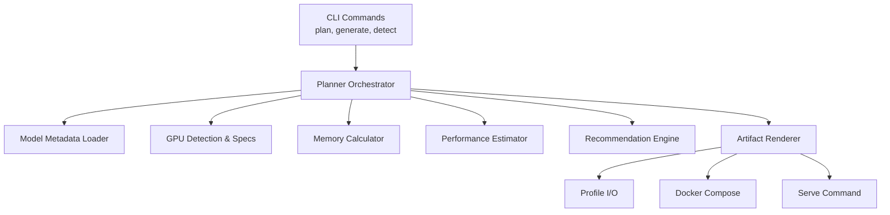
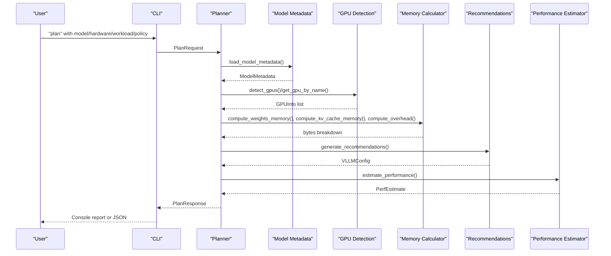
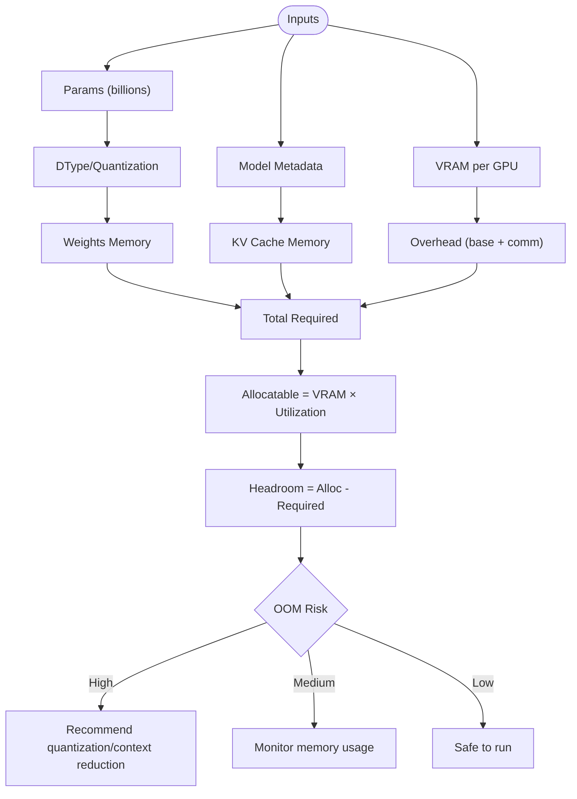
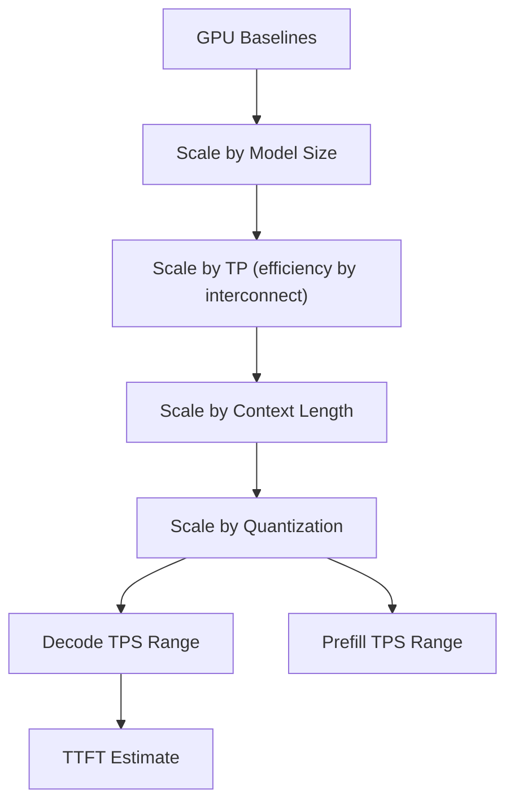
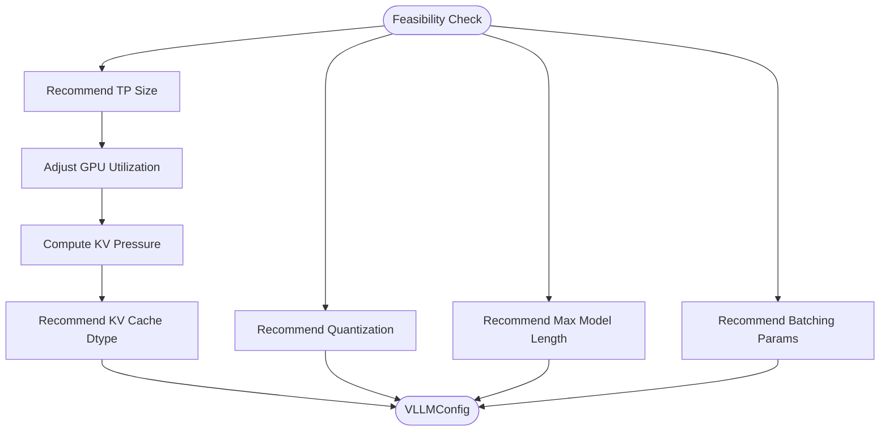
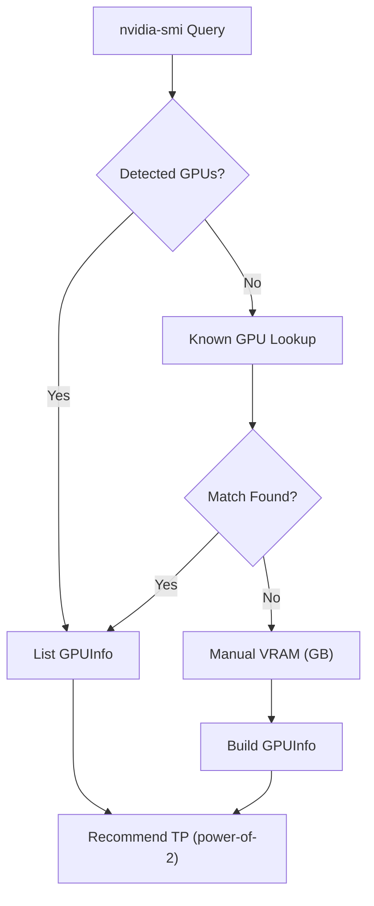
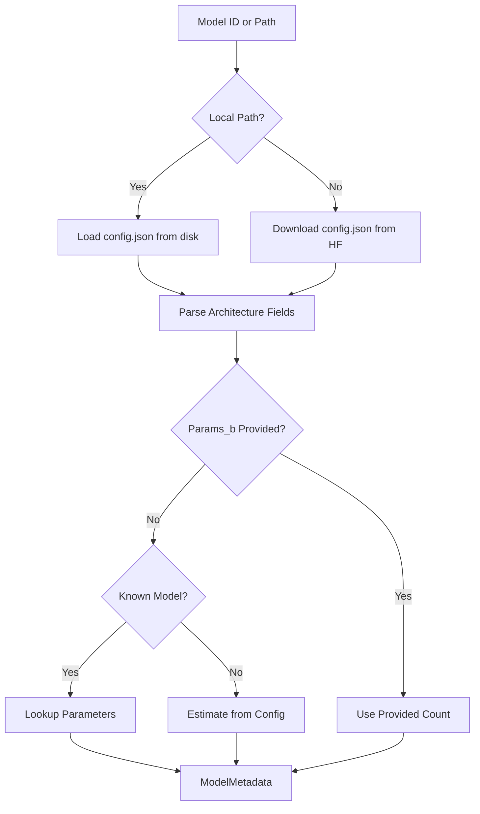
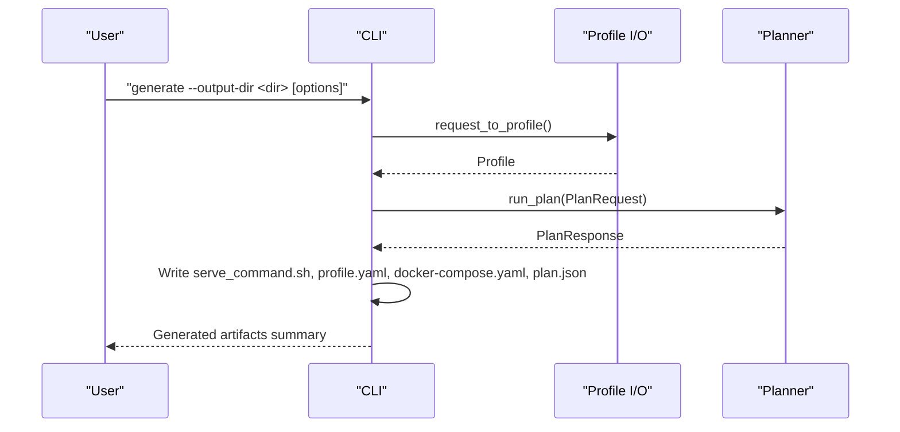
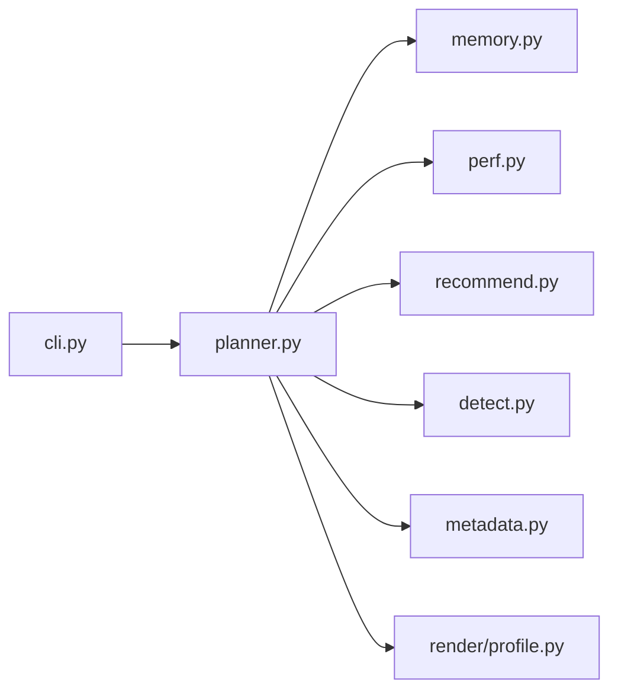

# Performance Tuning and Optimization

<cite>
**Referenced Files in This Document**
- [README.md](file://README.md)
- [cli.py](file://src/vllm_wizard/cli.py)
- [planner.py](file://src/vllm_wizard/planning/planner.py)
- [memory.py](file://src/vllm_wizard/planning/memory.py)
- [perf.py](file://src/vllm_wizard/planning/perf.py)
- [recommend.py](file://src/vllm_wizard/planning/recommend.py)
- [detect.py](file://src/vllm_wizard/hardware/detect.py)
- [metadata.py](file://src/vllm_wizard/models/metadata.py)
- [profile.py](file://src/vllm_wizard/render/profile.py)
- [sample.yaml](file://examples/profiles/sample.yaml)
</cite>

## Table of Contents
1. [Introduction](#introduction)
2. [Project Structure](#project-structure)
3. [Core Components](#core-components)
4. [Architecture Overview](#architecture-overview)
5. [Detailed Component Analysis](#detailed-component-analysis)
6. [Dependency Analysis](#dependency-analysis)
7. [Performance Considerations](#performance-considerations)
8. [Troubleshooting Guide](#troubleshooting-guide)
9. [Conclusion](#conclusion)
10. [Appendices](#appendices)

## Introduction
This document provides comprehensive performance tuning guidance for vLLM configurations using the vLLM Wizard tool. It focuses on advanced optimization techniques for memory allocation, quantization strategies, and tensor parallelization to maximize throughput. It also covers workload-specific optimizations (batching, concurrency, context length), GPU-specific tuning parameters across NVIDIA families, benchmarking methodologies, profiling techniques, bottleneck identification, advanced memory management, fragmentation reduction, cache optimization patterns, and multi-GPU scaling guidelines.

## Project Structure
The repository is organized around a CLI-driven planning pipeline that ingests model, hardware, and workload inputs, computes VRAM feasibility, recommends optimal vLLM settings, estimates performance, and generates artifacts (serve command, docker-compose, profile YAML).

**Diagram sources**
- [cli.py](file://src/vllm_wizard/cli.py#L82-L213)
- [planner.py](file://src/vllm_wizard/planning/planner.py#L21-L135)
- [memory.py](file://src/vllm_wizard/planning/memory.py#L31-L121)
- [perf.py](file://src/vllm_wizard/planning/perf.py#L136-L219)
- [recommend.py](file://src/vllm_wizard/planning/recommend.py#L167-L332)
- [detect.py](file://src/vllm_wizard/hardware/detect.py#L10-L71)
- [metadata.py](file://src/vllm_wizard/models/metadata.py#L209-L254)
- [profile.py](file://src/vllm_wizard/render/profile.py#L30-L65)

**Section sources**
- [README.md](file://README.md#L1-L308)
- [cli.py](file://src/vllm_wizard/cli.py#L35-L385)

## Core Components
- CLI: Provides commands to detect GPUs, plan configurations, and generate artifacts.
- Planner: Orchestrates memory feasibility, performance estimation, recommendations, and artifact generation.
- Memory Calculator: Computes weights, KV cache, overhead, and feasibility with fragmentation and headroom.
- Performance Estimator: Heuristic throughput/TTFT estimates by GPU family, model size, TP, context, and quantization.
- Recommendation Engine: Selects tensor-parallel size, KV cache dtype, quantization, max model length, and batching parameters.
- Hardware Detection: Auto-detects GPUs and known VRAM specs for manual fallback.
- Model Metadata: Loads model config and extracts architecture metadata for memory computations.
- Profile I/O: Saves and loads YAML profiles for reproducible configurations.

**Section sources**
- [cli.py](file://src/vllm_wizard/cli.py#L82-L381)
- [planner.py](file://src/vllm_wizard/planning/planner.py#L21-L135)
- [memory.py](file://src/vllm_wizard/planning/memory.py#L31-L367)
- [perf.py](file://src/vllm_wizard/planning/perf.py#L136-L219)
- [recommend.py](file://src/vllm_wizard/planning/recommend.py#L167-L332)
- [detect.py](file://src/vllm_wizard/hardware/detect.py#L10-L229)
- [metadata.py](file://src/vllm_wizard/models/metadata.py#L209-L254)
- [profile.py](file://src/vllm_wizard/render/profile.py#L30-L173)

## Architecture Overview
The planning pipeline integrates model metadata, hardware detection, memory computation, recommendations, and performance estimation into a unified configuration suitable for vLLM serving.

**Diagram sources**
- [cli.py](file://src/vllm_wizard/cli.py#L82-L213)
- [planner.py](file://src/vllm_wizard/planning/planner.py#L21-L135)
- [metadata.py](file://src/vllm_wizard/models/metadata.py#L209-L254)
- [detect.py](file://src/vllm_wizard/hardware/detect.py#L10-L229)
- [memory.py](file://src/vllm_wizard/planning/memory.py#L31-L367)
- [recommend.py](file://src/vllm_wizard/planning/recommend.py#L167-L332)
- [perf.py](file://src/vllm_wizard/planning/perf.py#L136-L219)

## Detailed Component Analysis

### Memory Calculation and Feasibility
Key mechanisms:
- Weights memory: scales with parameters and dtype/quantization.
- KV cache memory: proportional to num_layers, num_kv_heads, head_dim, context_len, concurrency, and dtype.
- Overhead: base overhead plus multi-GPU communication buffer.
- Feasibility: allocatable VRAM vs. required (weights + KV cache + overhead) with headroom and OOM risk classification.

**Diagram sources**
- [memory.py](file://src/vllm_wizard/planning/memory.py#L31-L121)
- [memory.py](file://src/vllm_wizard/planning/memory.py#L155-L270)

**Section sources**
- [memory.py](file://src/vllm_wizard/planning/memory.py#L31-L367)
- [metadata.py](file://src/vllm_wizard/models/metadata.py#L12-L37)

### Performance Estimation Heuristics
- Baseline decode and prefill TPS by GPU family.
- Scaling by model size (inverse scaling with exponent ~0.85).
- Tensor parallel scaling with interconnect efficiency (NVLink > PCIe).
- Context length degradation (~sqrt scaling).
- Quantization speedup factors.
- TTFT estimate derived from prefill throughput.

**Diagram sources**
- [perf.py](file://src/vllm_wizard/planning/perf.py#L136-L219)

**Section sources**
- [perf.py](file://src/vllm_wizard/planning/perf.py#L8-L219)

### Recommendations Engine
- Tensor parallel size: power-of-two selection constrained by GPU count and weights per GPU.
- GPU memory utilization: lowered for consumer GPUs for stability.
- Quantization: recommended when configuration does not fit without it.
- KV cache dtype: FP8 suggested for high KV pressure on supported GPUs.
- Max model length: clamped to model max and available context.
- Batching parameters: max_num_seqs and max_num_batched_tokens tuned by mode and VRAM.

**Diagram sources**
- [recommend.py](file://src/vllm_wizard/planning/recommend.py#L167-L332)

**Section sources**
- [recommend.py](file://src/vllm_wizard/planning/recommend.py#L26-L332)

### Hardware Detection and Tensor Parallel Selection
- Auto-detection via nvidia-smi with driver/CUDA/compute capability hints.
- Known GPU VRAM fallback when detection fails.
- TP recommendation as largest power of two ≤ number of GPUs, adjusted if weights do not fit.

**Diagram sources**
- [detect.py](file://src/vllm_wizard/hardware/detect.py#L10-L229)

**Section sources**
- [detect.py](file://src/vllm_wizard/hardware/detect.py#L10-L229)

### Model Metadata Extraction
- Loads config.json from local path or Hugging Face Hub.
- Parses architecture parameters (layers, hidden size, heads, KV heads, position embeddings).
- Estimates parameter count when not provided; supports known model size lookups.

**Diagram sources**
- [metadata.py](file://src/vllm_wizard/models/metadata.py#L209-L254)

**Section sources**
- [metadata.py](file://src/vllm_wizard/models/metadata.py#L12-L254)

### CLI Workflows and Artifact Generation
- plan: builds PlanRequest, runs planner, prints console report or JSON.
- generate: builds PlanRequest, runs planner, writes serve command, profile YAML, docker-compose, and JSON.
- detect: lists GPUs with optional JSON output.

**Diagram sources**
- [cli.py](file://src/vllm_wizard/cli.py#L215-L381)
- [profile.py](file://src/vllm_wizard/render/profile.py#L118-L173)

**Section sources**
- [cli.py](file://src/vllm_wizard/cli.py#L62-L381)
- [profile.py](file://src/vllm_wizard/render/profile.py#L30-L173)

## Dependency Analysis
The planner orchestrates dependencies among memory, performance, recommendations, hardware detection, and metadata. The CLI coordinates user inputs and artifact rendering.

**Diagram sources**
- [cli.py](file://src/vllm_wizard/cli.py#L82-L213)
- [planner.py](file://src/vllm_wizard/planning/planner.py#L21-L135)
- [memory.py](file://src/vllm_wizard/planning/memory.py#L31-L121)
- [perf.py](file://src/vllm_wizard/planning/perf.py#L136-L219)
- [recommend.py](file://src/vllm_wizard/planning/recommend.py#L167-L332)
- [detect.py](file://src/vllm_wizard/hardware/detect.py#L10-L229)
- [metadata.py](file://src/vllm_wizard/models/metadata.py#L209-L254)
- [profile.py](file://src/vllm_wizard/render/profile.py#L30-L173)

**Section sources**
- [planner.py](file://src/vllm_wizard/planning/planner.py#L21-L135)
- [cli.py](file://src/vllm_wizard/cli.py#L82-L213)

## Performance Considerations

### Memory Allocation Parameters
- GPU memory utilization: tune between 0.5–0.98; lower for consumer GPUs for stability.
- Overhead: base overhead plus multi-GPU communication buffer; can be overridden.
- Fragmentation factor: KV cache fragmentation factor to account for runtime allocation inefficiencies.
- Headroom: minimum headroom in GB to prevent OOM under bursty workloads.

Practical tips:
- Increase fragmentation factor cautiously (e.g., 1.15–1.3) for highly fragmented contexts.
- Reduce headroom only after extensive testing on target hardware.
- Monitor KV cache ratio (<50%) to avoid excessive VRAM pressure.

**Section sources**
- [memory.py](file://src/vllm_wizard/planning/memory.py#L124-L152)
- [memory.py](file://src/vllm_wizard/planning/memory.py#L155-L270)
- [inputs.py](file://src/vllm_wizard/schemas/inputs.py#L89-L100)

### Quantization Strategies
- AWQ/GPTQ: Effective for large models; reduces weights memory close to 4-bit with modest throughput cost.
- INT8: Balanced trade-off for throughput and memory.
- FP8 KV cache: Experimental; recommended for high KV pressure on supported GPUs (e.g., Hopper/Ada generation).

Guidance:
- Enable quantization when feasibility fails without it.
- Prefer FP8 KV cache when KV pressure >40% and GPU supports FP8.
- Validate accuracy and throughput post-quantization.

**Section sources**
- [recommend.py](file://src/vllm_wizard/planning/recommend.py#L88-L122)
- [memory.py](file://src/vllm_wizard/planning/memory.py#L19-L25)

### Tensor Parallelization Settings
- Choose TP as power-of-two ≤ number of GPUs.
- NVLink interconnect yields higher TP efficiency; PCIe introduces overhead.
- Weights per GPU should remain below ~70% of VRAM per device for stability.

Scaling guidelines:
- Prefer NVLink-connected GPUs for multi-GPU setups.
- If weights do not fit with recommended TP, increase TP to split weights across more GPUs.

**Section sources**
- [recommend.py](file://src/vllm_wizard/planning/recommend.py#L42-L68)
- [detect.py](file://src/vllm_wizard/hardware/detect.py#L138-L159)
- [perf.py](file://src/vllm_wizard/planning/perf.py#L83-L104)

### Workload-Specific Optimizations
- Throughput mode: increase max_num_seqs and max_num_batched_tokens; enable streaming.
- Latency mode: keep concurrency aligned with target concurrency; reduce batching overhead.
- Balanced mode: moderate increases to batching parameters.

Context length optimization:
- Clamp max_model_len to model’s supported maximum and available context.
- Reduce context length when KV cache dominates allocatable VRAM.

Concurrency tuning:
- Start with target concurrency; increase gradually while monitoring KV cache growth.
- Use max_concurrency_at_context to determine safe concurrency bounds.

**Section sources**
- [recommend.py](file://src/vllm_wizard/planning/recommend.py#L124-L164)
- [memory.py](file://src/vllm_wizard/planning/memory.py#L273-L367)

### GPU-Specific Tuning Parameters
- Consumer GPUs (RTX series): lower GPU memory utilization (e.g., 0.88) for stability.
- Datacenter GPUs (A100/H100/L40s): standard utilization (e.g., 0.90) with strong NVLink support.
- FP8 KV cache: recommended on supported architectures (Hopper/Ada generation) for high KV pressure.

**Section sources**
- [recommend.py](file://src/vllm_wizard/planning/recommend.py#L32-L39)
- [recommend.py](file://src/vllm_wizard/planning/recommend.py#L111-L121)
- [detect.py](file://src/vllm_wizard/hardware/detect.py#L173-L228)

### Advanced Memory Management and Fragmentation Reduction
- Use fragmentation factor to account for runtime allocation overhead.
- Reduce KV cache dtype precision (e.g., FP8 KV cache) when KV pressure exceeds thresholds.
- Monitor KV cache ratio and reduce concurrency or context length if ratio >50%.

**Section sources**
- [memory.py](file://src/vllm_wizard/planning/memory.py#L67-L121)
- [memory.py](file://src/vllm_wizard/planning/memory.py#L251-L256)

### Cache Optimization Patterns
- KV cache memory scales with context length and concurrency; reduce either to improve throughput.
- Grouped-query attention (GQA) reduces KV heads and thus KV cache size.
- Streaming responses can reduce peak memory by processing tokens incrementally.

**Section sources**
- [memory.py](file://src/vllm_wizard/planning/memory.py#L67-L121)
- [README.md](file://README.md#L213-L213)

### Multi-GPU Scaling Guidelines
- Prefer power-of-two TP sizes; NVLink interconnect improves scaling efficiency.
- Ensure weights per GPU fit within VRAM; adjust TP if necessary.
- Use interconnect-aware TP efficiency factors in performance estimates.

**Section sources**
- [recommend.py](file://src/vllm_wizard/planning/recommend.py#L42-L68)
- [perf.py](file://src/vllm_wizard/planning/perf.py#L83-L104)

## Troubleshooting Guide
Common issues and resolutions:
- OOM risk high/medium: reduce context length, enable quantization, lower GPU memory utilization, or increase fragmentation factor.
- Excessive KV cache pressure: switch to FP8 KV cache (on supported GPUs), reduce concurrency, or shorten context.
- Insufficient throughput: increase max_num_batched_tokens and max_num_seqs (balanced/throughput modes), ensure NVLink interconnect, and validate quantization speedups.
- Stability on consumer GPUs: lower GPU memory utilization and avoid aggressive fragmentation factors.

Validation steps:
- Confirm VRAM detection via detect command.
- Verify profile YAML correctness and emit options.
- Re-run plan with JSON output to inspect feasibility and performance ranges.

**Section sources**
- [memory.py](file://src/vllm_wizard/planning/memory.py#L155-L270)
- [recommend.py](file://src/vllm_wizard/planning/recommend.py#L88-L122)
- [cli.py](file://src/vllm_wizard/cli.py#L62-L80)
- [profile.py](file://src/vllm_wizard/render/profile.py#L46-L65)

## Conclusion
This guide synthesizes the vLLM Wizard’s planning pipeline into actionable performance tuning strategies. By combining VRAM feasibility analysis, quantization recommendations, tensor-parallel scaling, workload-specific batching, and GPU-family-aware policies, operators can achieve robust throughput and latency targets. Always validate with targeted benchmarks and adjust parameters iteratively based on observed bottlenecks.

## Appendices

### Benchmarking Methodologies
- Measure end-to-end latency and throughput across varying concurrency and context lengths.
- Compare prefill vs. decode phases; prefill dominates initial latency (TTFT).
- Use streaming responses to assess incremental latency improvements.

### Performance Profiling Techniques
- Monitor VRAM usage during model load and inference.
- Profile kernel selection and memory fragmentation impacts.
- Correlate performance metrics with KV cache ratio and batching parameters.

### Bottleneck Identification Strategies
- If throughput plateaus with increased concurrency, KV cache is likely the bottleneck—reduce context or enable FP8 KV cache.
- If latency remains high despite throughput gains, prefill dominates—optimize context length and quantization.

### Example Profiles
- Use sample YAML to define repeatable configurations across environments.

**Section sources**
- [README.md](file://README.md#L215-L276)
- [sample.yaml](file://examples/profiles/sample.yaml#L1-L40)