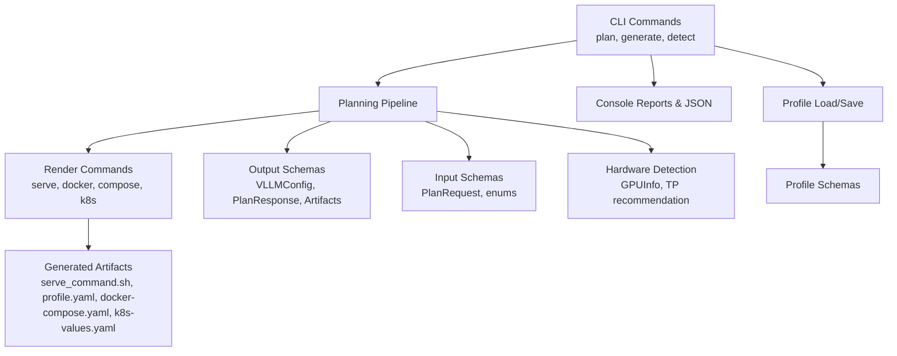
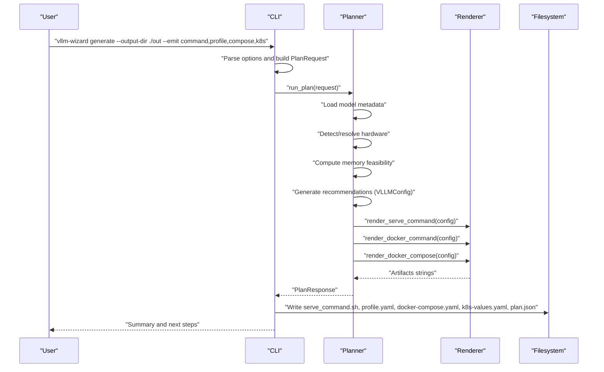
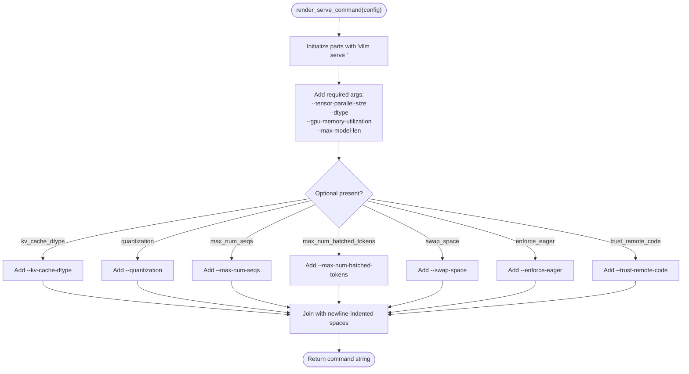
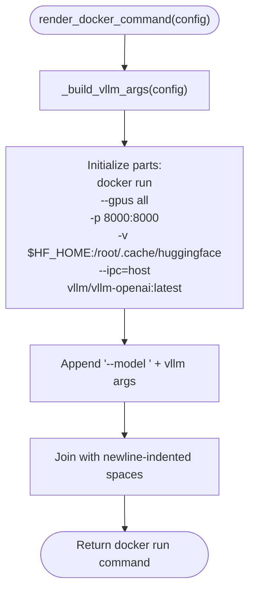
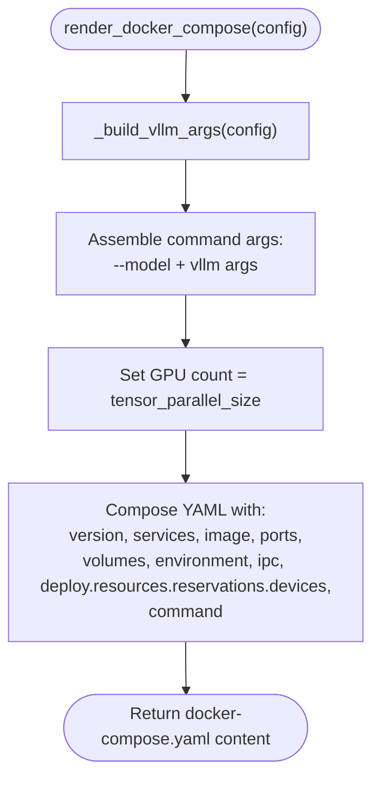
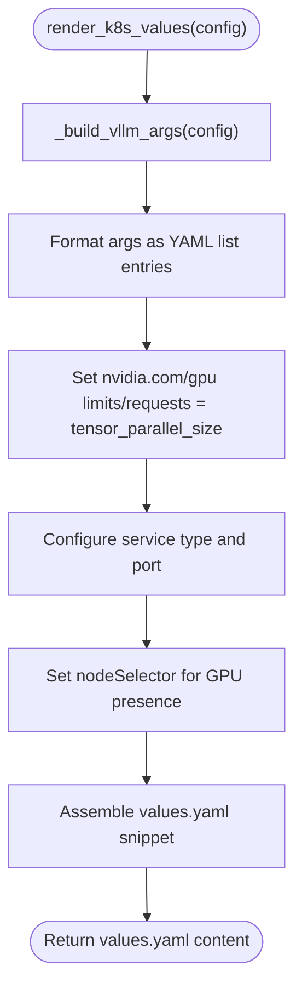
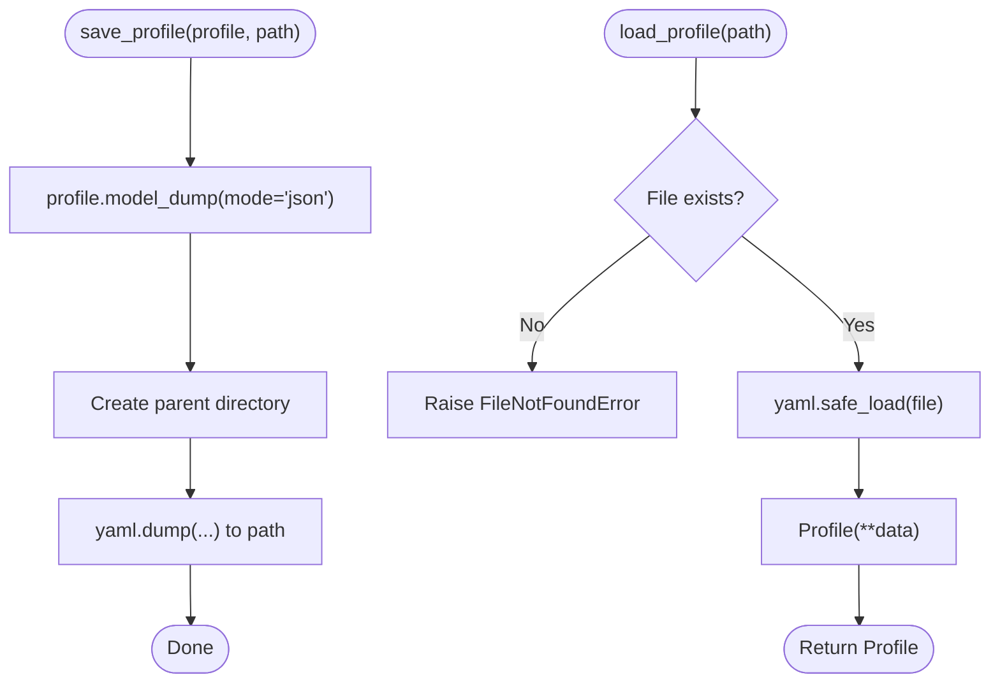
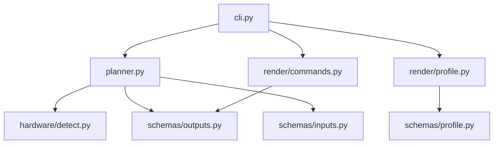

# Artifact Generation System

<cite>
**Referenced Files in This Document**
- [README.md](file://README.md)
- [src/vllm_wizard/cli.py](file://src/vllm_wizard/cli.py)
- [src/vllm_wizard/render/__init__.py](file://src/vllm_wizard/render/__init__.py)
- [src/vllm_wizard/render/commands.py](file://src/vllm_wizard/render/commands.py)
- [src/vllm_wizard/render/profile.py](file://src/vllm_wizard/render/profile.py)
- [src/vllm_wizard/render/report.py](file://src/vllm_wizard/render/report.py)
- [src/vllm_wizard/schemas/inputs.py](file://src/vllm_wizard/schemas/inputs.py)
- [src/vllm_wizard/schemas/outputs.py](file://src/vllm_wizard/schemas/outputs.py)
- [src/vllm_wizard/schemas/profile.py](file://src/vllm_wizard/schemas/profile.py)
- [src/vllm_wizard/planning/planner.py](file://src/vllm_wizard/planning/planner.py)
- [src/vllm_wizard/planning/recommend.py](file://src/vllm_wizard/planning/recommend.py)
- [src/vllm_wizard/hardware/detect.py](file://src/vllm_wizard/hardware/detect.py)
- [examples/profiles/sample.yaml](file://examples/profiles/sample.yaml)
</cite>

## Table of Contents
1. [Introduction](#introduction)
2. [Project Structure](#project-structure)
3. [Core Components](#core-components)
4. [Architecture Overview](#architecture-overview)
5. [Detailed Component Analysis](#detailed-component-analysis)
6. [Dependency Analysis](#dependency-analysis)
7. [Performance Considerations](#performance-considerations)
8. [Troubleshooting Guide](#troubleshooting-guide)
9. [Conclusion](#conclusion)
10. [Appendices](#appendices)

## Introduction
This document describes the artifact generation system for vLLM Wizard, focusing on how configuration artifacts are produced and validated. It covers:
- Output formats and templates for vLLM serve commands, Docker run commands, docker-compose manifests, and Kubernetes values
- YAML profile serialization with schema validation and persistence
- Template customization options and extension points
- Examples of generated artifacts and their intended use cases
- Validation and quality assurance processes
- Integration patterns with deployment pipelines and infrastructure-as-code tools

## Project Structure
The artifact generation system is organized around a CLI that orchestrates planning, rendering, and persistence. Key modules:
- CLI commands for plan and generate
- Rendering functions for commands, compose, and Kubernetes values
- Schema definitions for inputs, outputs, and profiles
- Planning pipeline that computes feasibility, recommendations, and artifacts
- Hardware detection utilities for GPU auto-detection and tensor-parallel recommendations

**Diagram sources**
- [src/vllm_wizard/cli.py](file://src/vllm_wizard/cli.py#L82-L381)
- [src/vllm_wizard/planning/planner.py](file://src/vllm_wizard/planning/planner.py#L21-L136)
- [src/vllm_wizard/render/commands.py](file://src/vllm_wizard/render/commands.py#L6-L196)
- [src/vllm_wizard/render/profile.py](file://src/vllm_wizard/render/profile.py#L30-L173)
- [src/vllm_wizard/schemas/inputs.py](file://src/vllm_wizard/schemas/inputs.py#L54-L110)
- [src/vllm_wizard/schemas/outputs.py](file://src/vllm_wizard/schemas/outputs.py#L57-L118)
- [src/vllm_wizard/schemas/profile.py](file://src/vllm_wizard/schemas/profile.py#L16-L75)
- [src/vllm_wizard/hardware/detect.py](file://src/vllm_wizard/hardware/detect.py#L10-L229)

**Section sources**
- [README.md](file://README.md#L1-L308)
- [src/vllm_wizard/cli.py](file://src/vllm_wizard/cli.py#L1-L385)
- [src/vllm_wizard/render/__init__.py](file://src/vllm_wizard/render/__init__.py#L1-L20)

## Core Components
- CLI orchestration: plan and generate commands parse inputs, run planning, and produce artifacts or reports.
- Rendering: functions generate serve commands, Docker run commands, docker-compose manifests, and Kubernetes values.
- Schemas: Pydantic models define input, output, and profile structures with validation and defaults.
- Planning pipeline: computes feasibility, generates recommendations, and produces artifacts.
- Hardware detection: auto-detects GPUs and recommends tensor-parallel sizes.

**Section sources**
- [src/vllm_wizard/cli.py](file://src/vllm_wizard/cli.py#L82-L381)
- [src/vllm_wizard/render/commands.py](file://src/vllm_wizard/render/commands.py#L6-L196)
- [src/vllm_wizard/render/profile.py](file://src/vllm_wizard/render/profile.py#L30-L173)
- [src/vllm_wizard/schemas/inputs.py](file://src/vllm_wizard/schemas/inputs.py#L54-L110)
- [src/vllm_wizard/schemas/outputs.py](file://src/vllm_wizard/schemas/outputs.py#L57-L118)
- [src/vllm_wizard/schemas/profile.py](file://src/vllm_wizard/schemas/profile.py#L16-L75)
- [src/vllm_wizard/planning/planner.py](file://src/vllm_wizard/planning/planner.py#L21-L136)
- [src/vllm_wizard/hardware/detect.py](file://src/vllm_wizard/hardware/detect.py#L10-L229)

## Architecture Overview
The system follows a clean separation of concerns:
- CLI parses user options and either prints a human-readable report or writes artifacts to disk.
- Planning computes feasibility and recommendations, then renders artifacts.
- Rendering converts VLLMConfig into command strings and YAML content.
- Profiles persist and restore planning configurations.

**Diagram sources**
- [src/vllm_wizard/cli.py](file://src/vllm_wizard/cli.py#L215-L381)
- [src/vllm_wizard/planning/planner.py](file://src/vllm_wizard/planning/planner.py#L21-L136)
- [src/vllm_wizard/render/commands.py](file://src/vllm_wizard/render/commands.py#L6-L196)

## Detailed Component Analysis

### vLLM Serve Command Generation
The serve command renderer maps VLLMConfig fields to vLLM CLI arguments. Required parameters include model, tensor-parallel-size, dtype, gpu-memory-utilization, and max-model-len. Optional parameters include kv-cache-dtype, quantization, max-num-seqs, max-num-batched-tokens, swap-space, enforce-eager, and trust-remote-code.

**Diagram sources**
- [src/vllm_wizard/render/commands.py](file://src/vllm_wizard/render/commands.py#L6-L46)

**Section sources**
- [src/vllm_wizard/render/commands.py](file://src/vllm_wizard/render/commands.py#L6-L46)
- [src/vllm_wizard/schemas/outputs.py](file://src/vllm_wizard/schemas/outputs.py#L57-L75)

### Docker Configuration Templates
Docker run command renderer builds a complete docker run invocation using the same VLLMConfig. It sets GPU visibility, port mapping, cache volume mounting, IPC isolation, and passes the model and vLLM arguments.

**Diagram sources**
- [src/vllm_wizard/render/commands.py](file://src/vllm_wizard/render/commands.py#L48-L72)
- [src/vllm_wizard/render/commands.py](file://src/vllm_wizard/render/commands.py#L158-L196)

**Section sources**
- [src/vllm_wizard/render/commands.py](file://src/vllm_wizard/render/commands.py#L48-L72)
- [src/vllm_wizard/render/commands.py](file://src/vllm_wizard/render/commands.py#L158-L196)

### Docker Compose Manifest Generation
The docker-compose renderer composes a service definition with image, port mapping, volume mounts, environment variables, IPC, resource reservations, and command arguments derived from VLLMConfig. GPU reservation count equals tensor-parallel-size.

**Diagram sources**
- [src/vllm_wizard/render/commands.py](file://src/vllm_wizard/render/commands.py#L75-L114)
- [src/vllm_wizard/render/commands.py](file://src/vllm_wizard/render/commands.py#L158-L196)

**Section sources**
- [src/vllm_wizard/render/commands.py](file://src/vllm_wizard/render/commands.py#L75-L114)

### Kubernetes Values Generation
The Kubernetes values renderer produces a values.yaml snippet suitable for Helm charts. It includes image repository/tag/pullPolicy, args list built from VLLMConfig, resource limits/requests for GPUs, service configuration, and nodeSelector requiring GPU presence.

**Diagram sources**
- [src/vllm_wizard/render/commands.py](file://src/vllm_wizard/render/commands.py#L116-L155)
- [src/vllm_wizard/render/commands.py](file://src/vllm_wizard/render/commands.py#L158-L196)

**Section sources**
- [src/vllm_wizard/render/commands.py](file://src/vllm_wizard/render/commands.py#L116-L155)

### YAML Profile Serialization and Schema Validation
Profiles are saved and loaded using Pydantic’s model serialization and YAML. The loader validates structure against the Profile schema; the saver writes JSON-compatible dictionaries to preserve enum values and optional fields.

**Diagram sources**
- [src/vllm_wizard/render/profile.py](file://src/vllm_wizard/render/profile.py#L30-L66)

**Section sources**
- [src/vllm_wizard/render/profile.py](file://src/vllm_wizard/render/profile.py#L30-L66)
- [src/vllm_wizard/schemas/profile.py](file://src/vllm_wizard/schemas/profile.py#L16-L75)
- [examples/profiles/sample.yaml](file://examples/profiles/sample.yaml#L1-L40)

### Template Customization and Extension Points
- Parameter mapping: All vLLM serve parameters are mapped from VLLMConfig fields. Optional parameters are conditionally included.
- Docker compose: GPU reservation count is derived from tensor_parallel_size; environment variables support Hugging Face token and cache path.
- Kubernetes values: Resource requests/limits and nodeSelector are configurable; args list is constructed from VLLMConfig.
- Profiles: The outputs section includes emit flags and a passthrough vllm_args dictionary for advanced tuning.

**Section sources**
- [src/vllm_wizard/render/commands.py](file://src/vllm_wizard/render/commands.py#L6-L196)
- [src/vllm_wizard/schemas/outputs.py](file://src/vllm_wizard/schemas/outputs.py#L57-L118)
- [src/vllm_wizard/schemas/profile.py](file://src/vllm_wizard/schemas/profile.py#L57-L75)

### Examples of Generated Artifacts and Use Cases
- serve_command.sh: Executable script containing the recommended vllm serve command for quick local testing.
- profile.yaml: Persistent configuration capturing model, hardware, workload, policy, and outputs preferences.
- docker-compose.yaml: Containerized deployment with GPU scheduling and cache volume mapping.
- k8s-values.yaml: Kubernetes Helm values for GPU-accelerated deployments with resource constraints.
- plan.json: Machine-readable plan response for automation and CI/CD pipelines.

**Section sources**
- [src/vllm_wizard/cli.py](file://src/vllm_wizard/cli.py#L325-L350)
- [examples/profiles/sample.yaml](file://examples/profiles/sample.yaml#L1-L40)

### Artifact Validation and Quality Assurance
- CLI error handling: Catches ValueError, FileNotFoundError, and unexpected exceptions, printing user-friendly messages and exiting with non-zero status.
- VRAM feasibility: The planner computes weights, KV cache, overhead, and headroom; warns when headroom is low or negative.
- JSON output: The plan command can output JSON for machine consumption.
- Console reporting: Rich-formatted reports summarize feasibility, VRAM breakdown, recommendations, performance estimates, and warnings.

**Section sources**
- [src/vllm_wizard/cli.py](file://src/vllm_wizard/cli.py#L204-L213)
- [src/vllm_wizard/render/report.py](file://src/vllm_wizard/render/report.py#L14-L272)
- [src/vllm_wizard/planning/planner.py](file://src/vllm_wizard/planning/planner.py#L84-L98)

### Integration Patterns with Deployment Pipelines and Infrastructure-as-Code Tools
- CI/CD: Use the generate command to produce artifacts in a dedicated job; publish artifacts for later deployment stages.
- Infrastructure-as-Code: Apply docker-compose locally or use k8s-values.yaml with Helm to deploy to Kubernetes clusters.
- Version control: Commit profile.yaml to track configuration changes; regenerate artifacts on demand.
- Automation: Use the JSON output for programmatic consumption by downstream systems.

**Section sources**
- [README.md](file://README.md#L64-L88)
- [src/vllm_wizard/cli.py](file://src/vllm_wizard/cli.py#L274-L381)

## Dependency Analysis
The artifact generation system exhibits clear module boundaries:
- CLI depends on planner, renderers, and profile IO.
- Planner depends on hardware detection, memory computation, performance estimation, and recommendation engine.
- Renderers depend on VLLMConfig and produce strings for artifacts.
- Schemas define contracts for inputs, outputs, and profiles.

**Diagram sources**
- [src/vllm_wizard/cli.py](file://src/vllm_wizard/cli.py#L14-L21)
- [src/vllm_wizard/planning/planner.py](file://src/vllm_wizard/planning/planner.py#L5-L18)
- [src/vllm_wizard/render/commands.py](file://src/vllm_wizard/render/commands.py#L3)
- [src/vllm_wizard/render/profile.py](file://src/vllm_wizard/render/profile.py#L8-L27)
- [src/vllm_wizard/schemas/inputs.py](file://src/vllm_wizard/schemas/inputs.py#L54-L110)
- [src/vllm_wizard/schemas/outputs.py](file://src/vllm_wizard/schemas/outputs.py#L57-L118)
- [src/vllm_wizard/schemas/profile.py](file://src/vllm_wizard/schemas/profile.py#L16-L75)
- [src/vllm_wizard/hardware/detect.py](file://src/vllm_wizard/hardware/detect.py#L10-L229)

**Section sources**
- [src/vllm_wizard/cli.py](file://src/vllm_wizard/cli.py#L14-L21)
- [src/vllm_wizard/planning/planner.py](file://src/vllm_wizard/planning/planner.py#L5-L18)
- [src/vllm_wizard/render/commands.py](file://src/vllm_wizard/render/commands.py#L3)
- [src/vllm_wizard/render/profile.py](file://src/vllm_wizard/render/profile.py#L8-L27)
- [src/vllm_wizard/schemas/inputs.py](file://src/vllm_wizard/schemas/inputs.py#L54-L110)
- [src/vllm_wizard/schemas/outputs.py](file://src/vllm_wizard/schemas/outputs.py#L57-L118)
- [src/vllm_wizard/schemas/profile.py](file://src/vllm_wizard/schemas/profile.py#L16-L75)
- [src/vllm_wizard/hardware/detect.py](file://src/vllm_wizard/hardware/detect.py#L10-L229)

## Performance Considerations
- GPU memory utilization: The recommendation engine adjusts utilization based on GPU type and policy inputs to balance stability and performance.
- Tensor parallel size: Automatically selected as a power-of-two up to the number of GPUs; can be overridden.
- KV cache dtype: FP8 KV cache may be suggested for high-pressure scenarios on supported GPUs.
- Quantization: AWQ/GPTQ may be recommended to reduce memory footprint when models exceed VRAM.
- Throughput vs latency: Batching mode influences max_num_seqs and max_num_batched_tokens to optimize for desired workload characteristics.

[No sources needed since this section provides general guidance]

## Troubleshooting Guide
Common issues and resolutions:
- No GPUs detected: Ensure nvidia-smi is installed and accessible; the system falls back to manual hardware specification.
- Profile not found: Verify the path exists; the loader raises a clear error message.
- Invalid profile: The loader constructs a Profile from YAML; ensure keys match the schema.
- Configuration does not fit VRAM: Review feasibility warnings and consider quantization, reduced context length, or fewer GPUs.
- Docker/Kubernetes errors: Confirm GPU drivers and device plugins are installed; verify environment variables and volume paths.

**Section sources**
- [src/vllm_wizard/hardware/detect.py](file://src/vllm_wizard/hardware/detect.py#L10-L72)
- [src/vllm_wizard/render/profile.py](file://src/vllm_wizard/render/profile.py#L59-L66)
- [src/vllm_wizard/cli.py](file://src/vllm_wizard/cli.py#L204-L213)

## Conclusion
The artifact generation system provides a robust, schema-driven approach to producing vLLM configurations across multiple deployment targets. It integrates hardware detection, memory feasibility analysis, and recommendation engines to generate optimized artifacts, while preserving flexibility through profiles and customizable templates.

[No sources needed since this section summarizes without analyzing specific files]

## Appendices

### Appendix A: CLI Commands and Options
- plan: Computes feasibility, recommendations, and performance; supports JSON output and explanations.
- generate: Produces artifacts to disk; supports emitting command, profile, compose, and k8s artifacts.
- detect: Lists detected GPUs or outputs JSON.

**Section sources**
- [src/vllm_wizard/cli.py](file://src/vllm_wizard/cli.py#L62-L381)
- [README.md](file://README.md#L90-L159)

### Appendix B: Example Profile
A sample profile demonstrates the YAML structure and emission controls.

**Section sources**
- [examples/profiles/sample.yaml](file://examples/profiles/sample.yaml#L1-L40)