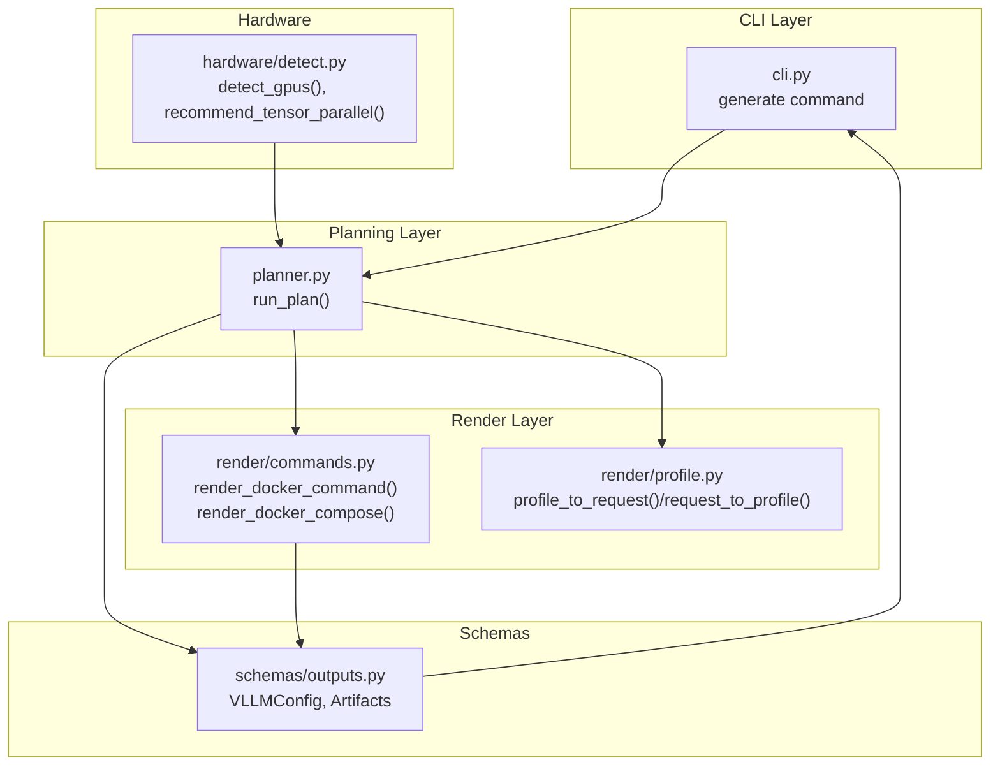
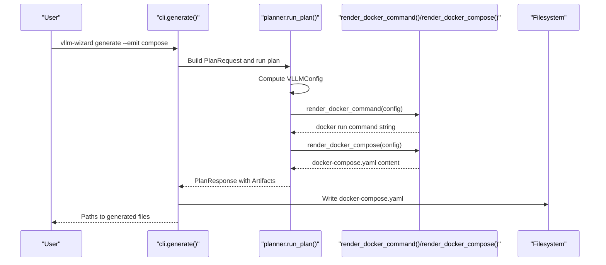
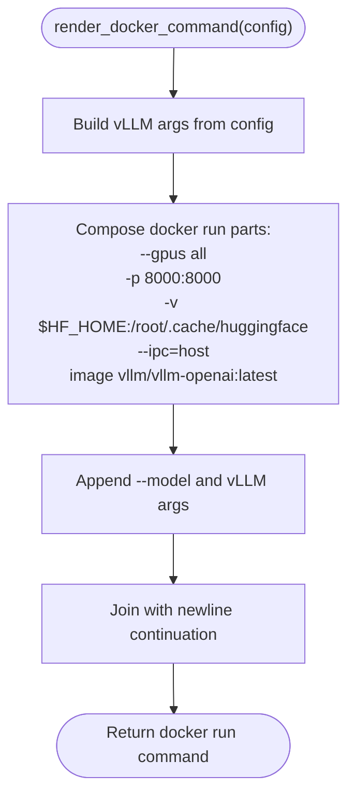
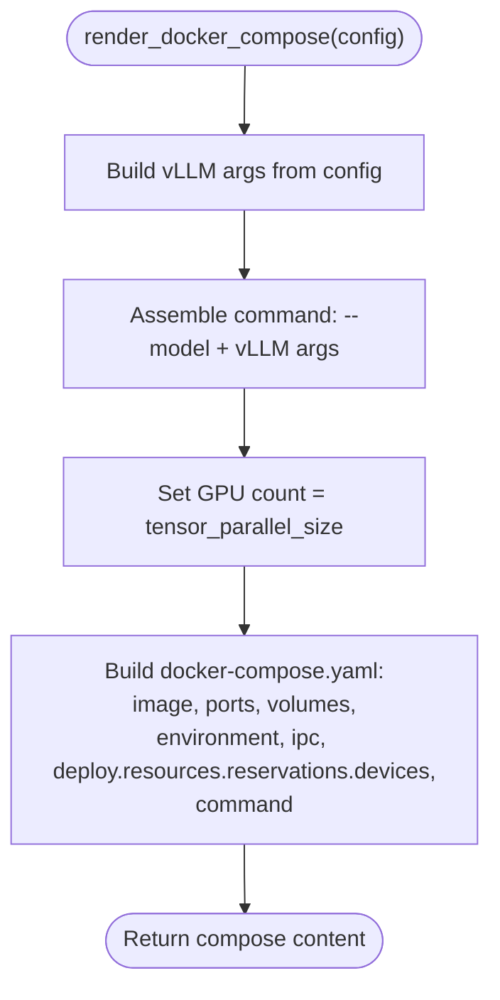
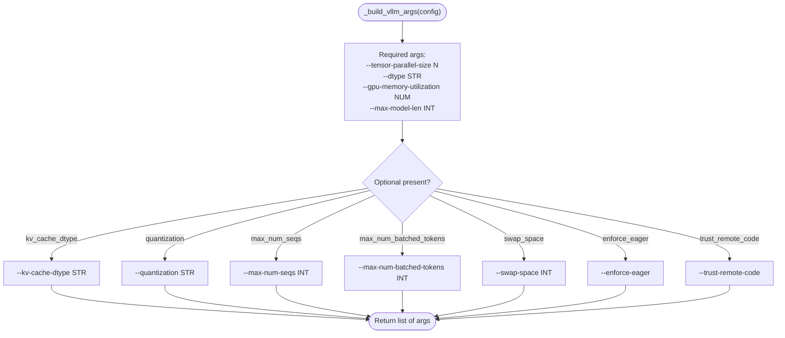
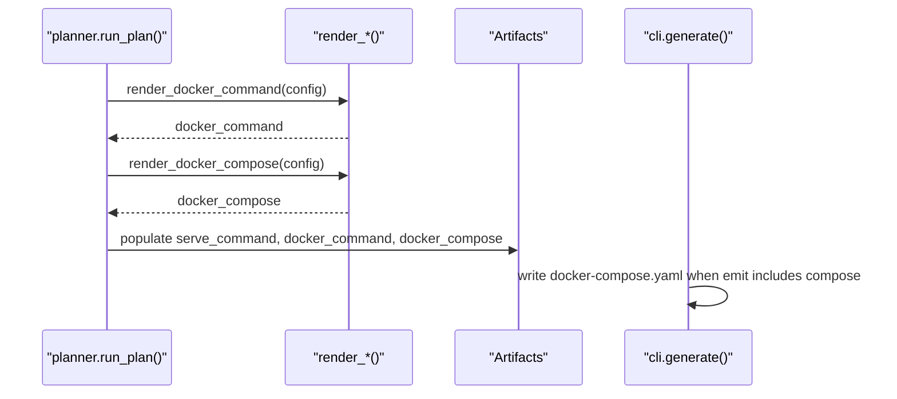
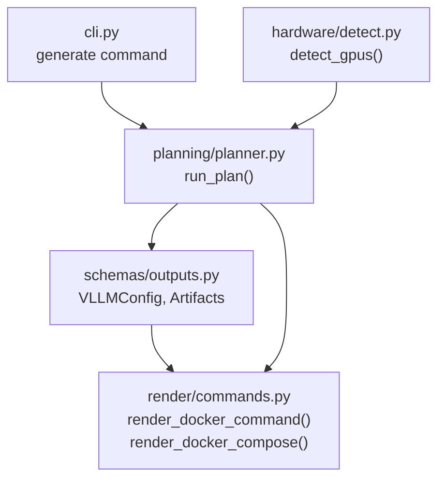

# Docker Artifact Generation

<cite>
**Referenced Files in This Document**
- [README.md](file://README.md)
- [pyproject.toml](file://pyproject.toml)
- [src/vllm_wizard/cli.py](file://src/vllm_wizard/cli.py)
- [src/vllm_wizard/planning/planner.py](file://src/vllm_wizard/planning/planner.py)
- [src/vllm_wizard/render/commands.py](file://src/vllm_wizard/render/commands.py)
- [src/vllm_wizard/render/profile.py](file://src/vllm_wizard/render/profile.py)
- [src/vllm_wizard/schemas/outputs.py](file://src/vllm_wizard/schemas/outputs.py)
- [src/vllm_wizard/hardware/detect.py](file://src/vllm_wizard/hardware/detect.py)
</cite>

## Table of Contents
1. [Introduction](#introduction)
2. [Project Structure](#project-structure)
3. [Core Components](#core-components)
4. [Architecture Overview](#architecture-overview)
5. [Detailed Component Analysis](#detailed-component-analysis)
6. [Dependency Analysis](#dependency-analysis)
7. [Performance Considerations](#performance-considerations)
8. [Troubleshooting Guide](#troubleshooting-guide)
9. [Conclusion](#conclusion)
10. [Appendices](#appendices)

## Introduction
This document explains how Docker artifacts are generated for vLLM deployments, focusing on two primary outputs:
- Standalone container deployment via docker run commands
- Orchestration-ready docker-compose configurations

It documents the render functions responsible for generating these artifacts, details the GPU configuration, port mapping, volume mounting for Hugging Face cache, and IPC configuration. It also covers docker-compose GPU resource reservation and service configuration, environment variable handling for Hugging Face tokens and cache directories, runtime requirements, and troubleshooting guidance.

## Project Structure
The Docker artifact generation is implemented in the render layer and integrated into the planning and CLI layers. The key files involved are:
- Render layer: docker run and docker-compose templates
- Planning layer: orchestrates artifact generation from configuration
- CLI layer: exposes generate command and writes artifacts to disk
- Schemas: define the configuration model used by render functions
- Hardware detection: provides runtime context for GPU availability

**Diagram sources**
- [src/vllm_wizard/cli.py](file://src/vllm_wizard/cli.py#L215-L381)
- [src/vllm_wizard/planning/planner.py](file://src/vllm_wizard/planning/planner.py#L21-L136)
- [src/vllm_wizard/render/commands.py](file://src/vllm_wizard/render/commands.py#L48-L114)
- [src/vllm_wizard/render/profile.py](file://src/vllm_wizard/render/profile.py#L68-L173)
- [src/vllm_wizard/schemas/outputs.py](file://src/vllm_wizard/schemas/outputs.py#L57-L118)
- [src/vllm_wizard/hardware/detect.py](file://src/vllm_wizard/hardware/detect.py#L10-L229)

**Section sources**
- [src/vllm_wizard/cli.py](file://src/vllm_wizard/cli.py#L215-L381)
- [src/vllm_wizard/planning/planner.py](file://src/vllm_wizard/planning/planner.py#L21-L136)
- [src/vllm_wizard/render/commands.py](file://src/vllm_wizard/render/commands.py#L48-L114)
- [src/vllm_wizard/render/profile.py](file://src/vllm_wizard/render/profile.py#L68-L173)
- [src/vllm_wizard/schemas/outputs.py](file://src/vllm_wizard/schemas/outputs.py#L57-L118)
- [src/vllm_wizard/hardware/detect.py](file://src/vllm_wizard/hardware/detect.py#L10-L229)

## Core Components
This section focuses on the two render functions that generate Docker artifacts:
- render_docker_command: produces a docker run command suitable for standalone container deployment
- render_docker_compose: produces a docker-compose.yaml suitable for orchestrated container management

Both functions accept a VLLMConfig object and return strings representing the Docker artifacts. They share a common helper that builds the vLLM CLI arguments from the configuration.

Key behaviors:
- GPU configuration: uses the --gpus all flag for docker run
- Port mapping: publishes port 8000:8000
- Volume mounting: mounts $HF_HOME to /root/.cache/huggingface for Hugging Face cache persistence
- IPC configuration: sets ipc=host for shared memory
- docker-compose GPU reservation: reserves nvidia devices equal to tensor_parallel_size

**Section sources**
- [src/vllm_wizard/render/commands.py](file://src/vllm_wizard/render/commands.py#L48-L114)
- [src/vllm_wizard/render/commands.py](file://src/vllm_wizard/render/commands.py#L158-L196)
- [src/vllm_wizard/schemas/outputs.py](file://src/vllm_wizard/schemas/outputs.py#L57-L75)

## Architecture Overview
The Docker artifact generation pipeline integrates with the planning and CLI layers as follows:

**Diagram sources**
- [src/vllm_wizard/cli.py](file://src/vllm_wizard/cli.py#L215-L381)
- [src/vllm_wizard/planning/planner.py](file://src/vllm_wizard/planning/planner.py#L21-L136)
- [src/vllm_wizard/render/commands.py](file://src/vllm_wizard/render/commands.py#L48-L114)

## Detailed Component Analysis

### render_docker_command
Purpose:
- Generate a docker run command for standalone deployment of vLLM with GPU access, port publishing, Hugging Face cache volume, and shared memory IPC.

Behavior highlights:
- Uses --gpus all to enable GPU access
- Publishes port 8000:8000
- Mounts $HF_HOME to /root/.cache/huggingface
- Sets ipc=host
- Appends vLLM CLI arguments built from VLLMConfig

**Diagram sources**
- [src/vllm_wizard/render/commands.py](file://src/vllm_wizard/render/commands.py#L48-L72)
- [src/vllm_wizard/render/commands.py](file://src/vllm_wizard/render/commands.py#L158-L196)

**Section sources**
- [src/vllm_wizard/render/commands.py](file://src/vllm_wizard/render/commands.py#L48-L72)

### render_docker_compose
Purpose:
- Generate a docker-compose.yaml for orchestrated deployment of vLLM with GPU reservation, port publishing, Hugging Face cache volume, environment variable for Hugging Face token, and shared memory IPC.

Behavior highlights:
- Service image: vllm/vllm-openai:latest
- Ports: 8000:8000
- Volumes: ${{HF_HOME:-~/.cache/huggingface}}:/root/.cache/huggingface
- Environment: HUGGING_FACE_HUB_TOKEN=${{HUGGING_FACE_HUB_TOKEN:-}}
- IPC: host
- GPU reservation: deploy.resources.reservations.devices with driver=nvidia, count equal to tensor_parallel_size, capabilities=[gpu]
- Command: assembled from --model and vLLM args

**Diagram sources**
- [src/vllm_wizard/render/commands.py](file://src/vllm_wizard/render/commands.py#L75-L114)
- [src/vllm_wizard/render/commands.py](file://src/vllm_wizard/render/commands.py#L158-L196)

**Section sources**
- [src/vllm_wizard/render/commands.py](file://src/vllm_wizard/render/commands.py#L75-L114)

### VLLMConfig and Argument Building
Both render functions rely on a shared helper that translates VLLMConfig into a list of vLLM CLI arguments. The helper includes required and optional parameters such as tensor_parallel_size, dtype, gpu_memory_utilization, max_model_len, kv_cache_dtype, quantization, max_num_seqs, max_num_batched_tokens, swap_space, enforce_eager, and trust_remote_code.

**Diagram sources**
- [src/vllm_wizard/render/commands.py](file://src/vllm_wizard/render/commands.py#L158-L196)

**Section sources**
- [src/vllm_wizard/render/commands.py](file://src/vllm_wizard/render/commands.py#L158-L196)
- [src/vllm_wizard/schemas/outputs.py](file://src/vllm_wizard/schemas/outputs.py#L57-L75)

### Integration with Planning and CLI
The planning layer computes a VLLMConfig and invokes render functions to produce docker artifacts. The CLI layer then writes these artifacts to disk when requested.

**Diagram sources**
- [src/vllm_wizard/planning/planner.py](file://src/vllm_wizard/planning/planner.py#L119-L135)
- [src/vllm_wizard/render/commands.py](file://src/vllm_wizard/render/commands.py#L48-L114)
- [src/vllm_wizard/schemas/outputs.py](file://src/vllm_wizard/schemas/outputs.py#L94-L101)
- [src/vllm_wizard/cli.py](file://src/vllm_wizard/cli.py#L336-L345)

**Section sources**
- [src/vllm_wizard/planning/planner.py](file://src/vllm_wizard/planning/planner.py#L119-L135)
- [src/vllm_wizard/cli.py](file://src/vllm_wizard/cli.py#L336-L345)

## Dependency Analysis
The render layer depends on the VLLMConfig schema and the planning layer for configuration. The CLI layer depends on the render layer to produce artifacts and on the planning layer to compute configuration. Hardware detection influences tensor_parallel_size recommendations, which in turn influence GPU reservations in docker-compose.

**Diagram sources**
- [src/vllm_wizard/schemas/outputs.py](file://src/vllm_wizard/schemas/outputs.py#L57-L118)
- [src/vllm_wizard/render/commands.py](file://src/vllm_wizard/render/commands.py#L48-L114)
- [src/vllm_wizard/planning/planner.py](file://src/vllm_wizard/planning/planner.py#L21-L136)
- [src/vllm_wizard/cli.py](file://src/vllm_wizard/cli.py#L215-L381)
- [src/vllm_wizard/hardware/detect.py](file://src/vllm_wizard/hardware/detect.py#L10-L229)

**Section sources**
- [src/vllm_wizard/schemas/outputs.py](file://src/vllm_wizard/schemas/outputs.py#L57-L118)
- [src/vllm_wizard/render/commands.py](file://src/vllm_wizard/render/commands.py#L48-L114)
- [src/vllm_wizard/planning/planner.py](file://src/vllm_wizard/planning/planner.py#L21-L136)
- [src/vllm_wizard/cli.py](file://src/vllm_wizard/cli.py#L215-L381)
- [src/vllm_wizard/hardware/detect.py](file://src/vllm_wizard/hardware/detect.py#L10-L229)

## Performance Considerations
- GPU utilization: The docker-compose GPU reservation aligns with tensor_parallel_size, ensuring the container receives the requested number of GPUs. This helps avoid oversubscription and improves predictability.
- Port publishing: Exposing port 8000 enables straightforward integration with client applications and testing tools.
- Hugging Face cache: Persistent mounting of the cache directory reduces repeated downloads and speeds up model initialization across restarts.
- IPC configuration: Using host IPC can improve performance for multi-process or multi-threaded workloads by enabling efficient shared memory usage.

[No sources needed since this section provides general guidance]

## Troubleshooting Guide
Common Docker-related issues and resolutions:

- Docker daemon not running
  - Symptom: Cannot connect to Docker daemon
  - Resolution: Start Docker service or use sudo as appropriate for your environment

- NVIDIA Container Toolkit not installed
  - Symptom: --gpus flag not recognized or GPU not visible inside container
  - Resolution: Install the NVIDIA Container Toolkit and ensure nvidia-smi is available on the host

- Missing nvidia-smi
  - Symptom: GPU detection fails in planning stage
  - Resolution: Install NVIDIA drivers and nvidia-smi on the host system

- Port 8000 already in use
  - Symptom: docker run or docker-compose fails with address already in use
  - Resolution: Change the host port mapping or stop the conflicting service

- Hugging Face token not provided
  - Symptom: Unauthorized access to gated models
  - Resolution: Set HUGGING_FACE_HUB_TOKEN environment variable or mount a credentials file

- Insufficient GPU memory
  - Symptom: Out-of-memory errors or container crashes
  - Resolution: Reduce tensor_parallel_size, adjust gpu_memory_utilization, or switch to a larger GPU

- Volume permissions
  - Symptom: Permission denied when writing to mounted cache directory
  - Resolution: Ensure the host directory is writable by the user or adjust ownership/permissions

**Section sources**
- [src/vllm_wizard/hardware/detect.py](file://src/vllm_wizard/hardware/detect.py#L10-L72)
- [src/vllm_wizard/render/commands.py](file://src/vllm_wizard/render/commands.py#L48-L72)
- [src/vllm_wizard/render/commands.py](file://src/vllm_wizard/render/commands.py#L75-L114)

## Conclusion
The Docker artifact generation pipeline provides both standalone and orchestrated deployment options for vLLM. The render functions consistently apply GPU access, port publishing, Hugging Face cache mounting, and IPC configuration. The docker-compose template additionally reserves GPUs based on tensor_parallel_size, ensuring predictable resource allocation. Together with environment variable handling for Hugging Face tokens and cache directories, these artifacts streamline deployment across diverse environments.

[No sources needed since this section summarizes without analyzing specific files]

## Appendices

### Example Deployment Scenarios
Below are representative scenarios for generated Docker artifacts. Replace placeholders with your actual values.

- Standalone container deployment
  - Use the docker run command generated by render_docker_command. It includes --gpus all, port 8000:8000, Hugging Face cache volume, and host IPC.

- Orchestration with docker-compose
  - Use the docker-compose.yaml generated by render_docker_compose. It includes:
    - Image: vllm/vllm-openai:latest
    - Ports: 8000:8000
    - Volumes: ${{HF_HOME:-~/.cache/huggingface}}:/root/.cache/huggingface
    - Environment: HUGGING_FACE_HUB_TOKEN=${{HUGGING_FACE_HUB_TOKEN:-}}
    - IPC: host
    - GPU reservation: deploy.resources.reservations.devices with driver=nvidia, count equal to tensor_parallel_size, capabilities=[gpu]
    - Command: assembled from --model and vLLM arguments

- Environment variables
  - HUGGING_FACE_HUB_TOKEN: Passed to the container via environment to access gated models
  - HF_HOME: Mounted to /root/.cache/huggingface to persist model cache

- Runtime requirements
  - Docker Engine with NVIDIA Container Toolkit
  - NVIDIA drivers with nvidia-smi available on the host
  - Access to vllm/vllm-openai:latest image

**Section sources**
- [src/vllm_wizard/render/commands.py](file://src/vllm_wizard/render/commands.py#L48-L114)
- [src/vllm_wizard/hardware/detect.py](file://src/vllm_wizard/hardware/detect.py#L10-L229)
- [README.md](file://README.md#L1-L308)