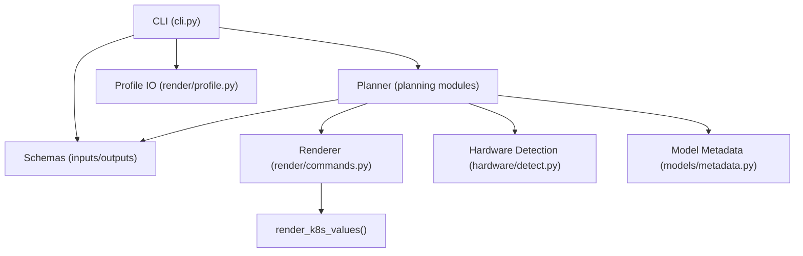
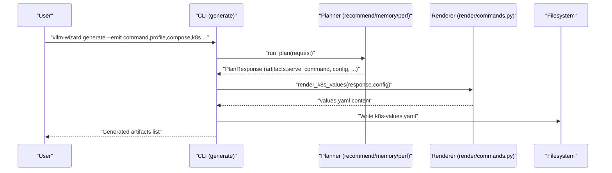
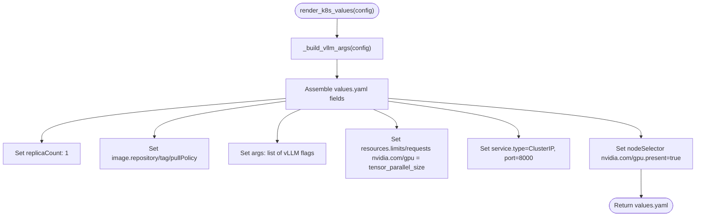
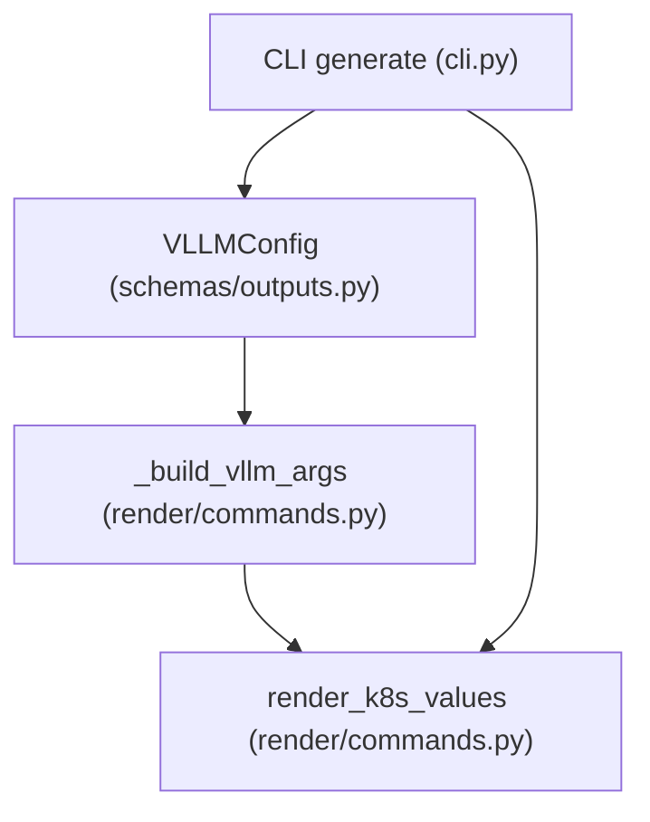

# Kubernetes Artifact Generation

<cite>
**Referenced Files in This Document**
- [README.md](file://README.md)
- [requirements.txt](file://requirements.txt)
- [src/vllm_wizard/cli.py](file://src/vllm_wizard/cli.py)
- [src/vllm_wizard/render/commands.py](file://src/vllm_wizard/render/commands.py)
- [src/vllm_wizard/render/profile.py](file://src/vllm_wizard/render/profile.py)
- [src/vllm_wizard/schemas/inputs.py](file://src/vllm_wizard/schemas/inputs.py)
- [src/vllm_wizard/schemas/outputs.py](file://src/vllm_wizard/schemas/outputs.py)
- [src/vllm_wizard/planning/memory.py](file://src/vllm_wizard/planning/memory.py)
- [src/vllm_wizard/planning/recommend.py](file://src/vllm_wizard/planning/recommend.py)
- [src/vllm_wizard/planning/perf.py](file://src/vllm_wizard/planning/perf.py)
</cite>

## Table of Contents
1. [Introduction](#introduction)
2. [Project Structure](#project-structure)
3. [Core Components](#core-components)
4. [Architecture Overview](#architecture-overview)
5. [Detailed Component Analysis](#detailed-component-analysis)
6. [Dependency Analysis](#dependency-analysis)
7. [Performance Considerations](#performance-considerations)
8. [Troubleshooting Guide](#troubleshooting-guide)
9. [Conclusion](#conclusion)
10. [Appendices](#appendices)

## Introduction
This document explains Kubernetes artifact generation with a focus on the render_k8s_values function and its Kubernetes-specific parameter mapping. It details how the tool generates Helm values.yaml content for deploying vLLM on Kubernetes clusters, including:
- How replicaCount is configured
- How container image settings are mapped from the recommendation engine
- How resource allocation uses nvidia.com/gpu limits and requests
- How service configuration and node selectors are set for GPU nodes
- Practical examples of generated Kubernetes manifests for different cluster configurations
- Integration guidance with GPU operator and device plugins
- Namespace considerations, RBAC permissions, and Helm chart deployment patterns
- Troubleshooting guidance for GPU scheduling and resource allocation issues

The repository provides a CLI that can emit Kubernetes values.yaml alongside other artifacts, and the render_k8s_values function is the core implementation responsible for translating the planner’s VLLM configuration into a values.yaml suitable for Helm.

## Project Structure
The repository follows a modular structure:
- CLI entrypoints orchestrate planning and artifact emission
- Rendering functions generate artifacts (including Kubernetes values.yaml)
- Schemas define input, output, and configuration models
- Planning modules compute feasibility, recommendations, and performance
- Hardware detection and model metadata modules support sizing decisions

**Diagram sources**
- [src/vllm_wizard/cli.py](file://src/vllm_wizard/cli.py#L215-L381)
- [src/vllm_wizard/render/commands.py](file://src/vllm_wizard/render/commands.py#L116-L156)
- [src/vllm_wizard/render/profile.py](file://src/vllm_wizard/render/profile.py#L30-L173)
- [src/vllm_wizard/schemas/inputs.py](file://src/vllm_wizard/schemas/inputs.py#L54-L110)
- [src/vllm_wizard/schemas/outputs.py](file://src/vllm_wizard/schemas/outputs.py#L57-L118)

**Section sources**
- [README.md](file://README.md#L1-L308)
- [requirements.txt](file://requirements.txt#L426-L467)

## Core Components
This section focuses on the Kubernetes values.yaml generation and the render_k8s_values function.

- render_k8s_values(VLLMConfig) produces a values.yaml fragment for Helm charts. It:
  - Sets replicaCount to 1 by default
  - Maps container image repository, tag, and pull policy
  - Translates vLLM arguments from the VLLMConfig into the args list
  - Sets nvidia.com/gpu resource limits and requests equal to tensor_parallel_size
  - Adds a ClusterIP service on port 8000
  - Applies a nodeSelector requiring nvidia.com/gpu.present=true

- The VLLMConfig model carries the recommended settings computed by the planner, including tensor_parallel_size, dtype, gpu_memory_utilization, max_model_len, and optional quantization/kv_cache_dtype flags.

- The CLI supports emitting Kubernetes artifacts via the generate command with the --emit option including k8s.

Key implementation references:
- render_k8s_values: [src/vllm_wizard/render/commands.py](file://src/vllm_wizard/render/commands.py#L116-L156)
- VLLMConfig: [src/vllm_wizard/schemas/outputs.py](file://src/vllm_wizard/schemas/outputs.py#L57-L75)
- CLI emit handling: [src/vllm_wizard/cli.py](file://src/vllm_wizard/cli.py#L341-L346)

**Section sources**
- [src/vllm_wizard/render/commands.py](file://src/vllm_wizard/render/commands.py#L116-L156)
- [src/vllm_wizard/schemas/outputs.py](file://src/vllm_wizard/schemas/outputs.py#L57-L75)
- [src/vllm_wizard/cli.py](file://src/vllm_wizard/cli.py#L341-L346)

## Architecture Overview
The Kubernetes artifact generation pipeline integrates the planner’s recommendations with the renderer to produce a values.yaml suitable for Helm.

**Diagram sources**
- [src/vllm_wizard/cli.py](file://src/vllm_wizard/cli.py#L273-L381)
- [src/vllm_wizard/render/commands.py](file://src/vllm_wizard/render/commands.py#L116-L156)
- [src/vllm_wizard/schemas/outputs.py](file://src/vllm_wizard/schemas/outputs.py#L94-L118)

## Detailed Component Analysis

### render_k8s_values Function
The render_k8s_values function translates a VLLMConfig into a values.yaml fragment for Helm. It:
- Builds the vLLM CLI argument list from VLLMConfig
- Emits a values.yaml with:
  - replicaCount: 1
  - image.repository, image.tag, image.pullPolicy
  - args: list of vLLM CLI flags
  - resources.limits.nvidia.com/gpu and requests.nvidia.com/gpu equal to tensor_parallel_size
  - service.type: ClusterIP, service.port: 8000
  - nodeSelector.nvidia.com/gpu.present: "true"

**Diagram sources**
- [src/vllm_wizard/render/commands.py](file://src/vllm_wizard/render/commands.py#L116-L156)
- [src/vllm_wizard/render/commands.py](file://src/vllm_wizard/render/commands.py#L158-L196)

**Section sources**
- [src/vllm_wizard/render/commands.py](file://src/vllm_wizard/render/commands.py#L116-L156)
- [src/vllm_wizard/render/commands.py](file://src/vllm_wizard/render/commands.py#L158-L196)

### Kubernetes Parameter Mapping
The function maps planner recommendations to Kubernetes values:
- replicaCount: 1 (fixed)
- image.*: repository, tag, pullPolicy
- args: constructed from tensor_parallel_size, dtype, gpu_memory_utilization, max_model_len, kv_cache_dtype, quantization, max_num_seqs, max_num_batched_tokens, swap_space, enforce_eager, trust_remote_code
- resources.limits.nvidia.com/gpu and requests.nvidia.com/gpu: both set to tensor_parallel_size
- service: type ClusterIP, port 8000
- nodeSelector: requires nvidia.com/gpu.present=true

These mappings ensure:
- Correct GPU resource consumption aligns with tensor_parallel_size
- Pods schedule only on nodes with GPUs
- Service exposes the vLLM OpenAI-compatible API on port 8000

**Section sources**
- [src/vllm_wizard/render/commands.py](file://src/vllm_wizard/render/commands.py#L116-L156)
- [src/vllm_wizard/render/commands.py](file://src/vllm_wizard/render/commands.py#L158-L196)
- [src/vllm_wizard/schemas/outputs.py](file://src/vllm_wizard/schemas/outputs.py#L57-L75)

### Service Configuration
- Service type: ClusterIP
- Port: 8000
- This aligns with the vLLM OpenAI-compatible API port used in the generated arguments.

Practical implication:
- Internal cluster access via ClusterIP
- Expose externally using ingress or port-forwarding as needed

**Section sources**
- [src/vllm_wizard/render/commands.py](file://src/vllm_wizard/render/commands.py#L147-L150)

### Node Selector and Pod Scheduling
- nodeSelector nvidia.com/gpu.present=true ensures pods land on nodes equipped with NVIDIA GPUs.
- Combined with nvidia.com/gpu resource requests/limits, this enforces correct scheduling.

Operational guidance:
- Ensure GPU operator/device-plugin is installed so that nvidia.com/gpu.present labels and CRDs exist
- Verify node labels and taints/tolerations if applicable

**Section sources**
- [src/vllm_wizard/render/commands.py](file://src/vllm_wizard/render/commands.py#L151-L153)

### Resource Allocation and GPU Limits
- Both limits and requests for nvidia.com/gpu are set to tensor_parallel_size
- This guarantees QoS and fair scheduling in multi-tenant clusters
- Aligns with the tensor_parallel_size recommendation from the planner

**Section sources**
- [src/vllm_wizard/render/commands.py](file://src/vllm_wizard/render/commands.py#L141-L146)
- [src/vllm_wizard/planning/recommend.py](file://src/vllm_wizard/planning/recommend.py#L167-L333)

### Practical Examples of Generated Kubernetes Manifests
Below are example values.yaml fragments produced by render_k8s_values for different scenarios. Replace the placeholder values with actual values derived from the planner’s VLLMConfig.

Example A: Single GPU deployment
- replicaCount: 1
- image.repository: vllm/vllm-openai
- image.tag: latest
- image.pullPolicy: IfNotPresent
- args: [--model <id>, --tensor-parallel-size 1, --dtype auto, --gpu-memory-utilization 0.9, --max-model-len 4096, ...]
- resources.limits.nvidia.com/gpu: 1
- resources.requests.nvidia.com/gpu: 1
- service.type: ClusterIP
- service.port: 8000
- nodeSelector.nvidia.com/gpu.present: "true"

Example B: Multi-GPU deployment (tensor_parallel_size = 4)
- Same image settings
- args: [--model <id>, --tensor-parallel-size 4, ...]
- resources.limits.nvidia.com/gpu: 4
- resources.requests.nvidia.com/gpu: 4
- nodeSelector remains the same

Note: The args list includes all applicable flags from VLLMConfig, including optional ones such as kv_cache_dtype, quantization, max_num_seqs, max_num_batched_tokens, swap_space, enforce_eager, and trust_remote_code.

**Section sources**
- [src/vllm_wizard/render/commands.py](file://src/vllm_wizard/render/commands.py#L116-L156)
- [src/vllm_wizard/render/commands.py](file://src/vllm_wizard/render/commands.py#L158-L196)

### Integration with GPU Operator and Device Plugins
To ensure GPU scheduling and visibility:
- Install the NVIDIA GPU Operator and device plugins on the cluster
- Confirm that nodes are labeled with nvidia.com/gpu.present=true and expose nvidia.com/gpu resources
- Ensure the cluster’s scheduler recognizes nvidia.com/gpu resource names

Operational checks:
- kubectl describe node <gpu-node> | grep nvidia.com/gpu
- Verify that the pod spec includes requests/limits for nvidia.com/gpu equal to tensor_parallel_size

**Section sources**
- [src/vllm_wizard/render/commands.py](file://src/vllm_wizard/render/commands.py#L141-L153)

### Namespace Considerations, RBAC Permissions, and Helm Deployment Patterns
- Namespace: The generated values.yaml does not specify a namespace; Helm installation can target a chosen namespace
- RBAC: If deploying via RBAC-enabled clusters, ensure the service account used by Helm has permissions to create Deployments, Services, and PodSecurityPolicies (if enforced)
- Helm chart pattern: Use the generated values.yaml as a values file for a Helm chart that defines a Deployment and Service; the chart should template the vLLM container image and args from values

[No sources needed since this section provides general guidance]

### Relationship Between Planner Recommendations and Kubernetes Values
The render_k8s_values function consumes VLLMConfig, which is produced by the recommendation engine. The recommendation engine computes:
- tensor_parallel_size based on available GPUs and model weights
- dtype, gpu_memory_utilization, max_model_len, kv_cache_dtype, quantization, max_num_seqs, max_num_batched_tokens
These fields are translated into the args list and tensor_parallel_size into GPU resource requests/limits.

**Section sources**
- [src/vllm_wizard/planning/recommend.py](file://src/vllm_wizard/planning/recommend.py#L167-L333)
- [src/vllm_wizard/schemas/outputs.py](file://src/vllm_wizard/schemas/outputs.py#L57-L75)
- [src/vllm_wizard/render/commands.py](file://src/vllm_wizard/render/commands.py#L116-L156)

## Dependency Analysis
The Kubernetes values.yaml generation depends on:
- VLLMConfig (recommended settings)
- _build_vllm_args (argument construction)
- CLI emit handling (generate command)

**Diagram sources**
- [src/vllm_wizard/schemas/outputs.py](file://src/vllm_wizard/schemas/outputs.py#L57-L75)
- [src/vllm_wizard/render/commands.py](file://src/vllm_wizard/render/commands.py#L158-L196)
- [src/vllm_wizard/render/commands.py](file://src/vllm_wizard/render/commands.py#L116-L156)
- [src/vllm_wizard/cli.py](file://src/vllm_wizard/cli.py#L341-L346)

**Section sources**
- [src/vllm_wizard/schemas/outputs.py](file://src/vllm_wizard/schemas/outputs.py#L57-L75)
- [src/vllm_wizard/render/commands.py](file://src/vllm_wizard/render/commands.py#L116-L156)
- [src/vllm_wizard/render/commands.py](file://src/vllm_wizard/render/commands.py#L158-L196)
- [src/vllm_wizard/cli.py](file://src/vllm_wizard/cli.py#L341-L346)

## Performance Considerations
- GPU resource alignment: Setting requests and limits equal to tensor_parallel_size prevents overcommitment and improves predictability
- Scheduling efficiency: nodeSelector ensures pods only land on GPU nodes, reducing scheduling failures
- Throughput and latency: While values.yaml does not directly alter performance, correct GPU allocation and scheduling are prerequisites for accurate performance

[No sources needed since this section provides general guidance]

## Troubleshooting Guide
Common issues and resolutions:

- Pods stuck in Pending due to GPU resource requests
  - Symptom: Pending with events indicating unschedulable due to nvidia.com/gpu
  - Resolution: Verify GPU operator/device plugin installation, confirm node labels nvidia.com/gpu.present=true, and ensure tensor_parallel_size matches available GPUs

- Wrong image or tag
  - Symptom: ImagePullBackOff or ErrImageNotFound
  - Resolution: Update image.repository and image.tag in values.yaml to match a valid vLLM image

- Service connectivity issues
  - Symptom: Cannot reach port 8000
  - Resolution: Confirm service.type=ClusterIP and service.port=8000; use kubectl port-forward or expose via ingress as appropriate

- Incorrect tensor_parallel_size
  - Symptom: Out-of-memory errors or insufficient GPU resources
  - Resolution: Re-run planning to recomputed tensor_parallel_size; update values.yaml accordingly

- Missing trust_remote_code or quantization flags
  - Symptom: Unexpected behavior or missing features
  - Resolution: Ensure args include trust_remote_code and quantization flags as needed

**Section sources**
- [src/vllm_wizard/render/commands.py](file://src/vllm_wizard/render/commands.py#L141-L153)
- [src/vllm_wizard/render/commands.py](file://src/vllm_wizard/render/commands.py#L116-L156)

## Conclusion
The render_k8s_values function provides a focused, Kubernetes-ready values.yaml fragment for deploying vLLM with correct GPU resource allocation, service exposure, and node scheduling. By aligning tensor_parallel_size with GPU resources and leveraging the nodeSelector for GPU nodes, it simplifies Helm-based deployments. Integrating with the GPU operator and ensuring proper RBAC and namespace configuration completes a robust Kubernetes deployment pattern.

[No sources needed since this section summarizes without analyzing specific files]

## Appendices

### Appendix A: CLI Emit Options and Kubernetes Artifact
- The generate command supports --emit with k8s to include Kubernetes values.yaml
- The CLI writes k8s-values.yaml to the specified output directory

**Section sources**
- [src/vllm_wizard/cli.py](file://src/vllm_wizard/cli.py#L267-L269)
- [src/vllm_wizard/cli.py](file://src/vllm_wizard/cli.py#L341-L346)

### Appendix B: Relationship Between Inputs and Kubernetes Values
- Model, dtype, quantization, kv_cache_dtype, max_model_len, tensor_parallel_size, and other vLLM flags are captured in VLLMConfig
- render_k8s_values translates these into values.yaml fields

**Section sources**
- [src/vllm_wizard/schemas/inputs.py](file://src/vllm_wizard/schemas/inputs.py#L54-L110)
- [src/vllm_wizard/schemas/outputs.py](file://src/vllm_wizard/schemas/outputs.py#L57-L75)
- [src/vllm_wizard/render/commands.py](file://src/vllm_wizard/render/commands.py#L116-L156)