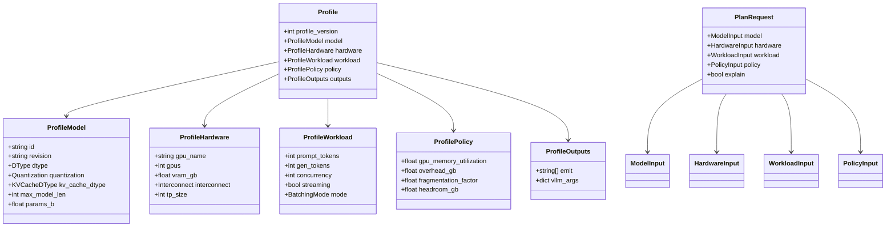

# YAML Profile Serialization

<cite>
**Referenced Files in This Document**
- [render/profile.py](file://src/vllm_wizard/render/profile.py)
- [schemas/profile.py](file://src/vllm_wizard/schemas/profile.py)
- [schemas/inputs.py](file://src/vllm_wizard/schemas/inputs.py)
- [schemas/outputs.py](file://src/vllm_wizard/schemas/outputs.py)
- [cli.py](file://src/vllm_wizard/cli.py)
- [examples/profiles/sample.yaml](file://examples/profiles/sample.yaml)
- [README.md](file://README.md)
- [requirements.txt](file://requirements.txt)
</cite>

## Table of Contents
1. [Introduction](#introduction)
2. [Project Structure](#project-structure)
3. [Core Components](#core-components)
4. [Architecture Overview](#architecture-overview)
5. [Detailed Component Analysis](#detailed-component-analysis)
6. [Dependency Analysis](#dependency-analysis)
7. [Performance Considerations](#performance-considerations)
8. [Troubleshooting Guide](#troubleshooting-guide)
9. [Conclusion](#conclusion)
10. [Appendices](#appendices)

## Introduction
This document explains YAML profile serialization and deserialization in the vLLM Wizard project. It focuses on the profile.py module functions for saving and loading configuration profiles, schema validation, data persistence, and configuration backup mechanisms. It also details the relationship between input schemas (inputs.py) and output schemas (outputs.py) in profile format, provides examples of complete profile files, and documents profile versioning, backward compatibility, and migration strategies. Finally, it covers profile sharing patterns, team collaboration workflows, configuration management best practices, and troubleshooting serialization issues.

## Project Structure
The profile system spans three primary areas:
- Rendering and persistence: render/profile.py
- Schema definitions: schemas/profile.py, schemas/inputs.py, schemas/outputs.py
- CLI integration: cli.py
- Example profile: examples/profiles/sample.yaml
- Documentation and requirements: README.md, requirements.txt

```mermaid
graph TB
subgraph "Rendering"
RP["render/profile.py"]
end
subgraph "Schemas"
SP["schemas/profile.py"]
SI["schemas/inputs.py"]
SO["schemas/outputs.py"]
end
subgraph "CLI"
CLI["cli.py"]
end
subgraph "Examples"
EX["examples/profiles/sample.yaml"]
end
RP --> SP
RP --> SI
CLI --> RP
CLI --> SI
CLI --> SO
EX --> RP
```

**Diagram sources**
- [render/profile.py](file://src/vllm_wizard/render/profile.py#L1-L173)
- [schemas/profile.py](file://src/vllm_wizard/schemas/profile.py#L1-L75)
- [schemas/inputs.py](file://src/vllm_wizard/schemas/inputs.py#L1-L110)
- [schemas/outputs.py](file://src/vllm_wizard/schemas/outputs.py#L1-L118)
- [cli.py](file://src/vllm_wizard/cli.py#L1-L385)
- [examples/profiles/sample.yaml](file://examples/profiles/sample.yaml#L1-L40)

**Section sources**
- [README.md](file://README.md#L1-L308)
- [requirements.txt](file://requirements.txt#L391-L404)

## Core Components
- Profile serialization and deserialization:
  - save_profile(profile, path): writes a Profile to YAML
  - load_profile(path): reads YAML and constructs a Profile
- Conversion helpers:
  - profile_to_request(profile): converts Profile to PlanRequest for planning
  - request_to_profile(request, emit): converts PlanRequest to Profile for persistence
- Profile schema:
  - Profile, ProfileModel, ProfileHardware, ProfileWorkload, ProfilePolicy, ProfileOutputs
- Input and output schemas:
  - PlanRequest and related inputs (ModelInput, HardwareInput, WorkloadInput, PolicyInput)
  - PlanResponse and related outputs (FeasibilityReport, VLLMConfig, PerfEstimate, Artifacts)

Key behaviors:
- save_profile uses model_dump(mode="json") to serialize enums and nested models to plain dicts suitable for YAML.
- load_profile uses yaml.safe_load and constructs a Profile via constructor.
- profile_to_request and request_to_profile bridge between the tool’s internal PlanRequest and the persisted Profile schema.

**Section sources**
- [render/profile.py](file://src/vllm_wizard/render/profile.py#L30-L173)
- [schemas/profile.py](file://src/vllm_wizard/schemas/profile.py#L16-L75)
- [schemas/inputs.py](file://src/vllm_wizard/schemas/inputs.py#L54-L110)
- [schemas/outputs.py](file://src/vllm_wizard/schemas/outputs.py#L37-L118)

## Architecture Overview
The profile pipeline connects CLI commands to rendering and schema layers.


**Diagram sources**
- [cli.py](file://src/vllm_wizard/cli.py#L146-L213)
- [render/profile.py](file://src/vllm_wizard/render/profile.py#L30-L173)
- [schemas/profile.py](file://src/vllm_wizard/schemas/profile.py#L66-L75)

## Detailed Component Analysis

### Profile Serialization Functions
- save_profile(profile, path)
  - Converts Profile to dict using model_dump(mode="json") to ensure enums and nested models are serialized to JSON-compatible structures.
  - Ensures parent directory exists, then writes YAML with default_flow_style=False and sort_keys=False for readability.
- load_profile(path)
  - Validates existence of the file; raises FileNotFoundError if missing.
  - Reads YAML via yaml.safe_load and constructs a Profile object.

Validation and error handling:
- load_profile raises FileNotFoundError for missing files.
- Profile construction validates types and defaults; invalid data will raise validation errors from Pydantic.

Persistence and backup:
- save_profile creates the directory if needed.
- To back up profiles, simply copy the YAML file; it is self-contained.

**Section sources**
- [render/profile.py](file://src/vllm_wizard/render/profile.py#L30-L66)

### Profile Schema Validation
Profile schema enforces:
- profile_version: integer with default 1
- model: ProfileModel with defaults for dtype, quantization, kv_cache_dtype, and optional fields
- hardware: ProfileHardware with defaults for gpu_name, gpus, interconnect, and optional fields
- workload: ProfileWorkload with defaults for prompt_tokens, gen_tokens, concurrency, streaming, and batching mode
- policy: ProfilePolicy with defaults for gpu_memory_utilization, fragmentation_factor, and headroom_gb
- outputs: ProfileOutputs with defaults for emit and empty vllm_args

Defaults ensure minimal profiles remain valid while still allowing customization.

**Section sources**
- [schemas/profile.py](file://src/vllm_wizard/schemas/profile.py#L16-L75)

### Relationship Between Input and Output Schemas in Profile Format
- Inputs (PlanRequest and related inputs) define the full set of configurable parameters for planning.
- Profile mirrors a subset of inputs plus outputs for persistence and regeneration.
- profile_to_request maps Profile to PlanRequest by extracting fields from Profile sections.
- request_to_profile maps PlanRequest to Profile, setting profile_version and assembling Profile sections.

This ensures:
- Profiles can be loaded and re-run to regenerate artifacts.
- Profiles capture only the essential configuration needed to reproduce results.



**Diagram sources**
- [schemas/profile.py](file://src/vllm_wizard/schemas/profile.py#L16-L75)
- [schemas/inputs.py](file://src/vllm_wizard/schemas/inputs.py#L54-L110)

**Section sources**
- [render/profile.py](file://src/vllm_wizard/render/profile.py#L68-L173)
- [schemas/inputs.py](file://src/vllm_wizard/schemas/inputs.py#L54-L110)
- [schemas/profile.py](file://src/vllm_wizard/schemas/profile.py#L16-L75)

### Complete Profile Examples
- A minimal profile example is provided in examples/profiles/sample.yaml.
- The example demonstrates all top-level sections and typical values for each field.

Example reference:
- [examples/profiles/sample.yaml](file://examples/profiles/sample.yaml#L1-L40)

Documentation reference:
- [README.md](file://README.md#L215-L239)

**Section sources**
- [examples/profiles/sample.yaml](file://examples/profiles/sample.yaml#L1-L40)
- [README.md](file://README.md#L215-L239)

### Profile Versioning, Backward Compatibility, and Migration Strategies
- Profile schema includes profile_version with default 1.
- The CLI and rendering code set profile_version=1 when converting PlanRequest to Profile.
- Backward compatibility:
  - If future versions introduce breaking changes, increment profile_version and implement a loader that detects version and applies migrations.
- Migration strategy outline:
  - Add a version-aware loader that checks profile_version and transforms older structures into the current schema before constructing Profile.
  - Preserve emit and vllm_args to maintain artifact generation preferences.

**Section sources**
- [schemas/profile.py](file://src/vllm_wizard/schemas/profile.py#L69-L69)
- [render/profile.py](file://src/vllm_wizard/render/profile.py#L165-L167)
- [requirements.txt](file://requirements.txt#L391-L404)

### Profile Sharing Patterns and Team Collaboration Workflows
- Share YAML profiles across teams to standardize configurations.
- Use version control to track profile changes and review diffs.
- Encourage documenting environment-specific overrides (e.g., vram_gb, interconnect) separately from shared baselines.
- Use CLI commands to generate new profiles from existing ones and iterate collaboratively.

**Section sources**
- [README.md](file://README.md#L80-L88)
- [cli.py](file://src/vllm_wizard/cli.py#L146-L213)

### Configuration Management Best Practices
- Keep profiles minimal and explicit; rely on defaults for non-critical fields.
- Use emit lists to control which artifacts are generated and stored.
- Store vllm_args in outputs.vllm_args for advanced tuning without changing the core schema.
- Regularly back up profiles alongside generated artifacts.

**Section sources**
- [schemas/profile.py](file://src/vllm_wizard/schemas/profile.py#L57-L63)
- [render/profile.py](file://src/vllm_wizard/render/profile.py#L30-L44)

## Dependency Analysis
- render/profile.py depends on:
  - schemas/profile.py for Profile and nested models
  - schemas/inputs.py for enums and types used in conversion
  - PyYAML for YAML serialization/deserialization
- cli.py integrates:
  - load_profile and save_profile for profile I/O
  - profile_to_request and request_to_profile for conversion
  - schemas/inputs.py and schemas/outputs.py for PlanRequest and PlanResponse types


**Diagram sources**
- [cli.py](file://src/vllm_wizard/cli.py#L15-L21)
- [render/profile.py](file://src/vllm_wizard/render/profile.py#L8-L27)
- [schemas/profile.py](file://src/vllm_wizard/schemas/profile.py#L7-L13)
- [schemas/inputs.py](file://src/vllm_wizard/schemas/inputs.py#L3-L6)
- [schemas/outputs.py](file://src/vllm_wizard/schemas/outputs.py#L3-L6)

**Section sources**
- [cli.py](file://src/vllm_wizard/cli.py#L15-L21)
- [render/profile.py](file://src/vllm_wizard/render/profile.py#L8-L27)

## Performance Considerations
- YAML serialization is lightweight and human-readable; suitable for configuration files.
- model_dump(mode="json") ensures enums and nested models are serialized efficiently.
- For large profiles, consider compressing artifacts externally if needed, but YAML remains the preferred format for portability.

[No sources needed since this section provides general guidance]

## Troubleshooting Guide
Common issues and resolutions:
- Profile not found
  - Symptom: FileNotFoundError raised by load_profile.
  - Resolution: Verify the path exists and is readable.
  - Section sources
    - [render/profile.py](file://src/vllm_wizard/render/profile.py#L59-L61)
- Invalid profile data
  - Symptom: ValueError from Profile constructor.
  - Resolution: Ensure all required fields are present and types match expectations; refer to Profile schema defaults and types.
  - Section sources
    - [schemas/profile.py](file://src/vllm_wizard/schemas/profile.py#L16-L75)
- Missing fields in profile
  - Symptom: Validation errors indicating missing required fields.
  - Resolution: Add missing fields or rely on defaults where applicable.
  - Section sources
    - [schemas/profile.py](file://src/vllm_wizard/schemas/profile.py#L19-L25)
- Serialization issues
  - Symptom: YAML dump errors or unreadable output.
  - Resolution: Ensure enums and nested models are serializable; save_profile uses model_dump(mode="json") to handle this.
  - Section sources
    - [render/profile.py](file://src/vllm_wizard/render/profile.py#L38-L43)
- CLI integration errors
  - Symptom: Errors during plan or generate when using --profile.
  - Resolution: Check that the profile file is valid YAML and conforms to the Profile schema; confirm emit options for generate.
  - Section sources
    - [cli.py](file://src/vllm_wizard/cli.py#L156-L213)
    - [cli.py](file://src/vllm_wizard/cli.py#L279-L381)

## Conclusion
The vLLM Wizard’s profile system provides a robust, versioned, and human-readable way to persist and share configuration. The render/profile.py module offers straightforward save/load functions backed by Pydantic schemas, while conversion helpers ensure seamless integration with the planning pipeline. By following the best practices outlined here—minimal profiles, clear versioning, and disciplined sharing—you can reliably collaborate on and maintain configurations across teams and environments.

[No sources needed since this section summarizes without analyzing specific files]

## Appendices

### Appendix A: Profile Schema Fields Reference
- profile_version: integer (default 1)
- model: id, revision, dtype, quantization, kv_cache_dtype, max_model_len, params_b
- hardware: gpu_name, gpus, vram_gb, interconnect, tp_size
- workload: prompt_tokens, gen_tokens, concurrency, streaming, mode
- policy: gpu_memory_utilization, overhead_gb, fragmentation_factor, headroom_gb
- outputs: emit (list), vllm_args (dict)

**Section sources**
- [schemas/profile.py](file://src/vllm_wizard/schemas/profile.py#L16-L75)

### Appendix B: CLI Usage for Profiles
- Loading a profile: vllm-wizard plan --profile <path>
- Generating artifacts from a profile: vllm-wizard generate --output-dir <dir> --profile <path>
- Emit options: command, profile, compose, k8s

**Section sources**
- [README.md](file://README.md#L80-L88)
- [cli.py](file://src/vllm_wizard/cli.py#L146-L213)
- [cli.py](file://src/vllm_wizard/cli.py#L270-L381)