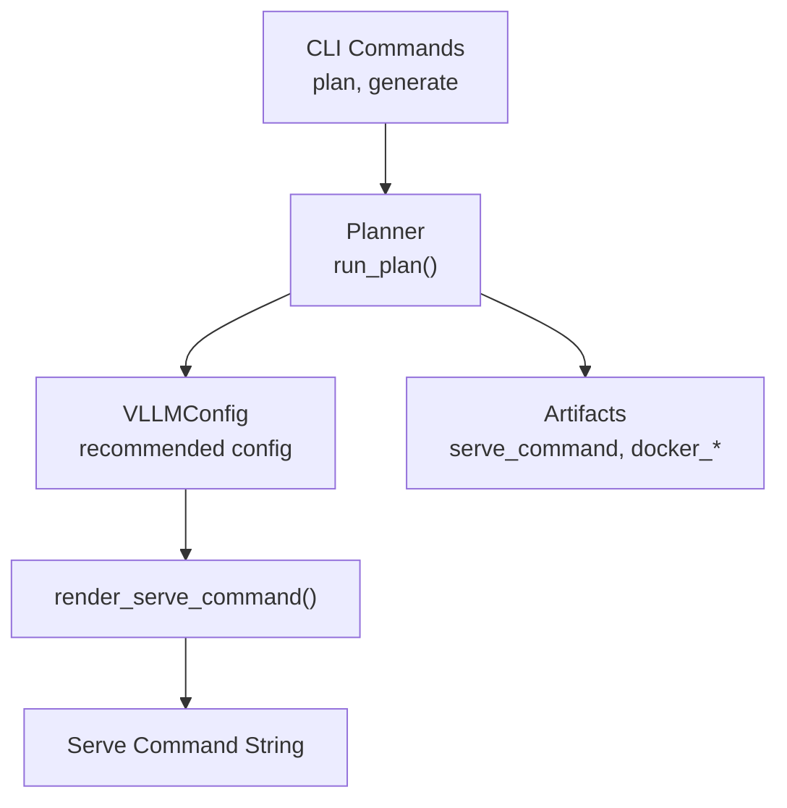
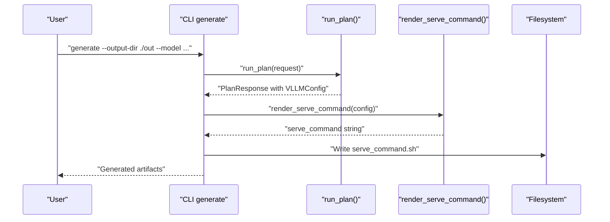
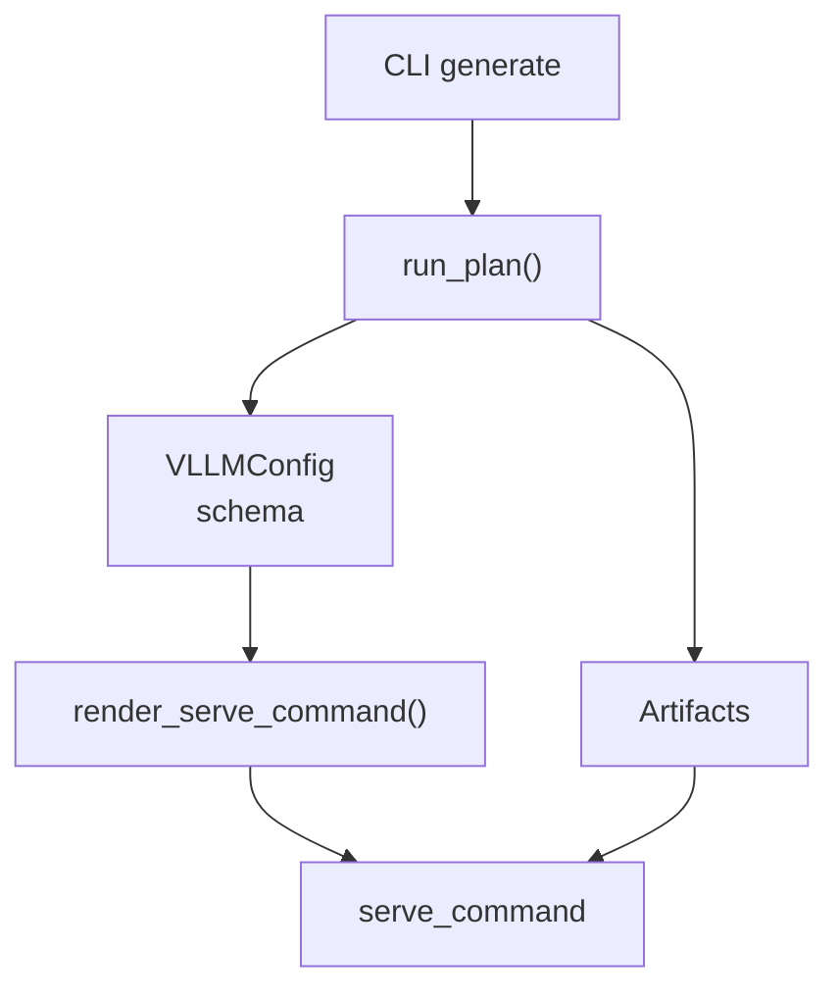

# vLLM Serve Command Generation

<cite>
**Referenced Files in This Document**
- [commands.py](file://src/vllm_wizard/render/commands.py)
- [outputs.py](file://src/vllm_wizard/schemas/outputs.py)
- [inputs.py](file://src/vllm_wizard/schemas/inputs.py)
- [planner.py](file://src/vllm_wizard/planning/planner.py)
- [cli.py](file://src/vllm_wizard/cli.py)
- [detect.py](file://src/vllm_wizard/hardware/detect.py)
- [sample.yaml](file://examples/profiles/sample.yaml)
- [README.md](file://README.md)
</cite>

## Table of Contents
1. [Introduction](#introduction)
2. [Project Structure](#project-structure)
3. [Core Components](#core-components)
4. [Architecture Overview](#architecture-overview)
5. [Detailed Component Analysis](#detailed-component-analysis)
6. [Dependency Analysis](#dependency-analysis)
7. [Performance Considerations](#performance-considerations)
8. [Troubleshooting Guide](#troubleshooting-guide)
9. [Conclusion](#conclusion)
10. [Appendices](#appendices)

## Introduction
This document explains how the vLLM Wizard renders the vLLM serve command from a configuration object. It focuses on the render_serve_command function, detailing how VLLMConfig parameters map to CLI arguments, including defaults, validations, and practical examples. It also covers command formatting, argument ordering, and optimization recommendations for different model sizes and hardware configurations.

## Project Structure
The vLLM Wizard organizes command rendering in a dedicated module, with configuration schemas and planning orchestration feeding into the renderer.

**Diagram sources**
- [cli.py](file://src/vllm_wizard/cli.py#L215-L381)
- [planner.py](file://src/vllm_wizard/planning/planner.py#L21-L135)
- [commands.py](file://src/vllm_wizard/render/commands.py#L6-L45)
- [outputs.py](file://src/vllm_wizard/schemas/outputs.py#L57-L75)

**Section sources**
- [cli.py](file://src/vllm_wizard/cli.py#L215-L381)
- [planner.py](file://src/vllm_wizard/planning/planner.py#L21-L135)
- [commands.py](file://src/vllm_wizard/render/commands.py#L6-L45)
- [outputs.py](file://src/vllm_wizard/schemas/outputs.py#L57-L75)

## Core Components
- render_serve_command: Converts a VLLMConfig object into a formatted vLLM serve command string with proper line continuation and argument ordering.
- VLLMConfig: The configuration model containing all parameters that map to vLLM CLI arguments.
- CLI generate: Orchestrates planning and writes the serve command to a shell script artifact.

Key responsibilities:
- Parameter mapping from VLLMConfig to CLI arguments
- Optional parameter handling (only present when set)
- Argument ordering and formatting for readability

**Section sources**
- [commands.py](file://src/vllm_wizard/render/commands.py#L6-L45)
- [outputs.py](file://src/vllm_wizard/schemas/outputs.py#L57-L75)
- [cli.py](file://src/vllm_wizard/cli.py#L325-L328)

## Architecture Overview
The serve command generation pipeline:

**Diagram sources**
- [cli.py](file://src/vllm_wizard/cli.py#L273-L381)
- [planner.py](file://src/vllm_wizard/planning/planner.py#L21-L135)
- [commands.py](file://src/vllm_wizard/render/commands.py#L6-L45)

## Detailed Component Analysis

### render_serve_command Function
Purpose:
- Convert a VLLMConfig object into a single-line command string with proper argument formatting and line continuation.

Behavior:
- Required arguments are always included: model, tensor-parallel-size, dtype, gpu-memory-utilization, max-model-len.
- Optional arguments are included only when their corresponding VLLMConfig field is set (not None).
- Arguments are joined with a line continuation pattern for readability.

Argument mapping from VLLMConfig to CLI:
- model -> positional model argument
- tensor_parallel_size -> --tensor-parallel-size
- dtype -> --dtype
- gpu_memory_utilization -> --gpu-memory-utilization
- max_model_len -> --max-model-len
- kv_cache_dtype -> --kv-cache-dtype
- quantization -> --quantization
- max_num_seqs -> --max-num-seqs
- max_num_batched_tokens -> --max-num-batched-tokens
- swap_space -> --swap-space
- enforce_eager -> --enforce-eager
- trust_remote_code -> --trust-remote-code

Validation and defaults:
- Required fields are enforced by the VLLMConfig model definition.
- Optional fields default to None; they appear only when explicitly set.

Formatting:
- Uses a consistent join pattern with line continuation for long commands.

**Section sources**
- [commands.py](file://src/vllm_wizard/render/commands.py#L6-L45)
- [outputs.py](file://src/vllm_wizard/schemas/outputs.py#L57-L75)

### VLLMConfig Schema
Fields and defaults:
- model: string (required)
- tensor_parallel_size: int = 1
- dtype: string = "auto"
- gpu_memory_utilization: float = 0.90
- max_model_len: int (required)
- kv_cache_dtype: Optional[string] = None
- quantization: Optional[string] = None
- swap_space: Optional[int] = None
- enforce_eager: Optional[bool] = None
- max_num_seqs: Optional[int] = None
- max_num_batched_tokens: Optional[int] = None
- trust_remote_code: Optional[bool] = None

Constraints and validations:
- Fields are validated by Pydantic BaseModel; required fields must be provided.
- Optional fields are omitted from the command when None.

Relationship to CLI:
- Each field corresponds to a CLI flag or positional argument as documented above.

**Section sources**
- [outputs.py](file://src/vllm_wizard/schemas/outputs.py#L57-L75)

### CLI Integration
- The generate command builds a PlanRequest, runs planning, and writes the serve command to serve_command.sh.
- The serve command is embedded in the PlanResponse.artifacts.serve_command.

Practical impact:
- Users can review the generated command before deployment.
- The command includes all necessary flags for the recommended configuration.

**Section sources**
- [cli.py](file://src/vllm_wizard/cli.py#L325-L328)
- [planner.py](file://src/vllm_wizard/planning/planner.py#L120-L128)

### Parameter Validation and Defaults
- Required parameters are enforced by the VLLMConfig model.
- Optional parameters are conditionally included in the rendered command.
- Defaults for optional parameters are None; they do not appear in the command unless set.

Validation examples from schemas:
- DType, Quantization, KVCacheDType enums define allowed values for dtype-related parameters.
- PolicyInput defines allowable ranges for gpu_memory_utilization and other policy fields.

**Section sources**
- [inputs.py](file://src/vllm_wizard/schemas/inputs.py#L9-L36)
- [inputs.py](file://src/vllm_wizard/schemas/inputs.py#L92-L99)

### Practical Examples

#### Example 1: Small Model on Single GPU
- Model: small model (e.g., 7B)
- Hardware: single GPU
- Configuration: tensor_parallel_size = 1, dtype = "auto", gpu_memory_utilization = 0.90
- Generated command includes required flags and any optional flags that are set.

#### Example 2: Large Model with Tensor Parallelism
- Model: large model (e.g., 70B)
- Hardware: multiple GPUs with tensor_parallel_size = 4
- Configuration: kv_cache_dtype = "fp16", quantization = "awq", max_num_seqs = 100
- Generated command includes all relevant flags with proper ordering.

#### Example 3: Quantized Model with Swap Space
- Model: quantized model
- Configuration: quantization = "gptq", swap_space = 8, enforce_eager = True
- Generated command includes quantization, swap-space, and enforce-eager flags.

Note: These examples illustrate parameter combinations; the actual command text is generated dynamically from VLLMConfig.

**Section sources**
- [README.md](file://README.md#L243-L276)
- [sample.yaml](file://examples/profiles/sample.yaml#L6-L39)

### Command Formatting and Argument Ordering
- The renderer constructs a list of command parts and joins them with a line continuation pattern.
- Required arguments appear first, followed by optional arguments.
- This ensures predictable and readable command formatting.

**Section sources**
- [commands.py](file://src/vllm_wizard/render/commands.py#L15-L45)

## Dependency Analysis
The serve command generation depends on the configuration model and is integrated into the CLI and planning pipeline.

**Diagram sources**
- [outputs.py](file://src/vllm_wizard/schemas/outputs.py#L57-L75)
- [commands.py](file://src/vllm_wizard/render/commands.py#L6-L45)
- [planner.py](file://src/vllm_wizard/planning/planner.py#L120-L128)
- [cli.py](file://src/vllm_wizard/cli.py#L325-L328)

**Section sources**
- [outputs.py](file://src/vllm_wizard/schemas/outputs.py#L57-L75)
- [commands.py](file://src/vllm_wizard/render/commands.py#L6-L45)
- [planner.py](file://src/vllm_wizard/planning/planner.py#L120-L128)
- [cli.py](file://src/vllm_wizard/cli.py#L325-L328)

## Performance Considerations
- Choose tensor_parallel_size based on available GPUs to maximize throughput while fitting within VRAM.
- Use appropriate dtype and quantization to reduce memory footprint.
- Tune gpu_memory_utilization to balance performance and safety margins.
- Consider kv_cache_dtype and fragmentation factors for large contexts and high concurrency.

[No sources needed since this section provides general guidance]

## Troubleshooting Guide
Common issues and resolutions:
- Out-of-memory errors: Reduce gpu_memory_utilization, enable quantization, lower max_model_len, or increase swap_space.
- Slow performance: Increase tensor_parallel_size (if VRAM allows), adjust batching parameters, or switch to a higher-performance GPU.
- Remote code execution: Enable trust_remote_code only when necessary and from trusted sources.
- Command readability: The renderer formats the command with line continuation; review the generated serve_command.sh for clarity.

**Section sources**
- [README.md](file://README.md#L171-L190)
- [outputs.py](file://src/vllm_wizard/schemas/outputs.py#L57-L75)

## Conclusion
The render_serve_command function provides a reliable bridge between the VLLMWizard’s configuration model and the vLLM serve CLI. By mapping VLLMConfig fields to CLI arguments, it enables reproducible and optimized deployments across diverse model sizes and hardware configurations. Use the provided examples and troubleshooting tips to tailor configurations for your specific use case.

[No sources needed since this section summarizes without analyzing specific files]

## Appendices

### Appendix A: Parameter Reference
- tensor-parallel-size: Maps to tensor_parallel_size
- dtype: Maps to dtype
- gpu-memory-utilization: Maps to gpu_memory_utilization
- max-model-len: Maps to max_model_len
- kv-cache-dtype: Maps to kv_cache_dtype
- quantization: Maps to quantization
- max-num-seqs: Maps to max_num_seqs
- max-num-batched-tokens: Maps to max_num_batched_tokens
- swap-space: Maps to swap_space
- enforce-eager: Maps to enforce_eager
- trust-remote-code: Maps to trust_remote_code

**Section sources**
- [commands.py](file://src/vllm_wizard/render/commands.py#L18-L43)
- [outputs.py](file://src/vllm_wizard/schemas/outputs.py#L61-L71)

### Appendix B: CLI Usage Patterns
- Use the generate command to produce serve_command.sh and other artifacts.
- Combine with profiles for reproducible configurations.
- Review the console report for feasibility and performance estimates before deployment.

**Section sources**
- [cli.py](file://src/vllm_wizard/cli.py#L273-L381)
- [README.md](file://README.md#L64-L88)