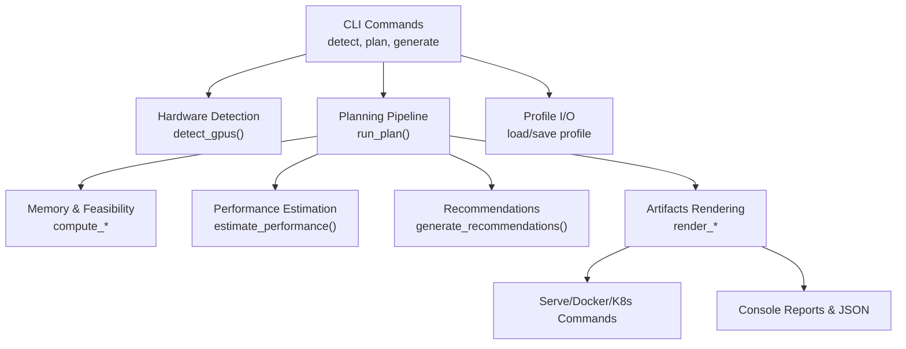
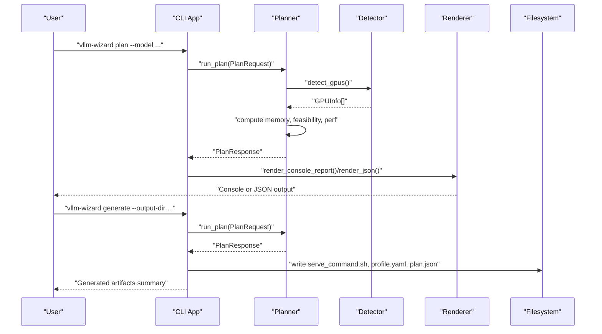
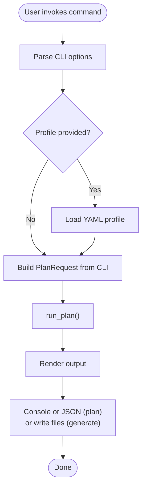
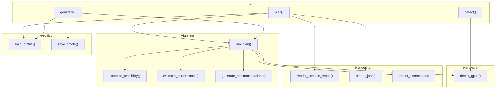

# Command Reference

<cite>
**Referenced Files in This Document**
- [cli.py](file://src/vllm_wizard/cli.py)
- [detect.py](file://src/vllm_wizard/hardware/detect.py)
- [planner.py](file://src/vllm_wizard/planning/planner.py)
- [commands.py](file://src/vllm_wizard/render/commands.py)
- [report.py](file://src/vllm_wizard/render/report.py)
- [profile.py](file://src/vllm_wizard/render/profile.py)
- [inputs.py](file://src/vllm_wizard/schemas/inputs.py)
- [outputs.py](file://src/vllm_wizard/schemas/outputs.py)
- [profile_schema.py](file://src/vllm_wizard/schemas/profile.py)
- [README.md](file://README.md)
- [test_cli.py](file://tests/test_cli.py)
- [sample.yaml](file://examples/profiles/sample.yaml)
</cite>

## Table of Contents
1. [Introduction](#introduction)
2. [Project Structure](#project-structure)
3. [Core Components](#core-components)
4. [Architecture Overview](#architecture-overview)
5. [Detailed Component Analysis](#detailed-component-analysis)
6. [Dependency Analysis](#dependency-analysis)
7. [Performance Considerations](#performance-considerations)
8. [Troubleshooting Guide](#troubleshooting-guide)
9. [Conclusion](#conclusion)
10. [Appendices](#appendices)

## Introduction
This document provides a comprehensive command reference for the vLLM Config Wizard CLI. It covers the three primary commands:
- vllm-wizard detect: Detect and list available NVIDIA GPUs
- vllm-wizard plan: Compute feasibility, recommendations, and performance estimates
- vllm-wizard generate: Generate configuration artifacts to disk

For each command, you will find detailed option descriptions, parameter explanations, defaults, usage examples, JSON output specifications, and guidance on when to use different output modes. The document also explains command combinations, chaining patterns, troubleshooting, performance considerations, and integration with shell scripts and CI/CD pipelines.

## Project Structure
The CLI is implemented using Typer and integrates with several modules:
- CLI entrypoints and command definitions
- Hardware detection via nvidia-smi
- Planning pipeline orchestrating memory feasibility, recommendations, and performance
- Rendering of console reports and artifacts
- Schema definitions for inputs, outputs, and profiles

**Diagram sources**
- [cli.py](file://src/vllm_wizard/cli.py#L62-L381)
- [detect.py](file://src/vllm_wizard/hardware/detect.py#L10-L72)
- [planner.py](file://src/vllm_wizard/planning/planner.py#L21-L136)
- [commands.py](file://src/vllm_wizard/render/commands.py#L6-L196)
- [report.py](file://src/vllm_wizard/render/report.py#L14-L272)
- [profile.py](file://src/vllm_wizard/render/profile.py#L30-L173)

**Section sources**
- [cli.py](file://src/vllm_wizard/cli.py#L1-L385)
- [README.md](file://README.md#L1-L308)

## Core Components
- CLI module defines the Typer app, callbacks, and command functions for detect, plan, and generate.
- Hardware detection module queries nvidia-smi and provides fallback GPU specs.
- Planning module orchestrates model metadata loading, hardware resolution, memory computation, feasibility checks, recommendations, performance estimation, and artifact generation.
- Rendering module produces console reports, JSON output, and various artifacts (serve command, docker-compose, Kubernetes values).
- Schemas define typed inputs, outputs, and profiles for consistent data flow.

**Section sources**
- [cli.py](file://src/vllm_wizard/cli.py#L62-L381)
- [detect.py](file://src/vllm_wizard/hardware/detect.py#L10-L72)
- [planner.py](file://src/vllm_wizard/planning/planner.py#L21-L136)
- [commands.py](file://src/vllm_wizard/render/commands.py#L6-L196)
- [report.py](file://src/vllm_wizard/render/report.py#L14-L272)
- [inputs.py](file://src/vllm_wizard/schemas/inputs.py#L9-L110)
- [outputs.py](file://src/vllm_wizard/schemas/outputs.py#L9-L118)
- [profile_schema.py](file://src/vllm_wizard/schemas/profile.py#L16-L75)

## Architecture Overview
The CLI commands delegate to internal modules. The plan command builds a PlanRequest from either CLI flags or a profile, runs the planning pipeline, and renders either a console report or JSON. The generate command performs the same planning and writes artifacts to disk.

**Diagram sources**
- [cli.py](file://src/vllm_wizard/cli.py#L82-L213)
- [cli.py](file://src/vllm_wizard/cli.py#L215-L381)
- [planner.py](file://src/vllm_wizard/planning/planner.py#L21-L136)
- [detect.py](file://src/vllm_wizard/hardware/detect.py#L10-L72)
- [report.py](file://src/vllm_wizard/render/report.py#L14-L272)
- [commands.py](file://src/vllm_wizard/render/commands.py#L6-L196)

## Detailed Component Analysis

### vllm-wizard detect
Purpose: Detect available NVIDIA GPUs and print a formatted list or JSON.

Options
- --json: Output detected GPUs as JSON. Each entry includes name, VRAM in MiB, driver version, and CUDA version.

Behavior
- Uses nvidia-smi to query GPU names and memory totals.
- Attempts to fetch driver and CUDA versions and compute capability.
- Returns an empty list if nvidia-smi is unavailable or times out.

Default Values
- No defaults for detect; it prints detected GPUs or a message if none are found.

Usage Examples
- Detect GPUs: vllm-wizard detect
- JSON output: vllm-wizard detect --json

JSON Output Format
- Array of objects with fields:
  - name: GPU device name
  - vram_mib: Total VRAM in MiB
  - driver_version: NVIDIA driver version (if available)
  - cuda_version: CUDA version (if available)
  - compute_capability: Compute capability (if available)

When to Use Different Output Modes
- Human-readable list: Use without --json for quick inspection.
- Machine-readable: Use --json for scripts and automation.

Command Combinations and Chaining Patterns
- Combine with plan to auto-detect GPUs and then plan: detect --json | jq ... | plan --gpu "..." --gpus N
- Pipe JSON to external tools for filtering or aggregation.

Troubleshooting
- If no GPUs are detected, ensure nvidia-smi is installed and accessible, and that GPUs are available.
- On systems without NVIDIA drivers, expect an empty list.

Performance Considerations
- The detection process executes nvidia-smi multiple times; avoid running frequently in tight loops.

Best Practices
- Use --json in CI/CD to parse GPU inventory programmatically.
- Cache detection results when running multiple commands in the same session.

**Section sources**
- [cli.py](file://src/vllm_wizard/cli.py#L62-L80)
- [detect.py](file://src/vllm_wizard/hardware/detect.py#L10-L72)
- [report.py](file://src/vllm_wizard/render/report.py#L241-L272)
- [test_cli.py](file://tests/test_cli.py#L16-L50)

### vllm-wizard plan
Purpose: Compute VRAM feasibility, generate recommendations, and estimate performance. Outputs either a human-readable report or JSON.

Options (Model)
- --model, -m: Hugging Face model ID or local path (required)
- --revision: Model revision/branch
- --dtype: Weight dtype (auto, fp16, bf16, fp32); default auto
- --quantization, -q: Quantization method (none, awq, gptq, int8, fp8); default none
- --kv-cache-dtype: KV cache dtype (auto, fp16, bf16, fp8_e4m3fn, fp8_e5m2); default auto
- --max-model-len: Target context length; if omitted, uses model’s max position embeddings
- --params-b: Override model parameters in billions

Options (Hardware)
- --gpu: GPU name or "auto" for detection; default auto
- --gpus: Number of GPUs; default 1
- --vram-gb: VRAM per GPU in GB; if provided, used for manual hardware spec
- --interconnect: GPU interconnect (pcie, nvlink, unknown); default unknown
- --tensor-parallel-size, --tp: Tensor parallel size; if omitted, auto-selected based on detected GPUs

Options (Workload)
- --prompt-tokens: Typical prompt token count; default 512
- --gen-tokens: Typical generation token count; default 256
- --concurrency, -c: Concurrent sequences; default 1
- --batching-mode: Batching optimization mode (throughput, latency, balanced); default balanced

Options (Policy)
- --gpu-memory-utilization: GPU memory utilization target (0.5–0.98); default 0.90
- --overhead-gb: Fixed overhead in GB; if omitted, computed automatically
- --fragmentation-factor: KV cache fragmentation factor (1.0–2.0); default 1.15
- --headroom-gb: Minimum headroom in GB; default 1.0

Options (Output)
- --profile, -p: Load settings from a YAML profile
- --json: Output as JSON
- --explain: Include parameter explanations in the JSON or console report

Defaults
- Many options have sensible defaults; the most important ones are model (required), dtype (auto), and gpu-memory-utilization (0.90).

Usage Examples
- Basic planning with auto GPU detection: vllm-wizard plan --model meta-llama/Llama-2-7b-hf
- Manual hardware specification: vllm-wizard plan --model meta-llama/Llama-2-7b-hf --gpu "RTX 4090" --gpus 1 --vram-gb 24
- With workload parameters: vllm-wizard plan --model meta-llama/Llama-2-7b-hf --gpu "A100 80GB" --prompt-tokens 1024 --gen-tokens 512 --concurrency 8
- JSON output for scripting: vllm-wizard plan --model meta-llama/Llama-2-7b-hf --json
- Include explanations: vllm-wizard plan --model meta-llama/Llama-2-7b-hf --explain

JSON Output Format
- Top-level keys:
  - feasibility: FeasibilityReport
  - config: VLLMConfig
  - performance: PerfEstimate
  - artifacts: Artifacts
- FeasibilityReport fields:
  - fits: Boolean
  - oom_risk: Low/Medium/High
  - vram_total_gb: Total VRAM in GiB
  - vram_target_alloc_gb: Target allocation in GiB
  - weights_gb: Model weights memory in GiB
  - kv_cache_gb: KV cache memory in GiB
  - overhead_gb: Overhead memory in GiB
  - headroom_gb: Available headroom in GiB
  - max_concurrency_at_context: Max concurrency at target context
  - max_context_at_concurrency: Max context at target concurrency
  - warnings: List of warning messages
- VLLMConfig fields:
  - model: Model path or HF id
  - tensor_parallel_size: Tensor parallel size
  - dtype: Weight dtype
  - gpu_memory_utilization: GPU memory utilization
  - max_model_len: Maximum model length
  - kv_cache_dtype: KV cache dtype (optional)
  - quantization: Quantization method (optional)
  - swap_space: Swap space in GB (optional)
  - enforce_eager: Enforce eager mode (optional)
  - max_num_seqs: Max concurrent sequences (optional)
  - max_num_batched_tokens: Max batched tokens (optional)
  - trust_remote_code: Trust remote code (optional)
  - explanations: Parameter explanations (optional)
- PerfEstimate fields:
  - decode_toks_per_s_range: Tuple of low/high decode tokens/s
  - prefill_toks_per_s_range: Optional tuple of low/high prefill tokens/s
  - ttft_ms_range: Optional tuple of low/high TTFT in ms
  - assumptions: List of assumptions used in estimation
- Artifacts fields:
  - serve_command: vLLM serve command
  - docker_command: Docker run command (optional)
  - docker_compose: docker-compose.yaml content (optional)
  - k8s_values: Kubernetes values.yaml content (optional)

When to Use Different Output Modes
- Human-readable report: Use without --json for interactive review.
- JSON: Use --json for machine consumption, CI/CD pipelines, and programmatic parsing.

Command Combinations and Chaining Patterns
- Chain detect and plan: detect --json | jq -r '.[0].name' | xargs -I {} plan --gpu "{}" --model ...
- Use --profile to persist and reuse configurations across environments.

Troubleshooting
- If no GPUs are detected and you did not specify --gpu and --vram-gb, the planner raises an error. Provide manual hardware parameters or ensure nvidia-smi is available.
- Validation errors for out-of-range policy parameters (e.g., gpu-memory-utilization outside 0.5–0.98) will cause the command to exit with an error.

Performance Considerations
- Larger context lengths and higher concurrency increase KV cache memory usage.
- Quantization reduces model weights memory; choose appropriate quantization for your hardware.
- Fragmentation factor affects KV cache memory; tune based on observed usage.

Best Practices
- Start with balanced batching mode and adjust based on workload characteristics.
- Use --explain to understand recommendation rationales.
- Save configurations to profiles for reproducibility.

**Section sources**
- [cli.py](file://src/vllm_wizard/cli.py#L82-L213)
- [planner.py](file://src/vllm_wizard/planning/planner.py#L21-L136)
- [inputs.py](file://src/vllm_wizard/schemas/inputs.py#L54-L110)
- [outputs.py](file://src/vllm_wizard/schemas/outputs.py#L37-L118)
- [report.py](file://src/vllm_wizard/render/report.py#L14-L272)
- [test_cli.py](file://tests/test_cli.py#L52-L133)

### vllm-wizard generate
Purpose: Generate configuration artifacts to disk. It runs the same planning pipeline as plan and writes files to the specified output directory.

Options (Required)
- --output-dir, -o: Output directory for artifacts (required)

Options (Model, Hardware, Workload, Policy)
- Same as plan command: --model, --revision, --dtype, --quantization, --kv-cache-dtype, --max-model-len, --params-b, --gpu, --gpus, --vram-gb, --interconnect, --tensor-parallel-size, --prompt-tokens, --gen-tokens, --concurrency, --batching-mode, --gpu-memory-utilization, --overhead-gb, --fragmentation-factor, --headroom-gb

Options (Output)
- --emit: Comma-separated list of artifacts to emit. Options: command, profile, compose, k8s. Default is command,profile.
- --profile, -p: Load settings from a YAML profile

Generated Artifacts
- serve_command.sh: Executable script containing the recommended vllm serve command
- profile.yaml: Saved profile YAML (if profile emission is enabled)
- docker-compose.yaml: docker-compose content (if compose emission is enabled)
- k8s-values.yaml: Kubernetes values snippet (if k8s emission is enabled)
- plan.json: Pretty-printed JSON of the planning response

Usage Examples
- Generate serve command and profile: vllm-wizard generate --output-dir ./vllm-config --model meta-llama/Llama-2-7b-hf --gpu "A100 80GB"
- Include docker-compose: vllm-wizard generate --output-dir ./vllm-config --model meta-llama/Llama-2-7b-hf --emit command,profile,compose

JSON Output Format
- The generate command writes plan.json to the output directory. Its structure mirrors the JSON output of plan.

When to Use Different Output Modes
- Use --emit to control which artifacts are generated. For containerized deployments, include compose or k8s.
- Use --profile to persist configuration for later regeneration.

Command Combinations and Chaining Patterns
- Generate artifacts and then run the serve command: generate --output-dir ./out --model ... && ./out/serve_command.sh
- Regenerate from a saved profile: generate --output-dir ./out --profile ./out/profile.yaml

Troubleshooting
- If the output directory does not exist, it is created automatically.
- Errors during planning propagate to the generate command and exit with an error code.

Performance Considerations
- Generated artifacts reflect the same feasibility and recommendations as plan. Ensure VRAM feasibility before deploying.

Best Practices
- Store generated artifacts in version control alongside your deployment manifests.
- Use --emit compose for local testing and --emit k8s for cluster deployments.

**Section sources**
- [cli.py](file://src/vllm_wizard/cli.py#L215-L381)
- [planner.py](file://src/vllm_wizard/planning/planner.py#L21-L136)
- [commands.py](file://src/vllm_wizard/render/commands.py#L6-L196)
- [profile.py](file://src/vllm_wizard/render/profile.py#L30-L173)
- [test_cli.py](file://tests/test_cli.py#L135-L182)

### Conceptual Overview
The CLI orchestrates a data flow from user-provided inputs to a structured planning response and artifacts. The plan command computes VRAM feasibility and performance estimates, while generate persists these results to disk for deployment.

[No sources needed since this diagram shows conceptual workflow, not actual code structure]

## Dependency Analysis
The CLI commands depend on internal modules for detection, planning, rendering, and profile I/O. The planner coordinates memory feasibility, performance estimation, and artifact generation.

**Diagram sources**
- [cli.py](file://src/vllm_wizard/cli.py#L62-L381)
- [detect.py](file://src/vllm_wizard/hardware/detect.py#L10-L72)
- [planner.py](file://src/vllm_wizard/planning/planner.py#L21-L136)
- [report.py](file://src/vllm_wizard/render/report.py#L14-L272)
- [commands.py](file://src/vllm_wizard/render/commands.py#L6-L196)
- [profile.py](file://src/vllm_wizard/render/profile.py#L30-L173)

**Section sources**
- [cli.py](file://src/vllm_wizard/cli.py#L62-L381)
- [planner.py](file://src/vllm_wizard/planning/planner.py#L21-L136)

## Performance Considerations
- VRAM breakdown: Model weights, KV cache, overhead, and headroom. Choose quantization and KV cache dtype to reduce memory footprint.
- Context length and concurrency: Higher values increase KV cache usage; adjust according to hardware constraints.
- Interconnect: NVLink can improve multi-GPU throughput; consider when selecting hardware.
- Utilization target: Lower utilization targets provide more headroom but reduce throughput.
- Fragmentation factor: Tune to balance memory efficiency and runtime stability.

[No sources needed since this section provides general guidance]

## Troubleshooting Guide
Common Issues and Resolutions
- No GPUs detected:
  - Ensure nvidia-smi is installed and accessible.
  - Provide manual hardware parameters (--gpu and --vram-gb) if auto-detection fails.
- Validation errors:
  - gpu-memory-utilization must be between 0.5 and 0.98.
  - prompt-tokens, gen-tokens, and concurrency must be positive integers.
- Profile errors:
  - Profile file not found: Verify the path and permissions.
  - Invalid profile: Ensure the YAML conforms to the schema.
- JSON parsing:
  - Use --json consistently for machine-readable output.
  - Validate JSON structure against the schema described in the plan command section.

**Section sources**
- [cli.py](file://src/vllm_wizard/cli.py#L204-L212)
- [cli.py](file://src/vllm_wizard/cli.py#L372-L380)
- [planner.py](file://src/vllm_wizard/planning/planner.py#L41-L45)
- [inputs.py](file://src/vllm_wizard/schemas/inputs.py#L89-L100)
- [test_cli.py](file://tests/test_cli.py#L120-L133)

## Conclusion
The vLLM Config Wizard CLI provides a streamlined workflow for GPU detection, configuration planning, and artifact generation. By leveraging JSON output, profiles, and standardized artifacts, teams can automate deployment decisions, integrate with CI/CD pipelines, and maintain reproducible configurations across environments.

[No sources needed since this section summarizes without analyzing specific files]

## Appendices

### Appendix A: Profile Schema
Profiles encapsulate model, hardware, workload, and policy settings along with output preferences. They enable reproducible configurations and easy regeneration of artifacts.

Fields
- model: id, revision, dtype, quantization, kv_cache_dtype, max_model_len, params_b
- hardware: gpu_name, gpus, vram_gb, interconnect, tp_size
- workload: prompt_tokens, gen_tokens, concurrency, streaming, mode
- policy: gpu_memory_utilization, overhead_gb, fragmentation_factor, headroom_gb
- outputs: emit (artifact list), vllm_args (additional vLLM args)

Example
- See [sample.yaml](file://examples/profiles/sample.yaml#L1-L40)

**Section sources**
- [profile_schema.py](file://src/vllm_wizard/schemas/profile.py#L16-L75)
- [sample.yaml](file://examples/profiles/sample.yaml#L1-L40)

### Appendix B: Integration Patterns
- Shell Scripts:
  - Use detect --json to programmatically select GPUs and feed them into plan.
  - Use generate --emit compose to create local docker-compose files for testing.
- CI/CD Pipelines:
  - Run plan --json in job steps to validate feasibility and store plan.json as an artifact.
  - Use generate --output-dir to produce deployment artifacts for subsequent stages.
  - Combine with profile loading to ensure consistent configurations across environments.

**Section sources**
- [README.md](file://README.md#L64-L88)
- [test_cli.py](file://tests/test_cli.py#L138-L182)