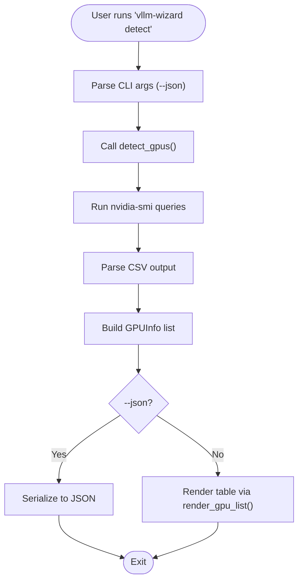

# Detect Command

<cite>
**Referenced Files in This Document**
- [README.md](file://README.md)
- [src/vllm_wizard/cli.py](file://src/vllm_wizard/cli.py)
- [src/vllm_wizard/hardware/detect.py](file://src/vllm_wizard/hardware/detect.py)
- [src/vllm_wizard/render/report.py](file://src/vllm_wizard/render/report.py)
- [src/vllm_wizard/schemas/outputs.py](file://src/vllm_wizard/schemas/outputs.py)
- [tests/test_cli.py](file://tests/test_cli.py)
</cite>

## Table of Contents
1. [Introduction](#introduction)
2. [Project Structure](#project-structure)
3. [Core Components](#core-components)
4. [Architecture Overview](#architecture-overview)
5. [Detailed Component Analysis](#detailed-component-analysis)
6. [Dependency Analysis](#dependency-analysis)
7. [Performance Considerations](#performance-considerations)
8. [Troubleshooting Guide](#troubleshooting-guide)
9. [Conclusion](#conclusion)
10. [Appendices](#appendices)

## Introduction
This document explains the vllm-wizard detect command, which automatically detects available NVIDIA GPUs on the system using nvidia-smi. It covers:
- How detection works under the hood
- The --json flag for machine-readable output
- Default human-readable console output
- Example outputs for single GPU, multi-GPU, and no-GPU scenarios
- Supported GPU architectures and limitations
- Troubleshooting common detection failures
- Output format structure and JSON parsing guidance

## Project Structure
The detect command is implemented as part of the CLI module and relies on hardware detection and rendering utilities.

**Diagram sources**
- [src/vllm_wizard/cli.py](file://src/vllm_wizard/cli.py#L62-L80)
- [src/vllm_wizard/hardware/detect.py](file://src/vllm_wizard/hardware/detect.py#L10-L72)
- [src/vllm_wizard/render/report.py](file://src/vllm_wizard/render/report.py#L241-L272)
- [src/vllm_wizard/schemas/outputs.py](file://src/vllm_wizard/schemas/outputs.py#L17-L35)

**Section sources**
- [src/vllm_wizard/cli.py](file://src/vllm_wizard/cli.py#L62-L80)
- [README.md](file://README.md#L28-L36)

## Core Components
- CLI detect command: Parses the --json flag and delegates detection to detect_gpus(), then renders either JSON or a formatted table.
- Hardware detection: Uses nvidia-smi to query GPU names, total VRAM, driver version, CUDA version, and compute capability.
- Rendering: Formats detected GPUs into a human-readable table or serializes them as JSON.

Key behaviors:
- Default output prints a table with GPU index, name, VRAM in GiB, and driver/CUDA versions.
- --json outputs a JSON array of GPUInfo objects.

**Section sources**
- [src/vllm_wizard/cli.py](file://src/vllm_wizard/cli.py#L62-L80)
- [src/vllm_wizard/hardware/detect.py](file://src/vllm_wizard/hardware/detect.py#L10-L72)
- [src/vllm_wizard/render/report.py](file://src/vllm_wizard/render/report.py#L241-L272)

## Architecture Overview
The detect command flow:

**Diagram sources**
- [src/vllm_wizard/cli.py](file://src/vllm_wizard/cli.py#L62-L80)
- [src/vllm_wizard/hardware/detect.py](file://src/vllm_wizard/hardware/detect.py#L10-L136)
- [src/vllm_wizard/render/report.py](file://src/vllm_wizard/render/report.py#L241-L272)

## Detailed Component Analysis

### Detect Command Implementation
- Command definition: Adds a detect command with a --json option.
- Behavior:
  - Calls detect_gpus() to obtain GPUInfo objects.
  - If --json is set, prints a JSON array of GPUInfo dictionaries.
  - Otherwise, prints a formatted table via render_gpu_list().
  - If no GPUs are detected, prints a user-friendly message.

**Section sources**
- [src/vllm_wizard/cli.py](file://src/vllm_wizard/cli.py#L62-L80)

### GPU Detection Logic
- Uses nvidia-smi with CSV queries to extract:
  - GPU name and total VRAM (MiB)
  - Driver version
  - Compute capability
  - CUDA version (parsed from nvidia-smi header)
- Robustness:
  - Catches missing nvidia-smi, timeouts, and other exceptions by returning an empty list.
  - Normalizes output to a list of GPUInfo objects.

**Section sources**
- [src/vllm_wizard/hardware/detect.py](file://src/vllm_wizard/hardware/detect.py#L10-L136)

### Output Rendering
- Human-readable table includes:
  - Index, GPU name, VRAM in GiB, driver version, CUDA version.
- JSON output:
  - Array of GPUInfo objects serialized via model_dump().

**Section sources**
- [src/vllm_wizard/render/report.py](file://src/vllm_wizard/render/report.py#L241-L272)
- [src/vllm_wizard/schemas/outputs.py](file://src/vllm_wizard/schemas/outputs.py#L17-L35)

### GPUInfo Schema
- Fields:
  - name: GPU device name
  - vram_mib: Total VRAM in MiB
  - compute_capability: Optional CUDA compute capability
  - driver_version: Optional NVIDIA driver version
  - cuda_version: Optional CUDA version
- Properties:
  - vram_gb: VRAM in GiB (base 1024)
  - vram_gib: VRAM in GiB (base 1024)

**Section sources**
- [src/vllm_wizard/schemas/outputs.py](file://src/vllm_wizard/schemas/outputs.py#L17-L35)

## Architecture Overview

**Diagram sources**
- [src/vllm_wizard/schemas/outputs.py](file://src/vllm_wizard/schemas/outputs.py#L17-L35)
- [src/vllm_wizard/hardware/detect.py](file://src/vllm_wizard/hardware/detect.py#L10-L136)
- [src/vllm_wizard/cli.py](file://src/vllm_wizard/cli.py#L62-L80)
- [src/vllm_wizard/render/report.py](file://src/vllm_wizard/render/report.py#L241-L272)

## Detailed Component Analysis

### Detect Command Flow

**Diagram sources**
- [src/vllm_wizard/cli.py](file://src/vllm_wizard/cli.py#L62-L80)
- [src/vllm_wizard/hardware/detect.py](file://src/vllm_wizard/hardware/detect.py#L10-L72)
- [src/vllm_wizard/render/report.py](file://src/vllm_wizard/render/report.py#L241-L272)

### Example Outputs

- Single GPU scenario:
  - Human-readable: A table with one row showing GPU name, VRAM in GiB, driver version, and CUDA version.
  - JSON: A single-element array with GPUInfo fields.

- Multi-GPU scenario:
  - Human-readable: A table with multiple rows, one per GPU.
  - JSON: An array with multiple GPUInfo objects.

- No-GPU scenario:
  - Human-readable: A yellow message indicating no NVIDIA GPUs were detected and suggests checking nvidia-smi installation.
  - JSON: An empty array.

These behaviors are validated by tests that mock detect_gpus() and assert the expected console or JSON output.

**Section sources**
- [tests/test_cli.py](file://tests/test_cli.py#L19-L50)
- [src/vllm_wizard/cli.py](file://src/vllm_wizard/cli.py#L62-L80)
- [src/vllm_wizard/render/report.py](file://src/vllm_wizard/render/report.py#L241-L272)

## Dependency Analysis

**Diagram sources**
- [src/vllm_wizard/cli.py](file://src/vllm_wizard/cli.py#L12-L21)
- [src/vllm_wizard/hardware/detect.py](file://src/vllm_wizard/hardware/detect.py#L7)
- [src/vllm_wizard/render/report.py](file://src/vllm_wizard/render/report.py#L11)
- [src/vllm_wizard/schemas/outputs.py](file://src/vllm_wizard/schemas/outputs.py#L17-L35)

**Section sources**
- [src/vllm_wizard/cli.py](file://src/vllm_wizard/cli.py#L12-L21)
- [src/vllm_wizard/hardware/detect.py](file://src/vllm_wizard/hardware/detect.py#L7)
- [src/vllm_wizard/render/report.py](file://src/vllm_wizard/render/report.py#L11)
- [src/vllm_wizard/schemas/outputs.py](file://src/vllm_wizard/schemas/outputs.py#L17-L35)

## Performance Considerations
- The detect command executes nvidia-smi twice per run (once for GPU list and once for driver/CUDA), plus potentially once for compute capability. Each invocation is bounded by short timeouts to prevent hanging.
- Output rendering is lightweight and occurs only after detection completes.

[No sources needed since this section provides general guidance]

## Troubleshooting Guide

Common detection failures and resolutions:
- Missing nvidia-smi:
  - Symptom: Empty list or no output.
  - Resolution: Install NVIDIA drivers and ensure nvidia-smi is available in PATH.
- Driver issues:
  - Symptom: Empty list or nvidia-smi errors.
  - Resolution: Update NVIDIA drivers to a version compatible with your GPU and CUDA stack.
- Permission problems:
  - Symptom: Permission denied when running nvidia-smi.
  - Resolution: Run with appropriate privileges or configure permissions for the current user.
- Timeout or transient failures:
  - Symptom: Empty list due to timeouts.
  - Resolution: Retry after ensuring the system is idle and drivers are responsive.

Detection logic catches these conditions and returns an empty list, which the CLI interprets as “no GPUs detected.”

**Section sources**
- [src/vllm_wizard/hardware/detect.py](file://src/vllm_wizard/hardware/detect.py#L65-L71)
- [src/vllm_wizard/cli.py](file://src/vllm_wizard/cli.py#L77-L79)

## Conclusion
The vllm-wizard detect command provides a reliable way to discover NVIDIA GPUs on Linux systems using nvidia-smi. It offers both human-readable and JSON outputs, integrates seamlessly with the broader CLI ecosystem, and gracefully handles common failure modes. Use --json for automation and scripting, and rely on the human-readable output for quick diagnostics.

[No sources needed since this section summarizes without analyzing specific files]

## Appendices

### Output Format Specification

- JSON array elements:
  - name: string
  - vram_mib: integer
  - compute_capability: string or null
  - driver_version: string or null
  - cuda_version: string or null

- Human-readable table columns:
  - Index: integer
  - Name: string
  - VRAM (GiB): float
  - Driver: string or “-”
  - CUDA: string or “-”

Parsing JSON in scripts:
- Load the JSON array and iterate over elements.
- Access fields by key (e.g., name, vram_mib).
- Convert vram_mib to GiB using vram_mib / 1024 if needed.

**Section sources**
- [src/vllm_wizard/schemas/outputs.py](file://src/vllm_wizard/schemas/outputs.py#L17-L35)
- [src/vllm_wizard/render/report.py](file://src/vllm_wizard/render/report.py#L255-L269)
- [tests/test_cli.py](file://tests/test_cli.py#L38-L50)