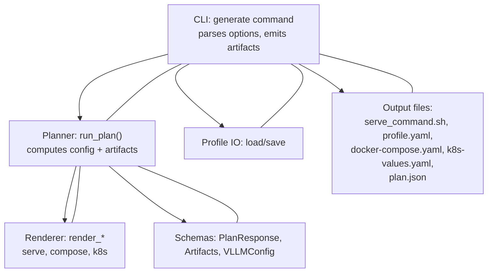
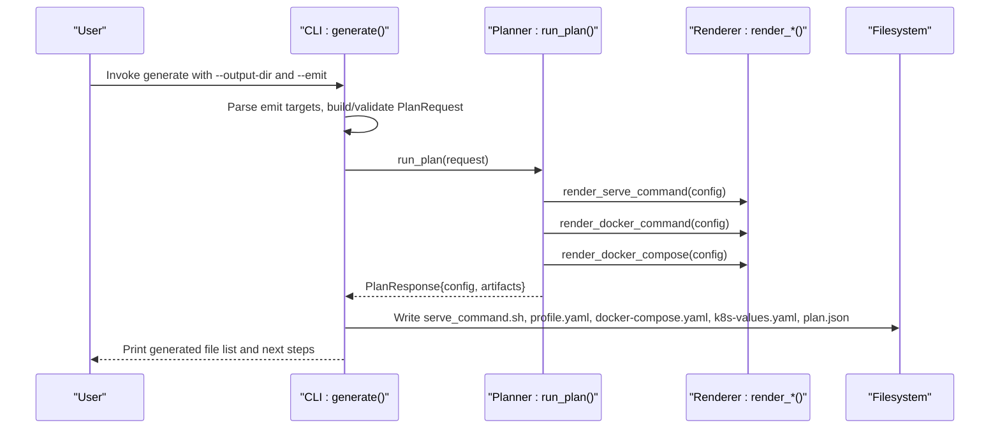
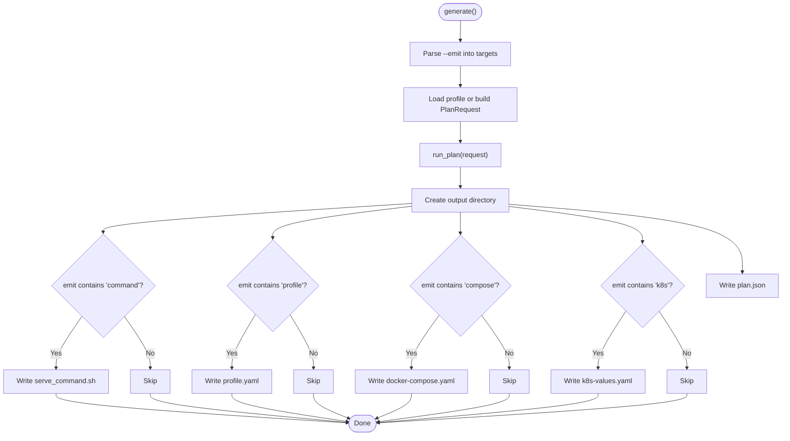
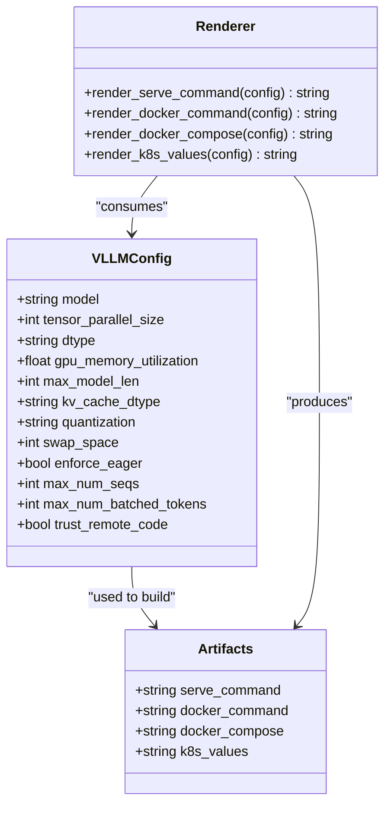
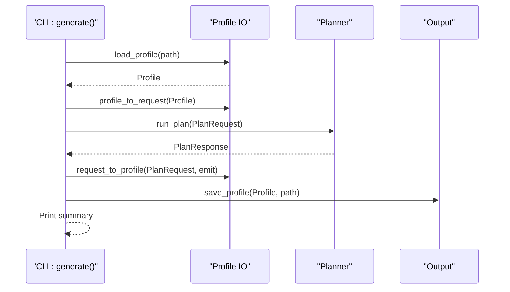
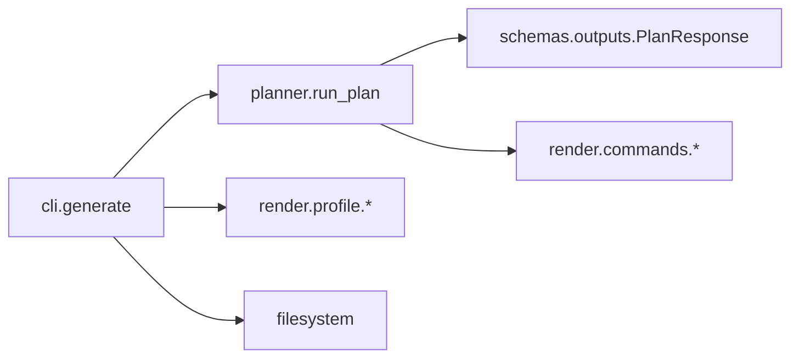

# Generate Command

<cite>
**Referenced Files in This Document**
- [cli.py](file://src/vllm_wizard/cli.py)
- [planner.py](file://src/vllm_wizard/planning/planner.py)
- [commands.py](file://src/vllm_wizard/render/commands.py)
- [profile.py](file://src/vllm_wizard/render/profile.py)
- [outputs.py](file://src/vllm_wizard/schemas/outputs.py)
- [report.py](file://src/vllm_wizard/render/report.py)
- [sample.yaml](file://examples/profiles/sample.yaml)
- [README.md](file://README.md)
</cite>

## Table of Contents
1. [Introduction](#introduction)
2. [Project Structure](#project-structure)
3. [Core Components](#core-components)
4. [Architecture Overview](#architecture-overview)
5. [Detailed Component Analysis](#detailed-component-analysis)
6. [Dependency Analysis](#dependency-analysis)
7. [Performance Considerations](#performance-considerations)
8. [Troubleshooting Guide](#troubleshooting-guide)
9. [Conclusion](#conclusion)
10. [Appendices](#appendices)

## Introduction
This document explains the automated artifact generation workflow provided by the vLLM Wizard generate command. It focuses on how the command produces runnable vLLM serve commands, Docker Compose configurations, Kubernetes values, and YAML profiles, and how these artifacts integrate into deployment workflows. It also covers required and optional flags, file naming conventions, directory layout, customization tips, and best practices for version control.

## Project Structure
The generate command orchestrates planning, artifact rendering, and file emission into a user-specified output directory. The key modules involved are:
- CLI command definition and option parsing
- Planner that computes feasibility, recommendations, and performance
- Renderers that produce command strings, compose YAML, and Kubernetes values
- Profile loader/saver for YAML-based configuration persistence
- Output schemas that define the shape of generated artifacts

**Diagram sources**
- [cli.py](file://src/vllm_wizard/cli.py#L215-L381)
- [planner.py](file://src/vllm_wizard/planning/planner.py#L21-L136)
- [commands.py](file://src/vllm_wizard/render/commands.py#L6-L196)
- [outputs.py](file://src/vllm_wizard/schemas/outputs.py#L57-L118)
- [profile.py](file://src/vllm_wizard/render/profile.py#L30-L173)

**Section sources**
- [cli.py](file://src/vllm_wizard/cli.py#L215-L381)
- [planner.py](file://src/vllm_wizard/planning/planner.py#L21-L136)
- [commands.py](file://src/vllm_wizard/render/commands.py#L6-L196)
- [outputs.py](file://src/vllm_wizard/schemas/outputs.py#L57-L118)
- [profile.py](file://src/vllm_wizard/render/profile.py#L30-L173)

## Core Components
- Generate command options:
  - Required: --output-dir/-o
  - Optional: --emit with comma-separated values: command, profile, compose, k8s
  - All plan-time options are also accepted (model, hardware, workload, policy)
  - Optional: --profile/-p to load settings from a YAML profile
- Artifact generation pipeline:
  - Parses --emit into a list of targets
  - Builds a PlanRequest (or loads from profile)
  - Runs planning to produce a PlanResponse with recommended config and artifacts
  - Emits files into the output directory according to --emit
  - Also writes plan.json for machine-readable inspection

Key outputs emitted by --emit:
- command → serve_command.sh
- profile → profile.yaml
- compose → docker-compose.yaml
- k8s → k8s-values.yaml

Additional file:
- plan.json → complete planning result for debugging and automation

**Section sources**
- [cli.py](file://src/vllm_wizard/cli.py#L215-L381)
- [README.md](file://README.md#L147-L159)

## Architecture Overview
The generate command ties together planning and rendering to produce deployment-ready artifacts.

**Diagram sources**
- [cli.py](file://src/vllm_wizard/cli.py#L273-L381)
- [planner.py](file://src/vllm_wizard/planning/planner.py#L21-L136)
- [commands.py](file://src/vllm_wizard/render/commands.py#L6-L196)

## Detailed Component Analysis

### Generate Command Implementation
- Parses --emit into a list and validates targets against supported values
- Loads a profile if provided, otherwise constructs a PlanRequest from CLI options
- Invokes run_plan to compute feasibility, performance, and recommended config
- Creates output directory and writes selected artifacts plus plan.json
- Prints a summary of generated files and next steps

**Diagram sources**
- [cli.py](file://src/vllm_wizard/cli.py#L273-L381)

**Section sources**
- [cli.py](file://src/vllm_wizard/cli.py#L215-L381)

### Artifact Rendering Details
- vLLM serve command:
  - Built from VLLMConfig with required flags and optional extras
  - Supports formatting as a shell script file
- Docker Compose:
  - Renders a docker-compose.yaml with service definition, port mapping, volume mounts, environment variables, IPC settings, and GPU device reservations
- Kubernetes values:
  - Renders a values.yaml snippet suitable for Helm deployment with image, args, resource requests/limits, service, and node selectors
- Profile YAML:
  - Converts PlanRequest into a versioned Profile for reproducibility and reuse

**Diagram sources**
- [outputs.py](file://src/vllm_wizard/schemas/outputs.py#L57-L118)
- [commands.py](file://src/vllm_wizard/render/commands.py#L6-L196)

**Section sources**
- [commands.py](file://src/vllm_wizard/render/commands.py#L6-L196)
- [outputs.py](file://src/vllm_wizard/schemas/outputs.py#L57-L118)

### Profile Integration
- Loading a profile:
  - Reads YAML and converts to Profile, then to PlanRequest for planning
- Saving a profile:
  - Converts PlanRequest to Profile (including emit list) and writes YAML
- Example profile:
  - Demonstrates structure and typical fields for model, hardware, workload, policy, and outputs

**Diagram sources**
- [cli.py](file://src/vllm_wizard/cli.py#L273-L381)
- [profile.py](file://src/vllm_wizard/render/profile.py#L46-L173)
- [sample.yaml](file://examples/profiles/sample.yaml#L1-L40)

**Section sources**
- [profile.py](file://src/vllm_wizard/render/profile.py#L30-L173)
- [sample.yaml](file://examples/profiles/sample.yaml#L1-L40)

### File Naming Conventions and Directory Layout
- Output directory is created if missing
- Emitted files:
  - serve_command.sh (when "command" is in --emit)
  - profile.yaml (when "profile" is in --emit)
  - docker-compose.yaml (when "compose" is in --emit)
  - k8s-values.yaml (when "k8s" is in --emit)
  - plan.json (always written)
- Directory structure:
  - All files are placed directly under the provided --output-dir

**Section sources**
- [cli.py](file://src/vllm_wizard/cli.py#L319-L350)

### Deployment Workflow Integration
- Local testing:
  - Run the generated serve_command.sh to start vLLM locally
- Containerized deployment:
  - Use docker-compose.yaml to run the service with GPU reservation and cache mounting
- Kubernetes deployment:
  - Use k8s-values.yaml as a Helm values file to deploy the vLLM service with GPU scheduling
- Iterative refinement:
  - Use plan.json for debugging and automation
  - Regenerate artifacts after adjusting options or switching profiles

**Section sources**
- [cli.py](file://src/vllm_wizard/cli.py#L367-L371)
- [commands.py](file://src/vllm_wizard/render/commands.py#L75-L155)

### Examples and Use Cases
- Minimal generation:
  - Emit command and profile to quickly bootstrap a local run
- Container-first workflow:
  - Add compose to generate a ready-to-run Docker Compose setup
- Cloud-native workflow:
  - Add k8s to generate a values file for Helm-based deployments
- Mixed workflows:
  - Combine command, profile, compose, and k8s to cover local, container, and cloud environments from a single planning session

Note: Specific command invocations and expected outputs are described in the repository documentation and examples.

**Section sources**
- [README.md](file://README.md#L64-L88)

## Dependency Analysis
The generate command depends on:
- Planner to compute the recommended configuration and artifacts
- Renderer functions to materialize textual artifacts
- Profile IO for YAML-based persistence
- Output schemas to structure the planning result

**Diagram sources**
- [cli.py](file://src/vllm_wizard/cli.py#L215-L381)
- [planner.py](file://src/vllm_wizard/planning/planner.py#L21-L136)
- [commands.py](file://src/vllm_wizard/render/commands.py#L6-L196)
- [outputs.py](file://src/vllm_wizard/schemas/outputs.py#L57-L118)
- [profile.py](file://src/vllm_wizard/render/profile.py#L30-L173)

**Section sources**
- [cli.py](file://src/vllm_wizard/cli.py#L215-L381)
- [planner.py](file://src/vllm_wizard/planning/planner.py#L21-L136)
- [commands.py](file://src/vllm_wizard/render/commands.py#L6-L196)
- [outputs.py](file://src/vllm_wizard/schemas/outputs.py#L57-L118)
- [profile.py](file://src/vllm_wizard/render/profile.py#L30-L173)

## Performance Considerations
- The generate command itself is I/O bound by writing files; planning cost is independent of --emit targets
- For large-scale CI/CD, consider caching plan.json and selectively regenerating only changed artifacts
- When emitting k8s values, ensure GPU scheduling aligns with cluster topology and node selectors

## Troubleshooting Guide
Common issues and resolutions:
- Missing output files:
  - Verify --emit contains the desired targets; confirm the output directory exists or can be created
- VRAM feasibility warnings:
  - Review the printed warnings and consider quantization, reduced context length, or fewer GPUs
- Profile-related errors:
  - Ensure the profile YAML is valid and matches the expected schema
- Unexpected defaults:
  - Confirm CLI options override profile values as intended; remember that CLI takes precedence when provided

**Section sources**
- [cli.py](file://src/vllm_wizard/cli.py#L359-L371)
- [report.py](file://src/vllm_wizard/render/report.py#L215-L225)

## Conclusion
The vLLM Wizard generate command streamlines artifact creation for deploying vLLM across environments. By combining planning with targeted artifact emission, it accelerates local testing, containerized runs, and Kubernetes deployments while preserving reproducibility through YAML profiles and JSON logs.

## Appendices

### Appendix A: Command Reference
- Required:
  - --output-dir/-o: Output directory for artifacts
- Optional:
  - --emit: Comma-separated list of artifacts to emit (values: command, profile, compose, k8s)
  - All plan-time options are also available
  - --profile/-p: Load settings from a YAML profile

**Section sources**
- [cli.py](file://src/vllm_wizard/cli.py#L215-L273)
- [README.md](file://README.md#L147-L159)

### Appendix B: Artifact Descriptions
- serve_command.sh:
  - Executable shell script containing the vLLM serve command built from the recommended configuration
- profile.yaml:
  - YAML-formatted profile capturing model, hardware, workload, policy, and outputs for reproducibility
- docker-compose.yaml:
  - Docker Compose file with GPU reservation, port mapping, and cache volume mounting
- k8s-values.yaml:
  - Kubernetes values snippet for Helm deployment with GPU resource requests and node selectors
- plan.json:
  - Machine-readable planning result for debugging and automation

**Section sources**
- [cli.py](file://src/vllm_wizard/cli.py#L325-L350)
- [commands.py](file://src/vllm_wizard/render/commands.py#L75-L155)
- [outputs.py](file://src/vllm_wizard/schemas/outputs.py#L94-L118)

### Appendix C: Best Practices and Version Control
- Keep profile.yaml and plan.json under version control to track configuration history
- Treat generated docker-compose.yaml and k8s-values.yaml as ephemeral templates; regenerate after changing options
- Use separate output directories per environment or branch to avoid conflicts
- Pin vLLM image tags in docker-compose.yaml and Helm charts for reproducibility

[No sources needed since this section provides general guidance]