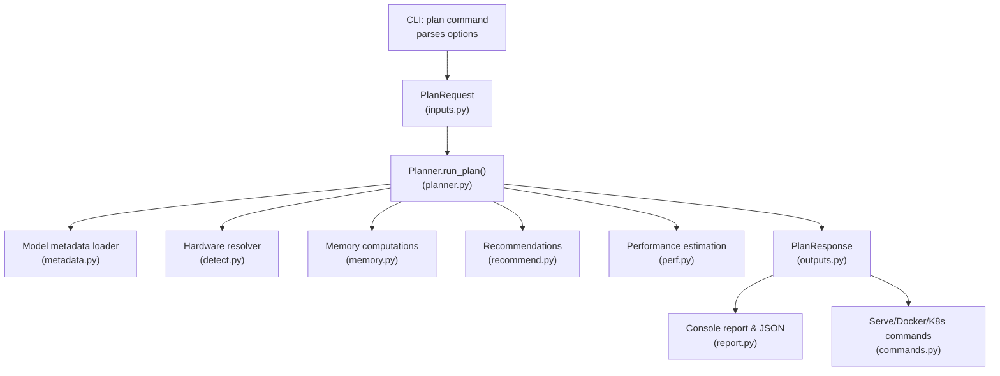
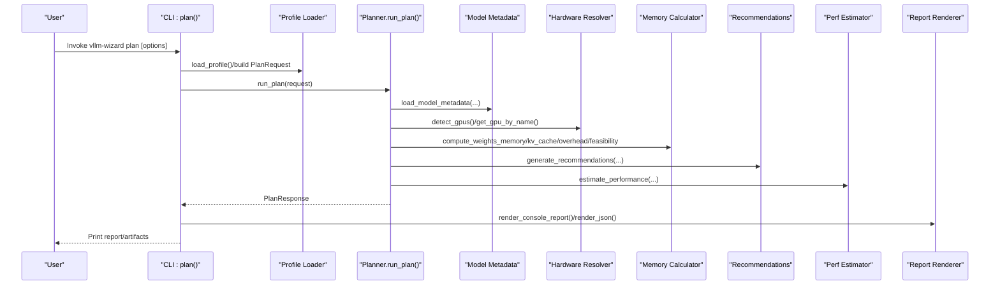
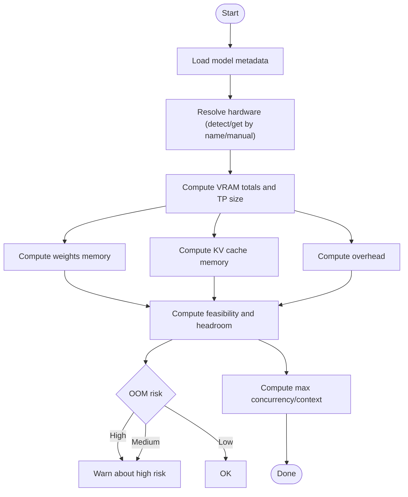
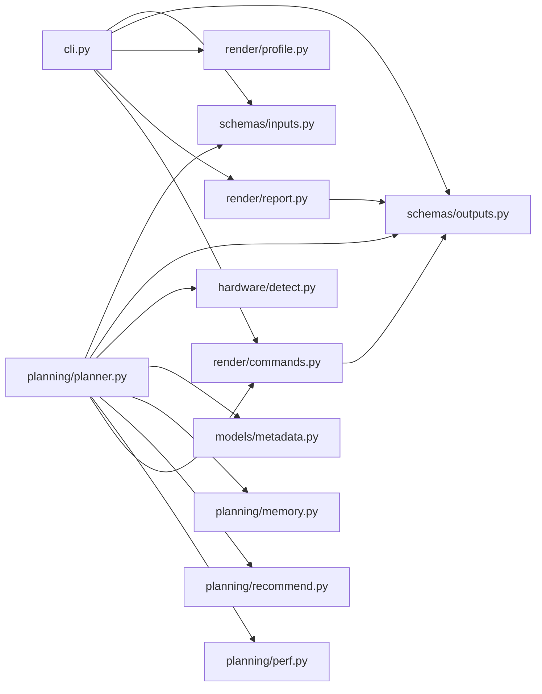

# Plan Command

<cite>
**Referenced Files in This Document**
- [cli.py](file://src/vllm_wizard/cli.py)
- [planner.py](file://src/vllm_wizard/planning/planner.py)
- [memory.py](file://src/vllm_wizard/planning/memory.py)
- [perf.py](file://src/vllm_wizard/planning/perf.py)
- [recommend.py](file://src/vllm_wizard/planning/recommend.py)
- [inputs.py](file://src/vllm_wizard/schemas/inputs.py)
- [outputs.py](file://src/vllm_wizard/schemas/outputs.py)
- [profile.py](file://src/vllm_wizard/render/profile.py)
- [report.py](file://src/vllm_wizard/render/report.py)
- [commands.py](file://src/vllm_wizard/render/commands.py)
- [detect.py](file://src/vllm_wizard/hardware/detect.py)
- [metadata.py](file://src/vllm_wizard/models/metadata.py)
- [sample.yaml](file://examples/profiles/sample.yaml)
</cite>

## Table of Contents
1. [Introduction](#introduction)
2. [Project Structure](#project-structure)
3. [Core Components](#core-components)
4. [Architecture Overview](#architecture-overview)
5. [Detailed Component Analysis](#detailed-component-analysis)
6. [Dependency Analysis](#dependency-analysis)
7. [Performance Considerations](#performance-considerations)
8. [Troubleshooting Guide](#troubleshooting-guide)
9. [Conclusion](#conclusion)
10. [Appendices](#appendices)

## Introduction
The vllm-wizard plan command performs end-to-end configuration planning for deploying vLLM serving. It consumes model, hardware, workload, and policy inputs to compute VRAM feasibility, generate a recommended vLLM configuration, estimate performance, and produce runnable artifacts. It supports loading settings from YAML profiles, controlling output verbosity, and providing human-readable reports or machine-readable JSON.

## Project Structure
The plan command orchestrates several subsystems:
- CLI layer parses user options and builds a PlanRequest
- Planner orchestrates model metadata loading, hardware resolution, memory computation, feasibility analysis, recommendation generation, and performance estimation
- Rendering layer produces console reports and artifacts

**Diagram sources**
- [cli.py](file://src/vllm_wizard/cli.py#L82-L213)
- [planner.py](file://src/vllm_wizard/planning/planner.py#L21-L135)
- [memory.py](file://src/vllm_wizard/planning/memory.py#L155-L270)
- [recommend.py](file://src/vllm_wizard/planning/recommend.py#L167-L332)
- [perf.py](file://src/vllm_wizard/planning/perf.py#L136-L219)
- [report.py](file://src/vllm_wizard/render/report.py#L14-L44)
- [commands.py](file://src/vllm_wizard/render/commands.py#L6-L45)

**Section sources**
- [cli.py](file://src/vllm_wizard/cli.py#L82-L213)
- [planner.py](file://src/vllm_wizard/planning/planner.py#L21-L135)

## Core Components
- CLI plan command: Defines all parameters, loads profiles, runs planning, and renders output
- Planner: Orchestrates the planning pipeline
- Memory module: Computes weights, KV cache, overhead, and feasibility
- Recommendation engine: Generates vLLM configuration suggestions
- Performance estimator: Heuristic throughput/time estimates
- Rendering: Console report and artifact generation
- Hardware detection: Auto-detection and known GPU specs
- Model metadata: Loads and parses model configs

**Section sources**
- [cli.py](file://src/vllm_wizard/cli.py#L82-L213)
- [planner.py](file://src/vllm_wizard/planning/planner.py#L21-L135)
- [memory.py](file://src/vllm_wizard/planning/memory.py#L31-L121)
- [recommend.py](file://src/vllm_wizard/planning/recommend.py#L167-L332)
- [perf.py](file://src/vllm_wizard/planning/perf.py#L136-L219)
- [report.py](file://src/vllm_wizard/render/report.py#L14-L44)
- [detect.py](file://src/vllm_wizard/hardware/detect.py#L10-L71)
- [metadata.py](file://src/vllm_wizard/models/metadata.py#L209-L254)

## Architecture Overview
The plan command follows a layered design:
- Input layer: Typer CLI options mapped to PlanRequest
- Planning layer: run_plan orchestrates model metadata, hardware, memory, feasibility, recommendations, and performance
- Output layer: Rich console report and JSON rendering, plus artifact generation

**Diagram sources**
- [cli.py](file://src/vllm_wizard/cli.py#L155-L202)
- [planner.py](file://src/vllm_wizard/planning/planner.py#L30-L135)
- [memory.py](file://src/vllm_wizard/planning/memory.py#L31-L121)
- [recommend.py](file://src/vllm_wizard/planning/recommend.py#L167-L332)
- [perf.py](file://src/vllm_wizard/planning/perf.py#L136-L219)
- [report.py](file://src/vllm_wizard/render/report.py#L14-L44)

## Detailed Component Analysis

### CLI Plan Command
The plan command defines all parameters categorized as:
- Model options: --model, --revision, --trust-remote-code, --dtype, --quantization, --kv-cache-dtype, --max-model-len, --params-b
- Hardware options: --gpu, --gpus, --vram-gb, --interconnect, --tensor-parallel-size
- Workload options: --prompt-tokens, --gen-tokens, --concurrency, --batching-mode
- Policy options: --gpu-memory-utilization, --overhead-gb, --fragmentation-factor, --headroom-gb
- Output controls: --profile, --json, --explain

Behavior:
- Loads a YAML profile if provided, otherwise constructs PlanRequest from CLI options
- Invokes run_plan(request) and prints either a Rich console report or JSON
- Handles errors and exits with non-zero status on failures

**Section sources**
- [cli.py](file://src/vllm_wizard/cli.py#L82-L213)
- [inputs.py](file://src/vllm_wizard/schemas/inputs.py#L54-L110)

### Planner Orchestration
run_plan executes the planning pipeline:
1. Load model metadata (params, heads, layers, position embeddings)
2. Resolve hardware (auto-detect or manual)
3. Compute VRAM totals and tensor-parallel size
4. Compute memory breakdown: weights, KV cache, overhead
5. Evaluate feasibility with headroom and OOM risk
6. Generate recommendations for vLLM config
7. Estimate performance metrics
8. Render artifacts (serve command, docker, compose)

Key logic:
- Hardware resolution prioritizes auto-detection, then GPU name lookup, then manual VRAM spec
- Effective VRAM considers tensor-parallel grouping
- KV cache fragmentation factor increases allocated memory to account for fragmentation
- Overhead includes base overhead plus inter-GPU communication buffers

**Section sources**
- [planner.py](file://src/vllm_wizard/planning/planner.py#L21-L135)
- [detect.py](file://src/vllm_wizard/hardware/detect.py#L138-L159)

### Memory Calculation and VRAM Feasibility
- Weights memory: bytes per parameter based on dtype or quantization
- KV cache memory: computed from model metadata (heads, layers, head dim), context length, concurrency, KV dtype, and fragmentation factor
- Overhead: base overhead plus interconnect-dependent communication overhead
- Feasibility: allocatable VRAM × utilization minus required memory; headroom determines OOM risk; computes max concurrency at context and max context at concurrency

**Diagram sources**
- [planner.py](file://src/vllm_wizard/planning/planner.py#L30-L97)
- [memory.py](file://src/vllm_wizard/planning/memory.py#L31-L121)
- [memory.py](file://src/vllm_wizard/planning/memory.py#L155-L270)

**Section sources**
- [memory.py](file://src/vllm_wizard/planning/memory.py#L31-L121)
- [memory.py](file://src/vllm_wizard/planning/memory.py#L155-L270)

### Recommendation Engine
Generates a recommended vLLM configuration:
- Tensor parallel size: power-of-two selection or user-specified; checks if weights fit per GPU
- GPU memory utilization: lowered for consumer GPUs
- Quantization: recommended if configuration does not fit without quantization
- KV cache dtype: FP8 suggested for high-pressure scenarios on supported GPUs
- max_model_len: clamped to model max and what fits VRAM
- max_num_seqs and max_num_batched_tokens: tuned by batching mode and VRAM constraints
- dtype: auto-detected or user-specified

Explanations are included when --explain is enabled.

**Section sources**
- [recommend.py](file://src/vllm_wizard/planning/recommend.py#L167-L332)

### Performance Estimation
Estimates throughput and latency characteristics:
- Baselines by GPU family for decode and prefill
- Scaling by model size (inverse scaling with exponent ~0.85)
- Tensor parallel scaling affected by interconnect efficiency (NVLink > PCIe > Unknown)
- Context length scaling (attention overhead)
- Quantization speedup factors
- TTFT estimated from prompt tokens and prefill throughput
- Ranges provided to reflect heuristic uncertainty

**Section sources**
- [perf.py](file://src/vllm_wizard/planning/perf.py#L136-L219)

### Output Control and Profiles
- --json: Outputs PlanResponse as pretty-printed JSON
- --explain: Includes recommendation explanations in the configuration
- --profile: Loads YAML profile containing model, hardware, workload, policy, and outputs sections

Profile YAML structure mirrors PlanRequest fields and can be saved back from a PlanResponse.

**Section sources**
- [cli.py](file://src/vllm_wizard/cli.py#L146-L152)
- [profile.py](file://src/vllm_wizard/render/profile.py#L46-L115)
- [sample.yaml](file://examples/profiles/sample.yaml#L1-L40)

### Artifact Generation
The planner produces:
- vLLM serve command string
- Docker run command
- docker-compose.yaml content
- Kubernetes values.yaml content (via separate renderer)

These are rendered from the recommended VLLMConfig.

**Section sources**
- [commands.py](file://src/vllm_wizard/render/commands.py#L6-L45)
- [commands.py](file://src/vllm_wizard/render/commands.py#L75-L113)
- [commands.py](file://src/vllm_wizard/render/commands.py#L116-L154)

## Dependency Analysis
The plan command integrates multiple modules with clear separation of concerns:
- CLI depends on schemas and render/report modules
- Planner depends on hardware detection, model metadata, memory, recommendation, and performance modules
- Rendering depends on output schemas

**Diagram sources**
- [cli.py](file://src/vllm_wizard/cli.py#L11-L21)
- [planner.py](file://src/vllm_wizard/planning/planner.py#L5-L18)
- [report.py](file://src/vllm_wizard/render/report.py#L11-L11)
- [commands.py](file://src/vllm_wizard/render/commands.py#L3-L3)

**Section sources**
- [cli.py](file://src/vllm_wizard/cli.py#L11-L21)
- [planner.py](file://src/vllm_wizard/planning/planner.py#L5-L18)

## Performance Considerations
- Memory footprint dominates planning decisions; KV cache often the largest component
- Fragmentation factor increases KV cache allocation to account for fragmentation
- Overhead grows with tensor-parallel size due to inter-GPU communication buffers
- Consumer GPUs benefit from lower GPU memory utilization to improve stability
- Quantization reduces weights memory and can improve throughput modestly
- Interconnect type significantly affects tensor-parallel scaling efficiency

[No sources needed since this section provides general guidance]

## Troubleshooting Guide
Common issues and resolutions:
- No GPUs detected or specified
  - Ensure nvidia-smi is installed and accessible, or explicitly set --gpu and --vram-gb
  - The planner raises a clear error when neither detection nor manual VRAM is provided
- Configuration does not fit in VRAM
  - Reduce context length (--max-model-len), concurrency (--concurrency), or enable quantization
  - Lower GPU memory utilization or increase VRAM by adding GPUs
  - Consider FP8 KV cache dtype on supported GPUs
- High OOM risk
  - The feasibility report warns about high/medium risk and suggests mitigations
- Unexpected error
  - The CLI catches ValueError, FileNotFoundError, and generic exceptions, printing a message and exiting with non-zero status

**Section sources**
- [planner.py](file://src/vllm_wizard/planning/planner.py#L41-L45)
- [memory.py](file://src/vllm_wizard/planning/memory.py#L236-L270)
- [cli.py](file://src/vllm_wizard/cli.py#L204-L212)

## Conclusion
The vllm-wizard plan command provides a comprehensive, automated approach to sizing and configuring vLLM deployments. By combining accurate VRAM modeling, practical recommendations, and heuristic performance estimates, it enables users to confidently select feasible configurations and generate runnable artifacts.

[No sources needed since this section summarizes without analyzing specific files]

## Appendices

### Parameter Reference and Categories
- Model options
  - --model/-m: Model ID or local path
  - --revision: Model revision
  - --trust-remote-code: Trust remote code
  - --dtype: Weight dtype (auto/fp16/bf16/fp32)
  - --quantization/-q: Quantization method (none/awq/gptq/int8/fp8)
  - --kv-cache-dtype: KV cache dtype (auto/fp16/bf16/fp8_e4m3fn/fp8_e5m2)
  - --max-model-len: Target context length
  - --params-b: Model parameters in billions
- Hardware options
  - --gpu: GPU name or 'auto' for detection
  - --gpus: Number of GPUs
  - --vram-gb: VRAM per GPU in GB
  - --interconnect: GPU interconnect type (pcie/nvlink/unknown)
  - --tensor-parallel-size/--tp: Tensor parallel size
- Workload options
  - --prompt-tokens: Typical prompt token count
  - --gen-tokens: Typical generation token count
  - --concurrency/-c: Simultaneous sequences
  - --batching-mode: Batching optimization mode (throughput/latency/balanced)
- Policy options
  - --gpu-memory-utilization: GPU memory utilization target
  - --overhead-gb: Fixed overhead in GB
  - --fragmentation-factor: KV cache fragmentation factor
  - --headroom-gb: Minimum headroom in GB
- Output controls
  - --profile/-p: Load settings from profile YAML
  - --json: Output as JSON
  - --explain: Include parameter explanations

**Section sources**
- [cli.py](file://src/vllm_wizard/cli.py#L82-L152)
- [inputs.py](file://src/vllm_wizard/schemas/inputs.py#L54-L110)

### Planning Algorithm Steps
1. Load model metadata (config parsing and parameter estimation)
2. Detect or configure hardware (auto-detect, GPU name lookup, manual VRAM)
3. Compute VRAM totals and tensor-parallel size
4. Compute memory breakdown: weights, KV cache, overhead
5. Evaluate feasibility: allocatable VRAM, required memory, headroom, OOM risk
6. Generate recommendations: TP size, dtype, quantization, KV cache dtype, max lengths, batching parameters
7. Estimate performance: decode/prefill throughput and TTFT ranges
8. Render artifacts and report

**Section sources**
- [planner.py](file://src/vllm_wizard/planning/planner.py#L21-L135)
- [memory.py](file://src/vllm_wizard/planning/memory.py#L155-L270)
- [recommend.py](file://src/vllm_wizard/planning/recommend.py#L167-L332)
- [perf.py](file://src/vllm_wizard/planning/perf.py#L136-L219)

### Example Scenarios
- Profile-driven planning
  - Use --profile to load a YAML profile; the CLI converts it to PlanRequest and runs planning
  - Save a profile from a PlanResponse using request_to_profile
- JSON output for automation
  - Use --json to output machine-readable results for CI/CD pipelines
- Explained recommendations
  - Use --explain to include reasoning behind each recommendation in the configuration
- Mixed parameter sets
  - Combine CLI flags with a profile; flags override profile values where applicable

**Section sources**
- [cli.py](file://src/vllm_wizard/cli.py#L155-L202)
- [profile.py](file://src/vllm_wizard/render/profile.py#L68-L115)
- [sample.yaml](file://examples/profiles/sample.yaml#L1-L40)

### Output Interpretation
- Feasibility Summary
  - Status: Fits or Does not fit
  - OOM Risk: Low/Medium/High
  - Available Headroom: GiB
- VRAM Breakdown
  - Total VRAM, Target Allocation, Model Weights, KV Cache, Overhead, Headroom
  - Max concurrency at target context and max context at target concurrency
- Recommended vLLM Configuration
  - Values and explanations for model, tensor_parallel_size, dtype, gpu_memory_utilization, max_model_len, kv_cache_dtype, quantization, max_num_seqs, max_num_batched_tokens
- Performance Estimates
  - Decode tokens/s range, Prefill tokens/s range (when available), TTFT ms range
  - Assumptions list explaining estimation caveats
- Recommended Command
  - Ready-to-run vLLM serve command

**Section sources**
- [report.py](file://src/vllm_wizard/render/report.py#L14-L44)
- [report.py](file://src/vllm_wizard/render/report.py#L74-L113)
- [report.py](file://src/vllm_wizard/render/report.py#L116-L176)
- [report.py](file://src/vllm_wizard/render/report.py#L179-L204)
- [report.py](file://src/vllm_wizard/render/report.py#L207-L212)