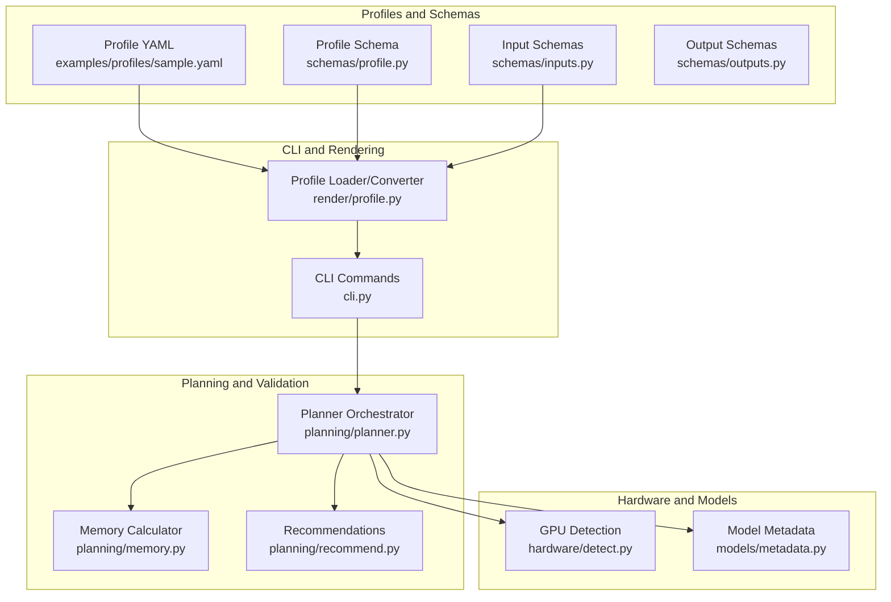
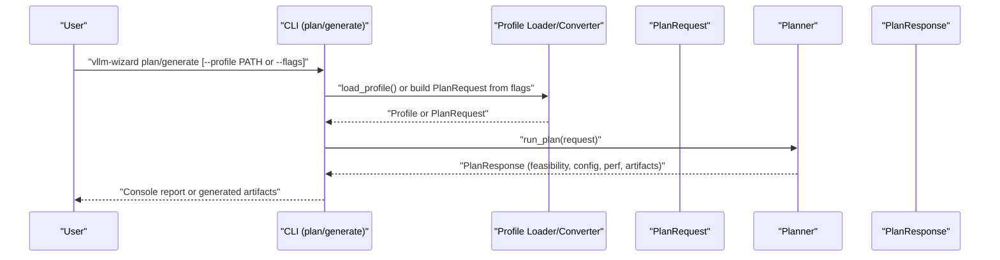
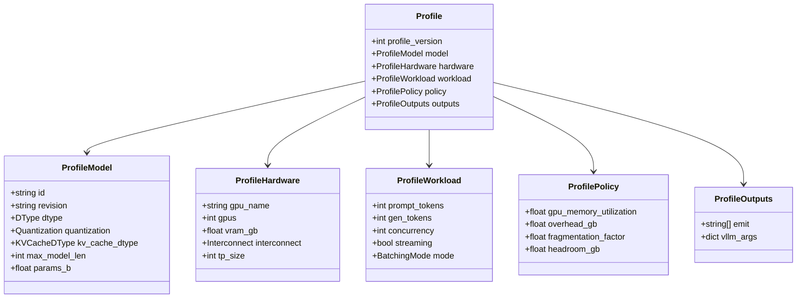
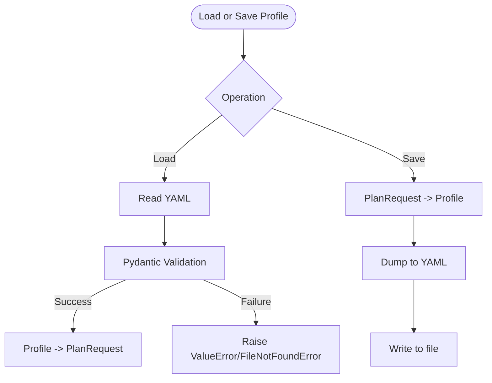
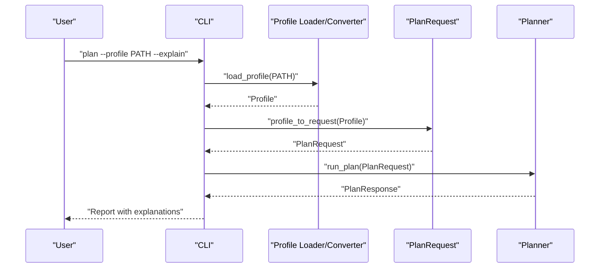
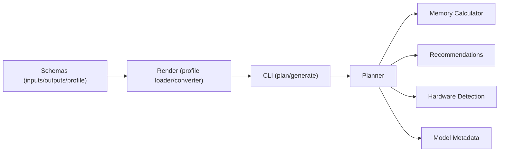

# Configuration Management

<cite>
**Referenced Files in This Document**
- [sample.yaml](file://examples/profiles/sample.yaml)
- [profile.py](file://src/vllm_wizard/schemas/profile.py)
- [inputs.py](file://src/vllm_wizard/schemas/inputs.py)
- [outputs.py](file://src/vllm_wizard/schemas/outputs.py)
- [profile.py](file://src/vllm_wizard/render/profile.py)
- [cli.py](file://src/vllm_wizard/cli.py)
- [planner.py](file://src/vllm_wizard/planning/planner.py)
- [memory.py](file://src/vllm_wizard/planning/memory.py)
- [recommend.py](file://src/vllm_wizard/planning/recommend.py)
- [detect.py](file://src/vllm_wizard/hardware/detect.py)
- [metadata.py](file://src/vllm_wizard/models/metadata.py)
- [requirements.txt](file://requirements.txt)
</cite>

## Table of Contents
1. [Introduction](#introduction)
2. [Project Structure](#project-structure)
3. [Core Components](#core-components)
4. [Architecture Overview](#architecture-overview)
5. [Detailed Component Analysis](#detailed-component-analysis)
6. [Dependency Analysis](#dependency-analysis)
7. [Performance Considerations](#performance-considerations)
8. [Troubleshooting Guide](#troubleshooting-guide)
9. [Conclusion](#conclusion)
10. [Appendices](#appendices)

## Introduction
This document explains the configuration management system for the vLLM Wizard tool. It covers the YAML profile format, schema validation, parameter constraints, and how profiles integrate with CLI parameters. It also documents inheritance and override behavior, best practices for organizing and versioning configurations, migration and backward compatibility considerations, and integration patterns with configuration management tools and CI/CD pipelines.

## Project Structure
The configuration system centers around:
- A versioned YAML profile schema that captures model, hardware, workload, policy, and outputs settings
- Pydantic models that define strict validation rules and defaults
- CLI commands that accept either CLI flags or a profile YAML
- A planner that computes feasibility, recommendations, and artifacts

**Diagram sources**
- [sample.yaml](file://examples/profiles/sample.yaml#L1-L40)
- [profile.py](file://src/vllm_wizard/schemas/profile.py#L66-L75)
- [inputs.py](file://src/vllm_wizard/schemas/inputs.py#L102-L110)
- [outputs.py](file://src/vllm_wizard/schemas/outputs.py#L103-L118)
- [profile.py](file://src/vllm_wizard/render/profile.py#L46-L115)
- [cli.py](file://src/vllm_wizard/cli.py#L82-L213)
- [planner.py](file://src/vllm_wizard/planning/planner.py#L21-L136)
- [memory.py](file://src/vllm_wizard/planning/memory.py#L155-L271)
- [recommend.py](file://src/vllm_wizard/planning/recommend.py#L167-L333)
- [detect.py](file://src/vllm_wizard/hardware/detect.py#L10-L72)
- [metadata.py](file://src/vllm_wizard/models/metadata.py#L209-L255)

**Section sources**
- [sample.yaml](file://examples/profiles/sample.yaml#L1-L40)
- [profile.py](file://src/vllm_wizard/schemas/profile.py#L1-L75)
- [inputs.py](file://src/vllm_wizard/schemas/inputs.py#L1-L110)
- [outputs.py](file://src/vllm_wizard/schemas/outputs.py#L1-L118)
- [profile.py](file://src/vllm_wizard/render/profile.py#L1-L173)
- [cli.py](file://src/vllm_wizard/cli.py#L1-L385)
- [planner.py](file://src/vllm_wizard/planning/planner.py#L1-L172)
- [memory.py](file://src/vllm_wizard/planning/memory.py#L1-L367)
- [recommend.py](file://src/vllm_wizard/planning/recommend.py#L1-L333)
- [detect.py](file://src/vllm_wizard/hardware/detect.py#L1-L229)
- [metadata.py](file://src/vllm_wizard/models/metadata.py#L1-L255)
- [requirements.txt](file://requirements.txt#L391-L405)

## Core Components
- Profile YAML: A versioned configuration file capturing model, hardware, workload, policy, and outputs settings. See [sample.yaml](file://examples/profiles/sample.yaml#L1-L40).
- Profile schema: Strongly typed Pydantic models defining fields, defaults, and validation constraints. See [profile.py](file://src/vllm_wizard/schemas/profile.py#L16-L75).
- Input schemas: Validation and defaults for CLI and programmatic inputs. See [inputs.py](file://src/vllm_wizard/schemas/inputs.py#L54-L110).
- Output schemas: Structured outputs for feasibility, performance, and generated artifacts. See [outputs.py](file://src/vllm_wizard/schemas/outputs.py#L103-L118).
- Profile loader/converter: Reads YAML into typed objects and converts between profiles and planning requests. See [profile.py](file://src/vllm_wizard/render/profile.py#L46-L173).
- CLI integration: Accepts CLI flags or loads a profile; orchestrates planning and artifact generation. See [cli.py](file://src/vllm_wizard/cli.py#L82-L381).
- Planner and validators: Computes memory feasibility, generates recommendations, and produces artifacts. See [planner.py](file://src/vllm_wizard/planning/planner.py#L21-L136), [memory.py](file://src/vllm_wizard/planning/memory.py#L155-L271), [recommend.py](file://src/vllm_wizard/planning/recommend.py#L167-L333).
- Hardware and model metadata: Supplies GPU specs and model architecture for sizing. See [detect.py](file://src/vllm_wizard/hardware/detect.py#L10-L72), [metadata.py](file://src/vllm_wizard/models/metadata.py#L209-L255).

**Section sources**
- [sample.yaml](file://examples/profiles/sample.yaml#L1-L40)
- [profile.py](file://src/vllm_wizard/schemas/profile.py#L16-L75)
- [inputs.py](file://src/vllm_wizard/schemas/inputs.py#L54-L110)
- [outputs.py](file://src/vllm_wizard/schemas/outputs.py#L103-L118)
- [profile.py](file://src/vllm_wizard/render/profile.py#L46-L173)
- [cli.py](file://src/vllm_wizard/cli.py#L82-L381)
- [planner.py](file://src/vllm_wizard/planning/planner.py#L21-L136)
- [memory.py](file://src/vllm_wizard/planning/memory.py#L155-L271)
- [recommend.py](file://src/vllm_wizard/planning/recommend.py#L167-L333)
- [detect.py](file://src/vllm_wizard/hardware/detect.py#L10-L72)
- [metadata.py](file://src/vllm_wizard/models/metadata.py#L209-L255)

## Architecture Overview
The configuration lifecycle:
- Users provide either CLI flags or a YAML profile
- The profile is validated against the schema and converted into a typed planning request
- The planner computes feasibility, generates recommendations, and produces artifacts
- Profiles can be saved back to YAML for reuse and sharing

**Diagram sources**
- [cli.py](file://src/vllm_wizard/cli.py#L82-L381)
- [profile.py](file://src/vllm_wizard/render/profile.py#L46-L115)
- [planner.py](file://src/vllm_wizard/planning/planner.py#L21-L136)
- [outputs.py](file://src/vllm_wizard/schemas/outputs.py#L103-L118)

## Detailed Component Analysis

### YAML Profile Schema and Validation
The profile schema defines the structure and constraints for configuration persistence and reuse. It includes:
- profile_version: Version identifier for the profile format
- model: Model identity, revision, dtype, quantization, KV cache dtype, max_model_len, params_b
- hardware: gpu_name, gpus, vram_gb, interconnect, tp_size
- workload: prompt_tokens, gen_tokens, concurrency, streaming, mode
- policy: gpu_memory_utilization, overhead_gb, fragmentation_factor, headroom_gb
- outputs: emit (artifact list), vllm_args (passthrough arguments)

Validation rules and defaults are enforced by Pydantic models. Constraints include:
- Numeric fields with minimum/maximum bounds (e.g., gpus ≥ 1, fragmentation_factor between 1.0 and 2.0)
- Enumerations for dtype, quantization, KV cache dtype, interconnect, and batching modes
- Optional fields allowing auto-detection or defaults

**Diagram sources**
- [profile.py](file://src/vllm_wizard/schemas/profile.py#L16-L75)
- [inputs.py](file://src/vllm_wizard/schemas/inputs.py#L9-L52)

**Section sources**
- [profile.py](file://src/vllm_wizard/schemas/profile.py#L16-L75)
- [inputs.py](file://src/vllm_wizard/schemas/inputs.py#L9-L52)
- [sample.yaml](file://examples/profiles/sample.yaml#L4-L39)

### Parameter Validation Rules and Constraint Checking
Constraints are defined in the input schemas and enforced at parse/validation time:
- ModelInput: max_model_len > 0, params_b > 0
- HardwareInput: gpus ≥ 1, vram_gb > 0, tensor_parallel_size ≥ 1 (when specified)
- WorkloadInput: prompt_tokens ≥ 1, gen_tokens ≥ 1, concurrency ≥ 1, target_latency_ms > 0 (when specified)
- PolicyInput: gpu_memory_utilization in [0.5, 0.98], fragmentation_factor in [1.0, 2.0], headroom_gb ≥ 0, overhead_gb ≥ 0

These constraints ensure downstream computations remain meaningful and prevent invalid configurations.

**Section sources**
- [inputs.py](file://src/vllm_wizard/schemas/inputs.py#L63-L99)

### Profile Loading, Saving, and Conversion
- Loading: Validates YAML against the Profile schema and raises explicit errors for missing files or invalid content
- Saving: Serializes the typed Profile to YAML with enum handling
- Conversion: Translates between Profile and PlanRequest for planning and reverse for saving

**Diagram sources**
- [profile.py](file://src/vllm_wizard/render/profile.py#L46-L65)
- [profile.py](file://src/vllm_wizard/render/profile.py#L30-L44)
- [profile.py](file://src/vllm_wizard/render/profile.py#L68-L115)

**Section sources**
- [profile.py](file://src/vllm_wizard/render/profile.py#L30-L115)

### CLI Parameters and Profile Settings Relationship
The CLI supports two modes:
- Direct CLI flags: All inputs are provided via --options
- Profile-driven: A YAML profile is loaded; CLI flags can override specific fields

Key relationships:
- When --profile is provided, the tool loads the profile and converts it to a PlanRequest
- When no --profile is provided, CLI flags populate a PlanRequest directly
- The CLI preserves explain mode and other flags during conversion

**Diagram sources**
- [cli.py](file://src/vllm_wizard/cli.py#L155-L193)
- [profile.py](file://src/vllm_wizard/render/profile.py#L68-L115)

**Section sources**
- [cli.py](file://src/vllm_wizard/cli.py#L82-L213)
- [profile.py](file://src/vllm_wizard/render/profile.py#L68-L115)

### Inheritance and Override Mechanisms
- Profile-driven runs load a complete configuration from YAML
- CLI flags act as overrides to the loaded profile
- The CLI logic demonstrates precedence: if --profile is set, the profile is loaded; otherwise, CLI flags are used
- The conversion functions preserve optional fields and defaults, enabling selective overrides

Practical guidance:
- Store a baseline profile per environment or model family
- Use CLI flags for temporary overrides (e.g., changing concurrency or utilization for testing)
- Keep profile_version unchanged to maintain compatibility; introduce new keys as optional additions

**Section sources**
- [cli.py](file://src/vllm_wizard/cli.py#L155-L193)
- [profile.py](file://src/vllm_wizard/render/profile.py#L68-L115)

### Best Practices for Configuration Organization and Version Control
- Use a versioned profile_version to track schema changes
- Group profiles by environment (dev/stage/prod) or model family
- Keep sensitive or environment-specific values in CI/CD secrets or externalized configs
- Use Git branches or tags to manage profile versions alongside releases
- Include a README in the profiles directory explaining field meanings and constraints

[No sources needed since this section provides general guidance]

### Examples of Well-Structured Profiles
See the included sample profile for a complete example covering model, hardware, workload, policy, and outputs sections. Use it as a template and adapt values to your deployment scenario.

**Section sources**
- [sample.yaml](file://examples/profiles/sample.yaml#L1-L40)

### Configuration Migration and Backward Compatibility
- The profile schema includes profile_version to enable future schema evolution
- New optional fields can be added without breaking existing profiles
- When introducing breaking changes, increment profile_version and provide migration utilities
- Maintain backward-compatible defaults so older profiles continue to work

[No sources needed since this section provides general guidance]

### Integration Patterns with Configuration Management Tools and CI/CD
- Store profiles in version control with environment-specific overlays
- Use templating tools (e.g., Jinja2) to generate profiles from shared templates and environment variables
- Integrate with CI/CD to validate profiles via the CLI plan command and generate artifacts for review
- Gate deployments on successful planning runs and feasibility checks

[No sources needed since this section provides general guidance]

## Dependency Analysis
The configuration system exhibits clear separation of concerns:
- Schemas define validation and defaults
- Rendering bridges profiles and planning requests
- CLI orchestrates end-to-end flows
- Planning modules compute feasibility and recommendations
- Hardware and model metadata supply runtime specifics

**Diagram sources**
- [inputs.py](file://src/vllm_wizard/schemas/inputs.py#L54-L110)
- [outputs.py](file://src/vllm_wizard/schemas/outputs.py#L103-L118)
- [profile.py](file://src/vllm_wizard/schemas/profile.py#L66-L75)
- [profile.py](file://src/vllm_wizard/render/profile.py#L46-L115)
- [cli.py](file://src/vllm_wizard/cli.py#L82-L381)
- [planner.py](file://src/vllm_wizard/planning/planner.py#L21-L136)
- [memory.py](file://src/vllm_wizard/planning/memory.py#L155-L271)
- [recommend.py](file://src/vllm_wizard/planning/recommend.py#L167-L333)
- [detect.py](file://src/vllm_wizard/hardware/detect.py#L10-L72)
- [metadata.py](file://src/vllm_wizard/models/metadata.py#L209-L255)

**Section sources**
- [inputs.py](file://src/vllm_wizard/schemas/inputs.py#L54-L110)
- [outputs.py](file://src/vllm_wizard/schemas/outputs.py#L103-L118)
- [profile.py](file://src/vllm_wizard/schemas/profile.py#L66-L75)
- [profile.py](file://src/vllm_wizard/render/profile.py#L46-L115)
- [cli.py](file://src/vllm_wizard/cli.py#L82-L381)
- [planner.py](file://src/vllm_wizard/planning/planner.py#L21-L136)
- [memory.py](file://src/vllm_wizard/planning/memory.py#L155-L271)
- [recommend.py](file://src/vllm_wizard/planning/recommend.py#L167-L333)
- [detect.py](file://src/vllm_wizard/hardware/detect.py#L10-L72)
- [metadata.py](file://src/vllm_wizard/models/metadata.py#L209-L255)

## Performance Considerations
- Profiles enable reproducible planning runs; cache or snapshot frequently used configurations
- Prefer explicit values for VRAM and TP size in constrained environments to avoid auto-detection variability
- Use fragmentation_factor and headroom_gb to tune safety margins for long contexts or high concurrency

[No sources needed since this section provides general guidance]

## Troubleshooting Guide
Common configuration errors and resolutions:
- Profile not found: Ensure the path exists and is readable
- Invalid profile content: Validate against the schema; check enum values and numeric ranges
- Missing model metadata: Provide --params-b or ensure local config.json is available
- GPU detection failure: Provide --vram-gb and --gpus or ensure nvidia-smi is installed and accessible
- Feasibility warnings: Reduce context length, concurrency, or enable quantization; adjust gpu_memory_utilization and headroom_gb

**Section sources**
- [profile.py](file://src/vllm_wizard/render/profile.py#L59-L65)
- [cli.py](file://src/vllm_wizard/cli.py#L204-L212)
- [metadata.py](file://src/vllm_wizard/models/metadata.py#L226-L229)
- [detect.py](file://src/vllm_wizard/hardware/detect.py#L65-L71)
- [memory.py](file://src/vllm_wizard/planning/memory.py#L236-L257)

## Conclusion
The vLLM Wizard’s configuration management combines a strict, versioned YAML profile schema with robust validation and conversion utilities. Profiles encapsulate model, hardware, workload, and policy settings, enabling reproducibility, version control, and CI/CD integration. The CLI seamlessly accepts either profiles or CLI flags, supporting flexible override workflows. By following the best practices and troubleshooting guidance herein, teams can maintain reliable, scalable configurations across diverse deployment scenarios.

## Appendices

### Appendix A: Profile Schema Reference
- profile_version: Integer; identifies the schema version
- model: id (string), revision (string or null), dtype (enum), quantization (enum), kv_cache_dtype (enum), max_model_len (integer or null), params_b (float or null)
- hardware: gpu_name (string), gpus (integer ≥ 1), vram_gb (float > 0 or null), interconnect (enum), tp_size (integer ≥ 1 or null)
- workload: prompt_tokens (integer ≥ 1), gen_tokens (integer ≥ 1), concurrency (integer ≥ 1), streaming (boolean), mode (enum)
- policy: gpu_memory_utilization (float in [0.5, 0.98]), overhead_gb (float ≥ 0 or null), fragmentation_factor (float in [1.0, 2.0]), headroom_gb (float ≥ 0)
- outputs: emit (list of strings), vllm_args (dictionary)

**Section sources**
- [profile.py](file://src/vllm_wizard/schemas/profile.py#L16-L75)
- [inputs.py](file://src/vllm_wizard/schemas/inputs.py#L54-L110)
- [sample.yaml](file://examples/profiles/sample.yaml#L4-L39)

### Appendix B: CLI to Profile Mapping
- Model flags map to Profile.model
- Hardware flags map to Profile.hardware
- Workload flags map to Profile.workload
- Policy flags map to Profile.policy
- Outputs flags map to Profile.outputs

**Section sources**
- [cli.py](file://src/vllm_wizard/cli.py#L82-L381)
- [profile.py](file://src/vllm_wizard/render/profile.py#L68-L173)