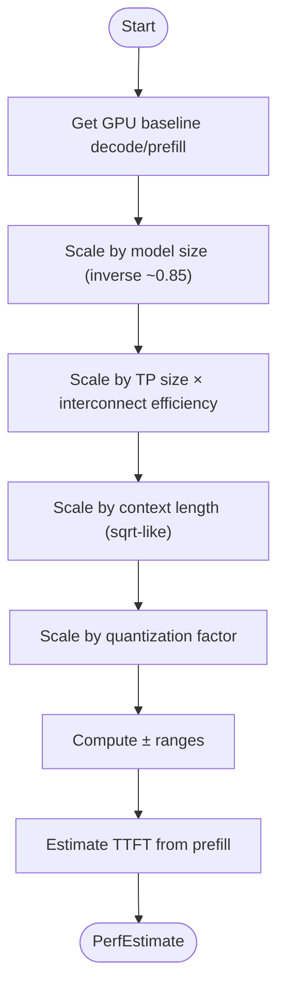

# Core Concepts

<cite>
**Referenced Files in This Document**
- [memory.py](file://src/vllm_wizard/planning/memory.py)
- [detect.py](file://src/vllm_wizard/hardware/detect.py)
- [metadata.py](file://src/vllm_wizard/models/metadata.py)
- [perf.py](file://src/vllm_wizard/planning/perf.py)
- [inputs.py](file://src/vllm_wizard/schemas/inputs.py)
- [outputs.py](file://src/vllm_wizard/schemas/outputs.py)
- [planner.py](file://src/vllm_wizard/planning/planner.py)
- [recommend.py](file://src/vllm_wizard/planning/recommend.py)
- [commands.py](file://src/vllm_wizard/render/commands.py)
- [cli.py](file://src/vllm_wizard/cli.py)
- [README.md](file://README.md)
</cite>

## Table of Contents
1. [Introduction](#introduction)
2. [Project Structure](#project-structure)
3. [Core Components](#core-components)
4. [Architecture Overview](#architecture-overview)
5. [Detailed Component Analysis](#detailed-component-analysis)
6. [Dependency Analysis](#dependency-analysis)
7. [Performance Considerations](#performance-considerations)
8. [Troubleshooting Guide](#troubleshooting-guide)
9. [Conclusion](#conclusion)
10. [Appendices](#appendices)

## Introduction
This document explains the fundamental principles behind the vLLM Config Wizard. It focuses on:
- VRAM memory breakdown: weights, KV cache, overhead, and headroom
- GPU detection and hardware compatibility
- Model metadata processing and parameter estimation
- Performance estimation methodology with heuristic approximations and scaling factors
- Tensor parallelism concepts and interconnect types
- Quantization methods and their trade-offs
- Mathematical foundations for memory calculations and performance modeling
- How model architecture, hardware capabilities, and deployment requirements relate

The goal is to make these concepts accessible through clear explanations and practical analogies.

## Project Structure
The project is organized around a planning pipeline that ingests model, hardware, and workload inputs, computes a VRAM feasibility analysis, recommends a vLLM configuration, estimates performance, and renders artifacts.

**Diagram sources**
- [cli.py](file://src/vllm_wizard/cli.py#L1-L385)
- [planner.py](file://src/vllm_wizard/planning/planner.py#L1-L172)
- [metadata.py](file://src/vllm_wizard/models/metadata.py#L1-L255)
- [detect.py](file://src/vllm_wizard/hardware/detect.py#L1-L229)
- [memory.py](file://src/vllm_wizard/planning/memory.py#L1-L367)
- [perf.py](file://src/vllm_wizard/planning/perf.py#L1-L220)
- [recommend.py](file://src/vllm_wizard/planning/recommend.py#L1-L333)
- [commands.py](file://src/vllm_wizard/render/commands.py#L1-L196)
- [inputs.py](file://src/vllm_wizard/schemas/inputs.py#L1-L110)
- [outputs.py](file://src/vllm_wizard/schemas/outputs.py#L1-L118)

**Section sources**
- [cli.py](file://src/vllm_wizard/cli.py#L1-L385)
- [planner.py](file://src/vllm_wizard/planning/planner.py#L1-L172)
- [README.md](file://README.md#L1-L308)

## Core Components
- VRAM memory calculator: Computes weights, KV cache, overhead, and feasibility with headroom.
- GPU detector: Auto-detects NVIDIA GPUs via nvidia-smi and provides approximate specs for unknown GPUs.
- Model metadata loader: Parses config.json and estimates parameters when needed.
- Performance estimator: Heuristic throughput/TTFT estimates with scaling factors.
- Recommendation engine: Chooses tensor-parallel size, KV cache dtype, quantization, and batching parameters.
- Artifact renderer: Generates vLLM serve commands, docker-compose, and Kubernetes values.

**Section sources**
- [memory.py](file://src/vllm_wizard/planning/memory.py#L1-L367)
- [detect.py](file://src/vllm_wizard/hardware/detect.py#L1-L229)
- [metadata.py](file://src/vllm_wizard/models/metadata.py#L1-L255)
- [perf.py](file://src/vllm_wizard/planning/perf.py#L1-L220)
- [recommend.py](file://src/vllm_wizard/planning/recommend.py#L1-L333)
- [commands.py](file://src/vllm_wizard/render/commands.py#L1-L196)

## Architecture Overview
The planner orchestrates the end-to-end flow: load model metadata, resolve hardware, compute memory breakdown, assess feasibility, generate recommendations, estimate performance, and render artifacts.

**Diagram sources**
- [cli.py](file://src/vllm_wizard/cli.py#L1-L385)
- [planner.py](file://src/vllm_wizard/planning/planner.py#L1-L172)
- [metadata.py](file://src/vllm_wizard/models/metadata.py#L1-L255)
- [detect.py](file://src/vllm_wizard/hardware/detect.py#L1-L229)
- [memory.py](file://src/vllm_wizard/planning/memory.py#L1-L367)
- [recommend.py](file://src/vllm_wizard/planning/recommend.py#L1-L333)
- [perf.py](file://src/vllm_wizard/planning/perf.py#L1-L220)
- [commands.py](file://src/vllm_wizard/render/commands.py#L1-L196)

## Detailed Component Analysis

### VRAM Memory Breakdown
The VRAM breakdown consists of four components:
- Weights memory: model parameters sized by dtype or quantization.
- KV cache memory: attention K/V storage scaled by context length, concurrency, and dtype.
- Overhead: framework and inter-GPU communication buffers.
- Headroom: remaining buffer for runtime allocations.

Key formulas and logic:
- Weights memory: parameters × bytes_per_param
  - Dtypes: FP32=4, FP16/BF16=2, INT8=1
  - Quantization: AWQ/GPTQ≈0.55 (includes overhead), INT8=1, FP8=1
- KV cache per token per layer: 2 × num_kv_heads × head_dim × dtype_bytes
  - Total: per_token × num_layers × context_len × concurrency × fragmentation_factor
- Overhead: max(1.0 GiB, 0.02 × VRAM) + communication overhead for multi-GPU
- Feasibility: weights + KV cache + overhead ≤ gpu_memory_utilization × VRAM
- Headroom: allocatable − required; risk classification by headroom thresholds

**Diagram sources**
- [memory.py](file://src/vllm_wizard/planning/memory.py#L31-L121)
- [memory.py](file://src/vllm_wizard/planning/memory.py#L124-L152)
- [memory.py](file://src/vllm_wizard/planning/memory.py#L155-L270)

**Section sources**
- [memory.py](file://src/vllm_wizard/planning/memory.py#L1-L367)
- [README.md](file://README.md#L160-L214)

### GPU Detection and Hardware Compatibility
- Auto-detection via nvidia-smi: queries GPU name, total memory, driver, CUDA, and compute capability.
- Fallback: approximate VRAM for known GPU names when auto-detection fails.
- Tensor-parallel recommendation: largest power-of-two ≤ number of GPUs.

**Diagram sources**
- [detect.py](file://src/vllm_wizard/hardware/detect.py#L10-L72)
- [detect.py](file://src/vllm_wizard/hardware/detect.py#L138-L159)
- [detect.py](file://src/vllm_wizard/hardware/detect.py#L162-L229)
- [planner.py](file://src/vllm_wizard/planning/planner.py#L138-L172)

**Section sources**
- [detect.py](file://src/vllm_wizard/hardware/detect.py#L1-L229)
- [planner.py](file://src/vllm_wizard/planning/planner.py#L138-L172)

### Model Metadata Processing and Parameter Estimation
- Loads config.json from local path or HuggingFace Hub.
- Extracts architecture parameters: layers, hidden size, attention heads, KV heads, vocab size, max position embeddings, intermediate size.
- Computes derived quantities: head dimension and parameter count in billions.
- Estimates total parameters when not provided, using a transformer approximation.

**Diagram sources**
- [metadata.py](file://src/vllm_wizard/models/metadata.py#L77-L100)
- [metadata.py](file://src/vllm_wizard/models/metadata.py#L102-L158)
- [metadata.py](file://src/vllm_wizard/models/metadata.py#L191-L206)
- [metadata.py](file://src/vllm_wizard/models/metadata.py#L209-L254)

**Section sources**
- [metadata.py](file://src/vllm_wizard/models/metadata.py#L1-L255)

### Performance Estimation Methodology
Heuristic approximations with scaling factors:
- Baselines: GPU-specific decode and prefill tokens-per-second tables.
- Model size scaling: inverse scaling with exponent ~0.85.
- Tensor parallel scaling: linear × efficiency (NVLink≈0.90, PCIe≈0.75, unknown≈0.80).
- Context length scaling: mild degradation with sqrt-like scaling.
- Quantization speedups: AWQ≈1.1, GPTQ≈1.05, INT8≈1.15, FP8≈1.2.
- TTFT estimate: prompt_tokens / prefill_tps × 1000 ms.

**Diagram sources**
- [perf.py](file://src/vllm_wizard/planning/perf.py#L10-L53)
- [perf.py](file://src/vllm_wizard/planning/perf.py#L56-L68)
- [perf.py](file://src/vllm_wizard/planning/perf.py#L70-L81)
- [perf.py](file://src/vllm_wizard/planning/perf.py#L83-L104)
- [perf.py](file://src/vllm_wizard/planning/perf.py#L107-L118)
- [perf.py](file://src/vllm_wizard/planning/perf.py#L120-L134)
- [perf.py](file://src/vllm_wizard/planning/perf.py#L136-L220)

**Section sources**
- [perf.py](file://src/vllm_wizard/planning/perf.py#L1-L220)
- [README.md](file://README.md#L177-L191)

### Tensor Parallelism and Interconnect Types
- Tensor parallel size is recommended as the largest power of two ≤ number of GPUs.
- Interconnect efficiency affects TP scaling:
  - NVLink: efficient, higher throughput
  - PCIe: more overhead, lower efficiency
  - Unknown: moderate assumption
- Effective VRAM for TP considers per-GPU VRAM multiplied by TP size.

**Diagram sources**
- [detect.py](file://src/vllm_wizard/hardware/detect.py#L138-L159)
- [perf.py](file://src/vllm_wizard/planning/perf.py#L83-L104)
- [planner.py](file://src/vllm_wizard/planning/planner.py#L48-L52)

**Section sources**
- [detect.py](file://src/vllm_wizard/hardware/detect.py#L138-L159)
- [perf.py](file://src/vllm_wizard/planning/perf.py#L83-L104)
- [planner.py](file://src/vllm_wizard/planning/planner.py#L48-L52)

### Quantization Methods and Trade-offs
- Quantization reduces weights memory footprint:
  - AWQ/GPTQ: ~0.55 bytes per param (includes overhead)
  - INT8: 1 byte per param
  - FP8: 1 byte per param
- Quantization can improve performance modestly (speedups listed above).
- KV cache dtype recommendations:
  - For high KV pressure (>40%) on modern GPUs (e.g., H100/H200/L40/RTX 40xx), consider FP8 KV cache (experimental).

**Diagram sources**
- [recommend.py](file://src/vllm_wizard/planning/recommend.py#L88-L99)
- [memory.py](file://src/vllm_wizard/planning/memory.py#L19-L25)

**Section sources**
- [recommend.py](file://src/vllm_wizard/planning/recommend.py#L88-L122)
- [memory.py](file://src/vllm_wizard/planning/memory.py#L19-L25)

### Mathematical Foundations for Memory Calculations
- Weights memory:
  - weights_bytes = parameters × bytes_per_param
  - bytes_per_param depends on dtype or quantization
- KV cache memory:
  - kv_per_token_per_layer = 2 × num_kv_heads × head_dim × dtype_bytes
  - kv_cache = kv_per_token_per_layer × num_layers × context_len × concurrency × fragmentation_factor
- Overhead:
  - base_overhead = max(1.0 GiB, 0.02 × VRAM)
  - comm_overhead = 0.25 × (TP − 1) for TP > 1
- Feasibility:
  - required = weights + KV cache + overhead
  - allocatable = VRAM × gpu_memory_utilization
  - headroom = allocatable − required
  - risk: headroom ≥ 2 GiB (LOW), ≥ 0 (MEDIUM), < 0 (HIGH)

**Section sources**
- [memory.py](file://src/vllm_wizard/planning/memory.py#L31-L121)
- [memory.py](file://src/vllm_wizard/planning/memory.py#L124-L152)
- [memory.py](file://src/vllm_wizard/planning/memory.py#L155-L270)
- [README.md](file://README.md#L192-L214)

### Relationship Between Model Architecture, Hardware, and Deployment
- Model architecture determines KV cache pressure (num_kv_heads, head_dim, num_layers, context_len).
- Hardware VRAM and interconnect efficiency determine feasible TP size and memory headroom.
- Deployment requirements (concurrency, batching mode, latency vs throughput) influence recommended parameters (max_model_len, max_num_seqs, max_num_batched_tokens).

**Section sources**
- [metadata.py](file://src/vllm_wizard/models/metadata.py#L12-L36)
- [recommend.py](file://src/vllm_wizard/planning/recommend.py#L124-L165)
- [planner.py](file://src/vllm_wizard/planning/planner.py#L167-L172)

## Dependency Analysis
The planner coordinates multiple modules. Coupling is primarily through shared schemas and enums.

**Diagram sources**
- [planner.py](file://src/vllm_wizard/planning/planner.py#L1-L172)
- [inputs.py](file://src/vllm_wizard/schemas/inputs.py#L1-L110)
- [outputs.py](file://src/vllm_wizard/schemas/outputs.py#L1-L118)
- [metadata.py](file://src/vllm_wizard/models/metadata.py#L1-L255)
- [detect.py](file://src/vllm_wizard/hardware/detect.py#L1-L229)
- [memory.py](file://src/vllm_wizard/planning/memory.py#L1-L367)
- [perf.py](file://src/vllm_wizard/planning/perf.py#L1-L220)
- [recommend.py](file://src/vllm_wizard/planning/recommend.py#L1-L333)
- [commands.py](file://src/vllm_wizard/render/commands.py#L1-L196)

**Section sources**
- [planner.py](file://src/vllm_wizard/planning/planner.py#L1-L172)

## Performance Considerations
- Heuristic nature: performance estimates are not benchmarks; actual performance depends on vLLM version, CUDA/driver versions, batch sizes, and request patterns.
- Interconnect efficiency: NVLink yields better TP scaling than PCIe.
- Quantization: can reduce memory and provide modest speedups; KV cache dtype can further reduce memory pressure on supported GPUs.
- Context length: longer contexts degrade decode throughput due to attention overhead.
- Throughput vs latency: batching modes adjust max_num_seqs and max_num_batched_tokens accordingly.

[No sources needed since this section provides general guidance]

## Troubleshooting Guide
Common issues and remedies:
- No GPUs detected:
  - Ensure nvidia-smi is installed and GPUs are available; use “auto” or specify GPU name and VRAM.
- Configuration does not fit:
  - Reduce context length, increase headroom, enable quantization (AWQ/GPTQ), or switch to FP8 KV cache if supported.
  - Lower concurrency or adjust batching mode.
- High OOM risk:
  - Consider quantization or shorter context; monitor memory usage during inference.
- Insufficient VRAM for weights:
  - Increase TP size or use quantized models; verify interconnect efficiency.

**Section sources**
- [detect.py](file://src/vllm_wizard/hardware/detect.py#L10-L72)
- [memory.py](file://src/vllm_wizard/planning/memory.py#L155-L270)
- [recommend.py](file://src/vllm_wizard/planning/recommend.py#L88-L122)
- [README.md](file://README.md#L171-L191)

## Conclusion
The vLLM Config Wizard provides a structured approach to sizing and configuring vLLM deployments. By decomposing VRAM into weights, KV cache, overhead, and headroom—and by estimating performance with realistic heuristics—it helps users select appropriate hardware, model settings, and deployment parameters. While estimates are not benchmarks, they offer practical guidance grounded in model architecture and hardware characteristics.

[No sources needed since this section summarizes without analyzing specific files]

## Appendices

### Practical Analogies
- VRAM is like a warehouse: weights are inventory, KV cache is the staging area for active conversations, overhead is administrative costs, and headroom is the emergency buffer.
- Tensor parallelism is like splitting a large order across multiple workers; interconnect is the efficiency of the shipping lanes (NVLink vs PCIe).
- Quantization is like compressing boxes to fit more items—sometimes with minor quality adjustments.

[No sources needed since this section doesn't analyze specific files]