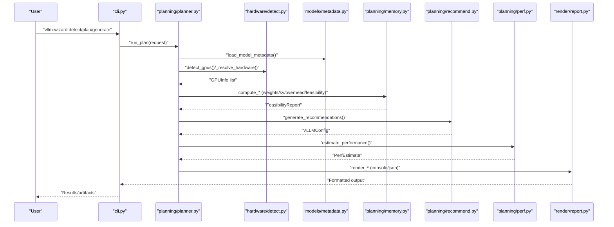
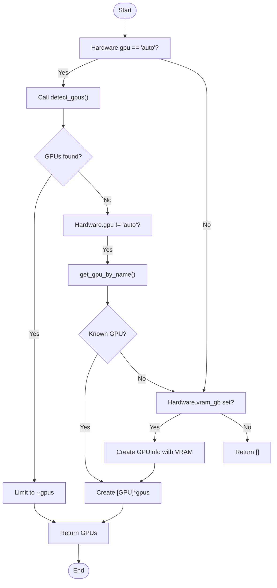
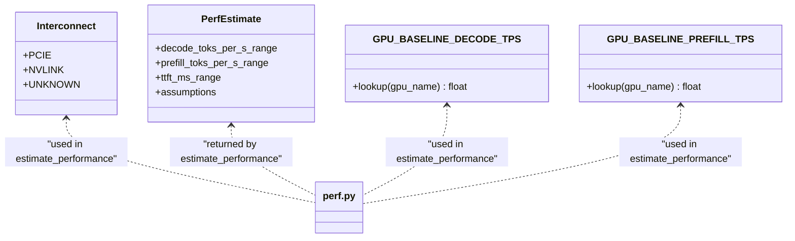
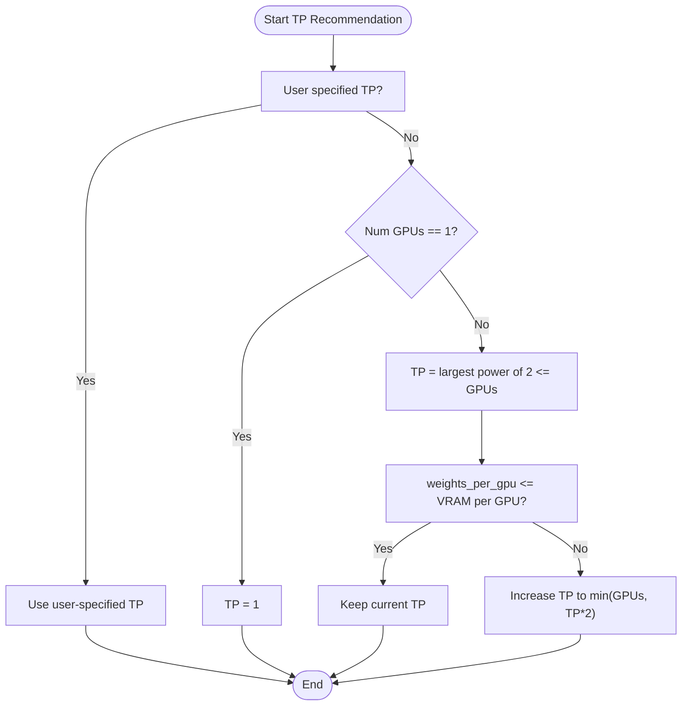
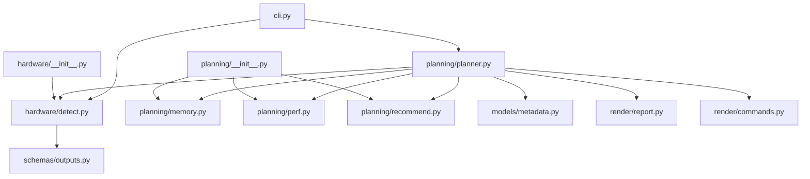

# GPU Detection and Hardware Compatibility

<cite>
**Referenced Files in This Document**
- [detect.py](file://src/vllm_wizard/hardware/detect.py)
- [planner.py](file://src/vllm_wizard/planning/planner.py)
- [memory.py](file://src/vllm_wizard/planning/memory.py)
- [recommend.py](file://src/vllm_wizard/planning/recommend.py)
- [perf.py](file://src/vllm_wizard/planning/perf.py)
- [metadata.py](file://src/vllm_wizard/models/metadata.py)
- [inputs.py](file://src/vllm_wizard/schemas/inputs.py)
- [outputs.py](file://src/vllm_wizard/schemas/outputs.py)
- [cli.py](file://src/vllm_wizard/cli.py)
- [report.py](file://src/vllm_wizard/render/report.py)
- [commands.py](file://src/vllm_wizard/render/commands.py)
- [__init__.py (hardware)](file://src/vllm_wizard/hardware/__init__.py)
- [__init__.py (planning)](file://src/vllm_wizard/planning/__init__.py)
- [README.md](file://README.md)
</cite>

## Table of Contents
1. [Introduction](#introduction)
2. [Project Structure](#project-structure)
3. [Core Components](#core-components)
4. [Architecture Overview](#architecture-overview)
5. [Detailed Component Analysis](#detailed-component-analysis)
6. [Dependency Analysis](#dependency-analysis)
7. [Performance Considerations](#performance-considerations)
8. [Troubleshooting Guide](#troubleshooting-guide)
9. [Conclusion](#conclusion)

## Introduction
This document explains the GPU detection and hardware compatibility systems in the vLLM Configuration Wizard. It covers automatic detection via nvidia-smi, cross-platform hardware discovery fallbacks, supported GPU architectures and memory capacities, compute capability exposure, compatibility matrices, performance characteristics, manual hardware specification and overrides, tensor parallel recommendations, interconnect-aware scaling, and troubleshooting for detection and compatibility issues.

## Project Structure
The GPU detection and hardware compatibility system spans several modules:
- Hardware detection: queries system GPU information and provides fallbacks
- Planning pipeline: orchestrates model metadata loading, hardware resolution, memory feasibility, recommendations, and performance estimation
- Memory calculations: computes weights, KV cache, overhead, and feasibility
- Recommendations: selects tensor parallel size, quantization, KV cache dtype, and other vLLM parameters
- Performance estimation: provides heuristic throughput and latency ranges
- CLI and rendering: exposes commands, renders reports, and generates artifacts

```mermaid
graph TB
subgraph "CLI"
CLI["cli.py"]
end
subgraph "Hardware"
DETECT["hardware/detect.py"]
HW_INIT["hardware/__init__.py"]
end
subgraph "Planning"
PLANNER["planning/planner.py"]
MEMORY["planning/memory.py"]
RECOMMEND["planning/recommend.py"]
PERF["planning/perf.py"]
PLAN_INIT["planning/__init__.py"]
end
subgraph "Models"
METADATA["models/metadata.py"]
end
subgraph "Schemas"
INPUTS["schemas/inputs.py"]
OUTPUTS["schemas/outputs.py"]
end
subgraph "Rendering"
REPORT["render/report.py"]
COMMANDS["render/commands.py"]
end
CLI --> DETECT
CLI --> PLANNER
PLANNER --> DETECT
PLANNER --> METADATA
PLANNER --> MEMORY
PLANNER --> RECOMMEND
PLANNER --> PERF
PLANNER --> REPORT
PLANNER --> COMMANDS
DETECT --> OUTPUTS
PLANNER --> OUTPUTS
RECOMMEND --> INPUTS
MEMORY --> INPUTS
PERF --> INPUTS
REPORT --> OUTPUTS
COMMANDS --> OUTPUTS
```

**Diagram sources**
- [cli.py](file://src/vllm_wizard/cli.py#L1-L385)
- [detect.py](file://src/vllm_wizard/hardware/detect.py#L1-L229)
- [planner.py](file://src/vllm_wizard/planning/planner.py#L1-L172)
- [memory.py](file://src/vllm_wizard/planning/memory.py#L1-L367)
- [recommend.py](file://src/vllm_wizard/planning/recommend.py#L1-L333)
- [perf.py](file://src/vllm_wizard/planning/perf.py#L1-L220)
- [metadata.py](file://src/vllm_wizard/models/metadata.py#L1-L255)
- [inputs.py](file://src/vllm_wizard/schemas/inputs.py#L1-L110)
- [outputs.py](file://src/vllm_wizard/schemas/outputs.py#L1-L118)
- [report.py](file://src/vllm_wizard/render/report.py#L1-L272)
- [commands.py](file://src/vllm_wizard/render/commands.py#L1-L196)

**Section sources**
- [README.md](file://README.md#L1-L308)
- [cli.py](file://src/vllm_wizard/cli.py#L1-L385)
- [__init__.py (hardware)](file://src/vllm_wizard/hardware/__init__.py#L1-L9)
- [__init__.py (planning)](file://src/vllm_wizard/planning/__init__.py#L1-L32)

## Core Components
- GPU detection via nvidia-smi: retrieves GPU names, total VRAM (MiB), driver version, CUDA version, and compute capability
- Manual hardware specification: allows overriding GPU name, VRAM per GPU, interconnect type, and tensor parallel size
- Hardware resolution: auto-detection, name-based lookup, and manual VRAM specification
- Memory feasibility: computes weights, KV cache, overhead, and headroom; classifies OOM risk
- Recommendations: tensor parallel size, quantization, KV cache dtype, and other vLLM parameters
- Performance estimation: heuristic decode/prefill throughput and TTFT ranges with interconnect-aware scaling
- Artifact generation: vLLM serve command, docker-compose, and Kubernetes manifests

**Section sources**
- [detect.py](file://src/vllm_wizard/hardware/detect.py#L10-L229)
- [planner.py](file://src/vllm_wizard/planning/planner.py#L138-L172)
- [memory.py](file://src/vllm_wizard/planning/memory.py#L31-L367)
- [recommend.py](file://src/vllm_wizard/planning/recommend.py#L167-L333)
- [perf.py](file://src/vllm_wizard/planning/perf.py#L136-L220)
- [inputs.py](file://src/vllm_wizard/schemas/inputs.py#L68-L110)
- [outputs.py](file://src/vllm_wizard/schemas/outputs.py#L17-L118)

## Architecture Overview
The system integrates CLI commands, hardware detection, model metadata loading, memory computations, recommendation logic, and performance estimation into a cohesive planning pipeline.



**Diagram sources**
- [cli.py](file://src/vllm_wizard/cli.py#L62-L213)
- [planner.py](file://src/vllm_wizard/planning/planner.py#L21-L136)
- [detect.py](file://src/vllm_wizard/hardware/detect.py#L10-L229)
- [metadata.py](file://src/vllm_wizard/models/metadata.py#L209-L255)
- [memory.py](file://src/vllm_wizard/planning/memory.py#L155-L367)
- [recommend.py](file://src/vllm_wizard/planning/recommend.py#L167-L333)
- [perf.py](file://src/vllm_wizard/planning/perf.py#L136-L220)
- [report.py](file://src/vllm_wizard/render/report.py#L14-L272)

## Detailed Component Analysis

### GPU Detection and Hardware Resolution
- Automatic detection uses nvidia-smi to query GPU name, total memory (MiB), driver version, CUDA version, and compute capability
- Fallbacks:
  - Name-based lookup for common GPU models with approximate VRAM
  - Manual VRAM specification when nvidia-smi is unavailable
- Hardware resolution prioritizes auto-detection, then name lookup, then manual VRAM specification



**Diagram sources**
- [planner.py](file://src/vllm_wizard/planning/planner.py#L138-L172)
- [detect.py](file://src/vllm_wizard/hardware/detect.py#L10-L229)

**Section sources**
- [detect.py](file://src/vllm_wizard/hardware/detect.py#L10-L229)
- [planner.py](file://src/vllm_wizard/planning/planner.py#L138-L172)
- [inputs.py](file://src/vllm_wizard/schemas/inputs.py#L68-L76)

### Supported GPU Architectures, Memory Capacities, and Compute Capabilities
- Automatic detection exposes:
  - GPU name
  - Total VRAM in MiB (convertible to GiB)
  - Driver version
  - CUDA version
  - Compute capability
- Manual specification allows overriding VRAM per GPU and interconnect type
- Compute capability is collected via nvidia-smi and attached to each GPUInfo

**Section sources**
- [detect.py](file://src/vllm_wizard/hardware/detect.py#L10-L136)
- [outputs.py](file://src/vllm_wizard/schemas/outputs.py#L17-L35)
- [inputs.py](file://src/vllm_wizard/schemas/inputs.py#L38-L44)

### Hardware Compatibility Matrices and Performance Characteristics
- Interconnect-aware performance scaling:
  - NVLink: higher inter-GPU efficiency for tensor parallel scaling
  - PCIe: lower efficiency; larger performance penalties
- Baseline decode and prefill throughput tables for known GPU families
- Heuristic scaling by model size, context length, quantization, and tensor parallel size



**Diagram sources**
- [inputs.py](file://src/vllm_wizard/schemas/inputs.py#L38-L44)
- [outputs.py](file://src/vllm_wizard/schemas/outputs.py#L77-L92)
- [perf.py](file://src/vllm_wizard/planning/perf.py#L8-L54)

**Section sources**
- [perf.py](file://src/vllm_wizard/planning/perf.py#L83-L105)
- [inputs.py](file://src/vllm_wizard/schemas/inputs.py#L38-L44)

### Manual Hardware Specification and Overrides
- Manual override options:
  - GPU name (with approximate VRAM lookup)
  - Number of GPUs
  - VRAM per GPU (GB)
  - Interconnect type (PCIe/NVLink/Unknown)
  - Tensor parallel size
- These inputs feed into hardware resolution and subsequent memory and performance computations

**Section sources**
- [inputs.py](file://src/vllm_wizard/schemas/inputs.py#L68-L76)
- [planner.py](file://src/vllm_wizard/planning/planner.py#L138-L172)

### Tensor Parallel Recommendations Based on GPU Capabilities
- Automatic recommendation chooses the largest power of 2 less than or equal to the number of GPUs
- If weights do not fit per GPU with the recommended TP size, the system increases TP to maintain balance
- User can override tensor parallel size
- Interconnect type influences performance scaling for multi-GPU setups



**Diagram sources**
- [recommend.py](file://src/vllm_wizard/planning/recommend.py#L42-L68)
- [detect.py](file://src/vllm_wizard/hardware/detect.py#L138-L159)

**Section sources**
- [detect.py](file://src/vllm_wizard/hardware/detect.py#L138-L159)
- [recommend.py](file://src/vllm_wizard/planning/recommend.py#L42-L68)

### Multi-GPU Scenarios and Memory Allocation Strategies
- Total VRAM is computed from detected GPUs
- For tensor parallel groups, effective VRAM considers TP size and interconnect efficiency
- Overhead computation includes base overhead and inter-GPU communication buffers
- Memory feasibility accounts for weights per TP shard, KV cache, and overhead with configurable headroom and fragmentation

**Section sources**
- [planner.py](file://src/vllm_wizard/planning/planner.py#L47-L97)
- [memory.py](file://src/vllm_wizard/planning/memory.py#L124-L152)
- [perf.py](file://src/vllm_wizard/planning/perf.py#L83-L105)

## Dependency Analysis
The hardware detection module exports detection and tensor-parallel helpers. The planning module orchestrates detection, metadata loading, memory computations, recommendations, and performance estimation. Rendering modules produce console and artifact outputs.



**Diagram sources**
- [__init__.py (hardware)](file://src/vllm_wizard/hardware/__init__.py#L1-L9)
- [__init__.py (planning)](file://src/vllm_wizard/planning/__init__.py#L1-L32)
- [detect.py](file://src/vllm_wizard/hardware/detect.py#L1-L229)
- [planner.py](file://src/vllm_wizard/planning/planner.py#L1-L172)
- [memory.py](file://src/vllm_wizard/planning/memory.py#L1-L367)
- [recommend.py](file://src/vllm_wizard/planning/recommend.py#L1-L333)
- [perf.py](file://src/vllm_wizard/planning/perf.py#L1-L220)
- [report.py](file://src/vllm_wizard/render/report.py#L1-L272)
- [commands.py](file://src/vllm_wizard/render/commands.py#L1-L196)
- [cli.py](file://src/vllm_wizard/cli.py#L1-L385)

**Section sources**
- [__init__.py (hardware)](file://src/vllm_wizard/hardware/__init__.py#L1-L9)
- [__init__.py (planning)](file://src/vllm_wizard/planning/__init__.py#L1-L32)

## Performance Considerations
- Heuristic performance estimates depend on GPU family baselines, model size scaling, tensor parallel efficiency, context length, and quantization
- NVLink interconnect yields better multi-GPU scaling compared to PCIe
- KV cache pressure thresholds inform KV cache dtype recommendations (e.g., FP8 for supported GPUs under high pressure)
- Overhead and fragmentation factors influence feasibility margins

**Section sources**
- [perf.py](file://src/vllm_wizard/planning/perf.py#L136-L220)
- [recommend.py](file://src/vllm_wizard/planning/recommend.py#L102-L122)
- [memory.py](file://src/vllm_wizard/planning/memory.py#L124-L152)

## Troubleshooting Guide
Common detection and compatibility issues and resolutions:
- No GPUs detected:
  - Ensure nvidia-smi is installed and accessible
  - Verify NVIDIA drivers and CUDA installation
  - Use manual hardware specification (--gpu, --vram-gb, --gpus)
- Inaccurate VRAM reporting:
  - Confirm GPU memory configuration and BIOS settings
  - Use manual VRAM override if auto-detection fails
- Out-of-memory (OOM) risks:
  - Reduce context length or concurrency
  - Enable quantization (AWQ/GPTQ/INT8/FP8)
  - Lower GPU memory utilization target
  - Increase headroom
- Interconnect limitations:
  - Prefer NVLink for multi-GPU setups
  - Expect reduced performance on PCIe interconnect
- Compute capability mismatches:
  - Verify CUDA version compatibility with model requirements
  - Check driver version alignment with CUDA runtime

**Section sources**
- [detect.py](file://src/vllm_wizard/hardware/detect.py#L65-L71)
- [planner.py](file://src/vllm_wizard/planning/planner.py#L41-L46)
- [memory.py](file://src/vllm_wizard/planning/memory.py#L155-L270)
- [recommend.py](file://src/vllm_wizard/planning/recommend.py#L88-L122)
- [cli.py](file://src/vllm_wizard/cli.py#L62-L80)

## Conclusion
The vLLM Configuration Wizard provides robust GPU detection and hardware compatibility through nvidia-smi integration, manual overrides, and intelligent recommendations. It computes memory feasibility, suggests tensor parallel configurations, and estimates performance with interconnect-aware scaling. Users can troubleshoot detection and compatibility issues by validating drivers, specifying hardware manually, and adjusting model and workload parameters to fit available VRAM.