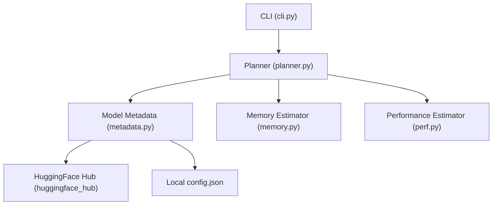
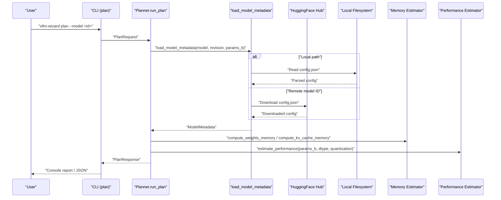
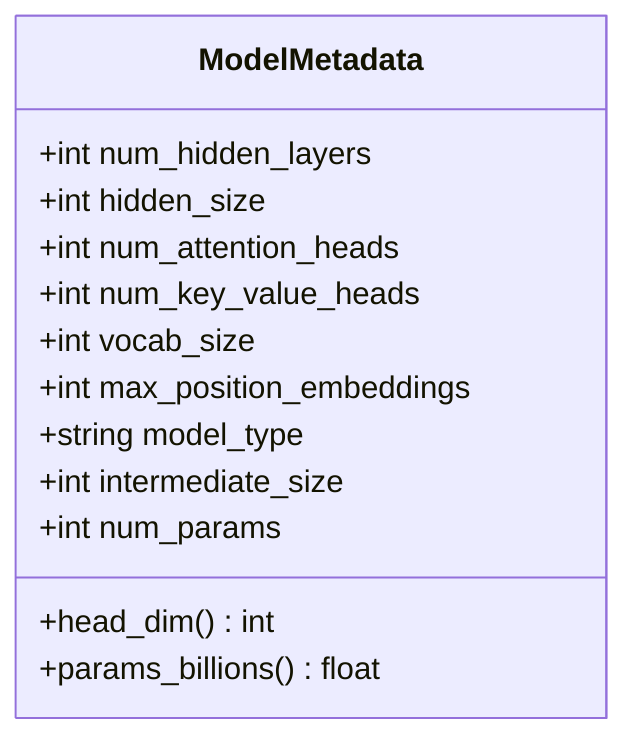
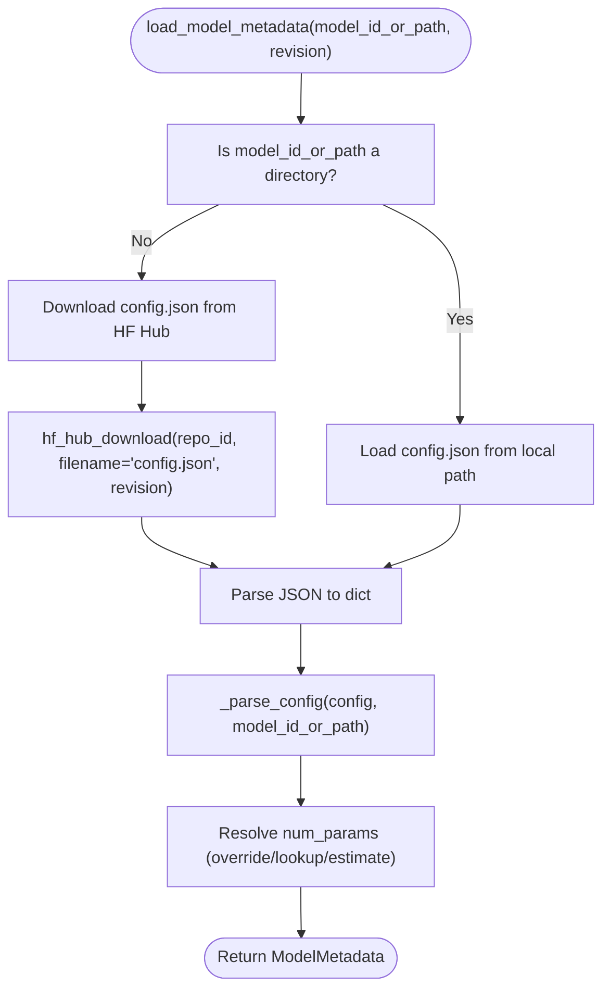
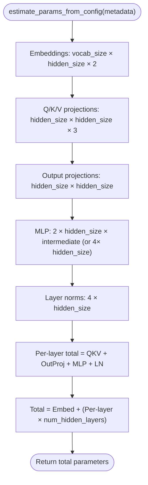
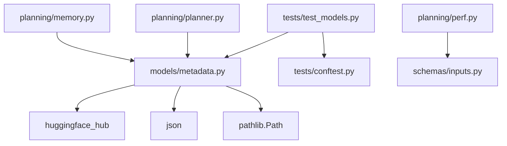

# Model Metadata Processing

<cite>
**Referenced Files in This Document**
- [metadata.py](file://src/vllm_wizard/models/metadata.py)
- [config.json](file://test_model/config.json)
- [test_models.py](file://tests/test_models.py)
- [conftest.py](file://tests/conftest.py)
- [planner.py](file://src/vllm_wizard/planning/planner.py)
- [memory.py](file://src/vllm_wizard/planning/memory.py)
- [perf.py](file://src/vllm_wizard/planning/perf.py)
- [cli.py](file://src/vllm_wizard/cli.py)
- [inputs.py](file://src/vllm_wizard/schemas/inputs.py)
- [README.md](file://README.md)
</cite>

## Table of Contents
1. [Introduction](#introduction)
2. [Project Structure](#project-structure)
3. [Core Components](#core-components)
4. [Architecture Overview](#architecture-overview)
5. [Detailed Component Analysis](#detailed-component-analysis)
6. [Dependency Analysis](#dependency-analysis)
7. [Performance Considerations](#performance-considerations)
8. [Troubleshooting Guide](#troubleshooting-guide)
9. [Conclusion](#conclusion)
10. [Appendices](#appendices)

## Introduction
This document explains how the project extracts and processes model metadata for memory and performance estimation. It covers:
- Automatic retrieval of model metadata from HuggingFace Hub
- Parsing local model configurations from config.json
- Extraction of architecture parameters (hidden layers, attention heads, embedding dimensions)
- Parameter estimation and model size calculations
- Quantization-aware metadata processing and data type optimizations
- Supported model families and their specific metadata requirements
- Validation, compatibility checks, and fallback mechanisms for unknown models

## Project Structure
The model metadata pipeline lives primarily in the models/metadata module and integrates with the planning subsystem for memory and performance computations.

**Diagram sources**
- [cli.py](file://src/vllm_wizard/cli.py#L82-L213)
- [planner.py](file://src/vllm_wizard/planning/planner.py#L21-L135)
- [metadata.py](file://src/vllm_wizard/models/metadata.py#L86-L254)
- [memory.py](file://src/vllm_wizard/planning/memory.py#L31-L121)
- [perf.py](file://src/vllm_wizard/planning/perf.py#L136-L219)

**Section sources**
- [cli.py](file://src/vllm_wizard/cli.py#L82-L213)
- [planner.py](file://src/vllm_wizard/planning/planner.py#L21-L135)

## Core Components
- ModelMetadata: A dataclass capturing essential architecture parameters and derived properties (e.g., head dimension).
- load_model_metadata: Orchestrates local and remote config loading, parsing, and parameter resolution.
- KNOWN_MODEL_SIZES: Lookup table for known model families to quickly assign parameter counts.
- estimate_params_from_config: Heuristic parameter estimation for unknown models.
- KV cache and weights memory computation: Uses metadata to compute memory footprints under various dtypes and quantization schemes.

**Section sources**
- [metadata.py](file://src/vllm_wizard/models/metadata.py#L12-L254)
- [memory.py](file://src/vllm_wizard/planning/memory.py#L9-L25)

## Architecture Overview
The metadata pipeline is invoked early in the planning process to supply architecture parameters for memory and performance computations.

**Diagram sources**
- [cli.py](file://src/vllm_wizard/cli.py#L82-L213)
- [planner.py](file://src/vllm_wizard/planning/planner.py#L21-L135)
- [metadata.py](file://src/vllm_wizard/models/metadata.py#L209-L254)
- [memory.py](file://src/vllm_wizard/planning/memory.py#L31-L121)
- [perf.py](file://src/vllm_wizard/planning/perf.py#L136-L219)

## Detailed Component Analysis

### ModelMetadata Dataclass
ModelMetadata encapsulates the core architecture parameters and exposes derived properties for convenience.

Key behaviors:
- head_dim computes the per-head dimension from hidden_size and num_attention_heads.
- params_billions converts stored parameter count to billions.

**Diagram sources**
- [metadata.py](file://src/vllm_wizard/models/metadata.py#L12-L36)

**Section sources**
- [metadata.py](file://src/vllm_wizard/models/metadata.py#L12-L36)

### HuggingFace Hub Integration
The loader supports retrieving config.json from HuggingFace Hub when a model ID is provided. It handles repository and entry errors explicitly.

**Diagram sources**
- [metadata.py](file://src/vllm_wizard/models/metadata.py#L209-L254)
- [metadata.py](file://src/vllm_wizard/models/metadata.py#L86-L100)
- [metadata.py](file://src/vllm_wizard/models/metadata.py#L102-L158)

**Section sources**
- [metadata.py](file://src/vllm_wizard/models/metadata.py#L86-L100)
- [metadata.py](file://src/vllm_wizard/models/metadata.py#L209-L254)

### Local Model Configuration Parsing
When a local path is provided, the loader reads config.json directly. The parser extracts architecture parameters with robust fallbacks across common model families.

Supported fallbacks:
- num_hidden_layers: tries multiple keys commonly used by different families
- hidden_size: tries multiple keys commonly used by different families
- num_attention_heads: tries multiple keys commonly used by different families
- num_key_value_heads: falls back to attention heads if unspecified (MHA)
- vocab_size: defaults if unspecified
- max_position_embeddings: tries multiple keys commonly used by different families
- intermediate_size: tries multiple keys commonly used by different families

Validation:
- Raises a ValueError with actionable guidance if required fields are missing.

**Section sources**
- [metadata.py](file://src/vllm_wizard/models/metadata.py#L102-L158)

### Parameter Estimation and Model Size Calculation
Two strategies are used to determine parameter counts:
- Override: params_b argument passed to load_model_metadata
- Lookup: KNOWN_MODEL_SIZES table keyed by model_id substring matching
- Estimate: estimate_params_from_config builds a heuristic model size for unknown models

Heuristic estimation formula:
- Embedding parameters: input and output embeddings
- Per-layer parameters: Q/K/V projections, output projections, MLP up/down projections, and layer norms
- Total: embedding params + per-layer params × num_hidden_layers

**Diagram sources**
- [metadata.py](file://src/vllm_wizard/models/metadata.py#L161-L188)

**Section sources**
- [metadata.py](file://src/vllm_wizard/models/metadata.py#L161-L188)
- [metadata.py](file://src/vllm_wizard/models/metadata.py#L191-L206)

### Quantization-Aware Metadata Processing and Data Type Optimizations
The memory estimator accounts for both weight dtype and quantization:
- compute_weights_memory: selects bytes per parameter based on dtype or quantization scheme
- compute_kv_cache_memory: selects bytes per element based on KV cache dtype (with fp8 special handling)

Known quantization byte mappings:
- AWQ/GPTQ: approximately 0.55 bytes per parameter (includes overhead)
- INT8: 1.0 byte per parameter
- FP8: 1.0 byte per parameter
- FP16/BF16: 2.0 bytes per parameter
- FP32: 4.0 bytes per parameter

KV cache dtype mapping:
- FP8 variants: 1.0 byte per element
- FP16/BF16: 2.0 bytes per element
- FP32: 4.0 bytes per element
- Defaults to FP16 if unspecified

**Section sources**
- [memory.py](file://src/vllm_wizard/planning/memory.py#L9-L25)
- [memory.py](file://src/vllm_wizard/planning/memory.py#L31-L56)
- [memory.py](file://src/vllm_wizard/planning/memory.py#L59-L121)

### Supported Model Families and Specific Metadata Requirements
The system targets transformer architectures with the following common fields:
- LLaMA-like: num_hidden_layers, hidden_size, num_attention_heads, num_key_value_heads
- Mistral-like: similar to LLaMA-like
- Qwen, Gemma, Falcon, Yi, DeepSeek, CodeLLama: best-effort extraction; missing KV heads fall back to attention heads

Fallback behavior:
- num_key_value_heads defaults to num_attention_heads when missing (MHA assumption)

Validation and error messages:
- Explicit ValueError raised if required fields are missing, guiding users to provide params_b or use local config.json.

**Section sources**
- [metadata.py](file://src/vllm_wizard/models/metadata.py#L102-L158)
- [README.md](file://README.md#L211-L223)

### Model Validation, Compatibility Checks, and Fallback Mechanisms
Validation and compatibility:
- Required fields checked during parsing; missing fields cause a ValueError with guidance
- KV heads fallback ensures compatibility for MHA models
- Known model size lookup provides quick parameter assignment for supported families
- Heuristic estimation serves as a last resort for unknown models

Integration points:
- CLI passes model, revision, trust_remote_code, and params_b to the loader
- Planner consumes ModelMetadata to compute memory and performance

**Section sources**
- [metadata.py](file://src/vllm_wizard/models/metadata.py#L102-L158)
- [metadata.py](file://src/vllm_wizard/models/metadata.py#L191-L206)
- [cli.py](file://src/vllm_wizard/cli.py#L82-L213)
- [planner.py](file://src/vllm_wizard/planning/planner.py#L21-L135)

## Dependency Analysis
The metadata module depends on:
- huggingface_hub for remote config retrieval
- Standard library modules for filesystem and JSON parsing
- Tests validate parsing, fallbacks, and estimation

**Diagram sources**
- [metadata.py](file://src/vllm_wizard/models/metadata.py#L3-L9)
- [test_models.py](file://tests/test_models.py#L8-L13)
- [conftest.py](file://tests/conftest.py#L8-L126)
- [planner.py](file://src/vllm_wizard/planning/planner.py#L6-L18)
- [memory.py](file://src/vllm_wizard/planning/memory.py#L5-L7)
- [perf.py](file://src/vllm_wizard/planning/perf.py#L5-L6)
- [inputs.py](file://src/vllm_wizard/schemas/inputs.py#L54-L66)

**Section sources**
- [metadata.py](file://src/vllm_wizard/models/metadata.py#L3-L9)
- [test_models.py](file://tests/test_models.py#L8-L13)
- [planner.py](file://src/vllm_wizard/planning/planner.py#L6-L18)
- [memory.py](file://src/vllm_wizard/planning/memory.py#L5-L7)
- [perf.py](file://src/vllm_wizard/planning/perf.py#L5-L6)
- [inputs.py](file://src/vllm_wizard/schemas/inputs.py#L54-L66)

## Performance Considerations
- Parameter estimation is O(1) and lightweight; KV cache and weights memory computations depend on metadata fields and chosen dtypes/quantization.
- Remote config retrieval adds network latency; caching or local copies are recommended for repeated runs.
- KV cache memory scales with num_hidden_layers, context length, and concurrency; choosing appropriate KV cache dtypes can reduce memory footprint.

[No sources needed since this section provides general guidance]

## Troubleshooting Guide
Common issues and resolutions:
- Missing required fields in config.json: The parser raises a ValueError indicating which fields are missing and how to fix it.
- config.json not found locally: FileNotFoundError is raised; ensure the path points to a directory containing config.json.
- Remote model ID without config.json: ValueError is raised for repository or entry not found; confirm the model ID and revision.
- Unknown model family: Use params_b to override parameter count or provide a local config.json.
- KV heads missing: The loader falls back to num_attention_heads; verify model_type and expected GQA behavior.

**Section sources**
- [metadata.py](file://src/vllm_wizard/models/metadata.py#L77-L83)
- [metadata.py](file://src/vllm_wizard/models/metadata.py#L86-L100)
- [metadata.py](file://src/vllm_wizard/models/metadata.py#L102-L158)
- [test_models.py](file://tests/test_models.py#L48-L65)

## Conclusion
The model metadata pipeline provides robust extraction from both local and remote sources, with strong fallbacks and estimations for unknown models. It integrates cleanly with memory and performance computations to enable feasible vLLM configurations and accurate VRAM breakdowns.

[No sources needed since this section summarizes without analyzing specific files]

## Appendices

### Example Model Configurations
- LLaMA-style config.json with standard fields is parsed directly.
- GQA models specify fewer num_key_value_heads; the loader falls back to attention heads when absent.
- The test fixtures demonstrate representative configs for LLaMA-like, Mistral-like, and GQA scenarios.

**Section sources**
- [config.json](file://test_model/config.json#L1-L12)
- [conftest.py](file://tests/conftest.py#L11-L126)

### CLI Integration and Options
- The CLI exposes model-related options including model ID, revision, trust_remote_code, dtype, quantization, KV cache dtype, max_model_len, and params_b.
- These options feed into load_model_metadata and downstream computations.

**Section sources**
- [cli.py](file://src/vllm_wizard/cli.py#L82-L213)
- [inputs.py](file://src/vllm_wizard/schemas/inputs.py#L54-L66)