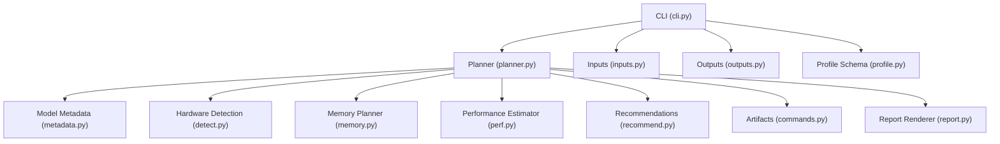
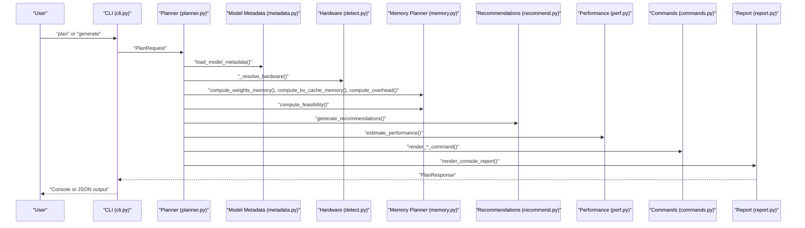
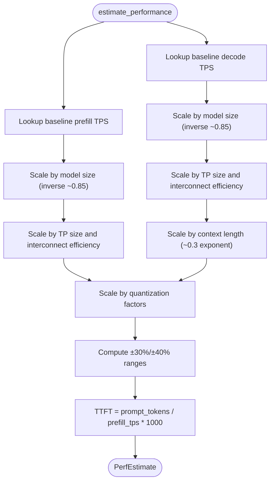
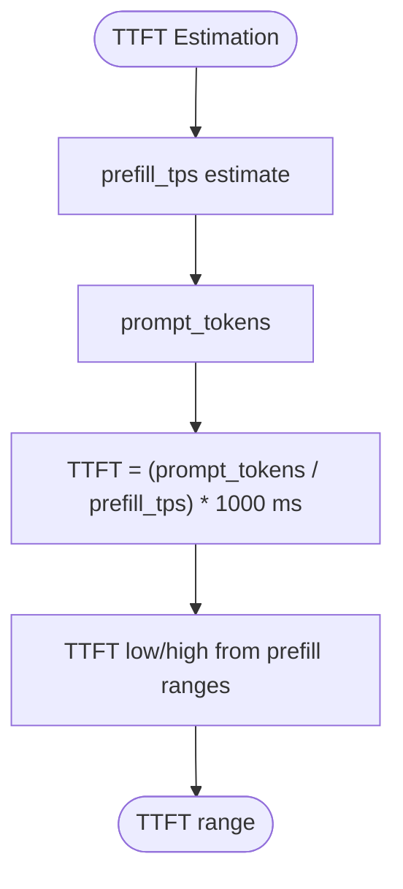
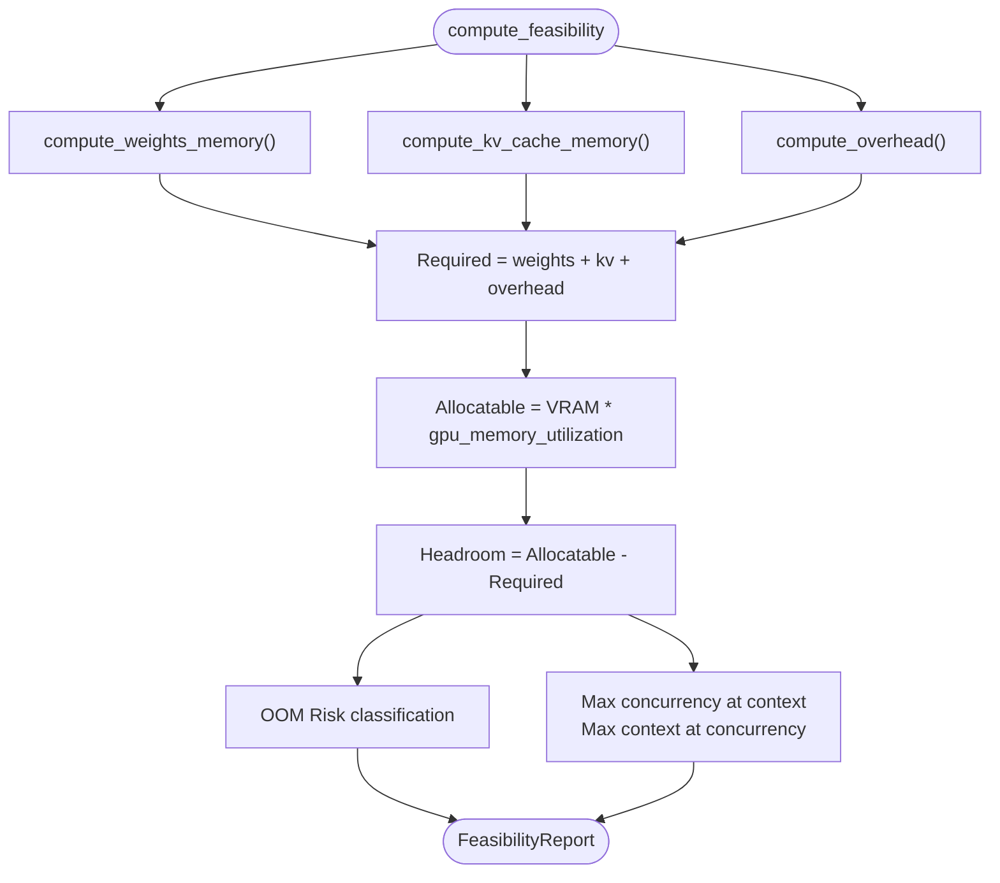
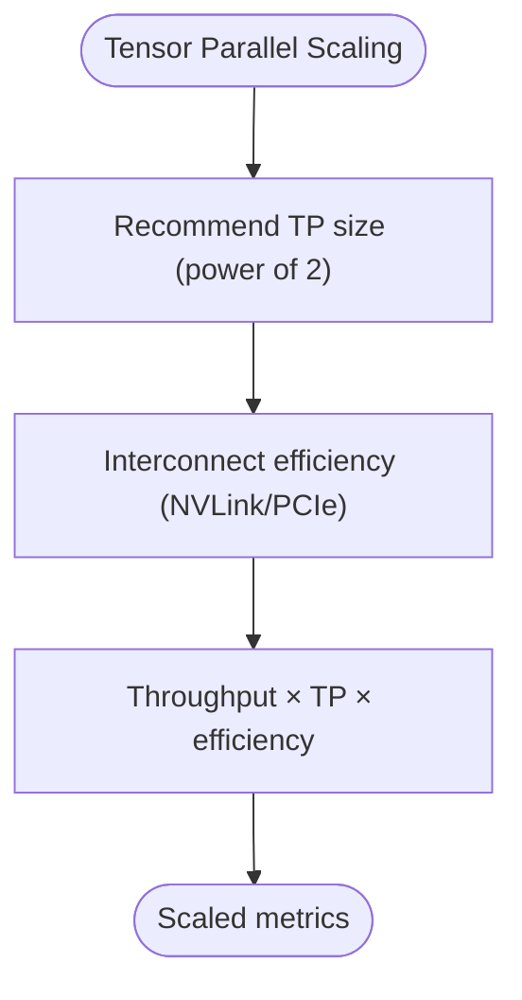
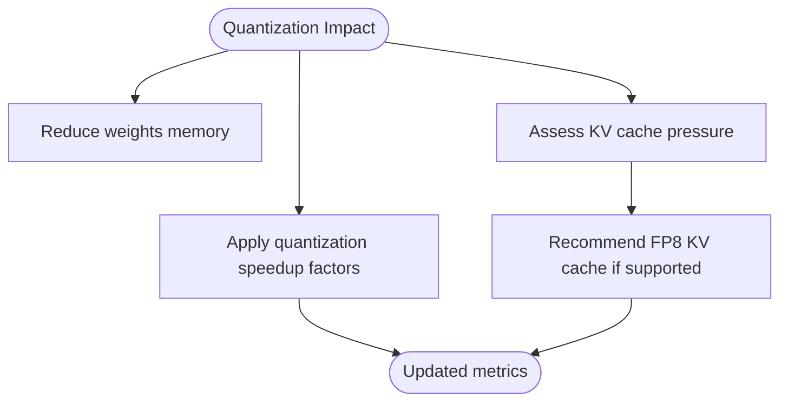
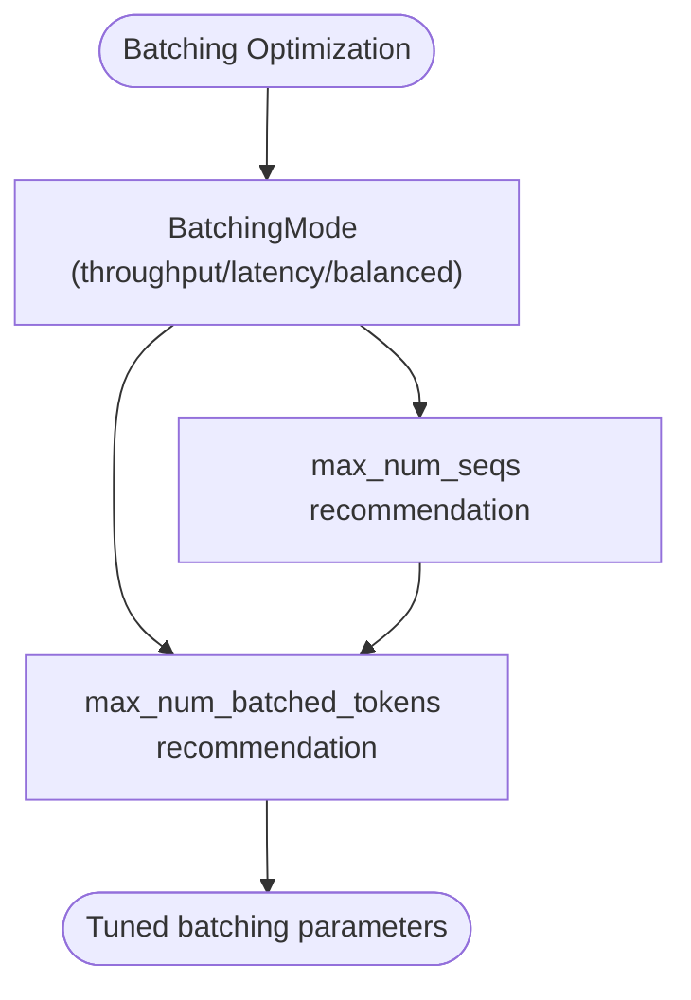
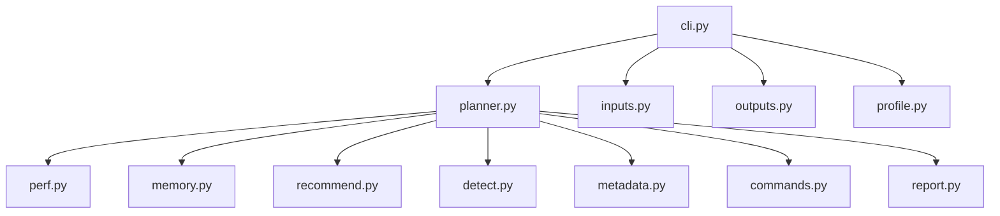

# Performance Estimation Methodology

<cite>
**Referenced Files in This Document**
- [perf.py](file://src/vllm_wizard/planning/perf.py)
- [memory.py](file://src/vllm_wizard/planning/memory.py)
- [detect.py](file://src/vllm_wizard/hardware/detect.py)
- [metadata.py](file://src/vllm_wizard/models/metadata.py)
- [inputs.py](file://src/vllm_wizard/schemas/inputs.py)
- [outputs.py](file://src/vllm_wizard/schemas/outputs.py)
- [profile.py](file://src/vllm_wizard/schemas/profile.py)
- [planner.py](file://src/vllm_wizard/planning/planner.py)
- [recommend.py](file://src/vllm_wizard/planning/recommend.py)
- [commands.py](file://src/vllm_wizard/render/commands.py)
- [report.py](file://src/vllm_wizard/render/report.py)
- [cli.py](file://src/vllm_wizard/cli.py)
</cite>

## Table of Contents
1. [Introduction](#introduction)
2. [Project Structure](#project-structure)
3. [Core Components](#core-components)
4. [Architecture Overview](#architecture-overview)
5. [Detailed Component Analysis](#detailed-component-analysis)
6. [Dependency Analysis](#dependency-analysis)
7. [Performance Considerations](#performance-considerations)
8. [Troubleshooting Guide](#troubleshooting-guide)
9. [Conclusion](#conclusion)
10. [Appendices](#appendices)

## Introduction
This document explains the performance estimation system and heuristic modeling approach implemented in the vLLM Wizard. It covers throughput and latency estimation algorithms grounded in GPU capabilities, model size, configuration parameters, and quantization impacts. It also documents memory feasibility analysis, scaling factors across GPU families, and practical tuning guidelines derived from the codebase.

## Project Structure
The performance estimation system is composed of:
- Input schemas defining model, hardware, workload, and policy parameters
- Hardware detection and metadata extraction
- Memory feasibility computations and VRAM breakdown
- Heuristic performance estimation for decode and prefill throughput and TTFT
- Recommendation engine for configuration tuning
- Rendering of reports and artifacts

**Diagram sources**
- [cli.py](file://src/vllm_wizard/cli.py#L1-L385)
- [planner.py](file://src/vllm_wizard/planning/planner.py#L1-L172)
- [metadata.py](file://src/vllm_wizard/models/metadata.py#L1-L255)
- [detect.py](file://src/vllm_wizard/hardware/detect.py#L1-L229)
- [memory.py](file://src/vllm_wizard/planning/memory.py#L1-L367)
- [perf.py](file://src/vllm_wizard/planning/perf.py#L1-L220)
- [recommend.py](file://src/vllm_wizard/planning/recommend.py#L1-L333)
- [commands.py](file://src/vllm_wizard/render/commands.py#L1-L196)
- [report.py](file://src/vllm_wizard/render/report.py#L1-L272)
- [inputs.py](file://src/vllm_wizard/schemas/inputs.py#L1-L110)
- [outputs.py](file://src/vllm_wizard/schemas/outputs.py#L1-L118)
- [profile.py](file://src/vllm_wizard/schemas/profile.py#L1-L75)

**Section sources**
- [cli.py](file://src/vllm_wizard/cli.py#L1-L385)
- [planner.py](file://src/vllm_wizard/planning/planner.py#L1-L172)

## Core Components
- Throughput estimation: decode and prefill tokens per second with uncertainty ranges
- Latency estimation: TTFT based on prompt tokens and prefill throughput
- Memory feasibility: weights, KV cache, overhead, and headroom computation
- Scaling factors: model size, tensor parallel, context length, quantization
- Recommendations: tensor parallel size, KV cache dtype, quantization, batching parameters

**Section sources**
- [perf.py](file://src/vllm_wizard/planning/perf.py#L1-L220)
- [memory.py](file://src/vllm_wizard/planning/memory.py#L1-L367)
- [recommend.py](file://src/vllm_wizard/planning/recommend.py#L1-L333)

## Architecture Overview
The planner orchestrates the end-to-end pipeline:
1. Load model metadata (including parameter count and architecture)
2. Resolve hardware (auto-detect or user-specified)
3. Compute memory breakdown and feasibility
4. Generate recommendations
5. Estimate performance (throughput and TTFT)
6. Render artifacts and reports

**Diagram sources**
- [cli.py](file://src/vllm_wizard/cli.py#L82-L213)
- [planner.py](file://src/vllm_wizard/planning/planner.py#L21-L135)
- [metadata.py](file://src/vllm_wizard/models/metadata.py#L209-L254)
- [detect.py](file://src/vllm_wizard/hardware/detect.py#L138-L229)
- [memory.py](file://src/vllm_wizard/planning/memory.py#L155-L270)
- [recommend.py](file://src/vllm_wizard/planning/recommend.py#L167-L332)
- [perf.py](file://src/vllm_wizard/planning/perf.py#L136-L219)
- [commands.py](file://src/vllm_wizard/render/commands.py#L6-L195)
- [report.py](file://src/vllm_wizard/render/report.py#L14-L204)

## Detailed Component Analysis

### Throughput Estimation Heuristics
The throughput estimator computes baseline decode and prefill rates per GPU family, then scales by model size, tensor parallel, context length, and quantization. It returns symmetric uncertainty ranges to reflect heuristic nature.

Key functions and scaling factors:
- Baseline decode and prefill rates by GPU family
- Model size scaling: inverse scaling with exponent around 0.85
- Tensor parallel scaling: linear with interconnect efficiency (NVLink vs PCIe)
- Context length scaling: mild degradation with square-root-like scaling
- Quantization speedups: method-specific factors

**Diagram sources**
- [perf.py](file://src/vllm_wizard/planning/perf.py#L136-L219)

**Section sources**
- [perf.py](file://src/vllm_wizard/planning/perf.py#L8-L36)
- [perf.py](file://src/vllm_wizard/planning/perf.py#L56-L80)
- [perf.py](file://src/vllm_wizard/planning/perf.py#L83-L104)
- [perf.py](file://src/vllm_wizard/planning/perf.py#L107-L117)
- [perf.py](file://src/vllm_wizard/planning/perf.py#L120-L133)
- [perf.py](file://src/vllm_wizard/planning/perf.py#L136-L219)

### Latency Estimation and TTFT
TTFT is estimated as the time to process the prompt tokens during prefill, computed from the prefill throughput estimate and prompt token count. Uncertainty ranges propagate from prefill throughput estimates.

**Diagram sources**
- [perf.py](file://src/vllm_wizard/planning/perf.py#L189-L193)

**Section sources**
- [perf.py](file://src/vllm_wizard/planning/perf.py#L189-L193)

### Memory Feasibility and VRAM Breakdown
Memory feasibility computes:
- Weights memory: bytes per parameter based on dtype or quantization
- KV cache memory: per-token-per-layer elements, multiplied by layers, context, concurrency, and dtype
- Overhead: base overhead plus communication overhead for tensor parallel
- Headroom: allocatable VRAM minus required components

**Diagram sources**
- [memory.py](file://src/vllm_wizard/planning/memory.py#L155-L270)

**Section sources**
- [memory.py](file://src/vllm_wizard/planning/memory.py#L31-L56)
- [memory.py](file://src/vllm_wizard/planning/memory.py#L59-L121)
- [memory.py](file://src/vllm_wizard/planning/memory.py#L124-L152)
- [memory.py](file://src/vllm_wizard/planning/memory.py#L155-L270)
- [memory.py](file://src/vllm_wizard/planning/memory.py#L273-L366)

### Tensor Parallel Scaling and GPU Families
- Tensor parallel scaling applies linear scaling with interconnect efficiency (NVLink better than PCIe)
- GPU family baselines define decode and prefill throughput characteristics
- Recommendations select TP size as the largest power of two ≤ number of GPUs, adjusting if weights do not fit

**Diagram sources**
- [detect.py](file://src/vllm_wizard/hardware/detect.py#L138-L159)
- [recommend.py](file://src/vllm_wizard/planning/recommend.py#L42-L67)
- [perf.py](file://src/vllm_wizard/planning/perf.py#L83-L104)

**Section sources**
- [detect.py](file://src/vllm_wizard/hardware/detect.py#L138-L159)
- [recommend.py](file://src/vllm_wizard/planning/recommend.py#L42-L67)
- [perf.py](file://src/vllm_wizard/planning/perf.py#L83-L104)

### Quantization Impact on Performance and Memory
- Quantization reduces weights memory footprint and can improve throughput modestly
- KV cache dtype recommendations consider KV cache pressure and GPU support for FP8
- Recommendations switch to quantization when configuration does not fit without it

**Diagram sources**
- [memory.py](file://src/vllm_wizard/planning/memory.py#L18-L25)
- [memory.py](file://src/vllm_wizard/planning/memory.py#L31-L56)
- [perf.py](file://src/vllm_wizard/planning/perf.py#L120-L133)
- [recommend.py](file://src/vllm_wizard/planning/recommend.py#L88-L121)

**Section sources**
- [memory.py](file://src/vllm_wizard/planning/memory.py#L18-L25)
- [memory.py](file://src/vllm_wizard/planning/memory.py#L31-L56)
- [perf.py](file://src/vllm_wizard/planning/perf.py#L120-L133)
- [recommend.py](file://src/vllm_wizard/planning/recommend.py#L88-L121)

### Relationship Between Tensor Parallel Size, Batch Sizes, and Performance Optimization
- TP increases throughput but adds communication overhead; efficiency depends on interconnect
- Batching parameters (max_num_seqs, max_num_batched_tokens) are tuned per batching mode and VRAM constraints
- Recommendations increase max_num_seqs for throughput mode and cap max_num_batched_tokens by VRAM

**Diagram sources**
- [recommend.py](file://src/vllm_wizard/planning/recommend.py#L124-L164)
- [inputs.py](file://src/vllm_wizard/schemas/inputs.py#L46-L51)

**Section sources**
- [recommend.py](file://src/vllm_wizard/planning/recommend.py#L124-L164)
- [inputs.py](file://src/vllm_wizard/schemas/inputs.py#L46-L51)

### Benchmarking Methodologies and Tuning Guidelines
- Use the CLI to plan or generate artifacts; review console or JSON output
- For throughput-focused workloads, increase max_num_seqs and max_num_batched_tokens cautiously
- For latency-sensitive workloads, align max_num_seqs with concurrency and keep max_num_batched_tokens lower
- Reduce context length or enable FP8 KV cache when KV pressure is high
- Consider quantization (AWQ/GPTQ/INT8/FP8) to fit larger models or improve throughput

**Section sources**
- [cli.py](file://src/vllm_wizard/cli.py#L82-L213)
- [cli.py](file://src/vllm_wizard/cli.py#L215-L381)
- [recommend.py](file://src/vllm_wizard/planning/recommend.py#L124-L164)
- [report.py](file://src/vllm_wizard/render/report.py#L14-L204)

## Dependency Analysis
The performance estimation system integrates tightly with memory planning and hardware detection. The planner coordinates these components and produces a unified PlanResponse.

**Diagram sources**
- [planner.py](file://src/vllm_wizard/planning/planner.py#L1-L172)
- [perf.py](file://src/vllm_wizard/planning/perf.py#L1-L220)
- [memory.py](file://src/vllm_wizard/planning/memory.py#L1-L367)
- [recommend.py](file://src/vllm_wizard/planning/recommend.py#L1-L333)
- [detect.py](file://src/vllm_wizard/hardware/detect.py#L1-L229)
- [metadata.py](file://src/vllm_wizard/models/metadata.py#L1-L255)
- [commands.py](file://src/vllm_wizard/render/commands.py#L1-L196)
- [report.py](file://src/vllm_wizard/render/report.py#L1-L272)
- [cli.py](file://src/vllm_wizard/cli.py#L1-L385)
- [inputs.py](file://src/vllm_wizard/schemas/inputs.py#L1-L110)
- [outputs.py](file://src/vllm_wizard/schemas/outputs.py#L1-L118)
- [profile.py](file://src/vllm_wizard/schemas/profile.py#L1-L75)

**Section sources**
- [planner.py](file://src/vllm_wizard/planning/planner.py#L1-L172)
- [cli.py](file://src/vllm_wizard/cli.py#L1-L385)

## Performance Considerations
- Heuristic nature: uncertainty ranges indicate approximation bounds
- GPU family differences: baselines encode performance characteristics across consumer, professional, and datacenter GPUs
- Interconnect efficiency: NVLink yields better TP scaling than PCIe
- Model size scaling: inverse scaling with exponent near 0.85 reflects diminishing returns
- Context length: attention overhead degrades decode throughput with longer contexts
- Quantization: provides modest throughput gains and memory savings; KV cache dtype can further reduce memory pressure

[No sources needed since this section provides general guidance]

## Troubleshooting Guide
Common issues and remedies:
- Configuration does not fit in VRAM: reduce concurrency, shorten context, enable quantization, or use FP8 KV cache
- High OOM risk: monitor memory usage and adjust headroom or fragmentation factor
- Insufficient throughput: increase tensor parallel size (subject to interconnect), consider higher VRAM GPUs, or tune batching parameters
- Latency spikes: reduce concurrency, lower max_num_batched_tokens, or switch to latency-focused batching mode

**Section sources**
- [memory.py](file://src/vllm_wizard/planning/memory.py#L198-L270)
- [recommend.py](file://src/vllm_wizard/planning/recommend.py#L124-L164)
- [report.py](file://src/vllm_wizard/render/report.py#L179-L204)

## Conclusion
The vLLM Wizard’s performance estimation system combines GPU-family baselines, model size scaling, tensor parallel efficiency, context effects, and quantization impacts into a practical heuristic framework. It provides uncertainty-aware throughput and TTFT estimates alongside memory feasibility and actionable recommendations for configuration tuning.

[No sources needed since this section summarizes without analyzing specific files]

## Appendices

### Mathematical Foundations and Scaling Exponents
- Model size scaling: throughput scaled by (reference_params / actual_params)^0.85
- Context scaling: decode throughput scaled by (ref_context / context_len)^0.3
- Tensor parallel scaling: throughput scaled by TP × interconnect efficiency
- Quantization speedups: method-specific multiplicative factors applied to throughput

**Section sources**
- [perf.py](file://src/vllm_wizard/planning/perf.py#L70-L80)
- [perf.py](file://src/vllm_wizard/planning/perf.py#L107-L117)
- [perf.py](file://src/vllm_wizard/planning/perf.py#L120-L133)

### Confidence Intervals and Uncertainty
- Decode throughput: ±30% range
- Prefill throughput: ±40% range
- Assumptions explicitly documented in PerfEstimate

**Section sources**
- [perf.py](file://src/vllm_wizard/planning/perf.py#L182-L200)
- [outputs.py](file://src/vllm_wizard/schemas/outputs.py#L77-L91)

### Example CLI Workflows
- Plan: run the planner with model, hardware, workload, and policy options
- Generate: produce artifacts (serve command, docker-compose, k8s values) and a profile

**Section sources**
- [cli.py](file://src/vllm_wizard/cli.py#L82-L213)
- [cli.py](file://src/vllm_wizard/cli.py#L215-L381)