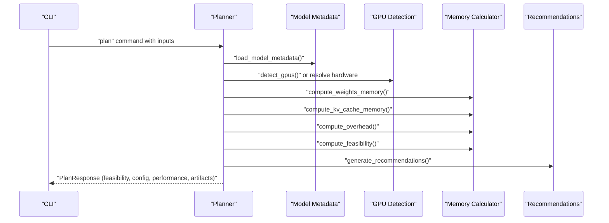
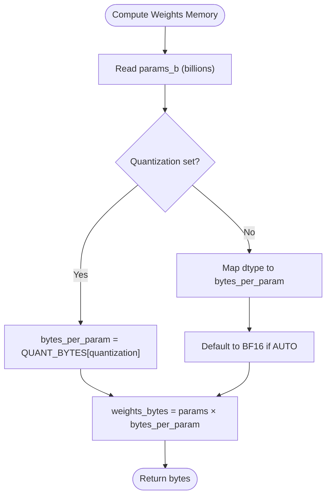
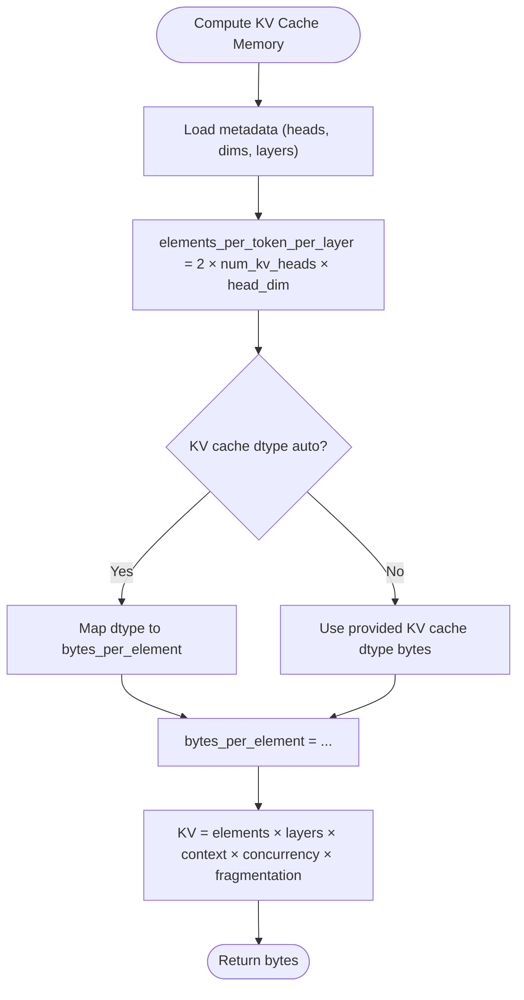
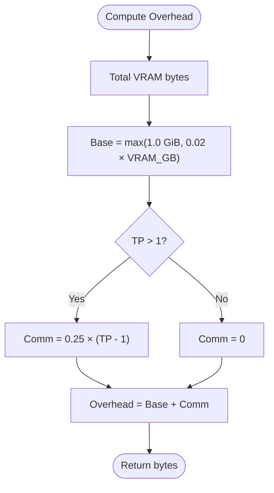
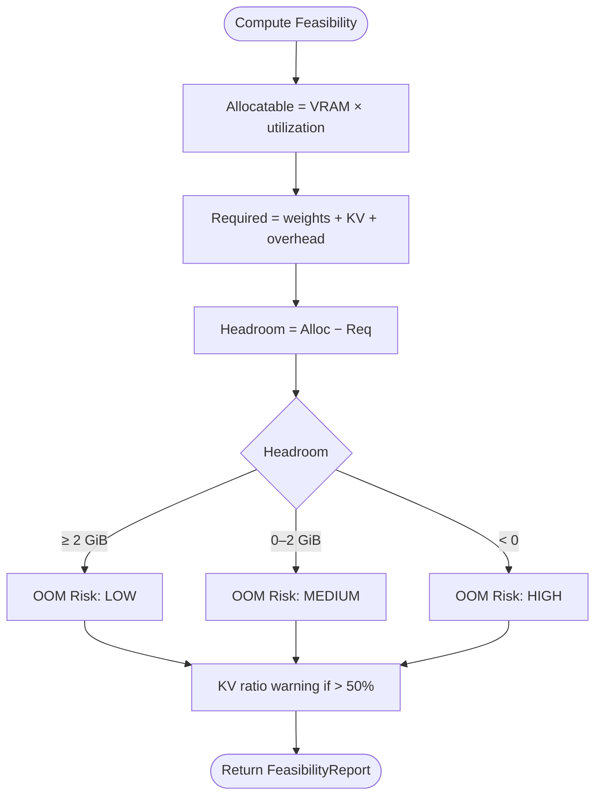
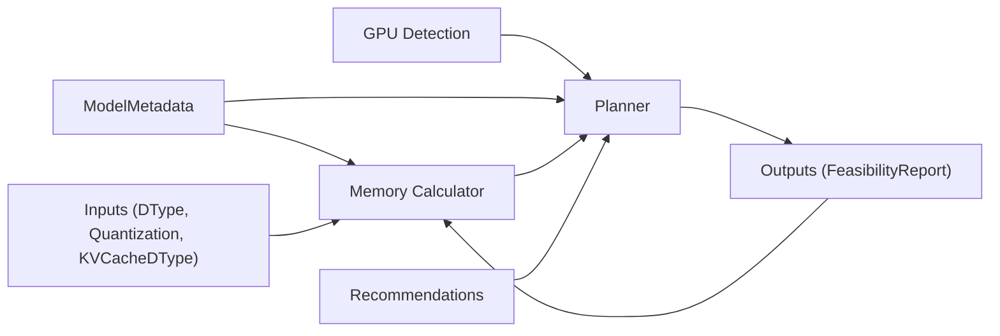

# VRAM Memory Breakdown

<cite>
**Referenced Files in This Document**
- [memory.py](file://src/vllm_wizard/planning/memory.py)
- [metadata.py](file://src/vllm_wizard/models/metadata.py)
- [inputs.py](file://src/vllm_wizard/schemas/inputs.py)
- [outputs.py](file://src/vllm_wizard/schemas/outputs.py)
- [profile.py](file://src/vllm_wizard/schemas/profile.py)
- [planner.py](file://src/vllm_wizard/planning/planner.py)
- [detect.py](file://src/vllm_wizard/hardware/detect.py)
- [recommend.py](file://src/vllm_wizard/planning/recommend.py)
- [test_memory.py](file://tests/test_memory.py)
- [README.md](file://README.md)
</cite>

## Table of Contents
1. [Introduction](#introduction)
2. [Project Structure](#project-structure)
3. [Core Components](#core-components)
4. [Architecture Overview](#architecture-overview)
5. [Detailed Component Analysis](#detailed-component-analysis)
6. [Dependency Analysis](#dependency-analysis)
7. [Performance Considerations](#performance-considerations)
8. [Troubleshooting Guide](#troubleshooting-guide)
9. [Conclusion](#conclusion)
10. [Appendices](#appendices)

## Introduction
This document explains VRAM memory components and calculations implemented in the project. It focuses on the four main components:
- Weights memory (model parameters)
- KV cache memory (key-value cache storage)
- Overhead (framework and communication buffers)
- Headroom (safety margin)

It documents the mathematical formulas, data type impacts (FP32, FP16, BF16, INT8, FP8), quantization effects, fragmentation factors, and utilization rates. Practical examples and troubleshooting guidance are included to help users estimate memory accurately and optimize configurations.

## Project Structure
The VRAM memory computation pipeline is organized around planning and memory calculation modules, with schema definitions for inputs, outputs, and profiles. The CLI orchestrates requests and renders results.

```mermaid
graph TB
subgraph "CLI"
CLI["CLI Commands"]
end
subgraph "Planning"
PLAN["Planner"]
MEM["Memory Calculator"]
REC["Recommendations"]
end
subgraph "Models"
META["Model Metadata"]
end
subgraph "Schemas"
IN["Inputs"]
OUT["Outputs"]
PROF["Profile"]
end
subgraph "Hardware"
DET["GPU Detection"]
end
CLI --> PLAN
PLAN --> META
PLAN --> DET
PLAN --> MEM
PLAN --> REC
MEM --> IN
MEM --> OUT
REC --> IN
REC --> OUT
PLAN --> IN
PLAN --> OUT
PLAN --> PROF
```

**Diagram sources**
- [planner.py](file://src/vllm_wizard/planning/planner.py#L21-L135)
- [memory.py](file://src/vllm_wizard/planning/memory.py#L31-L366)
- [metadata.py](file://src/vllm_wizard/models/metadata.py#L12-L254)
- [inputs.py](file://src/vllm_wizard/schemas/inputs.py#L9-L109)
- [outputs.py](file://src/vllm_wizard/schemas/outputs.py#L37-L117)
- [profile.py](file://src/vllm_wizard/schemas/profile.py#L16-L74)
- [detect.py](file://src/vllm_wizard/hardware/detect.py#L10-L228)
- [recommend.py](file://src/vllm_wizard/planning/recommend.py#L167-L332)

**Section sources**
- [planner.py](file://src/vllm_wizard/planning/planner.py#L21-L135)
- [README.md](file://README.md#L1-L308)

## Core Components
- Weights memory: computed from parameter count and dtype/quantization.
- KV cache memory: per-token per-layer storage scaled by layers, context length, concurrency, and dtype.
- Overhead: base overhead plus communication overhead for multi-GPU setups.
- Headroom: difference between allocatable VRAM and required memory.

Key constants and mappings:
- Bytes per parameter by dtype and quantization.
- KV cache bytes per element by KV cache dtype.
- Conversion from bytes to GiB.
- Fragmentation factor for KV cache.

**Section sources**
- [memory.py](file://src/vllm_wizard/planning/memory.py#L9-L28)
- [memory.py](file://src/vllm_wizard/planning/memory.py#L31-L121)
- [memory.py](file://src/vllm_wizard/planning/memory.py#L124-L152)
- [memory.py](file://src/vllm_wizard/planning/memory.py#L155-L270)

## Architecture Overview
The planner loads model metadata, detects or resolves hardware, computes memory components, evaluates feasibility, and generates recommendations and artifacts.



**Diagram sources**
- [planner.py](file://src/vllm_wizard/planning/planner.py#L21-L135)
- [metadata.py](file://src/vllm_wizard/models/metadata.py#L209-L254)
- [detect.py](file://src/vllm_wizard/hardware/detect.py#L10-L228)
- [memory.py](file://src/vllm_wizard/planning/memory.py#L31-L366)
- [recommend.py](file://src/vllm_wizard/planning/recommend.py#L167-L332)

## Detailed Component Analysis

### Weights Memory
- Formula: weights_bytes = parameters × bytes_per_param
- bytes_per_param depends on:
  - dtype: FP32=4, FP16/BF16=2, INT8=1
  - quantization: AWQ/GPTQ≈0.55 (includes overhead), INT8=1, FP8=1, none defaults to FP16
- Auto dtype falls back to BF16 when unspecified.



**Diagram sources**
- [memory.py](file://src/vllm_wizard/planning/memory.py#L31-L56)
- [memory.py](file://src/vllm_wizard/planning/memory.py#L9-L25)

**Section sources**
- [memory.py](file://src/vllm_wizard/planning/memory.py#L31-L56)
- [test_memory.py](file://tests/test_memory.py#L19-L56)

### KV Cache Memory
- Per-token per-layer elements: 2 × num_kv_heads × head_dim (K and V)
- bytes_per_element by KV cache dtype:
  - FP8 variants: 1.0
  - FP16/BF16: 2.0
  - FP32: 4.0
  - Other: default to FP16
- Total KV cache: elements_per_token_per_layer × num_layers × context_len × concurrency × fragmentation_factor
- KV cache scales linearly with concurrency and context length.



**Diagram sources**
- [memory.py](file://src/vllm_wizard/planning/memory.py#L59-L121)
- [metadata.py](file://src/vllm_wizard/models/metadata.py#L12-L29)

**Section sources**
- [memory.py](file://src/vllm_wizard/planning/memory.py#L59-L121)
- [test_memory.py](file://tests/test_memory.py#L58-L151)

### Overhead
- Base overhead: max(1.0 GiB, 2% of total VRAM)
- Additional communication overhead: 0.25 × (tensor_parallel_size − 1) for TP > 1
- Can be overridden by fixed overhead in GB



**Diagram sources**
- [memory.py](file://src/vllm_wizard/planning/memory.py#L124-L152)

**Section sources**
- [memory.py](file://src/vllm_wizard/planning/memory.py#L124-L152)
- [test_memory.py](file://tests/test_memory.py#L154-L178)

### Headroom and Feasibility
- Allocatable VRAM = total VRAM × gpu_memory_utilization
- Required = weights + KV cache + overhead
- Headroom = allocatable − required
- OOM risk:
  - Low: headroom ≥ 2 GiB
  - Medium: 0 ≤ headroom < 2 GiB
  - High: headroom < 0
- Warnings include configuration mismatch, high KV ratio, and OOM risk.



**Diagram sources**
- [memory.py](file://src/vllm_wizard/planning/memory.py#L155-L270)

**Section sources**
- [memory.py](file://src/vllm_wizard/planning/memory.py#L155-L270)
- [test_memory.py](file://tests/test_memory.py#L181-L231)

### Practical Examples
Examples below illustrate how to compute each component for typical scenarios. Replace values with your model and configuration.

- Weights memory (7B parameters, FP16):
  - weights_bytes = 7.0 × 1e9 × 2 bytes = 14 GiB
- KV cache memory (LLaMA-style, 32 layers, 32 KV heads, 128 head_dim, 4096 context, concurrency 1, FP16):
  - elements_per_token_per_layer = 2 × 32 × 128 = 8192
  - kv_bytes = 8192 × 32 × 4096 × 1 × 2 = 2 GiB (with fragmentation factor 1.15)
- Overhead (24 GiB VRAM, TP=1):
  - base = max(1.0, 0.02 × 24) = 1.0 GiB
  - overhead = 1.0 GiB
- Headroom and feasibility:
  - allocatable = 24 × 0.90 = 21.6 GiB
  - required = 14 + 2 + 1 = 17 GiB
  - headroom = 4.6 GiB → LOW risk

**Section sources**
- [test_memory.py](file://tests/test_memory.py#L184-L231)
- [README.md](file://README.md#L192-L214)

## Dependency Analysis
The memory calculator depends on model metadata and input schemas. The planner orchestrates these dependencies and integrates recommendations and hardware detection.



**Diagram sources**
- [memory.py](file://src/vllm_wizard/planning/memory.py#L3-L7)
- [metadata.py](file://src/vllm_wizard/models/metadata.py#L12-L254)
- [inputs.py](file://src/vllm_wizard/schemas/inputs.py#L9-L109)
- [outputs.py](file://src/vllm_wizard/schemas/outputs.py#L37-L117)
- [planner.py](file://src/vllm_wizard/planning/planner.py#L21-L135)
- [detect.py](file://src/vllm_wizard/hardware/detect.py#L10-L228)
- [recommend.py](file://src/vllm_wizard/planning/recommend.py#L167-L332)

**Section sources**
- [planner.py](file://src/vllm_wizard/planning/planner.py#L21-L135)
- [memory.py](file://src/vllm_wizard/planning/memory.py#L3-L7)
- [metadata.py](file://src/vllm_wizard/models/metadata.py#L12-L254)
- [inputs.py](file://src/vllm_wizard/schemas/inputs.py#L9-L109)
- [outputs.py](file://src/vllm_wizard/schemas/outputs.py#L37-L117)
- [detect.py](file://src/vllm_wizard/hardware/detect.py#L10-L228)
- [recommend.py](file://src/vllm_wizard/planning/recommend.py#L167-L332)

## Performance Considerations
- KV cache dominates memory for long contexts and high concurrency.
- FP8 KV cache reduces memory footprint by approximately half compared to FP16 when supported.
- Quantization (AWQ/GPTQ/INT8/FP8) reduces weights memory; choose based on model and hardware support.
- Fragmentation factor accounts for allocation overhead; typical value is 1.15.
- Utilization rate balances performance and safety; lower for consumer GPUs.

[No sources needed since this section provides general guidance]

## Troubleshooting Guide
Common issues and remedies:
- Configuration does not fit:
  - Reduce context length or concurrency.
  - Enable quantization (AWQ/GPTQ/INT8/FP8).
  - Lower utilization or increase VRAM.
- High OOM risk:
  - Use FP8 KV cache if supported.
  - Shorten context or reduce concurrency.
  - Increase headroom.
- Overhead misestimation:
  - Use fixed overhead override if known.
  - Account for multi-GPU communication overhead.
- Data type mismatches:
  - Verify KV cache dtype mapping (FP8 variants, FP16/BF16, FP32).
  - Confirm auto dtype fallbacks (BF16 for weights).

**Section sources**
- [memory.py](file://src/vllm_wizard/planning/memory.py#L155-L270)
- [memory.py](file://src/vllm_wizard/planning/memory.py#L124-L152)
- [test_memory.py](file://tests/test_memory.py#L181-L231)

## Conclusion
The VRAM memory model provides a structured approach to estimating GPU memory usage for inference. By breaking down memory into weights, KV cache, overhead, and headroom—and accounting for data types, quantization, fragmentation, and utilization—you can select configurations that fit reliably. Use the provided formulas and examples as a starting point, validate with small runs, and adjust based on observed behavior.

[No sources needed since this section summarizes without analyzing specific files]

## Appendices

### Mathematical Formulas and Definitions
- Weights memory:
  - weights_bytes = parameters × bytes_per_param
  - bytes_per_param:
    - FP32: 4.0
    - FP16/BF16: 2.0
    - INT8: 1.0
    - AWQ/GPTQ: ~0.55 (includes overhead)
    - FP8: 1.0
- KV cache memory:
  - kv_per_token_per_layer = 2 × num_kv_heads × head_dim
  - kv_cache = kv_per_token_per_layer × num_layers × context_len × concurrency × fragmentation_factor
  - bytes_per_element:
    - FP8 variants: 1.0
    - FP16/BF16: 2.0
    - FP32: 4.0
- Overhead:
  - base_overhead = max(1.0 GiB, 0.02 × VRAM_GB)
  - comm_overhead = 0.25 × (TP − 1) for TP > 1
  - total_overhead = base_overhead + comm_overhead
- Headroom and feasibility:
  - allocatable = VRAM × gpu_memory_utilization
  - required = weights + KV + overhead
  - headroom = allocatable − required
  - OOM risk: LOW/MEDIUM/HIGH based on headroom thresholds

**Section sources**
- [memory.py](file://src/vllm_wizard/planning/memory.py#L9-L28)
- [memory.py](file://src/vllm_wizard/planning/memory.py#L31-L152)
- [memory.py](file://src/vllm_wizard/planning/memory.py#L155-L270)
- [README.md](file://README.md#L192-L214)

### Data Type Impact and Quantization Effects
- FP32: highest precision, highest memory usage
- FP16/BF16: balanced precision and memory
- INT8: significant memory reduction; may impact accuracy
- AWQ/GPTQ: 4-bit quantization with overhead; reduces weights memory
- FP8: experimental; reduces KV cache memory by ~50% when supported

**Section sources**
- [memory.py](file://src/vllm_wizard/planning/memory.py#L9-L25)
- [inputs.py](file://src/vllm_wizard/schemas/inputs.py#L18-L25)
- [recommend.py](file://src/vllm_wizard/planning/recommend.py#L102-L121)

### Fragmentation Factors and Utilization Rates
- Fragmentation factor: applied to KV cache to account for allocation overhead (typical 1.15)
- Utilization rate: target fraction of VRAM to allocate (default 0.90; lowered for consumer GPUs)

**Section sources**
- [inputs.py](file://src/vllm_wizard/schemas/inputs.py#L96-L98)
- [recommend.py](file://src/vllm_wizard/planning/recommend.py#L32-L39)
- [memory.py](file://src/vllm_wizard/planning/memory.py#L65)

### Practical Example Walkthrough
- Scenario: 7B model, FP16 weights, KV cache FP16, 4096 context, concurrency 1, 24 GiB VRAM, 0.90 utilization, fragmentation 1.15
- Steps:
  - Weights: 7.0 × 2 = 14 GiB
  - KV cache: compute per-token per-layer elements, multiply by layers, context, concurrency, and fragmentation → ~2 GiB
  - Overhead: base 1.0 GiB (2% of 24 GiB), TP=1 → 1.0 GiB
  - Allocatable: 24 × 0.90 = 21.6 GiB
  - Required: 14 + 2 + 1 = 17 GiB
  - Headroom: 4.6 GiB → LOW risk

**Section sources**
- [test_memory.py](file://tests/test_memory.py#L184-L231)
- [README.md](file://README.md#L192-L214)