# Developer Guide

<cite>
**Referenced Files in This Document**
- [README.md](file://README.md)
- [pyproject.toml](file://pyproject.toml)
- [requirements.txt](file://requirements.txt)
- [src/vllm_wizard/__init__.py](file://src/vllm_wizard/__init__.py)
- [src/vllm_wizard/cli.py](file://src/vllm_wizard/cli.py)
- [src/vllm_wizard/hardware/detect.py](file://src/vllm_wizard/hardware/detect.py)
- [src/vllm_wizard/models/metadata.py](file://src/vllm_wizard/models/metadata.py)
- [src/vllm_wizard/planning/planner.py](file://src/vllm_wizard/planning/planner.py)
- [src/vllm_wizard/planning/memory.py](file://src/vllm_wizard/planning/memory.py)
- [src/vllm_wizard/planning/perf.py](file://src/vllm_wizard/planning/perf.py)
- [src/vllm_wizard/planning/recommend.py](file://src/vllm_wizard/planning/recommend.py)
- [src/vllm_wizard/render/commands.py](file://src/vllm_wizard/render/commands.py)
- [src/vllm_wizard/render/report.py](file://src/vllm_wizard/render/report.py)
- [src/vllm_wizard/schemas/inputs.py](file://src/vllm_wizard/schemas/inputs.py)
- [src/vllm_wizard/schemas/outputs.py](file://src/vllm_wizard/schemas/outputs.py)
- [tests/conftest.py](file://tests/conftest.py)
- [tests/test_cli.py](file://tests/test_cli.py)
- [tests/test_memory.py](file://tests/test_memory.py)
- [tests/test_models.py](file://tests/test_models.py)
</cite>

## Table of Contents
1. [Introduction](#introduction)
2. [Project Structure](#project-structure)
3. [Core Components](#core-components)
4. [Architecture Overview](#architecture-overview)
5. [Detailed Component Analysis](#detailed-component-analysis)
6. [Dependency Analysis](#dependency-analysis)
7. [Performance Considerations](#performance-considerations)
8. [Testing Strategy](#testing-strategy)
9. [Contribution Workflow](#contribution-workflow)
10. [Build System and CI](#build-system-and-ci)
11. [Coding Standards and Guidelines](#coding-standards-and-guidelines)
12. [Debugging and Development Tools](#debugging-and-development-tools)
13. [Examples and Common Tasks](#examples-and-common-tasks)
14. [Troubleshooting Guide](#troubleshooting-guide)
15. [Conclusion](#conclusion)

## Introduction
This Developer Guide provides a comprehensive overview for contributors and maintainers of the vLLM Config Wizard project. It explains the architecture, coding standards, development workflow, testing strategy, contribution and release procedures, build system, dependency management, continuous integration setup, and practical guidance for adding features, fixing bugs, and maintaining backward compatibility. The guide also covers debugging techniques, development tools, and common development tasks with troubleshooting approaches grounded in the repository’s implementation.

## Project Structure
The project follows a modular, feature-based layout under src/vllm_wizard with clear separation of concerns:
- CLI entrypoint and command orchestration
- Hardware detection and auto-sizing
- Model metadata extraction and sizing logic
- Planning pipeline orchestrating memory, performance, and recommendation engines
- Rendering for console reports and generated artifacts
- Schemas for input/output validation and documentation
- Tests under tests/ and examples under examples/

```mermaid
graph TB
subgraph "CLI"
CLI["cli.py"]
end
subgraph "Hardware"
DETECT["hardware/detect.py"]
end
subgraph "Models"
METADATA["models/metadata.py"]
end
subgraph "Planning"
PLANNER["planning/planner.py"]
MEMORY["planning/memory.py"]
PERF["planning/perf.py"]
RECOMMEND["planning/recommend.py"]
end
subgraph "Render"
RENDER_CMD["render/commands.py"]
RENDER_REPORT["render/report.py"]
end
subgraph "Schemas"
SCHEMAS_IN["schemas/inputs.py"]
SCHEMAS_OUT["schemas/outputs.py"]
end
CLI --> DETECT
CLI --> PLANNER
PLANNER --> METADATA
PLANNER --> MEMORY
PLANNER --> PERF
PLANNER --> RECOMMEND
PLANNER --> RENDER_CMD
CLI --> RENDER_REPORT
CLI --> SCHEMAS_IN
PLANNER --> SCHEMAS_OUT
```

**Diagram sources**
- [src/vllm_wizard/cli.py](file://src/vllm_wizard/cli.py#L1-L385)
- [src/vllm_wizard/hardware/detect.py](file://src/vllm_wizard/hardware/detect.py#L1-L229)
- [src/vllm_wizard/models/metadata.py](file://src/vllm_wizard/models/metadata.py#L1-L255)
- [src/vllm_wizard/planning/planner.py](file://src/vllm_wizard/planning/planner.py#L1-L172)
- [src/vllm_wizard/planning/memory.py](file://src/vllm_wizard/planning/memory.py#L1-L367)
- [src/vllm_wizard/planning/perf.py](file://src/vllm_wizard/planning/perf.py#L1-L220)
- [src/vllm_wizard/planning/recommend.py](file://src/vllm_wizard/planning/recommend.py#L1-L333)
- [src/vllm_wizard/render/commands.py](file://src/vllm_wizard/render/commands.py#L1-L196)
- [src/vllm_wizard/render/report.py](file://src/vllm_wizard/render/report.py#L1-L272)
- [src/vllm_wizard/schemas/inputs.py](file://src/vllm_wizard/schemas/inputs.py#L1-L110)
- [src/vllm_wizard/schemas/outputs.py](file://src/vllm_wizard/schemas/outputs.py#L1-L118)

**Section sources**
- [README.md](file://README.md#L1-L308)
- [pyproject.toml](file://pyproject.toml#L1-L71)

## Core Components
- CLI module: Defines commands (detect, plan, generate) and integrates with Typer, Rich, and internal planning/rendering modules.
- Hardware detection: Uses nvidia-smi to detect GPUs and extract driver/CUDA versions; falls back to known VRAM tables.
- Model metadata: Loads model configs from local path or Hugging Face Hub, normalizes fields, and estimates parameter counts.
- Planning pipeline: Orchestrates model metadata loading, hardware resolution, memory feasibility, performance estimation, recommendations, and artifact generation.
- Memory model: Computes weights, KV cache, overhead, and feasibility with configurable fragmentation and headroom.
- Performance estimation: Heuristic model with GPU class baselines, scaling by model size, TP, context, and quantization.
- Recommendation engine: Produces vLLM configuration recommendations with explanations.
- Rendering: Generates console reports and artifacts (serve command, docker-compose, k8s values).
- Schemas: Pydantic models for inputs, outputs, enums, and validation.

**Section sources**
- [src/vllm_wizard/cli.py](file://src/vllm_wizard/cli.py#L1-L385)
- [src/vllm_wizard/hardware/detect.py](file://src/vllm_wizard/hardware/detect.py#L1-L229)
- [src/vllm_wizard/models/metadata.py](file://src/vllm_wizard/models/metadata.py#L1-L255)
- [src/vllm_wizard/planning/planner.py](file://src/vllm_wizard/planning/planner.py#L1-L172)
- [src/vllm_wizard/planning/memory.py](file://src/vllm_wizard/planning/memory.py#L1-L367)
- [src/vllm_wizard/planning/perf.py](file://src/vllm_wizard/planning/perf.py#L1-L220)
- [src/vllm_wizard/planning/recommend.py](file://src/vllm_wizard/planning/recommend.py#L1-L333)
- [src/vllm_wizard/render/commands.py](file://src/vllm_wizard/render/commands.py#L1-L196)
- [src/vllm_wizard/render/report.py](file://src/vllm_wizard/render/report.py#L1-L272)
- [src/vllm_wizard/schemas/inputs.py](file://src/vllm_wizard/schemas/inputs.py#L1-L110)
- [src/vllm_wizard/schemas/outputs.py](file://src/vllm_wizard/schemas/outputs.py#L1-L118)

## Architecture Overview
The CLI delegates to the planning pipeline, which coordinates multiple modules to produce a PlanResponse containing feasibility, recommended configuration, performance estimates, and generated artifacts. Rendering modules then present results to the console or write artifacts to disk.

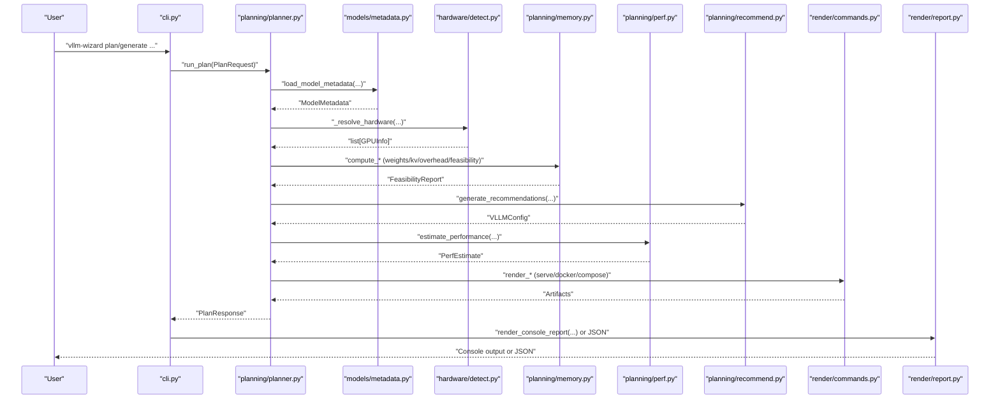

**Diagram sources**
- [src/vllm_wizard/cli.py](file://src/vllm_wizard/cli.py#L62-L381)
- [src/vllm_wizard/planning/planner.py](file://src/vllm_wizard/planning/planner.py#L21-L135)
- [src/vllm_wizard/models/metadata.py](file://src/vllm_wizard/models/metadata.py#L209-L254)
- [src/vllm_wizard/hardware/detect.py](file://src/vllm_wizard/hardware/detect.py#L10-L71)
- [src/vllm_wizard/planning/memory.py](file://src/vllm_wizard/planning/memory.py#L155-L270)
- [src/vllm_wizard/planning/recommend.py](file://src/vllm_wizard/planning/recommend.py#L167-L332)
- [src/vllm_wizard/planning/perf.py](file://src/vllm_wizard/planning/perf.py#L136-L219)
- [src/vllm_wizard/render/commands.py](file://src/vllm_wizard/render/commands.py#L6-L195)
- [src/vllm_wizard/render/report.py](file://src/vllm_wizard/render/report.py#L14-L44)

## Detailed Component Analysis

### CLI and Commands
- detect: Calls hardware detection and renders either a Rich table or JSON.
- plan: Builds PlanRequest from CLI flags or profile, runs planning, and renders console report or JSON.
- generate: Runs planning, creates output directory, writes artifacts (serve command, profile, docker-compose, k8s values), and prints next steps.

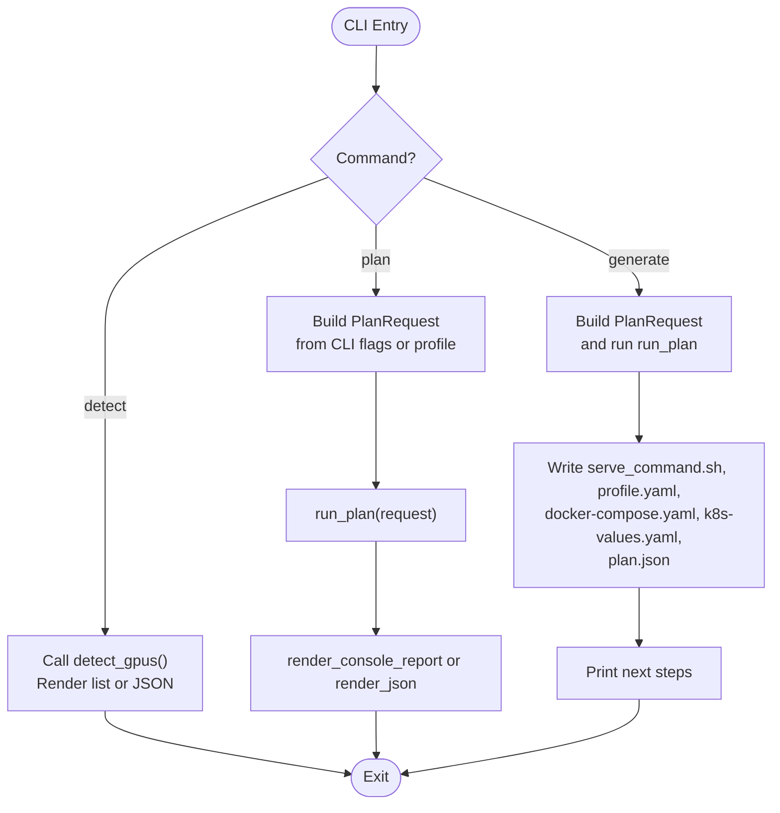

**Diagram sources**
- [src/vllm_wizard/cli.py](file://src/vllm_wizard/cli.py#L62-L381)
- [src/vllm_wizard/hardware/detect.py](file://src/vllm_wizard/hardware/detect.py#L10-L71)
- [src/vllm_wizard/planning/planner.py](file://src/vllm_wizard/planning/planner.py#L21-L135)
- [src/vllm_wizard/render/report.py](file://src/vllm_wizard/render/report.py#L14-L44)
- [src/vllm_wizard/render/commands.py](file://src/vllm_wizard/render/commands.py#L6-L195)

**Section sources**
- [src/vllm_wizard/cli.py](file://src/vllm_wizard/cli.py#L62-L381)

### Hardware Detection
- Uses nvidia-smi to query GPU names and memory totals, captures driver/CUDA versions, and compute capability.
- Recommends tensor-parallel size as the largest power of two within detected GPUs.
- Provides fallback VRAM for known GPU names when auto-detection is unavailable.

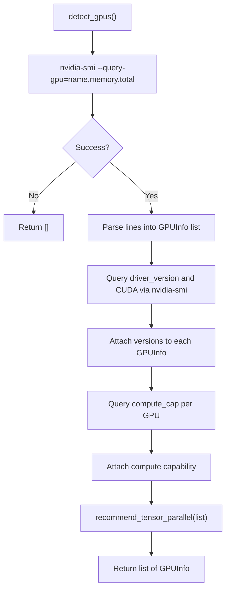

**Diagram sources**
- [src/vllm_wizard/hardware/detect.py](file://src/vllm_wizard/hardware/detect.py#L10-L136)

**Section sources**
- [src/vllm_wizard/hardware/detect.py](file://src/vllm_wizard/hardware/detect.py#L10-L229)

### Model Metadata Extraction
- Loads config.json from local path or Hugging Face Hub, normalizes keys across model families, and extracts architecture parameters.
- Supports fallbacks for missing KV heads and estimation of parameter counts from config.
- Provides a known model size lookup table for quick overrides.

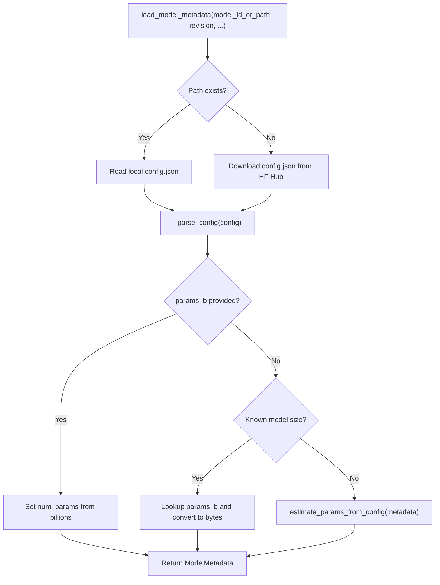

**Diagram sources**
- [src/vllm_wizard/models/metadata.py](file://src/vllm_wizard/models/metadata.py#L209-L254)

**Section sources**
- [src/vllm_wizard/models/metadata.py](file://src/vllm_wizard/models/metadata.py#L1-L255)

### Planning Pipeline Orchestration
- Resolves hardware from auto-detection, known names, or manual VRAM inputs.
- Computes VRAM totals, weights, KV cache, overhead, and feasibility.
- Generates recommendations, performance estimates, and artifacts.

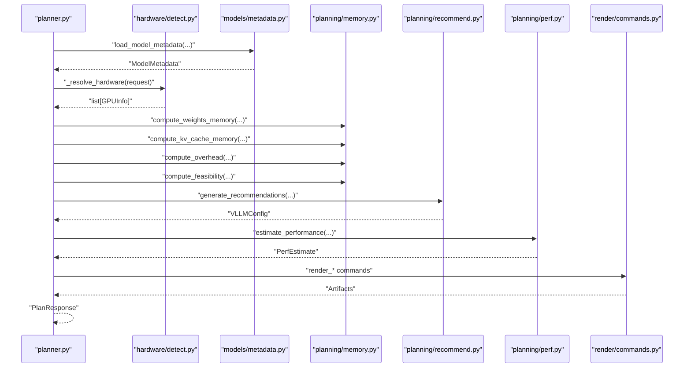

**Diagram sources**
- [src/vllm_wizard/planning/planner.py](file://src/vllm_wizard/planning/planner.py#L21-L135)
- [src/vllm_wizard/planning/memory.py](file://src/vllm_wizard/planning/memory.py#L31-L153)
- [src/vllm_wizard/planning/recommend.py](file://src/vllm_wizard/planning/recommend.py#L167-L332)
- [src/vllm_wizard/planning/perf.py](file://src/vllm_wizard/planning/perf.py#L136-L219)
- [src/vllm_wizard/render/commands.py](file://src/vllm_wizard/render/commands.py#L6-L195)

**Section sources**
- [src/vllm_wizard/planning/planner.py](file://src/vllm_wizard/planning/planner.py#L21-L172)

### Memory Model and Feasibility
- Weights memory computed from parameter count and dtype/quantization mapping.
- KV cache memory computed from head dimensions, attention heads, layers, context length, concurrency, and fragmentation.
- Overhead computed from VRAM and TP size with optional fixed override.
- Feasibility checks allocatable vs required and assigns OOM risk levels with warnings.

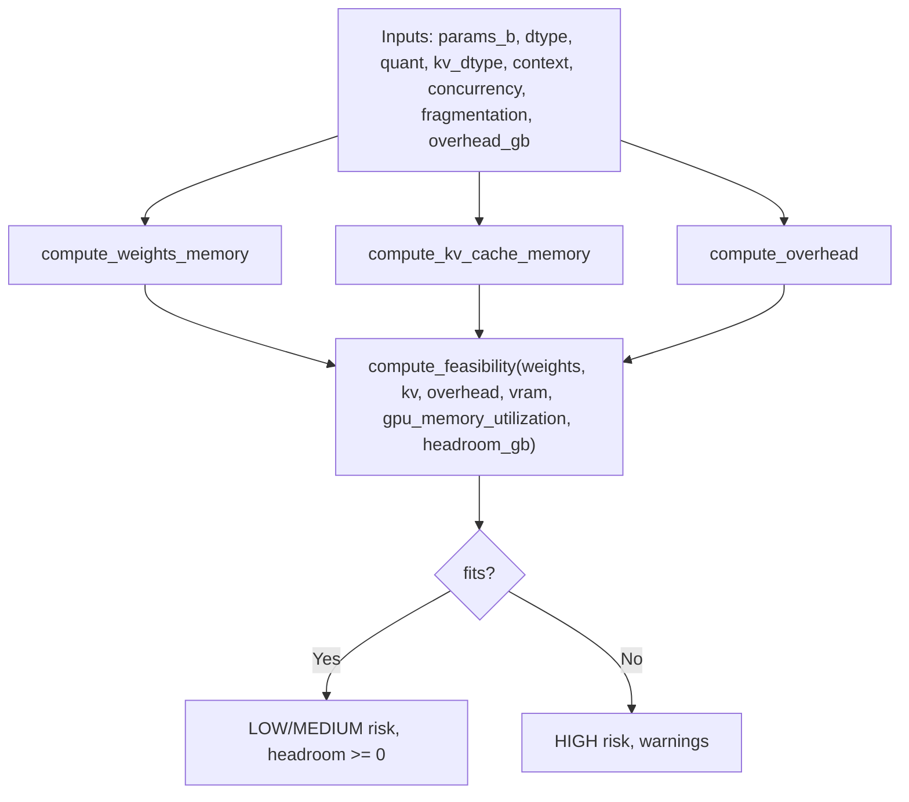

**Diagram sources**
- [src/vllm_wizard/planning/memory.py](file://src/vllm_wizard/planning/memory.py#L31-L270)

**Section sources**
- [src/vllm_wizard/planning/memory.py](file://src/vllm_wizard/planning/memory.py#L1-L367)

### Performance Estimation
- Baseline TPS per GPU class for decode and prefill.
- Scales by model size (inverse power), tensor parallel efficiency by interconnect, context length, and quantization.
- Returns ranges and assumptions for heuristic nature.

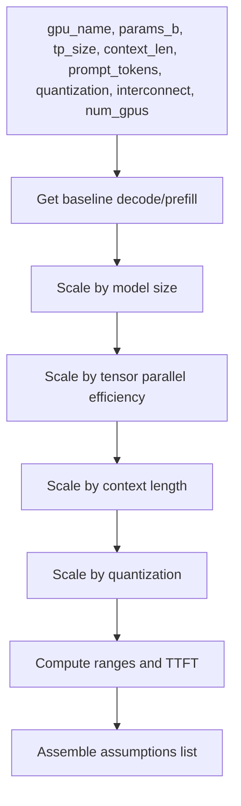

**Diagram sources**
- [src/vllm_wizard/planning/perf.py](file://src/vllm_wizard/planning/perf.py#L136-L219)

**Section sources**
- [src/vllm_wizard/planning/perf.py](file://src/vllm_wizard/planning/perf.py#L1-L220)

### Recommendation Engine
- Determines tensor-parallel size respecting user input and model weights per GPU.
- Adjusts GPU memory utilization for consumer GPUs.
- Recommends quantization when configuration does not fit without it.
- Suggests KV cache dtype based on KV pressure and GPU support.
- Sets max_num_seqs and max_num_batched_tokens according to batching mode and VRAM.

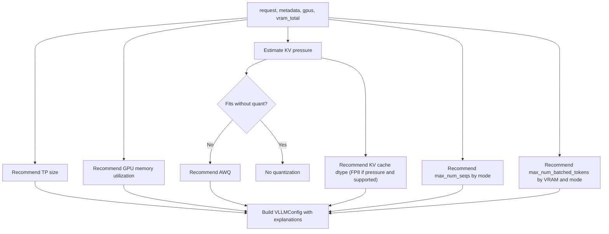

**Diagram sources**
- [src/vllm_wizard/planning/recommend.py](file://src/vllm_wizard/planning/recommend.py#L167-L332)

**Section sources**
- [src/vllm_wizard/planning/recommend.py](file://src/vllm_wizard/planning/recommend.py#L1-L333)

### Rendering and Artifacts
- Console report: Panels, tables, and color-coded risk levels.
- JSON output: Pretty-printed PlanResponse for scripting.
- Artifact rendering: vLLM serve command, docker run, docker-compose, and Kubernetes values.

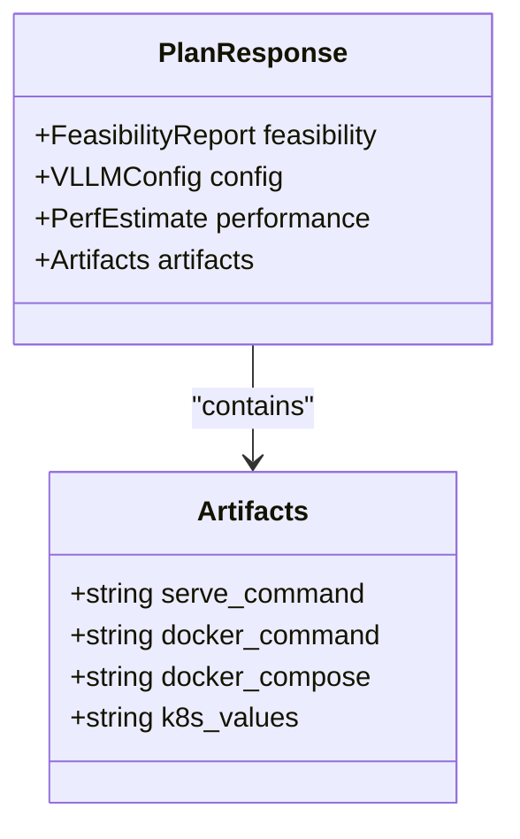

**Diagram sources**
- [src/vllm_wizard/schemas/outputs.py](file://src/vllm_wizard/schemas/outputs.py#L94-L118)

**Section sources**
- [src/vllm_wizard/render/report.py](file://src/vllm_wizard/render/report.py#L14-L272)
- [src/vllm_wizard/render/commands.py](file://src/vllm_wizard/render/commands.py#L6-L195)
- [src/vllm_wizard/schemas/outputs.py](file://src/vllm_wizard/schemas/outputs.py#L1-L118)

### Schemas and Validation
- Enums for dtype, quantization, KV cache dtype, interconnect, batching mode.
- Pydantic models for inputs, outputs, and validation with constraints and defaults.

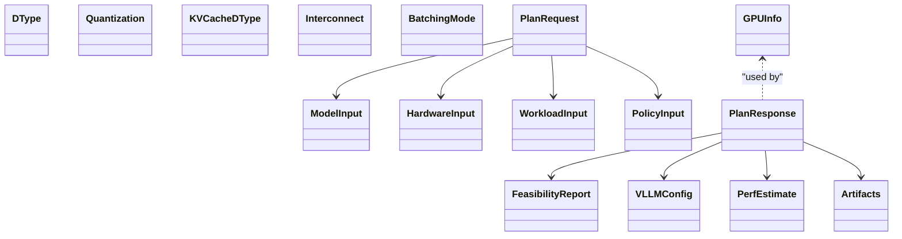

**Diagram sources**
- [src/vllm_wizard/schemas/inputs.py](file://src/vllm_wizard/schemas/inputs.py#L1-L110)
- [src/vllm_wizard/schemas/outputs.py](file://src/vllm_wizard/schemas/outputs.py#L1-L118)

**Section sources**
- [src/vllm_wizard/schemas/inputs.py](file://src/vllm_wizard/schemas/inputs.py#L1-L110)
- [src/vllm_wizard/schemas/outputs.py](file://src/vllm_wizard/schemas/outputs.py#L1-L118)

## Dependency Analysis
- Core dependencies: pydantic, typer, rich, pyyaml, huggingface_hub.
- Optional web dependencies: fastapi, uvicorn, jinja2.
- CLI script entrypoint mapped to the Typer app.
- Ruff linting and pytest configuration defined in pyproject.toml.

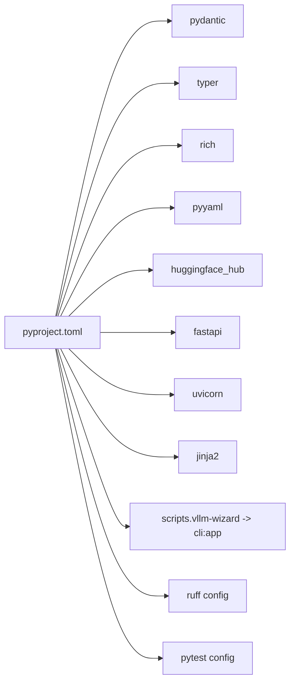

**Diagram sources**
- [pyproject.toml](file://pyproject.toml#L29-L47)
- [pyproject.toml](file://pyproject.toml#L49-L71)

**Section sources**
- [pyproject.toml](file://pyproject.toml#L1-L71)

## Performance Considerations
- Memory computations operate in bytes and report in GiB for clarity.
- KV cache fragmentation factor and overhead parameters influence feasibility and risk.
- Performance heuristics depend on GPU class baselines, model size scaling, TP efficiency, context length, and quantization.
- Recommendations balance VRAM usage with throughput/latency modes and concurrency.

[No sources needed since this section provides general guidance]

## Testing Strategy
- Unit tests: Validate model metadata parsing, KV cache math, feasibility boundaries, and CLI JSON output.
- Golden tests: Compare plan outputs against expected files under examples/ with numeric tolerances for performance estimates.
- Test configuration: pytest with coverage and Ruff linting; pythonpath configured to src.

**Section sources**
- [README.md](file://README.md#L469-L484)
- [pyproject.toml](file://pyproject.toml#L68-L71)

## Contribution Workflow
- Fork and branch from main; follow coding standards and pass linting/tests.
- Add or update unit tests; ensure golden tests pass.
- Keep changes focused and documented; update README as needed.
- Open a pull request with a clear description and rationale.

[No sources needed since this section provides general guidance]

## Build System and CI
- Build backend: hatchling; package location under src/vllm_wizard.
- Install with editable extras for development and web UI support.
- Linting via Ruff; tests via pytest; coverage via pytest-cov.

**Section sources**
- [pyproject.toml](file://pyproject.toml#L1-L71)
- [README.md](file://README.md#L278-L292)

## Coding Standards and Guidelines
- Type hints and Pydantic models for strong validation.
- Rich console output with structured panels and tables.
- Centralized enums for configuration options.
- Defensive programming: graceful handling of missing fields and detection failures.
- Backward compatibility: preserve CLI flags and schema fields; deprecate carefully.

[No sources needed since this section provides general guidance]

## Debugging and Development Tools
- Use --json for machine-readable outputs to aid scripting and debugging.
- Leverage Rich console for readable reports and warnings.
- Validate inputs with Pydantic models to catch configuration errors early.
- Use pytest with verbose output and coverage to isolate regressions.

**Section sources**
- [src/vllm_wizard/cli.py](file://src/vllm_wizard/cli.py#L199-L212)
- [src/vllm_wizard/render/report.py](file://src/vllm_wizard/render/report.py#L228-L238)

## Examples and Common Tasks
- Single GPU planning with auto detection and JSON output.
- Multi-GPU with tensor parallel and interconnect-aware recommendations.
- Generating artifacts to disk and reviewing next steps.
- Loading profiles and regenerating outputs.

**Section sources**
- [README.md](file://README.md#L241-L277)
- [src/vllm_wizard/cli.py](file://src/vllm_wizard/cli.py#L62-L381)

## Troubleshooting Guide
- No GPUs detected: Ensure nvidia-smi is installed and accessible; the tool falls back to manual VRAM inputs.
- Missing model fields: Provide --params-b or use a local config.json; the tool raises explicit errors with guidance.
- Performance estimates: Clearly labeled as heuristic; validate with real benchmarks.
- CLI errors: The CLI catches and prints ValueError/FileNotFoundError with exit codes.

**Section sources**
- [src/vllm_wizard/hardware/detect.py](file://src/vllm_wizard/hardware/detect.py#L65-L71)
- [src/vllm_wizard/models/metadata.py](file://src/vllm_wizard/models/metadata.py#L110-L114)
- [src/vllm_wizard/cli.py](file://src/vllm_wizard/cli.py#L204-L212)

## Conclusion
This guide consolidates the project’s architecture, workflows, and operational practices to support effective contributions and maintenance. By following the outlined standards, testing strategy, and troubleshooting tips, contributors can confidently extend functionality, fix issues, and ensure reliable, user-friendly behavior across CLI and optional web frontends.