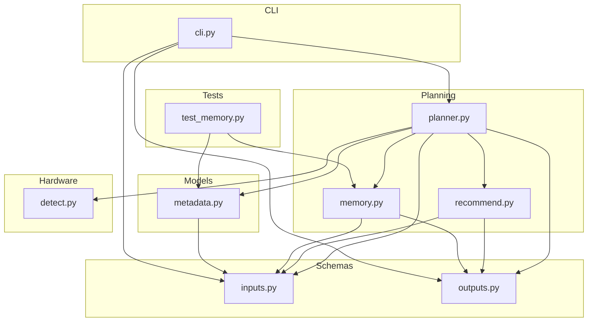
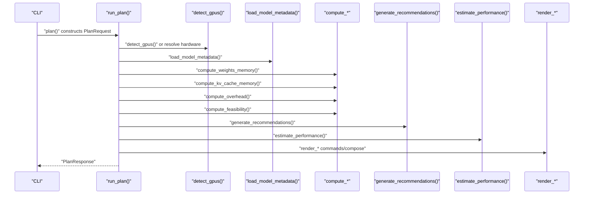
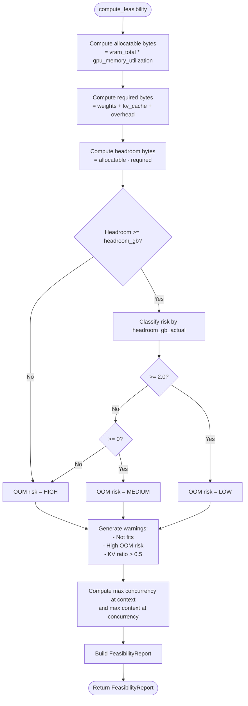
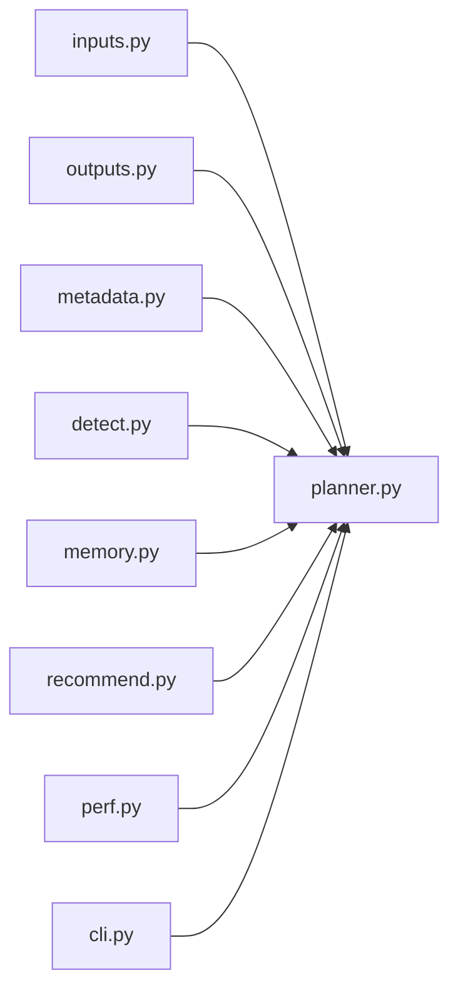

# Feasibility Analysis and Risk Assessment

<cite>
**Referenced Files in This Document**
- [memory.py](file://src/vllm_wizard/planning/memory.py)
- [planner.py](file://src/vllm_wizard/planning/planner.py)
- [recommend.py](file://src/vllm_wizard/planning/recommend.py)
- [outputs.py](file://src/vllm_wizard/schemas/outputs.py)
- [inputs.py](file://src/vllm_wizard/schemas/inputs.py)
- [metadata.py](file://src/vllm_wizard/models/metadata.py)
- [detect.py](file://src/vllm_wizard/hardware/detect.py)
- [cli.py](file://src/vllm_wizard/cli.py)
- [test_memory.py](file://tests/test_memory.py)
</cite>

## Table of Contents
1. [Introduction](#introduction)
2. [Project Structure](#project-structure)
3. [Core Components](#core-components)
4. [Architecture Overview](#architecture-overview)
5. [Detailed Component Analysis](#detailed-component-analysis)
6. [Dependency Analysis](#dependency-analysis)
7. [Performance Considerations](#performance-considerations)
8. [Troubleshooting Guide](#troubleshooting-guide)
9. [Conclusion](#conclusion)

## Introduction
This document explains the VRAM feasibility analysis and Out-of-Memory (OOM) risk assessment performed by the system. It focuses on how the compute_feasibility function holistically combines model weights, KV cache, and overhead to determine whether a configuration fits in GPU memory, and how it classifies OOM risk. It also documents the allocatable VRAM calculation using gpu_memory_utilization and headroom_gb, the max concurrency and context length calculations, and the warning generation logic for high KV cache ratios, insufficient headroom, and OOM risk indicators. Finally, it describes the FeasibilityReport schema and all calculated metrics, including VRAM utilization percentages.

## Project Structure
The feasibility and risk assessment logic is implemented primarily in the planning module, with supporting schemas, model metadata extraction, and hardware detection utilities.

**Diagram sources**
- [planner.py](file://src/vllm_wizard/planning/planner.py#L21-L135)
- [memory.py](file://src/vllm_wizard/planning/memory.py#L155-L270)
- [recommend.py](file://src/vllm_wizard/planning/recommend.py#L167-L332)
- [inputs.py](file://src/vllm_wizard/schemas/inputs.py#L102-L110)
- [outputs.py](file://src/vllm_wizard/schemas/outputs.py#L37-L54)
- [metadata.py](file://src/vllm_wizard/models/metadata.py#L12-L37)
- [detect.py](file://src/vllm_wizard/hardware/detect.py#L10-L71)
- [cli.py](file://src/vllm_wizard/cli.py#L82-L212)
- [test_memory.py](file://tests/test_memory.py#L1-L265)

**Section sources**
- [planner.py](file://src/vllm_wizard/planning/planner.py#L21-L135)
- [memory.py](file://src/vllm_wizard/planning/memory.py#L155-L270)
- [recommend.py](file://src/vllm_wizard/planning/recommend.py#L167-L332)
- [inputs.py](file://src/vllm_wizard/schemas/inputs.py#L102-L110)
- [outputs.py](file://src/vllm_wizard/schemas/outputs.py#L37-L54)
- [metadata.py](file://src/vllm_wizard/models/metadata.py#L12-L37)
- [detect.py](file://src/vllm_wizard/hardware/detect.py#L10-L71)
- [cli.py](file://src/vllm_wizard/cli.py#L82-L212)
- [test_memory.py](file://tests/test_memory.py#L1-L265)

## Core Components
- compute_weights_memory: Computes model weights memory in bytes based on parameter count, dtype, and quantization.
- compute_kv_cache_memory: Computes KV cache memory in bytes using model metadata, context length, concurrency, KV cache dtype, and fragmentation factor.
- compute_overhead: Computes framework overhead in bytes, with optional fixed overhead and multi-GPU communication buffers.
- compute_feasibility: Holistic VRAM feasibility analysis combining weights, KV cache, and overhead; computes allocatable VRAM, headroom, OOM risk, and warnings; calculates max concurrency and context length.
- compute_max_concurrency_at_context: Determines maximum concurrent sequences at a given context length.
- compute_max_context_at_concurrency: Determines maximum context length at a given concurrency.
- FeasibilityReport: Pydantic model capturing all feasibility metrics and warnings.

**Section sources**
- [memory.py](file://src/vllm_wizard/planning/memory.py#L31-L121)
- [memory.py](file://src/vllm_wizard/planning/memory.py#L124-L152)
- [memory.py](file://src/vllm_wizard/planning/memory.py#L155-L270)
- [memory.py](file://src/vllm_wizard/planning/memory.py#L273-L366)
- [outputs.py](file://src/vllm_wizard/schemas/outputs.py#L37-L54)

## Architecture Overview
The planning pipeline orchestrates hardware detection, model metadata loading, memory breakdown computation, feasibility analysis, recommendation generation, and performance estimation.

**Diagram sources**
- [cli.py](file://src/vllm_wizard/cli.py#L82-L212)
- [planner.py](file://src/vllm_wizard/planning/planner.py#L21-L135)
- [detect.py](file://src/vllm_wizard/hardware/detect.py#L10-L71)
- [metadata.py](file://src/vllm_wizard/models/metadata.py#L209-L254)
- [memory.py](file://src/vllm_wizard/planning/memory.py#L31-L121)
- [recommend.py](file://src/vllm_wizard/planning/recommend.py#L167-L332)
- [perf.py](file://src/vllm_wizard/planning/perf.py#L136-L219)

## Detailed Component Analysis

### compute_feasibility: Holistic VRAM feasibility and OOM risk
- Allocatable VRAM: vram_total_bytes multiplied by gpu_memory_utilization.
- Required memory: weights_bytes + kv_cache_bytes + overhead_bytes.
- Headroom: allocatable_bytes minus required_bytes; converted to GiB.
- Fit check: requires headroom_bytes to be at least headroom_gb * BYTES_TO_GIB.
- OOM risk classification:
  - LOW: headroom_gb_actual >= 2.0
  - MEDIUM: headroom_gb_actual >= 0
  - HIGH: headroom_gb_actual < 0
- Max concurrency at context: Uses compute_max_concurrency_at_context with allocatable_bytes and metadata.
- Max context at concurrency: Uses compute_max_context_at_concurrency with allocatable_bytes and metadata.
- Warning generation:
  - If not fits: reports required vs available VRAM.
  - If OOM risk HIGH: suggests reducing context length or using quantization.
  - If OOM risk MEDIUM: advises monitoring memory usage.
  - If KV cache ratio > 0.5: warns about high KV cache usage and suggests FP8 KV cache or shorter context.

**Diagram sources**
- [memory.py](file://src/vllm_wizard/planning/memory.py#L155-L270)
- [memory.py](file://src/vllm_wizard/planning/memory.py#L273-L366)

**Section sources**
- [memory.py](file://src/vllm_wizard/planning/memory.py#L155-L270)

### Allocatable VRAM and Headroom Calculation
- Allocatable VRAM: vram_total_bytes * gpu_memory_utilization.
- Headroom: allocatable_bytes - (weights_bytes + kv_cache_bytes + overhead_bytes).
- Headroom_gb: headroom_bytes converted to GiB.
- Fit: headroom_gb must be >= headroom_gb policy.

These values are used to classify OOM risk and to compute maximum concurrency and context length.

**Section sources**
- [memory.py](file://src/vllm_wizard/planning/memory.py#L188-L196)
- [inputs.py](file://src/vllm_wizard/schemas/inputs.py#L89-L100)

### OOM Risk Classification System
- LOW: headroom_gb_actual >= 2.0
- MEDIUM: headroom_gb_actual >= 0
- HIGH: headroom_gb_actual < 0

Warnings are generated accordingly to guide configuration adjustments.

**Section sources**
- [memory.py](file://src/vllm_wizard/planning/memory.py#L201-L207)
- [memory.py](file://src/vllm_wizard/planning/memory.py#L236-L256)

### Max Concurrency and Context Length Calculations
- compute_max_concurrency_at_context:
  - Available for KV = allocatable - weights - overhead.
  - KV per sequence computed for context_len with concurrency=1.
  - Returns available_for_kv divided by kv_per_seq (clamped to 0).
- compute_max_context_at_concurrency:
  - Available for KV computed similarly.
  - KV per token per sequence computed for context_len=1 with concurrency=1.
  - Returns available_for_kv divided by kv_per_token_per_seq, then divided by concurrency (clamped to 0).

These functions enable trade-off analysis between context length and concurrency.

**Section sources**
- [memory.py](file://src/vllm_wizard/planning/memory.py#L273-L316)
- [memory.py](file://src/vllm_wizard/planning/memory.py#L319-L366)

### Decision-Making Frameworks for Configuration Adjustments
- Reduce KV cache usage:
  - Lower context length.
  - Use FP8 KV cache dtype when supported by GPU.
- Improve fit:
  - Use quantization (AWQ/GPTQ/INT8/FP8) to reduce weights memory.
  - Increase headroom_gb or lower gpu_memory_utilization.
- Scale out:
  - Increase number of GPUs and tensor parallel size to distribute weights.
- Trade-offs:
  - Balance concurrency vs context length using max calculations.

Recommendation engine integrates these heuristics to propose practical adjustments.

**Section sources**
- [recommend.py](file://src/vllm_wizard/planning/recommend.py#L88-L121)
- [recommend.py](file://src/vllm_wizard/planning/recommend.py#L167-L332)

### Warning Generation Logic
- Not fits: reports required vs available VRAM.
- High OOM risk: suggests reducing context length or using quantization.
- Medium OOM risk: advises monitoring memory usage.
- High KV cache ratio (> 0.5): suggests FP8 KV cache or shorter context.

These warnings are included in the FeasibilityReport.warnings list.

**Section sources**
- [memory.py](file://src/vllm_wizard/planning/memory.py#L236-L270)

### FeasibilityReport Schema and Metrics
The FeasibilityReport captures:
- fits: boolean indicating whether configuration fits in VRAM.
- oom_risk: LOW/MEDIUM/HIGH.
- vram_total_gb: Total VRAM in GiB.
- vram_target_alloc_gb: Target allocation in GiB (VRAM total × gpu_memory_utilization).
- weights_gb: Model weights memory in GiB.
- kv_cache_gb: KV cache memory in GiB.
- overhead_gb: Overhead memory in GiB.
- headroom_gb: Available headroom in GiB (non-negative).
- max_concurrency_at_context: Maximum concurrent sequences at target context length.
- max_context_at_concurrency: Maximum context length at target concurrency.
- warnings: List of warning messages.

VRAM utilization percentages can be derived from:
- weights_gb / vram_total_gb
- (weights_gb + kv_cache_gb + overhead_gb) / vram_total_gb
- kv_cache_gb / vram_target_alloc_gb

**Section sources**
- [outputs.py](file://src/vllm_wizard/schemas/outputs.py#L37-L54)

## Dependency Analysis
Key dependencies and relationships:
- planner.py orchestrates hardware detection, metadata loading, memory computations, feasibility analysis, recommendations, and performance estimation.
- memory.py provides core memory computations and feasibility analysis.
- recommend.py consumes feasibility insights to generate practical recommendations.
- inputs.py and outputs.py define request/response schemas and enums used across modules.
- metadata.py supplies model architecture parameters for memory calculations.
- detect.py provides GPU detection and tensor-parallel recommendations.

**Diagram sources**
- [planner.py](file://src/vllm_wizard/planning/planner.py#L7-L18)
- [memory.py](file://src/vllm_wizard/planning/memory.py#L5-L7)
- [recommend.py](file://src/vllm_wizard/planning/recommend.py#L5-L23)
- [inputs.py](file://src/vllm_wizard/schemas/inputs.py#L102-L110)
- [outputs.py](file://src/vllm_wizard/schemas/outputs.py#L37-L54)
- [metadata.py](file://src/vllm_wizard/models/metadata.py#L12-L37)
- [detect.py](file://src/vllm_wizard/hardware/detect.py#L10-L71)

**Section sources**
- [planner.py](file://src/vllm_wizard/planning/planner.py#L7-L18)
- [memory.py](file://src/vllm_wizard/planning/memory.py#L5-L7)
- [recommend.py](file://src/vllm_wizard/planning/recommend.py#L5-L23)
- [inputs.py](file://src/vllm_wizard/schemas/inputs.py#L102-L110)
- [outputs.py](file://src/vllm_wizard/schemas/outputs.py#L37-L54)
- [metadata.py](file://src/vllm_wizard/models/metadata.py#L12-L37)
- [detect.py](file://src/vllm_wizard/hardware/detect.py#L10-L71)

## Performance Considerations
- KV cache fragmentation_factor introduces a safety margin to account for memory fragmentation.
- Overhead calculation considers both base overhead and multi-GPU communication buffers.
- Quantization reduces weights memory footprint, enabling larger models or longer contexts within VRAM limits.
- Tensor parallel distribution reduces per-GPU weights and can improve throughput, but adds communication overhead.

[No sources needed since this section provides general guidance]

## Troubleshooting Guide
Common issues and mitigations:
- Configuration does not fit in VRAM:
  - Reduce context length or concurrency.
  - Enable quantization (AWQ/GPTQ/INT8/FP8).
  - Increase headroom_gb or lower gpu_memory_utilization.
- High OOM risk:
  - Use FP8 KV cache dtype when supported by GPU.
  - Shorten context length or reduce concurrency.
- Excessive KV cache ratio (> 50% of allocatable VRAM):
  - Switch to FP8 KV cache or reduce context length.
  - Consider lowering concurrency or enabling quantization.

Validation and expectations are covered by tests for memory calculations and feasibility checks.

**Section sources**
- [test_memory.py](file://tests/test_memory.py#L181-L232)
- [memory.py](file://src/vllm_wizard/planning/memory.py#L236-L270)

## Conclusion
The VRAM feasibility analysis integrates weights, KV cache, and overhead calculations to determine whether a configuration fits in GPU memory and to quantify OOM risk. The system provides actionable warnings and supports trade-off analysis via max concurrency and context length computations. Recommendations guide users toward practical adjustments such as quantization, KV cache dtype selection, and context/concurrency tuning. The FeasibilityReport consolidates all metrics and warnings for transparent decision-making.