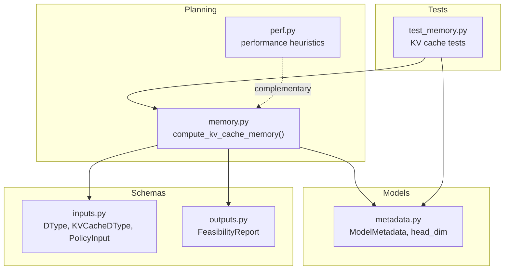
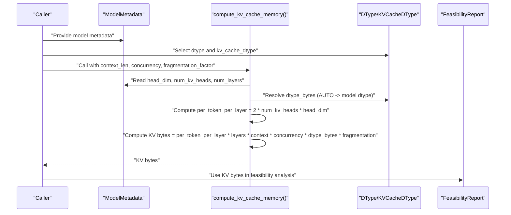
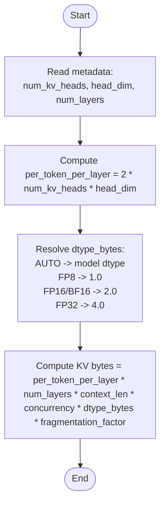
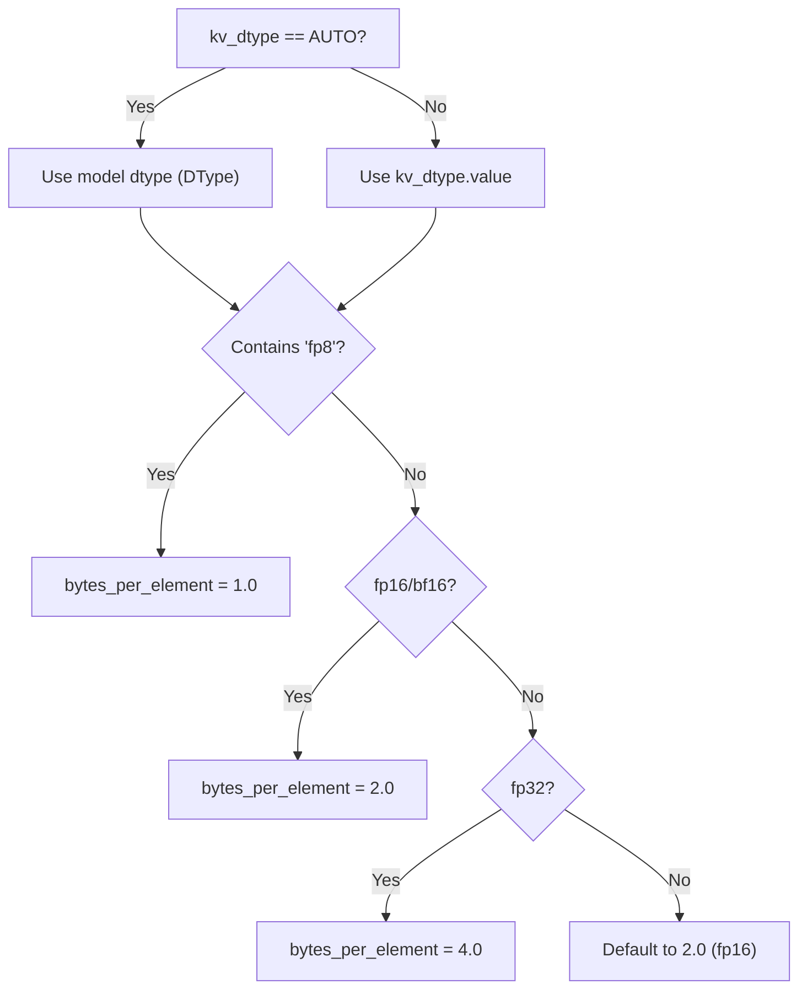
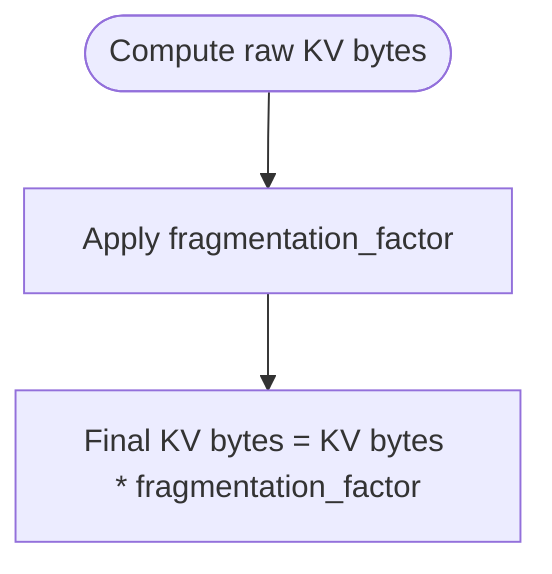
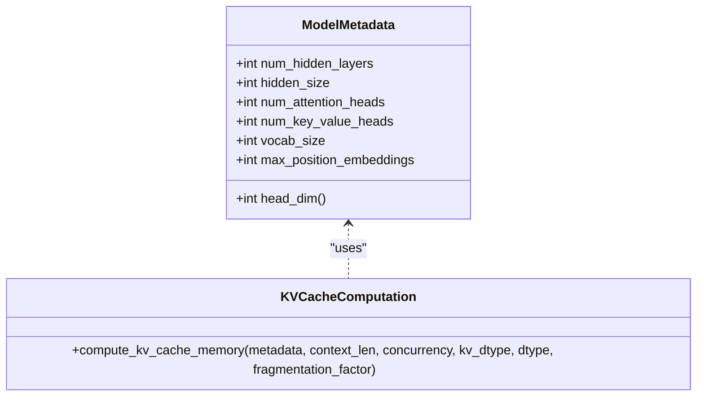
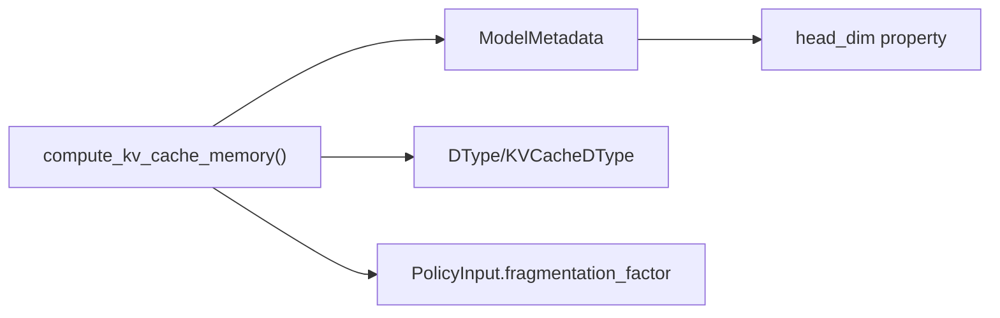

# KV Cache Computation

<cite>
**Referenced Files in This Document**
- [memory.py](file://src/vllm_wizard/planning/memory.py)
- [metadata.py](file://src/vllm_wizard/models/metadata.py)
- [inputs.py](file://src/vllm_wizard/schemas/inputs.py)
- [outputs.py](file://src/vllm_wizard/schemas/outputs.py)
- [test_memory.py](file://tests/test_memory.py)
- [README.md](file://README.md)
- [config.json](file://test_model/config.json)
- [conftest.py](file://tests/conftest.py)
</cite>

## Table of Contents
1. [Introduction](#introduction)
2. [Project Structure](#project-structure)
3. [Core Components](#core-components)
4. [Architecture Overview](#architecture-overview)
5. [Detailed Component Analysis](#detailed-component-analysis)
6. [Dependency Analysis](#dependency-analysis)
7. [Performance Considerations](#performance-considerations)
8. [Troubleshooting Guide](#troubleshooting-guide)
9. [Conclusion](#conclusion)
10. [Appendices](#appendices)

## Introduction
This document explains how KV cache memory is computed in the vLLM Wizard memory planner. It covers the per-token memory formula, how KV cache grows with context length and concurrency, the influence of model architecture parameters, data type selection logic (including AUTO resolution and FP8 benefits), and the role of the fragmentation factor. It also provides calculation examples for different model architectures and usage scenarios, along with troubleshooting guidance for memory spikes and optimization tips for long context lengths.

## Project Structure
The KV cache computation lives in the planning module and integrates with model metadata extraction and schema definitions for data types and policy parameters.

**Diagram sources**
- [memory.py](file://src/vllm_wizard/planning/memory.py#L59-L121)
- [metadata.py](file://src/vllm_wizard/models/metadata.py#L12-L36)
- [inputs.py](file://src/vllm_wizard/schemas/inputs.py#L9-L36)
- [outputs.py](file://src/vllm_wizard/schemas/outputs.py#L37-L55)
- [test_memory.py](file://tests/test_memory.py#L58-L152)

**Section sources**
- [memory.py](file://src/vllm_wizard/planning/memory.py#L1-L121)
- [metadata.py](file://src/vllm_wizard/models/metadata.py#L1-L36)
- [inputs.py](file://src/vllm_wizard/schemas/inputs.py#L1-L36)
- [outputs.py](file://src/vllm_wizard/schemas/outputs.py#L1-L55)
- [test_memory.py](file://tests/test_memory.py#L1-L152)

## Core Components
- KV cache memory computation function: computes memory in bytes using the per-token, per-layer formula and applies fragmentation.
- Model metadata: provides architecture parameters (hidden size, attention heads, KV heads, layers) and derived head dimension.
- Data type enums: define supported weight and KV cache dtypes, including AUTO resolution and FP8 variants.
- Policy parameters: fragmentation factor and other sizing policies.

Key formulas and behaviors:
- Per-token, per-layer KV elements: 2 × num_kv_heads × head_dim (K and V)
- KV cache bytes: per_token_per_layer × num_layers × context_len × concurrency × dtype_bytes × fragmentation_factor
- AUTO dtype resolution: defaults to model dtype when KV dtype is AUTO
- FP8 KV cache: reduces memory by approximately half compared to FP16/BF16

**Section sources**
- [memory.py](file://src/vllm_wizard/planning/memory.py#L59-L121)
- [metadata.py](file://src/vllm_wizard/models/metadata.py#L26-L36)
- [inputs.py](file://src/vllm_wizard/schemas/inputs.py#L9-L36)

## Architecture Overview
The KV cache computation pipeline connects model metadata, dtype selection, and policy parameters to produce a memory estimate.

**Diagram sources**
- [memory.py](file://src/vllm_wizard/planning/memory.py#L59-L121)
- [metadata.py](file://src/vllm_wizard/models/metadata.py#L26-L36)
- [inputs.py](file://src/vllm_wizard/schemas/inputs.py#L9-L36)

## Detailed Component Analysis

### KV Cache Memory Formula and Growth
- Per-token, per-layer KV elements: 2 × num_kv_heads × head_dim
- KV cache bytes: per_token_per_layer × num_layers × context_len × concurrency × dtype_bytes × fragmentation_factor
- Growth characteristics:
  - Linear with context_len
  - Linear with concurrency
  - Proportional to num_kv_heads × head_dim × num_layers

**Diagram sources**
- [memory.py](file://src/vllm_wizard/planning/memory.py#L59-L121)

**Section sources**
- [memory.py](file://src/vllm_wizard/planning/memory.py#L69-L121)

### Data Type Selection Logic (AUTO and FP8)
- KVCacheDType.AUTO resolves to the model weight dtype when set; otherwise defaults to BF16.
- FP8 KV cache uses 1 byte per element, halving memory compared to FP16/BF16 (2 bytes).
- The dtype_bytes mapping ensures correct sizing for FP8, FP16, BF16, and FP32.

**Diagram sources**
- [memory.py](file://src/vllm_wizard/planning/memory.py#L93-L107)
- [inputs.py](file://src/vllm_wizard/schemas/inputs.py#L28-L36)

**Section sources**
- [memory.py](file://src/vllm_wizard/planning/memory.py#L93-L107)
- [inputs.py](file://src/vllm_wizard/schemas/inputs.py#L28-L36)

### Fragmentation Factor Impact
- The fragmentation factor is applied as a multiplicative safety margin to account for memory allocator overhead and fragmentation.
- PolicyInput exposes fragmentation_factor with a default of 1.15.

**Diagram sources**
- [memory.py](file://src/vllm_wizard/planning/memory.py#L118-L121)
- [inputs.py](file://src/vllm_wizard/schemas/inputs.py#L96-L98)

**Section sources**
- [memory.py](file://src/vllm_wizard/planning/memory.py#L118-L121)
- [inputs.py](file://src/vllm_wizard/schemas/inputs.py#L96-L98)

### Relationship Between Architecture Parameters and Memory
- head_dim influences memory linearly; larger head_dim increases per-token KV size.
- num_kv_heads controls KV cache proportionally; Grouped-Query Attention (GQA) reduces KV heads and thus KV cache size.
- num_layers scales KV cache linearly; deeper models require more memory.

**Diagram sources**
- [metadata.py](file://src/vllm_wizard/models/metadata.py#L12-L36)
- [memory.py](file://src/vllm_wizard/planning/memory.py#L59-L121)

**Section sources**
- [metadata.py](file://src/vllm_wizard/models/metadata.py#L26-L36)
- [memory.py](file://src/vllm_wizard/planning/memory.py#L85-L90)

### Calculation Examples
Examples are validated by tests and reflect realistic model architectures.

- Example 1: LLaMA-2 7B (MHA)
  - Parameters: num_hidden_layers=32, hidden_size=4096, num_attention_heads=32, num_key_value_heads=32, head_dim=128
  - KV per token per layer = 2 × 32 × 128
  - KV bytes per token per layer = KV per token per layer × dtype_bytes
  - Total KV = KV per token per layer × 32 layers × 4096 tokens × 1 sequence × fragmentation_factor
  - Expected ≈ 2 GiB (FP16/BF16), ≈ 1 GiB (FP8)

- Example 2: LLaMA-3 8B with GQA (num_key_value_heads=8)
  - KV per token per layer = 2 × 8 × 128
  - Total KV ≈ 512 MiB (FP16/BF16), ≈ 256 MiB (FP8)
  - Significantly smaller than MHA due to fewer KV heads.

- Example 3: Concurrency scaling
  - KV scales linearly with concurrency; doubling concurrency doubles KV cache.

- Example 4: FP8 KV cache benefit
  - KV cache with FP8 is approximately half the size of FP16/BF16.

These examples are verified by tests that assert the computed values and scaling behavior.

**Section sources**
- [test_memory.py](file://tests/test_memory.py#L58-L152)
- [conftest.py](file://tests/conftest.py#L81-L109)
- [config.json](file://test_model/config.json#L1-L12)

## Dependency Analysis
The KV cache computation depends on:
- Model metadata for architecture parameters and derived head_dim
- Data type enums for dtype resolution and bytes-per-element mapping
- Policy parameters for fragmentation factor

**Diagram sources**
- [memory.py](file://src/vllm_wizard/planning/memory.py#L59-L121)
- [metadata.py](file://src/vllm_wizard/models/metadata.py#L26-L36)
- [inputs.py](file://src/vllm_wizard/schemas/inputs.py#L96-L98)

**Section sources**
- [memory.py](file://src/vllm_wizard/planning/memory.py#L59-L121)
- [metadata.py](file://src/vllm_wizard/models/metadata.py#L26-L36)
- [inputs.py](file://src/vllm_wizard/schemas/inputs.py#L96-L98)

## Performance Considerations
- KV cache dominates memory for long context lengths and high concurrency.
- FP8 KV cache reduces memory footprint and can enable longer contexts or higher concurrency on constrained GPUs.
- Fragmentation factor accounts for allocator overhead; tune it based on observed memory usage.
- GQA reduces KV cache by decreasing num_kv_heads, lowering memory requirements.

[No sources needed since this section provides general guidance]

## Troubleshooting Guide
Common issues and remedies:
- High KV cache usage leading to OOM:
  - Reduce context_len or concurrency.
  - Switch to FP8 KV cache.
  - Increase VRAM or use multi-GPU with tensor parallelism.
- Excessive fragmentation spikes:
  - Adjust fragmentation_factor to a lower value if memory is tight.
  - Monitor headroom and consider reducing other memory consumers (e.g., model dtype precision).
- Long context performance:
  - Consider sliding window or chunking strategies to cap context length.
  - Use quantization to free VRAM for larger context windows.

[No sources needed since this section provides general guidance]

## Conclusion
The KV cache memory computation follows a straightforward, linear formula driven by model architecture parameters and usage settings. By tuning KV dtype (especially FP8), fragmentation factor, and usage parameters (context length and concurrency), users can effectively manage memory requirements for long-context and high-concurrency scenarios.

[No sources needed since this section summarizes without analyzing specific files]

## Appendices

### Appendix A: Formula Reference
- Per-token, per-layer KV elements: 2 × num_kv_heads × head_dim
- KV cache bytes: per_token_per_layer × num_layers × context_len × concurrency × dtype_bytes × fragmentation_factor
- AUTO dtype resolution: KVCacheDType.AUTO maps to model DType; defaults to BF16 if AUTO is used without specifying model dtype.

**Section sources**
- [memory.py](file://src/vllm_wizard/planning/memory.py#L69-L121)
- [inputs.py](file://src/vllm_wizard/schemas/inputs.py#L9-L36)

### Appendix B: Example Scenarios
- LLaMA-2 7B MHA:
  - FP16/BF16: ~2 GiB KV for 4096 tokens, 1 sequence
  - FP8: ~1 GiB KV for the same scenario
- LLaMA-3 8B GQA (KV heads reduced):
  - FP16/BF16: ~512 MiB KV for 4096 tokens, 1 sequence
  - FP8: ~256 MiB KV for the same scenario
- Concurrency scaling:
  - Doubling concurrency roughly doubles KV cache

**Section sources**
- [test_memory.py](file://tests/test_memory.py#L58-L152)
- [conftest.py](file://tests/conftest.py#L81-L109)
- [config.json](file://test_model/config.json#L1-L12)