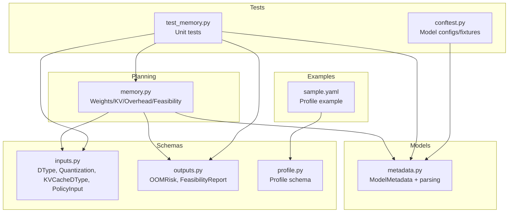
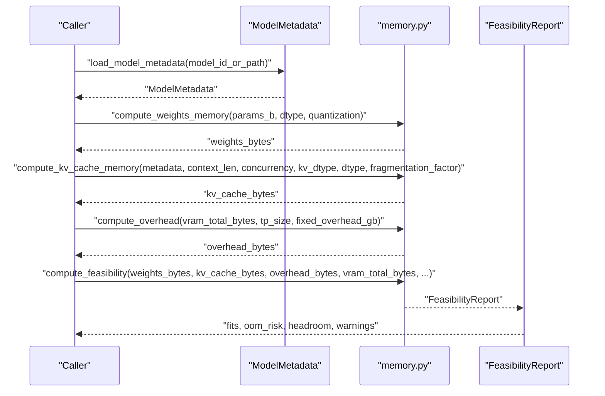
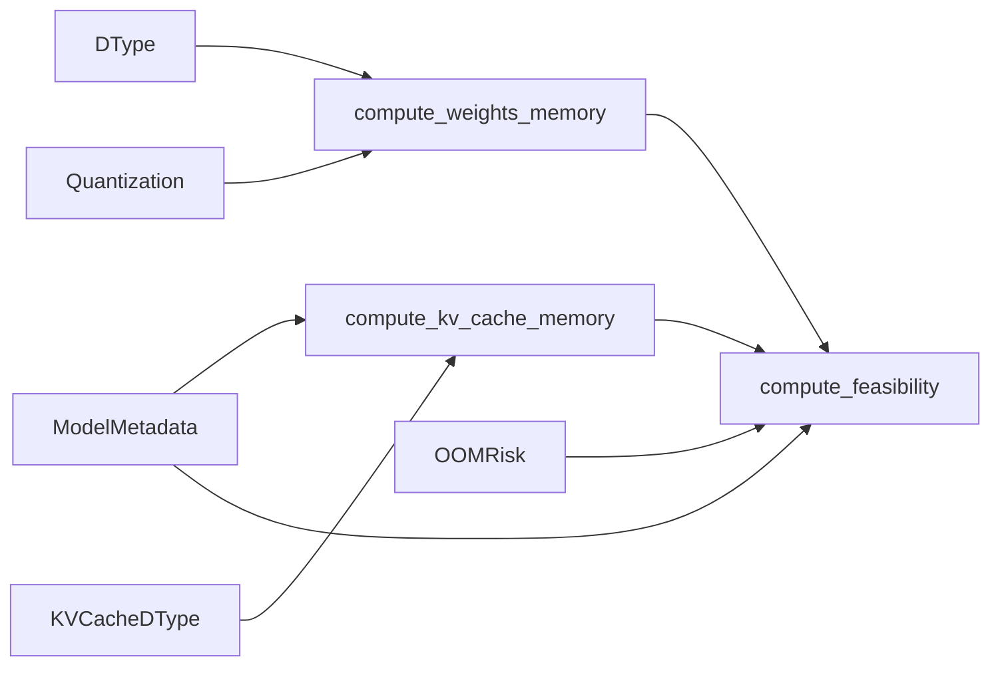

# Memory Calculation Framework

<cite>
**Referenced Files in This Document**
- [memory.py](file://src/vllm_wizard/planning/memory.py)
- [metadata.py](file://src/vllm_wizard/models/metadata.py)
- [inputs.py](file://src/vllm_wizard/schemas/inputs.py)
- [outputs.py](file://src/vllm_wizard/schemas/outputs.py)
- [profile.py](file://src/vllm_wizard/schemas/profile.py)
- [test_memory.py](file://tests/test_memory.py)
- [conftest.py](file://tests/conftest.py)
- [README.md](file://README.md)
- [sample.yaml](file://examples/profiles/sample.yaml)
</cite>

## Table of Contents
1. [Introduction](#introduction)
2. [Project Structure](#project-structure)
3. [Core Components](#core-components)
4. [Architecture Overview](#architecture-overview)
5. [Detailed Component Analysis](#detailed-component-analysis)
6. [Dependency Analysis](#dependency-analysis)
7. [Performance Considerations](#performance-considerations)
8. [Troubleshooting Guide](#troubleshooting-guide)
9. [Conclusion](#conclusion)
10. [Appendices](#appendices)

## Introduction
This document describes the memory calculation framework that powers VRAM feasibility analysis for vLLM deployments. It explains the mathematical models for:
- Weights memory computation based on model parameters and data types
- KV cache memory computation including per-token memory per layer, context length impact, and concurrency effects
- Overhead estimation and fragmentation factors
- Step-by-step calculation examples for different model sizes and configurations
- Formulas for memory breakdown analysis and feasibility assessment
- The relationship between model architecture (attention heads, layers, dimensions) and memory requirements
- Quantization impact on memory calculations and conversion examples
- Troubleshooting guidance for memory calculation discrepancies and validation techniques

## Project Structure
The memory calculation framework is implemented in a focused set of modules:
- Planning: memory computations and feasibility analysis
- Models: model metadata extraction and architecture parsing
- Schemas: typed input/output models for configuration and reporting
- Tests: unit tests validating the formulas and edge cases
- Examples: sample profile YAML for quick start

**Diagram sources**
- [memory.py](file://src/vllm_wizard/planning/memory.py#L1-L367)
- [metadata.py](file://src/vllm_wizard/models/metadata.py#L1-L255)
- [inputs.py](file://src/vllm_wizard/schemas/inputs.py#L1-L110)
- [outputs.py](file://src/vllm_wizard/schemas/outputs.py#L1-L118)
- [profile.py](file://src/vllm_wizard/schemas/profile.py#L1-L75)
- [test_memory.py](file://tests/test_memory.py#L1-L265)
- [conftest.py](file://tests/conftest.py#L1-L126)
- [sample.yaml](file://examples/profiles/sample.yaml#L1-L40)

**Section sources**
- [memory.py](file://src/vllm_wizard/planning/memory.py#L1-L367)
- [metadata.py](file://src/vllm_wizard/models/metadata.py#L1-L255)
- [inputs.py](file://src/vllm_wizard/schemas/inputs.py#L1-L110)
- [outputs.py](file://src/vllm_wizard/schemas/outputs.py#L1-L118)
- [profile.py](file://src/vllm_wizard/schemas/profile.py#L1-L75)
- [test_memory.py](file://tests/test_memory.py#L1-L265)
- [conftest.py](file://tests/conftest.py#L1-L126)
- [sample.yaml](file://examples/profiles/sample.yaml#L1-L40)

## Core Components
- Weights memory calculator: computes memory for model parameters based on dtype or quantization
- KV cache memory calculator: computes memory for attention K/V caches considering context length, concurrency, and KV dtype
- Overhead calculator: estimates framework overhead and multi-GPU communication buffers
- Feasibility analyzer: aggregates weights, KV cache, and overhead to assess VRAM fit and risk
- Max concurrency/context calculators: derive maximum concurrency at a given context and vice versa
- Model metadata extractor: parses model config.json or loads from Hugging Face to extract architecture parameters

Key constants and mappings:
- Data type bytes per parameter for weights
- Quantization bytes per parameter (including overhead for scales/zeros)
- Bytes-to-GiB conversion constant
- Fragmentation factor defaults and tunables

**Section sources**
- [memory.py](file://src/vllm_wizard/planning/memory.py#L9-L28)
- [memory.py](file://src/vllm_wizard/planning/memory.py#L31-L121)
- [memory.py](file://src/vllm_wizard/planning/memory.py#L124-L152)
- [memory.py](file://src/vllm_wizard/planning/memory.py#L155-L270)
- [memory.py](file://src/vllm_wizard/planning/memory.py#L273-L367)
- [metadata.py](file://src/vllm_wizard/models/metadata.py#L12-L37)

## Architecture Overview
The memory framework orchestrates data type decisions, model metadata extraction, and VRAM feasibility checks.

**Diagram sources**
- [metadata.py](file://src/vllm_wizard/models/metadata.py#L209-L254)
- [memory.py](file://src/vllm_wizard/planning/memory.py#L31-L121)
- [memory.py](file://src/vllm_wizard/planning/memory.py#L124-L152)
- [memory.py](file://src/vllm_wizard/planning/memory.py#L155-L270)

## Detailed Component Analysis

### Weights Memory Calculator
Purpose:
- Compute memory footprint of model weights based on parameter count and data type or quantization scheme.

Mathematical model:
- weights_bytes = parameters × bytes_per_param
- bytes_per_param depends on:
  - Quantization: AWQ/GPTQ (~0.55), INT8 (1.0), FP8 (1.0), otherwise default to FP16/BF16 (2.0)
  - Dtype: FP32 (4.0), FP16/BF16 (2.0), INT8 (1.0), FP8 (1.0)

Implementation highlights:
- Accepts parameters in billions and converts to integer count
- Selects bytes per parameter based on quantization or dtype
- Returns bytes

Validation references:
- Unit tests cover FP16, BF16, FP32, AWQ, GPTQ, and INT8 scenarios

**Section sources**
- [memory.py](file://src/vllm_wizard/planning/memory.py#L31-L56)
- [test_memory.py](file://tests/test_memory.py#L19-L56)

### KV Cache Memory Calculator
Purpose:
- Compute memory for attention K/V caches across layers, tokens, and concurrent sequences.

Mathematical model:
- Per token per layer KV elements = 2 × num_kv_heads × head_dim
- KV bytes per element depends on KV dtype:
  - FP8 variants: 1.0
  - FP16/BF16: 2.0
  - FP32: 4.0
- KV cache bytes = elements_per_token_per_layer × num_layers × context_len × concurrency × fragmentation_factor

Implementation highlights:
- Uses ModelMetadata to derive head_dim and num_kv_heads
- Supports AUTO KV dtype mapping to model dtype
- Applies fragmentation factor for safety

Validation references:
- Unit tests cover GQA scaling, concurrency scaling, FP8 vs FP16, and fragmentation factor application

**Section sources**
- [memory.py](file://src/vllm_wizard/planning/memory.py#L59-L121)
- [metadata.py](file://src/vllm_wizard/models/metadata.py#L26-L29)
- [test_memory.py](file://tests/test_memory.py#L58-L152)

### Overhead Calculator
Purpose:
- Estimate framework overhead and multi-GPU communication buffers.

Mathematical model:
- Base overhead = max(1.0 GiB, 0.02 × VRAM_total)
- Multi-GPU communication overhead = 0.25 × (tp_size − 1) if tp_size > 1
- Optionally override with fixed overhead in GB

Implementation highlights:
- Converts bytes to GiB using constant
- Supports fixed overhead override

Validation references:
- Unit tests cover base overhead scaling, large VRAM scaling, multi-GPU overhead, and fixed overhead

**Section sources**
- [memory.py](file://src/vllm_wizard/planning/memory.py#L124-L152)
- [test_memory.py](file://tests/test_memory.py#L154-L179)

### Feasibility Analyzer
Purpose:
- Aggregate weights, KV cache, and overhead to compute VRAM feasibility and risk.

Mathematical model:
- Allocatable VRAM = VRAM_total × gpu_memory_utilization
- Required VRAM = weights + KV cache + overhead
- Headroom = Allocatable − Required
- Risk classification:
  - Low: headroom ≥ 2 GiB
  - Medium: 0 ≤ headroom < 2 GiB
  - High: headroom < 0
- Warnings include fit status, OOM risk, and KV cache proportion

Additional capabilities:
- Compute maximum concurrency at a given context
- Compute maximum context at a given concurrency

Validation references:
- Unit tests cover configurations that fit, do not fit, and medium risk scenarios

**Section sources**
- [memory.py](file://src/vllm_wizard/planning/memory.py#L155-L270)
- [memory.py](file://src/vllm_wizard/planning/memory.py#L273-L367)
- [test_memory.py](file://tests/test_memory.py#L181-L265)

### Model Metadata Extraction
Purpose:
- Parse model config.json or download from Hugging Face to extract architecture parameters needed for memory calculations.

Key fields:
- num_hidden_layers, hidden_size, num_attention_heads, num_key_value_heads, vocab_size, max_position_embeddings, intermediate_size, num_params

Derived properties:
- head_dim = hidden_size / num_attention_heads
- params_billions = num_params / 1e9 (if known)

Fallbacks and estimation:
- Fallbacks for missing keys across model families
- Known model size lookup table for approximate parameter counts
- Estimation formula for parameter count from architecture

Validation references:
- Fixtures define representative configs for LLaMA, Mistral, and GQA variants

**Section sources**
- [metadata.py](file://src/vllm_wizard/models/metadata.py#L12-L37)
- [metadata.py](file://src/vllm_wizard/models/metadata.py#L102-L158)
- [metadata.py](file://src/vllm_wizard/models/metadata.py#L161-L188)
- [metadata.py](file://src/vllm_wizard/models/metadata.py#L191-L206)
- [metadata.py](file://src/vllm_wizard/models/metadata.py#L209-L254)
- [conftest.py](file://tests/conftest.py#L11-L126)

### Data Type and Quantization Mappings
- Weights dtype bytes per parameter:
  - FP32: 4.0
  - FP16/BF16: 2.0
  - INT8: 1.0
  - FP8: 1.0
- Quantization bytes per parameter (with overhead):
  - AWQ/GPTQ: ~0.55
  - INT8: 1.0
  - FP8: 1.0
  - none: default to FP16

KV cache dtype bytes per element:
- FP8 variants: 1.0
- FP16/BF16: 2.0
- FP32: 4.0

**Section sources**
- [memory.py](file://src/vllm_wizard/planning/memory.py#L10-L25)
- [memory.py](file://src/vllm_wizard/planning/memory.py#L93-L107)

### Formulas for Memory Breakdown Analysis
- Weights memory:
  - weights_bytes = parameters × bytes_per_param
  - bytes_per_param from dtype or quantization mapping
- KV cache memory:
  - kv_per_token_per_layer = 2 × num_kv_heads × head_dim
  - kv_cache_bytes = kv_per_token_per_layer × num_layers × context_len × concurrency × fragmentation_factor
  - bytes_per_element from KV dtype mapping
- Overhead:
  - overhead_bytes = max(1.0 GiB, 0.02 × VRAM_total) + 0.25 × (tp_size − 1) GiB (if tp_size > 1)
  - Optionally fixed overhead in GB
- Feasibility:
  - allocatable = VRAM_total × gpu_memory_utilization
  - required = weights + KV cache + overhead
  - headroom = allocatable − required
  - risk: low/medium/high thresholds
- Max concurrency at context:
  - max_concurrency = floor((allocatable − weights − overhead) / kv_cache_per_seq_at_context)
- Max context at concurrency:
  - max_context = floor((allocatable − weights − overhead) / (kv_cache_per_token_per_seq × concurrency))

**Section sources**
- [README.md](file://README.md#L192-L214)
- [memory.py](file://src/vllm_wizard/planning/memory.py#L31-L121)
- [memory.py](file://src/vllm_wizard/planning/memory.py#L124-L152)
- [memory.py](file://src/vllm_wizard/planning/memory.py#L155-L270)
- [memory.py](file://src/vllm_wizard/planning/memory.py#L273-L367)

### Step-by-Step Calculation Examples
Example 1: LLaMA 2 7B with FP16 weights and FP16 KV cache
- Parameters: 7.0 billion
- Weights bytes: 7.0 × 2.0 = 14.0 GiB
- KV cache per token per layer: 2 × 32 × 128 = 8192 elements
- KV cache bytes: 8192 × 32 × 4096 × 1 × 2.0 (FP16) × 1.15 (fragmentation) ≈ 2.0 GiB
- Overhead: max(1.0, 0.02 × 24) ≈ 1.0 GiB (for 24 GiB VRAM)
- Allocatable: 24 × 0.90 = 21.6 GiB
- Required: 14.0 + 2.0 + 1.0 = 17.0 GiB
- Headroom: 21.6 − 17.0 = 4.6 GiB → Low OOM risk

Example 2: LLaMA 3 8B with GQA (num_kv_heads = 8) and FP8 KV cache
- KV cache per token per layer: 2 × 8 × 128 = 2048 elements
- KV cache bytes: 2048 × 32 × 4096 × 1 × 1.0 (FP8) × 1.15 ≈ 0.5 GiB
- Required: 14.0 + 0.5 + 1.0 = 15.5 GiB
- Headroom: 21.6 − 15.5 = 6.1 GiB → Low OOM risk

Example 3: High concurrency scenario
- Allocatable: 24 × 0.90 = 21.6 GiB
- Weights: 14.0 GiB, Overhead: 1.0 GiB
- Available for KV: 6.6 GiB
- KV per sequence at 4096 context: ≈ 2.0 GiB
- Max concurrency: floor(6.6 / 2.0) = 3

Example 4: Quantization impact
- AWQ/GPTQ: 7.0 × 0.55 ≈ 3.9 GiB weights
- INT8: 7.0 × 1.0 = 7.0 GiB weights
- FP8 KV cache: halves KV cache size compared to FP16

**Section sources**
- [test_memory.py](file://tests/test_memory.py#L58-L152)
- [test_memory.py](file://tests/test_memory.py#L181-L265)
- [README.md](file://README.md#L192-L214)

### Relationship Between Model Architecture and Memory Requirements
- Layers (num_hidden_layers): KV cache scales linearly with layers
- Heads (num_attention_heads, num_key_value_heads): KV cache scales with KV heads; GQA reduces KV cache significantly
- Head dimension (head_dim = hidden_size / num_attention_heads): KV cache scales with head_dim
- Context length (context_len): KV cache scales linearly with tokens
- Concurrency: KV cache scales linearly with number of concurrent sequences
- KV dtype: KV cache scales with bytes per element (FP8 < FP16/BF16 < FP32)

**Section sources**
- [metadata.py](file://src/vllm_wizard/models/metadata.py#L26-L29)
- [memory.py](file://src/vllm_wizard/planning/memory.py#L89-L121)
- [test_memory.py](file://tests/test_memory.py#L77-L112)

### Quantization Impact on Memory Calculations
- Weights memory:
  - AWQ/GPTQ: ~0.55 bytes per parameter (includes overhead for scales/zeros)
  - INT8: 1.0 bytes per parameter
  - FP8: 1.0 bytes per parameter
- KV cache memory:
  - KV dtype choice affects bytes per element (FP8 vs FP16/BF16 vs FP32)
- Practical conversions:
  - FP16 weights to AWQ/GPTQ: multiply by ~0.55/2.0 ≈ 0.275
  - FP16 weights to INT8: multiply by 1.0/2.0 = 0.5
  - KV cache FP16 to FP8: divide by 2.0

**Section sources**
- [memory.py](file://src/vllm_wizard/planning/memory.py#L10-L25)
- [memory.py](file://src/vllm_wizard/planning/memory.py#L93-L107)
- [test_memory.py](file://tests/test_memory.py#L40-L56)
- [test_memory.py](file://tests/test_memory.py#L113-L132)

## Dependency Analysis
The memory module depends on:
- Model metadata for architecture parameters
- Input enums for data types and quantization
- Output enums for feasibility reporting

**Diagram sources**
- [memory.py](file://src/vllm_wizard/planning/memory.py#L5-L7)
- [inputs.py](file://src/vllm_wizard/schemas/inputs.py#L9-L36)
- [outputs.py](file://src/vllm_wizard/schemas/outputs.py#L9-L15)
- [metadata.py](file://src/vllm_wizard/models/metadata.py#L12-L25)

**Section sources**
- [memory.py](file://src/vllm_wizard/planning/memory.py#L5-L7)
- [inputs.py](file://src/vllm_wizard/schemas/inputs.py#L9-L36)
- [outputs.py](file://src/vllm_wizard/schemas/outputs.py#L9-L15)
- [metadata.py](file://src/vllm_wizard/models/metadata.py#L12-L25)

## Performance Considerations
- Fragmentation factor: default 1.15 accounts for allocation overhead; tune based on observed fragmentation
- KV cache dominates memory for long contexts and high concurrency; consider FP8 KV cache for large deployments
- Quantization reduces weights memory; AWQ/GPTQ provides strong compression with minimal accuracy impact
- Overhead grows with VRAM size and multi-GPU setups; ensure adequate headroom for runtime allocations
- GQA significantly reduces KV cache size; leverage when supported by the model

[No sources needed since this section provides general guidance]

## Troubleshooting Guide
Common discrepancies and validations:
- Missing KV heads in config: fallback to attention heads; verify num_key_value_heads is parsed correctly
- Unknown model size: rely on known model size lookup or provide params_b override
- Incorrect dtype mapping: ensure KVCacheDType.AUTO maps to model dtype consistently
- Fragmentation factor tuning: increase fragmentation factor if encountering OOM despite headroom
- Multi-GPU overhead: confirm tp_size and communication overhead are accounted for
- Validation techniques:
  - Compare computed KV cache per token per layer against known model sizes
  - Cross-check weights memory using both quantization and dtype mappings
  - Verify overhead calculation with fixed overhead override
  - Use max concurrency and max context calculators to validate feasibility bounds

**Section sources**
- [metadata.py](file://src/vllm_wizard/models/metadata.py#L132-L137)
- [metadata.py](file://src/vllm_wizard/models/metadata.py#L191-L206)
- [metadata.py](file://src/vllm_wizard/models/metadata.py#L209-L254)
- [test_memory.py](file://tests/test_memory.py#L58-L152)
- [test_memory.py](file://tests/test_memory.py#L154-L179)
- [test_memory.py](file://tests/test_memory.py#L233-L265)

## Conclusion
The memory calculation framework provides a robust, modular foundation for VRAM feasibility analysis. By separating concerns—weights, KV cache, overhead, and feasibility—into distinct functions, it enables precise modeling of memory requirements across diverse model architectures, data types, and deployment scenarios. The formulas and validation examples included here support reproducible sizing decisions and help operators select appropriate configurations with confidence.

[No sources needed since this section summarizes without analyzing specific files]

## Appendices

### Appendix A: Inputs and Outputs Reference
- Inputs:
  - DType: AUTO, FP16, BF16, FP32
  - Quantization: NONE, AWQ, GPTQ, INT8, FP8
  - KVCacheDType: AUTO, FP16, BF16, FP8_E4M3FN, FP8_E5M2
  - PolicyInput: gpu_memory_utilization, overhead_gb, fragmentation_factor, headroom_gb
- Outputs:
  - OOMRisk: LOW, MEDIUM, HIGH
  - FeasibilityReport: fits, oom_risk, vram_total_gb, vram_target_alloc_gb, weights_gb, kv_cache_gb, overhead_gb, headroom_gb, max_concurrency_at_context, max_context_at_concurrency, warnings

**Section sources**
- [inputs.py](file://src/vllm_wizard/schemas/inputs.py#L9-L100)
- [outputs.py](file://src/vllm_wizard/schemas/outputs.py#L9-L55)

### Appendix B: Profile Schema Reference
- Profile sections:
  - model: id, revision, dtype, quantization, kv_cache_dtype, max_model_len, params_b
  - hardware: gpu_name, gpus, vram_gb, interconnect, tp_size
  - workload: prompt_tokens, gen_tokens, concurrency, streaming, mode
  - policy: gpu_memory_utilization, overhead_gb, fragmentation_factor, headroom_gb
  - outputs: emit, vllm_args

**Section sources**
- [profile.py](file://src/vllm_wizard/schemas/profile.py#L16-L75)
- [sample.yaml](file://examples/profiles/sample.yaml#L1-L40)