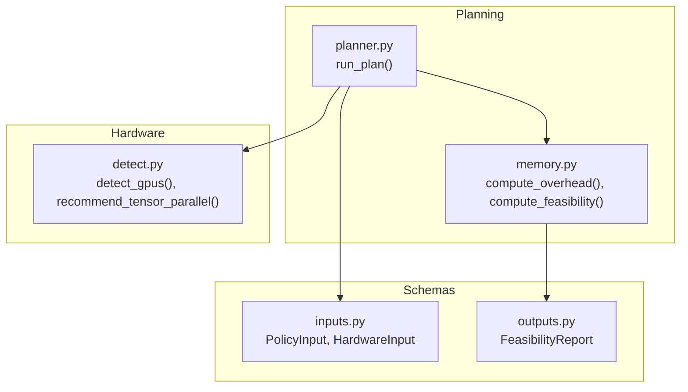
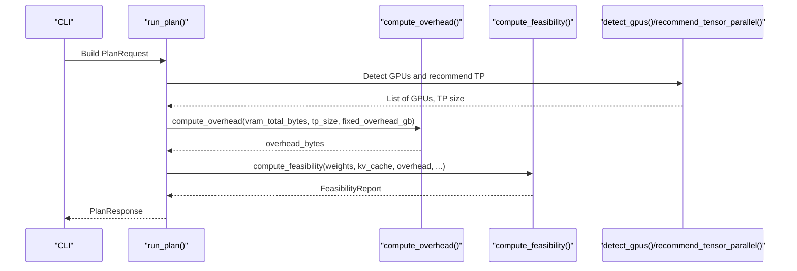
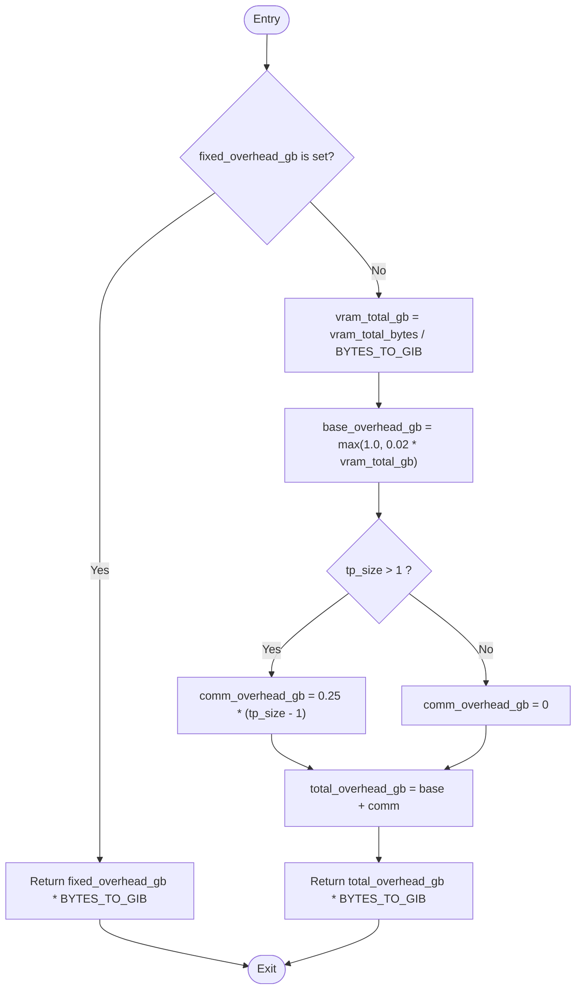
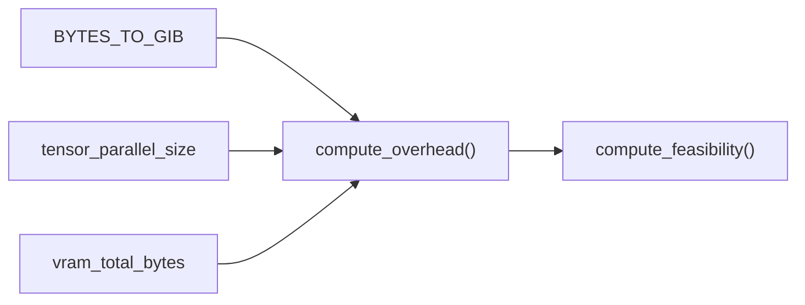

# Overhead Estimation

<cite>
**Referenced Files in This Document**
- [memory.py](file://src/vllm_wizard/planning/memory.py)
- [planner.py](file://src/vllm_wizard/planning/planner.py)
- [detect.py](file://src/vllm_wizard/hardware/detect.py)
- [inputs.py](file://src/vllm_wizard/schemas/inputs.py)
- [outputs.py](file://src/vllm_wizard/schemas/outputs.py)
- [test_memory.py](file://tests/test_memory.py)
- [requirements.txt](file://requirements.txt)
</cite>

## Table of Contents
1. [Introduction](#introduction)
2. [Project Structure](#project-structure)
3. [Core Components](#core-components)
4. [Architecture Overview](#architecture-overview)
5. [Detailed Component Analysis](#detailed-component-analysis)
6. [Dependency Analysis](#dependency-analysis)
7. [Performance Considerations](#performance-considerations)
8. [Troubleshooting Guide](#troubleshooting-guide)
9. [Conclusion](#conclusion)
10. [Appendices](#appendices)

## Introduction
This document explains the framework overhead estimation used by the vLLM Wizard to size GPU deployments. It focuses on the compute_overhead function, which offers two calculation modes:
- Fixed overhead override: a user-specified constant value in GiB
- Dynamic calculation: a base overhead derived from total VRAM plus communication overhead for multi-GPU tensor parallel setups

It documents the base overhead formula, the communication buffer contribution for tensor parallel configurations, the BYTES_TO_GIB conversion constant, and practical guidance for choosing between fixed and automatic modes. It also provides calculation examples and deployment considerations.

## Project Structure
The overhead estimation lives in the planning module and integrates with the broader planning pipeline that computes model weights, KV cache, and feasibility.

**Diagram sources**
- [memory.py](file://src/vllm_wizard/planning/memory.py#L124-L152)
- [planner.py](file://src/vllm_wizard/planning/planner.py#L21-L135)
- [detect.py](file://src/vllm_wizard/hardware/detect.py#L10-L159)
- [inputs.py](file://src/vllm_wizard/schemas/inputs.py#L89-L100)
- [outputs.py](file://src/vllm_wizard/schemas/outputs.py#L37-L54)

**Section sources**
- [memory.py](file://src/vllm_wizard/planning/memory.py#L1-L367)
- [planner.py](file://src/vllm_wizard/planning/planner.py#L1-L172)
- [detect.py](file://src/vllm_wizard/hardware/detect.py#L1-L229)
- [inputs.py](file://src/vllm_wizard/schemas/inputs.py#L1-L110)
- [outputs.py](file://src/vllm_wizard/schemas/outputs.py#L1-L118)

## Core Components
- compute_overhead: Computes framework overhead in bytes using either a fixed value or a dynamic formula.
- compute_feasibility: Integrates overhead into a VRAM feasibility analysis and risk assessment.
- Planner integration: Orchestrates memory breakdown and passes overhead into feasibility checks.
- CLI and schemas: Expose --overhead-gb and --tensor-parallel-size to control overhead and TP size.

Key constants and types:
- BYTES_TO_GIB: Conversion from bytes to GiB (base 1024).
- PolicyInput.overhead_gb: Optional fixed overhead in GiB.
- HardwareInput.tensor_parallel_size: Controls communication overhead.

**Section sources**
- [memory.py](file://src/vllm_wizard/planning/memory.py#L27-L28)
- [memory.py](file://src/vllm_wizard/planning/memory.py#L124-L152)
- [memory.py](file://src/vllm_wizard/planning/memory.py#L155-L270)
- [planner.py](file://src/vllm_wizard/planning/planner.py#L77-L81)
- [inputs.py](file://src/vllm_wizard/schemas/inputs.py#L89-L100)

## Architecture Overview
The overhead estimation participates in the planning pipeline as follows:
- The planner resolves hardware (VRAM and TP size)
- It computes weights and KV cache memory
- It computes overhead using compute_overhead
- It evaluates feasibility and risk

**Diagram sources**
- [planner.py](file://src/vllm_wizard/planning/planner.py#L21-L135)
- [memory.py](file://src/vllm_wizard/planning/memory.py#L124-L152)
- [memory.py](file://src/vllm_wizard/planning/memory.py#L155-L270)
- [detect.py](file://src/vllm_wizard/hardware/detect.py#L10-L159)

## Detailed Component Analysis

### compute_overhead: Dual Approach and Formula
The compute_overhead function supports two calculation modes:
- Fixed overhead override: if fixed_overhead_gb is provided, the function returns that value converted to bytes.
- Dynamic calculation: if fixed_overhead_gb is None, it computes:
  - Base overhead: max(1.0 GiB, 0.02 × VRAM_total_GiB)
  - Communication overhead: 0.25 GiB × (TP_size − 1) for multi-GPU setups
  - Total overhead: base + communication, then converted to bytes

Unit handling:
- Input vram_total_bytes is in bytes; the function converts to GiB using BYTES_TO_GIB
- Output is returned in bytes

**Diagram sources**
- [memory.py](file://src/vllm_wizard/planning/memory.py#L124-L152)

**Section sources**
- [memory.py](file://src/vllm_wizard/planning/memory.py#L124-L152)

### compute_feasibility: Integration of Overhead
compute_feasibility consumes overhead_bytes alongside weights and KV cache to:
- Compute allocatable VRAM (VRAM_total × gpu_memory_utilization)
- Compute required VRAM (weights + KV cache + overhead)
- Compute headroom and classify OOM risk
- Optionally compute max concurrency and context

This ensures overhead is consistently accounted for in feasibility decisions.

**Section sources**
- [memory.py](file://src/vllm_wizard/planning/memory.py#L155-L270)

### Planner Integration and Effective VRAM
The planner computes effective VRAM for tensor parallel runs and passes it to compute_overhead:
- It detects GPUs and recommends TP size
- It calculates effective VRAM as (per-GPU VRAM × TP_size)
- It invokes compute_overhead with effective VRAM and TP size

This ensures communication overhead is considered for multi-GPU deployments.

**Section sources**
- [planner.py](file://src/vllm_wizard/planning/planner.py#L47-L52)
- [planner.py](file://src/vllm_wizard/planning/planner.py#L77-L81)

### CLI and Schema Controls
The CLI exposes:
- --overhead-gb: Fixed overhead in GiB (overrides dynamic calculation)
- --tensor-parallel-size: Controls communication overhead term

These inputs flow into PolicyInput and HardwareInput respectively, and are consumed by compute_overhead and compute_feasibility.

**Section sources**
- [inputs.py](file://src/vllm_wizard/schemas/inputs.py#L89-L100)
- [planner.py](file://src/vllm_wizard/planning/planner.py#L77-L81)

## Dependency Analysis
The compute_overhead function depends on:
- BYTES_TO_GIB for unit conversions
- TP size for communication overhead
- VRAM total for base overhead

compute_feasibility depends on compute_overhead and uses the resulting overhead_bytes in its feasibility computation.

**Diagram sources**
- [memory.py](file://src/vllm_wizard/planning/memory.py#L27-L28)
- [memory.py](file://src/vllm_wizard/planning/memory.py#L124-L152)
- [memory.py](file://src/vllm_wizard/planning/memory.py#L155-L270)

**Section sources**
- [memory.py](file://src/vllm_wizard/planning/memory.py#L124-L152)
- [memory.py](file://src/vllm_wizard/planning/memory.py#L155-L270)

## Performance Considerations
- Overhead grows with VRAM via the base term (max(1.0 GiB, 2% of VRAM)), so larger GPUs naturally incur higher overhead.
- Multi-GPU adds 0.25 GiB per additional GPU for communication buffers, increasing total overhead proportionally to (TP_size − 1).
- Using fixed overhead can bypass dynamic scaling; useful when empirical measurements indicate a different baseline than the formula.

[No sources needed since this section provides general guidance]

## Troubleshooting Guide
Common issues and resolutions:
- Overhead too low/high:
  - Use --overhead-gb to override the dynamic calculation with a measured or conservative value.
  - Verify VRAM totals and TP size are correct; effective VRAM is VRAM per GPU × TP_size.
- Multi-GPU misconfiguration:
  - Ensure --tensor-parallel-size reflects the intended TP size; communication overhead is additive per extra GPU.
- Unit confusion:
  - Internal computations use bytes; outputs are reported in GiB. Confirm conversions via BYTES_TO_GIB.

**Section sources**
- [memory.py](file://src/vllm_wizard/planning/memory.py#L124-L152)
- [planner.py](file://src/vllm_wizard/planning/planner.py#L47-L52)

## Conclusion
The compute_overhead function provides a flexible, unit-aware overhead estimation mechanism:
- Dynamic mode: base overhead scales with VRAM and adds communication overhead for multi-GPU setups
- Fixed mode: allows precise control via --overhead-gb
- Integration with compute_feasibility ensures overhead is consistently included in feasibility and risk assessments

[No sources needed since this section summarizes without analyzing specific files]

## Appendices

### Calculation Examples
Below are representative examples derived from the documented formulas and tests. Replace VRAM_total_GiB and TP_size with your deployment values.

- Base overhead:
  - For VRAM_total_GiB = 24: base = max(1.0, 0.02 × 24) = 1.0 GiB
  - For VRAM_total_GiB = 80: base = max(1.0, 0.02 × 80) = 1.6 GiB

- Multi-GPU communication overhead:
  - TP_size = 2: comm = 0.25 × (2 − 1) = 0.25 GiB
  - TP_size = 4: comm = 0.25 × (4 − 1) = 0.75 GiB

- Total overhead:
  - VRAM_total_GiB = 24, TP_size = 2: total = 1.0 + 0.25 = 1.25 GiB
  - VRAM_total_GiB = 80, TP_size = 4: total = 1.6 + 0.75 = 2.35 GiB

- Fixed overhead override:
  - Set --overhead-gb to 2.5 GiB to force overhead_bytes = 2.5 × BYTES_TO_GIB

Notes:
- These examples reflect the documented formulas and tests; actual values depend on VRAM and TP configuration.
- The planner uses effective VRAM = VRAM per GPU × TP_size when computing overhead.

**Section sources**
- [memory.py](file://src/vllm_wizard/planning/memory.py#L124-L152)
- [test_memory.py](file://tests/test_memory.py#L157-L178)

### When to Use Fixed Overhead Overrides vs Automatic Calculation
- Use fixed overhead (--overhead-gb):
  - When empirical measurements show the dynamic formula underestimates or overestimates actual overhead
  - When deploying on heterogeneous hardware where a uniform buffer is preferred
- Use automatic calculation:
  - For typical deployments where VRAM scaling and TP communication overhead apply
  - When you want the overhead to adapt to different GPU sizes and TP configurations

**Section sources**
- [memory.py](file://src/vllm_wizard/planning/memory.py#L124-L152)
- [inputs.py](file://src/vllm_wizard/schemas/inputs.py#L95-L95)

### Deployment Scenarios and Hardware Configurations
- Single GPU (TP_size = 1):
  - Overhead = base overhead only
  - Base scales with VRAM; choose VRAM accordingly
- Multi-GPU (TP_size > 1):
  - Overhead = base + communication buffers
  - Communication overhead adds 0.25 GiB per extra GPU
- Mixed hardware:
  - Consider the worst-case VRAM per GPU when computing effective VRAM
- Interconnect impact:
  - While the overhead model includes communication buffers, interconnect type affects runtime performance but not the static overhead calculation shown here

**Section sources**
- [planner.py](file://src/vllm_wizard/planning/planner.py#L47-L52)
- [detect.py](file://src/vllm_wizard/hardware/detect.py#L138-L159)

### BYTES_TO_GIB and Unit Handling
- BYTES_TO_GIB is defined as 1024³ and is used to convert between bytes and GiB.
- Internal computations are in bytes; outputs are presented in GiB.
- The overhead function converts VRAM bytes to GiB for the base formula and then back to bytes for the final result.

**Section sources**
- [memory.py](file://src/vllm_wizard/planning/memory.py#L27-L28)
- [memory.py](file://src/vllm_wizard/planning/memory.py#L142-L152)
- [requirements.txt](file://requirements.txt#L226-L227)