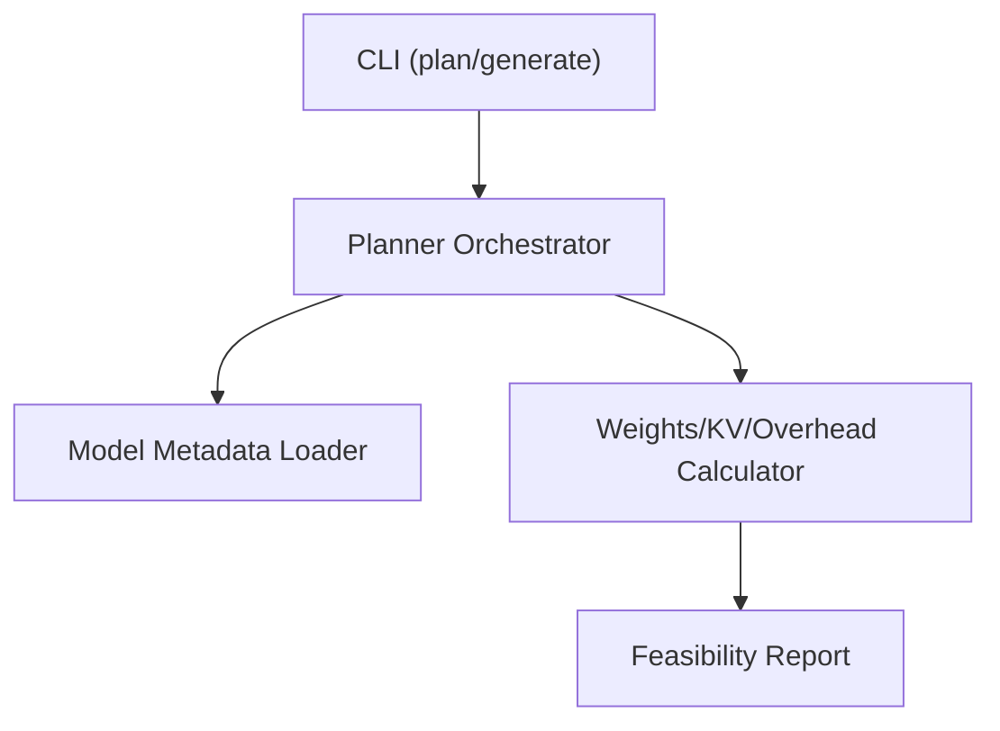
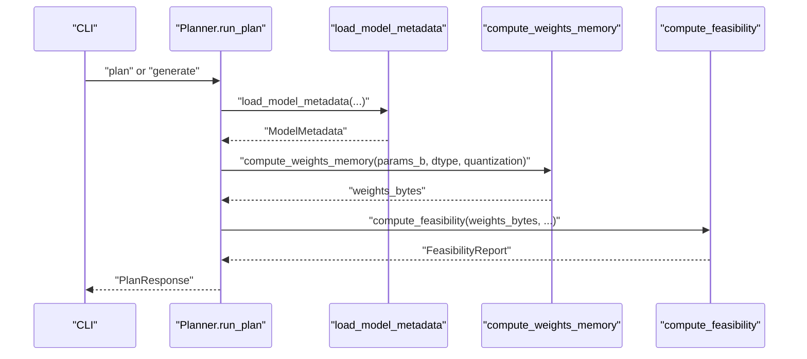
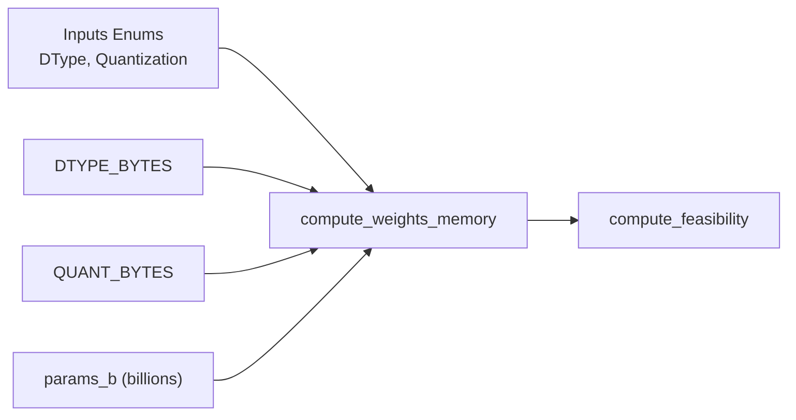

# Weights Memory Calculation

<cite>
**Referenced Files in This Document**
- [memory.py](file://src/vllm_wizard/planning/memory.py)
- [inputs.py](file://src/vllm_wizard/schemas/inputs.py)
- [outputs.py](file://src/vllm_wizard/schemas/outputs.py)
- [planner.py](file://src/vllm_wizard/planning/planner.py)
- [metadata.py](file://src/vllm_wizard/models/metadata.py)
- [test_memory.py](file://tests/test_memory.py)
- [README.md](file://README.md)
</cite>

## Table of Contents
1. [Introduction](#introduction)
2. [Project Structure](#project-structure)
3. [Core Components](#core-components)
4. [Architecture Overview](#architecture-overview)
5. [Detailed Component Analysis](#detailed-component-analysis)
6. [Dependency Analysis](#dependency-analysis)
7. [Performance Considerations](#performance-considerations)
8. [Troubleshooting Guide](#troubleshooting-guide)
9. [Conclusion](#conclusion)
10. [Appendices](#appendices)

## Introduction
This document explains the weights memory calculation component used to estimate GPU memory requirements for model weights. It covers:
- Mathematical formulas for computing weights memory from parameter counts and data types
- DTYPE_BYTES mapping for fp32, fp16, bf16, int8, and fp8
- QUANT_BYTES mapping for quantization methods (AWQ, GPTQ, INT8) and their overhead assumptions
- Step-by-step calculation examples for 7B, 13B, and 70B parameter models
- AUTO dtype selection logic and default fallback behaviors
- Edge cases and validation requirements for parameter inputs

## Project Structure
The weights memory calculation is implemented in the planning module and integrates with model metadata and CLI inputs.

**Diagram sources**
- [planner.py](file://src/vllm_wizard/planning/planner.py#L21-L136)
- [memory.py](file://src/vllm_wizard/planning/memory.py#L31-L56)
- [metadata.py](file://src/vllm_wizard/models/metadata.py#L209-L254)

**Section sources**
- [planner.py](file://src/vllm_wizard/planning/planner.py#L21-L136)
- [memory.py](file://src/vllm_wizard/planning/memory.py#L1-L367)
- [metadata.py](file://src/vllm_wizard/models/metadata.py#L1-L255)

## Core Components
- compute_weights_memory(params_b, dtype, quantization): Computes model weights memory in bytes using parameter count and dtype/quantization mapping.
- DTYPE_BYTES: Maps weight dtypes to bytes-per-parameter.
- QUANT_BYTES: Maps quantization methods to bytes-per-parameter (including overhead).
- AUTO dtype selection: Defaults to bf16 when dtype is AUTO.

Key behaviors:
- Parameter count is converted from billions to integer count.
- Quantization overrides dtype mapping when set to a non-NONE value.
- AUTO dtype falls back to bf16.

**Section sources**
- [memory.py](file://src/vllm_wizard/planning/memory.py#L31-L56)
- [inputs.py](file://src/vllm_wizard/schemas/inputs.py#L9-L26)

## Architecture Overview
The memory calculation is part of the planning pipeline that orchestrates model metadata loading, hardware resolution, and feasibility analysis.

**Diagram sources**
- [planner.py](file://src/vllm_wizard/planning/planner.py#L21-L136)
- [memory.py](file://src/vllm_wizard/planning/memory.py#L31-L56)
- [metadata.py](file://src/vllm_wizard/models/metadata.py#L209-L254)

## Detailed Component Analysis

### Weights Memory Formula and Mapping
- Formula: weights_bytes = parameters × bytes_per_param
- bytes_per_param determined by:
  - If quantization != NONE: use QUANT_BYTES[quantization.value]
  - Else: use DTYPE_BYTES[dtype.value] with dtype AUTO defaulting to bf16

DTYPE_BYTES mapping:
- fp32: 4 bytes/param
- fp16: 2 bytes/param
- bf16: 2 bytes/param
- int8: 1 byte/param
- fp8: 1 byte/param

QUANT_BYTES mapping:
- none: 2.0 (defaults to fp16)
- awq: 0.55 (4-bit with ~10% overhead)
- gptq: 0.55 (4-bit with ~10% overhead)
- int8: 1.0
- fp8: 1.0

AUTO dtype selection:
- When dtype is AUTO, defaults to bf16 for bytes-per-parameter mapping.

Validation and edge cases:
- params_b is treated as billions; converted to integer parameter count.
- If quantization is NONE, dtype mapping is used; otherwise quantization mapping is used.
- If dtype is AUTO and kv_dtype is AUTO, kv cache defaults to bf16.

**Section sources**
- [memory.py](file://src/vllm_wizard/planning/memory.py#L9-L25)
- [memory.py](file://src/vllm_wizard/planning/memory.py#L31-L56)
- [inputs.py](file://src/vllm_wizard/schemas/inputs.py#L9-L26)

### Step-by-Step Calculation Examples

#### Example 1: 7B Parameters (fp16)
- params = 7.0 × 1e9
- dtype = fp16 → bytes_per_param = 2.0
- weights_bytes = 7.0 × 1e9 × 2.0

Result: weights_bytes = 14 × 1e9 bytes

**Section sources**
- [test_memory.py](file://tests/test_memory.py#L22-L38)

#### Example 2: 13B Parameters (bf16)
- params = 13.0 × 1e9
- dtype = bf16 → bytes_per_param = 2.0
- weights_bytes = 13.0 × 1e9 × 2.0

Result: weights_bytes = 26 × 1e9 bytes

**Section sources**
- [test_memory.py](file://tests/test_memory.py#L28-L32)

#### Example 3: 70B Parameters (fp32)
- params = 70.0 × 1e9
- dtype = fp32 → bytes_per_param = 4.0
- weights_bytes = 70.0 × 1e9 × 4.0

Result: weights_bytes = 280 × 1e9 bytes

**Section sources**
- [test_memory.py](file://tests/test_memory.py#L34-L38)

#### Example 4: 7B Parameters with AWQ (4-bit)
- params = 7.0 × 1e9
- quantization = awq → bytes_per_param = 0.55
- weights_bytes = 7.0 × 1e9 × 0.55

Result: weights_bytes ≈ 3.85 × 1e9 bytes

**Section sources**
- [test_memory.py](file://tests/test_memory.py#L40-L49)

#### Example 5: 7B Parameters with GPTQ (4-bit)
- params = 7.0 × 1e9
- quantization = gptq → bytes_per_param = 0.55
- weights_bytes = 7.0 × 1e9 × 0.55

Result: weights_bytes ≈ 3.85 × 1e9 bytes

**Section sources**
- [test_memory.py](file://tests/test_memory.py#L46-L49)

#### Example 6: 7B Parameters with INT8 Quantization
- params = 7.0 × 1e9
- quantization = int8 → bytes_per_param = 1.0
- weights_bytes = 7.0 × 1e9 × 1.0

Result: weights_bytes = 7 × 1e9 bytes

**Section sources**
- [test_memory.py](file://tests/test_memory.py#L51-L55)

### AUTO Dtype Selection and KV Cache Behavior
- AUTO dtype defaults to bf16 for weights when dtype is AUTO.
- KV cache dtype AUTO defaults to the model dtype; if kv_dtype is AUTO and dtype is AUTO, defaults to bf16.
- KV cache dtype mapping:
  - fp8 variants: 1 byte/element
  - fp16/bf16: 2 bytes/element
  - fp32: 4 bytes/element
  - Other cases default to 2 bytes/element

**Section sources**
- [memory.py](file://src/vllm_wizard/planning/memory.py#L53-L54)
- [memory.py](file://src/vllm_wizard/planning/memory.py#L93-L107)

### Integration in Planning Pipeline
- The planner loads model metadata and computes weights memory using compute_weights_memory.
- Weights memory is split across tensor-parallel GPUs when applicable.
- KV cache and overhead are computed separately and combined for feasibility analysis.

**Section sources**
- [planner.py](file://src/vllm_wizard/planning/planner.py#L54-L97)

## Dependency Analysis
The weights memory calculation depends on:
- DTYPE_BYTES and QUANT_BYTES constants
- Input enums (DType, Quantization)
- Model parameter count (from metadata or CLI override)

**Diagram sources**
- [memory.py](file://src/vllm_wizard/planning/memory.py#L9-L25)
- [memory.py](file://src/vllm_wizard/planning/memory.py#L31-L56)
- [inputs.py](file://src/vllm_wizard/schemas/inputs.py#L9-L26)

**Section sources**
- [memory.py](file://src/vllm_wizard/planning/memory.py#L9-L25)
- [inputs.py](file://src/vllm_wizard/schemas/inputs.py#L9-L26)

## Performance Considerations
- Quantization significantly reduces memory footprint:
  - AWQ/GPTQ: ~0.55 bytes/param (4-bit with overhead)
  - INT8: 1 byte/param
  - FP16/BF16: 2 bytes/param
  - FP32: 4 bytes/param
- AUTO dtype defaults to bf16, balancing memory and numerical stability.
- KV cache dominates memory for long contexts and high concurrency; consider FP8 KV cache or reduced context.

[No sources needed since this section provides general guidance]

## Troubleshooting Guide
Common issues and validations:
- Parameter count validation:
  - params_b must be positive; ensure it is provided or derivable from metadata.
  - If unknown, rely on known model size lookup or provide --params-b.
- Dtype/Quantization conflicts:
  - If quantization is set to a non-NONE value, quantization mapping takes precedence.
  - AUTO dtype falls back to bf16 when unspecified.
- KV cache dtype:
  - AUTO kv_dtype defaults to bf16; ensure kv_dtype is compatible with hardware and desired precision.
- Fragmentation and overhead:
  - KV cache fragmentation factor increases estimated memory; tune fragmentation_factor accordingly.
  - Overhead includes base overhead and multi-GPU communication buffers.

**Section sources**
- [metadata.py](file://src/vllm_wizard/models/metadata.py#L191-L206)
- [metadata.py](file://src/vllm_wizard/models/metadata.py#L209-L254)
- [memory.py](file://src/vllm_wizard/planning/memory.py#L124-L152)

## Conclusion
The weights memory calculation component provides a straightforward, configurable method to estimate GPU memory usage for model weights. By combining parameter counts with dtype/quantization mappings, it enables quick feasibility assessments and supports AUTO selection for practical defaults. Quantization offers substantial memory savings with minimal validation overhead, while KV cache remains a dominant factor for long contexts and concurrency.

[No sources needed since this section summarizes without analyzing specific files]

## Appendices

### Mathematical Formulas
- Weights memory: weights_bytes = parameters × bytes_per_param
- bytes_per_param:
  - If quantization != NONE: QUANT_BYTES[quantization]
  - Else: DTYPE_BYTES[dtype] with dtype AUTO defaulting to bf16

**Section sources**
- [memory.py](file://src/vllm_wizard/planning/memory.py#L31-L56)
- [memory.py](file://src/vllm_wizard/planning/memory.py#L9-L25)

### DTYPE_BYTES and QUANT_BYTES Reference
- DTYPE_BYTES:
  - fp32: 4.0
  - fp16: 2.0
  - bf16: 2.0
  - int8: 1.0
  - fp8: 1.0
- QUANT_BYTES:
  - none: 2.0
  - awq: 0.55
  - gptq: 0.55
  - int8: 1.0
  - fp8: 1.0

**Section sources**
- [memory.py](file://src/vllm_wizard/planning/memory.py#L9-L25)

### AUTO Selection Logic
- DType.AUTO → bf16 for bytes-per-parameter mapping
- KVCacheDType.AUTO → kv_dtype defaults to model dtype; AUTO with AUTO → bf16

**Section sources**
- [memory.py](file://src/vllm_wizard/planning/memory.py#L53-L54)
- [memory.py](file://src/vllm_wizard/planning/memory.py#L93-L107)

### Validation Requirements
- params_b must be positive; if not provided, metadata must include a parameter count or a known model size lookup must match the model ID.
- Quantization must be one of the supported enums; unsupported values fall back to defaults.

**Section sources**
- [metadata.py](file://src/vllm_wizard/models/metadata.py#L191-L206)
- [metadata.py](file://src/vllm_wizard/models/metadata.py#L209-L254)
- [inputs.py](file://src/vllm_wizard/schemas/inputs.py#L18-L25)