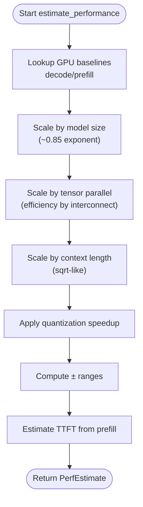

# Performance Estimation

<cite>
**Referenced Files in This Document**
- [README.md](file://README.md)
- [perf.py](file://src/vllm_wizard/planning/perf.py)
- [metadata.py](file://src/vllm_wizard/models/metadata.py)
- [inputs.py](file://src/vllm_wizard/schemas/inputs.py)
- [outputs.py](file://src/vllm_wizard/schemas/outputs.py)
- [profile.py](file://src/vllm_wizard/schemas/profile.py)
- [planner.py](file://src/vllm_wizard/planning/planner.py)
- [report.py](file://src/vllm_wizard/render/report.py)
- [cli.py](file://src/vllm_wizard/cli.py)
- [sample.yaml](file://examples/profiles/sample.yaml)
</cite>

## Table of Contents
1. [Introduction](#introduction)
2. [Project Structure](#project-structure)
3. [Core Components](#core-components)
4. [Architecture Overview](#architecture-overview)
5. [Detailed Component Analysis](#detailed-component-analysis)
6. [Dependency Analysis](#dependency-analysis)
7. [Performance Considerations](#performance-considerations)
8. [Troubleshooting Guide](#troubleshooting-guide)
9. [Conclusion](#conclusion)
10. [Appendices](#appendices)

## Introduction
This document explains the heuristic-based performance estimation used by the vLLM Wizard. It covers how throughput and latency are modeled using GPU baseline tables, scaling factors for model size, tensor parallelism, context length, and quantization. It also documents batching mode effects, workload characteristics, interpretation of estimates, and practical guidance for validating estimates with controlled benchmarks.

## Project Structure
The performance estimation pipeline is part of the planning module and integrates with model metadata, hardware detection, and rendering of results.

**Diagram sources**
- [cli.py](file://src/vllm_wizard/cli.py#L82-L213)
- [planner.py](file://src/vllm_wizard/planning/planner.py#L21-L135)
- [perf.py](file://src/vllm_wizard/planning/perf.py#L136-L219)
- [report.py](file://src/vllm_wizard/render/report.py#L14-L44)

**Section sources**
- [cli.py](file://src/vllm_wizard/cli.py#L82-L213)
- [planner.py](file://src/vllm_wizard/planning/planner.py#L21-L135)
- [report.py](file://src/vllm_wizard/render/report.py#L14-L44)

## Core Components
- Performance estimator: Implements heuristic scaling for decode and prefill throughput, TTFT, and quantization speedups.
- Model metadata: Provides model parameter counts and architecture for memory and performance scaling.
- Schemas: Define inputs, outputs, and performance estimate structures.
- Planner: Orchestrates performance estimation alongside memory feasibility and recommendation generation.
- CLI and report: Present performance estimates and assumptions to users.

**Section sources**
- [perf.py](file://src/vllm_wizard/planning/perf.py#L136-L219)
- [metadata.py](file://src/vllm_wizard/models/metadata.py#L191-L254)
- [inputs.py](file://src/vllm_wizard/schemas/inputs.py#L46-L109)
- [outputs.py](file://src/vllm_wizard/schemas/outputs.py#L77-L91)
- [planner.py](file://src/vllm_wizard/planning/planner.py#L107-L117)
- [report.py](file://src/vllm_wizard/render/report.py#L179-L204)

## Architecture Overview
The performance estimation is invoked during planning and embedded in the final report.

**Diagram sources**
- [cli.py](file://src/vllm_wizard/cli.py#L155-L202)
- [planner.py](file://src/vllm_wizard/planning/planner.py#L107-L117)
- [perf.py](file://src/vllm_wizard/planning/perf.py#L136-L219)
- [report.py](file://src/vllm_wizard/render/report.py#L179-L204)

## Detailed Component Analysis

### Heuristic Methodology
The performance estimator computes approximate decode throughput, prefill throughput, and TTFT using:
- GPU baseline tables for decode and prefill tokens per second
- Scaling by model size (inverse scaling with exponent ~0.85)
- Scaling by tensor parallel size with interconnect efficiency
- Scaling by context length (mild degradation with sqrt-like scaling)
- Quantization speedup factors
- Confidence ranges around estimates

**Diagram sources**
- [perf.py](file://src/vllm_wizard/planning/perf.py#L136-L219)

**Section sources**
- [perf.py](file://src/vllm_wizard/planning/perf.py#L8-L53)
- [perf.py](file://src/vllm_wizard/planning/perf.py#L56-L67)
- [perf.py](file://src/vllm_wizard/planning/perf.py#L70-L80)
- [perf.py](file://src/vllm_wizard/planning/perf.py#L83-L104)
- [perf.py](file://src/vllm_wizard/planning/perf.py#L107-L117)
- [perf.py](file://src/vllm_wizard/planning/perf.py#L120-L133)
- [perf.py](file://src/vllm_wizard/planning/perf.py#L182-L193)

### GPU Baseline Performance Tables
- Decode tokens per second by GPU class
- Prefill tokens per second by GPU class
- Defaults for unknown GPUs
- Baselines are used as starting points and scaled by model size, TP, context length, and quantization

**Section sources**
- [perf.py](file://src/vllm_wizard/planning/perf.py#L8-L53)

### Scaling Factors
- Model size scaling: inverse scaling with exponent ~0.85
- Tensor parallel scaling: linear with interconnect efficiency (NVLink better than PCIe)
- Context length scaling: mild degradation with sqrt-like scaling
- Quantization speedup factors: applied to both decode and prefill

**Section sources**
- [perf.py](file://src/vllm_wizard/planning/perf.py#L70-L80)
- [perf.py](file://src/vllm_wizard/planning/perf.py#L83-L104)
- [perf.py](file://src/vllm_wizard/planning/perf.py#L107-L117)
- [perf.py](file://src/vllm_wizard/planning/perf.py#L120-L133)

### Batching Mode Effects
- Batching mode influences how requests are grouped and processed
- The workload schema defines throughput, latency, and balanced modes
- Performance estimates here are heuristic and do not replace benchmarking under realistic batch mixes

**Section sources**
- [inputs.py](file://src/vllm_wizard/schemas/inputs.py#L46-L51)
- [profile.py](file://src/vllm_wizard/schemas/profile.py#L38-L46)

### Workload Characteristics
- Typical prompt tokens and generation tokens
- Concurrency and streaming behavior
- These inputs directly affect TTFT and throughput ranges

**Section sources**
- [inputs.py](file://src/vllm_wizard/schemas/inputs.py#L78-L86)
- [profile.py](file://src/vllm_wizard/schemas/profile.py#L38-L46)

### Performance Estimate Output
- Decode throughput range (tokens/s)
- Prefill throughput range (tokens/s)
- TTFT range (ms)
- Assumptions list explaining methodology and caveats

**Section sources**
- [outputs.py](file://src/vllm_wizard/schemas/outputs.py#L77-L91)
- [report.py](file://src/vllm_wizard/render/report.py#L179-L204)

### Integration in Planning Pipeline
- Planner loads model metadata, detects hardware, computes memory feasibility, recommends configuration, and estimates performance
- Performance estimation uses GPU name, model params, TP size, context length, prompt tokens, quantization, interconnect, and number of GPUs

**Section sources**
- [planner.py](file://src/vllm_wizard/planning/planner.py#L30-L36)
- [planner.py](file://src/vllm_wizard/planning/planner.py#L107-L117)

### Interpretation and Validation Guidance
- Estimates are heuristic; actual performance depends on vLLM version, CUDA/driver versions, kernel selection, batch sizes, and workload patterns
- Always benchmark your specific workload before production deployment
- Use the CLI to generate artifacts and run controlled tests

**Section sources**
- [README.md](file://README.md#L177-L190)
- [README.md](file://README.md#L298-L307)
- [perf.py](file://src/vllm_wizard/planning/perf.py#L196-L212)

## Dependency Analysis
The performance estimation depends on:
- GPU baseline tables and defaults
- Quantization enum values
- Interconnect enum values
- Inputs for model size, TP, context length, prompt tokens, and quantization
- Output schema for PerfEstimate

**Diagram sources**
- [perf.py](file://src/vllm_wizard/planning/perf.py#L5-L6)
- [inputs.py](file://src/vllm_wizard/schemas/inputs.py#L18-L43)
- [outputs.py](file://src/vllm_wizard/schemas/outputs.py#L77-L91)
- [planner.py](file://src/vllm_wizard/planning/planner.py#L14-L18)
- [cli.py](file://src/vllm_wizard/cli.py#L13-L21)
- [report.py](file://src/vllm_wizard/render/report.py#L11-L11)

**Section sources**
- [perf.py](file://src/vllm_wizard/planning/perf.py#L5-L6)
- [inputs.py](file://src/vllm_wizard/schemas/inputs.py#L18-L43)
- [outputs.py](file://src/vllm_wizard/schemas/outputs.py#L77-L91)
- [planner.py](file://src/vllm_wizard/planning/planner.py#L14-L18)
- [cli.py](file://src/vllm_wizard/cli.py#L13-L21)
- [report.py](file://src/vllm_wizard/render/report.py#L11-L11)

## Performance Considerations
- Heuristic nature: Estimates are not benchmarks and should be validated empirically.
- GPU class differences: Baselines vary widely by GPU class; use the closest match for meaningful comparisons.
- Model size scaling: Larger models scale down in throughput due to inverse scaling with exponent ~0.85.
- Tensor parallelism: Improves throughput but incurs communication overhead; NVLink yields better efficiency than PCIe.
- Context length: Longer contexts degrade decode throughput with sqrt-like scaling.
- Quantization: Provides modest speedups; apply to both decode and prefill.
- Batching mode: Affects request grouping and latency/throughput trade-offs; validate with representative workloads.

[No sources needed since this section provides general guidance]

## Troubleshooting Guide
- If estimates seem unrealistic, verify:
  - GPU name matches a known baseline entry
  - Model parameters are reasonable (or rely on automatic detection)
  - Interconnect setting reflects actual hardware
  - Prompt tokens and context length reflect typical usage
- Use the profile format to capture and iterate on configurations
- Generate artifacts and run controlled tests to calibrate expectations

**Section sources**
- [perf.py](file://src/vllm_wizard/planning/perf.py#L56-L67)
- [metadata.py](file://src/vllm_wizard/models/metadata.py#L191-L206)
- [profile.py](file://src/vllm_wizard/schemas/profile.py#L16-L74)
- [sample.yaml](file://examples/profiles/sample.yaml#L1-L40)

## Conclusion
The vLLM Wizard’s performance estimation is a heuristic model designed to provide quick, approximate throughput and latency insights. It relies on GPU baseline tables, scaling factors for model size, tensor parallelism, context length, and quantization. While useful for initial sizing and comparison across configurations, it should be complemented by controlled benchmarks on your hardware and workload.

[No sources needed since this section summarizes without analyzing specific files]

## Appendices

### Example Comparisons and Scenarios
- Single GPU vs. multi-GPU with tensor parallelism
- Different quantization methods
- Varying context lengths and prompt sizes
- Throughput vs. latency vs. balanced batching modes

To explore these scenarios:
- Use the CLI to plan configurations with different options
- Save configurations to YAML profiles and regenerate artifacts
- Run controlled benchmarks and compare results to estimates

**Section sources**
- [README.md](file://README.md#L241-L276)
- [cli.py](file://src/vllm_wizard/cli.py#L82-L213)
- [sample.yaml](file://examples/profiles/sample.yaml#L1-L40)

### How to Interpret Performance Estimates
- Decode throughput: tokens per second range for token generation
- Prefill throughput: tokens per second range for prompt processing
- TTFT: time to first token range in milliseconds
- Assumptions: explain baseline selection, scaling, and caveats

**Section sources**
- [report.py](file://src/vllm_wizard/render/report.py#L179-L204)
- [outputs.py](file://src/vllm_wizard/schemas/outputs.py#L77-L91)
- [perf.py](file://src/vllm_wizard/planning/perf.py#L196-L212)

### When to Conduct Benchmarks
- Always benchmark your specific model, hardware, and workload before production
- Start with conservative settings and adjust based on empirical results
- Compare estimates to measured throughput/latency under realistic batch mixes

**Section sources**
- [README.md](file://README.md#L177-L190)
- [README.md](file://README.md#L298-L307)

### Factors Affecting Real-World Performance Beyond Predictions
- vLLM version and kernel selection
- CUDA/driver versions
- Batch sizes and request patterns
- Prompt/generation ratio
- Memory pressure and fragmentation
- Network and storage bottlenecks (when applicable)

**Section sources**
- [README.md](file://README.md#L184-L189)
- [perf.py](file://src/vllm_wizard/planning/perf.py#L196-L212)

### Guidance on Validating Estimates
- Generate serve commands and docker-compose files from profiles
- Run short, controlled experiments with representative prompts and concurrency
- Record observed throughput/latency and compare to estimates
- Iterate on configuration and re-validate

**Section sources**
- [cli.py](file://src/vllm_wizard/cli.py#L273-L381)
- [report.py](file://src/vllm_wizard/render/report.py#L207-L212)