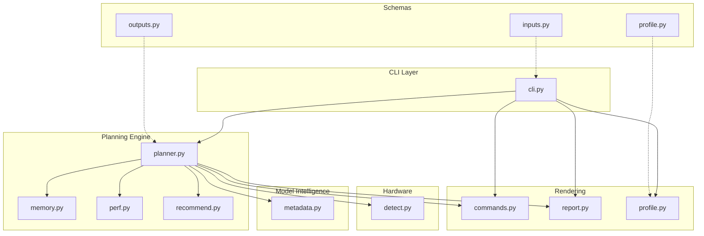
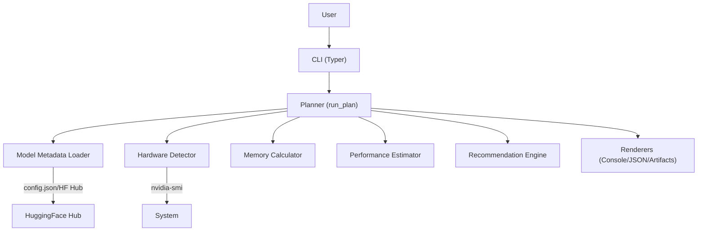
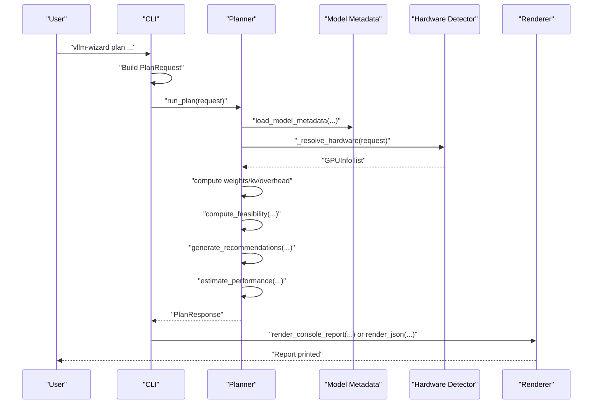
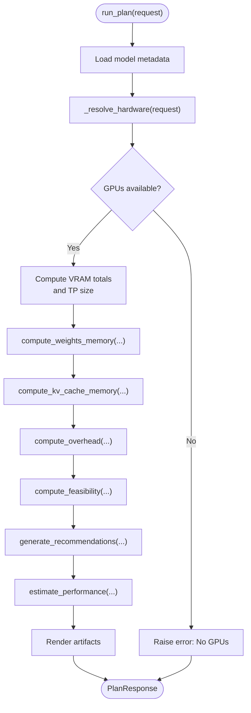
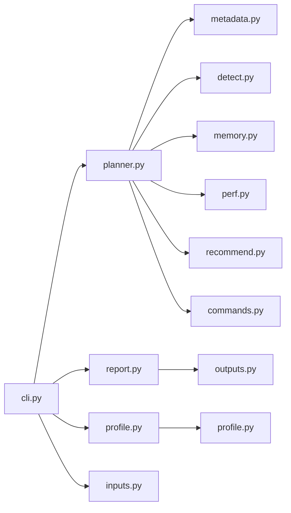
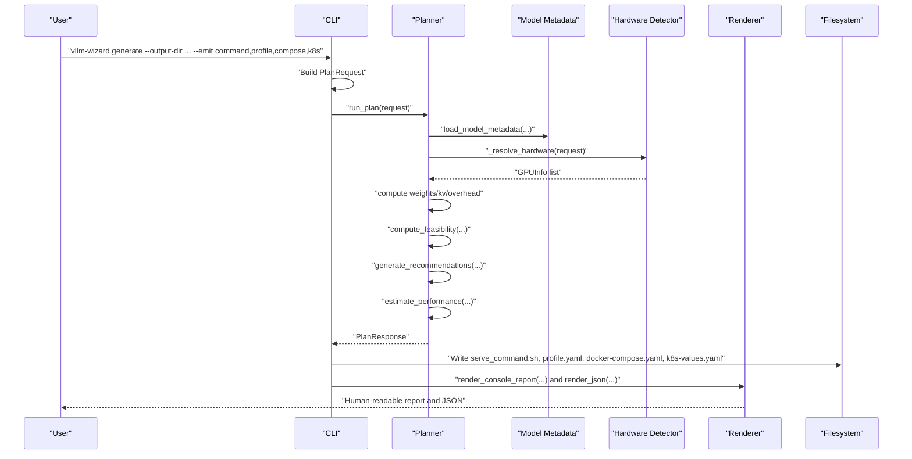

# Architecture and Design

<cite>
**Referenced Files in This Document**
- [README.md](file://README.md)
- [pyproject.toml](file://pyproject.toml)
- [requirements.txt](file://requirements.txt)
- [cli.py](file://src/vllm_wizard/cli.py)
- [planner.py](file://src/vllm_wizard/planning/planner.py)
- [detect.py](file://src/vllm_wizard/hardware/detect.py)
- [metadata.py](file://src/vllm_wizard/models/metadata.py)
- [memory.py](file://src/vllm_wizard/planning/memory.py)
- [perf.py](file://src/vllm_wizard/planning/perf.py)
- [recommend.py](file://src/vllm_wizard/planning/recommend.py)
- [commands.py](file://src/vllm_wizard/render/commands.py)
- [report.py](file://src/vllm_wizard/render/report.py)
- [profile.py](file://src/vllm_wizard/render/profile.py)
- [inputs.py](file://src/vllm_wizard/schemas/inputs.py)
- [outputs.py](file://src/vllm_wizard/schemas/outputs.py)
- [profile_schema.py](file://src/vllm_wizard/schemas/profile.py)
</cite>

## Table of Contents
1. [Introduction](#introduction)
2. [Project Structure](#project-structure)
3. [Core Components](#core-components)
4. [Architecture Overview](#architecture-overview)
5. [Detailed Component Analysis](#detailed-component-analysis)
6. [Dependency Analysis](#dependency-analysis)
7. [Performance Considerations](#performance-considerations)
8. [Troubleshooting Guide](#troubleshooting-guide)
9. [Conclusion](#conclusion)
10. [Appendices](#appendices)

## Introduction
This document describes the architecture and design of the vLLM Config Wizard. It explains the layered architecture with a CLI layer, planning engine, hardware detection, model intelligence, and rendering components. It documents the data flow from CLI input through planning to artifact generation, and outlines the separation of concerns among memory calculation, performance estimation, and artifact generation. It also covers system boundaries, external dependencies (nvidia-smi, HuggingFace Hub), technology stack choices, and design decisions for extensibility, testing, and maintainability.

## Project Structure
The project is organized into a clear module layout:
- CLI layer: user-facing commands and argument parsing
- Planning engine: orchestration of model metadata, hardware, memory, performance, and recommendations
- Hardware detection: GPU discovery and metadata extraction
- Model intelligence: model metadata extraction and parameter estimation
- Rendering: console reports, JSON, and artifact generation (serve command, docker-compose, Kubernetes)
- Schemas: strongly typed input/output models and profile schema

**Diagram sources**
- [cli.py](file://src/vllm_wizard/cli.py#L1-L385)
- [planner.py](file://src/vllm_wizard/planning/planner.py#L1-L172)
- [detect.py](file://src/vllm_wizard/hardware/detect.py#L1-L229)
- [metadata.py](file://src/vllm_wizard/models/metadata.py#L1-L255)
- [memory.py](file://src/vllm_wizard/planning/memory.py#L1-L367)
- [perf.py](file://src/vllm_wizard/planning/perf.py#L1-L220)
- [recommend.py](file://src/vllm_wizard/planning/recommend.py#L1-L333)
- [commands.py](file://src/vllm_wizard/render/commands.py#L1-L196)
- [report.py](file://src/vllm_wizard/render/report.py#L1-L272)
- [profile.py](file://src/vllm_wizard/render/profile.py#L1-L173)
- [inputs.py](file://src/vllm_wizard/schemas/inputs.py#L1-L110)
- [outputs.py](file://src/vllm_wizard/schemas/outputs.py#L1-L118)
- [profile_schema.py](file://src/vllm_wizard/schemas/profile.py#L1-L75)

**Section sources**
- [README.md](file://README.md#L1-L308)
- [pyproject.toml](file://pyproject.toml#L1-L71)

## Core Components
- CLI layer: defines commands (detect, plan, generate), parses arguments, orchestrates planning and rendering, and handles errors and output formats.
- Planning engine: loads model metadata, resolves hardware, computes memory feasibility, generates recommendations, estimates performance, and renders artifacts.
- Hardware detection: queries nvidia-smi for GPU inventory and metadata; falls back to known GPU VRAM lookups.
- Model intelligence: extracts model config from local path or HuggingFace Hub, normalizes architecture fields, and estimates parameters.
- Rendering: produces human-readable console reports, JSON output, and filesystem artifacts (serve command, docker-compose, Kubernetes values).
- Schemas: define input request, output response, artifacts, and profile structures with strict validation.

**Section sources**
- [cli.py](file://src/vllm_wizard/cli.py#L62-L381)
- [planner.py](file://src/vllm_wizard/planning/planner.py#L21-L136)
- [detect.py](file://src/vllm_wizard/hardware/detect.py#L10-L72)
- [metadata.py](file://src/vllm_wizard/models/metadata.py#L209-L255)
- [commands.py](file://src/vllm_wizard/render/commands.py#L6-L196)
- [report.py](file://src/vllm_wizard/render/report.py#L14-L272)
- [inputs.py](file://src/vllm_wizard/schemas/inputs.py#L54-L110)
- [outputs.py](file://src/vllm_wizard/schemas/outputs.py#L37-L118)
- [profile_schema.py](file://src/vllm_wizard/schemas/profile.py#L16-L75)

## Architecture Overview
The system follows a layered architecture:
- Presentation layer: CLI commands and console rendering
- Application layer: planning orchestration and artifact generation
- Domain services: hardware detection and model metadata extraction
- Infrastructure: external integrations (nvidia-smi, HuggingFace Hub)

**Diagram sources**
- [cli.py](file://src/vllm_wizard/cli.py#L62-L381)
- [planner.py](file://src/vllm_wizard/planning/planner.py#L21-L136)
- [detect.py](file://src/vllm_wizard/hardware/detect.py#L10-L72)
- [metadata.py](file://src/vllm_wizard/models/metadata.py#L86-L100)
- [memory.py](file://src/vllm_wizard/planning/memory.py#L31-L122)
- [perf.py](file://src/vllm_wizard/planning/perf.py#L136-L220)
- [recommend.py](file://src/vllm_wizard/planning/recommend.py#L167-L333)
- [report.py](file://src/vllm_wizard/render/report.py#L14-L272)
- [commands.py](file://src/vllm_wizard/render/commands.py#L6-L196)

## Detailed Component Analysis

### CLI Layer
Responsibilities:
- Define commands: detect, plan, generate
- Parse arguments into typed models
- Orchestrate planning and rendering
- Output formats: console, JSON, filesystem artifacts
- Error handling and user guidance

Key flows:
- plan: builds PlanRequest, runs run_plan, renders console or JSON
- generate: builds PlanRequest, runs run_plan, writes artifacts to disk
- detect: queries hardware and prints GPU list or JSON

**Diagram sources**
- [cli.py](file://src/vllm_wizard/cli.py#L82-L213)
- [planner.py](file://src/vllm_wizard/planning/planner.py#L21-L136)
- [metadata.py](file://src/vllm_wizard/models/metadata.py#L209-L255)
- [detect.py](file://src/vllm_wizard/hardware/detect.py#L138-L172)
- [memory.py](file://src/vllm_wizard/planning/memory.py#L155-L271)
- [recommend.py](file://src/vllm_wizard/planning/recommend.py#L167-L333)
- [perf.py](file://src/vllm_wizard/planning/perf.py#L136-L220)
- [report.py](file://src/vllm_wizard/render/report.py#L14-L44)

**Section sources**
- [cli.py](file://src/vllm_wizard/cli.py#L62-L381)
- [report.py](file://src/vllm_wizard/render/report.py#L14-L272)

### Planning Engine
Responsibilities:
- Orchestrate the planning pipeline
- Resolve hardware (auto-detect or user-specified)
- Compute memory feasibility and headroom
- Generate recommendations for vLLM configuration
- Estimate performance metrics
- Render artifacts

Processing logic highlights:
- Hardware resolution: auto-detect via nvidia-smi, fallback to known VRAM, or manual specification
- Memory breakdown: weights, KV cache, overhead; feasibility with configurable utilization and headroom
- Recommendations: TP size, dtype, KV cache dtype, quantization, max model length, batching parameters
- Performance: decode/prefill throughput ranges and TTFT estimates with assumptions

**Diagram sources**
- [planner.py](file://src/vllm_wizard/planning/planner.py#L21-L136)
- [memory.py](file://src/vllm_wizard/planning/memory.py#L31-L122)
- [memory.py](file://src/vllm_wizard/planning/memory.py#L155-L271)
- [recommend.py](file://src/vllm_wizard/planning/recommend.py#L167-L333)
- [perf.py](file://src/vllm_wizard/planning/perf.py#L136-L220)
- [commands.py](file://src/vllm_wizard/render/commands.py#L6-L46)

**Section sources**
- [planner.py](file://src/vllm_wizard/planning/planner.py#L21-L172)

### Hardware Detection
Responsibilities:
- Detect GPUs via nvidia-smi (name, VRAM, driver, CUDA, compute capability)
- Recommend tensor-parallel size based on detected GPUs
- Provide fallback GPU VRAM for common GPU names

Integration pattern:
- Subprocess invocation of nvidia-smi with CSV output parsing
- Graceful failure handling when nvidia-smi is unavailable or times out

**Section sources**
- [detect.py](file://src/vllm_wizard/hardware/detect.py#L10-L72)
- [detect.py](file://src/vllm_wizard/hardware/detect.py#L138-L159)
- [detect.py](file://src/vllm_wizard/hardware/detect.py#L162-L229)

### Model Intelligence
Responsibilities:
- Load model config from local path or HuggingFace Hub
- Normalize architecture fields across model families
- Estimate total parameters when not provided
- Provide metadata for memory and performance computations

Key behaviors:
- Local path: read config.json from filesystem
- Remote: download config.json via HuggingFace Hub client
- Fallbacks: known model size lookup table, estimation from config

**Section sources**
- [metadata.py](file://src/vllm_wizard/models/metadata.py#L77-L100)
- [metadata.py](file://src/vllm_wizard/models/metadata.py#L102-L158)
- [metadata.py](file://src/vllm_wizard/models/metadata.py#L191-L207)
- [metadata.py](file://src/vllm_wizard/models/metadata.py#L209-L255)

### Memory Calculation
Responsibilities:
- Compute weights memory based on dtype/quantization
- Compute KV cache memory based on context length, concurrency, and KV dtype
- Compute framework overhead and communication buffers
- Determine feasibility and headroom; classify OOM risk
- Derive maximum concurrency at context and maximum context at concurrency

Complexity and data structures:
- O(1) per computation with constant-time lookups for dtype/quantization bytes
- Feasibility computation aggregates four memory components and thresholds

**Section sources**
- [memory.py](file://src/vllm_wizard/planning/memory.py#L31-L57)
- [memory.py](file://src/vllm_wizard/planning/memory.py#L59-L122)
- [memory.py](file://src/vllm_wizard/planning/memory.py#L124-L153)
- [memory.py](file://src/vllm_wizard/planning/memory.py#L155-L271)
- [memory.py](file://src/vllm_wizard/planning/memory.py#L273-L367)

### Performance Estimation
Responsibilities:
- Provide heuristic throughput/latency ranges
- Scale baselines by model size, tensor parallel efficiency, context length, and quantization
- Estimate TTFT based on prompt tokens and prefill throughput
- Emit assumptions for interpretability

**Section sources**
- [perf.py](file://src/vllm_wizard/planning/perf.py#L8-L54)
- [perf.py](file://src/vllm_wizard/planning/perf.py#L136-L220)

### Recommendation Engine
Responsibilities:
- Select tensor-parallel size respecting hardware and weights fit
- Choose dtype/KV cache dtype/quantization based on feasibility and GPU capabilities
- Recommend max model length, max_num_seqs, and max_num_batched_tokens
- Adjust GPU memory utilization by GPU family

**Section sources**
- [recommend.py](file://src/vllm_wizard/planning/recommend.py#L42-L68)
- [recommend.py](file://src/vllm_wizard/planning/recommend.py#L88-L100)
- [recommend.py](file://src/vllm_wizard/planning/recommend.py#L102-L122)
- [recommend.py](file://src/vllm_wizard/planning/recommend.py#L124-L165)
- [recommend.py](file://src/vllm_wizard/planning/recommend.py#L167-L333)

### Rendering Components
Responsibilities:
- Console report: structured Rich panels, tables, and warnings
- JSON output: pretty-printed PlanResponse
- Artifact generation: serve command, docker-compose, Kubernetes values
- Profile I/O: load/save YAML profiles and convert to/from PlanRequest

**Section sources**
- [report.py](file://src/vllm_wizard/render/report.py#L14-L272)
- [commands.py](file://src/vllm_wizard/render/commands.py#L6-L196)
- [profile.py](file://src/vllm_wizard/render/profile.py#L30-L173)

### Schemas and Profiles
Responsibilities:
- Define typed inputs (ModelInput, HardwareInput, WorkloadInput, PolicyInput) and composite PlanRequest
- Define typed outputs (FeasibilityReport, VLLMConfig, PerfEstimate, Artifacts, PlanResponse)
- Define profile schema for persistence and regeneration

**Section sources**
- [inputs.py](file://src/vllm_wizard/schemas/inputs.py#L54-L110)
- [outputs.py](file://src/vllm_wizard/schemas/outputs.py#L37-L118)
- [profile_schema.py](file://src/vllm_wizard/schemas/profile.py#L16-L75)

## Dependency Analysis
External dependencies:
- nvidia-smi: system-level GPU detection and metadata
- HuggingFace Hub: model config retrieval for remote models
- Rich: console rendering
- Pydantic: data validation and serialization
- Typer: CLI argument parsing
- PyYAML: profile YAML I/O
- pytest/ruff (dev): testing and linting

Internal dependencies:
- CLI depends on planner, hardware detector, renderers, and profile I/O
- Planner depends on model metadata, hardware detector, memory calculator, performance estimator, recommendation engine, and renderers
- Renderers depend on schemas and configuration objects

**Diagram sources**
- [cli.py](file://src/vllm_wizard/cli.py#L12-L22)
- [planner.py](file://src/vllm_wizard/planning/planner.py#L5-L18)
- [detect.py](file://src/vllm_wizard/hardware/detect.py#L7-L7)
- [metadata.py](file://src/vllm_wizard/models/metadata.py#L8-L9)
- [memory.py](file://src/vllm_wizard/planning/memory.py#L6-L7)
- [perf.py](file://src/vllm_wizard/planning/perf.py#L5-L6)
- [recommend.py](file://src/vllm_wizard/planning/recommend.py#L5-L23)
- [commands.py](file://src/vllm_wizard/render/commands.py#L3-L3)
- [report.py](file://src/vllm_wizard/render/report.py#L11-L11)
- [profile.py](file://src/vllm_wizard/render/profile.py#L8-L27)
- [inputs.py](file://src/vllm_wizard/schemas/inputs.py#L6-L6)
- [outputs.py](file://src/vllm_wizard/schemas/outputs.py#L6-L6)
- [profile_schema.py](file://src/vllm_wizard/schemas/profile.py#L5-L13)

**Section sources**
- [pyproject.toml](file://pyproject.toml#L29-L47)
- [requirements.txt](file://requirements.txt#L449-L462)

## Performance Considerations
- Memory calculations operate in constant time with small lookups; negligible overhead
- Performance estimation uses simple heuristics with lookup tables and scaling factors; fast and predictable
- Recommendations avoid expensive searches by using closed-form rules and power-of-two TP sizing
- Rendering is lightweight; JSON output avoids heavy formatting costs
- External calls (nvidia-smi, HF Hub) are bounded and fail gracefully

[No sources needed since this section provides general guidance]

## Troubleshooting Guide
Common issues and resolutions:
- No GPUs detected:
  - Ensure nvidia-smi is installed and accessible
  - Provide --gpu and --vram-gb flags manually
- Model metadata errors:
  - Provide --params-b or use a local model directory with config.json
- Insufficient VRAM:
  - Reduce context length, enable quantization, lower GPU memory utilization, or increase GPUs
- Performance estimates are approximate:
  - Validate with real benchmarks; adjust workload and batching modes accordingly

Operational checks:
- CLI error handling prints actionable messages and exits with non-zero status
- Feasibility warnings highlight OOM risk and KV cache pressure
- JSON output enables scripting and automation

**Section sources**
- [cli.py](file://src/vllm_wizard/cli.py#L204-L212)
- [memory.py](file://src/vllm_wizard/planning/memory.py#L236-L257)
- [README.md](file://README.md#L177-L191)

## Conclusion
The vLLM Config Wizard employs a clean layered architecture with strong separation of concerns. The CLI layer focuses on user interaction, while the planning engine encapsulates domain logic for memory feasibility, performance estimation, and recommendations. Hardware detection and model intelligence are decoupled services integrated via explicit interfaces. Rendering is modular and extensible. The design emphasizes testability, maintainability, and user clarity through rich console reporting and JSON output. External dependencies are minimal and well-contained, enabling portability and reliability.

[No sources needed since this section summarizes without analyzing specific files]

## Appendices

### Data Flow from CLI Input to Artifacts

**Diagram sources**
- [cli.py](file://src/vllm_wizard/cli.py#L215-L381)
- [planner.py](file://src/vllm_wizard/planning/planner.py#L21-L136)
- [commands.py](file://src/vllm_wizard/render/commands.py#L325-L350)
- [report.py](file://src/vllm_wizard/render/report.py#L14-L44)

### Separation of Concerns
- Memory calculation: weights, KV cache, overhead, feasibility
- Performance estimation: heuristics, scaling, ranges, assumptions
- Artifact generation: serve command, docker-compose, Kubernetes values, JSON
- Hardware detection: nvidia-smi integration, fallback VRAM lookup
- Model intelligence: config parsing, parameter estimation, remote fetch
- Rendering: console, JSON, filesystem artifacts, profile I/O

**Section sources**
- [memory.py](file://src/vllm_wizard/planning/memory.py#L31-L271)
- [perf.py](file://src/vllm_wizard/planning/perf.py#L136-L220)
- [commands.py](file://src/vllm_wizard/render/commands.py#L6-L196)
- [detect.py](file://src/vllm_wizard/hardware/detect.py#L10-L72)
- [metadata.py](file://src/vllm_wizard/models/metadata.py#L209-L255)
- [report.py](file://src/vllm_wizard/render/report.py#L14-L272)
- [profile.py](file://src/vllm_wizard/render/profile.py#L30-L173)

### Technology Stack Choices
- Typer for CLI: ergonomic, type-safe, integrates with Pydantic models
- Rich for console: expressive, structured output with minimal effort
- Pydantic for schemas: validation, serialization, and documentation
- PyYAML for profiles: human-readable persistence
- HuggingFace Hub: reliable remote model metadata retrieval
- Optional web stack (FastAPI/Uvicorn/Jinja2) for future UI

**Section sources**
- [pyproject.toml](file://pyproject.toml#L29-L47)
- [requirements.txt](file://requirements.txt#L449-L462)