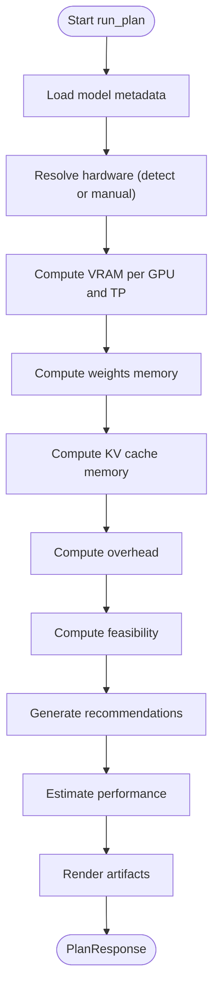

# Configuration Generation

<cite>
**Referenced Files in This Document**
- [cli.py](file://src/vllm_wizard/cli.py)
- [planner.py](file://src/vllm_wizard/planning/planner.py)
- [memory.py](file://src/vllm_wizard/planning/memory.py)
- [recommend.py](file://src/vllm_wizard/planning/recommend.py)
- [commands.py](file://src/vllm_wizard/render/commands.py)
- [profile.py](file://src/vllm_wizard/render/profile.py)
- [report.py](file://src/vllm_wizard/render/report.py)
- [inputs.py](file://src/vllm_wizard/schemas/inputs.py)
- [outputs.py](file://src/vllm_wizard/schemas/outputs.py)
- [profile_schema.py](file://src/vllm_wizard/schemas/profile.py)
- [sample.yaml](file://examples/profiles/sample.yaml)
- [README.md](file://README.md)
</cite>

## Table of Contents
1. [Introduction](#introduction)
2. [Project Structure](#project-structure)
3. [Core Components](#core-components)
4. [Architecture Overview](#architecture-overview)
5. [Detailed Component Analysis](#detailed-component-analysis)
6. [Dependency Analysis](#dependency-analysis)
7. [Performance Considerations](#performance-considerations)
8. [Troubleshooting Guide](#troubleshooting-guide)
9. [Conclusion](#conclusion)
10. [Appendices](#appendices)

## Introduction
This document explains the configuration generation system that produces vLLM serve commands and deployment artifacts. It covers the template-based approach for generating Docker configurations, Kubernetes manifests, and YAML profiles; the command generation logic for single GPU, multi-GPU, and tensor parallel deployments; parameter mapping from planning results to vLLM configuration options; and the profile serialization system for saving, loading, and sharing configurations across teams.

## Project Structure
The system is organized around a CLI that orchestrates planning, recommendation, and artifact generation. Key areas:
- CLI commands for detection, planning, and artifact generation
- Planning pipeline that computes feasibility and recommendations
- Rendering modules for commands, Docker/Kubernetes artifacts, and reports
- Schemas for inputs, outputs, and profiles
- Example profile for team collaboration

```mermaid
graph TB
subgraph "CLI"
CLI["cli.py"]
end
subgraph "Planning"
Planner["planner.py"]
Memory["memory.py"]
Recommend["recommend.py"]
end
subgraph "Rendering"
Commands["commands.py"]
Profile["profile.py"]
Report["report.py"]
end
subgraph "Schemas"
Inputs["inputs.py"]
Outputs["outputs.py"]
ProfileSchema["profile.py (schema)"]
end
subgraph "Examples"
SampleYAML["sample.yaml"]
end
CLI --> Planner
Planner --> Memory
Planner --> Recommend
Planner --> Commands
Planner --> Report
CLI --> Profile
CLI --> Outputs
CLI --> Inputs
CLI --> ProfileSchema
CLI --> SampleYAML
```

**Diagram sources**
- [cli.py](file://src/vllm_wizard/cli.py#L1-L385)
- [planner.py](file://src/vllm_wizard/planning/planner.py#L1-L172)
- [memory.py](file://src/vllm_wizard/planning/memory.py#L1-L367)
- [recommend.py](file://src/vllm_wizard/planning/recommend.py#L1-L333)
- [commands.py](file://src/vllm_wizard/render/commands.py#L1-L196)
- [profile.py](file://src/vllm_wizard/render/profile.py#L1-L173)
- [report.py](file://src/vllm_wizard/render/report.py#L1-L272)
- [inputs.py](file://src/vllm_wizard/schemas/inputs.py#L1-L110)
- [outputs.py](file://src/vllm_wizard/schemas/outputs.py#L1-L118)
- [profile_schema.py](file://src/vllm_wizard/schemas/profile.py#L1-L75)
- [sample.yaml](file://examples/profiles/sample.yaml#L1-L40)

**Section sources**
- [cli.py](file://src/vllm_wizard/cli.py#L1-L385)
- [README.md](file://README.md#L1-L308)

## Core Components
- CLI orchestration: parses user inputs, loads profiles, runs planning, renders outputs, and writes artifacts
- Planning pipeline: loads model metadata, detects hardware, computes memory breakdown, checks feasibility, generates recommendations, estimates performance, and renders artifacts
- Rendering: converts VLLMConfig into vLLM serve commands, Docker run commands, docker-compose YAML, and Kubernetes values YAML
- Profile serialization: saves and loads YAML profiles, and converts between Profile and PlanRequest
- Schemas: define input types, output types, and profile structure

Key responsibilities:
- Parameter mapping from planning results to vLLM options
- Template-based generation of Docker and Kubernetes artifacts
- Serialization of configurations for team sharing

**Section sources**
- [cli.py](file://src/vllm_wizard/cli.py#L62-L381)
- [planner.py](file://src/vllm_wizard/planning/planner.py#L21-L135)
- [commands.py](file://src/vllm_wizard/render/commands.py#L6-L196)
- [profile.py](file://src/vllm_wizard/render/profile.py#L30-L173)
- [inputs.py](file://src/vllm_wizard/schemas/inputs.py#L54-L110)
- [outputs.py](file://src/vllm_wizard/schemas/outputs.py#L57-L118)
- [profile_schema.py](file://src/vllm_wizard/schemas/profile.py#L16-L75)

## Architecture Overview
The system follows a staged pipeline:
1. CLI collects inputs or loads a profile
2. Planner orchestrates planning, recommendation, and artifact generation
3. Renderer builds commands and artifacts from VLLMConfig
4. CLI writes artifacts to disk and prints human-readable reports


**Diagram sources**
- [cli.py](file://src/vllm_wizard/cli.py#L82-L381)
- [planner.py](file://src/vllm_wizard/planning/planner.py#L21-L135)
- [memory.py](file://src/vllm_wizard/planning/memory.py#L155-L271)
- [recommend.py](file://src/vllm_wizard/planning/recommend.py#L167-L333)
- [commands.py](file://src/vllm_wizard/render/commands.py#L6-L196)
- [report.py](file://src/vllm_wizard/render/report.py#L14-L272)

## Detailed Component Analysis

### CLI Orchestration
- Provides commands: detect, plan, generate
- Parses CLI options into PlanRequest or loads Profile
- Invokes planner and renders outputs (console or JSON)
- Writes artifacts to disk when generating

Key behaviors:
- Loads profile YAML and converts to PlanRequest for planning
- Supports emitting multiple artifacts: command, profile, compose, k8s
- Handles errors and prints friendly messages

**Section sources**
- [cli.py](file://src/vllm_wizard/cli.py#L62-L381)

### Planning Pipeline
- Loads model metadata
- Resolves hardware (auto-detect or manual)
- Computes memory breakdown and feasibility
- Generates recommendations and performance estimates
- Renders artifacts (serve command, docker run, docker-compose)



**Diagram sources**
- [planner.py](file://src/vllm_wizard/planning/planner.py#L21-L135)
- [memory.py](file://src/vllm_wizard/planning/memory.py#L155-L271)
- [recommend.py](file://src/vllm_wizard/planning/recommend.py#L167-L333)

**Section sources**
- [planner.py](file://src/vllm_wizard/planning/planner.py#L21-L135)

### Memory and Recommendation Engine
- Memory computations:
  - Weights memory: maps dtype/quantization to bytes per parameter
  - KV cache memory: scales with layers, heads, head dimension, context, concurrency, fragmentation
  - Overhead: base overhead plus communication overhead for multi-GPU
  - Feasibility: allocatable VRAM vs required components; computes max concurrency/context
- Recommendation engine:
  - Tensor parallel size: power-of-two selection constrained by VRAM
  - GPU memory utilization: lowered for consumer GPUs
  - Quantization: recommends AWQ when model does not fit
  - KV cache dtype: suggests FP8 for supported GPUs under high pressure
  - Max sequences and batched tokens: tuned by batching mode and VRAM constraints
  - Dtype: auto or user-specified


**Diagram sources**
- [memory.py](file://src/vllm_wizard/planning/memory.py#L31-L367)
- [recommend.py](file://src/vllm_wizard/planning/recommend.py#L167-L333)
- [outputs.py](file://src/vllm_wizard/schemas/outputs.py#L57-L75)

**Section sources**
- [memory.py](file://src/vllm_wizard/planning/memory.py#L31-L367)
- [recommend.py](file://src/vllm_wizard/planning/recommend.py#L167-L333)

### Artifact Rendering (Commands and Templates)
- vLLM serve command: constructs a command string from VLLMConfig
- Docker run command: builds vLLM args and composes docker run with GPU and volume mounts
- docker-compose.yaml: defines service with GPU reservation and command arguments
- Kubernetes values.yaml: Helm values snippet for GPU resource limits and args


**Diagram sources**
- [commands.py](file://src/vllm_wizard/render/commands.py#L6-L196)
- [outputs.py](file://src/vllm_wizard/schemas/outputs.py#L57-L75)

**Section sources**
- [commands.py](file://src/vllm_wizard/render/commands.py#L6-L196)

### Profile Serialization System
- Save profile: converts Profile to JSON-compatible dict and writes YAML
- Load profile: reads YAML and reconstructs Profile object
- Convert Profile to PlanRequest: maps profile sections to input schemas
- Convert PlanRequest to Profile: maps planning results back to profile for persistence


**Diagram sources**
- [profile.py](file://src/vllm_wizard/render/profile.py#L30-L173)
- [profile_schema.py](file://src/vllm_wizard/schemas/profile.py#L66-L75)
- [cli.py](file://src/vllm_wizard/cli.py#L156-L213)

**Section sources**
- [profile.py](file://src/vllm_wizard/render/profile.py#L30-L173)
- [profile_schema.py](file://src/vllm_wizard/schemas/profile.py#L16-L75)

### Human-Friendly Reporting
- Console report: prints feasibility summary, VRAM breakdown table, recommendations, performance estimates, and serve command
- JSON output: pretty-printed JSON for scripting
- GPU list rendering: displays detected GPUs with VRAM and driver info

**Section sources**
- [report.py](file://src/vllm_wizard/render/report.py#L14-L272)
- [cli.py](file://src/vllm_wizard/cli.py#L199-L202)

## Dependency Analysis
The system exhibits clear separation of concerns:
- CLI depends on planner, renderer, and profile modules
- Planner depends on memory and recommendation modules
- Renderer depends on VLLMConfig and outputs schemas
- Profile module depends on schemas for inputs and outputs


**Diagram sources**
- [cli.py](file://src/vllm_wizard/cli.py#L1-L385)
- [planner.py](file://src/vllm_wizard/planning/planner.py#L1-L172)
- [memory.py](file://src/vllm_wizard/planning/memory.py#L1-L367)
- [recommend.py](file://src/vllm_wizard/planning/recommend.py#L1-L333)
- [commands.py](file://src/vllm_wizard/render/commands.py#L1-L196)
- [profile.py](file://src/vllm_wizard/render/profile.py#L1-L173)
- [inputs.py](file://src/vllm_wizard/schemas/inputs.py#L1-L110)
- [outputs.py](file://src/vllm_wizard/schemas/outputs.py#L1-L118)
- [profile_schema.py](file://src/vllm_wizard/schemas/profile.py#L1-L75)

**Section sources**
- [cli.py](file://src/vllm_wizard/cli.py#L1-L385)
- [planner.py](file://src/vllm_wizard/planning/planner.py#L1-L172)

## Performance Considerations
- Recommendations tune batching parameters (max_num_seqs, max_num_batched_tokens) to match workload and VRAM constraints
- KV cache dtype suggestions reduce memory pressure on supported GPUs
- Quantization recommendations lower memory footprint when models exceed VRAM
- GPU memory utilization is adjusted for consumer GPUs to improve stability

[No sources needed since this section provides general guidance]

## Troubleshooting Guide
Common issues and remedies:
- No GPUs detected: ensure nvidia-smi is installed and GPUs are available; use manual hardware options
- Configuration does not fit in VRAM: reduce context length, increase headroom, enable quantization, or lower memory utilization
- High OOM risk: consider FP8 KV cache (on supported GPUs), shorter contexts, or fewer concurrent sequences
- Insufficient artifacts: verify emit options include desired artifact types

**Section sources**
- [planner.py](file://src/vllm_wizard/planning/planner.py#L41-L45)
- [memory.py](file://src/vllm_wizard/planning/memory.py#L236-L257)
- [recommend.py](file://src/vllm_wizard/planning/recommend.py#L102-L122)

## Conclusion
The configuration generation system provides a robust, template-based approach to produce vLLM serve commands and deployment artifacts. It integrates planning, recommendation, and rendering to deliver feasible configurations across single and multi-GPU setups, with tensor parallel support. The profile serialization system enables teams to share validated configurations reliably.

[No sources needed since this section summarizes without analyzing specific files]

## Appendices

### Parameter Mapping from Planning Results to vLLM Options
- tensor_parallel_size: selected by recommendation engine
- dtype: mapped from model dtype or set to auto
- gpu_memory_utilization: adjusted for GPU type and policy
- max_model_len: clamped to model max and available context
- kv_cache_dtype: suggested FP8 for supported GPUs under pressure
- quantization: recommended AWQ when model does not fit
- max_num_seqs: tuned by batching mode
- max_num_batched_tokens: scaled by workload and VRAM
- trust_remote_code: passed through when enabled

**Section sources**
- [recommend.py](file://src/vllm_wizard/planning/recommend.py#L167-L333)
- [commands.py](file://src/vllm_wizard/render/commands.py#L158-L195)

### Generated Artifacts and Examples
- vLLM serve command: constructed from VLLMConfig
- Docker run command: includes GPU and volume mounts
- docker-compose.yaml: service with GPU reservation and command
- Kubernetes values.yaml: Helm values with GPU limits and args

**Section sources**
- [commands.py](file://src/vllm_wizard/render/commands.py#L6-L196)

### Profile Serialization Details
- Save profile: writes YAML with enum handling and JSON-compatible dump
- Load profile: validates existence and reconstructs Profile
- Converters: map between Profile and PlanRequest for planning and persistence

**Section sources**
- [profile.py](file://src/vllm_wizard/render/profile.py#L30-L173)

### Example Profile
- Sample YAML demonstrates model, hardware, workload, policy, and outputs sections
- Can be loaded with the plan command or regenerated into artifacts

**Section sources**
- [sample.yaml](file://examples/profiles/sample.yaml#L1-L40)