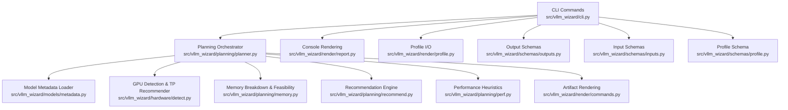
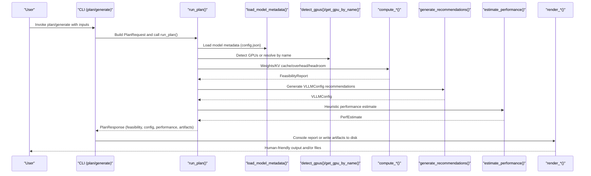
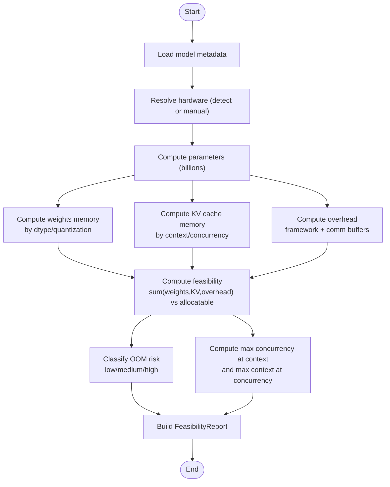
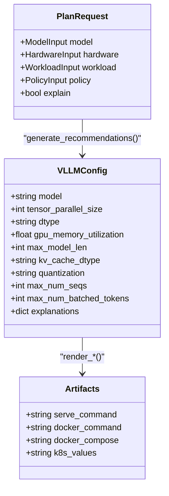
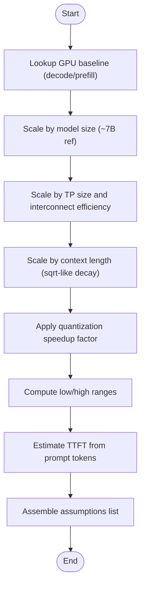
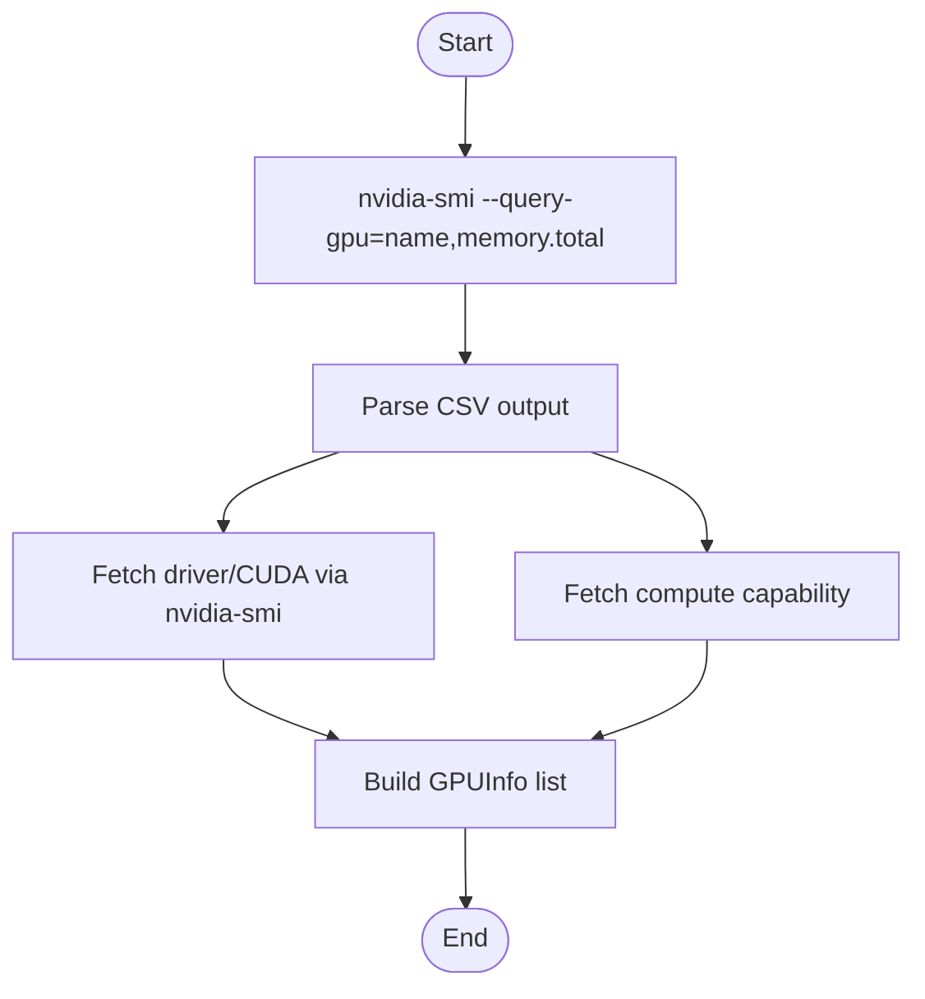
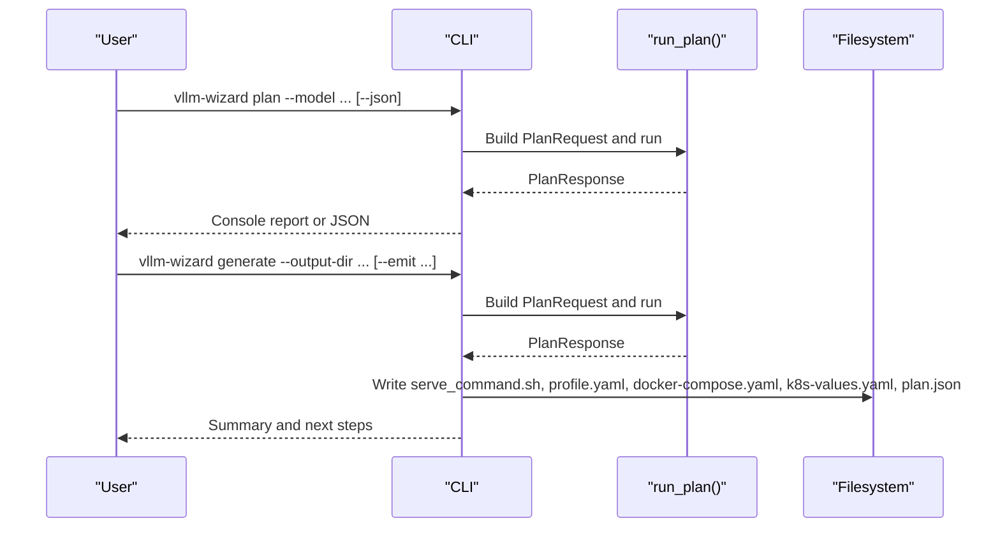
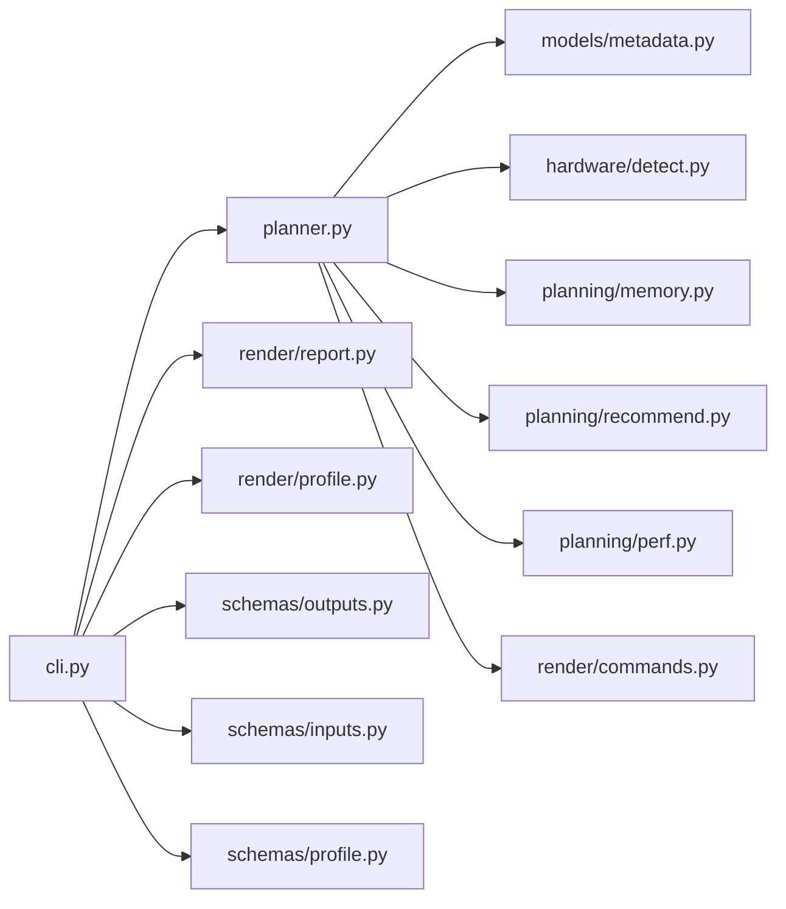

# Core Features Overview

<cite>
**Referenced Files in This Document**
- [README.md](file://README.md)
- [cli.py](file://src/vllm_wizard/cli.py)
- [planner.py](file://src/vllm_wizard/planning/planner.py)
- [memory.py](file://src/vllm_wizard/planning/memory.py)
- [perf.py](file://src/vllm_wizard/planning/perf.py)
- [detect.py](file://src/vllm_wizard/hardware/detect.py)
- [recommend.py](file://src/vllm_wizard/planning/recommend.py)
- [metadata.py](file://src/vllm_wizard/models/metadata.py)
- [commands.py](file://src/vllm_wizard/render/commands.py)
- [report.py](file://src/vllm_wizard/render/report.py)
- [profile.py](file://src/vllm_wizard/schemas/inputs.py)
- [outputs.py](file://src/vllm_wizard/schemas/outputs.py)
- [schemas/profile.py](file://src/vllm_wizard/schemas/profile.py)
- [examples/profiles/sample.yaml](file://examples/profiles/sample.yaml)
- [pyproject.toml](file://pyproject.toml)
</cite>

## Table of Contents
1. [Introduction](#introduction)
2. [Project Structure](#project-structure)
3. [Core Components](#core-components)
4. [Architecture Overview](#architecture-overview)
5. [Detailed Component Analysis](#detailed-component-analysis)
6. [Dependency Analysis](#dependency-analysis)
7. [Performance Considerations](#performance-considerations)
8. [Troubleshooting Guide](#troubleshooting-guide)
9. [Conclusion](#conclusion)
10. [Appendices](#appendices)

## Introduction
This document presents a comprehensive overview of vLLM Config Wizard’s core features and capabilities. It explains how the tool automates four main pillars:
- VRAM feasibility analysis with a detailed memory breakdown
- Configuration generation for vLLM serve commands and deployment artifacts
- Performance estimation using heuristic models
- GPU detection via nvidia-smi

It also demonstrates how these features work together in a cohesive workflow from model selection to deployment-ready configurations, compares the automation benefits against manual configuration, and provides conceptual guidance for decision-makers and technical users.

## Project Structure
The project is organized around a CLI entrypoint, planning pipeline, hardware detection, memory modeling, performance heuristics, and artifact rendering. Inputs and outputs are strongly typed using Pydantic models, and profiles enable reproducible configuration management.

**Diagram sources**
- [cli.py](file://src/vllm_wizard/cli.py#L1-L385)
- [planner.py](file://src/vllm_wizard/planning/planner.py#L1-L172)
- [memory.py](file://src/vllm_wizard/planning/memory.py#L1-L367)
- [perf.py](file://src/vllm_wizard/planning/perf.py#L1-L220)
- [detect.py](file://src/vllm_wizard/hardware/detect.py#L1-L229)
- [recommend.py](file://src/vllm_wizard/planning/recommend.py#L1-L333)
- [metadata.py](file://src/vllm_wizard/models/metadata.py#L1-L255)
- [commands.py](file://src/vllm_wizard/render/commands.py#L1-L196)
- [report.py](file://src/vllm_wizard/render/report.py#L1-L272)
- [outputs.py](file://src/vllm_wizard/schemas/outputs.py#L1-L118)
- [profile.py](file://src/vllm_wizard/schemas/inputs.py#L1-L110)
- [schemas/profile.py](file://src/vllm_wizard/schemas/profile.py#L1-L75)

**Section sources**
- [README.md](file://README.md#L1-L308)
- [pyproject.toml](file://pyproject.toml#L1-L71)

## Core Components
- VRAM feasibility analysis: Computes weights, KV cache, overhead, and headroom; classifies OOM risk; and reports maximum feasible concurrency/context.
- Configuration generation: Produces vLLM serve commands, docker-compose, and Kubernetes values; saves/loadable YAML profiles.
- Performance estimation: Heuristic throughput/TTFT estimates based on GPU baselines, model scaling, TP, context, and quantization.
- GPU detection: Auto-detects GPUs via nvidia-smi and recommends tensor-parallel sizes.

**Section sources**
- [README.md](file://README.md#L5-L11)
- [memory.py](file://src/vllm_wizard/planning/memory.py#L155-L271)
- [recommend.py](file://src/vllm_wizard/planning/recommend.py#L167-L333)
- [perf.py](file://src/vllm_wizard/planning/perf.py#L136-L220)
- [detect.py](file://src/vllm_wizard/hardware/detect.py#L10-L72)

## Architecture Overview
The CLI orchestrates two primary workflows:
- plan: Loads model metadata, detects or resolves hardware, computes memory feasibility, generates recommendations, estimates performance, and renders a human-readable report.
- generate: Runs the same planning pipeline and writes artifacts to disk (serve command, profile, docker-compose, k8s values) along with a JSON plan.

**Diagram sources**
- [cli.py](file://src/vllm_wizard/cli.py#L82-L213)
- [planner.py](file://src/vllm_wizard/planning/planner.py#L21-L136)
- [metadata.py](file://src/vllm_wizard/models/metadata.py#L209-L255)
- [detect.py](file://src/vllm_wizard/hardware/detect.py#L10-L72)
- [memory.py](file://src/vllm_wizard/planning/memory.py#L31-L153)
- [recommend.py](file://src/vllm_wizard/planning/recommend.py#L167-L333)
- [perf.py](file://src/vllm_wizard/planning/perf.py#L136-L220)
- [report.py](file://src/vllm_wizard/render/report.py#L14-L44)
- [commands.py](file://src/vllm_wizard/render/commands.py#L6-L196)

## Detailed Component Analysis

### VRAM Feasibility Analysis
This component computes the memory breakdown and determines whether a configuration fits within GPU memory, including headroom and OOM risk classification. It also derives maximum feasible concurrency and context.

**Diagram sources**
- [planner.py](file://src/vllm_wizard/planning/planner.py#L30-L97)
- [memory.py](file://src/vllm_wizard/planning/memory.py#L31-L153)
- [memory.py](file://src/vllm_wizard/planning/memory.py#L155-L271)
- [memory.py](file://src/vllm_wizard/planning/memory.py#L273-L367)

**Section sources**
- [memory.py](file://src/vllm_wizard/planning/memory.py#L155-L271)
- [README.md](file://README.md#L162-L191)

### Configuration Generation
The recommendation engine produces a VLLMConfig tailored to the model, hardware, and workload. It selects tensor-parallel size, memory utilization, KV cache dtype, quantization, and batching parameters. Artifact renderers then produce vLLM serve commands, docker-compose, and Kubernetes values.

**Diagram sources**
- [recommend.py](file://src/vllm_wizard/planning/recommend.py#L167-L333)
- [commands.py](file://src/vllm_wizard/render/commands.py#L6-L196)
- [outputs.py](file://src/vllm_wizard/schemas/outputs.py#L57-L101)
- [inputs.py](file://src/vllm_wizard/schemas/inputs.py#L102-L110)

**Section sources**
- [recommend.py](file://src/vllm_wizard/planning/recommend.py#L167-L333)
- [commands.py](file://src/vllm_wizard/render/commands.py#L6-L196)
- [README.md](file://README.md#L64-L88)

### Performance Estimation
Heuristic performance estimates are computed from GPU baseline tables, adjusted by model size, tensor-parallel scaling efficiency, context length, and quantization speedups. The estimates include ranges to emphasize uncertainty.

**Diagram sources**
- [perf.py](file://src/vllm_wizard/planning/perf.py#L136-L220)

**Section sources**
- [perf.py](file://src/vllm_wizard/planning/perf.py#L136-L220)
- [README.md](file://README.md#L177-L191)

### GPU Detection via nvidia-smi
The detection module queries nvidia-smi for GPU names and VRAM, captures driver/CUDA versions, compute capability, and falls back to known GPU VRAM when detection fails. It also recommends tensor-parallel sizes.

**Diagram sources**
- [detect.py](file://src/vllm_wizard/hardware/detect.py#L10-L72)
- [detect.py](file://src/vllm_wizard/hardware/detect.py#L138-L159)

**Section sources**
- [detect.py](file://src/vllm_wizard/hardware/detect.py#L10-L72)
- [detect.py](file://src/vllm_wizard/hardware/detect.py#L138-L159)

### Workflow from Model Selection to Deployment
The CLI integrates all components into a seamless workflow:
- plan: Validates inputs, runs the planning pipeline, prints a rich report, and optionally outputs JSON.
- generate: Re-runs planning and writes artifacts to disk for immediate deployment.

**Diagram sources**
- [cli.py](file://src/vllm_wizard/cli.py#L82-L213)
- [cli.py](file://src/vllm_wizard/cli.py#L215-L381)
- [planner.py](file://src/vllm_wizard/planning/planner.py#L21-L136)

**Section sources**
- [cli.py](file://src/vllm_wizard/cli.py#L82-L213)
- [cli.py](file://src/vllm_wizard/cli.py#L215-L381)
- [README.md](file://README.md#L26-L88)

## Dependency Analysis
The CLI depends on the planning orchestrator, which in turn depends on model metadata, hardware detection, memory computation, recommendations, and performance heuristics. Rendering modules depend on the planning outputs to produce console reports and artifacts.

**Diagram sources**
- [cli.py](file://src/vllm_wizard/cli.py#L1-L385)
- [planner.py](file://src/vllm_wizard/planning/planner.py#L1-L172)
- [metadata.py](file://src/vllm_wizard/models/metadata.py#L1-L255)
- [detect.py](file://src/vllm_wizard/hardware/detect.py#L1-L229)
- [memory.py](file://src/vllm_wizard/planning/memory.py#L1-L367)
- [recommend.py](file://src/vllm_wizard/planning/recommend.py#L1-L333)
- [perf.py](file://src/vllm_wizard/planning/perf.py#L1-L220)
- [commands.py](file://src/vllm_wizard/render/commands.py#L1-L196)
- [report.py](file://src/vllm_wizard/render/report.py#L1-L272)
- [profile.py](file://src/vllm_wizard/schemas/inputs.py#L1-L110)
- [outputs.py](file://src/vllm_wizard/schemas/outputs.py#L1-L118)
- [schemas/profile.py](file://src/vllm_wizard/schemas/profile.py#L1-L75)

**Section sources**
- [pyproject.toml](file://pyproject.toml#L29-L47)

## Performance Considerations
- Heuristic performance estimates are approximate and depend on GPU class baselines, model scaling, TP efficiency, context length, and quantization. They should be validated with real benchmarks.
- VRAM feasibility depends on accurate model metadata, correct dtype/quantization choices, and appropriate fragmentation and headroom settings.
- Tensor-parallel scaling efficiency varies by interconnect type; NVLink generally yields better scaling than PCIe.

[No sources needed since this section provides general guidance]

## Troubleshooting Guide
Common issues and resolutions:
- No GPUs detected: Ensure nvidia-smi is installed and accessible; the tool will fall back to known GPU specs if detection fails.
- Configuration does not fit: Reduce context length, concurrency, or enable quantization; lower GPU memory utilization; increase headroom.
- High OOM risk: Consider FP8 KV cache (on supported GPUs), reduce fragmentation factor, or switch to a larger GPU.
- Performance lower than expected: Verify quantization compatibility, adjust batching mode, and benchmark with realistic workloads.

**Section sources**
- [detect.py](file://src/vllm_wizard/hardware/detect.py#L65-L71)
- [memory.py](file://src/vllm_wizard/planning/memory.py#L236-L270)
- [README.md](file://README.md#L177-L191)

## Conclusion
vLLM Config Wizard automates the complex process of sizing and configuring vLLM deployments by integrating VRAM feasibility analysis, configuration recommendations, performance heuristics, and artifact generation. Compared to manual configuration, it reduces trial-and-error cycles, minimizes OOM risks, and accelerates deployment readiness—while still emphasizing the importance of testing and benchmarking in production environments.

[No sources needed since this section summarizes without analyzing specific files]

## Appendices

### Feature Comparison: Automation vs Manual Configuration
- VRAM feasibility analysis: Automated memory breakdown and OOM risk classification versus manual spreadsheet calculations.
- Configuration generation: Automated vLLM serve commands and deployment manifests versus copy-pasting CLI flags.
- Performance estimation: Heuristic throughput/TTFT ranges versus empirical benchmarking.
- GPU detection: Automatic detection and tensor-parallel recommendations versus manual discovery and tuning.

[No sources needed since this section provides general guidance]

### Example Profile
Profiles capture end-to-end configuration for reproducibility and sharing.

**Section sources**
- [examples/profiles/sample.yaml](file://examples/profiles/sample.yaml#L1-L40)
- [schemas/profile.py](file://src/vllm_wizard/schemas/profile.py#L66-L75)