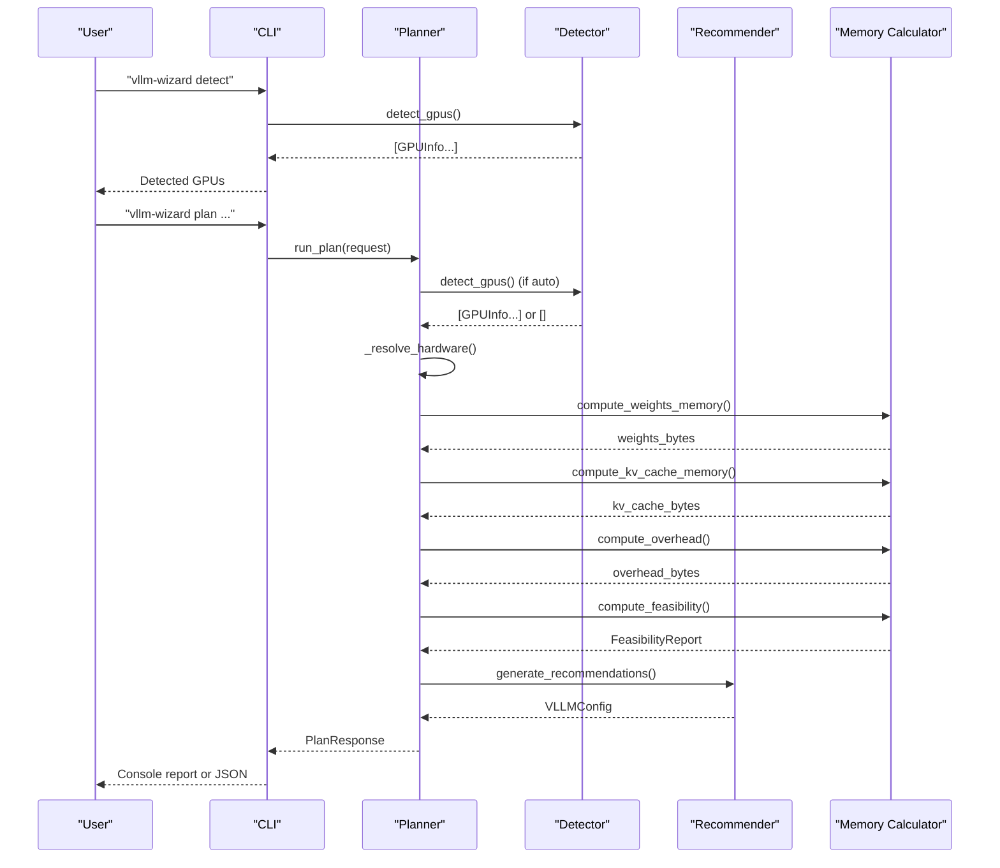
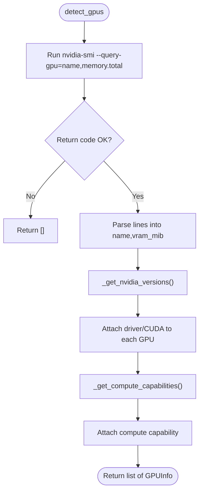
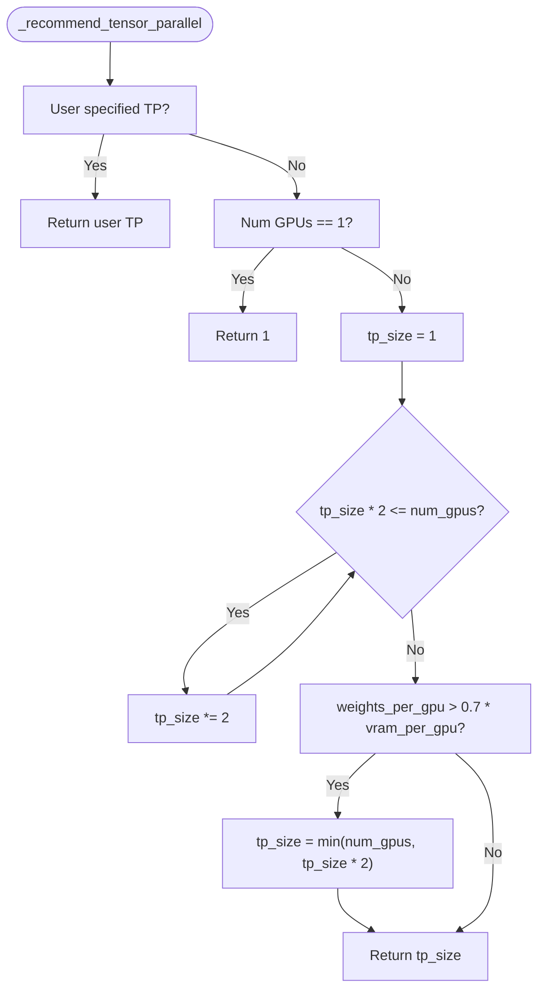
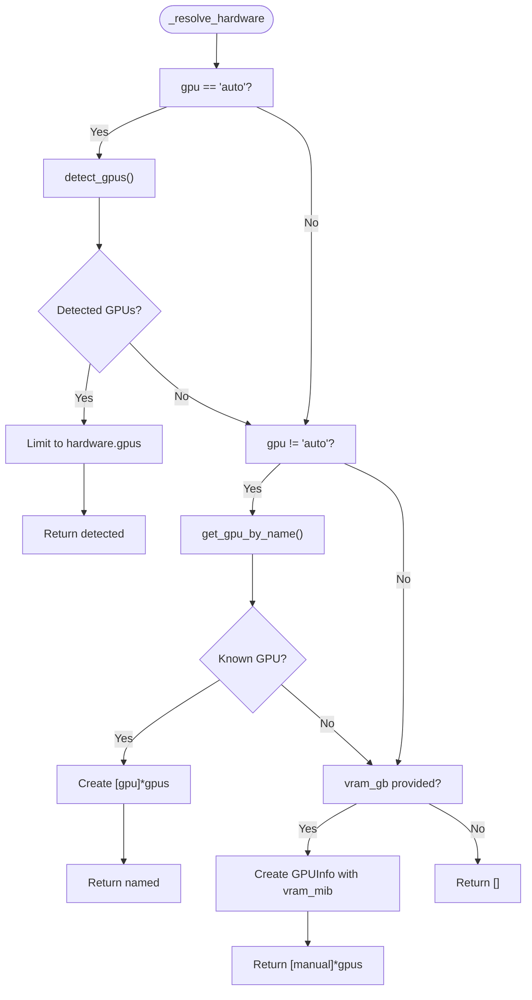
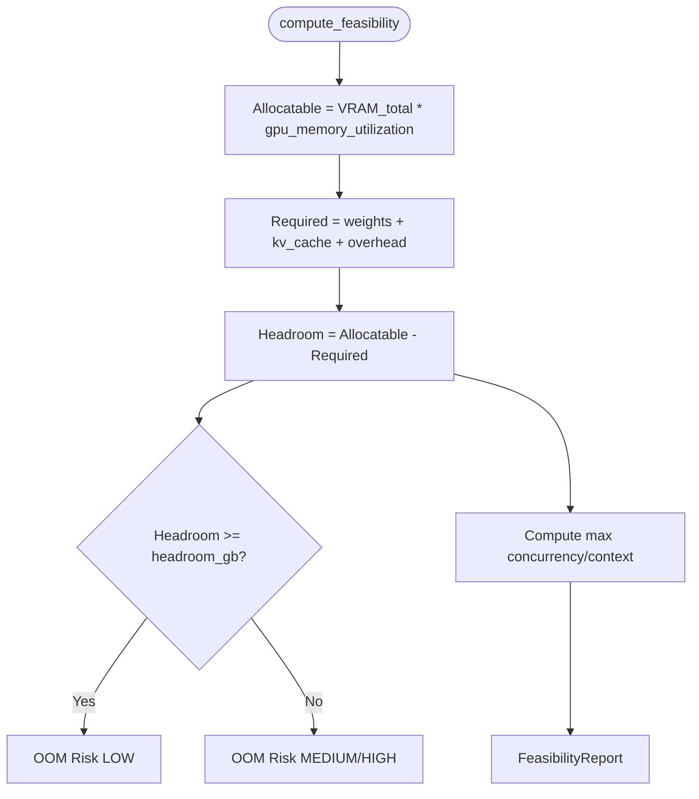
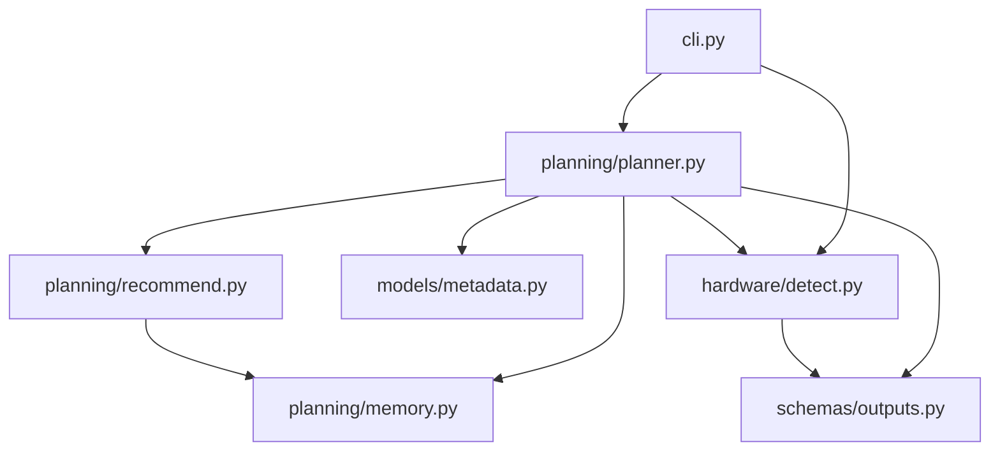

# GPU Detection System

<cite>
**Referenced Files in This Document**
- [detect.py](file://src/vllm_wizard/hardware/detect.py)
- [planner.py](file://src/vllm_wizard/planning/planner.py)
- [recommend.py](file://src/vllm_wizard/planning/recommend.py)
- [memory.py](file://src/vllm_wizard/planning/memory.py)
- [metadata.py](file://src/vllm_wizard/models/metadata.py)
- [outputs.py](file://src/vllm_wizard/schemas/outputs.py)
- [profile.py](file://src/vllm_wizard/schemas/profile.py)
- [sample.yaml](file://examples/profiles/sample.yaml)
- [cli.py](file://src/vllm_wizard/cli.py)
- [report.py](file://src/vllm_wizard/render/report.py)
- [README.md](file://README.md)
</cite>

## Table of Contents
1. [Introduction](#introduction)
2. [Project Structure](#project-structure)
3. [Core Components](#core-components)
4. [Architecture Overview](#architecture-overview)
5. [Detailed Component Analysis](#detailed-component-analysis)
6. [Dependency Analysis](#dependency-analysis)
7. [Performance Considerations](#performance-considerations)
8. [Troubleshooting Guide](#troubleshooting-guide)
9. [Conclusion](#conclusion)
10. [Appendices](#appendices)

## Introduction
This document explains the GPU detection and configuration system used by the vLLM Wizard. It covers automatic GPU discovery via nvidia-smi, cross-platform compatibility considerations, hardware information collection (VRAM, CUDA cores, compute capability), the tensor parallel recommendation algorithm, and how manual hardware specifications integrate with the automated detection system. It also includes examples of detected hardware profiles, configuration recommendations, and troubleshooting approaches for common detection issues.

## Project Structure
The GPU detection system spans several modules:
- Hardware detection: parses nvidia-smi output and augments GPU information
- Planning pipeline: orchestrates model metadata loading, hardware resolution, memory feasibility, and recommendation generation
- Memory modeling: computes weights, KV cache, and overhead memory
- Recommendation engine: selects tensor parallel size and other vLLM parameters
- Schemas: define GPUInfo, VLLMConfig, and profile structures
- CLI and rendering: expose commands for detection and reporting

```mermaid
graph TB
subgraph "CLI"
CLI["cli.py"]
end
subgraph "Hardware"
DETECT["hardware/detect.py"]
end
subgraph "Planning"
PLANNER["planning/planner.py"]
RECOMMEND["planning/recommend.py"]
MEMORY["planning/memory.py"]
end
subgraph "Models"
METADATA["models/metadata.py"]
end
subgraph "Schemas"
OUTPUTS["schemas/outputs.py"]
PROFILE["schemas/profile.py"]
end
subgraph "Rendering"
REPORT["render/report.py"]
end
CLI --> DETECT
CLI --> PLANNER
PLANNER --> DETECT
PLANNER --> METADATA
PLANNER --> MEMORY
PLANNER --> RECOMMEND
PLANNER --> OUTPUTS
PLANNER --> REPORT
RECOMMEND --> MEMORY
RECOMMEND --> OUTPUTS
DETECT --> OUTPUTS
PROFILE --> CLI
```

**Diagram sources**
- [cli.py](file://src/vllm_wizard/cli.py#L1-L385)
- [detect.py](file://src/vllm_wizard/hardware/detect.py#L1-L229)
- [planner.py](file://src/vllm_wizard/planning/planner.py#L1-L172)
- [recommend.py](file://src/vllm_wizard/planning/recommend.py#L1-L333)
- [memory.py](file://src/vllm_wizard/planning/memory.py#L1-L367)
- [metadata.py](file://src/vllm_wizard/models/metadata.py#L1-L255)
- [outputs.py](file://src/vllm_wizard/schemas/outputs.py#L1-L118)
- [profile.py](file://src/vllm_wizard/schemas/profile.py#L1-L75)
- [report.py](file://src/vllm_wizard/render/report.py#L1-L272)

**Section sources**
- [README.md](file://README.md#L1-L308)
- [cli.py](file://src/vllm_wizard/cli.py#L1-L385)

## Core Components
- GPU detection via nvidia-smi: collects GPU names, total VRAM (MiB), driver version, CUDA version, and compute capability
- Manual fallback: maps known GPU names to approximate VRAM when auto-detection fails
- Hardware resolution: combines detection, manual specification, and tensor parallel size selection
- Recommendation engine: chooses tensor parallel size, KV cache dtype, quantization, and other vLLM parameters
- Memory feasibility: computes weights, KV cache, overhead, and headroom to assess VRAM feasibility

**Section sources**
- [detect.py](file://src/vllm_wizard/hardware/detect.py#L10-L229)
- [planner.py](file://src/vllm_wizard/planning/planner.py#L138-L172)
- [recommend.py](file://src/vllm_wizard/planning/recommend.py#L167-L333)
- [memory.py](file://src/vllm_wizard/planning/memory.py#L31-L367)

## Architecture Overview
The GPU detection system integrates with the planning pipeline as follows:
- CLI commands trigger detection and planning
- Detection returns GPUInfo objects with name, VRAM (MiB), driver, CUDA, and compute capability
- Planner resolves hardware (auto-detect, by name, or manual VRAM)
- Memory computations determine feasibility and guide recommendations
- Recommendations produce a VLLMConfig with tensor parallel size, dtype, KV cache dtype, quantization, and other parameters



**Diagram sources**
- [cli.py](file://src/vllm_wizard/cli.py#L62-L213)
- [planner.py](file://src/vllm_wizard/planning/planner.py#L21-L136)
- [detect.py](file://src/vllm_wizard/hardware/detect.py#L10-L72)
- [recommend.py](file://src/vllm_wizard/planning/recommend.py#L167-L333)
- [memory.py](file://src/vllm_wizard/planning/memory.py#L155-L271)

## Detailed Component Analysis

### Automatic GPU Discovery via nvidia-smi
The detection mechanism:
- Executes nvidia-smi with CSV queries to extract GPU name and total memory
- Parses driver and CUDA versions from separate queries and nvidia-smi header
- Retrieves compute capability per GPU
- Returns a list of GPUInfo objects with collected attributes

Key behaviors:
- Graceful failure: returns empty list if nvidia-smi is unavailable or times out
- Aggregates driver/CUDA versions across GPUs
- Augments each GPU with compute capability



**Diagram sources**
- [detect.py](file://src/vllm_wizard/hardware/detect.py#L10-L72)
- [detect.py](file://src/vllm_wizard/hardware/detect.py#L74-L106)
- [detect.py](file://src/vllm_wizard/hardware/detect.py#L109-L136)

**Section sources**
- [detect.py](file://src/vllm_wizard/hardware/detect.py#L10-L136)

### Hardware Information Collection
Collected attributes per GPU:
- Name: GPU model identifier
- VRAM (MiB): total device memory
- Driver version: NVIDIA driver version
- CUDA version: CUDA toolkit version
- Compute capability: CUDA compute capability

VRAM units:
- GPUInfo exposes vram_gb (base 1000) and vram_gib (base 1024)

**Section sources**
- [outputs.py](file://src/vllm_wizard/schemas/outputs.py#L17-L35)
- [detect.py](file://src/vllm_wizard/hardware/detect.py#L10-L72)

### Manual Hardware Specification Fallback
When auto-detection fails or is not desired:
- Known GPU names are mapped to approximate VRAM (MiB) for common consumer and datacenter GPUs
- Partial matching allows flexible naming
- Manual VRAM can be supplied in GB, converted to MiB

Integration with automated detection:
- Planner attempts auto-detection first
- If GPU name is provided and not "auto", attempts mapping by name
- If VRAM is provided, constructs GPUInfo with manual VRAM

**Section sources**
- [detect.py](file://src/vllm_wizard/hardware/detect.py#L162-L229)
- [planner.py](file://src/vllm_wizard/planning/planner.py#L138-L172)

### Tensor Parallel Recommendation Algorithm
Two mechanisms:
- Automated detection: largest power of 2 less than or equal to number of GPUs
- Request-driven: user-specified tensor parallel size overrides automatic selection

Algorithm details:
- If user specifies TP size, use it
- If single GPU, TP = 1
- Otherwise, find largest power of 2 ≤ num_gpus
- Optionally increase TP if weights per GPU exceed 70% of VRAM per GPU to fit model weights



**Diagram sources**
- [recommend.py](file://src/vllm_wizard/planning/recommend.py#L42-L68)
- [detect.py](file://src/vllm_wizard/hardware/detect.py#L138-L159)

**Section sources**
- [recommend.py](file://src/vllm_wizard/planning/recommend.py#L42-L68)
- [detect.py](file://src/vllm_wizard/hardware/detect.py#L138-L159)

### Hardware Resolution Pipeline
The planner resolves hardware in order:
1. Auto-detect GPUs via nvidia-smi if requested
2. If GPU name provided, map to known VRAM
3. If VRAM provided, construct GPUInfo with manual VRAM
4. Limit detected GPUs to requested count



**Diagram sources**
- [planner.py](file://src/vllm_wizard/planning/planner.py#L138-L172)
- [detect.py](file://src/vllm_wizard/hardware/detect.py#L162-L229)

**Section sources**
- [planner.py](file://src/vllm_wizard/planning/planner.py#L138-L172)

### Memory Modeling and Feasibility
Memory computation components:
- Weights memory: depends on parameter count and dtype/quantization
- KV cache memory: scales with context length, concurrency, and model dimensions
- Overhead: base overhead plus communication buffer overhead for multi-GPU
- Feasibility: allocatable VRAM minus weights/KV/cache/overhead with headroom



**Diagram sources**
- [memory.py](file://src/vllm_wizard/planning/memory.py#L155-L271)

**Section sources**
- [memory.py](file://src/vllm_wizard/planning/memory.py#L31-L153)
- [memory.py](file://src/vllm_wizard/planning/memory.py#L155-L367)

### Recommendations and Configuration
Recommendation engine considers:
- GPU type (consumer vs datacenter) for memory utilization
- KV cache dtype selection (FP8 for supported GPUs under high pressure)
- Quantization recommendation when model does not fit without quantization
- Max model length clamping to model max and available context
- Max number of sequences and max batched tokens based on workload and VRAM

Final configuration is packaged as VLLMConfig with explanations.

**Section sources**
- [recommend.py](file://src/vllm_wizard/planning/recommend.py#L167-L333)

### Cross-Platform Compatibility
- Detection relies on nvidia-smi availability; if not present, detection returns empty list
- Manual VRAM specification enables operation on systems without NVIDIA GPUs
- Profiles can encode manual hardware settings for portability across environments

**Section sources**
- [detect.py](file://src/vllm_wizard/hardware/detect.py#L65-L71)
- [planner.py](file://src/vllm_wizard/planning/planner.py#L41-L45)

### Examples of Detected Hardware Profiles and Recommendations
- Sample profile demonstrates manual GPU specification and tensor parallel size selection
- CLI quick start shows detection and planning workflows

**Section sources**
- [sample.yaml](file://examples/profiles/sample.yaml#L1-L40)
- [README.md](file://README.md#L241-L277)

## Dependency Analysis
The detection and planning pipeline exhibits clear module boundaries:
- CLI depends on hardware detection and planner
- Planner depends on detection, metadata, memory, and recommendation modules
- Recommendation depends on memory calculations and outputs
- Outputs define shared data structures used across modules



**Diagram sources**
- [cli.py](file://src/vllm_wizard/cli.py#L1-L385)
- [planner.py](file://src/vllm_wizard/planning/planner.py#L1-L172)
- [detect.py](file://src/vllm_wizard/hardware/detect.py#L1-L229)
- [recommend.py](file://src/vllm_wizard/planning/recommend.py#L1-L333)
- [memory.py](file://src/vllm_wizard/planning/memory.py#L1-L367)
- [outputs.py](file://src/vllm_wizard/schemas/outputs.py#L1-L118)

**Section sources**
- [cli.py](file://src/vllm_wizard/cli.py#L1-L385)
- [planner.py](file://src/vllm_wizard/planning/planner.py#L1-L172)

## Performance Considerations
- Detection timeouts and failures return empty lists; consider retry or manual specification
- Using compute capability and driver/CUDA versions helps tailor recommendations for specific GPU families
- KV cache pressure and fragmentation factor significantly impact feasibility; tune fragmentation and consider FP8 KV cache on supported GPUs
- Tensor parallel size affects both memory distribution and communication overhead; balance against VRAM per GPU

[No sources needed since this section provides general guidance]

## Troubleshooting Guide
Common detection issues and resolutions:
- No GPUs detected
  - Ensure nvidia-smi is installed and accessible
  - Verify NVIDIA drivers are loaded
  - Use manual VRAM specification as fallback
- Partial or incorrect VRAM reported
  - Confirm GPU name matches known mapping keys
  - Supply VRAM in GB via manual specification
- Tensor parallel size mismatch
  - Provide explicit tensor_parallel_size to override automatic selection
  - Reduce model size or increase VRAM per GPU
- KV cache pressure warnings
  - Reduce context length or concurrency
  - Consider FP8 KV cache on supported GPUs
  - Lower fragmentation factor or increase headroom

**Section sources**
- [detect.py](file://src/vllm_wizard/hardware/detect.py#L65-L71)
- [planner.py](file://src/vllm_wizard/planning/planner.py#L41-L45)
- [recommend.py](file://src/vllm_wizard/planning/recommend.py#L102-L122)
- [memory.py](file://src/vllm_wizard/planning/memory.py#L236-L271)

## Conclusion
The GPU detection system provides robust automatic discovery via nvidia-smi and graceful manual fallback. It integrates tightly with memory modeling and recommendation engines to produce feasible vLLM configurations. Users can rely on automatic detection for NVIDIA systems or supply manual hardware specifications for portability and control.

[No sources needed since this section summarizes without analyzing specific files]

## Appendices

### Hardware Information Collected
- Name: GPU model identifier
- VRAM (MiB): total device memory
- Driver version: NVIDIA driver version
- CUDA version: CUDA toolkit version
- Compute capability: CUDA compute capability

**Section sources**
- [outputs.py](file://src/vllm_wizard/schemas/outputs.py#L17-L35)
- [detect.py](file://src/vllm_wizard/hardware/detect.py#L10-L72)

### Known GPU VRAM Approximations
- Consumer NVIDIA: RTX series
- Datacenter NVIDIA: A-series, H-series, L-series, T4, V100, P100
- Apple Silicon: M-series for reference

**Section sources**
- [detect.py](file://src/vllm_wizard/hardware/detect.py#L173-L229)

### CLI Commands Related to GPU Detection
- Detect GPUs: vllm-wizard detect [--json]
- Plan with auto-detection: vllm-wizard plan --model ...
- Plan with manual hardware: vllm-wizard plan --gpu "..." --gpus N --vram-gb X

**Section sources**
- [README.md](file://README.md#L28-L88)
- [cli.py](file://src/vllm_wizard/cli.py#L62-L213)