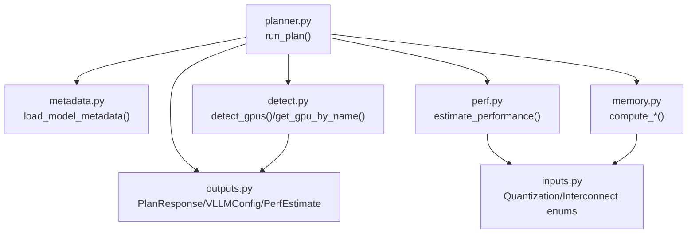
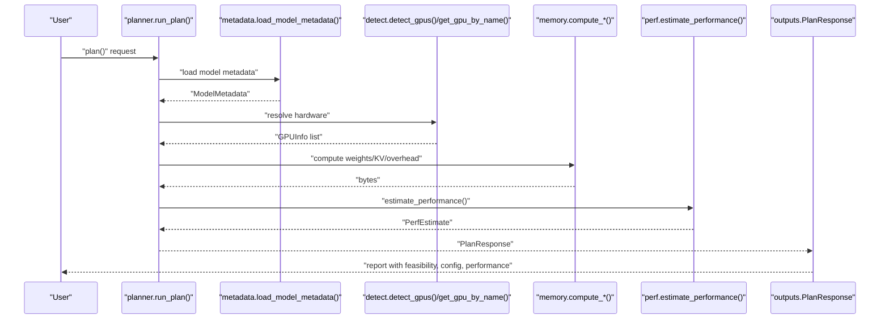
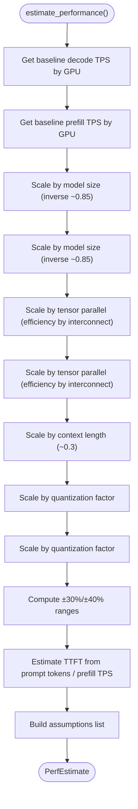
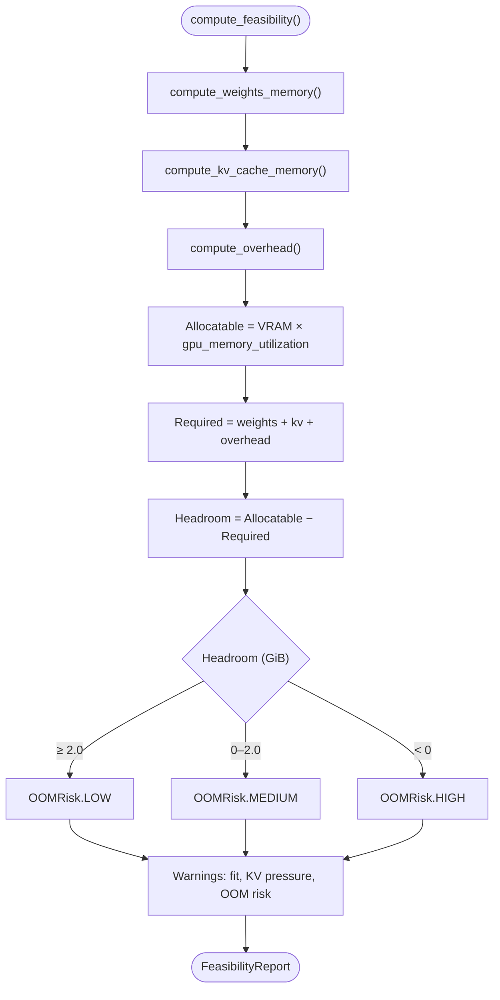
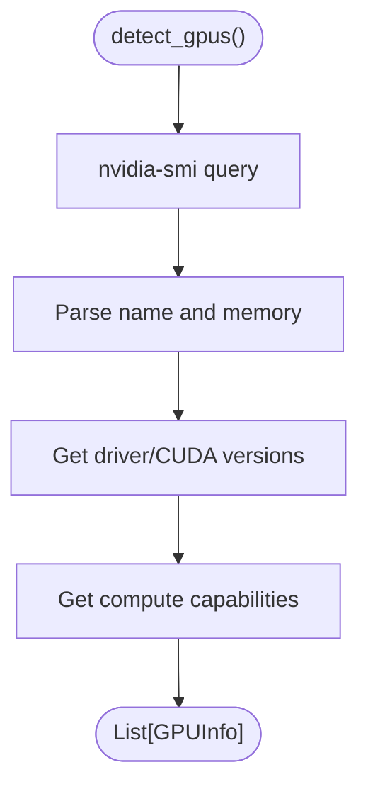
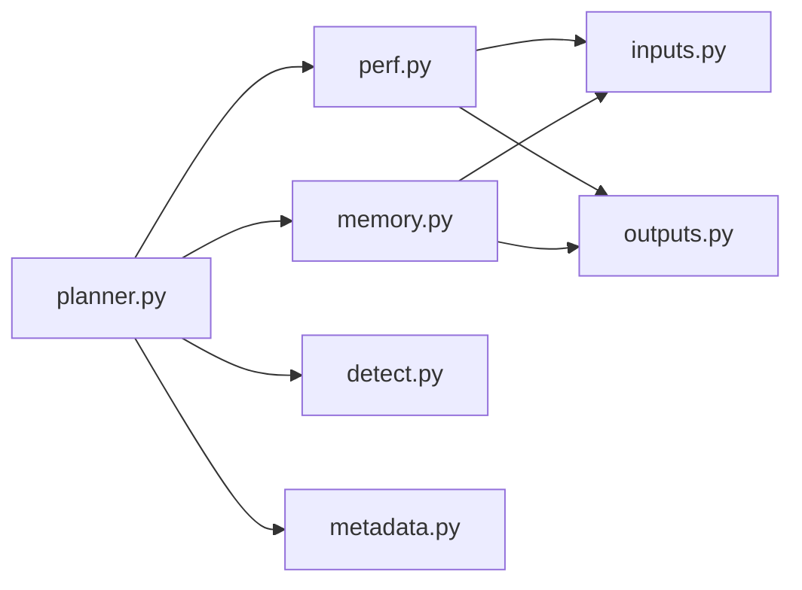

# Performance Estimation

<cite>
**Referenced Files in This Document**
- [perf.py](file://src/vllm_wizard/planning/perf.py)
- [memory.py](file://src/vllm_wizard/planning/memory.py)
- [metadata.py](file://src/vllm_wizard/models/metadata.py)
- [detect.py](file://src/vllm_wizard/hardware/detect.py)
- [planner.py](file://src/vllm_wizard/planning/planner.py)
- [inputs.py](file://src/vllm_wizard/schemas/inputs.py)
- [outputs.py](file://src/vllm_wizard/schemas/outputs.py)
- [README.md](file://README.md)
</cite>

## Table of Contents
1. [Introduction](#introduction)
2. [Project Structure](#project-structure)
3. [Core Components](#core-components)
4. [Architecture Overview](#architecture-overview)
5. [Detailed Component Analysis](#detailed-component-analysis)
6. [Dependency Analysis](#dependency-analysis)
7. [Performance Considerations](#performance-considerations)
8. [Troubleshooting Guide](#troubleshooting-guide)
9. [Conclusion](#conclusion)
10. [Appendices](#appendices)

## Introduction
This document explains the performance estimation system that predicts inference throughput and latency for vLLM deployments. It focuses on the heuristic-based modeling approach used by the system, including GPU family scaling factors, model size impacts, context length effects, and quantization influences. It also documents how uncertainty ranges and confidence indicators are derived, and how memory allocation relates to throughput and latency in practice.

## Project Structure
The performance estimation pipeline is composed of several modules:
- Planning and orchestration: orchestrates model metadata loading, hardware resolution, memory feasibility, configuration recommendations, and performance estimation.
- Performance estimation: computes decode throughput, prefill throughput, and time-to-first-token (TTFT) ranges.
- Memory calculations: computes weights memory, KV cache memory, overhead, and feasibility with headroom and OOM risk.
- Hardware detection: resolves GPU information and interconnect type.
- Schemas: define input/output data structures and enumerations used across the system.

**Diagram sources**
- [planner.py](file://src/vllm_wizard/planning/planner.py#L21-L136)
- [metadata.py](file://src/vllm_wizard/models/metadata.py#L209-L255)
- [detect.py](file://src/vllm_wizard/hardware/detect.py#L10-L72)
- [memory.py](file://src/vllm_wizard/planning/memory.py#L31-L153)
- [perf.py](file://src/vllm_wizard/planning/perf.py#L136-L220)
- [inputs.py](file://src/vllm_wizard/schemas/inputs.py#L18-L44)
- [outputs.py](file://src/vllm_wizard/schemas/outputs.py#L77-L118)

**Section sources**
- [planner.py](file://src/vllm_wizard/planning/planner.py#L21-L136)
- [README.md](file://README.md#L1-L308)

## Core Components
- Performance estimation module: Implements heuristic-based throughput and latency prediction with uncertainty ranges.
- Memory module: Computes weights, KV cache, and overhead memory, and evaluates feasibility with OOM risk.
- Hardware detection: Resolves GPU information and interconnect type for performance scaling.
- Schemas: Define enums and data models used by the estimation and recommendation systems.

Key responsibilities:
- Heuristic throughput scaling by GPU family, model size, tensor parallelism, context length, and quantization.
- Confidence ranges around estimates to reflect heuristic limitations.
- VRAM feasibility and OOM risk classification to inform performance constraints.

**Section sources**
- [perf.py](file://src/vllm_wizard/planning/perf.py#L1-L220)
- [memory.py](file://src/vllm_wizard/planning/memory.py#L1-L367)
- [detect.py](file://src/vllm_wizard/hardware/detect.py#L1-L229)
- [inputs.py](file://src/vllm_wizard/schemas/inputs.py#L1-L110)
- [outputs.py](file://src/vllm_wizard/schemas/outputs.py#L1-L118)

## Architecture Overview
The performance estimation is integrated into the planning pipeline. The planner orchestrates:
- Model metadata extraction (for KV cache and head dimension).
- Hardware resolution (GPU detection and interconnect).
- Memory feasibility computation (weights, KV cache, overhead).
- Configuration recommendations (tensor parallel size, quantization, KV cache dtype, max lengths).
- Performance estimation using GPU family baselines and scaling factors.
- Artifact generation (serve command, docker-compose, profile).

**Diagram sources**
- [planner.py](file://src/vllm_wizard/planning/planner.py#L21-L136)
- [metadata.py](file://src/vllm_wizard/models/metadata.py#L209-L255)
- [detect.py](file://src/vllm_wizard/hardware/detect.py#L10-L72)
- [memory.py](file://src/vllm_wizard/planning/memory.py#L155-L271)
- [perf.py](file://src/vllm_wizard/planning/perf.py#L136-L220)
- [outputs.py](file://src/vllm_wizard/schemas/outputs.py#L103-L118)

## Detailed Component Analysis

### Performance Estimation Module
The performance estimation module defines:
- GPU baseline tables for decode and prefill tokens per second by GPU family.
- Scaling functions for model size, tensor parallelism, context length, and quantization.
- A top-level estimator that composes these scalings and produces uncertainty ranges.
- TTFT estimation from prefill throughput.

**Diagram sources**
- [perf.py](file://src/vllm_wizard/planning/perf.py#L136-L220)

Key implementation highlights:
- GPU family scaling: decode and prefill baselines are looked up by GPU name substring matching.
- Model size scaling: inverse scaling with exponent ~0.85 to reflect diminishing returns.
- Tensor parallel scaling: linear scaling multiplied by interconnect efficiency (NVLink better than PCIe).
- Context length scaling: mild degradation with sqrt-like scaling for decode.
- Quantization scaling: modest speedups for AWQ, GPTQ, INT8, FP8.
- Uncertainty ranges: ±30% for decode, ±40% for prefill to emphasize heuristic nature.
- TTFT: computed from prompt tokens divided by prefill TPS, with ranges propagated.

**Section sources**
- [perf.py](file://src/vllm_wizard/planning/perf.py#L8-L36)
- [perf.py](file://src/vllm_wizard/planning/perf.py#L56-L68)
- [perf.py](file://src/vllm_wizard/planning/perf.py#L70-L81)
- [perf.py](file://src/vllm_wizard/planning/perf.py#L83-L105)
- [perf.py](file://src/vllm_wizard/planning/perf.py#L107-L118)
- [perf.py](file://src/vllm_wizard/planning/perf.py#L120-L134)
- [perf.py](file://src/vllm_wizard/planning/perf.py#L136-L220)
- [inputs.py](file://src/vllm_wizard/schemas/inputs.py#L18-L26)
- [inputs.py](file://src/vllm_wizard/schemas/inputs.py#L38-L44)

### Memory Calculation Module
The memory module computes:
- Weights memory: bytes per parameter based on dtype or quantization.
- KV cache memory: scales with num_kv_heads, head_dim, num_layers, context length, concurrency, and dtype.
- Overhead: base overhead plus communication overhead for tensor parallel groups.
- Feasibility: total required memory vs allocatable VRAM, headroom, OOM risk, and warnings.

**Diagram sources**
- [memory.py](file://src/vllm_wizard/planning/memory.py#L155-L271)

Relationship to performance:
- KV cache dominates memory usage for long contexts and high concurrency.
- Excess KV usage increases OOM risk and constrains achievable throughput.
- Quantization reduces weights and KV cache sizes, improving feasibility and enabling higher concurrency or longer contexts.

**Section sources**
- [memory.py](file://src/vllm_wizard/planning/memory.py#L31-L57)
- [memory.py](file://src/vllm_wizard/planning/memory.py#L59-L122)
- [memory.py](file://src/vllm_wizard/planning/memory.py#L124-L153)
- [memory.py](file://src/vllm_wizard/planning/memory.py#L155-L271)
- [memory.py](file://src/vllm_wizard/planning/memory.py#L273-L367)

### Hardware Detection and Interconnect
Hardware detection resolves GPU information and interconnect type:
- Auto-detection via nvidia-smi.
- Approximate VRAM for common GPUs when detection fails.
- Interconnect inferred from hardware or provided by user.

**Diagram sources**
- [detect.py](file://src/vllm_wizard/hardware/detect.py#L10-L72)

**Section sources**
- [detect.py](file://src/vllm_wizard/hardware/detect.py#L10-L72)
- [detect.py](file://src/vllm_wizard/hardware/detect.py#L138-L159)
- [detect.py](file://src/vllm_wizard/hardware/detect.py#L162-L229)

### Relationship Between Memory Allocation, Throughput, and Latency
- Memory allocation determines whether a configuration fits and how much headroom remains.
- KV cache pressure directly limits concurrency and context length, which in turn affects throughput and latency.
- Quantization reduces memory footprint, often increasing throughput and decreasing TTFT.
- Tensor parallelism increases throughput but adds communication overhead; interconnect quality matters.

**Section sources**
- [README.md](file://README.md#L160-L191)
- [memory.py](file://src/vllm_wizard/planning/memory.py#L155-L271)
- [perf.py](file://src/vllm_wizard/planning/perf.py#L136-L220)

## Dependency Analysis
The performance estimation depends on:
- GPU baseline tables and scaling functions in perf.py.
- Quantization and interconnect enums in inputs.py.
- Model metadata for KV cache computations in memory.py.
- Hardware detection for GPU name and interconnect in detect.py.

**Diagram sources**
- [perf.py](file://src/vllm_wizard/planning/perf.py#L1-L220)
- [memory.py](file://src/vllm_wizard/planning/memory.py#L1-L367)
- [planner.py](file://src/vllm_wizard/planning/planner.py#L1-L172)
- [detect.py](file://src/vllm_wizard/hardware/detect.py#L1-L229)
- [metadata.py](file://src/vllm_wizard/models/metadata.py#L1-L255)
- [inputs.py](file://src/vllm_wizard/schemas/inputs.py#L1-L110)
- [outputs.py](file://src/vllm_wizard/schemas/outputs.py#L1-L118)

**Section sources**
- [perf.py](file://src/vllm_wizard/planning/perf.py#L1-L220)
- [memory.py](file://src/vllm_wizard/planning/memory.py#L1-L367)
- [planner.py](file://src/vllm_wizard/planning/planner.py#L1-L172)
- [detect.py](file://src/vllm_wizard/hardware/detect.py#L1-L229)
- [metadata.py](file://src/vllm_wizard/models/metadata.py#L1-L255)
- [inputs.py](file://src/vllm_wizard/schemas/inputs.py#L1-L110)
- [outputs.py](file://src/vllm_wizard/schemas/outputs.py#L1-L118)

## Performance Considerations
- Heuristic nature: Estimates are clearly labeled as heuristic and depend on many runtime factors.
- GPU family scaling: Baselines reflect typical performance per GPU family; actual performance depends on drivers, kernels, and vLLM version.
- Model size scaling: Larger models generally reduce throughput per GPU due to inverse scaling; tensor parallelism helps mitigate this.
- Context length: Longer contexts degrade decode throughput due to attention overhead; prefill throughput is more sensitive to context length.
- Quantization: Provides modest speedups; FP8 and AWQ/GPTQ reduce memory footprint and can improve throughput.
- Interconnect: NVLink yields better tensor parallel scaling efficiency compared to PCIe.
- Batch and concurrency: Higher concurrency increases KV cache pressure; batching mode affects max batched tokens recommendations.

[No sources needed since this section provides general guidance]

## Troubleshooting Guide
Common issues and mitigations:
- Configuration does not fit in VRAM:
  - Reduce context length or concurrency.
  - Enable quantization (AWQ/GPTQ/INT8/FP8).
  - Lower GPU memory utilization target.
- High OOM risk:
  - Use FP8 KV cache when supported by GPU.
  - Reduce concurrency or context length.
  - Increase headroom or VRAM.
- Low throughput or high latency:
  - Ensure adequate tensor parallel size and NVLink interconnect.
  - Consider quantization to reduce memory pressure and improve throughput.
  - Verify batching mode aligns with workload goals.

**Section sources**
- [memory.py](file://src/vllm_wizard/planning/memory.py#L155-L271)
- [README.md](file://README.md#L177-L191)

## Conclusion
The performance estimation system provides heuristic-based throughput and latency predictions grounded in GPU family baselines, model size scaling, context length effects, and quantization. It emphasizes uncertainty via confidence ranges and integrates tightly with VRAM feasibility analysis to inform practical deployment decisions. Users should validate recommendations with real benchmarks on their hardware and workloads.

[No sources needed since this section summarizes without analyzing specific files]

## Appendices

### Example Scenarios and How They Map to the System
- Single GPU, moderate context, 7B model:
  - Baseline decode throughput scaled by GPU family.
  - Model size scaling reduces throughput proportionally to inverse ~0.85.
  - Context length scaling degrades decode throughput slightly.
  - Quantization (e.g., INT8) provides modest speedup.
  - TTFT estimated from prompt tokens divided by prefill throughput.
- Multi-GPU with tensor parallelism:
  - Decode and prefill throughput scaled linearly with TP size and interconnect efficiency.
  - KV cache pressure constrained by allocatable VRAM; consider FP8 KV cache.
- Long context or high concurrency:
  - KV cache dominates memory; feasibility analysis determines maximum concurrency or context.
  - Recommendations adjust max_model_len and max_num_seqs accordingly.

[No sources needed since this section provides general guidance]