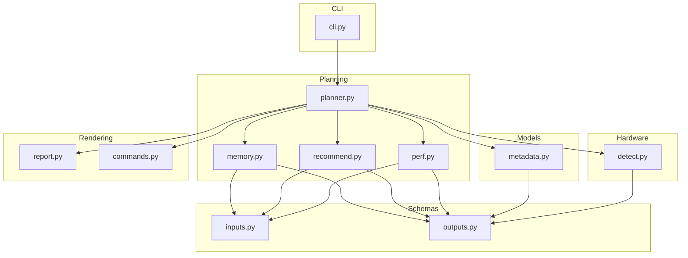
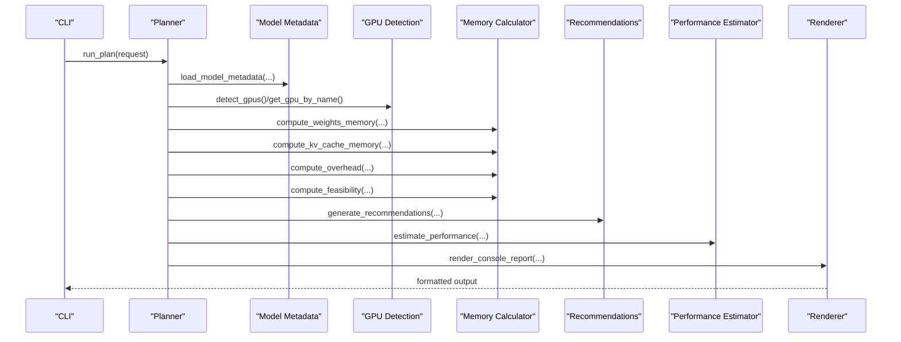
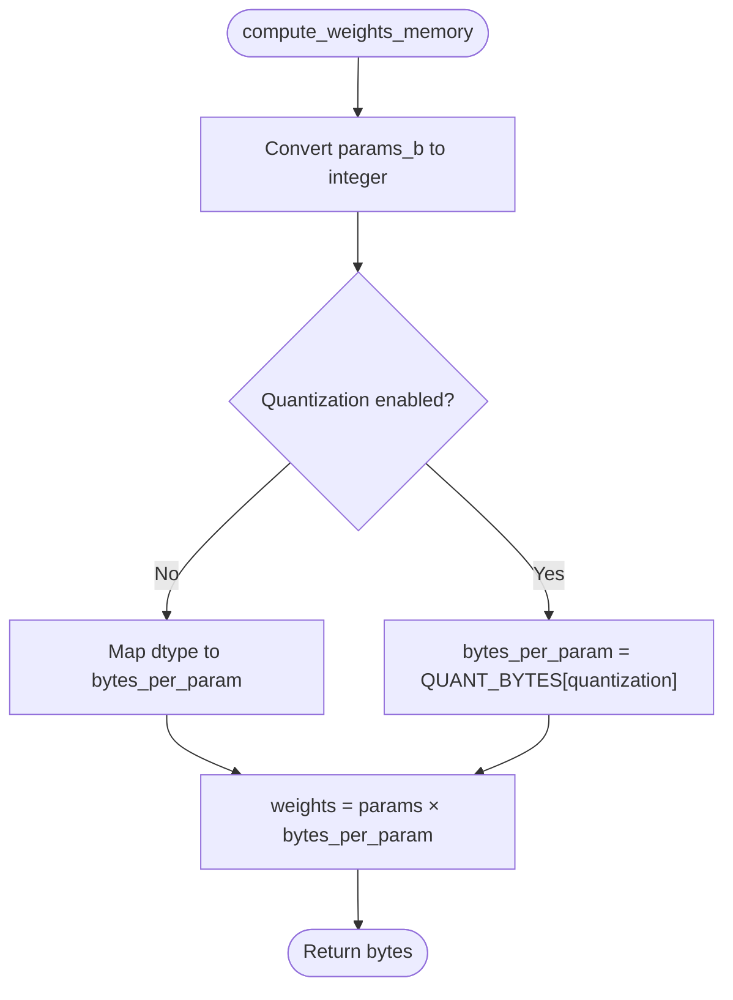
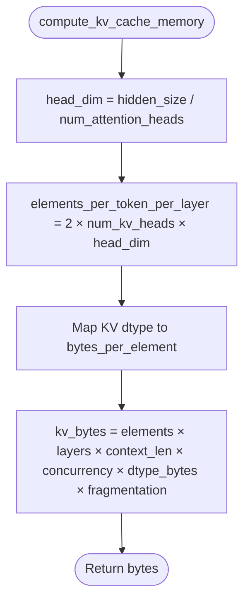
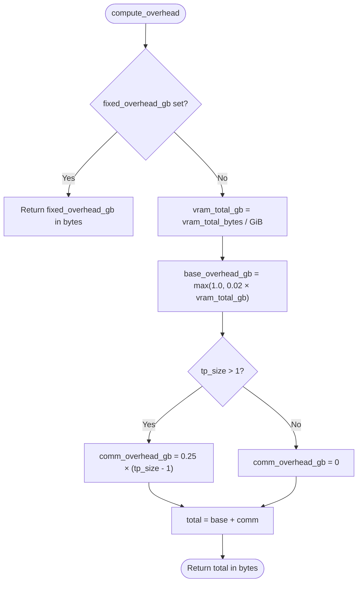
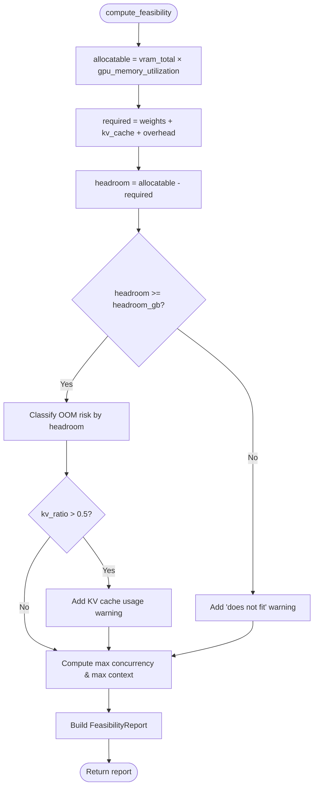
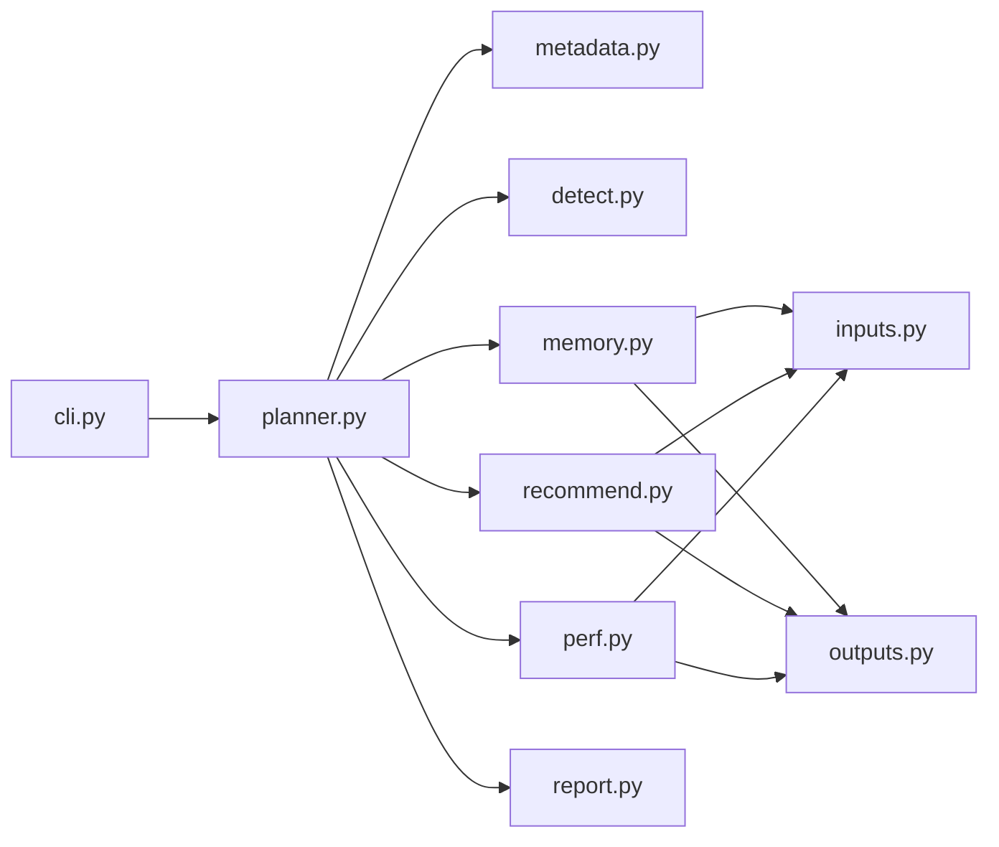

# VRAM Feasibility Analysis

<cite>
**Referenced Files in This Document**
- [memory.py](file://src/vllm_wizard/planning/memory.py)
- [planner.py](file://src/vllm_wizard/planning/planner.py)
- [recommend.py](file://src/vllm_wizard/planning/recommend.py)
- [perf.py](file://src/vllm_wizard/planning/perf.py)
- [inputs.py](file://src/vllm_wizard/schemas/inputs.py)
- [outputs.py](file://src/vllm_wizard/schemas/outputs.py)
- [metadata.py](file://src/vllm_wizard/models/metadata.py)
- [detect.py](file://src/vllm_wizard/hardware/detect.py)
- [cli.py](file://src/vllm_wizard/cli.py)
- [report.py](file://src/vllm_wizard/render/report.py)
- [test_memory.py](file://tests/test_memory.py)
- [sample.yaml](file://examples/profiles/sample.yaml)
</cite>

## Table of Contents
1. [Introduction](#introduction)
2. [Project Structure](#project-structure)
3. [Core Components](#core-components)
4. [Architecture Overview](#architecture-overview)
5. [Detailed Component Analysis](#detailed-component-analysis)
6. [Dependency Analysis](#dependency-analysis)
7. [Performance Considerations](#performance-considerations)
8. [Troubleshooting Guide](#troubleshooting-guide)
9. [Conclusion](#conclusion)
10. [Appendices](#appendices)

## Introduction
This document explains the VRAM feasibility analysis system used by the vLLM Wizard. It covers the three-component memory breakdown:
- Weights memory calculation with quantization support
- KV cache computation based on model architecture and usage patterns
- Framework overhead estimation

It documents the memory calculation algorithms, data type conversions, quantization methods (AWQ, GPTQ, INT8, FP8), and the feasibility assessment logic including GPU memory utilization thresholds, headroom requirements, and OOM risk classification. Practical examples illustrate memory calculations for different model sizes, quantization schemes, and usage scenarios, along with the relationship between context length, concurrency, and memory requirements.

## Project Structure
The VRAM feasibility system is implemented across several modules:
- Planning: orchestrates memory computations and feasibility checks
- Schemas: defines input/output data structures and enums
- Models: extracts model metadata from config files
- Hardware: detects GPUs and recommends tensor parallel sizes
- Rendering: formats reports and artifacts
- CLI: exposes commands for detection, planning, and artifact generation

**Diagram sources**
- [planner.py](file://src/vllm_wizard/planning/planner.py#L21-L135)
- [memory.py](file://src/vllm_wizard/planning/memory.py#L31-L366)
- [recommend.py](file://src/vllm_wizard/planning/recommend.py#L167-L332)
- [perf.py](file://src/vllm_wizard/planning/perf.py#L136-L219)
- [inputs.py](file://src/vllm_wizard/schemas/inputs.py#L9-L109)
- [outputs.py](file://src/vllm_wizard/schemas/outputs.py#L37-L117)
- [metadata.py](file://src/vllm_wizard/models/metadata.py#L12-L254)
- [detect.py](file://src/vllm_wizard/hardware/detect.py#L10-L228)
- [report.py](file://src/vllm_wizard/render/report.py#L14-L271)
- [cli.py](file://src/vllm_wizard/cli.py#L62-L381)

**Section sources**
- [planner.py](file://src/vllm_wizard/planning/planner.py#L21-L135)
- [memory.py](file://src/vllm_wizard/planning/memory.py#L31-L366)
- [recommend.py](file://src/vllm_wizard/planning/recommend.py#L167-L332)
- [perf.py](file://src/vllm_wizard/planning/perf.py#L136-L219)
- [inputs.py](file://src/vllm_wizard/schemas/inputs.py#L9-L109)
- [outputs.py](file://src/vllm_wizard/schemas/outputs.py#L37-L117)
- [metadata.py](file://src/vllm_wizard/models/metadata.py#L12-L254)
- [detect.py](file://src/vllm_wizard/hardware/detect.py#L10-L228)
- [report.py](file://src/vllm_wizard/render/report.py#L14-L271)
- [cli.py](file://src/vllm_wizard/cli.py#L62-L381)

## Core Components
- Weights memory calculator: computes memory for model parameters considering data types and quantization schemes
- KV cache calculator: computes memory for attention key/value caches based on model architecture, context length, concurrency, and KV cache dtype
- Overhead calculator: estimates framework overhead and tensor-parallel communication overhead
- Feasibility checker: evaluates whether a configuration fits within VRAM, classifies OOM risk, and computes maximum feasible concurrency and context
- Recommendation engine: suggests tensor-parallel size, KV cache dtype, quantization, and other vLLM parameters based on feasibility and workload
- Planner: orchestrates metadata loading, hardware detection, memory computations, feasibility checks, recommendations, and performance estimation

**Section sources**
- [memory.py](file://src/vllm_wizard/planning/memory.py#L31-L366)
- [recommend.py](file://src/vllm_wizard/planning/recommend.py#L167-L332)
- [planner.py](file://src/vllm_wizard/planning/planner.py#L21-L135)

## Architecture Overview
The planner coordinates the VRAM feasibility pipeline:
1. Load model metadata from local config or Hugging Face
2. Detect or configure hardware (GPU VRAM, interconnect, tensor-parallel size)
3. Compute weights memory (with quantization)
4. Compute KV cache memory (context × concurrency × fragmentation)
5. Compute framework overhead (base + TP communication)
6. Evaluate feasibility (allocation budget, headroom, OOM risk)
7. Generate recommendations and performance estimates
8. Render console report and artifacts

**Diagram sources**
- [planner.py](file://src/vllm_wizard/planning/planner.py#L21-L135)
- [memory.py](file://src/vllm_wizard/planning/memory.py#L31-L366)
- [recommend.py](file://src/vllm_wizard/planning/recommend.py#L167-L332)
- [perf.py](file://src/vllm_wizard/planning/perf.py#L136-L219)
- [report.py](file://src/vllm_wizard/render/report.py#L14-L271)
- [detect.py](file://src/vllm_wizard/hardware/detect.py#L10-L228)
- [metadata.py](file://src/vllm_wizard/models/metadata.py#L209-L254)

## Detailed Component Analysis

### Weights Memory Calculation
- Inputs: parameters in billions, weight dtype, quantization method
- Algorithm:
  - Convert billions to raw parameter count
  - If quantization is enabled, use bytes-per-parameter from quantization table
  - Otherwise, map dtype to bytes-per-parameter
  - Multiply parameters × bytes-per-parameter
- Quantization bytes per parameter:
  - AWQ/GPTQ: ~0.55 bytes (includes overhead for scales/zeros)
  - INT8: 1.0 byte
  - FP8: 1.0 byte
  - None: defaults to FP16 (2.0 bytes)
- Data type bytes:
  - FP32: 4.0
  - FP16/BF16: 2.0
  - INT8: 1.0
  - FP8: 1.0

**Diagram sources**
- [memory.py](file://src/vllm_wizard/planning/memory.py#L31-L56)
- [memory.py](file://src/vllm_wizard/planning/memory.py#L9-L25)

**Section sources**
- [memory.py](file://src/vllm_wizard/planning/memory.py#L31-L56)
- [inputs.py](file://src/vllm_wizard/schemas/inputs.py#L9-L26)

### KV Cache Memory Calculation
- Inputs: model metadata, context length, concurrency, KV cache dtype, weight dtype, fragmentation factor
- Algorithm:
  - Compute head dimension from hidden size and attention heads
  - Compute elements per token per layer: 2 × num_kv_heads × head_dim
  - Map KV dtype to bytes-per-element (FP8: 1.0, FP16/BF16: 2.0, FP32: 4.0)
  - Compute total KV bytes: elements_per_token_per_layer × num_layers × context_len × concurrency × bytes_per_element × fragmentation_factor
- Notes:
  - KV cache scales linearly with context length and concurrency
  - Fragmentation factor accounts for memory allocator overhead
  - KV cache dtype can be FP8 for reduced memory footprint on supported GPUs

**Diagram sources**
- [memory.py](file://src/vllm_wizard/planning/memory.py#L59-L121)
- [metadata.py](file://src/vllm_wizard/models/metadata.py#L26-L29)

**Section sources**
- [memory.py](file://src/vllm_wizard/planning/memory.py#L59-L121)
- [metadata.py](file://src/vllm_wizard/models/metadata.py#L12-L37)

### Framework Overhead Estimation
- Inputs: total VRAM in bytes, tensor-parallel size, optional fixed overhead in GB
- Algorithm:
  - If fixed overhead provided, convert to bytes
  - Otherwise:
    - Base overhead = max(1.0 GB, 0.02 × total VRAM in GB)
    - Communication overhead = 0.25 × (tp_size − 1) for tp_size > 1
    - Total overhead = base + communication
- Purpose: reserve memory for vLLM framework, CUDA runtime, and inter-GPU communication buffers

**Diagram sources**
- [memory.py](file://src/vllm_wizard/planning/memory.py#L124-L152)

**Section sources**
- [memory.py](file://src/vllm_wizard/planning/memory.py#L124-L152)

### Feasibility Assessment and OOM Risk Classification
- Inputs: weights bytes, KV cache bytes, overhead bytes, total VRAM, utilization threshold, headroom threshold, context length, concurrency, model metadata, KV cache dtype, weight dtype, fragmentation factor
- Algorithm:
  - Compute allocatable VRAM = total VRAM × utilization
  - Compute required VRAM = weights + KV cache + overhead
  - Compute headroom = allocatable − required
  - Fit check: headroom ≥ headroom threshold (in bytes)
  - OOM risk classification:
    - Low: headroom ≥ 2.0 GiB
    - Medium: headroom ∈ [0, 2.0) GiB
    - High: headroom < 0
  - Generate warnings for:
    - Fit failure
    - High/medium OOM risk
    - KV cache using > 50% of allocatable VRAM
  - Compute maximum concurrency at target context and maximum context at target concurrency using auxiliary functions

**Diagram sources**
- [memory.py](file://src/vllm_wizard/planning/memory.py#L155-L270)
- [memory.py](file://src/vllm_wizard/planning/memory.py#L273-L366)

**Section sources**
- [memory.py](file://src/vllm_wizard/planning/memory.py#L155-L270)
- [memory.py](file://src/vllm_wizard/planning/memory.py#L273-L366)
- [outputs.py](file://src/vllm_wizard/schemas/outputs.py#L37-L54)

### Relationship Between Context Length, Concurrency, and Memory Requirements
- KV cache grows linearly with:
  - Context length: longer prompts require more cache
  - Concurrency: more simultaneous requests multiply cache needs
- The feasibility module provides:
  - Maximum concurrency at a given context length
  - Maximum context at a given concurrency
- These helpers enable trade-off exploration between context and concurrency

**Section sources**
- [memory.py](file://src/vllm_wizard/planning/memory.py#L273-L366)

### Quantization Methods and Data Type Conversions
- Supported quantization:
  - AWQ: ~0.55 bytes per parameter (includes overhead)
  - GPTQ: ~0.55 bytes per parameter (includes overhead)
  - INT8: 1.0 byte per parameter
  - FP8: 1.0 byte per parameter
  - None: defaults to FP16 (2.0 bytes per parameter)
- KV cache dtypes:
  - AUTO: defaults to model weight dtype
  - FP8 variants: FP8_E4M3FN, FP8_E5M2
  - Other: FP16, BF16, FP32

**Section sources**
- [memory.py](file://src/vllm_wizard/planning/memory.py#L9-L25)
- [memory.py](file://src/vllm_wizard/planning/memory.py#L92-L107)
- [inputs.py](file://src/vllm_wizard/schemas/inputs.py#L18-L36)

### Practical Examples
- Example 1: 7B model with FP16 weights
  - Weights: 7.0 × 2.0 = 14 GiB
- Example 2: 7B model with AWQ 4-bit quantization
  - Weights: 7.0 × 0.55 ≈ 3.85 GiB
- Example 3: KV cache for LLaMA-like model
  - Elements per token per layer: 2 × num_kv_heads × head_dim
  - KV cache: elements × layers × context × concurrency × dtype_bytes × fragmentation
  - With FP16 KV cache and 4096 context × 1 concurrency, expect ~2 GiB for a 7B-class model
- Example 4: KV cache with FP8 KV cache
  - Half the size of FP16 KV cache for the same configuration
- Example 5: Impact of fragmentation factor
  - KV cache multiplied by fragmentation factor (default ~1.15) to account for allocator overhead

**Section sources**
- [test_memory.py](file://tests/test_memory.py#L22-L55)
- [test_memory.py](file://tests/test_memory.py#L61-L151)
- [memory.py](file://src/vllm_wizard/planning/memory.py#L92-L119)

## Dependency Analysis
The VRAM feasibility system exhibits clear layering:
- CLI depends on planner
- Planner depends on metadata, hardware detection, memory calculator, recommendation engine, performance estimator, and renderer
- Memory calculator depends on schemas for data types and quantization
- Recommendation engine depends on memory calculator and schemas
- Performance estimator depends on schemas and quantization

**Diagram sources**
- [cli.py](file://src/vllm_wizard/cli.py#L13-L21)
- [planner.py](file://src/vllm_wizard/planning/planner.py#L5-L18)
- [memory.py](file://src/vllm_wizard/planning/memory.py#L5-L7)
- [recommend.py](file://src/vllm_wizard/planning/recommend.py#L5-L23)
- [perf.py](file://src/vllm_wizard/planning/perf.py#L5-L6)
- [inputs.py](file://src/vllm_wizard/schemas/inputs.py#L9-L109)
- [outputs.py](file://src/vllm_wizard/schemas/outputs.py#L37-L117)

**Section sources**
- [cli.py](file://src/vllm_wizard/cli.py#L13-L21)
- [planner.py](file://src/vllm_wizard/planning/planner.py#L5-L18)
- [memory.py](file://src/vllm_wizard/planning/memory.py#L5-L7)
- [recommend.py](file://src/vllm_wizard/planning/recommend.py#L5-L23)
- [perf.py](file://src/vllm_wizard/planning/perf.py#L5-L6)
- [inputs.py](file://src/vllm_wizard/schemas/inputs.py#L9-L109)
- [outputs.py](file://src/vllm_wizard/schemas/outputs.py#L37-L117)

## Performance Considerations
- GPU memory utilization threshold: default 0.90; lower for consumer GPUs
- Headroom requirement: configurable minimum headroom in GiB
- Fragmentation factor: default ~1.15 for KV cache to account for allocator overhead
- Tensor parallel scaling: affects both memory distribution and communication overhead
- Quantization speedup factors: applied to performance estimates (not memory)
- Context length impact: reduces decode throughput due to attention overhead

[No sources needed since this section provides general guidance]

## Troubleshooting Guide
Common issues and resolutions:
- Configuration does not fit in VRAM:
  - Reduce context length or concurrency
  - Enable quantization (AWQ/GPTQ/INT8/FP8)
  - Lower GPU memory utilization threshold
  - Increase headroom threshold
- High OOM risk:
  - Consider FP8 KV cache dtype on supported GPUs
  - Reduce concurrency or context length
  - Use larger VRAM GPUs or multi-GPU with tensor parallelism
- Insufficient headroom warnings:
  - Increase VRAM or reduce model size/precision
  - Adjust fragmentation factor or overhead settings
- KV cache pressure warnings:
  - Switch to FP8 KV cache dtype (if supported)
  - Shorten context length or reduce concurrency

**Section sources**
- [memory.py](file://src/vllm_wizard/planning/memory.py#L198-L256)
- [recommend.py](file://src/vllm_wizard/planning/recommend.py#L102-L121)

## Conclusion
The VRAM feasibility analysis system provides a structured approach to sizing vLLM deployments. By decomposing memory into weights, KV cache, and overhead, and by incorporating quantization and fragmentation considerations, it enables informed decisions about model selection, precision, context length, concurrency, and hardware configuration. The feasibility assessment and recommendation engine guide users toward safe and efficient configurations, while the performance estimator offers heuristic guidance for throughput and latency expectations.

[No sources needed since this section summarizes without analyzing specific files]

## Appendices

### Data Type and Quantization Reference
- Weights data types and bytes per parameter:
  - FP32: 4.0
  - FP16/BF16: 2.0
  - INT8: 1.0
  - FP8: 1.0
  - AWQ/GPTQ: ~0.55 (includes overhead)
- KV cache dtypes:
  - AUTO: defaults to model weight dtype
  - FP8 variants: FP8_E4M3FN, FP8_E5M2
  - Other: FP16, BF16, FP32

**Section sources**
- [memory.py](file://src/vllm_wizard/planning/memory.py#L9-L25)
- [memory.py](file://src/vllm_wizard/planning/memory.py#L92-L107)
- [inputs.py](file://src/vllm_wizard/schemas/inputs.py#L9-L36)

### CLI Usage and Profiles
- Use the CLI to detect GPUs, plan configurations, and generate artifacts
- Profiles encapsulate model, hardware, workload, and policy settings for reproducibility

**Section sources**
- [cli.py](file://src/vllm_wizard/cli.py#L62-L381)
- [sample.yaml](file://examples/profiles/sample.yaml#L1-L40)