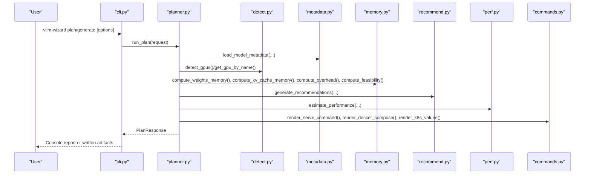
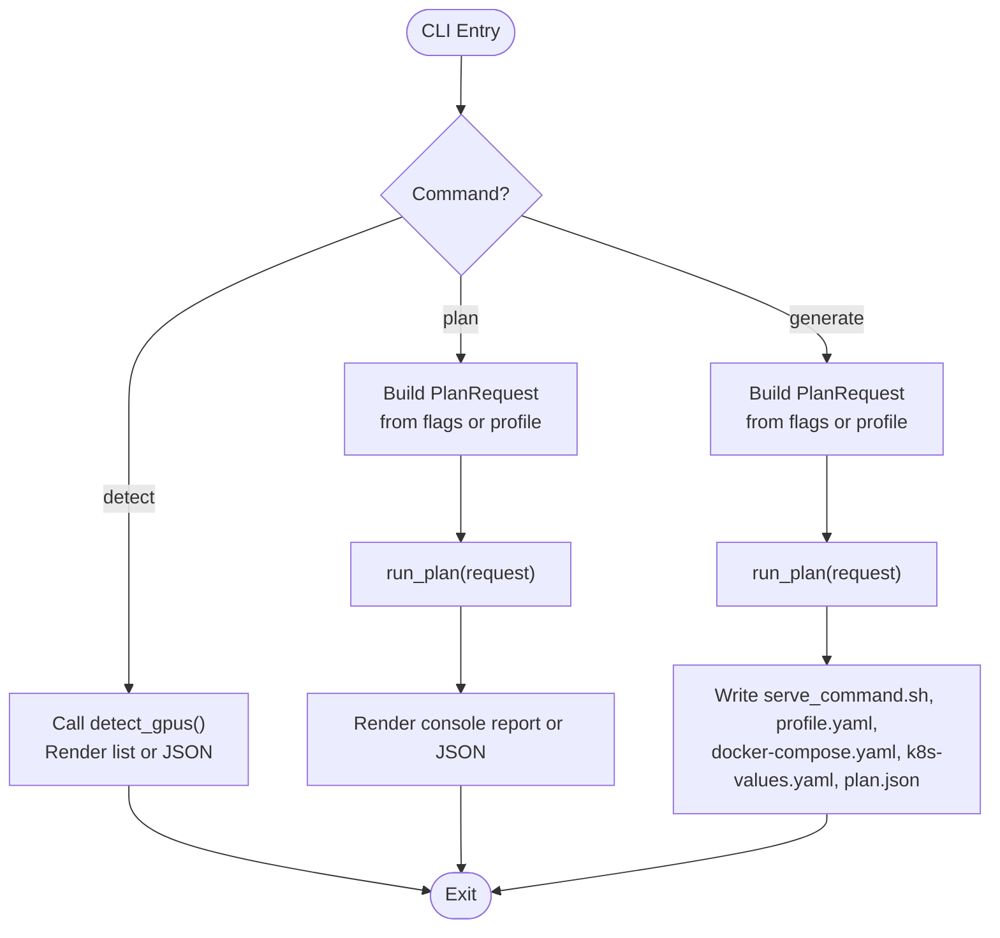
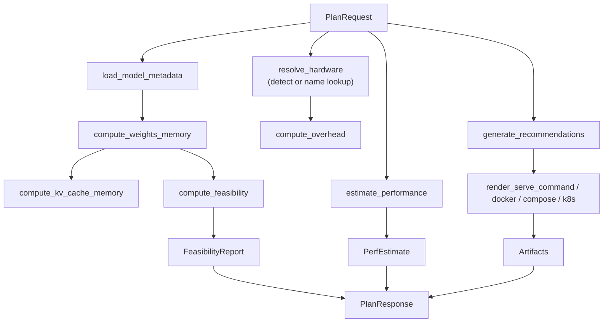
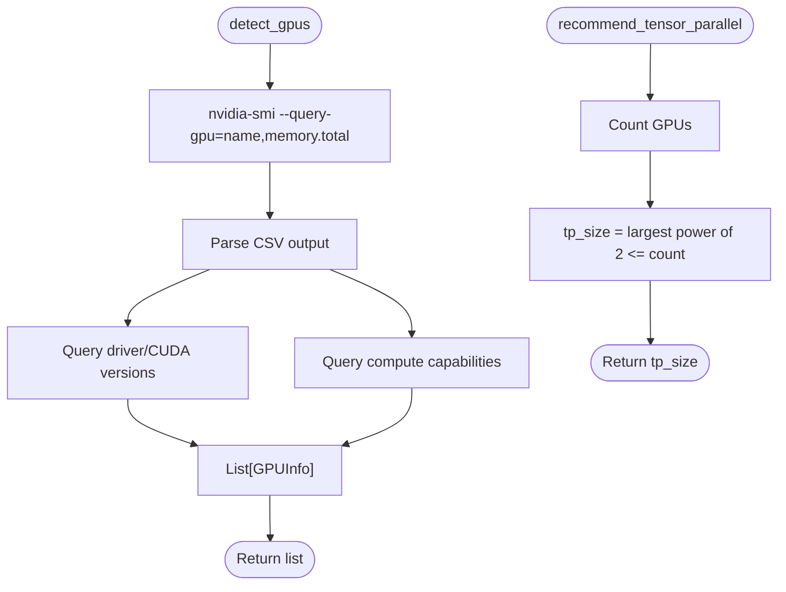
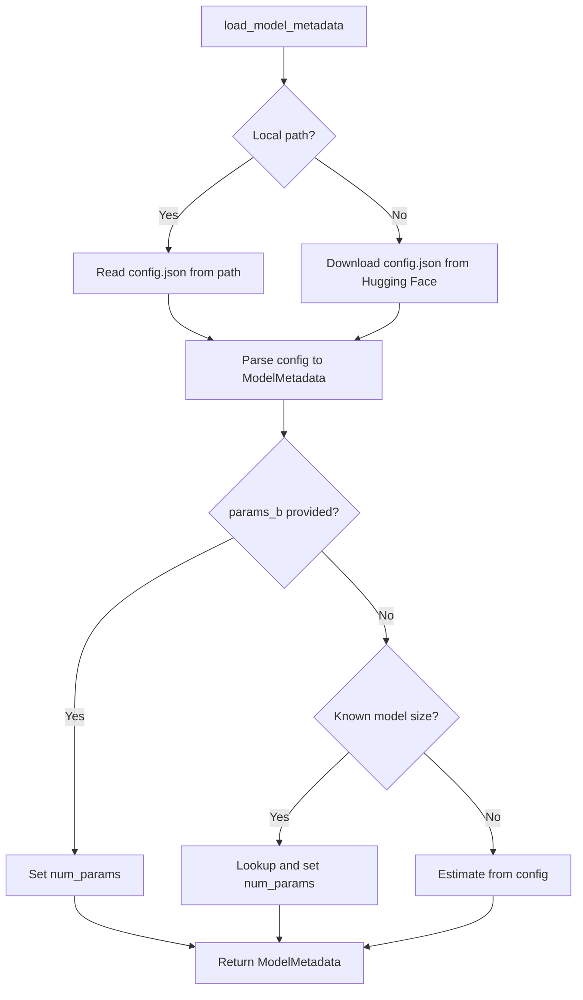
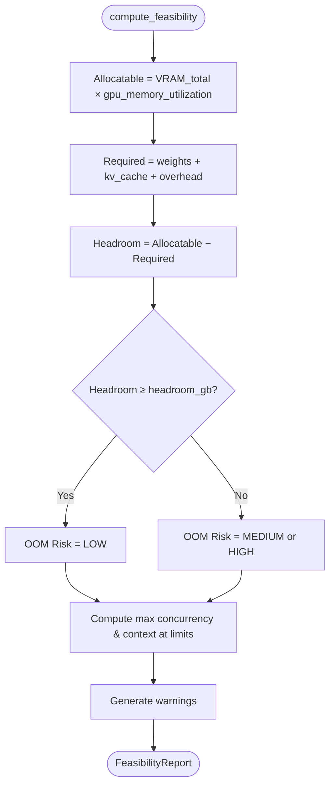
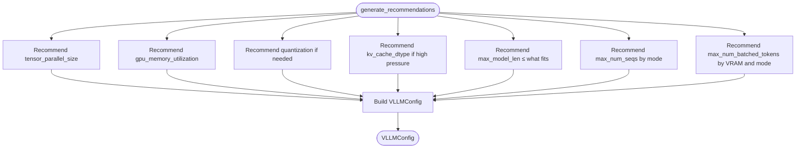
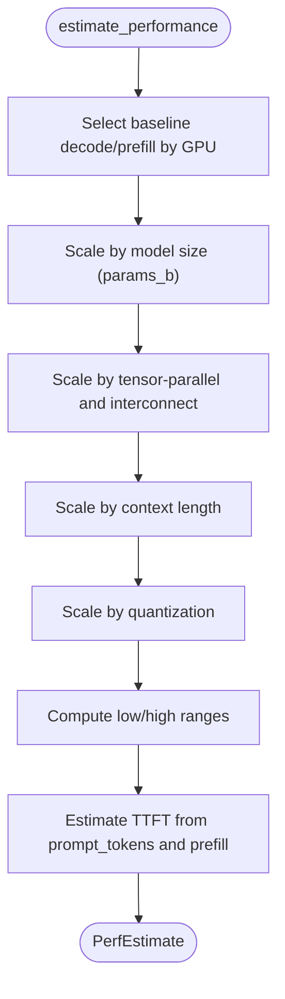
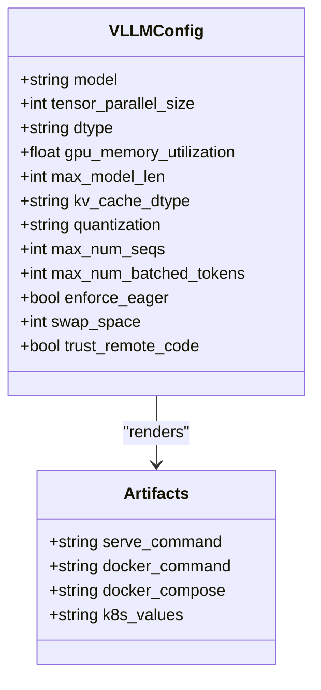
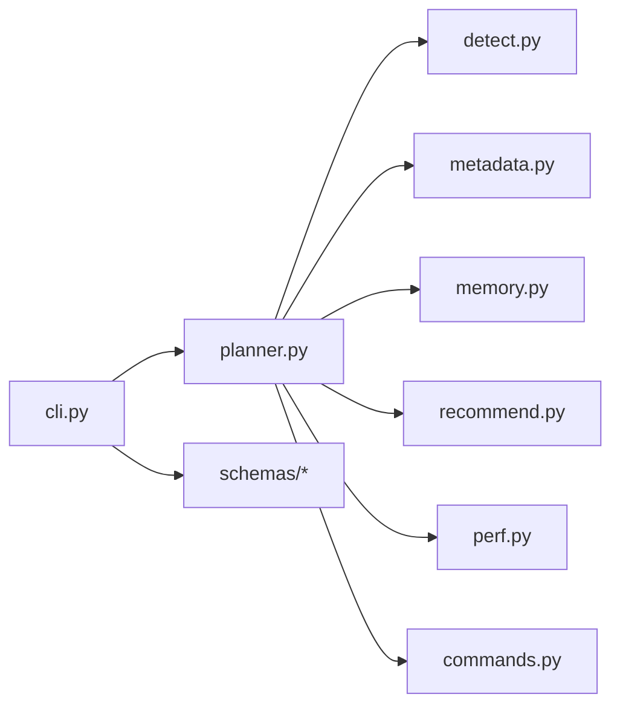

# Project Overview

<cite>
**Referenced Files in This Document**
- [README.md](file://README.md)
- [cli.py](file://src/vllm_wizard/cli.py)
- [planner.py](file://src/vllm_wizard/planning/planner.py)
- [detect.py](file://src/vllm_wizard/hardware/detect.py)
- [metadata.py](file://src/vllm_wizard/models/metadata.py)
- [memory.py](file://src/vllm_wizard/planning/memory.py)
- [recommend.py](file://src/vllm_wizard/planning/recommend.py)
- [perf.py](file://src/vllm_wizard/planning/perf.py)
- [commands.py](file://src/vllm_wizard/render/commands.py)
- [inputs.py](file://src/vllm_wizard/schemas/inputs.py)
- [outputs.py](file://src/vllm_wizard/schemas/outputs.py)
- [sample.yaml](file://examples/profiles/sample.yaml)
- [pyproject.toml](file://pyproject.toml)
</cite>

## Table of Contents
1. [Introduction](#introduction)
2. [Project Structure](#project-structure)
3. [Core Components](#core-components)
4. [Architecture Overview](#architecture-overview)
5. [Detailed Component Analysis](#detailed-component-analysis)
6. [Dependency Analysis](#dependency-analysis)
7. [Performance Considerations](#performance-considerations)
8. [Troubleshooting Guide](#troubleshooting-guide)
9. [Conclusion](#conclusion)
10. [Appendices](#appendices)

## Introduction
vLLM Config Wizard is a CLI tool designed to accelerate deployment of LLM inference using vLLM. It automates complex GPU memory calculations, generates optimized vLLM serve commands, and provides approximate performance estimates. Its core value proposition is to reduce trial-and-error in sizing and configuration by offering:
- VRAM feasibility analysis with a detailed memory breakdown
- Automated configuration generation for vLLM serve, Docker, and Kubernetes
- Heuristic performance estimation for throughput and latency
- GPU detection and tensor-parallel recommendations

It fits naturally into the AI/ML deployment workflow by helping practitioners quickly move from model selection to a working inference endpoint, while highlighting the importance of validating results on actual hardware.

## Project Structure
The project follows a modular, feature-based layout:
- CLI entrypoint and commands
- Hardware detection (via nvidia-smi) and tensor-parallel recommendation
- Model metadata extraction (local or Hugging Face)
- Planning pipeline orchestrating memory, recommendations, and performance
- Rendering of artifacts (vLLM serve command, docker-compose, Kubernetes)
- Strong typing via Pydantic schemas for inputs, outputs, and artifacts

```mermaid
graph TB
subgraph "CLI"
CLI["cli.py"]
end
subgraph "Planning"
PLAN["planner.py"]
MEM["memory.py"]
REC["recommend.py"]
PERF["perf.py"]
end
subgraph "Hardware"
DET["detect.py"]
end
subgraph "Models"
META["metadata.py"]
end
subgraph "Rendering"
CMD["commands.py"]
end
subgraph "Schemas"
INP["inputs.py"]
OUT["outputs.py"]
end
CLI --> PLAN
PLAN --> DET
PLAN --> META
PLAN --> MEM
PLAN --> REC
PLAN --> PERF
PLAN --> CMD
CLI --> INP
CLI --> OUT
PLAN --> INP
PLAN --> OUT
```

**Diagram sources**
- [cli.py](file://src/vllm_wizard/cli.py#L35-L385)
- [planner.py](file://src/vllm_wizard/planning/planner.py#L21-L172)
- [detect.py](file://src/vllm_wizard/hardware/detect.py#L10-L229)
- [metadata.py](file://src/vllm_wizard/models/metadata.py#L209-L255)
- [memory.py](file://src/vllm_wizard/planning/memory.py#L31-L367)
- [recommend.py](file://src/vllm_wizard/planning/recommend.py#L167-L333)
- [perf.py](file://src/vllm_wizard/planning/perf.py#L136-L220)
- [commands.py](file://src/vllm_wizard/render/commands.py#L6-L196)
- [inputs.py](file://src/vllm_wizard/schemas/inputs.py#L54-L110)
- [outputs.py](file://src/vllm_wizard/schemas/outputs.py#L37-L118)

**Section sources**
- [README.md](file://README.md#L1-L308)
- [pyproject.toml](file://pyproject.toml#L49-L50)

## Core Components
- CLI commands:
  - detect: lists available NVIDIA GPUs and optional versions
  - plan: computes feasibility, recommendations, and performance estimates
  - generate: writes artifacts to disk (vLLM serve command, profile, docker-compose, Kubernetes)
- Planning pipeline:
  - Orchestrates model metadata loading, hardware resolution, memory breakdown, feasibility, recommendations, and performance estimation
- Hardware detection:
  - Queries nvidia-smi for GPU inventory and versions; falls back to known GPU VRAM when detection is unavailable
- Model metadata:
  - Loads config.json from local path or Hugging Face; extracts architecture fields for memory computations
- Memory model:
  - Computes weights memory, KV cache memory, overhead, and feasibility with headroom and risk assessment
- Recommendations:
  - Selects tensor-parallel size, dtype/kv-cache dtype, max-model length, quantization, and batching parameters
- Performance estimation:
  - Heuristic ranges for decode/prefill tokens-per-second and TTFT based on GPU class, model size, TP, context, and quantization
- Artifact rendering:
  - Generates vLLM serve command, docker-compose, and Kubernetes values

**Section sources**
- [cli.py](file://src/vllm_wizard/cli.py#L62-L381)
- [planner.py](file://src/vllm_wizard/planning/planner.py#L21-L172)
- [detect.py](file://src/vllm_wizard/hardware/detect.py#L10-L229)
- [metadata.py](file://src/vllm_wizard/models/metadata.py#L209-L255)
- [memory.py](file://src/vllm_wizard/planning/memory.py#L31-L367)
- [recommend.py](file://src/vllm_wizard/planning/recommend.py#L167-L333)
- [perf.py](file://src/vllm_wizard/planning/perf.py#L136-L220)
- [commands.py](file://src/vllm_wizard/render/commands.py#L6-L196)

## Architecture Overview
The CLI commands delegate to the planning pipeline, which coordinates multiple modules. The flow below maps the actual code paths.



**Diagram sources**
- [cli.py](file://src/vllm_wizard/cli.py#L82-L381)
- [planner.py](file://src/vllm_wizard/planning/planner.py#L21-L172)
- [detect.py](file://src/vllm_wizard/hardware/detect.py#L10-L229)
- [metadata.py](file://src/vllm_wizard/models/metadata.py#L209-L255)
- [memory.py](file://src/vllm_wizard/planning/memory.py#L31-L367)
- [recommend.py](file://src/vllm_wizard/planning/recommend.py#L167-L333)
- [perf.py](file://src/vllm_wizard/planning/perf.py#L136-L220)
- [commands.py](file://src/vllm_wizard/render/commands.py#L6-L196)

## Detailed Component Analysis

### CLI and Commands
- detect: Executes GPU detection and prints either a formatted list or JSON
- plan: Builds a PlanRequest from CLI flags or a profile, runs planning, and renders a human-readable or JSON report
- generate: Runs planning and writes artifacts to disk, including a serve command script, a YAML profile, docker-compose, and Kubernetes values



**Diagram sources**
- [cli.py](file://src/vllm_wizard/cli.py#L62-L381)
- [planner.py](file://src/vllm_wizard/planning/planner.py#L21-L172)

**Section sources**
- [cli.py](file://src/vllm_wizard/cli.py#L62-L381)

### Planning Pipeline
- Orchestrates model metadata loading, hardware resolution, memory computation, feasibility, recommendations, and performance estimation
- Determines effective VRAM considering tensor-parallel groups and computes weights/kv/overhead
- Generates a VLLMConfig and artifacts



**Diagram sources**
- [planner.py](file://src/vllm_wizard/planning/planner.py#L21-L172)
- [memory.py](file://src/vllm_wizard/planning/memory.py#L31-L367)
- [recommend.py](file://src/vllm_wizard/planning/recommend.py#L167-L333)
- [perf.py](file://src/vllm_wizard/planning/perf.py#L136-L220)
- [commands.py](file://src/vllm_wizard/render/commands.py#L6-L196)

**Section sources**
- [planner.py](file://src/vllm_wizard/planning/planner.py#L21-L172)

### Hardware Detection and Tensor-Parallel Recommendation
- detect_gpus: Uses nvidia-smi to query GPU names and VRAM totals, and enriches with driver/CUDA versions and compute capability
- recommend_tensor_parallel: Picks the largest power-of-two TP size up to the number of GPUs
- get_gpu_by_name: Provides approximate VRAM for known GPU names when detection is unavailable



**Diagram sources**
- [detect.py](file://src/vllm_wizard/hardware/detect.py#L10-L229)

**Section sources**
- [detect.py](file://src/vllm_wizard/hardware/detect.py#L10-L229)

### Model Metadata Extraction
- Supports local path or Hugging Face model ID
- Extracts architecture fields (layers, hidden size, attention heads, KV heads, max position embeddings)
- Provides parameter estimation and known model size lookup



**Diagram sources**
- [metadata.py](file://src/vllm_wizard/models/metadata.py#L209-L255)

**Section sources**
- [metadata.py](file://src/vllm_wizard/models/metadata.py#L209-L255)

### Memory Model and Feasibility
- Weights memory: computed from parameters and dtype/quantization
- KV cache memory: scales with num_layers, head_dim, num_kv_heads, context length, concurrency, and fragmentation
- Overhead: base overhead plus multi-GPU communication buffers
- Feasibility: allocatable VRAM vs required (weights + KV + overhead), headroom, and OOM risk classification



**Diagram sources**
- [memory.py](file://src/vllm_wizard/planning/memory.py#L155-L271)

**Section sources**
- [memory.py](file://src/vllm_wizard/planning/memory.py#L31-L367)

### Recommendations Engine
- Tensor-parallel size: power-of-two selection respecting VRAM per GPU
- GPU memory utilization: lowered for consumer GPUs
- Quantization: recommended if configuration does not fit without it
- KV cache dtype: suggests FP8 when KV pressure is high and GPU supports it
- Batching parameters: sets max_num_seqs and max_num_batched_tokens based on mode and VRAM



**Diagram sources**
- [recommend.py](file://src/vllm_wizard/planning/recommend.py#L167-L333)

**Section sources**
- [recommend.py](file://src/vllm_wizard/planning/recommend.py#L167-L333)

### Performance Estimation
- Baselines per GPU class for decode and prefill TPS
- Scales by model size (inverse power), tensor-parallel efficiency (NVLink/PCIe), context length, and quantization
- Produces ranges and explicit assumptions



**Diagram sources**
- [perf.py](file://src/vllm_wizard/planning/perf.py#L136-L220)

**Section sources**
- [perf.py](file://src/vllm_wizard/planning/perf.py#L136-L220)

### Artifact Rendering
- vLLM serve command: builds a copy-paste friendly command with recommended flags
- docker-compose: reserves GPUs, mounts cache, exposes port, passes vLLM args
- Kubernetes: minimal values for args and GPU resource requests



**Diagram sources**
- [outputs.py](file://src/vllm_wizard/schemas/outputs.py#L57-L101)
- [commands.py](file://src/vllm_wizard/render/commands.py#L6-L196)

**Section sources**
- [commands.py](file://src/vllm_wizard/render/commands.py#L6-L196)

### Practical Examples
- Single GPU setup: plan a 7B model on an RTX 4090 with a target context and concurrency
- Multi-GPU with tensor-parallel: plan a 70B model across 4x A100 with NVLink and a reduced context
- Quantized model: plan an AWQ 70B model on a single RTX 4090 with a shorter context

These examples demonstrate how the wizard translates user intent into feasible configurations and artifacts.

**Section sources**
- [README.md](file://README.md#L241-L277)

## Dependency Analysis
The CLI depends on the planning pipeline, which in turn depends on hardware detection, model metadata, memory computations, recommendations, and performance estimation. Rendering depends on the recommended configuration.



**Diagram sources**
- [cli.py](file://src/vllm_wizard/cli.py#L12-L21)
- [planner.py](file://src/vllm_wizard/planning/planner.py#L5-L18)

**Section sources**
- [pyproject.toml](file://pyproject.toml#L29-L35)

## Performance Considerations
- VRAM feasibility is the primary constraint; the wizard emphasizes allocating within gpu_memory_utilization and maintaining headroom
- KV cache dominates memory for long contexts and high concurrency; fragmentation factor further increases usage
- Quantization reduces weights memory footprint and can improve throughput modestly
- Tensor-parallel improves throughput but adds communication overhead; NVLink yields better scaling than PCIe
- Heuristic performance estimates should be validated with real benchmarks; throughput depends on batching, request patterns, and vLLM/kernel versions

[No sources needed since this section provides general guidance]

## Troubleshooting Guide
Common issues and resolutions:
- No GPUs detected:
  - Ensure nvidia-smi is installed and accessible
  - The tool continues if manual VRAM and GPU count are provided
- Missing model metadata:
  - Provide --params-b or use a local config.json
  - For Hugging Face models, ensure config.json exists in the repo
- Fit vs not fit:
  - Reduce context length, concurrency, or enable quantization
  - Lower gpu_memory_utilization or increase headroom_gb
- Performance expectations:
  - Estimates are heuristic; validate with targeted benchmarks
  - Adjust batching mode and max_num_batched_tokens for workload characteristics

**Section sources**
- [planner.py](file://src/vllm_wizard/planning/planner.py#L41-L46)
- [metadata.py](file://src/vllm_wizard/models/metadata.py#L110-L130)
- [README.md](file://README.md#L177-L191)

## Conclusion
vLLM Config Wizard accelerates production-ready LLM inference by automating VRAM feasibility, generating optimized configurations, and providing heuristic performance insights. It integrates seamlessly into the AI/ML deployment workflow, enabling practitioners to confidently size hardware, select quantization strategies, and choose tensor-parallel configurations tailored to their models and workloads.

[No sources needed since this section summarizes without analyzing specific files]

## Appendices

### Position in the LLM Inference Ecosystem
- Pre-deployment sizing and configuration
- vLLM serve command generation and containerization
- Baseline performance estimation for planning and cost modeling
- Profile-driven reproducibility and sharing

[No sources needed since this section provides general context]

### Example Profile Schema
Profiles capture model, hardware, workload, and policy settings for reproducible planning and regeneration of artifacts.

**Section sources**
- [sample.yaml](file://examples/profiles/sample.yaml#L1-L40)