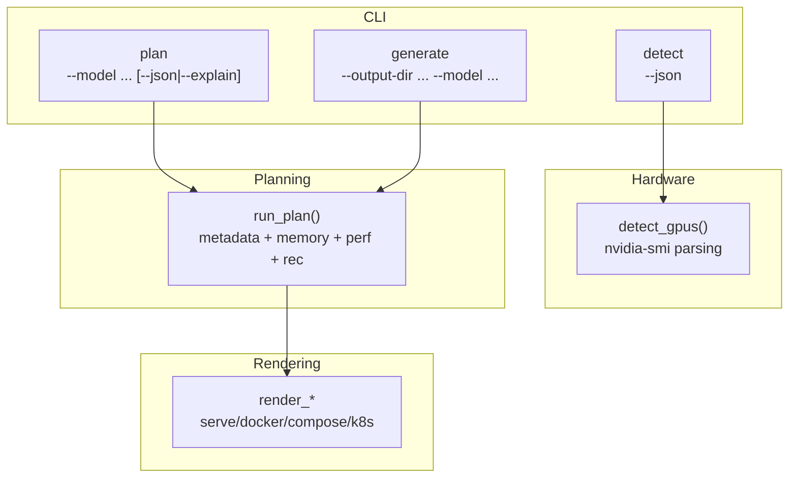
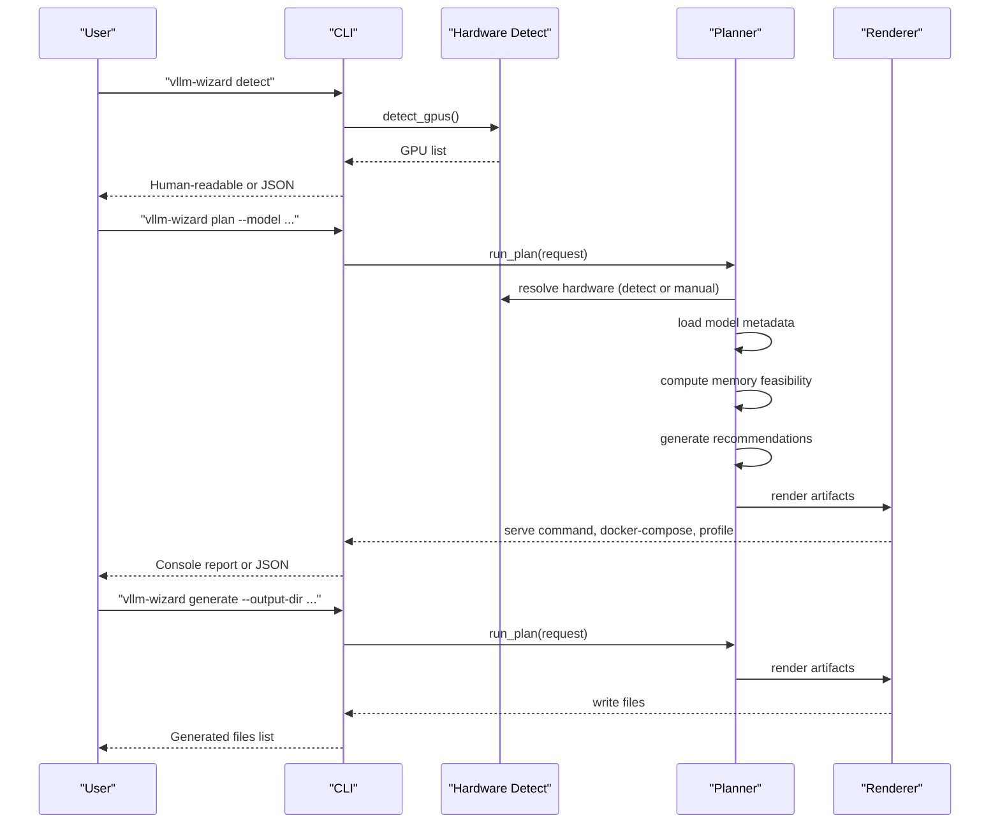
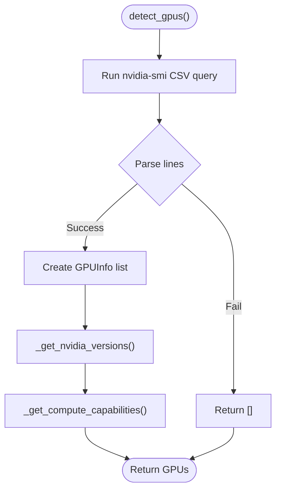
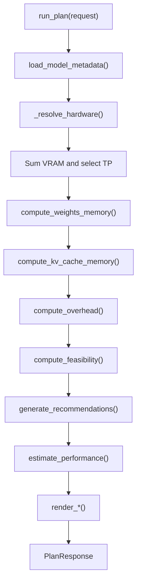
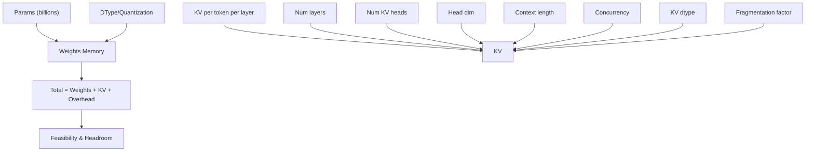
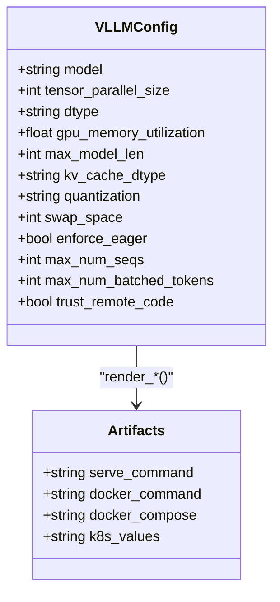
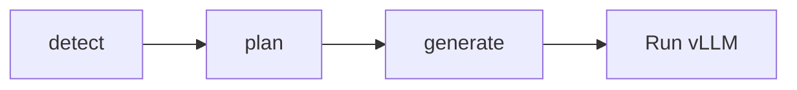
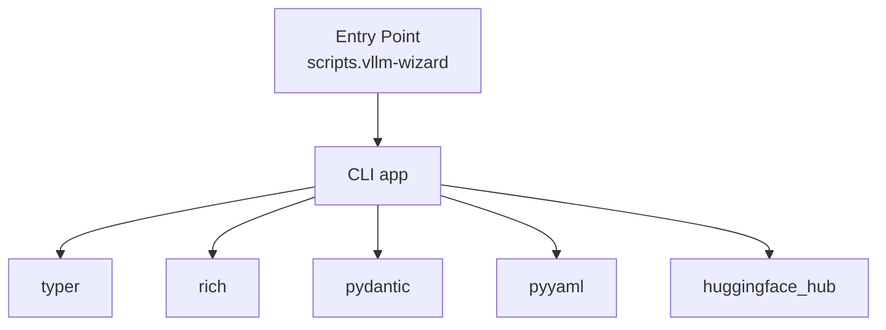
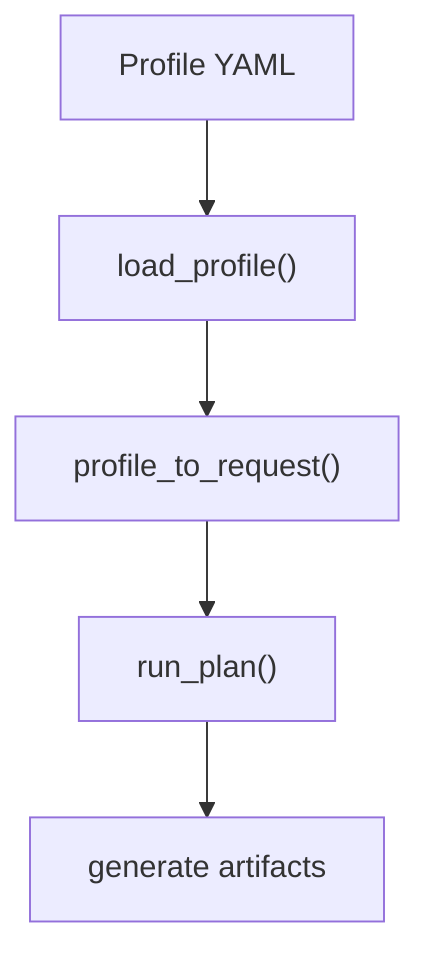

# Quick Start Guide

<cite>
**Referenced Files in This Document**
- [README.md](file://README.md)
- [cli.py](file://src/vllm_wizard/cli.py)
- [detect.py](file://src/vllm_wizard/hardware/detect.py)
- [planner.py](file://src/vllm_wizard/planning/planner.py)
- [memory.py](file://src/vllm_wizard/planning/memory.py)
- [metadata.py](file://src/vllm_wizard/models/metadata.py)
- [commands.py](file://src/vllm_wizard/render/commands.py)
- [report.py](file://src/vllm_wizard/render/report.py)
- [inputs.py](file://src/vllm_wizard/schemas/inputs.py)
- [outputs.py](file://src/vllm_wizard/schemas/outputs.py)
- [sample.yaml](file://examples/profiles/sample.yaml)
- [pyproject.toml](file://pyproject.toml)
</cite>

## Table of Contents
1. [Introduction](#introduction)
2. [Project Structure](#project-structure)
3. [Core Components](#core-components)
4. [Architecture Overview](#architecture-overview)
5. [Detailed Component Analysis](#detailed-component-analysis)
6. [Dependency Analysis](#dependency-analysis)
7. [Performance Considerations](#performance-considerations)
8. [Troubleshooting Guide](#troubleshooting-guide)
9. [Conclusion](#conclusion)
10. [Appendices](#appendices)

## Introduction
This quick start guide helps you become productive with vLLM Config Wizard immediately. You will learn:
- How to detect GPUs on your system
- How to plan configurations for single and multi-GPU setups
- How to generate artifacts (serve command, profiles, docker-compose)
- Practical examples for quantized models
- When to use each command (detect, plan, generate)
- Troubleshooting common beginner mistakes

The tool reads your model, hardware, and workload requirements, then computes VRAM feasibility, recommends optimal vLLM settings, and estimates performance.

## Project Structure
At a high level, the CLI orchestrates three main stages:
- Hardware detection
- Planning (memory feasibility, performance estimates, recommendations)
- Artifact generation (serve command, docker-compose, profile, JSON)

**Diagram sources**
- [cli.py](file://src/vllm_wizard/cli.py#L62-L213)
- [detect.py](file://src/vllm_wizard/hardware/detect.py#L10-L72)
- [planner.py](file://src/vllm_wizard/planning/planner.py#L21-L136)
- [commands.py](file://src/vllm_wizard/render/commands.py#L6-L196)

**Section sources**
- [README.md](file://README.md#L1-L308)
- [cli.py](file://src/vllm_wizard/cli.py#L35-L385)

## Core Components
- CLI commands: detect, plan, generate
- Hardware detection: parses nvidia-smi output and falls back to known GPU specs
- Planning: loads model metadata, computes VRAM feasibility, generates recommendations, estimates performance
- Rendering: produces vLLM serve command, docker-compose, and profile YAML

Key entry points:
- CLI entrypoint registers commands and routes to planning/rendering
- Hardware detection runs via nvidia-smi or known GPU lookup
- Planning orchestrates memory computations and performance estimation
- Rendering builds artifacts from the recommendation

**Section sources**
- [cli.py](file://src/vllm_wizard/cli.py#L62-L213)
- [detect.py](file://src/vllm_wizard/hardware/detect.py#L10-L72)
- [planner.py](file://src/vllm_wizard/planning/planner.py#L21-L136)
- [commands.py](file://src/vllm_wizard/render/commands.py#L6-L196)

## Architecture Overview
The workflow for each command:

**Diagram sources**
- [cli.py](file://src/vllm_wizard/cli.py#L62-L213)
- [detect.py](file://src/vllm_wizard/hardware/detect.py#L10-L72)
- [planner.py](file://src/vllm_wizard/planning/planner.py#L21-L136)
- [commands.py](file://src/vllm_wizard/render/commands.py#L6-L196)

## Detailed Component Analysis

### Command: detect
Purpose: Auto-detect NVIDIA GPUs and print a human-friendly or JSON list.

- Uses nvidia-smi to query GPU name and total memory
- Optionally fetches driver/CUDA versions and compute capability
- Fallback to known GPU VRAM when detection fails

Common usage:
- Detect GPUs: vllm-wizard detect
- JSON output: vllm-wizard detect --json

When to use:
- First step on a new machine to confirm GPU availability and VRAM
- Verify driver and CUDA versions

**Section sources**
- [cli.py](file://src/vllm_wizard/cli.py#L62-L80)
- [detect.py](file://src/vllm_wizard/hardware/detect.py#L10-L72)

### Command: plan
Purpose: Compute feasibility, recommendations, and performance estimates.

Inputs (highlights):
- Model: --model, --revision, --dtype, --quantization, --kv-cache-dtype, --max-model-len, --params-b
- Hardware: --gpu, --gpus, --vram-gb, --interconnect, --tensor-parallel-size
- Workload: --prompt-tokens, --gen-tokens, --concurrency, --batching-mode
- Policy: --gpu-memory-utilization, --overhead-gb, --fragmentation-factor, --headroom-gb
- Output: --profile, --json, --explain

Outputs:
- VRAM breakdown (weights, KV cache, overhead, headroom)
- OOM risk classification
- Recommended vLLM config
- Performance estimates (decode, prefill, TTFT)
- Serve command

When to use:
- Before generating artifacts
- To explore trade-offs (context length, concurrency, quantization)
- To script or integrate with CI/CD (--json)

Examples:
- Single GPU: vllm-wizard plan --model meta-llama/Llama-2-7b-hf --gpu "RTX 4090" --max-model-len 4096 --concurrency 2
- Multi-GPU: vllm-wizard plan --model meta-llama/Llama-2-70b-hf --gpu "A100 80GB" --gpus 4 --tensor-parallel-size 4 --interconnect nvlink --max-model-len 4096
- Quantized: vllm-wizard plan --model TheBloke/Llama-2-70B-AWQ --gpu "RTX 4090" --quantization awq --max-model-len 2048

**Section sources**
- [cli.py](file://src/vllm_wizard/cli.py#L82-L213)
- [README.md](file://README.md#L241-L277)

### Command: generate
Purpose: Generate artifacts to disk (serve command, profile, docker-compose, k8s).

Inputs:
- All plan options plus --output-dir and --emit (comma-separated: command,profile,compose,k8s)

Behavior:
- Runs planning internally
- Writes files into --output-dir
- Prints a summary of generated files and VRAM fit status

When to use:
- After planning to produce runnable artifacts
- To share reproducible configurations

Example:
- vllm-wizard generate --output-dir ./vllm-config --model meta-llama/Llama-2-7b-hf --gpu "A100 80GB" --emit command,profile,compose

**Section sources**
- [cli.py](file://src/vllm_wizard/cli.py#L215-L381)
- [README.md](file://README.md#L64-L88)

### Hardware Detection Internals
- Parses nvidia-smi CSV output for GPU name and memory
- Attempts to extract driver version, CUDA version, and compute capability
- Recommends tensor-parallel size as the largest power of two ≤ number of GPUs
- Provides approximate VRAM for known GPU names when detection fails

**Diagram sources**
- [detect.py](file://src/vllm_wizard/hardware/detect.py#L10-L72)

**Section sources**
- [detect.py](file://src/vllm_wizard/hardware/detect.py#L10-L72)

### Planning Pipeline Internals
- Loads model metadata (config.json) from local path or Hugging Face
- Resolves hardware (auto-detect, known GPU, or manual VRAM)
- Computes weights memory, KV cache memory, and overhead
- Determines feasibility and headroom; classifies OOM risk
- Generates recommendations (tensor-parallel size, max model length, etc.)
- Estimates performance (heuristic)
- Renders artifacts (serve command, docker-compose, etc.)

**Diagram sources**
- [planner.py](file://src/vllm_wizard/planning/planner.py#L21-L136)
- [memory.py](file://src/vllm_wizard/planning/memory.py#L31-L153)
- [metadata.py](file://src/vllm_wizard/models/metadata.py#L209-L255)
- [commands.py](file://src/vllm_wizard/render/commands.py#L6-L196)

**Section sources**
- [planner.py](file://src/vllm_wizard/planning/planner.py#L21-L136)
- [memory.py](file://src/vllm_wizard/planning/memory.py#L31-L153)
- [metadata.py](file://src/vllm_wizard/models/metadata.py#L209-L255)
- [commands.py](file://src/vllm_wizard/render/commands.py#L6-L196)

### VRAM Memory Model
- Weights memory depends on parameter count and dtype/quantization
- KV cache memory depends on model architecture (heads, layers, head_dim), context length, concurrency, and KV dtype
- Overhead includes base overhead and inter-GPU communication buffers
- Feasibility checks allocatable VRAM vs. required components and headroom

**Diagram sources**
- [memory.py](file://src/vllm_wizard/planning/memory.py#L31-L153)

**Section sources**
- [memory.py](file://src/vllm_wizard/planning/memory.py#L31-L153)
- [README.md](file://README.md#L160-L214)

### Artifact Rendering Internals
- vLLM serve command: builds arguments from recommended config
- Docker run and docker-compose: mounts Hugging Face cache and reserves GPUs
- Kubernetes values: sets resource requests/limits for GPU

**Diagram sources**
- [outputs.py](file://src/vllm_wizard/schemas/outputs.py#L57-L101)
- [commands.py](file://src/vllm_wizard/render/commands.py#L6-L196)

**Section sources**
- [commands.py](file://src/vllm_wizard/render/commands.py#L6-L196)
- [outputs.py](file://src/vllm_wizard/schemas/outputs.py#L57-L101)

### Practical Tutorials

#### Tutorial 1: GPU Detection
Goal: Confirm your GPUs and VRAM.

Steps:
1. Run: vllm-wizard detect
2. If you want JSON for automation: vllm-wizard detect --json

Tip: If no GPUs are detected, ensure nvidia-smi is installed and drivers are loaded.

**Section sources**
- [cli.py](file://src/vllm_wizard/cli.py#L62-L80)
- [detect.py](file://src/vllm_wizard/hardware/detect.py#L10-L72)

#### Tutorial 2: Basic Model Planning
Goal: Plan a configuration for a single GPU.

Steps:
1. Detect GPUs: vllm-wizard detect
2. Plan: vllm-wizard plan --model meta-llama/Llama-2-7b-hf --gpu "RTX 4090" --max-model-len 4096 --concurrency 2
3. Review the VRAM breakdown and OOM risk
4. Optionally: vllm-wizard plan --model ... --json for scripting

Tip: Adjust --prompt-tokens and --gen-tokens to reflect your workload.

**Section sources**
- [cli.py](file://src/vllm_wizard/cli.py#L82-L213)
- [README.md](file://README.md#L241-L252)

#### Tutorial 3: Configuration Generation
Goal: Generate runnable artifacts.

Steps:
1. Plan: vllm-wizard plan --model meta-llama/Llama-2-7b-hf --gpu "A100 80GB" --max-model-len 4096
2. Generate: vllm-wizard generate --output-dir ./vllm-config --model ... --emit command,profile,compose
3. Inspect the generated files and run the serve command or docker-compose up

Tip: Use --emit compose,k8s for container orchestration environments.

**Section sources**
- [cli.py](file://src/vllm_wizard/cli.py#L215-L381)
- [README.md](file://README.md#L64-L88)

#### Example: Single GPU Setup
- Plan: vllm-wizard plan --model meta-llama/Llama-2-7b-hf --gpu "RTX 4090" --max-model-len 4096 --concurrency 2
- Generate: vllm-wizard generate --output-dir ./vllm-config --model ... --gpu "RTX 4090"

**Section sources**
- [README.md](file://README.md#L243-L252)

#### Example: Multi-GPU with Tensor Parallelism
- Plan: vllm-wizard plan --model meta-llama/Llama-2-70b-hf --gpu "A100 80GB" --gpus 4 --tensor-parallel-size 4 --interconnect nvlink --max-model-len 4096
- Generate: vllm-wizard generate --output-dir ./vllm-config --model ... --emit command,profile,compose

**Section sources**
- [README.md](file://README.md#L254-L266)

#### Example: Quantized Model
- Plan: vllm-wizard plan --model TheBloke/Llama-2-70B-AWQ --gpu "RTX 4090" --quantization awq --max-model-len 2048
- Generate: vllm-wizard generate --output-dir ./vllm-config --model ... --quantization awq

**Section sources**
- [README.md](file://README.md#L267-L277)

### Conceptual Overview
- Use detect to verify hardware
- Use plan to explore feasibility and recommendations
- Use generate to produce runnable artifacts

[No sources needed since this diagram shows conceptual workflow, not actual code structure]

## Dependency Analysis
External dependencies and entry point:
- CLI entrypoint registered as vllm-wizard
- Dependencies include pydantic, typer, rich, pyyaml, huggingface_hub

**Diagram sources**
- [pyproject.toml](file://pyproject.toml#L49-L50)
- [cli.py](file://src/vllm_wizard/cli.py#L8-L21)

**Section sources**
- [pyproject.toml](file://pyproject.toml#L29-L47)
- [cli.py](file://src/vllm_wizard/cli.py#L8-L21)

## Performance Considerations
- Performance estimates are heuristic and depend on GPU, model size, TP, and workload characteristics
- Actual throughput/latency vary by environment; always benchmark your workload
- Use --batching-mode to optimize for throughput, latency, or balanced scenarios
- Consider quantization to reduce memory footprint and potentially improve speed

[No sources needed since this section provides general guidance]

## Troubleshooting Guide
Common beginner mistakes and fixes:
- No GPUs detected
  - Cause: nvidia-smi not installed or drivers not loaded
  - Fix: Install NVIDIA drivers and ensure nvidia-smi is available
  - Verify: vllm-wizard detect
- Model not found or config.json missing
  - Cause: Incorrect model ID or missing config.json
  - Fix: Use a valid Hugging Face model ID or provide a local path with config.json
- VRAM does not fit
  - Cause: Large model, long context, or high concurrency
  - Fix: Reduce context length, concurrency, or enable quantization; use FP8 KV cache if supported
- Unexpected errors
  - Cause: Missing optional dependencies or invalid options
  - Fix: Reinstall with development/web extras if needed; check option defaults and ranges

**Section sources**
- [cli.py](file://src/vllm_wizard/cli.py#L204-L212)
- [detect.py](file://src/vllm_wizard/hardware/detect.py#L65-L71)
- [metadata.py](file://src/vllm_wizard/models/metadata.py#L86-L100)

## Conclusion
You now have the essentials to get started quickly:
- Detect GPUs, plan configurations, and generate artifacts
- Explore single GPU, multi-GPU, and quantized model setups
- Use --json for automation and --explain for learning
- Benchmark and iterate based on your workload

[No sources needed since this section summarizes without analyzing specific files]

## Appendices

### Appendix A: Command Reference
- vllm-wizard detect
  - Purpose: Detect and display available NVIDIA GPUs
  - Options: --json
- vllm-wizard plan
  - Purpose: Compute feasibility, recommendations, and performance estimates
  - Options: model, hardware, workload, policy, output
- vllm-wizard generate
  - Purpose: Generate artifacts to disk
  - Options: all plan options plus --output-dir and --emit

**Section sources**
- [README.md](file://README.md#L90-L159)
- [cli.py](file://src/vllm_wizard/cli.py#L62-L381)

### Appendix B: Profile Format
Profiles capture your planning choices for reuse and sharing.

**Diagram sources**
- [cli.py](file://src/vllm_wizard/cli.py#L156-L193)
- [sample.yaml](file://examples/profiles/sample.yaml#L1-L40)

**Section sources**
- [README.md](file://README.md#L215-L240)
- [sample.yaml](file://examples/profiles/sample.yaml#L1-L40)