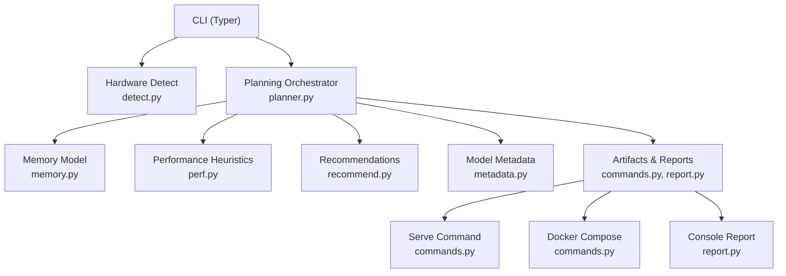
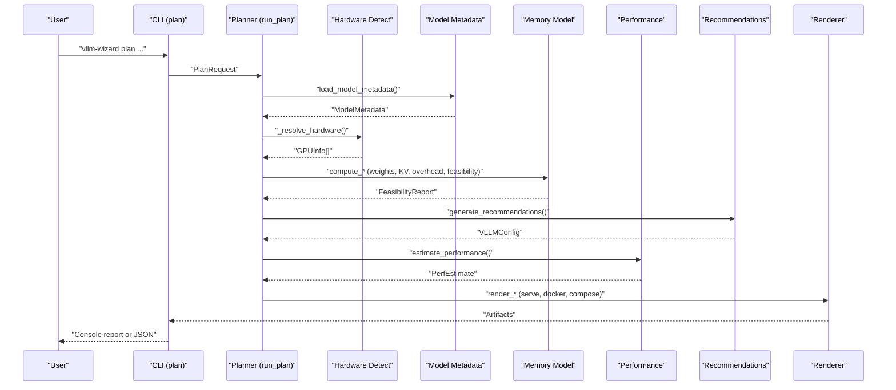
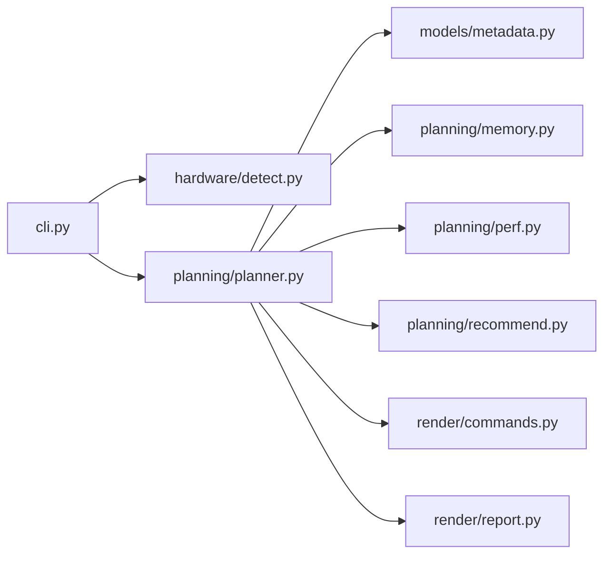

# Quick Start Guide

<cite>
**Referenced Files in This Document**
- [README.md](file://README.md)
- [cli.py](file://src/vllm_wizard/cli.py)
- [detect.py](file://src/vllm_wizard/hardware/detect.py)
- [planner.py](file://src/vllm_wizard/planning/planner.py)
- [memory.py](file://src/vllm_wizard/planning/memory.py)
- [perf.py](file://src/vllm_wizard/planning/perf.py)
- [recommend.py](file://src/vllm_wizard/planning/recommend.py)
- [commands.py](file://src/vllm_wizard/render/commands.py)
- [report.py](file://src/vllm_wizard/render/report.py)
- [inputs.py](file://src/vllm_wizard/schemas/inputs.py)
- [outputs.py](file://src/vllm_wizard/schemas/outputs.py)
- [metadata.py](file://src/vllm_wizard/models/metadata.py)
- [sample.yaml](file://examples/profiles/sample.yaml)
</cite>

## Table of Contents
1. [Introduction](#introduction)
2. [Project Structure](#project-structure)
3. [Core Components](#core-components)
4. [Architecture Overview](#architecture-overview)
5. [Detailed Component Analysis](#detailed-component-analysis)
6. [Dependency Analysis](#dependency-analysis)
7. [Performance Considerations](#performance-considerations)
8. [Troubleshooting Guide](#troubleshooting-guide)
9. [Conclusion](#conclusion)
10. [Appendices](#appendices)

## Introduction
This Quick Start Guide walks you through the end-to-end workflow of the vLLM Config Wizard: detecting GPUs, planning configurations, and generating artifacts. It includes step-by-step tutorials for:
- Single GPU setups with Llama-2-7b-hf
- Multi-GPU setups with tensor parallelism using Llama-2-70b-hf
- Quantized model scenarios with AWQ

Each step explains the purpose, shows practical command-line examples, and provides guidance on interpreting results and verifying outcomes before deployment.

## Project Structure
The tool is organized around a CLI entrypoint that orchestrates GPU detection, planning, and artifact generation. Key modules include:
- CLI commands for detect, plan, and generate
- Hardware detection via nvidia-smi
- Planning pipeline computing feasibility, recommendations, and performance
- Rendering of serve commands, docker-compose, and reports

**Diagram sources**
- [cli.py](file://src/vllm_wizard/cli.py#L62-L381)
- [detect.py](file://src/vllm_wizard/hardware/detect.py#L10-L72)
- [planner.py](file://src/vllm_wizard/planning/planner.py#L21-L136)
- [memory.py](file://src/vllm_wizard/planning/memory.py#L31-L367)
- [perf.py](file://src/vllm_wizard/planning/perf.py#L136-L220)
- [recommend.py](file://src/vllm_wizard/planning/recommend.py#L167-L333)
- [commands.py](file://src/vllm_wizard/render/commands.py#L6-L196)
- [report.py](file://src/vllm_wizard/render/report.py#L14-L272)

**Section sources**
- [README.md](file://README.md#L1-L308)
- [cli.py](file://src/vllm_wizard/cli.py#L35-L385)

## Core Components
- CLI entrypoint defines commands: detect, plan, generate, and version callback.
- Hardware detection uses nvidia-smi to list GPUs and versions; falls back to known GPU VRAM if detection fails.
- Planning computes VRAM feasibility, generates recommendations, and estimates performance.
- Rendering produces vLLM serve command, docker-compose, and human-readable console reports.

Key responsibilities:
- detect: returns GPU list or JSON
- plan: computes feasibility, config, performance, and artifacts
- generate: writes artifacts to disk and prints next steps

**Section sources**
- [cli.py](file://src/vllm_wizard/cli.py#L62-L381)
- [detect.py](file://src/vllm_wizard/hardware/detect.py#L10-L72)
- [planner.py](file://src/vllm_wizard/planning/planner.py#L21-L136)

## Architecture Overview
The planning pipeline integrates model metadata, hardware detection, memory modeling, recommendation logic, and performance heuristics to produce a feasible vLLM configuration and artifacts.

**Diagram sources**
- [cli.py](file://src/vllm_wizard/cli.py#L82-L213)
- [planner.py](file://src/vllm_wizard/planning/planner.py#L21-L136)
- [detect.py](file://src/vllm_wizard/hardware/detect.py#L138-L172)
- [metadata.py](file://src/vllm_wizard/models/metadata.py#L209-L255)
- [memory.py](file://src/vllm_wizard/planning/memory.py#L155-L271)
- [recommend.py](file://src/vllm_wizard/planning/recommend.py#L167-L333)
- [perf.py](file://src/vllm_wizard/planning/perf.py#L136-L220)
- [commands.py](file://src/vllm_wizard/render/commands.py#L6-L196)

## Detailed Component Analysis

### Step 1: GPU Detection
Purpose: Automatically discover available NVIDIA GPUs and their VRAM, driver, and CUDA versions. If detection fails, you can still proceed by specifying GPU and VRAM manually.

- Command: vllm-wizard detect
- Optional: --json for machine-readable output

What it does:
- Runs nvidia-smi to query GPU names and memory totals
- Parses driver and CUDA versions from nvidia-smi output
- Attempts to infer compute capability per GPU
- Falls back to known GPU VRAM values if detection fails

Expected outputs:
- Human-friendly table of GPUs with VRAM (GiB), driver, and CUDA
- JSON output when --json is used

Common issues:
- nvidia-smi not installed or not in PATH
- No NVIDIA GPUs present
- Timeout or permission errors

Verification tips:
- Ensure nvidia-smi returns a non-empty list
- Confirm VRAM values match your hardware
- If using containers, ensure GPU drivers are accessible

**Section sources**
- [detect.py](file://src/vllm_wizard/hardware/detect.py#L10-L72)
- [detect.py](file://src/vllm_wizard/hardware/detect.py#L138-L172)
- [report.py](file://src/vllm_wizard/render/report.py#L241-L272)
- [README.md](file://README.md#L26-L36)

### Step 2: Basic Planning (Single GPU Llama-2-7b-hf)
Purpose: Compute feasibility, recommended configuration, and performance estimates for a single GPU setup.

Workflow:
1. Detect GPUs (or skip if you already know your hardware)
2. Run plan with model metadata and workload parameters
3. Review console report and warnings

Example command:
- vllm-wizard plan --model meta-llama/Llama-2-7b-hf --gpu "RTX 4090" --max-model-len 4096 --concurrency 2

What happens:
- Loads model metadata (config.json) from Hugging Face or local path
- Resolves hardware (auto-detect or manual)
- Computes weights, KV cache, overhead, and feasibility
- Generates recommendations (dtype, TP size, KV cache dtype, quantization, max model length)
- Estimates performance (decode TPS, prefill TPS, TTFT)

Interpreting results:
- Feasibility: Fits or Does Not Fit; OOM risk (Low/Medium/High)
- VRAM breakdown: Weights, KV cache, overhead, headroom
- Recommendations: vLLM parameters and explanations
- Performance: Approximate ranges with assumptions

Verification:
- Confirm headroom is adequate (≥ 1 GiB recommended)
- Review warnings for KV cache pressure or high OOM risk
- Adjust context length or concurrency if needed

**Section sources**
- [cli.py](file://src/vllm_wizard/cli.py#L82-L213)
- [planner.py](file://src/vllm_wizard/planning/planner.py#L21-L136)
- [metadata.py](file://src/vllm_wizard/models/metadata.py#L209-L255)
- [memory.py](file://src/vllm_wizard/planning/memory.py#L155-L271)
- [recommend.py](file://src/vllm_wizard/planning/recommend.py#L167-L333)
- [perf.py](file://src/vllm_wizard/planning/perf.py#L136-L220)
- [report.py](file://src/vllm_wizard/render/report.py#L14-L272)
- [README.md](file://README.md#L243-L252)

### Step 3: Multi-GPU with Tensor Parallelism (Llama-2-70b-hf)
Purpose: Scale to multiple GPUs using tensor parallelism for larger models.

Workflow:
1. Ensure you have sufficient GPUs (e.g., 4x A100 80GB)
2. Specify --gpus and --tensor-parallel-size
3. Optionally set --interconnect to NVLink for better scaling
4. Review feasibility and recommendations

Example command:
- vllm-wizard plan --model meta-llama/Llama-2-70b-hf --gpu "A100 80GB" --gpus 4 --tensor-parallel-size 4 --interconnect nvlink --max-model-len 4096

What happens:
- Recommends TP size based on available GPUs (power-of-two up to number of GPUs)
- Splits model weights across GPUs
- Adjusts KV cache and overhead accordingly
- Estimates performance with TP scaling and interconnect efficiency

Verification:
- Confirm TP size fits model weights per GPU
- Check interconnect impact on throughput
- Validate headroom remains positive

**Section sources**
- [planner.py](file://src/vllm_wizard/planning/planner.py#L138-L172)
- [detect.py](file://src/vllm_wizard/hardware/detect.py#L138-L159)
- [recommend.py](file://src/vllm_wizard/planning/recommend.py#L42-L68)
- [perf.py](file://src/vllm_wizard/planning/perf.py#L83-L105)
- [README.md](file://README.md#L254-L265)

### Step 4: Quantized Model Scenario (AWQ)
Purpose: Reduce memory footprint using quantization for models that do not fit in VRAM.

Workflow:
1. Choose a quantization method (e.g., AWQ)
2. Run plan with quantization enabled
3. Review feasibility and warnings

Example command:
- vllm-wizard plan --model TheBloke/Llama-2-70B-AWQ --gpu "RTX 4090" --quantization awq --max-model-len 2048

What happens:
- Reduces weights memory using quantization bytes-per-parameter
- Recomputes feasibility and KV cache allocation
- May recommend FP8 KV cache if GPU supports it and KV pressure is high

Verification:
- Confirm OOM risk drops to Low or Medium
- Check KV cache pressure and FP8 KV cache recommendation
- Adjust context length or concurrency if needed

**Section sources**
- [recommend.py](file://src/vllm_wizard/planning/recommend.py#L88-L122)
- [memory.py](file://src/vllm_wizard/planning/memory.py#L19-L25)
- [README.md](file://README.md#L267-L276)

### Step 5: Generate Artifacts and Verify Results
Purpose: Persist configuration and commands for deployment.

Workflow:
1. Run generate with --output-dir to create artifacts
2. Review generated files (serve command, profile, docker-compose, plan JSON)
3. Verify configuration and run tests

Example command:
- vllm-wizard generate --output-dir ./vllm-config --model meta-llama/Llama-2-7b-hf --gpu "A100 80GB"

What is generated:
- serve_command.sh: Ready-to-use vllm serve command
- profile.yaml: Tool’s own profile for reproducibility
- docker-compose.yaml: Optional containerized deployment
- plan.json: Full plan for scripting

Verification:
- Confirm configuration fits in VRAM (headroom ≥ 1 GiB)
- Test with a sample request before production use
- Proceed to deployment using the serve command or docker-compose

**Section sources**
- [cli.py](file://src/vllm_wizard/cli.py#L215-L381)
- [commands.py](file://src/vllm_wizard/render/commands.py#L6-L196)
- [README.md](file://README.md#L64-L88)

### Step 6: Using Profiles for Reproducible Workflows
Purpose: Save and reuse configurations across environments.

Workflow:
1. Generate a profile.yaml from a previous plan
2. Re-run plan or generate using --profile
3. Regenerate artifacts consistently

Example command:
- vllm-wizard plan --profile ./my-config.yaml
- vllm-wizard generate --output-dir ./output --profile ./my-config.yaml

Verification:
- Confirm all fields are preserved (model, hardware, workload, policy)
- Validate that generated artifacts match expectations

**Section sources**
- [cli.py](file://src/vllm_wizard/cli.py#L15-L21)
- [cli.py](file://src/vllm_wizard/cli.py#L156-L202)
- [cli.py](file://src/vllm_wizard/cli.py#L279-L314)
- [sample.yaml](file://examples/profiles/sample.yaml#L1-L40)

## Dependency Analysis
The CLI orchestrates the planning pipeline and delegates to specialized modules. Coupling is intentional and focused:
- CLI depends on hardware detection, planning, and rendering
- Planner depends on model metadata, memory model, recommendations, and performance heuristics
- Rendering depends on the final configuration

**Diagram sources**
- [cli.py](file://src/vllm_wizard/cli.py#L12-L21)
- [planner.py](file://src/vllm_wizard/planning/planner.py#L5-L18)

**Section sources**
- [cli.py](file://src/vllm_wizard/cli.py#L12-L21)
- [planner.py](file://src/vllm_wizard/planning/planner.py#L5-L18)

## Performance Considerations
- VRAM breakdown: Weights dominate for large models; KV cache scales with context length and concurrency.
- Quantization reduces weights memory; FP8 KV cache can reduce KV cache usage on supported GPUs.
- Tensor parallelism improves throughput but adds communication overhead; NVLink yields better scaling than PCIe.
- Performance estimates are heuristic and depend on GPU class, model size, context length, and quantization.

[No sources needed since this section provides general guidance]

## Troubleshooting Guide
Common beginner mistakes and fixes:
- No GPUs detected
  - Cause: nvidia-smi not installed or not accessible
  - Fix: Install NVIDIA drivers and ensure nvidia-smi is available; or specify --gpu and --vram-gb manually
- Configuration does not fit in VRAM
  - Cause: High KV cache pressure or insufficient VRAM
  - Fix: Reduce context length, concurrency, or enable quantization; consider FP8 KV cache on supported GPUs
- High OOM risk
  - Cause: Low headroom (< 1 GiB)
  - Fix: Lower GPU memory utilization, reduce concurrency, or increase VRAM
- Multi-GPU scaling issues
  - Cause: TP size too large or interconnect inefficiency
  - Fix: Use power-of-two TP up to number of GPUs; prefer NVLink interconnect

Verification checklist:
- Confirm headroom ≥ 1 GiB
- Review KV cache pressure and warnings
- Test with a small batch and short context before production
- Benchmark actual throughput/latency post-deployment

**Section sources**
- [detect.py](file://src/vllm_wizard/hardware/detect.py#L65-L71)
- [memory.py](file://src/vllm_wizard/planning/memory.py#L236-L270)
- [recommend.py](file://src/vllm_wizard/planning/recommend.py#L88-L122)
- [README.md](file://README.md#L171-L190)

## Conclusion
You now have a complete workflow to detect GPUs, plan configurations, and generate artifacts for deploying vLLM. Start with single GPU setups, then scale to multi-GPU with tensor parallelism, and finally apply quantization when needed. Always verify feasibility, review warnings, and benchmark before moving to production.

[No sources needed since this section summarizes without analyzing specific files]

## Appendices

### Appendix A: Command Reference Highlights
- vllm-wizard detect [--json]
- vllm-wizard plan --model MODEL_ID ... [options]
- vllm-wizard generate --output-dir DIR --model MODEL_ID ... [options]
- vllm-wizard plan --profile PATH
- vllm-wizard generate --profile PATH

**Section sources**
- [README.md](file://README.md#L90-L159)
- [cli.py](file://src/vllm_wizard/cli.py#L62-L381)

### Appendix B: VRAM Memory Model
- Weights memory: depends on dtype/quantization
- KV cache memory: scales with context length, concurrency, and KV dtype
- Overhead: framework overhead plus communication buffers
- Headroom: target allocation minus required components

**Section sources**
- [README.md](file://README.md#L160-L214)
- [memory.py](file://src/vllm_wizard/planning/memory.py#L31-L153)

### Appendix C: Performance Estimation Assumptions
- Heuristic baselines by GPU class
- Scaling by model size, tensor parallel efficiency, context length, and quantization
- Always benchmark your specific workload

**Section sources**
- [README.md](file://README.md#L177-L190)
- [perf.py](file://src/vllm_wizard/planning/perf.py#L136-L220)